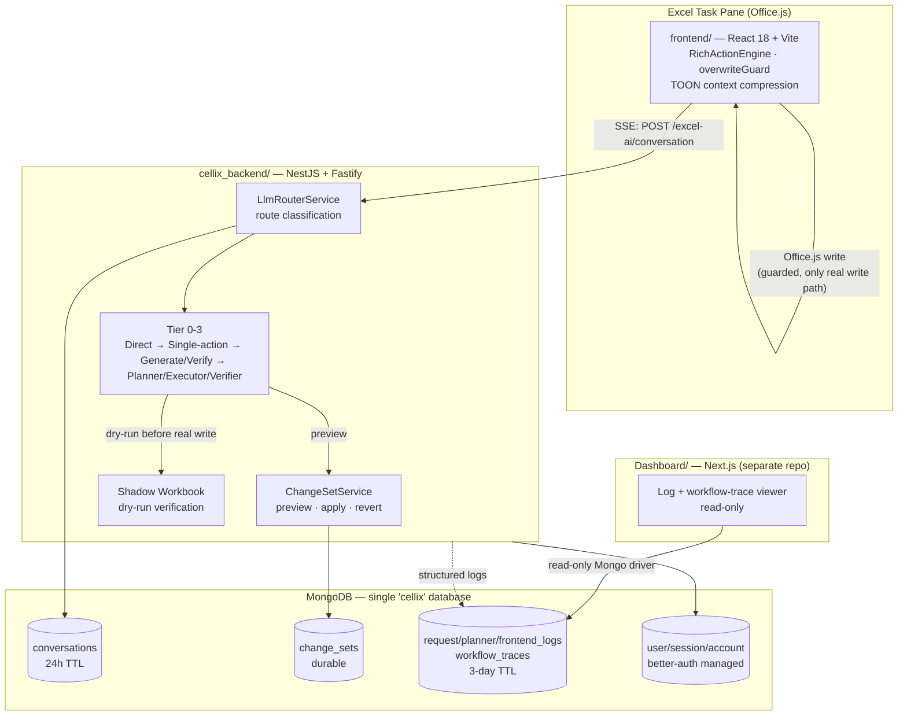
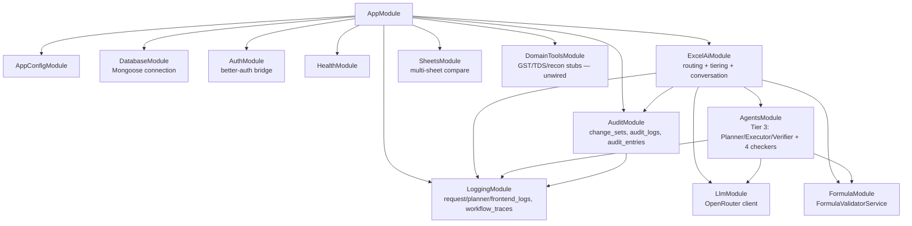
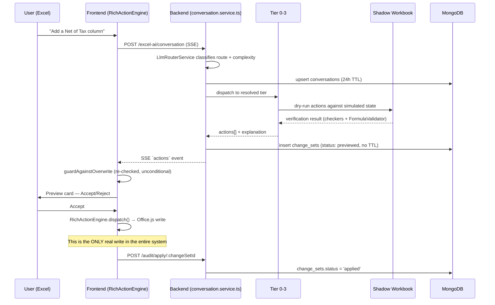

# ARCHITECTURE.md — Cellix

> System design, key decisions, and tradeoffs. `VISION.md` names this file as where architecture belongs; it didn't exist until now — `CODEBASE_ANALYSIS.md` §3.12 flagged the gap directly. This document exists to write down decisions that currently only live implicitly in code, so they stop being rediscovered by accident.
>
> Companion documents: `VISION.md` (why), `PRD.md` (what, for whom, by when), `CODEBASE_ANALYSIS.md` (what actually exists today, verified). This document is the middle layer — how the pieces fit and why they're shaped the way they are — and the design proposal for what PRD's must-have M5.1/M5.2 require going forward.
>
> *Proposed: August 17, 2026. Sections marked **Proposed** describe target design, not current code — cross-check against `CODEBASE_ANALYSIS.md` before assuming something described here already exists.*

---

## 1. System Overview

**The one sentence that matters most:** the backend never writes to the user's workbook directly. It reads a compressed context snapshot (TOON), plans and verifies against a **simulated** shadow copy, and returns actions for the frontend to apply through Office.js — which is the only code in the entire system that touches the real file. Every architectural decision about safety in this document traces back to that single fact.

---

## 2. Runtime Topology

| Component | Tech | Port (dev) | Persists to |
|---|---|---|---|
| `frontend/` | React 18 + Vite, Office.js add-in | `https://localhost:3000` | Nothing server-side of its own — `localStorage` for mode/session cache |
| `cellix_backend/` | NestJS 11 + Fastify | `4001` | MongoDB (`cellix` db) |
| `Dashboard/` | Next.js 16 | `3100` | Reads the same MongoDB; owns no writes except `import-logs.ts` |
| MongoDB | — | `27017` (local dev default) | — |

Three sub-projects are independently version-controlled (`cellix_backend`, `frontend` as unregistered gitlinks; `Dashboard` as a fully separate repo with its own remote) — this is a repo-hygiene problem documented in `CODEBASE_ANALYSIS.md` §3.1–3.2, not an architectural one, but it means "the codebase" is really four loosely-coupled codebases sharing a filesystem, which is worth keeping in mind when reading the module graph below: nothing enforces that `shared/action.types.ts` changes propagate to the other three.

---

## 3. Backend Module Graph

Notable asymmetry, carried forward from `CODEBASE_ANALYSIS.md` §2.1: `AgentsModule` (which owns `OverwriteOccupancyChecker`) is only reachable through `ExcelAiModule`'s Tier 3 path. `DomainToolsModule` exports a tool registry that nothing in `AgentsModule` currently imports — the wiring gap documented in the analysis is visible directly in this graph, not just in behavior.

---

## 4. Request Lifecycle — a write request end to end

The gap this diagram makes visible: the backend's `change_sets.status = 'applied'` update happens **after** the frontend has already written to Excel and told the backend it succeeded. There is no step where the backend independently confirms the write. This is consistent with `CODEBASE_ANALYSIS.md` §3.7's false-success finding (specs 10, 22, 24) — the "Applied" status the backend records is presently a claim relayed from the frontend, not a fact the backend verified. Worth deciding whether that's acceptable (frontend is trusted because it's the only writer) or worth closing.

---

## 5. Key Architectural Decisions

Each entry: **Decision** → **Why** → **Consequence / Tradeoff** → **Status**.

### AD-1 — The Excel task pane is the sole write boundary

**Decision:** Only `frontend/`'s `RichActionEngine`, via Office.js, ever writes to a user's workbook. The backend proposes and verifies; it never executes against a live file.

**Why:** Office.js only runs inside the host application (Excel). There is no supported way for a server process to open and mutate an arbitrary user's live workbook directly — the task-pane add-in *is* the access path. This is as much a platform constraint as a choice.

**Consequence:** Every safety mechanism in the product collapses to one question — "is the frontend's `overwriteGuard` correct and unbypassable?" — because it's the last (and only) line of defense before a real write. `CODEBASE_ANALYSIS.md` §2.1 confirmed it currently is: `guardAgainstOverwrite` runs unconditionally in `RichActionEngine.dispatch()`, for every write-shaped action type, immediately before the Office.js call, including on the Accept path. That's good news, but it's good news the system currently depends on implicitly rather than by declared contract.

**Status: Implemented, correct, but not written down as an invariant until this document.** `PRD.md`'s D1 (task-pane-only for v1) keeps this true for the foreseeable future. **If D1 is ever revisited — e.g. the file-generation roadmap item in `VISION.md` materializes as a server-side writer — this decision must be revisited explicitly, not left to be rediscovered as a bug.** See §7.1.

### AD-2 — Complexity tiering trades verification depth for latency

**Decision:** Requests are routed to one of four tiers (`Tier0DirectService` → `Tier1SingleActionService` → `Tier2GenerateVerifyService` → the full `AgenticLoopService` Planner/Executor/Verifier pipeline), each doing progressively more LLM calls and progressively more verification.

**Why:** Per the specs this system was built against, ~85% of write traffic is simple enough that a full multi-agent pipeline is wasted latency (3–8s) for what could be sub-second. Tiering was the single highest-leverage fix in the project's own history.

**Consequence — the one worth stating plainly:** `OverwriteOccupancyChecker` (the backend's deterministic overwrite-safety check) only runs inside `AgenticLoopService`, i.e. **Tier 3 only**. Tiers 0–2 — the majority of traffic — rely entirely on AD-1's frontend guard, with no backend-side occupancy check at all. This is very likely fine given AD-1 (the frontend guard is universal across all tiers, since it sits below the tier split, at the actual write boundary), but it means "verification thoroughness" and "which tier a request landed in" are coupled in a way that isn't documented anywhere else. A future change to how Tier 0/1/2 resolve their target ranges should not assume backend-side occupancy protection exists — it doesn't, at those tiers.

**Status: Implemented.** Consequence is an accepted tradeoff *conditional on AD-1 holding* — not independently re-justified anywhere until now.

### AD-3 — Verification via shadow-workbook simulation, not the live file

**Decision:** Before returning actions to the frontend, Tier 2/3 dry-run them against `virtualApply.ts`'s in-memory simulation of the workbook (`WorkbookContext` derived from the TOON-compressed snapshot), not against the actual open Excel session.

**Why:** Consistent with AD-1 — the backend has no live access to the real file, only the snapshot it was given. Simulating is the only way to verify before committing to a real write.

**Consequence:** The shadow workbook cannot simulate everything. `CODEBASE_ANALYSIS.md` §3.6 found ~7 action types fall through an uncommented `default: break` (including `FILL_DOWN`/`FILL_RIGHT`, which genuinely mutate real cell values but are invisible to the verifier). This is a direct, structural consequence of AD-3, not a separate bug to fix in isolation — any action type added in the future needs an explicit simulation case or an explicit, documented decision that it's unverifiable pre-apply.

**Status: Implemented, with known coverage gaps.** Recommend: audit every `virtualApply.ts` case for an explicit comment (either "simulates X" or "intentionally not simulated because Y") — the uncommented silent fallthroughs are the actual risk, not the documented no-ops.

### AD-4 — Two-tier data retention: ephemeral working memory vs. durable audit trail

**Decision (confirmed from schema, not previously documented anywhere):** `conversations` auto-expire 24 hours after creation (`expiresAt`, point-in-time TTL). `change_sets`, `audit_logs`, and `audit_entries` carry **no TTL** — they persist indefinitely once written.

**Why (inferred, not found written down anywhere — worth the team confirming this was the intent):** a conversation is working memory — chat turns, cached TOON hashes, in-flight clarification state — genuinely fine to lose after a day. A change set is the audit/revert record of an actual modification to the user's file — the kind of thing `VISION.md`'s "never-destroy-user-work principle" implies should outlive the chat session that produced it.

**Consequence — a real gap this reveals, not previously documented:** `change_sets.conversationId` references a document that may already be gone. `GET /audit/history/:conversationId` (the existing revert-history endpoint) depends on the caller still holding a `conversationId` that may have rotated after 24 hours of use. There is currently **no stable identifier for "this workbook" that survives a conversation reset** — only the ephemeral `conversationId`. A user doing multi-day work on the same file has no durable handle the system already gives them to look up their own change history past the 24h mark, even though the change sets themselves are sitting in the database, undeleted, unreachable by the normal query path.

**Status: Existing gap, not previously identified.** This becomes load-bearing the moment checkpoints (PRD's M5.2) are built — see AD-9 and §7.2, which propose the fix.

### AD-5 — LLM access abstracted through OpenRouter

**Decision:** All LLM calls go through `@openrouter/sdk`, configured via `OPENROUTER_MODEL_LOW/MEDIUM/HIGH` env vars, rather than calling a single provider's SDK directly.

**Why:** Model-agnostic — swapping the underlying model (or provider) per tier is a config change, not a code change. `audit_logs` captures `llmModel`, `promptTokens`/`completionTokens`, `estimatedCostUsd`, and `latencyMs` per call, which only makes sense as a design if model/cost comparison across providers was an anticipated need.

**Consequence:** None negative identified. This is the one decision in this list with no open tradeoff — noted for completeness since it's genuinely load-bearing for `PRD.md` §9's competitive positioning (cheap to benchmark a different model per tier if reliability numbers demand it).

**Status: Implemented, no action needed.**

### AD-6 — SSE for conversation streaming, not WebSockets

**Decision:** `POST /excel-ai/conversation` streams `chunk`/`actions`/`status`/`tool_request`/`error` events over Server-Sent Events, one-directional (server → client), with a separate `POST /excel-ai/conversation/tool-result` endpoint for the client to answer a mid-stream tool request.

**Why:** The conversation is fundamentally one long-running server-driven response with occasional client call-backs (tool requests) — not a bidirectional real-time channel. SSE is simpler infrastructure (plain HTTP, no separate protocol upgrade, works through the same Fastify request lifecycle) for a pattern that doesn't need full duplex.

**Consequence:** The tool-request/tool-result split means a single logical turn is actually two HTTP round trips glued together server-side. This works but means correlating a `tool_request` to its matching `tool_result` needs a real ID scheme; from `sse.emitter.ts`'s existence, one already exists. Not investigated further in this pass — noted as a place to look if tool-call reliability ever becomes a symptom.

**Status: Implemented, sound choice for the current interaction shape.**

### AD-7 — Action-type contract: intended single source of truth, actual state is fragmented

**Decision (intended):** `shared/action.types.ts` is meant to be the one definition of every `SheetAction`/`RichAction`, imported by both `frontend/` and `cellix_backend/`.

**Reality, per `CODEBASE_ANALYSIS.md` §3.3:** five files currently claim a piece of this — `shared/action.types.ts` (~50 types), the frontend's own drifted local copy (~confirmed missing interfaces, phantom `'SHOW_ROW'` variant), the backend's live dispatch union (~65 types — a superset, not a match), a smaller legacy fragment at `src/actions/action.types.ts`, and a new `action-catalog.ts` exhaustiveness map that only checks the backend's internal consistency, not cross-repo agreement.

**Proposed fix (design only — see §7.3 for what's breaking vs. safe):**
1. Designate `shared/action.types.ts` as authoritative in practice, not just in `CLAUDE.md`'s prose.
2. Delete the frontend's local fork; import from `shared/` directly. Per the frontend deep-dive, the *runtime* dispatch code already uses the correct type strings (`UNHIDE_ROW`, not the phantom `SHOW_ROW`) and only the type-only file has drifted — this makes the fix a compile-time correction with no expected behavior change, not a functional rewrite.
3. Extend the `action-catalog.ts` exhaustiveness-check pattern into a test that fails if `shared/`'s type union, the backend's live union, and (post-fix) the frontend's union disagree — turning "five files, no enforcement" into "one file, enforced sync."
4. Confirm whether `src/actions/action.types.ts` (the legacy fragment) has any remaining imports; if none, delete it.

**Status: Proposed, not started.** Sequencing matters — see §7.3.

### AD-8 — Domain-tool layer built as unwired scaffolding, deliberately

**Decision:** GST/ITC/TDS/bank-recon/Ind-AS logic exists as a real tool-call contract (`DomainTool<TIn,TOut>`, a registry, an audited invocation wrapper, an architecture test forbidding LLM imports in that call graph) — but every actual implementation throws `'Not implemented — requires CA-reviewed spec before production use.'`, and `ExecutorAgent` never calls the registry.

**Why:** Per `specs/00_OVERVIEW.md`'s own stated constraint: "domain arithmetic is plain, versioned, unit-tested code — never LLM-computed at runtime." Building the contract and audit-logging plumbing ahead of the logic means that when compliance-reviewed logic does land, it slots into an already-tested calling convention rather than needing the plumbing built under deadline pressure alongside the first real domain feature.

**Consequence:** the citation/provenance layer (`sourceRefs`, enforced as "domain-tool-backed writes must include non-empty `sourceRefs`") is fully built and currently unreachable, since nothing calls the one code path that would populate it. This is intentional sequencing, not dead code — but it means testing that enforcement rule today requires synthetic test data rather than a real end-to-end path.

**Status: Implemented as scaffolding. Wiring is explicitly gated on CA sign-off — `PRD.md` §8 Q4 — not an engineering decision.**

### AD-9 (Proposed) — Checkpoint/restore: chain-of-inverses, not full-workbook snapshots

This is new design work, directly answering `PRD.md` §8 Q1 ("what does a checkpoint need to hold to be restorable within Office.js constraints?") and implementing the must-have PRD promoted via its D5 (M5.1 full-fidelity revert, M5.2 snapshot-backed checkpoints).

**The fork:** a "checkpoint" could mean two structurally different things.

| | **Option A — Chain of inverse change-sets (recommended)** | **Option B — Full workbook snapshot** |
|---|---|---|
| What's stored | Nothing new at checkpoint-creation time — just a marker record pointing at "the last `change_set` applied so far." | The frontend serializes the entire used range (values, formulas, formats, chart/table definitions) and the backend stores it as a blob. |
| How restore works | Walk every `change_set` applied after the marker, newest-first, and apply each one's full inverse (per M5.1). | Overwrite the current workbook state with the stored blob directly. |
| Cost to build | Reuses M5.1's inverse-action work entirely — a checkpoint *is* a pointer, restore *is* a replay. | A new serialization format, a new storage path, and a new "does this differ from what Office.js can practically read/write in one shot" question. |
| Storage cost | O(1) per checkpoint — a marker record. | O(workbook size) per checkpoint, repeated for every checkpoint taken. |
| Restore cost | O(n) — replays every change set since the checkpoint. Fails closed (see below) if any one inverse is incomplete. | O(1) conceptually, but requires the *entire* blob to be both complete and correctly reapplied — a different, not obviously smaller, failure surface. |
| Data-handling posture | The backend already stores before/after cell diffs (`change_sets.beforeState`) — this doesn't change what kind of data the backend holds, just how it's indexed. | This would be the **first** place the backend stores something resembling a full copy of the user's workbook contents, not just diffs — a real change in data-handling posture worth a deliberate call, not a side effect of a feature. |

**Recommendation: Option A.** It's strictly cheaper, reuses the M5.1 investment PRD already committed to, and doesn't introduce a new category of data the backend holds. Its real cost is a correctness dependency: restore is only as reliable as the weakest inverse in the chain. That's the same requirement M5.1 already states — *"where a true inverse is genuinely impossible, the action is identified as irreversible at preview time"* — so a restore that would hit an irreversible link should refuse loudly and name the specific blocking change, never partially restore and report success. This is the A1 "no false success" rule, applied to restore.

**What this requires that doesn't exist today (see AD-4):** a stable identifier for "this workbook" that survives past a 24-hour conversation reset, so the restore chain can be scoped correctly across sessions. Proposed in §7.2: mint a `workbookId` client-side via Office.js's `document.settings` (a key-value store that persists *inside* the .xlsx file itself, surviving close/reopen — unlike `conversationId`, which is a session concept), and thread it through `conversations`, `change_sets`, and the new `checkpoints` collection as the durable correlation key.

**Status: Proposed. See `DATABASE_SCHEMA.md` §5–6 for the concrete schema.**

---

## 6. Non-Architectural Non-Goals

Cross-referencing `PRD.md` §5 rather than restating it: everything there (web upload, standalone file generation, real-time collaboration, scheduled autonomous workflows) is also an architectural non-goal for the same reasons — each would either break AD-1 (introduce a second write path) or require infrastructure (WebSockets/real-time sync for collaboration, a job scheduler for autonomous runs) this document deliberately doesn't design for for now.

One addition specific to this document: **no message queue / job runner exists or is proposed.** Every request is handled synchronously within its own HTTP/SSE connection lifetime. If Tier 3's multi-agent loop or a future large-prompt phase (`PRD.md` M8) ever needs to survive a dropped connection or run longer than an HTTP request reasonably should, that's a real architectural addition, not a tuning change — flagged here so it isn't discovered mid-incident.

---

## 7. Breaking Changes Required

Consolidated across all decisions above, classified by actual impact. "Breaking" here means: changes existing behavior, an existing contract, or requires a migration — not just "requires writing new code."

### 7.1 Not breaking — safe to do independently

- **AD-7, frontend action-types fork:** deleting the frontend's local copy and importing `shared/action.types.ts` directly. Runtime dispatch already uses the correct values; only the type declarations are wrong. Compile-time-only fix.
- **AD-7, cross-repo exhaustiveness check:** purely additive (a new test). **Sequencing note:** it will fail immediately if added before the frontend fork above is fixed — do that first.
- **AD-9 / M5.1, extending `CellChangeSchema` usage:** the schema already has a `format` field captured per cell (`CellSnapshotSchema.format`) that `diff.engine.ts`'s inverse-builder currently ignores. Making the inverse-builder use a field that already exists is a code change, not a schema change — no migration needed.
- **AD-9 / M5.1, adding structural-op capture:** proposed as a new, optional, parallel array on `ChangeSet` (`structuralOps`), not a change to the existing `changes: CellChangeSchema[]` shape. Old readers of `changes` are unaffected. See `DATABASE_SCHEMA.md` §5.
- **AD-9 / M5.2, new `checkpoints` collection:** a wholly new collection. Nothing existing references it yet, so nothing existing can break.
- **AD-8, domain-tool wiring (when it happens):** the Executor gaining the ability to call the tool registry is additive — existing non-domain requests are unaffected.

### 7.2 Breaking in behavior, not in code contract — needs a product decision, not just an engineering one

- **AD-2, extending overwrite-occupancy checking to Tiers 0–2:** if this is ever done (it currently is not — a live gap, not a proposal here), it would mean some Tier 0–2 requests that previously succeeded silently now stop and require explicit confirmation, the same flow Tier 3 already enforces. This is a **user-facing behavior change** (more friction on some requests that used to just work), done in the name of safety. Whether to do this depends on whether AD-1's "frontend guard is sufficient because it's the only write path" reasoning is judged adequate on its own — `PRD.md` §4.3 Q4 already asks this; this document doesn't re-decide it, just names the concrete behavioral consequence either way.

### 7.3 Requires a migration or coordinated rollout

- **AD-4/AD-9, `workbookId` introduction:** requires (a) new frontend code to mint and persist an ID via Office.js `document.settings` — a real frontend change, out of scope of "docs only" but named here since it's load-bearing for M5.2; (b) a decision about **existing** `change_sets`/`conversations` that have no `workbookId` and never will (there's no way to retroactively derive one from data already written) — proposed handling: treat them as legacy, reachable only via the existing `conversationId`-keyed lookup, while everything new also gets `workbookId`. This is additive at the schema level (new optional field) but is a real compatibility decision, not a free action.
- **AD-7, deleting `src/actions/action.types.ts`:** breaking *if and only if* something still imports it. Not verified in this pass — grep for imports before deleting, not after.

No change proposed in this document requires an existing collection's shape to be altered destructively, an existing field to change type, or an existing API contract to change its request/response shape. Every schema-level addition here is additive by design (see `DATABASE_SCHEMA.md` §7 for the full classification) — the real costs are in new code paths and the two compatibility decisions above, not in migrating data that already exists.

---

## 8. Open Questions Specific to This Document

Distinct from `PRD.md` §8 and `CODEBASE_ANALYSIS.md` §4 — those still stand; these are new, surfaced by writing this document.

1. **AD-4's retention split** (`conversations` 24h vs. `change_sets`/`audit_logs` unbounded) — was this an explicit decision, or did the audit collections simply never get a TTL added when the log collections did? If unintentional, `audit_logs`/`audit_entries` growing forever is worth a deliberate retention policy, not silence.
2. **AD-9's recommendation (chain-of-inverses over full snapshots)** — this document picked a direction because a decision was needed to write concrete schema, but it's a real fork with a real cost (restore reliability depends on every intermediate inverse being complete). Confirm this is the direction you want before `DATABASE_SCHEMA.md`'s proposed `checkpoints` collection gets built against it.
3. **§7.2's behavioral tradeoff** — extending occupancy checking to Tiers 0–2 trades speed/friction for safety on the 85% of traffic that currently has only the frontend guard. Worth a decision now, independent of whether it's implemented immediately, so AD-2's tradeoff is a chosen one rather than a discovered one.
