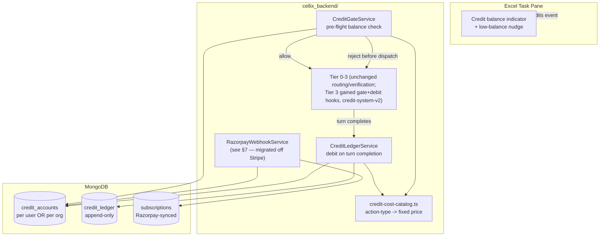

# CREDIT_SYSTEM.md — Cellix

> Companion to `ARCHITECTURE.md` (system design), `DATABASE_SCHEMA.md` (schema detail — see `CREDIT_SYSTEM_SCHEMA.md` for this feature's additions), and `cellix-pricing-v3.html` (the business/pricing model this document implements). Where the pricing doc states a number or a rule, this document does not re-derive it — it says how the system enforces it.
>
> *Drafted: September 4, 2026. Status: mostly built. See TASKS.md #179/#180/#181/#188/credit-system-v2 for what actually shipped, in order — including the 2026-09-10 "credit-system-v2" pass that re-priced the catalog around real GLM model costs, added a Beta tier, added Tier 3 metering, and migrated the payment layer from Stripe to Razorpay (the original intent this doc always had — §7 below now reflects that, not Stripe).*

---

## 1. What this system is, in one sentence

Every billable action in Cellix has a **fixed credit price**, looked up from a static catalog — not a live conversion of actual LLM token spend — and a request is checked against the caller's credit balance *before* any LLM call is made, with the debit itself firing once, when the action completes.

This is a deliberate simplification relative to a metered-billing model: `audit_logs.estimatedCostUsd` (already captured per LLM call, per `ARCHITECTURE.md` AD-5) remains the signal for **margin monitoring** — but it is not what a user is charged. A user is charged the catalog price for the action they ran, regardless of whether that particular run happened to use more or fewer tokens than average.

**Updated 2026-09-10 (credit-system-v2):** the original ~₹0.35/credit blended-COGS assumption above was sized against GPT-5-class model costs. The backend has since switched its default models to GLM (`.env`'s `OPENROUTER_MODEL_LOW/MEDIUM/HIGH`), which is roughly **18.7x cheaper per token** — confirmed by re-deriving the ratio directly from OpenRouter's live pricing (GLM 5.3 Flash ~$0.15/$0.50 per 1M tokens vs. GPT-5's $1.25/$10). The credit allotments below (Free/Beta/Solo) were re-priced around this real cost, not the stale ₹0.35 figure — treat that number as historical context for how the ORIGINAL numbers were chosen, not as today's actual COGS-per-credit.

---

## 2. System Overview

**The one sentence that matters most:** nothing about Tier 0–3's actual routing, verification, or write path changes. The credit system is two hooks around the existing pipeline — a gate before dispatch, a debit after completion — not a rework of `conversation.service.ts`'s dispatch logic.

---

## 3. Key Decisions

### CD-1 — Fixed catalog pricing, not metered billing

**Decision:** Every billable action maps to an exact credit cost, defined once in `credit-cost-catalog.ts`, sourced directly from `cellix-pricing-v3.html`'s Credit Cost Map:

| Action / Task | Credits | Notes |
|---|---|---|
| Formula Q&A — simple | 2 | Tier 0 |
| Formula Q&A — complex (multi-sheet, array logic) | 5 | Tier 0/1 |
| Formula Generate or Fix (write-to-cell) | 8 | Most common paid action |
| Data Cleanup — Tally export normalisation | 10 | Per sheet |
| GSTIN Validation Batch | 3 | Per 100 GSTINs |
| GST Reconciliation (GSTR-2B vs Purchase Register) | 22 | **Unwired — see CD-5** |
| ITC Computation Run | 18 | **Unwired — see CD-5** |
| TDS Compliance Check (section-wise) | 12 | **Unwired — see CD-5** |
| ICAI Audit Trail PDF Export | 4 | Backend-heavy, minimal LLM |
| MIS Dashboard / Report Build | 28 | Highest single-task cost |
| e-Invoice Validation | 1 | **Per invoice — quantity multiplier, see CD-2** |
| Bank Reconciliation Assist | 15 | **Unwired — see CD-5** |
| Tier 3 Agentic Build (multi-sheet, Planner→Executor→Verifier) | 100/subtask | **Added 2026-09-10 (credit-system-v2)** — priced per DELIVERED subtask (see CD-2's per-unit pattern), not a flat price. A real Tier 3 build's token cost is orders of magnitude beyond every other single catalog entry, so it needed its own category rather than reusing one; a large 20-subtask build costs ~2,000 credits. |

**Why:** Predictable pricing is a stated product goal (`cellix-pricing-v3.html`'s "petrol gauge, not a countdown timer" framing) — a user should be able to know in advance what an action costs, which a live token-count-based price cannot offer.

**Consequence:** COGS variance is absorbed by Cellix, not passed to the user. A GST Reconciliation that happens to need more Sonnet tokens than average still costs the user exactly 22 credits. This is already priced into the ~80% blended gross margin the pricing model assumes — it is not a new risk this document introduces.

**Status:** Proposed. Catalog values are a direct transcription of the pricing doc — do not hand-tune these without updating that document first, or the two will drift the same way `ARCHITECTURE.md` AD-7 describes for action types.

### CD-2 — Quantity-scaled actions are priced per unit, not per request

**Decision:** e-Invoice Validation (1 credit) and GSTIN Validation Batch (3 credits per 100 GSTINs) scale with the size of the input, not the number of requests. The catalog stores a **per-unit** price and a **batch size**; the debit hook multiplies by the actual quantity processed (e.g. 340 GSTINs → `ceil(340/100) * 3` = 12 credits).

**Why:** A flat per-request price for these two actions would make a 1-invoice validation and a 500-invoice validation cost the same, which doesn't match the doc's own "per invoice" / "per 100 GSTINs" framing.

**Consequence:** These two catalog entries need an explicit `unit` field distinct from every other entry's flat price — the catalog type needs a discriminated union (`{ kind: 'flat', credits: number } | { kind: 'per-unit', creditsPerUnit: number, unitSize: number }`), not a single `number` column, from the start. Retrofitting this after the catalog ships as flat numbers would be a breaking type change.

**Status:** Proposed.

### CD-3 — Debit fires once, at turn completion, not per LLM call

**Decision:** The credit ledger is debited exactly once per completed action — when a `ChangeSet` is created (write-shaped work) or a final answer is streamed (read-only Q&A) — never per individual OpenRouter call inside a multi-call Tier 3 run.

**Why:** Since price is fixed per action-type (CD-1), there is nothing to meter mid-run. Debiting per-call would also fight the no-overdraft rule (CD-4): a Tier 3 Planner/Executor/Verifier loop makes several LLM calls before it has a result, and none of them individually represents "the user got value" — only the completed turn does.

**Consequence:** If a Tier 3 run fails entirely (no ChangeSet, no answer — a genuine backend error, not a user rejection), **no debit occurs**. A user is never charged for a run that produced nothing. If a run completes but the user rejects the resulting preview, the debit **still occurs** — the LLM work was done and verified; rejection is a decision about the workbook, not a refund trigger. This mirrors the existing UX principle that Reject is a workbook-state no-op (`TASKS.md` #148), not a billing no-op.

**Status:** Proposed.

### CD-4 — No overdraft: finish the current task, block the next request

**Decision:** A request already in flight (including a long Tier 3 agentic loop) is never interrupted for lack of credits. The **next** incoming request is what gets checked, and is rejected before any LLM call if the balance is insufficient for that request's catalog price.

**Why:** Interrupting a Tier 3 run mid-loop would leave a workbook in a partially-built, possibly-inconsistent state — directly contradicting `ARCHITECTURE.md` AD-1's "never-destroy-user-work" posture — purely to save a few credits' worth of LLM cost. Blocking the *next* request has zero such risk.

**Consequence:** A single expensive run (e.g. a 28-credit MIS Dashboard Build) can take a balance from slightly positive to negative if the account had less than 28 credits available when the gate check ran with a race — see CD-6. This is treated as an acceptable, rare edge case, not a designed allowance: it is a **timing artifact of check-then-act**, not an intentional credit-based overdraft facility. No product-facing "overdraft" messaging should ever be shown; the ledger simply shows a temporarily negative balance that the next debit's gate check will catch and block on.

**Status:** Decided (2026-09-04) — explicitly **not** the pricing doc's original "allow overdraft up to 50 credits, bill next invoice" proposal. That proposal is superseded by this decision; if it needs revisiting, it should be revisited as a deliberate product change, not silently reintroduced.

### CD-5 — Sequencing against AD-8's domain-tool gate

**Decision:** GST Reconciliation, ITC Computation, TDS Compliance Check, and Bank Reconciliation Assist are priced in the catalog (CD-1) but their underlying `DomainToolsModule` implementations are unwired scaffolding per `ARCHITECTURE.md` AD-8, gated on CA sign-off. The credit system ships with these four catalog entries marked `status: 'unwired'` — present for pricing-page and future-proofing purposes, but with no code path that can actually trigger their debit yet.

**Why:** The credit system (accounts, ledger, gate, debit hook) is independently valuable and independently shippable against the action types that already exist (Formula Q&A, Formula Generate/Fix, Data Cleanup, GSTIN Validation, Audit Trail Export) — these alone cover the majority of the pricing doc's own "typical Solo CA month" breakdown (388 of 500 credits). Blocking the whole credit system on AD-8's compliance gate would be a self-inflicted delay.

**Consequence:** The catalog-exhaustiveness test (CD-1) must special-case these four as "declared but intentionally unreachable," the same pattern `ARCHITECTURE.md` AD-8 already establishes for the domain-tool registry itself — not a gap the test should silently pass over, and not a failure it should raise either.

**Status:** Proposed. Wiring these four is additive once AD-8 clears — no credit-system architecture change needed, only removing the `unwired` marker and connecting the debit hook to the (by-then-real) domain-tool call site.

### CD-6 — Race condition handling: atomic decrement, not read-then-write

**Decision:** Both the gate check's balance read and the debit's balance write use MongoDB's atomic `findOneAndUpdate` with a `$inc` and a `balance >= cost` filter condition in the same operation — never a separate read followed by a separate write.

**Why:** A user with two Excel sessions open (or a Firm-plan pooled account with 5 seats active simultaneously) can otherwise race two concurrent requests, both reading "sufficient balance" before either writes its debit, resulting in two debits against a balance that could only truly afford one.

**Consequence:** The gate check and the debit are effectively the same atomic operation for actions where cost is known up front (everything except the Tier 3 case in CD-3, where the gate check happens before cost is fully known and the debit happens after). For Tier 3: the gate check verifies *some* minimum balance exists (e.g., greater than zero) before allowing dispatch, and the actual atomic debit-with-floor-check happens at completion — meaning a Tier 3 completion **can** legitimately drive a balance negative under CD-4's accepted-edge-case allowance, but two Tier 3 runs cannot each independently believe they're being permitted when only one debit's worth of balance exists, because the completion-time debit is what's atomic, not the pre-flight gate.

**Status:** Proposed.

---

## 4. Data Model — accounts vs. pools

### CD-7 — Billing entity is the account key, not always the user

**Decision:** `credit_accounts` is keyed by **billing entity ID**, which is:
- the `userId`, for Free and Solo plans
- a new `orgId` (workspace), for Firm and Enterprise plans, with member `userId`s attached as seats on that org

**Why:** The Firm plan's 3,000 credits are explicitly **pooled across up to 5 seats** (`cellix-pricing-v3.html`) — a single shared balance, not five separate 600-credit balances. Modeling this as `userId`-keyed from the start would require a breaking migration the moment the first Firm client signs up.

**Consequence:** Every credit-consuming code path needs to resolve "which billing entity does this request's user belong to" before it can find the right `credit_accounts` document — a new lookup, most naturally a field on the user/session record (`orgId?: string`, null for Solo/Free users) resolved once at request start, not re-derived per action.

**Status:** Proposed. See `CREDIT_SYSTEM_SCHEMA.md` §2 for the concrete schema.

### CD-8 — Three credit buckets, consumed in a fixed order

**Decision:** A `credit_accounts` document holds three separate numeric fields, never blended into one balance:

1. `planCredits` — resets to the plan's monthly allotment each billing cycle, **does not roll over** (unused credits are lost at cycle end — matches the pricing doc's "intentional breathing room, not banked" framing)
2. `purchasedCredits` — top-up pack credits, **persist indefinitely**, never expire, unaffected by plan renewal or cancellation
3. `oneTimeCredits` — the Free tier's one-time grant (120 credits as of 2026-09-10's repricing, up from the original 30 — see `FREE_TIER_ONE_TIME_CREDITS`), issued once at signup, never reset, never added to again

Consumption order: `planCredits` → `purchasedCredits` → `oneTimeCredits`.

**Why:** Keeping these separate is what makes CD-9's ledger entries meaningful (a support question — "why did my top-up disappear when my plan renewed?" — needs to be answerable as "it didn't, plan credits reset independently"), and matches the pricing doc's explicit statement that purchased credits must never feel like they evaporate.

**Status:** Proposed.

### CD-9 — Append-only ledger, mirroring existing audit conventions

**Decision:** `credit_ledger` records every grant, purchase, and debit as an immutable row — never updated, never deleted. For pooled (Firm/Enterprise) accounts, each debit row records the specific `userId` (seat) that triggered it, even though the balance itself lives on the org.

**Why:** This is the same pattern `ChangeSetService`/`audit_logs` already establish elsewhere in this codebase — a durable, replayable record beats a single mutable counter, both for support/dispute resolution and for the Firm plan's promised "per-member usage analytics" feature, which needs exactly this per-seat attribution to exist.

**Status:** Proposed. See `CREDIT_SYSTEM_SCHEMA.md` §3.

---

## 5. Frontend surface

- A persistent credit balance indicator in the task pane — always visible, never something the user has to dig for (per the pricing doc's "petrol gauge, not countdown timer" instruction).
- A new SSE event type, `credits`, added alongside the existing `chunk`/`actions`/`status`/`tool_request`/`error` stream (`ARCHITECTURE.md` AD-6), emitted once per completed debit so the balance updates live rather than only on next page load — this matters most for a multi-minute Tier 3 run where the debit happens well after the user last saw a balance number.
- A low-balance nudge (client-side, triggered below 20% of plan allotment): neutral copy, no shaming, matching the pricing doc's exact specified tone — "You have 100 credits remaining — enough for ~2 GST reconciliations. Add 100 credits for ₹149 or see all plans."
- A blocked-request state (gate check rejected): clear, non-alarming copy, with direct links to the top-up checkout and the plans page.

---

## 6. Non-Goals

- **No metered/usage-based billing.** Every price is fixed per catalog entry (CD-1). `audit_logs`' per-call cost data is a margin-monitoring input, never a billing input.
- **No overdraft facility.** CD-4 supersedes the pricing doc's original overdraft proposal.
- **No proration of top-up credits** on plan change or cancellation — `purchasedCredits` simply persist as-is (CD-8); no calculation needed.
- **No per-seat individual balances on Firm/Enterprise** — the pool is genuinely shared, not five individual quotas that happen to display together.

---

## 7. Payment provider — Razorpay (built; migrated off Stripe 2026-09-10)

**Status: built, not "out of scope" anymore.** This section originally scoped the whole payment integration as follow-up work against Stripe. What actually shipped, in order: TASKS.md #179 (accounts/ledger/gate/debit against manually-seeded balances, no payment provider at all), #180/#181 (a real Stripe subscribe-checkout + webhook integration — Solo/Firm only, `checkout.session.completed` only), then the **credit-system-v2** session (2026-09-10) migrated that Stripe integration to **Razorpay** — which is what this document's own original framing ("Razorpay subscriptions from Day 1," per `cellix-pricing-v3.html` Phase 1) always specified; Stripe was a detour, not the destination.

**What's live today:**
- Subscriptions (Solo/Firm, plus the new **Beta** tier — see §8 update below) use **Razorpay's Subscriptions API** — a real recurring-billing product (Plan + Subscription objects, UPI Autopay/card mandate authorization), not manually-repurchased one-off links.
- `RazorpayWebhookService` handles `subscription.activated` (first charge) AND `subscription.charged` (every renewal) — both grant credits. This closes a real gap the Stripe integration never had: Stripe's handler only ever granted credits once, at initial checkout, with no renewal-grant logic at all.
- One-time top-up packs use **Razorpay Payment Links** (`payment_link.paid` webhook), authenticated via the task pane's existing session — not a marketing-site redirect, since a top-up debits/credits a specific signed-in user's account and the marketing site has no session with the backend.
- `grantPlanCredits(accountId, amount)` / `addPurchasedCredits(accountId, amount)` (CD-3's original call-in contract) are unchanged in shape — only what calls them changed providers.

**Known follow-up gaps, same shape as before, just against a different provider now:**
- Firm's pooled/org billing (`orgId`, seat-level allotment scaling) — still no code for this; Firm's 3,000-credit pool is unchanged and flagged as its own future decision.
- Enterprise accounts — still unresolved (§8 Q2).
- Payment-failure/dunning handling beyond the two `subscription.*` events listed above.
- Guest-checkout-email-to-real-account reconciliation (a marketing-site guest subscriber's email-keyed account vs. their real product userId).

---

## 8. Open Questions

1. **Does the Firm plan's pooled allotment grow when additional seats (₹999/seat/mo) are purchased beyond the base 5?** The pricing doc prices extra seats but doesn't state whether they add credits to the pool or just add users drawing from the existing 3,000. This changes `credit_accounts.planCredits`'s reset calculation for orgs with `seatCount > 5`. **Still open as of credit-system-v2 (2026-09-10)** — deliberately left untouched; no org/pooled-billing code exists yet to make this decision actionable.
2. **Enterprise accounts are "custom, negotiated" and inbound-only** — does the first Enterprise client get a manually-admin-granted `credit_accounts` document (no Razorpay plan object at all), or does Enterprise still flow through the same subscription plumbing with a custom price? Affects whether the payment integration needs an Enterprise-specific code path on day one or can defer it until an actual Enterprise deal exists. Still open.
3. **Razorpay payment failure / halted-subscription grace period** — Razorpay's subscription status vocabulary includes `halted` and `pending` states (distinct from Stripe's `past_due`) for a failed/retrying charge. Does a `subscription.halted` event freeze `planCredits` immediately, or does Razorpay's own retry window apply first? Affects whether the gate check needs to consult `subscriptions.status` in addition to raw balance. Still open — `RazorpayWebhookService` currently just records the status change, no gate-check consultation of it yet.
4. **Annual-plan refunds** (pricing doc's risk register: "pro-rata refunds always, no fight") — when a refund is issued, does any already-granted `planCredits` allotment get clawed back, or does the user simply lose access at cancellation with whatever they'd already been granted left alone? Needs a decision before the refund flow (whichever payment-ops surface handles it) can be built correctly. Still open.
5. **New (credit-system-v2): should the Beta cohort's 25-user cap be enforced in code?** Currently a manual/dashboard-tracked limit, not a counter or waitlist mechanism in this codebase — deliberate, since it's explicitly a small, hand-managed cohort per `cellix-pricing-v3.html`'s Phase 1 plan. Revisit if Beta needs to scale past a size a human can track by hand.
