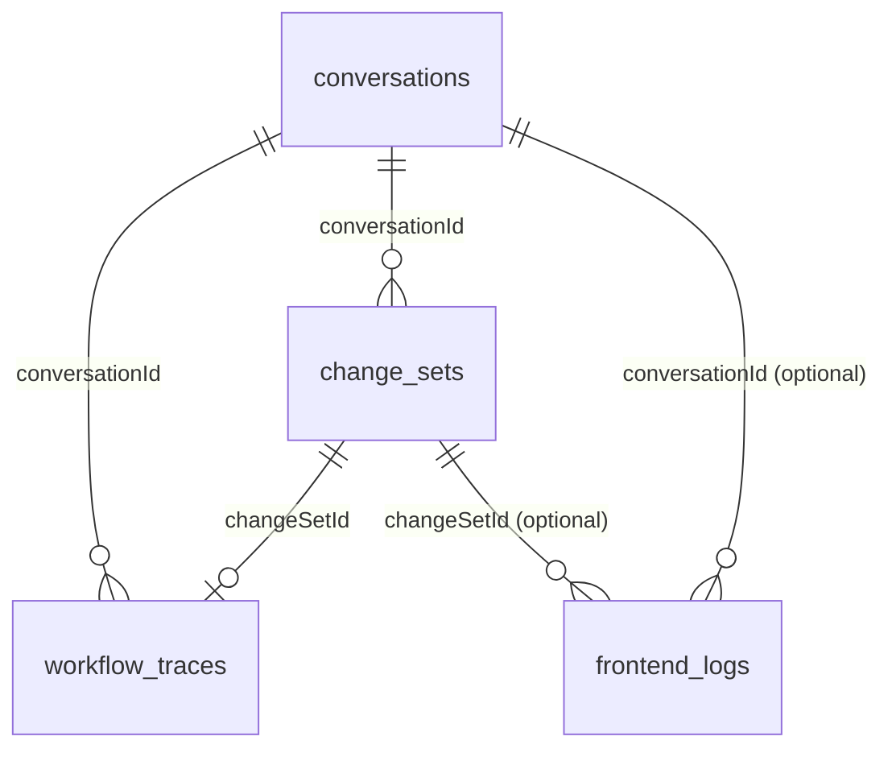

# DATABASE_SCHEMA.md — Cellix

> Current MongoDB schema (verified directly against `cellix_backend/src/**/schemas/*.ts` and module wiring — not inferred from `CLAUDE.md`'s prose), plus the proposed additions needed for `PRD.md`'s M5.1 (full-fidelity revert) and M5.2 (snapshot-backed checkpoints).
>
> Companion to `ARCHITECTURE.md` — AD-4 (retention tiers) and AD-9 (checkpoint design) are referenced throughout rather than re-argued here. Read that document's §5 first if the *why* behind a proposed field isn't obvious from this one.
>
> Sections 2–4 describe **what exists today**, verified by direct file reads. Sections 5–7 are **proposals**, clearly marked, not yet implemented.

---

## 1. Overview

One MongoDB database (`cellix`, per `MONGODB_DB_NAME`), one logical owner of the schema (`cellix_backend`, via Mongoose), one read-only external consumer (`Dashboard/`, via the raw `mongodb` driver, no ORM), and one self-managed subsystem (`better-auth`, via its own Mongo adapter, whose collections this codebase doesn't define but does share the database with).



This diagram is intentionally sparse — Mongo enforces none of these edges. They're conventions carried in string fields (`conversationId`, `changeSetId`, `traceId`, `correlationId`), not foreign keys. That's a legitimate and common Mongo pattern, but it means nothing stops a `change_sets` document from referencing a `conversationId` that no longer exists — which, per `ARCHITECTURE.md` AD-4, is not a hypothetical: it happens by design every time a conversation crosses its 24-hour TTL while its change sets live on.

---

## 2. Current Collections

### 2.1 `conversations` — session working memory

Owned by `excel-ai/schemas/conversation.schema.ts`. One document per conversation (chat session).

| Field | Type | Notes |
|---|---|---|
| `conversationId` | `string`, unique, indexed | Public ID, generated per session. **The only correlation key currently in existence for "this workbook" — see AD-4.** |
| `messages` | `ConversationMessageEntry[]` | Embedded subdocuments, `_id: false`. |
| `messages[].id` | `string` | |
| `messages[].role` | `'user' \| 'assistant'` | |
| `messages[].content` | `string` | |
| `messages[].type` | `'question' \| 'answer' \| 'command' \| 'clarification'`, default `'command'` | |
| `messages[].timestamp` | `Date`, default now | |
| `messages[].metadata` | `Object` (untyped at schema level) | Carries `actions`, `changeSetId`, `questionOptions`, `pendingIntent`, `pendingWritePlan` (multi-sheet write offers awaiting a short "yes" confirmation), `ambiguityScore`, `partialProgress`, `failedSubtask`, `turnActionRecords` (structured chart/range identity for follow-up-turn resolution). |
| `sheetSnapshot` | `Object` | `{ rowCount, columnCount, headers }` — lightweight, not the full TOON payload. |
| `lastSheetHash` | `string?` | Hash of the last TOON-compressed payload — `ContextCacheService` uses this to skip re-analysis when the sheet hasn't changed. |
| `cachedPromptContext` | `string?` | Cached `SheetAnalyzer` output, valid only while `lastSheetHash` still matches. |
| `status` | `'active' \| 'completed' \| 'error'`, default `'active'` | |
| `expiresAt` | `Date`, default `now + 24h` | **TTL field**, `expireAfterSeconds: 0` — Mongo expires the document at this exact timestamp, not relative to it. Whether `expiresAt` is refreshed on each new turn (extending the session) or fixed at creation was **not verified in this pass** — check `conversation.service.ts` before assuming either. |

Auto `timestamps: true` → also carries `createdAt`/`updatedAt`.

### 2.2 `change_sets` — the durable audit/preview/apply/revert record

Owned by `audit/schemas/change-set.schema.ts`. **No TTL.** This is the collection `PRD.md`'s M5.1 must extend.

| Field | Type | Notes |
|---|---|---|
| `changeSetId` | `string`, unique, indexed | |
| `conversationId` | `string`, indexed | References §2.1 — see AD-4's lifecycle mismatch. |
| `traceId` | `string`, indexed | Request-level correlation key, distinct from `conversationId`'s session-level scope. |
| `timestamp` | `Date`, default now | |
| `prompt` | `string` | The user request that produced this change set. |
| `beforeState` | `Record<string, CellSnapshot>` (`Mixed`) | Keyed by cell address. Each `CellSnapshot`: `{ value: unknown, formula: string (default ''), format: string (default 'General') }`. |
| `changes` | `CellChange[]` | See below. |
| `actions` | `Record<string, unknown>[]` (`Mixed`) | The raw actions that were applied — the only place today that could recover a structural action's parameters (e.g. a created chart's `chartId`) after the fact. |
| `status` | `'previewed' \| 'applied' \| 'reverted'`, default `'previewed'` | |
| `appliedAt` | `Date?` | |
| `revertedAt` | `Date?` | |
| `provenanceConfidence` | `number?` | |

`CellChange` (embedded, `_id: false`):

| Field | Type | Notes |
|---|---|---|
| `cell` | `string`, required | |
| `sheet` | `string`, required | |
| `before` | `unknown` (`Mixed`) | |
| `after` | `unknown` (`Mixed`) | |
| `formula` | `string?` | |
| `isHardcoded` | `boolean`, required | Output of `FormulaValidatorService`'s hardcode lint. |
| `sourceRefs` | `Record<string, unknown>[]?` | Citation/provenance — populated only for domain-tool-backed writes, which per `ARCHITECTURE.md` AD-8 don't exist in production yet. |
| `exceptionFlags` | `Record<string, unknown>[]?` | |

**What this schema cannot currently represent, confirmed by inspection, matching `CODEBASE_ANALYSIS.md`'s finding:** `changes` is fundamentally cell-shaped. There is no field anywhere in this document for "a sheet was created," "a column was inserted," "a chart was added," or any other structural operation. `diff.engine.ts`'s inverse-action builder can only ever produce `SET_CELL`/`SET_FORMULA` inverses because that's all this schema gives it to work with for the *changes* it tracks structurally — though note `CellSnapshot.format` **is** already captured per cell and currently unused by the inverse builder (see §5.1 — this one is a free fix, not a schema gap).

### 2.3 `audit_logs` — LLM call cost/latency ledger

Owned by `audit/schemas/audit-log.schema.ts`. **No TTL found.**

| Field | Type | Notes |
|---|---|---|
| `traceId` | `string`, indexed | |
| `timestamp` | `Date`, default now, indexed | |
| `llmModel` | `string` | |
| `tier` | `'low' \| 'medium' \| 'high'` | Note: this is the **LLM router tier** (cost/model tier), a different concept from the **complexity tier** (0–3) used elsewhere — same word, two different axes. Worth being careful not to conflate when reading logs. |
| `intent` | `string` | |
| `promptTokens` / `completionTokens` / `totalTokens` | `number` | |
| `estimatedCostUsd` | `number` | |
| `latencyMs` | `number` | |
| `success` | `boolean` | |
| `errorCode` | `string?` | |
| `actionsCount` | `number?` | |
| `rawUsage` | `Record<string, unknown>?` (`Mixed`) | |

Backs `GET /audit/logs`, `/audit/stats`, `/audit/export` (JSON/CSV) — this is the cost/observability ledger, distinct in purpose from `request_logs`/`planner_logs` (§2.6–2.7), which are operational/debugging logs.

### 2.4 `audit_entries` — generic domain-tool invocation trail

Owned by `audit/schemas/audit-entry.schema.ts`. **No TTL found.** `timestamps: true`.

| Field | Type | Notes |
|---|---|---|
| `requestId` | `string`, indexed | |
| `processName` | `string`, indexed | |
| `action` | `string` | |
| `userId` | `string?` | |
| `confidence` | `number?`, range 0–1 | |
| `payload` | `unknown?` (`Mixed`) | |
| `result` | `unknown?` (`Mixed`) | |
| `createdAt` / `updatedAt` | `Date` | From `timestamps: true`. |

Per `ARCHITECTURE.md` AD-8: the write path this collection is designed to audit (`invoke-domain-tool.ts::invokeDomainToolLogged()`) exists and is fully wired for logging — but since `ExecutorAgent` never calls the domain-tool registry, this collection is currently empty in practice, not because it's broken, but because nothing calls it yet.

### 2.5 `workflow_traces` — the per-request DAG (backs the Dashboard's Workflow view)

Owned by `common/logging/schemas/workflow-trace.schema.ts`. **3-day TTL** on `ts`. Not mentioned in `CLAUDE.md` — see `CODEBASE_ANALYSIS.md` §1.5.

| Field | Type | Notes |
|---|---|---|
| `ts` | `Date`, required | **TTL field**, `expireAfterSeconds: LOG_TTL_SECONDS` (3 days). |
| `traceId` | `string`, required, indexed | |
| `conversationId` | `string?`, indexed | |
| `changeSetId` | `string?`, indexed | The most richly cross-referenced collection in the schema — carries all three correlation keys at once. |
| `message` | `string`, required | |
| `mode` | `string?` | `ask`/`plan`/`action`. |
| `route` | `string?` | |
| `tier` | `number?` | Complexity tier (0–3), not the LLM cost tier from §2.3. |
| `status` | `WorkflowTraceStatus`, required, indexed | `'running' \| 'completed' \| 'failed' \| 'clarifying' \| 'awaiting_accept' \| 'accepted' \| 'rejected'`. |
| `durationMs` | `number?` | |
| `nodes` | `WorkflowNode[]` (`Mixed`) | `{ id, type, label, status, startedAt?, endedAt?, durationMs?, input?, output?, meta? }`. `type` ∈ `frontend_in \| router \| tier \| planner \| executor \| verifier \| tool \| changeset \| sse_out \| preview \| accept \| reject \| error`. |
| `edges` | `WorkflowEdge[]` (`Mixed`) | `{ id, source, target }`. |
| `lastNodeId` | `string?` | Used to auto-link new nodes to the previous one as they're appended. |

Secondary indexes (not TTL): `{ conversationId: 1, ts: -1 }`, `{ changeSetId: 1 }`.

### 2.6 `request_logs` — HTTP request/response mirror

Owned by `common/logging/schemas/request-log.schema.ts`. **3-day TTL** on `ts`.

| Field | Type | Notes |
|---|---|---|
| `ts` | `Date`, required | TTL field. |
| `method` | `string`, required | |
| `url` | `string`, required, indexed | |
| `statusCode` | `number`, required | |
| `responseTimeMs` | `number`, required | |
| `reqId` | `string?`, indexed | |
| `traceId` | `string?`, indexed | |
| `message` | `string?` | |
| `response` | `unknown?` (`Mixed`) | |

`LOG_TTL_SECONDS = 3 * 24 * 60 * 60` is defined once in this file and imported by `planner-log`, `frontend-log`, and `workflow-trace` schemas — the single source of the "3 days" retention constant.

### 2.7 `planner_logs` — LLM agent call trace

Owned by `common/logging/schemas/planner-log.schema.ts`. **3-day TTL** on `ts`.

| Field | Type | Notes |
|---|---|---|
| `ts` | `Date`, required | TTL field. |
| `correlationId` | `string`, required, indexed | |
| `model` | `string`, required | |
| `durationMs` | `number`, required | |
| `success` | `boolean`, required, indexed | |
| `error` | `string?` | |
| `input` | `Record<string, unknown>`, required (`Mixed`) | Raw agent input — this is the collection `last_log.txt` (flagged in `CODEBASE_ANALYSIS.md` §3.10) was almost certainly dumped from. |
| `output` | `Record<string, unknown>`, required (`Mixed`) | Raw agent output, including `rawResponse`/`parsedResponse`. |

### 2.8 `frontend_logs` — client-side telemetry

Owned by `common/logging/schemas/frontend-log.schema.ts`. **3-day TTL** on `ts`.

| Field | Type | Notes |
|---|---|---|
| `ts` | `Date`, required, indexed | TTL field. |
| `level` | `'error' \| 'warn' \| 'info' \| 'action'`, required, indexed | |
| `category` | `'console' \| 'preview' \| 'accept' \| 'reject' \| 'apply' \| 'sse' \| 'navigation' \| 'other'`, required, indexed | |
| `event` | `string`, required, indexed | |
| `message` | `string`, required | |
| `conversationId` | `string?`, indexed | |
| `changeSetId` | `string?`, indexed | |
| `sessionId` | `string?`, indexed | |
| `workbookKey` | `string?` | The `localStorage` key used for per-workbook mode persistence on the frontend — **not** the same thing as a durable server-side workbook identity (see §6). |
| `userAgent` | `string?` | |
| `pageUrl` | `string?` | |
| `details` | `unknown?` (`Mixed`) | |

### 2.9 Collections managed outside this codebase: `better-auth`

`cellix_backend/src/auth/auth.ts` hands a raw `MongoClient`'s `db` handle to `better-auth`'s own `mongodbAdapter`, configured with Google/Microsoft OAuth, account linking, and database-backed OAuth state storage (`storeStateStrategy: 'database'`). **This codebase does not define these collections' schemas** — better-auth manages its own, conventionally named `user`, `session`, `account`, and `verification` (the last one backing the database-stored OAuth state, per the code comment explaining why `skipStateCookieCheck: true` is set). Exact field-level shape wasn't inspected in this pass — treat as external/vendored schema, not something to hand-edit or assume stability of across a `better-auth` version bump.

---

## 3. Retention Tiers

| Tier | Collections | Retention | Rationale (see `ARCHITECTURE.md` AD-4) |
|---|---|---|---|
| **Ephemeral working memory** | `conversations` | 24h from creation (refresh-on-update unverified) | Chat/session state — fine to lose. |
| **Ephemeral operational logs** | `request_logs`, `planner_logs`, `frontend_logs`, `workflow_traces` | 3 days | Debugging/observability, not the record of what happened to the user's data. |
| **Durable audit trail** | `change_sets`, `audit_logs`, `audit_entries` | **Unbounded — no TTL** | The actual record of modifications to user files, and LLM cost/compliance data. Whether "unbounded" was a deliberate choice or an oversight is `ARCHITECTURE.md` §8 Q1 — flagged, not assumed either way. |
| **Externally managed** | `user`, `session`, `account`, `verification` (better-auth) | Governed by `better-auth`'s own config, not this schema | |

---

## 4. Relationships / Correlation Keys — as they exist today

Three independent keys are in play, at three different granularities, and nothing enforces their relationships:

| Key | Granularity | Present on | Survives 24h? |
|---|---|---|---|
| `conversationId` | One chat session | `conversations`, `change_sets`, `workflow_traces`, `frontend_logs` | **No** — the *owning* `conversations` document expires; documents in other collections that reference it do not, becoming effectively orphaned references. |
| `traceId` / `correlationId` | One HTTP request / one agent call | `change_sets.traceId`, `audit_logs.traceId`, `request_logs.traceId`, `workflow_traces.traceId`, `planner_logs.correlationId` | N/A — request-scoped by nature, not meant to persist as a lookup key beyond debugging one request. |
| `changeSetId` | One applied/previewed modification | `change_sets.changeSetId`, `workflow_traces.changeSetId`, `frontend_logs.changeSetId`, embedded in `conversations.messages[].metadata.changeSetId` | Yes — `change_sets` itself has no TTL, so this key is durable. **This is the only currently-durable cross-collection key in the schema.** |

**The gap this table makes explicit:** there is no key today that identifies "this physical workbook" across conversation boundaries. `changeSetId` durably identifies one change; `conversationId` durably identifies nothing past 24 hours. Anything that needs to say "show me everything that's ever happened to this file" — which M5.2's checkpoints require by construction — has no key to group by. §6 proposes one.

---

## 5. Proposed Additions — M5.1 (Full-Fidelity Revert)

Per `ARCHITECTURE.md` §7.1, both changes below are **additive** — no existing field changes shape or meaning.

### 5.1 No schema change needed: use the `format` field that already exists

`CellSnapshot.format` (§2.2) is already captured on every `beforeState` entry and currently ignored by `diff.engine.ts`'s inverse-action builder. Restoring a cell's number format on revert requires a code change to `beforeStateToInverseActions()` to emit a `FORMAT_RANGE`-shaped inverse using this already-stored value — not a new field. Flagged here so it isn't mistaken for schema work when scoping M5.1.

### 5.2 New field: `ChangeSet.structuralOps`

```
structuralOps?: StructuralOp[]   // parallel to `changes`, not a replacement
```

`StructuralOp` (proposed, embedded, `_id: false`):

| Field | Type | Notes |
|---|---|---|
| `opType` | `string` | E.g. `'ADD_SHEET'`, `'DELETE_SHEET'`, `'INSERT_COLUMN'`, `'DELETE_COLUMN'`, `'INSERT_ROW'`, `'DELETE_ROW'`, `'CREATE_CHART'`, `'CREATE_TABLE'`, `'MERGE_CELLS'` — one entry per structural action type that isn't representable as a cell-level diff. |
| `sheetName` | `string` | |
| `params` | `Record<string, unknown>` (`Mixed`) | Enough to build the forward action (already captured today, informally, in `ChangeSet.actions`) **and** its inverse — e.g. for `CREATE_CHART`, the runtime-captured `chartId` (per `shared/action.types.ts`'s own comment: "Office.js name is captured on apply if omitted") must land here, not just in the raw `actions` blob, so the inverse (`DELETE_CHART` by that exact ID) is constructible without re-parsing free-form action JSON. |
| `appliedAt` | `Date` | |

**Why additive, not a replacement of `changes`:** anything currently reading `ChangeSet.changes` expecting only cell-level entries continues to work unmodified — structural operations simply weren't representable before and aren't removed from anywhere; they're newly captured in a field that didn't exist. `ARCHITECTURE.md` §7.1 classifies this as non-breaking on that basis.

---

## 6. Proposed New Collection — M5.2 (Checkpoints) and the `workbookId` it depends on

### 6.1 `workbookId` — new durable identity, threaded through existing collections

Per `ARCHITECTURE.md` AD-9/AD-4: checkpoints need to scope "everything since this point" across conversation resets, and no current key does that. Proposed: mint a `workbookId` client-side (frontend, via Office.js `document.settings` — a key-value store that persists **inside the .xlsx file itself**, unlike `localStorage` or `conversationId`, both of which are tied to the browser/session rather than the file) on first interaction with a given workbook, and add it as an **optional, additive** field to:

- `conversations.workbookId?: string` (indexed)
- `change_sets.workbookId?: string` (indexed)
- `workflow_traces.workbookId?: string` (indexed)

**Compatibility, per `ARCHITECTURE.md` §7.3:** existing documents have no `workbookId` and none can be retroactively derived — there's nothing in a historical `change_sets` document that identifies which physical file it came from beyond the now-expired `conversationId`. Proposed handling: `workbookId` is optional; a document without one is reachable only via the legacy `conversationId`-keyed lookup (`GET /audit/history/:conversationId` keeps working exactly as today); new documents going forward carry both.

### 6.2 `checkpoints` (new collection)

| Field | Type | Notes |
|---|---|---|
| `checkpointId` | `string`, unique, indexed | Public ID. |
| `workbookId` | `string`, indexed | The durable key from §6.1 — checkpoints are the first feature that *requires* it to exist, not merely benefits from it. |
| `conversationId` | `string`, indexed | The session that created it — for UI/display purposes ("created during this conversation") only. **Must not be load-bearing for restore** — restore is scoped by `workbookId`, precisely so a checkpoint remains restorable after its originating conversation has expired. |
| `label` | `string` | User-facing description — user-supplied for manual checkpoints, auto-generated (e.g. a summary of the triggering prompt) for automatic ones. |
| `trigger` | `'auto' \| 'manual'` | `'auto'` = system-created before a significant/destructive change, per `VISION.md`'s never-destroy principle; `'manual'` = explicit user request. |
| `anchorChangeSetId` | `string`, indexed | The last `change_sets` document already applied at the moment this checkpoint was taken. Restore = "return to the state immediately after this change set." |
| `createdAt` | `Date` | |
| `status` | `'active' \| 'restored'` | `'restored'` once used — kept as its own audit trail entry rather than deleted. |
| `restoredAt` | `Date?` | |

**Restore is a service-layer algorithm, not stored state** — deliberately not a field on this document:
1. Given a target checkpoint, find every `change_sets` document with the same `workbookId`, `status: 'applied'`, applied strictly after `anchorChangeSetId`, ordered newest-first.
2. For each, build its full inverse (cell-level per today's logic + `structuralOps` per §5.2) and apply in sequence.
3. If any change set in the chain lacks a complete inverse — an action flagged irreversible at preview time, per M5.1's own requirement — **fail closed**: name the specific blocking change, apply nothing, never report partial success. Same principle as `PRD.md`'s A1 (`false_success_rate = 0%`), applied to restore instead of forward execution.
4. On success, mark the checkpoint `'restored'` and write a `workflow_traces`-style entry so the restore itself is auditable — reusing an existing pattern rather than inventing a new audit mechanism.

**No TTL proposed.** Consistent with `change_sets`/`audit_logs` — checkpoints are durable-tier by nature; an auto-expiring safety net is a contradiction in terms.

---

## 7. Breaking vs. Additive — Schema-Level Classification

Mirrors `ARCHITECTURE.md` §7 but scoped strictly to data, not code/behavior.

| Change | Classification | Why |
|---|---|---|
| `ChangeSet.structuralOps` (§5.2) | **Additive** | New optional field; `changes`'s existing shape and meaning are untouched. |
| Using `CellSnapshot.format` in the inverse builder (§5.1) | **Not a schema change at all** | The field already exists; only consuming code changes. |
| `checkpoints` collection (§6.2) | **Additive** | New collection; nothing existing references it, so nothing existing can break. |
| `workbookId` on `conversations`/`change_sets`/`workflow_traces` (§6.1) | **Additive at the field level; a real compatibility decision in practice** | New optional field, but requires deciding how pre-existing documents (permanently missing this field) are treated — proposed answer: they keep working via their existing `conversationId`-keyed path, unchanged, forever. Nothing forces a backfill because nothing *can* be backfilled correctly. |
| Deleting `src/actions/action.types.ts` (backend, not this database) | **Out of scope of this document** — see `ARCHITECTURE.md` §7.3 | Not a database change; listed there, not repeated here. |

**No proposal in this document requires altering an existing collection's field types, renaming an existing field, or deleting data.** Every addition is a new optional field or a new collection. The actual cost of this work is in the service-layer code that populates and consumes these fields (the inverse-builder extension, the restore algorithm, the frontend's `workbookId` minting) — not in migrating what's already stored.

---

## 8. Open Questions

Distinct from `ARCHITECTURE.md` §8 — schema-specific follow-ups.

1. **`conversations.expiresAt` refresh behavior** (§2.1) — is it renewed on each new turn (a rolling 24h window from last activity) or fixed at document creation (a hard 24h-from-first-message cutoff)? This materially changes how often real, in-progress sessions actually hit the TTL — worth confirming directly in `conversation.service.ts` before relying on either assumption elsewhere.
2. **`audit_logs`/`audit_entries` retention** — carried over from `ARCHITECTURE.md` §8 Q1, restated here because it's the schema itself that needs the index added, if the answer is "yes, these should expire too."
3. **`workbookId` minting mechanics** — Office.js `document.settings` is proposed as the storage mechanism because it survives file close/reopen, but its size limits and multi-device-sync behavior (what happens if the same .xlsx is opened on two machines?) weren't investigated in this pass. Worth a short spike before committing to it as the sole mechanism.
4. **Better-auth collection documentation** — should this document (or a linked one) capture the actual field-level shape of `user`/`session`/`account`/`verification` once inspected, so a future schema change doesn't have to rediscover them from the adapter source? Not done here since it's vendor-managed and out of this pass's scope, but the gap is worth naming rather than leaving silent.
