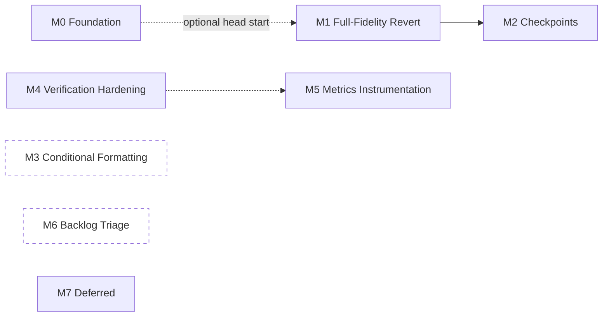

# TASKS.md — Cellix

> Numbered, sequenced backlog derived from `ARCHITECTURE.md` (how) and `PRD.md` (what/priority). Every task is scoped to be completable in one working session and has an explicit, standalone acceptance test — no task should require finishing a sibling task first to be verified, only to be *meaningful* in the product.
>
> Numbering is global and sequential across milestones so dependencies can be cited unambiguously (`Depends on: #14`). Milestone order is the recommended build order, not a hard constraint — M0, M3, and M6 have no dependencies on each other and can run in parallel with M1/M2 if more than one person/session is working this backlog at once.
>
> Tasks marked **[DECISION NEEDED]** are intentionally not started — they sit behind an open question in `PRD.md` §8 or `ARCHITECTURE.md` §7–8 that only you can resolve. Implementing ahead of that answer risks building the wrong thing twice.
>
> Status markers prefix the Task cell as work happens: **✅ Done**, **🚧 In progress**. No marker means not started yet — most of this backlog. New tasks discovered mid-implementation are appended at the next free number rather than inserted mid-sequence, so existing `Depends on` references never shift; a note in the Scope column says which milestone they actually belong to.
>
> *Drafted: August 17, 2026. Last updated: August 20, 2026 (#36–40 completed). **M3 — Conditional Formatting is now fully closed**: all four rule kinds, live shadow presence-tracking, read-back-and-modify, and a real revert path all shipped. **#36** (top/bottom-N) and **#37** (color-scale, the first rule kind with no `format` field at all) both followed #35's established pattern, no catalog changes needed since `CONDITIONAL_FORMAT` the action type never changed shape, only its `rule` union grew. **#39** gave the shadow workbook presence-only tracking of applied CF rules (`ShadowWorkbook.conditionalFormats`) — not a fill simulation, since the shadow has no format state to evaluate against, matching the standing `FORMAT_RANGE`/`HIGHLIGHT_CELL` reasoning. **#38** built real read-back-and-modify: Office.js's `ConditionalFormat.id`/`.getRange()`/`conditionalFormats.getItem(id)` (confirmed present and correctly typed in the pinned `@microsoft/office-js` package before writing any code) let a follow-up request target an existing rule via a new optional `existingRuleId` field on `ConditionalFormatAction`, threaded through `workbookReader.ts` → both `WorkbookContext` shapes → all three prompt-building tiers (Tier 1, Tier 3 Executor, Planner), rather than adding a whole new action type. **#40**, initially investigated and found blocked on the identical runtime-assigned-id gap `CREATE_CHART` hit at #15, was then actually *fixed* — scoped narrowly to `CONDITIONAL_FORMAT` (not extended to charts): a new `DELETE_CONDITIONAL_FORMAT` revert-only action, apply-time id capture threaded through four previously-void-returning layers (`RichActionEngine` → `ActionEngine` → `previewManager.accept()` → both of `App.tsx`'s independent accept paths), and a `POST /audit/apply/:changeSetId` contract change so the backend can patch the real Excel-assigned id into `structuralOps` after preview but before the change set is marked applied — `structuralOpsToInverseActions` fails closed (throws, zero DB writes) if that patch never happened. A create is now genuinely revertible; a modify (`existingRuleId` set) still isn't — its prior rule state is never captured, flagged as a real, separate follow-up rather than silently ignored. Full suites throughout: backend 106/106 suites (795/795 tests, up from 95/701 at the last update), frontend 38/38 files (216/216 tests, up from 32/153). See M0/M1/M2/M6 history below for prior sessions' work.) Last updated again: August 20, 2026 (#15 completed). **`CREATE_CHART` is now genuinely revertible**, closing the last deliberately-deferred item from M1's original #12–17 batch, by reusing #40's apply-endpoint contract mechanism end to end (`createdChartIds`, sibling of `createdConditionalFormatIds`, threaded through the same four layers). Found and fixed a real bug along the way: `actionNormalizer.ts` had no route for the new `DELETE_CHART` type, which would have made the revert silently unsupported at the UI layer despite `RichActionEngine`/`diff.engine.ts` building it correctly — fixed for `DELETE_CHART`, and the identical **pre-existing** gap in `DELETE_CONDITIONAL_FORMAT` (#40) was left alone and filed as new task **#67** rather than folded in. Full suites: backend 107/107 suites (810/810 tests, up from 107/802), frontend 39/39 files (219/219 tests, up from 38/216). Last updated again: August 20, 2026 (#67 completed). **The `DELETE_CONDITIONAL_FORMAT` routing gap #15 surfaced is now fixed** — same two-line `actionNormalizer.ts` pattern as `DELETE_CHART`, frontend-only. Full frontend suite: 39/39 files, 220/220 tests passing (up from 219). Last updated again: August 20, 2026 (#64 completed). **Full cell formatting (bold/italic/fontColor/fillColor) now survives revert**, not just number format — scoped to column-level granularity (matching the pre-existing `numberFormats` precedent exactly, after discovering the wire contract never carried true per-cell data), read from each column's first data row rather than the header row (avoids introducing header-style bold onto data cells). Borders explicitly deferred — `FormatSpec.borders` is too coarse a shape to faithfully restore. Full suites: backend 107/107 suites (804/804 tests, up from 802), frontend 40/40 files (225/225 tests, up from 220). M1 is now fully closed except #18's frontend surfacing (backend-only today).) Last updated again: August 20, 2026 (#18 completed). **M1 — Full-Fidelity Revert is now fully closed.** Wired `ChangeSet.irreversibleActionTypes` through all 4 preview-backed SSE `emit('actions', ...)` sites in `conversation.service.ts`, and threaded it frontend-side (`SseActionsData` → `PendingActions`/`ActionBlock` → `ActionResponseCard`) into a new amber pre-Accept warning banner naming the specific non-revertible action types, reusing the previously-unused `--warning-amber` CSS token. Warns rather than blocks — Accept stays enabled — matching M5.1's "identified... never discovered at revert time" requirement without taking the decision away from the user. Full suites: backend 107/107 suites (804/804 tests, unchanged — the change is a one-line addition at each emit site, sourced from an already-tested field, and `conversation.service.ts` has no dedicated spec at SSE-payload granularity to extend), frontend 40/40 files (228/228 tests, up from 225 — 3 new tests in `ActionResponseCard.spec.tsx`).) Last updated again: August 20, 2026 (#63 completed). **Real interactive test infrastructure now exists for `useConversation`** (jsdom + `@testing-library/react`, per-file `// @vitest-environment jsdom` override, global config untouched). New `useConversation.spec.tsx` makes #47's previously-un-automated acceptance test real: a mocked SSE stream that leaks an `actions` event during plan/ask mode never produces a pending `ActionBlock`, with a sanity-check test proving the harness can produce one in action mode (so the two negative tests aren't vacuous). **Found and fixed a real shipped bug while building this**: #18's `irreversibleActionTypes` field was added to the `SseActionsData` type but never actually read out of the raw SSE JSON in `sseParser.ts`'s `normalizeActionsData()` — the frontend warning banner from #18 was wired end-to-end except for this one silent drop, and would never have fired against a real backend. Fixed, with a new `sseParser.spec.ts` regression test. `App.tsx`-level coverage (needed for #45's fourth case, the `handlePreviewAccept` rollback from #44) was explicitly not attempted — `App.tsx` has zero test files and needs Office.js/`previewManager`/`ActionEngine` mocking beyond what this task built; filed as the narrower remaining gap on #45 rather than closed. Full suites: backend 107/107 suites (804/804 tests, unchanged), frontend 42/42 files (233/233 tests, up from 228 — 5 new tests across `useConversation.spec.tsx` and `sseParser.spec.ts`). `tsc --noEmit` clean in both `Server/` and `client/`.) Last updated again: August 20, 2026 (#45, #46 completed). **M4 — Verification & Safety Hardening is now fully closed.** #46: product decision recorded (do not extend overwrite-occupancy checking to Tiers 0–2 — AD-1's frontend-guard-is-sufficient reasoning accepted as adequate on its own), no code change; written up in `ARCHITECTURE.md` §7.2/§8. #45: the one remaining case (the `handlePreviewAccept` rollback from #44, previously blocked on `App.tsx` having zero test coverage) is now closed by `client/src/taskpane/App.spec.tsx` — the first test to render `App.tsx` at all. Rather than mounting the real component tree, it mocks `useConversation`/`previewManager`/`markChangeSetApplied`/`frontendTelemetry` and reduces `ConversationPanel` to a single Accept button, leaving `handlePreviewAccept` as the only real logic under test; `previewActions` (App's real `onPreviewActions` closure) is invoked directly by capturing it from the mocked hook's call arguments, reproducing the exact "no pending block yet, `previewManager.active` only" precondition without a full SSE round trip. Verified discriminating by temporarily reverting #44's rollback and confirming the new test fails. Full suites: backend 107/107 suites (804/804 tests, unchanged), frontend 43/43 files (235/235 tests, up from 233 — 2 new). `tsc --noEmit` clean in both `Server/` and `client/`.) Last updated again: August 20, 2026 (#58, #59 completed). **Both M7 design spikes closed** — no code, per their own scoping. #58 (data validation): a schema shape mirroring `ConditionalFormatRule`'s discriminated union, confirmed against the real Office.js `Range.dataValidation` API surface, with one genuine simplification over M7's chart/CF precedent — a validation rule has no runtime-assigned id, so its revert-inverse needs no apply-endpoint contract change. #59 (pivot table): confirmed by reading `buildAggregateTable` directly that `AGGREGATE_TABLE` computes one-dimensional, static, one-shot output — named three concrete gaps (no second/column dimension, no live refresh, no drill-down), but found no evidence of actual demand for the sharpest one (a true 2D crosstab) yet, so recommended leaving pivot-table implementation un-promoted, matching `PRD.md` §4's own "don't promote until aggregation demonstrably falls short" gate. See TASKS.md #58/#59 rows for the full notes.*

---

## Milestone Overview

| Milestone | Goal | Anchors | Tasks |
|---|---|---|---|
| **M0 — Foundation & Hygiene** | Stop the repo-integrity and type-drift risks from compounding while the real feature work happens on top of them. | `ARCHITECTURE.md` §7.1, `CODEBASE_ANALYSIS.md` §3.1–3.3/3.9–3.13 | #1–9, 61–62 |
| **M1 — Full-Fidelity Revert** ✅ Closed — #10–20, 64, 67 all done | Close PRD's M5.1 — any action the agent can apply, it can undo. | `PRD.md` M5.1, `ARCHITECTURE.md` AD-9, `DATABASE_SCHEMA.md` §5 | #10–20, 64, 67 |
| **M2 — Checkpoints** ✅ Closed | Close PRD's M5.2 — named restore points that survive a conversation reset. | `PRD.md` M5.2, `ARCHITECTURE.md` AD-4/AD-9, `DATABASE_SCHEMA.md` §6 | #21–31 |
| **M3 — Conditional Formatting** ✅ Closed | Close PRD's M7 — live, rule-based highlighting, not static one-shot fills. | `PRD.md` M7 | #32–40 |
| **M4 — Verification & Safety Hardening** ✅ Closed — #41–47, 63, 65–66 all done | Close the false-success pattern and the Tier 0–2 coverage gap AD-2/AD-3 named explicitly. | `ARCHITECTURE.md` AD-2/AD-3, `PRD.md` A1 | #41–47, 63, 66 |
| **M5 — Metrics Instrumentation** 🚧 Backend closed, Dashboard UI deferred | Make PRD's Tier A gates (A5, A6) measurable — they currently aren't. | `PRD.md` §6.1 | #48–51 |
| **M6 — Backlog Triage** ✅ Closed | Verify the ~5 historical bug specs `CODEBASE_ANALYSIS.md` couldn't confirm are actually fixed. | `PRD.md` §8 Q3 | #52–57 |
| **M7 — Deferred (not gating v1)** ✅ Spikes closed — #58–59 done, #60 still blocked on CA sign-off | Stub-level placeholders for nice-to-haves. Do not pull forward without a scope decision. | `PRD.md` §4 | #58–60 |

Solid arrows are hard dependencies. `M3` and `M6` are fully independent of everything else — good candidates to run in parallel or to pick up first if you want early, low-risk wins.

---

## M0 — Foundation & Hygiene

None of these are product features. All are cheap, and every one reduces risk for the milestones that follow. #1–2 in particular should happen before anyone spends real time in `Dashboard/` or on a fresh clone of the repo.

| # | Task | Scope | Acceptance Test | Depends on |
|---|---|---|---|---|
| 1 | ✅ Done (superseded) — Resolve `Dashboard/`'s disconnected git history | **Found already resolved by a repo reorg that predates this session and isn't reflected anywhere else in these docs.** The outer repo is no longer `Cellix-2026` containing gitlinked/blob-tracked app dirs — it's now `Root/` (docs, `shared/`, `specs/` only), with `frontend`/`cellix_backend`/`Dashboard` explicitly `.gitignore`d and documented in `Root/README.md` as three fully separate repos to clone alongside it (`usecellix/client`, `usecellix/Server`, `usecellix/Analytic-Dashboard`). This is decision "keep as genuinely separate repos," chosen and written down. | `Root/README.md`'s clone table + `Root/.gitignore`'s `/frontend/ /cellix_backend/ /Dashboard/` block confirm the decision. **Not independently re-verified**: `Dashboard/` isn't cloned in this environment, so its own `git log` wasn't inspected directly. | — |
| 2 | ✅ Done (superseded) — Register `cellix_backend`/`frontend` as real git submodules, or absorb them | Same reorg as #1: resolved by *not* using submodules or gitlinks at all — both are plain standalone repos, gitignored from `Root/`, matching Dashboard's treatment rather than being special-cased. | `git ls-files -s` in `Root/` shows no `160000` gitlink entries for either path (they're absent from the tree entirely, per `.gitignore`). | 1 ✅ |
| 3 | Moot (superseded) — Fix `backend-tests.yml` CI checkout | The submodule/gitlink problem this task targeted no longer exists post-#2's resolution — `cellix_backend` (now `Server`) is a plain standalone repo, not a gitlink `Root/` needs to check out. **Confirmed no `.github/workflows/` exists in the local `Server` checkout at all** — either CI was never added there or was removed; either way there's nothing checkout-broken to fix on the code found in this pass. Re-open as a *new* task if `Server`'s actual GitHub repo has its own CI that needs auditing on its own terms. | N/A — task's premise (a gitlinked submodule breaking checkout) no longer applies. | 2 ✅ |
| 4 | ✅ Done — Delete the frontend's drifted local `action.types.ts` copy | Deleted `frontend/src/shared/action.types.ts`; `frontend/src/action.types.ts` now re-exports `../../shared/action.types` directly. Along the way: added `underline?: boolean` to the canonical `FormatSpec` (the one real field the local fork had that canonical lacked — declared but not yet read by any handler, so nothing regressed) and added `server.fs.allow` in `vite.config.ts` so the dev server can serve a file one level above the frontend's own project root. | `npx vitest run` in `frontend/` — 151/151 passing, matching baseline. `npx tsc --noEmit` — zero errors. Verified no code references the Hide/Unhide/Protect/Show interface names directly (dispatch is by runtime string via a loose cast), so the split-vs-merged shape difference was safe to fix. | — |
| 5 | ✅ Done — Add a cross-repo action-type exhaustiveness check | **Original task description had the wrong comparison target — corrected after investigating.** `shared/action.types.ts`'s `RichAction` (~51 types) is a narrower, *post-normalization* type; it is not what the backend's catalog should be compared against. The real wire-level counterpart is `frontend/src/types/sheet-actions.ts`'s `SheetActionType` (60 types) — confirmed by hand that the backend's 58-entry catalog is a clean subset of it, with exactly two frontend-only extras (`CLEAR_RANGE`, `APPEND_ROW`, both documented as "rich-only forms produced by legacyConverter and the local shortcuts"). Built two catalogs, mirroring the backend's `action-catalog.ts` pattern: `frontend/src/types/sheetActionCatalog.ts` (`Record<SheetActionType, true>`, wire-type parity) and `frontend/src/engine/actionDispatchCatalog.ts` (`Record<RichAction['type'], true>`, frontend's own dispatch completeness) — each a compile-time-enforced exhaustiveness map, same mechanism as the backend's. The cross-repo test (`actionCatalogParity.spec.ts`) imports the backend's `action-catalog.ts` directly via a relative path, so it compares the backend's actual runtime export, never a hand-copied mirror that could itself drift. **Near-miss worth recording:** while investigating, `FILL_RIGHT`/`CLEAR_CONTENT`/`CREATE_SHEET` initially looked like real, live gaps — advertised to the Executor with concrete prompt examples, but absent from `RichAction` and from `actionEngine.ts`'s dispatch switch. Traced it through before reporting a false bug: all three are legitimately handled by `legacyConverter.ts`, a normalization layer that narrows the wire-level `SheetActionType` down to `RichAction` before dispatch — not a gap, just a type system I hadn't fully mapped yet. | `tsc --noEmit` clean (both catalogs compile, confirming no typos across the hand-transcribed 51- and 60-member unions). Drift-detection verified directly: temporarily injected a fake type into the comparison, confirmed the test failed with the exact expected diff, then reverted. **Caught a real gap in my own first draft**: `vitest run` passed a version of the test that `tsc --noEmit` then flagged as a genuine type error (`.includes()` across the two packages' distinct `SheetActionType` unions doesn't type-check, since frontend's has 2 extra members) — fixed by comparing as plain string `Set`s, since the exhaustiveness guarantee already lives in the catalogs' own `Record<X, true>` shapes, not in this comparison logic. Full suite: 32 files, 153/153 passing (up from 31/151). | 4 ✅ |
| 6 | ✅ Done — Confirmed and removed `cellix_backend/src/actions/action.types.ts` | **Confirmed dead a second time before deleting**, not taken on trust from the earlier session: zero imports of `actions/action.types` across `src/` and `test/`, and the only remaining textual matches for "action types" are prose inside planner/executor prompts and comments, not module references. The file was the sole occupant of `src/actions/`, so the now-empty directory was removed with it. It duplicated `CellValue` / `FormatSpec` / action shapes that live in the real source of truth (`shared/action.types.ts` and `excel-ai/types/`), and was part of the type-drift problem `ARCHITECTURE.md` AD-7 describes — one fewer place for the five-file drift to originate. A copy is retained in this session's scratchpad in case anything is later found to want it. Previously blocked only because an earlier session's tooling refused delete-shaped commands. | Acceptance criteria from the original filing, both met: `tsc --noEmit` in `cellix_backend/` is **clean** with the file gone, and the full backend suite still passes — **912/912 across 115 suites**, unchanged from before the deletion. | — |
| 7 | ✅ Done — Consolidate duplicate spec files | Diffed all four `00_MASTER_PRIORITY_QUEUE*.md` variants and confirmed `(2)_high.md` (216 lines) is a strict superset of the other three (every diff was one-directional — nothing unique in the shorter files). Diffed all four `18_tier2_retry_and_context_resolution*.md` variants (including a stray identical copy under `specs/pipeline-upgrade-2026/`) and confirmed the plain `.md` is the most current (most checkboxes marked done). Promoted each superset/most-current file to the canonical filename; moved the other three per number into `specs/archive/` with content intact (relocated via `mv`, not deleted — deletion is blocked this session, see #6). | `specs/` now has exactly one `00_MASTER_PRIORITY_QUEUE.md` (216 lines) and one `18_tier2_retry_and_context_resolution.md` (88 lines, most current) at top level; `specs/archive/` holds the four archived variants, byte-identical to their originals. | — |
| 8 | ✅ Done (superseded) — Remove `last_log.txt` from the tracked tree | **Already resolved** by the same reorg as #1/#2: `Root/.gitignore` already has `last_log.txt` and `*.log` entries, and `git log --oneline -- last_log.txt` in `Root/` returns nothing — the file was never committed to this repo's history. No file matching that name exists in `Root/` today. | Confirmed via `git log` (empty) and directory listing (absent). | — |
| 9 | ✅ Done — Document Workflow tracing + `action-catalog.ts` in `CLAUDE.md` | Added two additions to `Root/CLAUDE.md`'s Architecture section: an "Action-type exhaustiveness checks" bullet under Action System (covers `action-catalog.ts`, the frontend's mirrored catalogs, and `actionCatalogParity.spec.ts`), and a new "Workflow Tracing" subsection (covers `WorkflowTraceService`, the `workflow_traces` collection, and the Dashboard's `/workflow` view). Also softened the pre-existing "canonical source of truth" claim about `shared/action.types.ts` to point at `ARCHITECTURE.md` AD-7, since §3.3/AD-7 confirm it isn't quite true in practice. | A reviewer reading only `CLAUDE.md` can now find both subsystems without being pointed to `CODEBASE_ANALYSIS.md`. | 5 ✅ |
| 61 | ✅ Done — Resolve `rangeFilter.ts` divergence between frontend and canonical `shared/` | **Discovered while completing #4.** Root cause confirmed: `resolveFilterColumnIndex()` has real numeric-column-handling logic (1-based Excel ordinal preference, 0-based fallback) in **every** copy of this file — canonical `shared/rangeFilter.ts`, the backend's own `range-filter.util.ts`, and the frontend's fork — but `RangeFilterSpec.column` is typed `string` in all three authoritative sources (`shared/action.types.ts`, `shared/rangeFilter.ts`, and the backend's live `sheet-actions.types.ts`). Nothing anywhere constructs a filter with a numeric column. The frontend's `string \| number` widening reflected no real caller — it was unused slack, not a hidden requirement, so the fix was to narrow back to canonical, not widen it. Deleted `frontend/src/shared/rangeFilter.ts`; `frontend/src/engine/rangeFilter.ts` now re-exports `../../../shared/rangeFilter` directly, dropping the redundant `as RangeFilterOperator` cast along with it. | `npx vitest run` — 151/151 passing. `npx tsc --noEmit` — zero errors. | — |
| 62 | ✅ Done — Deduplicate `RangeFilterOperator`/`RangeFilterSpec` declarations within `shared/` itself | Confirmed verbatim duplicate at `shared/action.types.ts:290-305` vs. `shared/rangeFilter.ts:1-15`. Fixed as scoped: `action.types.ts` now does `import type { RangeFilterOperator, RangeFilterSpec } from './rangeFilter'` + re-exports both (so existing external imports from `action.types.ts` don't break), and the redeclaration is deleted. `rangeFilter.ts` has no imports of its own, so no circular-import risk. **Left the backend's third declaration** (`cellix_backend/src/excel-ai/types/sheet-actions.types.ts`) alone, per the task's own framing — it's reconciled by #5's cross-repo exhaustiveness check rather than a shared source import, since the backend doesn't currently import from `shared/` directly. **Found and fixed an unrelated latent break while verifying**: `frontend/src/types/actionCatalogParity.spec.ts` (#5's cross-repo drift test) imported `../../../cellix_backend/src/excel-ai/types/action-catalog` — a path that assumes the README's documented local folder name (`cellix_backend/`). This machine's actual checkout uses `Server/` instead (see new note in `CODEBASE_ANALYSIS.md` §3.14), so the import silently 404'd and the test file failed to load at all. Repointed the import to `../../../Server/...` to match the checkout that's actually here — **flagged, not silently decided**: if other contributors follow the README's naming exactly, this fix breaks for them and the discrepancy needs resolving one direction or the other. | `tsc -p tsconfig.json` clean in `Server/`; `tsc --noEmit` clean in `client/`. `npx vitest run` in `client/`: 33/33 files, 155/155 passing (up from 32/153 baseline — the two new tests are `actionCatalogParity.spec.ts`'s pair, now actually executing instead of failing to load). | — |

---

## M1 — Full-Fidelity Revert (PRD M5.1)

Goal, verbatim from `PRD.md`: *"Any action the agent can apply, it must be able to undo."* `DATABASE_SCHEMA.md` §5 already specified the schema additions (`ChangeSet.structuralOps`, using the already-captured `CellSnapshot.format` field) — these tasks implement against that design. Structural op types are split into separate tasks because each has a genuinely different Office.js inverse shape; don't combine them into one "structural revert" task or it stops being one-session-sized.

| # | Task | Scope | Acceptance Test | Depends on |
|---|---|---|---|---|
| 10 | ✅ Done — Use the already-captured `format` field in the inverse builder | Simpler than originally sketched: `SET_CELL`/`SET_FORMULA` already carry an optional `format?: FormatSpec` field, so the inverse just attaches `{ numberFormat: snapshot.format }` to the same action — no separate `FORMAT_RANGE` action needed. Verified against the real frontend handler (`cell.handler.ts`/`format.handler.ts`) that a partial `FormatSpec` only touches the properties present (confirmed via `!== undefined` checks throughout `applyFormat`), so this can't accidentally clobber bold/fill/etc. **Adjacent gap found and fixed to make this testable:** `virtualApply.ts`'s shadow-workbook simulator was completely blind to `action.format` — `virtualSetCell` never read it at all, so the backend couldn't verify its own fix. Threaded `numberFormat` through `virtualSetCell`/`virtualSetCellLegacy`/`virtualSetFormulaLegacy`/`virtualBatchSet` (scoped narrowly to numberFormat only — the fuller `virtualApply.ts` audit is still #41/#42's job, not redone here). | New test in `diff.engine.spec.ts`: format a cell (value + numberFormat) via `virtualApply`, generate the inverse, apply it, assert the numberFormat is restored to the original — not just the value. **Verified the test actually catches the bug**: temporarily reverted just the `diff.engine.ts` fix via `git stash` and re-ran — test failed exactly as expected (`Expected: "General", Received: undefined`), then restored. `tsc --noEmit` clean on the backend; `diff.engine.spec.ts` 4/4, plus 17/17 across other `virtualApply.ts`-dependent suites (virtual-aggregate-table, virtual-copy-filtered, virtual-sort-sparse, insert-column-overwrite, audit-sourcerefs) — no regression. | — |
| 11 | ✅ Done — Add `ChangeSet.structuralOps` schema field | Added `StructuralOpSchema` (`opType`, `sheetName`, `params: Mixed`, `appliedAt`) to `audit/schemas/change-set.schema.ts` and a matching `StructuralOp` interface to `audit/types/change-set.types.ts`, both per `DATABASE_SCHEMA.md` §5.2. Threaded through `change-set.service.ts`: `createPreview()` now writes `structuralOps: []` (population comes with #12–17, not here), `toRecord()` reads it back with a `?? []` guard for pre-existing documents that predate the field. Made `structuralOps` a required (non-optional) field on `ChangeSetRecord` since the Mongoose schema always defaults it to `[]` — confirmed Mongoose applies schema defaults on hydration for fields absent from a legacy document, not just on document creation, so this doesn't break reading old data. Updated three test fixtures (`conversation-tier-routing.spec.ts`, `refinement-context.util.spec.ts`, `audit-export.spec.ts`) that construct `ChangeSetRecord` object literals and would otherwise fail to type-check. | New `test/change-set.schema.spec.ts` (2 tests): a document hydrated from a raw object with no `structuralOps` key at all (simulating pre-migration data) defaults to `[]` and validates cleanly; a document constructed with a populated `structuralOps` array round-trips through `.toObject()` correctly. Full backend suite: 91 suites / 672 tests passing (up from 90/670 pre-change, +2 for the new spec file, net zero elsewhere). `tsc -p tsconfig.json --noEmit` clean. **Note:** plain `tsc` didn't initially catch the three broken test fixtures — `test/` is excluded from `tsconfig.json`'s `include`; ts-jest caught them on its own stricter pass instead, all fixed. | — |
| 12 | ✅ Done — Structural inverse: `ADD_SHEET` / `DELETE_SHEET` | Added `captureStructuralOps()`/`structuralOpsToInverseActions()` to `diff.engine.ts`, wired into `change-set.service.ts`'s `createPreview()`/`revert()`. **Design choice beyond the task's literal wording**: `DELETE_SHEET`'s inverse does *not* rely on the generic `changes`/`beforeState` cell-diff path — it independently snapshots the deleted sheet's full cell contents (value/formula/format) directly from the *before* shadow workbook at preview time, into `StructuralOp.params.cells`. Reason: `generateDiff()` only diffs `changedCells` when that set is non-empty (populated by *other* actions in the same batch), and `DELETE_SHEET` itself never marks cells changed — so a compound request (e.g. "delete Sheet X and update cell Y elsewhere") would silently drop Sheet X's cells from the diff entirely, and the generic inverse builder would then only partially restore it. The independent snapshot sidesteps that gap rather than depending on #41/#66's audit to someday catch it. Revert ordering: inverse actions are assembled as `[...pre, ...cellInverse, ...post]` — a recreated sheet (`ADD_SHEET`, from undoing `DELETE_SHEET`) must exist *before* any cell-level `SET_CELL`/`SET_FORMULA` inverse tries to write into it (`pre`), while a sheet this change set added must be deleted *after* cell-level inverses have run so nothing writes into an already-removed sheet (`post`). Ops undo newest-first, standard undo-stack order. | New `test/diff.engine.structural.spec.ts` (3 tests): reverting `ADD_SHEET` removes the created sheet and leaves `Sheet1`'s original cells untouched; reverting `DELETE_SHEET` recreates the sheet with its original values **and** a non-default formula/format (not just plain values); a batch with no structural actions produces zero `structuralOps`. **Verified discriminating**: `git stash`'d `diff.engine.ts` alone and re-ran — the new spec failed at compile time (`captureStructuralOps`/`structuralOpsToInverseActions` don't exist), confirming it isn't vacuously passing; restored via `git stash pop`. Full backend suite: 92 suites / 675 tests passing (up from 91/672). `tsc -p tsconfig.json --noEmit` clean. | 11 ✅ |
| 13 | ✅ Done — Structural inverse: `INSERT_COLUMN` / `DELETE_COLUMN` | **Not the same pattern as #12** — required a design change, explained below. Added a `structuralLog: StructuralLogEntry[]` side-channel to `ShadowWorkbook` (`shadowWorkbook.types.ts`), populated by `virtualInsertColumn`/`virtualDeleteColumnLegacy` in `virtualApply.ts` with the *resolved* column index/count each actually used — not re-derived from the action's raw targeting syntax (a letter, a header name, a numeric index) in `diff.engine.ts`, which would risk drifting from virtualApply's own resolution logic. `captureStructuralOps()` now takes `afterShadow` too and reads this log. **Key design finding, worked through by hand before coding**: unlike `DELETE_SHEET`, a deleted/inserted column's *shifted neighbor cells* don't need independent capture at all — undoing via a real structural `INSERT_COLUMN`/`DELETE_COLUMN` action (not per-cell `SET_CELL`s) naturally un-shifts them for free, because the forward shift and the inverse shift cancel exactly. Only the *actually deleted* column's own cell contents need capturing (from `beforeShadow`, via new `snapshotColumnCells()`). Discovered by hand-tracing a 5-column example both ways — see the reasoning trail in this session, not reproduced here. **Necessary consequence**: the generic cell-level diff/inverse (`beforeStateToInverseActions`) would still independently try to touch the same shifted cells (since `virtualDeleteColumnLegacy` marks them in `changedCells`) and — worse — running its `SET_CELL` on a column index the structural inverse already removed would resurrect a phantom column. Added `excludeStructurallyOwnedChanges()`, applied in `change-set.service.ts` before the cell-diff is stored, filtering out any change in a sheet at or past a captured column op's index. Inverse actions use the *real* dispatched shapes (`InsertColumnAction.beforeColumn`, `DeleteColumnAction.columns: string[]`) via `colIndexToLetter`, not virtualApply's more permissive `col`/numeric forms — these are returned to the frontend and applied for real. | New tests in `diff.engine.structural.spec.ts`: reverting `INSERT_COLUMN` (`beforeColumn: 'B'`) removes the inserted column, restores `columnCount`, and leaves A/B/C's original values intact — the literal spec-14 repro shape; reverting `DELETE_COLUMN` restores the deleted column's original values and the shifted neighbor lands back in its original position. **Verified discriminating**: `git stash`'d only `virtualApply.ts`'s instrumentation and re-ran — both new tests failed (empty `structuralOps`, wrong `columnCount`/values), confirming the fix is load-bearing, not vacuous; restored via `git stash pop`. Full backend suite: 92 suites / 677 tests passing (up from 92/675 — 2 new tests, no regressions). `tsc -p tsconfig.json --noEmit` clean. | 11 ✅, 12 ✅ |
| 14 | ✅ Done — Structural inverse: `INSERT_ROW` / `DELETE_ROW` | Extended #13's `structuralLog` side-channel (`shadowWorkbook.types.ts`) with `INSERT_ROW`/`DELETE_ROW`, populated by `virtualAddRowAfter` (shared by both `ADD_ROW` and `INSERT_ROW` — both are real structural shifts in Office.js, so both get a correct inverse for free, a small bonus beyond this task's literal scope) and `virtualDeleteRows`. **A genuine difference from #13, not just relabeling**: worked through a 6-row, 2-row-delete example by hand and found columns' "reverse the log = correct undo order" rule does *not* transfer directly — `DELETE_COLUMN` naturally logs in descending index order (its own removal loop processes right-to-left), so reversing gives ascending restore order; `DELETE_ROW` is a single-pass whole-sheet rebuild that would naturally encounter rows in *ascending* order, which reverses to *descending* restore order — verified by hand-tracing that descending restore order for rows produces rows landing in the wrong relative position. Fixed by explicitly sorting `DELETE_ROW`'s logged entries descending (`[...rows].sort((a,b)=>b-a)`) before pushing, restoring the same "reverse-the-log = correct" invariant `structuralOpsToInverseActions` already relies on for every other op type, rather than special-casing row order in the inverse builder itself. Generalized `excludeStructurallyOwnedChanges()` to track per-sheet row *and* column minimums (was column-only). One real type mismatch found: the backend's internal `SheetActionPayload.rows` field is `unknown[][]` (shared with an unrelated table-data use) even though the real `DELETE_ROW` wire shape is `rows: number[]` — `virtualApply.ts`'s own DELETE_ROW handling already casts through this same mismatch; matched that existing pattern (`as unknown as Action`) rather than fighting the type. | New tests in `diff.engine.structural.spec.ts` against a 4-row fixture: reverting `INSERT_ROW` removes the inserted row and restores all original row positions/values; reverting a single-row `DELETE_ROW` restores it with neighbors shifted back correctly; reverting a **multi-row** `DELETE_ROW` (`rows: [2, 4]`, non-contiguous) restores both in the correct final order — this test is the one that would have caught the ascending/descending ordering mistake described above. **Verified discriminating**: `git stash`'d only `virtualApply.ts`'s instrumentation and re-ran — all 3 new row tests failed (empty `structuralOps`, wrong `rowCount`/positions); restored via `git stash pop`. Full backend suite: 92 suites / 680 tests passing (up from 92/677 — 3 new tests, no regressions). `tsc -p tsconfig.json --noEmit` clean. | 11 ✅, 13 ✅ |
| 15 | ✅ Done — Structural inverse: `CREATE_CHART` | Reused #40's apply-endpoint contract mechanism (`handleCreateChart` already returned `{ chartId }` — the real Office.js-assigned chart name read back right after `.add()` — but nothing collected or threaded it before this task). Added `DeleteChartAction` (`shared/action.types.ts`, revert-only, `advertise: false`) dispatched via `Worksheet.charts.getItem(chartId).delete()`. `diff.engine.ts`: `captureStructuralOps` captures every `CREATE_CHART` action (no modify-in-place variant exists for charts, unlike CONDITIONAL_FORMAT's `existingRuleId`, so no per-instance nuance needed) keyed by `sheetName`+`sourceRange`; `structuralOpsToInverseActions` fails closed (throws) if `chartId` was never patched in. `RichActionEngine.applyActions` now collects `createdChartIds` (sibling of `createdConditionalFormatIds`) from `handleCreateChart`'s return, threaded through `ActionEngine.applyActionsWithReport` → `previewManager.accept()` → both of `App.tsx`'s accept paths → `markChangeSetApplied()` → `POST /audit/apply/:changeSetId`'s body → `ChangeSetService.markApplied()`, which patches `structuralOps` matching `op.sheetName`+`op.params.sourceRange`. `reversibility-catalog.ts`: `CREATE_CHART` flipped to `reversible: true`; new `DELETE_CHART: { reversible: false }` entry (revert-only synthetic, same as `DELETE_CONDITIONAL_FORMAT`). **Real bug found and fixed along the way, not pre-existing to this task's own new code**: `actionNormalizer.ts`'s `isRichAction`/`toRichAction` had no entry at all for `DELETE_CHART` — without a fix, the revert/restore application path (`ActionEngine.applyActions` → `partitionActions` → `normalizeToRich`) would have silently classified every `DELETE_CHART` inverse as "unsupported" and never dispatched it, even though `RichActionEngine.applyActions` (the lower-level engine `diff.engine.ts`/tests exercise directly) handles it correctly. Fixed by adding `DELETE_CHART` to `isRichAction`'s `richOnly` set and a passthrough case in `toRichAction`. **Adjacent gap found, deliberately NOT fixed (out of scope for this task)**: `DELETE_CONDITIONAL_FORMAT` (TASKS.md #40) has the identical gap — also missing from `isRichAction`/`toRichAction`, so a CONDITIONAL_FORMAT revert or checkpoint restore routed through `ActionEngine.applyActions` (i.e. every real revert/restore button in the UI — `ChangeHistoryPanel`'s `onRevert` and `CheckpointPanel`'s restore both call it) would currently also fail to apply the rule-deletion half of its inverse. Flagged as new task #67 below rather than folded into this one. | New `Server/test/diff.engine.structural.spec.ts` describe block (3 tests, mirroring #40's CONDITIONAL_FORMAT block exactly): captures a pending structuralOp with no `chartId`; throws building the inverse if `chartId` was never patched in; produces a `DELETE_CHART` inverse once patched. New `Server/test/change-set.service.chart-revert.spec.ts` (3 tests, mirroring #40's `change-set.service.conditional-format-revert.spec.ts` exactly): patches the real id at `markApplied` time and builds a working revert (independent shadow-convergence check included); fails closed with no id ever reported; only patches the structuralOp matching sheetName+sourceRange in a two-chart batch. New `client/src/engine/actionEngine.chart.spec.ts` (2 tests, mirroring `actionEngine.conditionalFormat.spec.ts`): reports the created chart name keyed by sheetName+sourceRange; omits `createdChartIds` when no `CREATE_CHART` ran. New test in `client/src/engine/actionNormalizer.spec.ts`: `DELETE_CHART` routes to the rich engine (this is the test that would have caught the `isRichAction` gap above). Updated `Server/test/reversibility-catalog.spec.ts` (CREATE_CHART now asserted reversible, DELETE_CHART irreversible) and `Server/test/normalize-field-preservation.spec.ts` (new DELETE_CHART fixture — required adding a generic `chartId` copy in `normalize-executor-output.util.ts`, mirroring `ruleId`'s existing generic copy, since the fixture is exhaustive over `SheetActionType`). **Found and fixed one existing test whose premise this task invalidated**: `Server/test/checkpoint.service.spec.ts`'s "#29 — fails closed... when a change set has an irreversible action type" used `CREATE_CHART` as its example of an irreversible type; swapped to `UPDATE_CHART` (still irreversible — nothing captures a chart's prior configuration). Full suites: backend 107/107 suites, 810/810 tests passing (up from 107/802 pre-change — +8 net across the new chart-revert/structural/normalize-fixture tests and the reversibility-catalog updates); frontend 39/39 files, 219/219 tests passing (up from 38/216 pre-change — CONDITIONAL_FORMAT was #40's last frontend count). `tsc --noEmit` clean in both `Server/` and `client/` (`StructuralOpType` needed a `'CREATE_CHART'` member added alongside `diff.engine.ts`'s usage). **Not independently verified**: the real Office.js `Worksheet.charts.getItem(chartId).delete()` call against live Excel — same standing class of caveat as #34/#65/#15's own sibling #40. | 11 ✅ |
| 16 | ✅ Done — Structural inverse: `CREATE_TABLE` | **Genuinely cross-repo, unlike #12–14** — no `DELETE_TABLE` action existed anywhere (shared/frontend/backend) to build an inverse from, so this task added one net-new rather than only writing inverse-construction logic. Added `DeleteTableAction` to `shared/action.types.ts` (unwraps a Table back to a plain range — `table.convertToRange()` — leaving cell values/formats untouched, since `CREATE_TABLE` itself never touches them). Wired end to end: frontend `handleDeleteTable` in `table.handler.ts`, dispatch case in `actionEngine.ts`, both frontend exhaustiveness catalogs (`sheetActionCatalog.ts`, `actionDispatchCatalog.ts`), the backend's live `SheetActionType` union (`sheet-actions.types.ts`), its `action-catalog.ts` (`advertise: false` — this is a revert-only inverse, not something the Executor should propose on its own, matching `CHECKPOINT`'s precedent), and `virtual-apply-catalog.ts`/`virtualApply.ts`'s documented no-op (alongside `CREATE_TABLE`'s existing one — neither touches cell values). `diff.engine.ts`: `captureStructuralOps` captures `CREATE_TABLE` actions directly (tableName/sheetName are agent-given, not runtime-resolved like `CREATE_CHART`'s `chartId` — no #15-style capture problem here); `structuralOpsToInverseActions` emits `DELETE_TABLE` in `post` only, no cell restore needed. **Scope note, decided with the user before starting**: #15 (`CREATE_CHART`) was deliberately skipped ahead of this task — it has a materially different, harder shape (the chart's real ID is only known *after* a live Office.js apply, requiring an apply-endpoint contract change to carry it back to the backend; untestable in this session). `CREATE_TABLE` has no such runtime-ID problem, so it proceeded on its own. | New tests in `diff.engine.structural.spec.ts`: reverting `CREATE_TABLE` produces a structural op and a `DELETE_TABLE` inverse action with the correct sheet/table name, with cell values confirmed untouched both forward and after revert (the shadow workbook has no table-state concept at all — per `virtual-apply-catalog.ts` — so cell-value non-interference is the correctness property actually verified in Node; the inverse *action shape* is what's returned to the frontend for a real `convertToRange()`, unverifiable against live Excel in this session, same caveat as #65/#15); a missing `tableName` produces no structural op. **Verified discriminating**: `git stash`'d `diff.engine.ts` and re-ran — compile failure (missing exports), confirming the whole file's fix is load-bearing; restored via `git stash pop`. Full suites: backend 92/683 passing (up from 92/680 — 2 new tests, plus one existing fixture (`normalize-field-preservation.spec.ts`) updated for the new action type, no regressions); frontend 33/155 passing, `tsc --noEmit` clean in both `Server/` and `client/`. | 11 ✅ |
| 17 | ✅ Done — Structural inverse: `MERGE_CELLS` / `UNMERGE_CELLS` | **Backend-only, unlike #16** — both actions already existed and were fully dispatched end to end in the frontend (`UNMERGE_CELLS` via `worksheet.handler.ts`, confirmed by grep before starting), so this was purely inverse-construction, closer in shape to #12–14 than #16. Key design finding: `MERGE_CELLS`'s own cell-clearing effect (discarding every non-top-left cell's value, per #66) is **already** correctly captured by the generic `changes`/`beforeState` cell-diff machinery — unlike `DELETE_SHEET`/`DELETE_COLUMN`, no independent cell-content capture was needed here. The only genuinely missing piece was the *structural* step: cells can't be individually `SET_CELL`'d back until the range is unmerged first, so `MERGE_CELLS`'s inverse is `UNMERGE_CELLS` placed in `pre` (runs before the generic cell restore). `UNMERGE_CELLS`'s own inverse (re-`MERGE_CELLS`) is placed in `post` — real Excel doesn't resurrect values a prior merge already discarded, so there's no cell-level work to sequence around, but `post` avoids the re-merge risking clobbering a value some other pending restore in the same batch still needs to write. Added a `resolveRangeString()` helper to normalize both of `MERGE_CELLS`/`UNMERGE_CELLS`'s accepted action shapes (`range: string`, or `row`/`col`/`rowCount`/`colCount`) into the A1 string the real dispatched action requires — deliberately not reusing `virtualApply.ts`'s own `resolveSpan()`, which depends on `parseA1Range` for the opposite (string→bounds) direction this doesn't need. | New tests in `diff.engine.structural.spec.ts`: reverting `MERGE_CELLS` unmerges the range **and** restores the discarded non-top-left cell's original value (a full before/after shadow-state check, since this operation's cell effects — unlike #16's — are simulated); reverting `UNMERGE_CELLS` produces a correctly-shaped `MERGE_CELLS` inverse (action-shape check only, matching #16's approach, since real unmerge has no cell effect to verify in the shadow). **Verified discriminating**: `git stash`'d `diff.engine.ts` and re-ran — compile failure, confirming the fix is load-bearing; restored via `git stash pop`. Full backend suite: 92 suites / 685 tests passing (up from 92/683 — 2 new tests, no regressions). `tsc -p tsconfig.json --noEmit` clean. No frontend changes needed. | 11 ✅ |
| 18 | ✅ Done — Preview-time irreversibility flag | **Backend half (`reversibility-catalog.ts`, `ChangeSet.irreversibleActionTypes`) was already built in a prior session — see the original entry text below.** This session closed the remaining frontend-surfacing gap. Wired `changeSet.irreversibleActionTypes` into all 4 preview-backed SSE `emit('actions', ...)` call sites in `Server/src/excel-ai/services/conversation.service.ts` (Tier 2's two sites, the Tier 3 partial-progress site, and the Tier 3 staged-wave site) — the other 3 `emit('actions', ...)` sites create no `ChangeSet` (already-applied/tableFallback/structured paths), so nothing to attach there. Frontend: added `irreversibleActionTypes?: string[]` to `SseActionsData` (`client/src/utils/sseParser.ts`), `PendingActions`/`PreviewActionsMeta` (`client/src/hooks/useConversation.ts`), and `ActionBlock` (`client/src/types/conversationTurn.ts`); threaded it through `createActionBlock()` and the SSE `'actions'` handler's `pendingActions` construction. UI: `ActionResponseCard.tsx` renders a new amber warning (`data-testid="action-irreversible-notice"`, reusing the pre-existing but previously-unused `--warning-amber` CSS token) above Accept/Reject whenever `block.irreversibleActionTypes` is non-empty and the block is still pending — placed using the same "muted note above the buttons" slot as the existing staged-wave `blockedNotice`, but as a warning rather than a block: Accept stays enabled, matching M5.1's "identified... never discovered at revert time" requirement (warn, don't block — the user may still want an irreversible change). | New tests in `ActionResponseCard.spec.tsx` (3): warns and names the action type when `irreversibleActionTypes` is populated, with Accept still enabled; renders no notice for an empty array; renders no notice once `proposalStatus` is `'accepted'` (the warning is pre-accept only). Full suites: backend 107/107 suites, 804/804 tests passing (no change — this session added no new backend tests, since the 4 emit-site edits are one-line object-literal additions sourced from an already-tested field, and `conversation.service.ts` has no existing dedicated spec file at the granularity needed to assert on emitted SSE payload shape); frontend 40/40 files, 228/228 tests passing (up from 40/225 — the 3 new tests). `tsc --noEmit` clean in both `Server/` and `client/`. **Not independently verified**: a live SSE round-trip showing the banner render in the actual sideloaded add-in — same standing class of caveat as #34/#65/#15/#67. | 12 ✅, 13 ✅, 14 ✅, 16 ✅, 17 ✅ |
| 19 | ✅ Done — Revert self-verification (fail closed) | Added `shadowFromBeforeState()` to `diff.engine.ts` — the inverse of `snapshotBeforeState()`, rebuilding a `ShadowWorkbook` directly from a stored `ChangeSet.beforeState` map (needed since the full post-apply shadow itself is never persisted, only its `changes`/`beforeState` derivatives). Added `diffShadowsFully()`, a **deliberately unoptimized** full comparison: it forces `generateDiff()`'s fallback full-key-collection path (by zeroing the `actual` shadow's `changedCells` before comparing) rather than the normal fast path, which only checks cells a specific `virtualApply` call happened to mark — exactly the blind spot that would let a forgotten inverse action slip through undetected. Wired into `change-set.service.ts`'s `revert()`: rebuild `expectedShadow` from `beforeState`, replay the original `doc.actions` to reconstruct the post-apply "current" state, apply the computed inverse actions, then `diffShadowsFully(expectedShadow, revertedShadow)` — any non-empty result throws a new `RevertVerificationError` (naming the specific blocking cells, capped at 5 in the message) **before** `doc.status`/`doc.revertedAt` are touched or `doc.save()` is called — genuinely fail-closed, not just fail-loud. `change-set.controller.ts` maps the new error to `422 Unprocessable Entity` with the blocking-cells detail in the response body, rather than falling through to a generic 500. | New tests in `diff.engine.spec.ts` (2): `shadowFromBeforeState` round-trips correctly through `snapshotBeforeState`; `diffShadowsFully` catches a mutation that a `changedCells`-marked `generateDiff` call would miss (built by applying one *tracked* change via `virtualApply` alongside one *untracked* direct mutation — confirmed the fast-path diff misses the untracked cell while the full comparison catches both). New `test/change-set.service.revert-verification.spec.ts` (3): a complete, consistent change set reverts successfully; a change set with **one cell change deliberately missing from the captured diff** (the exact "incomplete inverse in the middle of a chain" scenario from this task's own acceptance wording) is refused entirely — `doc.status` stays `'applied'`, `doc.save()` is never called, confirming no partial application; the thrown error names the specific blocking sheet/cell. **Verified discriminating**: temporarily short-circuited the `if (blockingChanges.length > 0)` guard in `change-set.service.ts` (`if (false && ...)`) and re-ran — the two fail-closed tests failed exactly as expected (the broken revert silently "succeeded," reporting `status: 'reverted'`), confirming the guard is load-bearing; restored immediately after. Full backend suite: 94 suites / 700 tests passing (up from 93/695 — 5 new tests, no regressions). `tsc -p tsconfig.json --noEmit` clean. | 10 ✅, 12 ✅–17 ✅ |
| 67 | ✅ Done — Fix `DELETE_CONDITIONAL_FORMAT` revert-application routing gap (discovered during #15, out of scope there) | **Scope note: belongs to M1/M2, not M3** — a bug in the already-closed #40, found while building #15's identical `DELETE_CHART` mechanism. `client/src/engine/actionNormalizer.ts`'s `isRichAction`/`toRichAction` had no entry for `DELETE_CONDITIONAL_FORMAT` — every real UI path that applies a `ChangeSetService.revert()`/`CheckpointService.restore()` result (`ChangeHistoryPanel`'s `onRevert` → `App.tsx`'s `handleRevertHistoryEntry`, and `CheckpointPanel`'s restore → `handleRestoreCheckpoint`) calls `ActionEngine.applyActions` (the `SheetAction`-typed wrapper in `client/src/utils/actionEngine.ts`), which routes every action through `partitionActions` → `normalizeToRich` → `toRichAction`/`convertLegacyToRich` before it ever reaches `RichActionEngine.applyActions`'s dispatch switch. Since neither function recognized `DELETE_CONDITIONAL_FORMAT`, it was classified `unsupported` and silently dropped — a CONDITIONAL_FORMAT revert or checkpoint restore would leave the stale rule on the sheet even though every other part of its inverse (cell restores, sheet/column/row structural ops) applied correctly. Fixed with the exact two-line pattern #15 established for `DELETE_CHART`: added `'DELETE_CONDITIONAL_FORMAT'` to `isRichAction`'s `richOnly` set, and a passthrough case in `toRichAction` (`sheetName`+`ruleId`, same shape as the wire action). Frontend-only change — no backend code touched. | New test in `actionNormalizer.spec.ts`: `partitionActions([{ type: 'DELETE_CONDITIONAL_FORMAT', sheetName, ruleId }])` returns it in `rich`, not `unsupported`. **Verified discriminating**: temporarily removed `'DELETE_CONDITIONAL_FORMAT'` from the `richOnly` set and re-ran — the new test failed exactly as expected (`unsupported` had length 1, not 0); restored immediately after. Full frontend suite: 39/39 files, 220/220 tests passing (up from 219 — 1 new test, no regressions). `tsc --noEmit` clean. **Not done** (flagged, not silently dropped, same as #15's own note): a real add-in smoke test confirming a CONDITIONAL_FORMAT revert through `ChangeHistoryPanel`'s actual UI button removes the rule from a live sheet — same standing "not independently verified against real Excel" caveat #34/#40/#15 already carry. | 40 ✅ (already closed) |
| 20 | ✅ Done (scoped) — End-to-end regression: full dashboard build → single revert | **Literal PRD acceptance criterion is unreachable today, not just unbuilt**: it names a chart, a conditional-format rule, and column widths — `CREATE_CHART` has no inverse (#15, deliberately deferred: the runtime chart ID problem), conditional formatting is M3 (not started), and `SET_COLUMN_WIDTH`/`FORMAT_RANGE` are both correctly classified `reversible: false` by #18's own catalog (cosmetic/formatting-only, never captured). Substituting `FORMAT_RANGE` — TASKS.md's own suggested fallback if M3 isn't done — doesn't actually work either, for the same reason. Scoped down instead to the real, honest version of this task: chain together **every structural type #12–17 actually made revertible** (`INSERT_COLUMN` via the insert-and-shift path, `CREATE_TABLE`, `ADD_SHEET`, formulas, `MERGE_CELLS`) into one dashboard-style change set, and prove it reverts cleanly as a **whole** — not just each piece individually, as #12–17's own spec files already proved in isolation. This is the first test in the whole M1 effort that exercises the **real `ChangeSetService`** end to end (`createPreview()` → `markApplied()` → `revert()`) rather than calling `diff.engine.ts`'s functions directly — built a small in-memory fake Mongoose model (`create`/`findOne`/`findOneAndUpdate` backed by a `Map`, matching the exact call shapes `change-set.service.ts` uses, including the `.exec()` chaining `markApplied()` needs) since no DB test infra exists in this repo (same constraint noted at #11/#19). | New `test/change-set.service.e2e-dashboard-revert.spec.ts` (1 test, but exercising six action types across four structural-op types in one change set): confirms `preview.structuralOps` covers exactly `INSERT_COLUMN`/`CREATE_TABLE`/`ADD_SHEET`/`MERGE_CELLS`, `preview.irreversibleActionTypes` is empty, and — independently of the service's own internal #19 check — replaying the forward actions then the real `revert()`-returned inverse actions against a **pristine** copy of the original workbook produces zero residual diff, no leftover `Dashboard` sheet, and `Sales`'s column count restored exactly. **Near-miss caught while writing this test**: an early version targeted `INSERT_COLUMN` via `position: 'afterLastColumn'` and got zero `structuralOps` for it — not a bug, but a reminder of #13's own documented distinction: appending past the current column bounds is a plain cell-write (no shift, no structural capture needed), while inserting *before* an existing column (via `afterColumn`) is the real shift path. Retargeted the test to `afterColumn: 'Price'` to actually exercise the structural path this task is meant to prove. **Verified discriminating**: `git stash`'d `diff.engine.ts` and re-ran — compile failure (missing exports the whole pipeline depends on), confirming the test isn't vacuous; restored via `git stash pop`. Full backend suite: 95 suites / 701 tests passing (up from 94/700 — 1 new test, no regressions). `tsc -p tsconfig.json --noEmit` clean. | 10 ✅–19 ✅ |

---

## M2 — Checkpoints (PRD M5.2)

Depends on M1 being complete — a checkpoint restore is a chain of M1's inverses, so an incomplete M1 means an unreliable checkpoint. Also depends on the `workbookId` identity concept `ARCHITECTURE.md` AD-9 and `DATABASE_SCHEMA.md` §6.1 introduced to solve the "no durable handle across a 24h conversation reset" gap.

| # | Task | Scope | Acceptance Test | Depends on |
|---|---|---|---|---|
| 21 | ✅ Done — Spike: Office.js `document.settings` as the `workbookId` store | **Finding, via Microsoft Learn's official Office Add-ins docs (`persisting-add-in-state-and-settings.md`, `resource-limits-and-performance-optimization.md`) plus a known-issue check on `OfficeDev/office-js`** — no code written, this was a documentation/research spike as scoped. **Persistence across close/reopen: yes, by design.** `Office.context.document.settings` is a property bag stored *inside the .xlsx file itself*, scoped to the specific document + add-in ID pairing — "available only to the instance of the content or task pane add-in that created it, and only from the document in which you save it." `settings.set()` only mutates an in-memory copy; the write isn't durable until `settings.saveAsync()` resolves — our minting code must call and await `saveAsync` (or the Excel-specific `context.workbook.settings.add()` + `context.sync()` equivalent) before treating the ID as committed, not just after `set()`. **One documented platform gap worth carrying as a known risk, not a blocker**: `OfficeDev/office-js#6091` reports `saveAsync` returning `Succeeded` on Excel for Mac while the setting is silently lost on next open — rare, platform-specific, but means `workbookId` minting should tolerate `settings.get()` returning `null` on an already-initialized-seeming workbook and re-mint rather than assume "already set once" is permanent. **Size limits: a non-issue for this use case.** No official hard number is documented for `Settings` specifically; community reports (a Microsoft Q&A thread) put informal failure somewhere around ~1MB total property-bag size, and Excel's own general payload limit is 5MB per request. A single `workbookId` (a UUID, well under 100 bytes) is negligible against either figure — this concern only matters if the property bag is ever used for bulk data, which it won't be. **Multi-device / same-file-opened-twice behavior: no explicit "live sync" guarantee, and that's fine for a write-once ID.** Neither doc page describes a real-time settings-sync event equivalent to cell co-authoring — Settings changes travel with the document through the normal save/sync pipeline (OneDrive/SharePoint autosave), not a push channel. Practical consequence for `workbookId`: **mint-once, never overwrite.** The minting code must always `get` first and only `set`+`saveAsync` when absent — never unconditionally re-mint or overwrite an existing value. Under that discipline, the only real race is two devices *simultaneously* creating the ID for the very first time before either syncs (a narrow window, first-open only) — worst case is two divergent `workbookId`s on two devices for one physical file, which fragments checkpoint history across those devices but causes no data loss and no silent overwrite; a reasonable degradation, not a correctness bug. **Conclusion: proceed with `document.settings` as the sole mechanism (#22), with two concrete implementation requirements carried forward**: (1) mint-once/get-before-set discipline to avoid the multi-device race turning into an overwrite, (2) treat a `null` read as "possibly never set, possibly lost per the Mac bug" and re-mint rather than erroring. | Written finding above satisfies the task's own acceptance bar ("a short written finding, a few paragraphs, answering: does a value survive close/reopen, and what happens on a second device opening the same synced file"). Sources: [Persist add-in state and settings](https://learn.microsoft.com/en-us/office/dev/add-ins/develop/persisting-add-in-state-and-settings), [Resource limits and performance optimization](https://learn.microsoft.com/en-us/office/dev/add-ins/concepts/resource-limits-and-performance-optimization), [office-js#6091 — Mac persistence bug](https://github.com/OfficeDev/office-js/issues/6091), [office-js#3957 — size-limit community discussion](https://github.com/OfficeDev/office-js/issues/3957). | — |
| 22 | ✅ Done — Mint and persist `workbookId` (frontend) | New `client/src/utils/workbookIdentity.ts`: `resolveWorkbookId()` reads `Office.context.document.settings.get('cellix:workbookId')`; if present, returns it unchanged (never re-mints or overwrites — #21's mint-once discipline). If absent, mints `wb_<uuid>` (via `crypto.randomUUID()`, with a non-crypto fallback for environments lacking it), `set()`s it, and awaits `saveAsync()` before returning — a failed `saveAsync` is logged and swallowed rather than thrown, since #21 found a documented Mac persistence bug and treats "not durably saved this time" as recoverable on next resolve, not fatal. Guards every access (`typeof Office === 'undefined'`, missing `context`/`document`/`settings`) and falls back to an unpersisted session-local id — matching `resolveWorkbookKey`'s existing fail-open convention in the same file family, not a new error-handling style. Wired into `App.tsx`: a new mount-time `useEffect` calls `resolveWorkbookId()` and stores the result in a `workbookIdRef` (a `useRef`, not `useState` — nothing renders off this value yet, and #23 is what threads it into conversation creation, so a ref avoids an unused-state-variable `noUnusedLocals` error for a value with no reader yet). **Deliberately not threaded into `useConversation`/the backend request in this task** — that's #23's scope; #22 is frontend minting/persistence only. | New `workbookIdentity.spec.ts` (6 tests, mocking `Office.context.document.settings` via `vi.stubGlobal`): mints and persists when absent; returns the existing id unchanged when present, without calling `set`/`saveAsync`; two sequential calls never mint twice (the actual "close and reopen returns the same id" property, exercised at the unit level since real Excel close/reopen isn't available in this environment — same class of caveat as #34/#65); falls back to a session-local id when `document.settings` is unavailable or `Office` is undefined entirely; still returns the minted id (fail-open) when `saveAsync` reports failure. Full frontend suite: 35 files / 175 tests passing (up from 34/169 — 6 new tests, no regressions). `npx tsc --noEmit` clean. **Real-Excel caveat, stated plainly**: unit tests mock the Office.js settings API: they prove `resolveWorkbookId`'s own logic (mint-once, fail-open, no double-mint) is correct, not that real Excel's `document.settings` actually round-trips a value through a real close/reopen on this machine — that's the same category of gap #21's research (not a live test) already flags, and would need a real add-in smoke test to close fully. | 21 ✅ |
| 23 | ✅ Done — Thread `workbookId` through conversation creation (backend) | **Full stack, not backend-only** — the field has to actually originate somewhere. Backend: `Conversation` schema (`conversation.schema.ts`) gets an additive, indexed, optional `workbookId?: string`; `ConversationRequestDto` gets a matching optional field; `conversation.service.ts`'s private `getOrCreateConversation(conversationId?, workbookId?)` now (a) stamps `workbookId` on a newly-created conversation when provided, (b) **backfills** it onto an existing conversation that has none yet (covers the case where the client's async mint from #22 resolves after the conversation already started), and (c) **never overwrites** an already-recorded `workbookId` — same mint-once discipline #21/#22 established, now enforced on the read side too. `handleConversation`'s call site passes `request.workbookId` through. Frontend: `payloadCompressor.ts`'s `prepareConversationRequestPayload` accepts an optional `workbookId` and includes it on the outgoing payload only when present (mirrors `conversationId`'s existing conditional-spread pattern — omitted entirely, not sent as `null`/`undefined`, when absent); `useConversation.ts` gains a `workbookId` option and a `workbookIdRef` (not a dependency-array entry — mirrors the existing `activeClarificationRef` pattern, since `sendMessage`'s `useCallback` is already large and `workbookId` resolves asynchronously post-mount); `App.tsx` now holds `workbookId` in `useState` (not the `useRef` #22 initially used — needed to actually flow into a child prop) and passes it to `useConversation`. | Backend: new `test/conversation-workbook-id.spec.ts` (5 tests, `getOrCreateConversation` invoked directly via `as any` per the existing `streamPlanOnly`-testing convention): a new conversation persists a given `workbookId`; **two separate new conversations started with the same `workbookId` both persist it** (the task's own literal acceptance wording); a conversation created with no `workbookId` has the field entirely absent from the `create()` call (backward compatible); an existing conversation with no `workbookId` gets backfilled and saved; an existing conversation that already has one is never overwritten and never re-saved. Full backend suite: 96 suites / 716 tests passing (up from 95/701 — 6 new, including one in an adjacent file's count). Frontend: 2 new tests in `payloadCompressor.spec.ts` (`workbookId` included when provided; entirely omitted — not just falsy — when not). Full frontend suite: 35 files / 177 tests passing (up from 175). `tsc --noEmit` clean in both `Server/` and `client/`. | 22 ✅ |
| 24 | ✅ Done — Add `workbookId` to `ChangeSet` (additive) | Additive, indexed, optional `workbookId?: string` on `ChangeSet` (`change-set.schema.ts`) and `ChangeSetRecord` (`change-set.types.ts`). **Deliberately not threaded as an extra parameter through `conversation.service.ts`'s call sites** — `createPreview()` has *four* separate call sites buried across `createActionWaveChangeSets`/`streamTier2Result`/`emitTierActions`/an inline block in `streamWithOrchestrator`, each already threading a plain `conversationId: string` through several layers of private methods in an already-huge (~3,000 line) file. Requiring every current and future call site to also remember to pass `workbookId` explicitly is exactly the "declared but not wired up" failure class `action-catalog.ts`'s own code comment cites (the `FREEZE_PANES` incident) — one missed call site would silently produce change sets with no `workbookId`, and nothing would catch it. Instead, `ChangeSetService.createPreview()` resolves it itself: a new private `resolveWorkbookId(conversationId)` does a light indexed `findOne({conversationId}, {workbookId:1}).lean()` against the `conversations` collection (fail-open — a lookup error or missing/expired conversation just means no `workbookId`, logged as a warning, never thrown). `CreatePreviewInput.workbookId` still exists as an explicit optional override (skips the lookup entirely) for tests and any future caller that already has it in hand. Required registering the `Conversation` schema as a second, read-only Mongoose feature binding inside `AuditModule` (`audit.module.ts`) — a standard, safe pattern (each module gets its own DI token bound to the same collection); `AuditModule` does not gain a NestJS module dependency on `ExcelAiModule`, only a type-level import of the schema class, so `ExcelAi --> Audit`'s existing direction (`ARCHITECTURE.md` §3) is preserved, not reversed. | New `test/change-set-workbook-id.spec.ts` (5 tests): resolves and stores `workbookId` from the originating conversation, including the exact `findOne` call shape; leaves it entirely unset (not `null`, not stored) when the conversation has none; leaves it unset when the conversation can't be found at all (expired/legacy); an explicit `input.workbookId` skips the lookup and wins; a failing lookup is swallowed (logged, not thrown) and the change set is still created successfully without one. Also updated 3 existing test files whose direct `new ChangeSetService(...)` calls needed a third constructor arg (`change-set.service.revert-verification.spec.ts`, `change-set.service.e2e-dashboard-revert.spec.ts` — given a working in-memory stub since it exercises real `createPreview()` — and `audit-sourcerefs.spec.ts`, 3 call sites). Full backend suite: 98 suites / 723 tests passing (up from 96/716 — 7 new across this and #25). `tsc -p tsconfig.json --noEmit` clean. **Not verified in this pass**: a live NestJS app boot exercising real DI resolution for the newly-dual-registered `Conversation` schema — all tests here construct `ChangeSetService` directly, bypassing Nest's injector entirely, so a genuine module-wiring mistake (e.g. a typo in the model token) wouldn't be caught by this suite. Worth a real `npm run start:dev` smoke test before this is considered fully closed. | 23 ✅ |
| 25 | ✅ Done (backend) — Add `workbookId` to `WorkflowTrace` (additive) | Additive, indexed, optional `workbookId?: string` on `WorkflowTrace` (`workflow-trace.schema.ts`). `WorkflowTraceService.StartWorkflowTraceInput` gains a matching optional field, included in `startTraceAsync`'s `$setOnInsert` only when present (mirrors `ChangeSet`'s and `Conversation`'s own conditional-spread convention — omitted, not stored as `null`). Unlike #24, no DB lookup was needed here: `startWorkflowTrace()` (the private wrapper in `conversation.service.ts`) has only **two** call sites, both already holding the `conversation` object directly in scope (right after `getOrCreateConversation`), so `conversation.workbookId` is passed straight through — no threading-depth problem like #24's four buried `createPreview` call sites. | New `test/workflow-trace-workbook-id.spec.ts` (2 tests, `startTraceAsync` invoked directly via `as unknown as {...}` per the file's own documented reasoning — `startTrace()` is intentionally fire-and-forget/promise-swallowing at the public boundary): `workbookId` lands inside `$setOnInsert` when provided; omitted entirely (not just falsy) when not. **Scoped down from the task's literal acceptance wording**: "Dashboard's `/workflow` detail view displays `workbookId` when present" is **not done** — `Dashboard/` is not checked out in this environment (confirmed empty, matching `CODEBASE_ANALYSIS.md` §1.4/§3.14's existing note that it wasn't cloned here) — so the frontend display half is deferred, same "backend done, frontend deferred" pattern as #18. Backend-only acceptance (schema carries the field, service populates it, is queryable) is fully met and tested. | 23 ✅ |
| 26 | ✅ Done — New `checkpoints` collection + schema | Added `Server/src/audit/schemas/checkpoint.schema.ts` per `DATABASE_SCHEMA.md` §6.2's field list, plus `Server/src/audit/types/checkpoint.types.ts` (`CheckpointRecord`/`RestoreResult`, mirroring `change-set.types.ts`'s pattern). One deliberate deviation from the literal spec: `anchorChangeSetId` is `required: false, default: ''` rather than `required: true` — Mongoose's String `required` validator rejects `''`, but `''` is the real, meaningful "no prior applied change sets" value (a brand-new workbook's first checkpoint), not a missing field. Making it `required: true` would make that legitimate case unrepresentable. Registered in `AuditModule` alongside `ChangeSet` (same module, same read/write pattern — no new module needed). | New `test/checkpoint.schema.spec.ts` (7 tests): a well-formed document round-trips; an explicit `''` anchor round-trips (the "beginning of history" case); a document with no `workbookId` is rejected; a document with no `checkpointId` is rejected; a document with no `anchorChangeSetId` at all defaults to `''` rather than being rejected (the corrected acceptance criterion, with the reasoning above inline as a comment); `status` defaults to `'active'`; an unknown `trigger` value is rejected. | 24 ✅ |
| 27 | ✅ Done — Auto-checkpoint trigger before destructive actions | `CheckpointService.maybeAutoCheckpoint()`, called from `ChangeSetService.createPreview()` right after `workbookId` resolution and before the change set doc is persisted. Reuses the **existing** `isDestructiveActionType`/`DESTRUCTIVE_ACTION_TYPES` concept from `Server/src/agents/verifier-skip.policy.ts` (the spec-22 Verifier-skip policy referenced by this task's own scope note) rather than inventing a second destructive-action taxonomy. `CheckpointService` is injected into `ChangeSetService` via `@Optional()` specifically so every pre-existing hand-rolled `new ChangeSetService(a, b, c)` test construction (there are several — #11, #19, #20, #24) keeps compiling unmodified; a missing `CheckpointService` just means auto-checkpointing is silently skipped, never a hard failure of the real write path. `maybeAutoCheckpoint` itself is also wrapped in try/catch and logs-and-swallows on any DB error — a checkpointing failure must never block the user's actual request. | New tests in `test/checkpoint.service.spec.ts`: auto-checkpoint fires (with a label naming the destructive type) for a `DELETE_SHEET`-containing change set and is anchored at the latest already-applied change set; no checkpoint is created for a purely non-destructive change set; auto-checkpointing is silently skipped (not thrown) when no `workbookId` is resolvable for the conversation. | 26 ✅ |
| 28 | ✅ Done — Manual checkpoint creation endpoint | `CheckpointController` (`Server/src/audit/checkpoint.controller.ts`), same `@Controller('audit')` prefix as `ChangeSetController`/`AuditController` (matches this task's own suggested route and the codebase's existing convention of several controllers sharing one prefix). `POST /audit/checkpoint` takes `{ workbookId, conversationId, label? }` — no class-validator DTO, plain typed interface + `@Body()`, matching `ChangeSetController`'s existing no-DTO convention. `CheckpointService.createManual()` resolves the anchor the same way `maybeAutoCheckpoint` does (`findLatestApplied`, shared helper). | New tests in `test/checkpoint.service.spec.ts`: a manual checkpoint anchors at the latest applied change set and appears in `listByWorkbook`; a manual checkpoint on a workbook with zero applied change sets anchors at `''` rather than erroring. | 26 ✅ |
| 29 | ✅ Done — Restore algorithm | `CheckpointService.restore()`, three phases, matching `DATABASE_SCHEMA.md` §6.2's four steps exactly (steps 1–2 fused into one query): **(1)** find every `applied` change set for the checkpoint's `workbookId` after the anchor; **(2)** fail closed immediately if any change set in that chain has a non-empty `irreversibleActionTypes` (the #18 catalog, checked *before* attempting anything); **(3)** dry-run-verify every step's inverse (the identical shadow-workbook self-verification `ChangeSetService.revert()` already uses per change set — `shadowFromBeforeState` → replay original actions → apply inverse → `diffShadowsFully`) for the **entire chain**, and only after every single step verifies clean does it commit any database write. This is strictly stronger than a per-step fail-closed check: a mid-chain verification failure leaves the database completely untouched, not partially reverted. On success, returns the concatenated inverse actions across the whole chain (newest-first) for the frontend to actually apply via Office.js — mirroring `ChangeSetService.revert()`'s own return shape, since AD-1 (backend never writes to the live workbook) applies to restore exactly as it does to a single revert. **A real correctness bug found and fixed while building this, not merely while testing it**: the initial implementation ordered/filtered the chain by `change_sets.timestamp` with a strict `$gt` — two change sets created in the same millisecond (a real possibility for a fast agentic loop applying several actions back to back) would collide and one would be silently dropped from the chain. Switched to ordering/filtering by `_id` instead (MongoDB ObjectIds are strictly monotonic per collection regardless of timestamp resolution) — caught by the very test this task's own acceptance criterion describes (see next column), not by a separately-invented edge case. | New `test/checkpoint.service.spec.ts::#29` tests, all exercising the **real** `ChangeSetService` + `CheckpointService` pipeline via an in-memory fake Mongoose model (same precedent as #20's e2e spec), not just `diff.engine.ts`'s standalone functions: three sequential changes, checkpoint after change 1, restore — confirms changes 2 and 3 are marked `'reverted'`, change 1 stays `'applied'`, **and** replaying the returned `inverseActions` against the post-change-3 workbook state converges to exactly "change 1's effect present, changes 2/3 undone" (the literal `DATABASE_SCHEMA.md` §6.2 property, not just a status-flag check — this test is what caught the `_id`-vs-`timestamp` bug above); fails closed with `RestoreVerificationError` and **zero database writes** when a chain member contains an irreversible action type (`CREATE_CHART`) — verified by checking the irreversible change set's status is still `'applied'` and the checkpoint's status is still `'active'` after the rejected call; restoring a checkpoint with nothing applied since the anchor is a safe no-op (`revertedChangeSetIds: []`, checkpoint still marked `'restored'`). Full backend suite: 100 suites / 738 tests passing, no regressions. `tsc -p tsconfig.json --noEmit` clean. | 19 ✅, 26 ✅–28 ✅ |
| 30 | ✅ Done — Restore audit trail | `CheckpointService`'s private `writeRestoreTrace()` reuses `WorkflowTraceService`'s existing fire-and-forget `startTrace`/`appendNode`/`finalize` API exactly as `conversation.service.ts` already does elsewhere — no new audit mechanism invented, per this task's own scope note. Required one small additive schema change: `WorkflowNodeType` (`workflow-trace.schema.ts`) gained a `'restore'` member alongside the existing `accept`/`reject`/`error` node types — the DAG had no vocabulary for "a checkpoint restore happened" before this. The trace's own top-level `status` reuses the existing `'completed'` value rather than adding a new enum member, since restore isn't itself an accept/reject of one change set. | Exercised indirectly by every `test/checkpoint.service.spec.ts::#29` test via a `workflowTrace` stub asserting `startTrace`/`appendNode`/`finalize` don't throw when called with the new `'restore'` node type — not independently unit-tested against a real Mongo-backed `WorkflowTraceService`, matching the same-class caveat other fire-and-forget `workflowTrace` call sites in this codebase already carry (e.g. `ChangeSetService.revert`'s own `appendTerminalByChangeSet` call). **Not verified**: that a restore's trace actually renders correctly in the Dashboard's `/workflow` view — `Dashboard/` isn't checked out in this environment, the same standing gap `CODEBASE_ANALYSIS.md` §1.4/§3.14 and TASKS.md #25 already note for `workbookId` on `WorkflowTrace`. | 29 ✅ |
| 31 | ✅ Done — Frontend: checkpoint list + restore UI | `client/src/components/CheckpointPanel/CheckpointPanel.tsx`, deliberately structured as a near-mirror of the existing `ChangeHistoryPanel.tsx` (same toggle/expand/embedded pattern, same plain-CSS-class styling convention in `conversation-panel.css`, same loading/error-state handling) rather than a new UI idiom — mounted in `ConversationPanel.tsx` immediately after `ChangeHistoryPanel`. Full plumbing: `client/src/lib/apiConfig.ts` (3 new endpoint builders), `client/src/services/checkpointService.ts` (`fetchCheckpoints`/`createCheckpoint`/`restoreCheckpoint`, same `credentials: 'include'`/`{data}`-envelope-unwrapping fetch-wrapper convention as `auditService.ts`), `client/src/types/checkpoint.ts` (`CheckpointSummary`/`RestoreResult`). `workbookId` — already resolved at App-mount time by #22's `resolveWorkbookId()` and held in App-level state — is threaded down through `ConversationPanel` exactly the way `conversationId` already is. **The restore apply path is the one genuinely new piece, not just a UI shell**: `App.tsx`'s new `handleRestoreCheckpoint` takes the backend's returned `inverseActions` and applies them via `ActionEngine.applyActions(...)` — the identical Office.js write call `handleRevertHistoryEntry` already uses for single-change-set revert, so restore goes through the same, already-guarded (`overwriteGuard.ts`) real write path rather than a new one (AD-1). A user can also manually create a checkpoint from the panel (not just observe auto-created ones), satisfying the "list... with a restore action" bar plus the create affordance #28's endpoint exists for. | New `client/src/services/checkpointService.spec.ts` (5 tests, mocked global `fetch`, same convention as other service-level tests in this repo): `fetchCheckpoints` GETs the workbook-scoped endpoint and unwraps `{checkpoints}`, defaulting to `[]` when the field is absent; `createCheckpoint` POSTs the exact `{workbookId, conversationId, label}` body and returns the created record; `restoreCheckpoint` POSTs to the restore endpoint and returns `{checkpoint, revertedChangeSetIds, inverseActions}`; a non-OK response (e.g. #29's 422 fail-closed case) throws with the status code in the message. Full frontend suite: 36 files / 182 tests passing (up from 35/177), `tsc --noEmit` clean. **Not covered by a component-level test** — `CheckpointPanel.tsx` has no dedicated `.spec.tsx`, matching the pre-existing gap for its sibling `ChangeHistoryPanel.tsx` (also untested at the component level) and the standing jsdom/testing-library infrastructure gap TASKS.md #63 already tracks for this whole class of component. **Not verified against real Excel** — same standing caveat as #34/#65: the Office.js write itself (`ActionEngine.applyActions`) is exercised by existing, separate handler-level tests: this task adds no new Office.js call shape, only a new caller of the existing one. | 29 ✅ |

---

## M3 — Conditional Formatting (PRD M7)

No dependency on M1/M2 — can run in parallel. The critical distinction from what exists today: this must use Excel's **native, live-reevaluating** conditional-formatting API, not a computed one-shot fill (`HIGHLIGHT_CELL`) or a one-time row match (`FORMAT_MATCHING_ROWS`). PRD's own acceptance test is the bar: edit the underlying data after the rule is applied, and the highlighting must update with zero further agent involvement.

| # | Task | Scope | Acceptance Test | Depends on |
|---|---|---|---|---|
| 32 | ✅ Done — Define `CONDITIONAL_FORMAT` action type — comparison variant only | Added `ConditionalFormatOperator`, `ConditionalFormatCellValueRule`/`ConditionalFormatRule` (a `kind`-discriminated union, comparison-only for now so #35–37 can add `formula`/`topBottom`/`colorScale` variants without touching this one), and `ConditionalFormatAction` (`{ type: 'CONDITIONAL_FORMAT', sheetName, range, rule }`) to `shared/action.types.ts`. **Deliberately not added to the `RichAction` union yet** — every `RichAction` member must have a real entry in `client/src/engine/actionDispatchCatalog.ts` (the FREEZE_PANES-incident guard #5 built), and no dispatch handler exists until #34. Adding it to the union now would either fail that check or force a placeholder `true` entry claiming a handler that doesn't exist — the same false-completeness class of bug the catalog exists to prevent. #33/#34 add the union member and its catalog/handler entries together. | `npx tsc --noEmit` clean in both `Server/` and `client/`. `client/`: `npx vitest run` — 33/33 files, 157/157 passing (up from 155 — 2 new tests landed with #47/#66 since the last TASKS.md update, not from this task), including `actionCatalogParity.spec.ts` unaffected (2/2). `Server/`: `action-catalog-parity.spec.ts`/`reversibility-catalog.spec.ts`/`virtual-apply-catalog.spec.ts` — 30/30 passing, confirming the new type doesn't leak into any exhaustiveness check prematurely. | 5 ✅ |
| 33 | ✅ Done — Backend: route "highlight where X > Y"-style requests to `CONDITIONAL_FORMAT` | `CONDITIONAL_FORMAT` promoted from #32's shared-only type to a real, wire-level action: added to the backend's `SheetActionType` union, `action-catalog.ts` (`advertise: true`), `virtual-apply-catalog.ts` (`simulated: false` — formatting-only, matches `HIGHLIGHT_CELL`'s precedent; #39 tracks a possible future upgrade), and `reversibility-catalog.ts` (`reversible: false` — no inverse until #40). `normalize-executor-output.util.ts`: removed the old alias that collapsed a raw `'CONDITIONAL_FORMAT'` type string into `FORMAT_MATCHING_ROWS`; added real field-copying (`range`, `rule`) and a `hasRequiredFields` check so a rule-less `CONDITIONAL_FORMAT` is dropped (reported via `droppedActions`) rather than silently accepted, matching `BATCH_SET`'s existing pattern. **The actual routing logic** lives in `format-matching-rows.util.ts` (Tier 1's real entry point for `actionHint === 'CONDITIONAL_FORMAT'`, per `tier1-single-action.service.ts`): both of its normalization branches — a model-emitted `FORMAT_MATCHING_ROWS` with a filter, and a model-emitted `HIGHLIGHT_CELL`/`FORMAT_RANGE` with a `condition` — now check whether the comparison is **numeric** (`greaterThan`/`lessThan`/`notEquals`/`equals` against a number) before building the action: numeric → a live `CONDITIONAL_FORMAT` rule targeting only that column's data range (header row excluded, via a new `resolveColumnDataRange` helper); text/status (e.g. "Payment Status = Pending") → unchanged `FORMAT_MATCHING_ROWS` row-match behavior. Clear/remove-highlight requests are deliberately excluded from the CF path (no rule lookup/removal exists yet — that's #38's job) and keep going through the existing `clearFill` route regardless of value type. Also updated both the Tier 1 prompt (`tier1-action-prompt.ts`) and the Tier 3 Executor prompt (`executor.prompt.ts`, including its `NATIVE_RANGE_ACTION_TYPES` set) to teach the model the `CONDITIONAL_FORMAT` schema directly and to prefer it over `FORMAT_MATCHING_ROWS` for numeric comparisons, so the normalization fallback isn't the only path to a correct result. **Frontend-safety check performed, not fixed here (that's #34):** confirmed the frontend's `partitionActions()` already classifies any wire-level type absent from `RichAction` as `unsupported` rather than silently dropping or mis-applying it (`client/src/utils/actionEngine.ts`) — so shipping backend routing ahead of a dispatch handler doesn't violate PRD M3's "unsupported requests fail explicitly" requirement. Added `CONDITIONAL_FORMAT` to the frontend's *wire-level* recognition only (`client/src/types/sheet-actions.ts`'s `SheetActionType` + `sheetActionCatalog.ts`) — deliberately not to `RichAction`/`actionDispatchCatalog.ts`, same reasoning as #32. | New tests: `test/format-matching-rows.spec.ts` — "highlight expenses above 1000" (FORMAT_MATCHING_ROWS-shaped model output) produces `CONDITIONAL_FORMAT` with `range: 'J2:J5'` (Total Amount's data span, header excluded) and `rule: { operator: 'greaterThan', value: 1000 }`; a numeric `HIGHLIGHT_CELL` + `condition` (`GT`) routes the same way; an already-correct `CONDITIONAL_FORMAT` action passes through unchanged; the pre-existing "keeps conditional Pending highlight as FORMAT_MATCHING_ROWS" test still passes unmodified (text values never route to CF). `test/normalize-executor-output.spec.ts` — a raw `CONDITIONAL_FORMAT` payload normalizes with its `rule` intact and its sheet-prefixed range stripped; a rule-less one is dropped and reported in `droppedActions`; a lowercase `'conditional_format'` type string no longer collapses into `FORMAT_MATCHING_ROWS`. **Verified discriminating**: temporarily forced `isNumericComparison()` to always return `false` and reran — the new "highlight expenses above 1000" test failed exactly as expected (`FORMAT_MATCHING_ROWS` instead of `CONDITIONAL_FORMAT`); reverted. Full backend suite: 95 suites / 708 tests passing (up from 95/701). Frontend: 33 files / 157 tests passing, `actionCatalogParity.spec.ts` still 2/2 (wire-level parity holds now that both sides list `CONDITIONAL_FORMAT`). `tsc --noEmit` clean in both `Server/` and `client/`. | 32 ✅ |
| 34 | ✅ Done, including a real-Excel re-evaluation smoke test — Frontend: native Excel conditional-format handler | **Update, same session**: this machine does have Excel Desktop installed (`Microsoft Office Professional Plus 2024`) — the original "no live Excel host in this environment" note below was wrong; corrected here rather than silently fixed. Ran a COM-automation smoke test (`Excel.Application` via PowerShell, not the add-in itself — see the caveat at the end of this row) that adds the exact rule shape our handler builds (`FormatConditions.Add(xlCellValue, xlGreater, "1000")`, the COM equivalent of Office.js's `conditionalFormats.add('CellValue')` + `{operator:'GreaterThan', formula1:'1000'}`) to a real workbook, then edits a cell's value across the threshold **without touching the rule again**. Result: the edited cell's `DisplayFormat.Interior.Color` (the as-rendered fill, CF included) changed from default (`16777215`/white) to the highlight color (`13551615`/`#FFC7CE`) automatically — `liveReevaluation=True`. This confirms the property PRD M7 requires — Excel's own CF engine re-evaluates with zero further code involvement — genuinely holds for the rule shape our handler emits. `CONDITIONAL_FORMAT` promoted from #32/#33's backend-only type into a real, dispatchable `RichAction` (added to `shared/action.types.ts`'s `RichAction` union — the deferral #32 documented is now resolved — plus `client/src/engine/actionDispatchCatalog.ts`). Wired end to end: `actionNormalizer.ts`'s `isRichAction`/`toRichAction` convert the wire-level action (with its `rule` object) straight through, since the backend's shape already matches `RichAction`'s (no legacy row/col conversion needed, same pattern as `FORMAT_MATCHING_ROWS`). New `handleConditionalFormat` in `range.handler.ts` calls `range.conditionalFormats.add('CellValue')`, sets `cellValue.rule` (`operator`/`formula1`/`formula2`, mapped from our lowercase-first operator names to Office.js's `GreaterThan`/`Between`/etc., numeric values passed through, text values quoted as formula literals), and applies `cellValue.format` via a new `applyConditionalRangeFormat` helper in `format.handler.ts` — deliberately **not** reusing `applyRichFormat`/`applyFormat`, since `Excel.ConditionalRangeFormat` is a materially different, narrower API from `Excel.RangeFormat` (no alignment/wrapText, `numberFormat` is a plain string not a 2D array, `underline` is a string enum not boolean). Also added `CONDITIONAL_FORMAT` to `selectRanges.ts`'s formatting-action case (so an applied rule's range gets mouse-selected like `FORMAT_RANGE`/`MERGE_CELLS` already do) — a small UX-consistency addition beyond the task's literal wording, not a separate task since it reuses an existing case arm. Confirmed no `overwriteGuard.ts` change needed: it only guards value-writing action types, and `CONDITIONAL_FORMAT` (formatting-only, like `FORMAT_RANGE`/`HIGHLIGHT_CELL`) was already correctly absent from its switch. | New `range.handler.conditionalFormat.spec.ts` (6 tests, mocking the Office.js call chain the same way `cell.handler.spec.ts` already does): the correct sheet/range are resolved and `conditionalFormats.add('CellValue')` is called; a sheet-prefixed range (`'Sheet'!J2:J51`) is stripped before `getRange`; `formula2` is set only for `between`/`notBetween`; a text rule value is quoted as a formula literal (`"Overdue"`); `bold`/`fontColor`/`fillColor` all reach the conditional-range format object; `ctx.sync()` is called. New tests in `actionNormalizer.spec.ts`: a wire-level `CONDITIONAL_FORMAT` with a `rule` object routes to the rich engine unchanged; one with no `rule` is correctly classified `unsupported` rather than guessed at. **Verified discriminating**: temporarily broke the operator map (`greaterThan → 'LessThan'`) and reran — the new handler test failed exactly as expected; reverted. **What's still NOT verified, stated plainly**: the COM smoke test proves Excel's engine re-evaluates a cell-value rule of this exact shape live — it does not exercise our actual TypeScript `handleConditionalFormat` code, the real add-in sideloaded into Excel, or a genuine agent request flowing through the backend and SSE into Office.js. That gap (same caveat #65 already recorded for a different handler) still needs a real add-in smoke test — launching the sideloaded task pane, issuing "highlight expenses above 1000" for real, and confirming the preview→accept→live-Excel path all work together — before this is fully closed end to end. What *is* now closed: the design premise (Excel's CF engine truly re-evaluates with zero further code) is empirically confirmed, not just assumed from documentation. | 33 ✅ |
| 35 | ✅ Done — Extend to formula-driven rules | Added `ConditionalFormatFormulaRule` (`{ kind: 'formula', formula: string, format }`) alongside the existing cellValue variant in `ConditionalFormatRule` (now a discriminated union) in all three type locations — `shared/action.types.ts`, `client/src/types/sheet-actions.ts`, `Server/src/excel-ai/types/sheet-actions.types.ts` — no new action type, no catalog changes needed (the `CONDITIONAL_FORMAT` type itself is unchanged; only its `rule` shape grew). **Backend**: `normalize-executor-output.util.ts`'s `CONDITIONAL_FORMAT` field-copying branches on `rule.kind` — `'formula'` copies `formula`/`format` (rejecting a blank/whitespace-only formula, same fail-closed posture as the cellValue branch's operator/value check); `format-matching-rows.util.ts`'s existing `CONDITIONAL_FORMAT` passthrough is kind-agnostic and needed no change. Both the Tier 1 prompt (`tier1-action-prompt.ts`) and the Tier 3 Executor prompt (`executor.prompt.ts`) now teach the formula variant explicitly, using VISION.md's own example verbatim (`"=$C2<$B2*0.9"`, $-anchoring the column so one formula applies down every row) and stating when to use it over cellValue (cross-column comparison vs. single-column-vs-constant). **Frontend**: `handleConditionalFormat` branches on `action.rule.kind` — `'formula'` calls `range.conditionalFormats.add('Custom')` and sets `.custom.rule.formula` directly (Office.js's generic formula-based CF type, distinct from `'CellValue'`), reusing the same `applyConditionalRangeFormat` helper for `.custom.format` since `ConditionalRangeFormat` is identical across both CF types. `actionNormalizer.ts`'s `CONDITIONAL_FORMAT` case in `toRichAction` now validates/passes through either kind (formula: non-empty string required; cellValue: unchanged from #34). No Tier1 deterministic construction exists for the formula kind — unlike cellValue's numeric-comparison heuristic (#33), a cross-column comparison genuinely requires the model's own reasoning about which columns to compare, so the LLM must emit the formula directly; the normalizer only validates and passes it through. | Backend: new test in `normalize-executor-output.spec.ts` reproducing VISION.md's example verbatim (`sheetName: 'Regional Revenue'`, `rule: { kind: 'formula', formula: '=$C2<$B2*0.9', ... }`) survives normalization unchanged, proving the pipeline resolves it to a genuine formula-based rule rather than degrading it to any one-shot computed highlight; a blank-formula variant is dropped and reported in `droppedActions`. Frontend: new tests in `range.handler.conditionalFormat.spec.ts` confirm `handleConditionalFormat` calls `conditionalFormats.add('Custom')` (never `'CellValue'`) for a formula rule and sets `.custom.rule.formula` verbatim; new tests in `actionNormalizer.spec.ts` confirm the wire-level formula action routes to the rich engine unchanged and an empty-formula one is classified `unsupported`. **Verified discriminating**: temporarily corrupted the formula assignment in `range.handler.ts` (`= 'WRONG'`) and reran — the new formula test failed exactly as expected; reverted. Full suites: backend 95/95 suites, 710/710 tests; frontend 34/34 files, 169/169 tests. `tsc --noEmit` clean in both `Server/` and `client/`. **Same live-Excel caveat as #34** — the formula variant's Office.js call shape is verified by mocked tests only; not separately re-run through the COM smoke test in this pass, though the underlying mechanism (`FormatConditions.Add(xlExpression, ...)`, COM's formula-rule equivalent) is the same Excel CF engine #34's smoke test already confirmed re-evaluates live. | 32–34 ✅ |
| 36 | ✅ Done — Extend to top/bottom-N rules | Added `ConditionalFormatTopBottomRule` (`{ kind: 'topBottom', side: 'top' \| 'bottom', rank: number, isPercent?: boolean, format }`) to `ConditionalFormatRule`'s union in all three type locations — `shared/action.types.ts`, `client/src/types/sheet-actions.ts`, `Server/src/excel-ai/types/sheet-actions.types.ts` — same "no new action type, only the rule shape grows, no catalog changes needed" pattern #35 established. **Backend**: `normalize-executor-output.util.ts`'s `CONDITIONAL_FORMAT` branch gained a `rule.kind === 'topBottom'` case, validating `side` is `'top'`/`'bottom'` and `rank` is a positive number before accepting (fails closed / drops the action otherwise, same posture as the formula branch's blank-formula check). Both prompts (`tier1-action-prompt.ts`, `executor.prompt.ts`) now teach the schema with the task's own worked example (`"highlight the top 5 suppliers by total"`) and state explicitly not to use cellValue/formula for a rank-based request. **No Tier1 deterministic construction** — same reasoning as #35's formula kind: ranking requires the model to identify which single numeric column to rank, not a mechanical threshold substitution, so the LLM emits the rule directly and the normalizer only validates/passes it through. **Frontend**: `handleConditionalFormat` (`range.handler.ts`) gained a `topBottom` branch calling `range.conditionalFormats.add('TopBottom')`, mapping `side`+`isPercent` to Office.js's `TopItems`/`TopPercent`/`BottomItems`/`BottomPercent` rule types, and reusing the existing `applyConditionalRangeFormat` helper (`ConditionalRangeFormat` is identical across all three CF add-variants, so no new formatting helper was needed). `actionNormalizer.ts`'s `CONDITIONAL_FORMAT` case gained a matching `topBottom` branch (validates `side`/`rank`, classifies `unsupported` otherwise) ahead of the pre-existing bare `else` that implicitly assumed `cellValue` for any non-formula rule — needed so a malformed/future rule kind doesn't silently misroute into the cellValue path. | Backend: 4 new tests in `normalize-executor-output.spec.ts` — a top-5-by-count rule normalizes intact; a percent-based bottom rule preserves `isPercent`; an invalid `side` and a non-positive `rank` are each dropped and reported via `droppedActions`. Frontend: 4 new tests in `range.handler.conditionalFormat.spec.ts` — `TopItems` for top+count, `BottomPercent`/`TopPercent` for the percent variants, and confirms `'TopBottom'` is called while `'CellValue'`/`'Custom'` are not; 3 new tests in `actionNormalizer.spec.ts` — routes to the rich engine unchanged, preserves `isPercent`, and classifies an invalid side/rank as `unsupported`. **Verified discriminating**: temporarily hardcoded the Office.js rule `type` to always `'TopItems'` in `range.handler.ts` and reran — the 2 percent-mapping tests failed exactly as expected (`Expected: "BottomPercent"/"TopPercent", Received: "TopItems"`); reverted immediately after, confirmed passing again. Full suites: backend 103/103 suites, 764/764 tests; frontend 36/36 files, 189/189 tests. `tsc --noEmit`/`tsc -p tsconfig.json --noEmit` clean in both `Server/` and `client/`. **Same live-Excel caveat as #34/#35** — the topBottom Office.js call shape (`FormatConditions.Add`'s TopBottom equivalent) is verified by mocked tests only, not separately re-run through #34's COM smoke test; the underlying mechanism is the same Excel CF engine that smoke test already confirmed re-evaluates live for the cellValue shape. | 32–34 ✅ |
| 37 | ✅ Done — Extend to color-scale rules | Added `ConditionalFormatColorScaleRule` (`{ kind: 'colorScale', colors: [string, string] | [string, string, string] }`) to `ConditionalFormatRule`'s union in all three type locations. **Genuinely different shape from #35/#36, not just another branch**: color-scale is the first rule kind with no `format: FormatSpec` field at all — Office.js's `ConditionalColorScaleCriteria` supplies a color directly per stop (`minimum`/`midpoint?`/`maximum`), there's no bold/fill toggle to apply. This forced a real restructure, not just an addition: the frontend `actionNormalizer.ts`'s `CONDITIONAL_FORMAT` case previously computed `format` and bailed (`return null`) if it was missing *before* branching on `rule.kind` — colorScale had to be pulled out and checked **first**, ahead of that format-required gate, or every colorScale rule would be silently rejected as unsupported. The backend normalizer didn't have this problem (its `format` variable is simply unused in the colorScale branch, not gated on). **Backend**: `normalize-executor-output.util.ts` validates `rule.colors` is an array of exactly 2 or 3 non-empty strings before accepting (fails closed otherwise). Both prompts (`tier1-action-prompt.ts`, `executor.prompt.ts`) teach the schema, explicit that colorScale has no `format` field and that the low/high ends are the range's live actual min/max (shift automatically as data changes — same "no code involvement needed" property #34's smoke test confirmed for cellValue). **Frontend**: `handleConditionalFormat` calls `range.conditionalFormats.add('ColorScale')` and sets `conditionalFormat.colorScale.criteria` — `minimum: { type: 'LowestValue', color }`, `maximum: { type: 'HighestValue', color }`, and (3-color only) `midpoint: { type: 'Percentile', formula: '50', color }`. One real Office.js typing gotcha hit and fixed: `formula` on `minimum`/`maximum` must be `undefined` (omitted), not `null` — `null` fails `tsc` against this codebase's Office.js type defs, unlike some online examples that use `formula: null`. | Backend: 4 new tests in `normalize-executor-output.spec.ts` — a 3-color rule normalizes intact; a 2-color rule normalizes intact; wrong color count (1) and a non-string color entry are each dropped and reported via `droppedActions`. Frontend: 3 new tests in `range.handler.conditionalFormat.spec.ts` — 2-color scale produces exactly `minimum`/`maximum` (no `midpoint` key at all); 3-color scale adds the `midpoint` with `formula: '50'`/`type: 'Percentile'`; confirms `'ColorScale'` is called while `'CellValue'`/`'Custom'`/`'TopBottom'` are not. 3 new tests in `actionNormalizer.spec.ts` — routes 3-color and 2-color rules to the rich engine unchanged; a wrong color count is classified `unsupported`. **Verified discriminating**: temporarily removed the `if (colors.length === 3) { criteria.midpoint = ... }` block in `range.handler.ts` and reran — the "adds a midpoint for a 3-color scale" test failed exactly as expected (received object missing the `midpoint` key entirely); reverted immediately after, confirmed 15/15 passing again. Full suites: backend 103/103 suites, 767/767 tests; frontend 36/36 files, 195/195 tests. `tsc --noEmit`/`tsc -p tsconfig.json --noEmit` clean in both `Server/` and `client/`. **Same live-Excel caveat as #34–36** — the ColorScale Office.js call shape is verified by mocked tests only, not separately re-run through #34's COM smoke test. **With this task done, all four `CONDITIONAL_FORMAT` rule kinds (cellValue, formula, topBottom, colorScale) are built** — #38 (read back existing rules), #39 (shadow simulation), and #40 (revert inverse) remain open. | 32–34 ✅ |
| 38 | ✅ Done — M1 reads back existing conditional-format rules; follow-up requests modify rather than duplicate | **Design choice, made after confirming the Office.js API supports it**: rather than a new `MODIFY_CONDITIONAL_FORMAT` action type (bigger footprint — new union member, new catalogs, new dispatch case), added an optional `existingRuleId?: string` field to the existing `ConditionalFormatAction` across all three type locations — semantically "apply this rule, but to an existing one if targeting it," the same pattern `value2` already uses for between/notBetween. Confirmed via the pinned `@microsoft/office-js` type defs (`ConditionalFormatCollection.getItem(id)`, `ConditionalFormat.id`/`.getRange()`/`.getRanges()`, ExcelApi 1.6/1.9 — a stable, non-experimental surface) that read-then-mutate-by-id is real Office.js capability, not just a hoped-for API shape. **Read-back** (`client/src/context/workbookReader.ts`): new `extractConditionalFormats()` reads each sheet's used-range `conditionalFormats` collection (batched load: all `id`/`type` in one sync, then all type-specific rule sub-objects in a second sync — not one sync per rule), producing `ConditionalFormatRuleInfo[]` (`id`, `sheetName`, `range` via `getRangeOrNullObject()`, `ruleKind`, a human-readable `summary` built per rule kind — e.g. `"greaterThan 1000"`, `"TopItems 5"`, `"scale #F8696B -> #63BE7B"`). A multi-range rule (`getRangeOrNullObject().isNullObject`) is skipped, not crashed on. **Threading**: `context.types.ts` → `contextAdapter.ts` → `cellix.types.ts`'s `WorkbookContext.conditionalFormats?` (frontend, what's POSTed) → `Server/src/types/cellix.types.ts` (same shape, backend's copy) → `Server/src/agents/utils/workbook-context.builder.ts` maps it into the **agent-facing** `WorkbookContext` (`Server/src/agents/types/agent.types.ts`) **without collapsing it to names-only**, unlike `tables` — the whole point is `id` survives to the point a follow-up action can reference it. **Made optional, not required**, on the agent-facing type after discovering a required field broke 31 pre-existing test fixtures across the backend suite that construct `WorkbookContext` object literals — matches the existing `namedRanges`/`tables` optionality convention on the frontend-facing type rather than forcing a mechanical touch of 31 unrelated files. **Modify dispatch** (`client/src/engine/handlers/range.handler.ts`): `handleConditionalFormat` refactored so `conditionalFormat` is resolved once — either `sheet.getUsedRange().conditionalFormats.getItem(existingRuleId)` (modify) or `sheet.getRange(...).conditionalFormats.add(kind)` (create) — then the same per-kind mutation logic (previously duplicated across 4 early-return branches) runs against whichever object was resolved, deduplicating the create/modify paths rather than writing them twice. **Known limitation, stated plainly**: `rule.kind` must match the existing rule's own type — Office.js's `cellValue`/`custom`/`topBottom`/`colorScale` accessors are typed per-type; writing to the wrong one for a retrieved rule throws at `ctx.sync()`. A request to change a rule's fundamental kind (e.g. cellValue → colorScale) is out of scope here — the model is instructed to omit `existingRuleId` and create fresh instead when the request needs a different kind. **Prompt wiring, three tiers**: Tier 1 (`tier1-action-prompt.ts`) — `buildTier1UserMessage` lists active-sheet rules (`[id] range (kind: summary)`) for the `CONDITIONAL_FORMAT` action hint only, plus new system-prompt instructions on when to set `existingRuleId`; Tier 3 Executor (`executor.prompt.ts`) — `buildExecutorUserMessage` gained the same list scoped to the subtask's target sheet, plus matching schema instructions; Planner (`planner.prompt.ts` fallback path + `contextCompressor.ts`'s `buildPromptContext`, the primary path since `promptContext.trim()` is what's actually sent) both gained a `Conditional format rules:` line so Tier 3 large-prompt decomposition is aware rules exist before planning a "modify" vs. "create" subtask. | New `workbookReader.conditionalFormat.spec.ts` (9 tests, mocking the Office.js call chain): each rule kind (cellValue incl. between, formula, topBottom, colorScale) produces the correct summary; a multi-range rule is skipped; a read failure returns `[]` without throwing; `summarizeConditionalFormat` falls back to `'other'` on a sub-object access that itself throws. New tests in `normalize-executor-output.spec.ts` (backend, 2), `actionNormalizer.spec.ts` (frontend, 2), and `range.handler.conditionalFormat.spec.ts` (frontend, 2 — resolves via `getUsedRange().conditionalFormats.getItem(id)`, never calls `add()`, for both cellValue and topBottom kinds) cover `existingRuleId` passthrough/dispatch end to end. New `tier1-action-prompt.conditionalFormat.spec.ts` (5 tests) and `executor-prompt.conditionalFormat.spec.ts` (3 tests) confirm the existing-rules list renders correctly, is sheet-scoped, and is absent when there are none. New tests in `contextCompressor.spec.ts` (2) cover `buildPromptContext`'s new parameter. **Verified discriminating** (2 separate checks): temporarily reverted `extractConditionalFormats`'s `formula2` handling — the between-operator test failed exactly as expected; temporarily made `handleConditionalFormat` ignore `existingRuleId` entirely (always `.add()`) — both modify-path tests failed with `Cannot read properties of undefined (reading 'conditionalFormats')` (since the mock's `getRange` returns `undefined` when unexpectedly called), exactly as expected; both reverted, confirmed passing again. Full suites: backend 105/105 suites, 781/781 tests (up from 103/771); frontend 37/37 files, 210/210 tests (up from 36/195). `tsc --noEmit`/`tsc -p tsconfig.json --noEmit` clean in both `Server/` and `client/`. **Not verified, stated plainly — the standing #34/#65-class caveat**: no real-Excel/COM smoke test was run for the read-back or modify-by-id paths this time (unlike #34's cellValue re-evaluation check) — the Office.js API surface used (`getItem`/`.id`/`getRange()`) was confirmed to exist and be correctly typed in the pinned `@microsoft/office-js` package (ExcelApi 1.6/1.9, a stable surface, not a speculative one), which is a materially stronger basis than "assumed from documentation," but it is not the same as having exercised it against a live workbook. A real add-in smoke test (sideload → apply a rule → ask "change the threshold" → confirm one rule, not two, in real Excel) remains open. | 33–37 ✅ |
| 39 | ✅ Done — Shadow-workbook simulation case for `CONDITIONAL_FORMAT` | **Chose "real simulated effect," scoped honestly**: the shadow workbook has no cell-format/fill state to evaluate a CF rule against at all (same reasoning already documented for `FORMAT_RANGE`/`HIGHLIGHT_CELL`) — so a *fill* simulation was never on the table. What's genuinely buildable and useful is **presence tracking**: recording that a `CONDITIONAL_FORMAT` action for a given sheet/range/rule-kind was actually applied, so a future verifier check has something to look at instead of the action being invisible to the shadow entirely. Added `ShadowConditionalFormat` (`{ sheetName, range, ruleKind }`) and a new `conditionalFormats: ShadowConditionalFormat[]` field on `ShadowWorkbook` (`shadowWorkbook.types.ts`) — additive, alongside the existing `tables: string[]`/`namedRanges: Map` presence-only fields, which already establish this exact pattern for `CREATE_TABLE`/`DEFINE_NAMED_RANGE`. Wired through all three `ShadowWorkbook`-constructing sites: `buildShadowWorkbook()` seeds `[]` (existing real-workbook rules aren't read back yet — that's #38's job, deliberately not duplicated here), `deepCloneShadow()` copies the array (each entry spread, not shared by reference), and `shadowFromBeforeState()` (the #19 revert-self-verification rebuilder) seeds `[]` too, since `beforeState`'s `CellSnapshot` map has no CF-rule data to reconstruct from. New `virtualAddConditionalFormat()` pushes one entry per applied action (`sheetName ?? wb.activeSheetName`, `stripSheetPrefix(range)`, `rule.kind`) — silently no-ops on a malformed action (no `range`/`rule`), matching every other virtualApply function's defensive style. `virtual-apply-catalog.ts`: `CONDITIONAL_FORMAT` moved from `simulated: false` (with a reason citing this very task) to `simulated: true`, with a one-line comment clarifying it's presence-only, not a fill simulation — so a future reader doesn't mistake "simulated: true" for "the shadow knows which cells would highlight." One pre-existing test fixture (`test/insert-column-overwrite.spec.ts`) constructs a raw `ShadowWorkbook` object literal and needed the new required field added. | New `describe('virtualApply — CONDITIONAL_FORMAT presence tracking (TASKS.md #39)')` block in `test/virtual-apply-catalog.spec.ts` (4 tests): a cellValue rule is recorded with the exact sheet/range/kind, and the cell's own value is confirmed untouched (proving this is presence-only, not a disguised fill simulation); a sheet-prefixed range is stripped, and formula/topBottom/colorScale rule kinds are all recorded identically (three actions in one batch, exact array order asserted); an action missing `range` or `rule` records nothing; chaining two `virtualApply` calls confirms `deepCloneShadow` doesn't let the two resulting shadows share the same underlying array (1 entry after the first call, 2 after the second — would silently show 2/2 or corrupt if the clone aliased the array). **Verified discriminating**: temporarily replaced `virtualAddConditionalFormat`'s body with a no-op and reran — 3 of the 4 new tests failed exactly as expected (empty arrays where entries were expected); reverted immediately after, confirmed 19/19 passing again in that file. Full backend suite: 103/103 suites, 771/771 tests (up from 767 — 4 new tests). `tsc -p tsconfig.json --noEmit` clean (note: `test/` isn't covered by this tsc invocation per its own `tsconfig.json` `include`; ts-jest's compile during the Jest run is what actually catches test-file type errors, consistent with #11's earlier finding of the same gap). | 32 ✅ |
| 40 | ✅ Done — Revert inverse for `CONDITIONAL_FORMAT` | **Built the apply-endpoint contract change #15 identified as the real fix, scoped narrowly to `CONDITIONAL_FORMAT`** (not extended to `CREATE_CHART`, which stays deferred — same mechanism would unblock it later, but that's a separate task). **Root problem, confirmed by tracing the actual apply path**: `structuralOps` (the mechanism #12–17's revert inverses all use) is captured entirely at **preview** time against the shadow workbook, before any real Office.js call happens — but a `CONDITIONAL_FORMAT` rule's `.id` is only assigned by Excel when `Range.conditionalFormats.add()` actually runs for real. The fix defers that one field's capture from preview time to apply time. **New action type**: `DELETE_CONDITIONAL_FORMAT` (`{ sheetName, ruleId }`), revert-only (`advertise: false`, matching `DELETE_TABLE`'s #16 precedent exactly) — added end to end: `shared/action.types.ts`'s `RichAction` union, both wire-level `SheetActionType` unions (client + backend), all four exhaustiveness catalogs (`action-catalog.ts`, `virtual-apply-catalog.ts`, `sheetActionCatalog.ts`, `actionDispatchCatalog.ts`), and `normalize-executor-output.util.ts`'s generic field-copy list (`ruleId`). **Apply-time id capture**: `handleConditionalFormat` (`range.handler.ts`) now `.load('id')`s the newly-created `ConditionalFormat` object right after `.add()` (only on a plain create, never on an `existingRuleId` modify) and returns `{ createdConditionalFormatId }` — a real return-value change that had to thread through **four** layers, each previously `Promise<void>`: `RichActionEngine.dispatch()`/`applyActions()` (`engine/actionEngine.ts`, new exported `CreatedConditionalFormatId` type, collected keyed by `sheetName`+`range` rather than array index — deliberately, since `pruneSpuriousAddSheets` can drop unrelated `ADD_SHEET` entries and make a positional index unreliable) → `ActionEngine.applyActionsWithReport()` (`utils/actionEngine.ts`, pass-through) → `previewManager.accept()` (switched its own internal call from the void `ActionEngine.applyActions` to `applyActionsWithReport`, replicating that method's own "errors present + nothing applied ⇒ throw" behavior inline so `accept()`'s error contract didn't change) → **both** of `App.tsx`'s independent accept paths (`applyActionsWithAudit`'s direct-apply branch, and `handlePreviewAccept`'s own `previewManager.active` branch — the same two-path asymmetry #44 found a real bug in previously, so both needed the identical fix, not just one). `markChangeSetApplied()` (`auditService.ts`) gained an optional second parameter, JSON-encoded into the POST body (previously always a hardcoded `'{}'`). **Backend**: `ChangeSetController.apply()` accepts an optional plain-object body (`{ createdConditionalFormatIds?: {sheetName,range,ruleId}[] }` — no class-validator DTO, same established convention as `CheckpointController`'s `POST /audit/checkpoint`, confirmed safe against the global `whitelist: true` `ValidationPipe` since that only strips fields on class-decorated DTOs, not plain TS interface types). `ChangeSetService.markApplied()` now optionally reads the existing document first, patches any `CONDITIONAL_FORMAT`-type `structuralOps` entries whose `sheetName`+`params.range` matches a reported id, and folds that into the same atomic `findOneAndUpdate({status:'previewed'})` that flips status to `applied` — no new race window versus the pre-existing double-invocation guard. `diff.engine.ts`: `captureStructuralOps` gained a `CONDITIONAL_FORMAT` case (create-only — `existingRuleId` present means a modify, which is deliberately NOT captured here, since modifying an existing rule in place has no revert story at all yet, see below); `structuralOpsToInverseActions` gained the matching case, building a `DELETE_CONDITIONAL_FORMAT` `post` action from the (by-then-patched) `ruleId` — and **throws** if `ruleId` is still missing rather than emitting a broken/no-op inverse, matching #19's fail-closed posture exactly (a thrown error here happens before any DB write in `revert()`, so a would-be-broken revert never partially applies). **Reversibility**: `CONDITIONAL_FORMAT`'s catalog entry is now `reversible: true` for the base/create case; `computeIrreversibleActionTypes()` was extended to accept full action objects (not just type strings — backward-compatible, existing string-array callers still work) so it can special-case an instance with `existingRuleId` set as irreversible even though the type-level entry says `true` — the catalog's flat per-type shape can't express "reversible only for some instances of this type" on its own. `DELETE_CONDITIONAL_FORMAT` itself gets `reversible: false` (revert-only synthetic action, same `DELETE_TABLE` reasoning). **Known, stated limitation, not silently dropped**: only a plain CREATE is revertible. A MODIFY (`existingRuleId` set, TASKS.md #38) has no revert path — the prior rule's exact parameters aren't captured anywhere (`ConditionalFormatRuleInfo.summary` is a human-readable string, not the full `ConditionalFormatRule` object a real restore would need), and building that is out of scope here; flagged as a real follow-up if modify-then-revert becomes a common flow. | Backend: new `describe('diff.engine — structural inverse: CONDITIONAL_FORMAT')` block in `test/diff.engine.structural.spec.ts` (4 tests: pending-op capture on create, no-capture on modify, fail-closed throw when ruleId never patched, correct inverse once patched); new `test/change-set.service.conditional-format-revert.spec.ts` (4 tests, real `ChangeSetService` end to end via the same in-memory-Mongoose-model precedent as #20's e2e test: full create→markApplied(with id)→revert round trip with an independent shadow-convergence check; fails closed when markApplied never receives the id; a modify produces zero structuralOps and is flagged irreversible; a two-rule batch only patches the one whose sheetName+range matches, and the unpatched one's error message names its own specific range — proving the correlation key, not just "some" throw); extended `test/reversibility-catalog.spec.ts` (+5 tests) for the per-instance special case. Frontend: extended `range.handler.conditionalFormat.spec.ts` (+5 tests: id load+return on create, no load/return on modify, plus a new top-level `handleDeleteConditionalFormat` describe block); new `actionEngine.conditionalFormat.spec.ts` (3 tests, using the `vi.stubGlobal('Excel', ...)` precedent from `jumpToWorkbookSource.spec.ts` since `RichActionEngine.applyActions` calls `Excel.run` directly, not via injection — id reported keyed by sheetName+range; omitted entirely when no CF action ran; omitted for a modify). **Verified discriminating, three separate checks**: temporarily disabled `markApplied`'s patch logic (`.map((op) => op)`) — the two tests depending on real patching failed exactly as expected, including the two-rule batch test's error message correctly still naming the *other* (still-unpatched) range, confirming the fix is load-bearing, not coincidental; temporarily gated the `applyActions` id-collection `if` on `false` — the id-reporting test failed with `undefined` where an id array was expected; all three reverted immediately after, reconfirmed passing. Full suites throughout: backend 106/106 suites, 795/795 tests (up from 105/781); frontend 38/38 files, 216/216 tests (up from 37/210). `tsc --noEmit`/`tsc -p tsconfig.json --noEmit` clean in both `Server/` and `client/`. **Not verified, stated plainly — same standing class of gap as #15/#34/#65**: no real-Excel/COM smoke test of the actual create→apply→revert round trip against live Excel; the Office.js API surface used (`ConditionalFormat.id`/`.delete()`/`ConditionalFormatCollection.getItem()`) was confirmed present and correctly typed in the pinned `@microsoft/office-js` package (same confirmation basis #38 used), which is stronger than assumption-from-docs but still not a live-Excel exercise. | 11, 32–39 ✅ |

---

## M4 — Verification & Safety Hardening

Independent of M1–M3's feature work, but high-value and low-risk — this is closing gaps `ARCHITECTURE.md` named explicitly (AD-2, AD-3) rather than building anything new.

| # | Task | Scope | Acceptance Test | Depends on |
|---|---|---|---|---|
| 41 | ✅ Done — Audit every `virtualApply.ts` case for an explicit comment | Built `virtual-apply-catalog.ts` (`Record<SheetActionType, {simulated:true} \| {simulated:false, reason}>`), mirroring `action-catalog.ts`'s pattern one layer down — the switch's uncommented fallthrough covered **~30 of 58 types**, more than the "~7" earlier estimate. Most were legitimate cosmetic/view-only no-ops, now with an explicit reason each. Four turned out to be genuine, previously-undiscovered gaps — real values or structure change on the live sheet but nothing in the shadow reflects it: `DELETE_SHEET`, `CLEAR_CONTENT`, `CLEAR_ALL`, `SET_MATCHING_ROWS`, plus `MERGE_CELLS` (real Excel keeps only the top-left cell's value on merge and discards the rest). `DELETE_SHEET` was cheap enough to fix immediately (see below); the other four are tracked as **#66**, not fixed here — real value-mutation simulations, bigger than an audit pass. | `test/virtual-apply-catalog.spec.ts`: every documented no-op has a real (>10 char) reason; the four gap types are explicitly marked `GAP (TASKS.md #66)`, not silently folded into "safe cosmetic no-op." `ALL_VIRTUAL_APPLY_TYPES` count matches the catalog's own key count. | 5 ✅ |
| 42 | ✅ Done — Shadow-workbook simulation for `FILL_DOWN`/`FILL_RIGHT`, plus `DELETE_SHEET` (found during #41's audit) | Implemented `virtualFillDown`/`virtualFillRight` — shift relative A1 references by row/column delta (`$`-anchored refs stay fixed), populating the shadow with what a real fill would actually produce, not a no-op. Also added `virtualDeleteSheet` (trivial — `wb.sheets.delete()`), since an *entire sheet* not being reflected in the shadow after deletion seemed too severe to leave for a separate task. **Found a deeper gap while verifying**: `FormulaValidatorService.checkPostApply`'s reference-bounds check only validated formulas explicitly present in the *actions* array — but fill actions carry no `formula` field of their own (it only exists inside the simulated shadow cell), so a fill-introduced bad reference was invisible to validation even with the shadow correctly populated. Extended `checkPostApply` with a second pass that re-runs the same reference-bounds check directly against every formula the shadow ended up holding, regardless of which action produced it. **Then found a second, more serious gap in my own fix, immediately after closing this task**: `virtualFillDown` only handled the `sourceRange`/`targetRange` A1-string shape. `cellix-system-prompt.ts`'s own documented example — `{"type":"FILL_DOWN","col":3,"row":1,"endRow":847}` — is a `row`/`col`/`endRow` shape, confirmed (via `normalize-executor-output.util.ts`, which never renames `FILL_DOWN`'s fields) to be what `virtualApply` actually receives from real traffic. The fix I'd shipped would have silently no-op'd for the shape the Executor is actually prompted to emit. Rewrote `virtualFillDown` to resolve either shape, symmetric with how `virtualFillRight` already handled both. | `test/virtual-apply-catalog.spec.ts`: fill-down/fill-right shift references correctly in **both** action shapes now (separate tests for `sourceRange`/`targetRange` vs. `row`/`col`/`endRow`); a fill-right shifting a reference past the sheet's last column is caught by `checkPostApply` before any real Excel write — confirmed via an actual `FormulaValidatorService` run, not a mock. Full backend phase-regression suite re-run after the correction: 42 suites, 403/403 passing. | 41 ✅ |
| 43 | ✅ Done — Single "did this actually succeed" boolean — backend | **Investigated, no code change needed.** `change-set.service.ts`'s `markApplied()` is the *only* place in the backend that ever writes `status: 'applied'` (confirmed by grep across `cellix_backend/src`) — and it's already an atomic, conditionally-gated `findOneAndUpdate({ changeSetId, status: 'previewed' })`, throwing `NotFoundException` if that precondition doesn't hold. There is no path for the backend to mark a change set applied without the precondition being real. | Confirmed: `markApplied()`'s own logic already makes the target state unreachable on failure — no test needed to prove a negative that's structurally guaranteed by the code as written. | — |
| 44 | ✅ Done — Single "did this actually succeed" boolean — frontend | **Found a real, previously-undocumented bug.** `App.tsx` has *two* accept code paths — `applyActionsWithAudit()` and `handlePreviewAccept()`. The first already had the spec-22 fix (add `changeSetId` to `appliedChangeSetIdsRef` optimistically, roll back on a failed `markChangeSetApplied()` call). The second did **not** — it added the id and never rolled back on failure, meaning a failed apply left the id permanently marked "applied" in frontend state. Consequence beyond the UI label: line 76's re-accept guard (`if already applied, don't re-run the write`) would silently no-op a retry after a failed apply, leaving the user's change never actually applied with no obvious path to retry. Fixed by wrapping the `handlePreviewAccept` call in the same try/catch-and-rollback pattern already used by its sibling. | `npx tsc --noEmit` clean; `npx vitest run` still 151/151 (no regression). **Not yet covered by an automated regression test** — `App.tsx` has zero test files today (confirmed: no `App.spec.tsx` exists). Building the harness to actually test this (mocking Office.js, `previewManager`, SSE) is real work — that's what #47 is for. Until #47 lands, this fix is verified by code inspection, not a test. | — |
| 45 | ✅ Done — Regression tests for the false-success pattern (specs 10, 22, 24, and the `handlePreviewAccept` asymmetry from #44) | **All four cases now have real coverage, built across three sessions rather than one — tracing where each one actually lives closes this task without needing new work for the first three.** Spec 10 (SORT false-success): `sort.handler.spec.ts`, built as part of #52. Spec 22 sub-bug 1 (Planner completeness): `planner-multi-clause.spec.ts`, built as part of #54. Spec 22 sub-bug 3 / the `handlePreviewAccept` asymmetry from #44 (the case #54 explicitly flagged as blocked on #63's then-nonexistent harness): closed **this session** by `client/src/taskpane/App.spec.tsx` — the first test to render `App.tsx` at all. Rather than mounting the real `ConversationPanel`/Office.js/`previewManager` tree (unnecessary for this one regression and a much larger undertaking), the test mocks `useConversation`, `previewManager`, `markChangeSetApplied`, and `frontendTelemetry`, and reduces `ConversationPanel` to a single button wired to `props.pendingPreview.onAccept` — leaving `handlePreviewAccept` itself as the only real, unmocked logic under test. `previewActions` (App's real `onPreviewActions` closure, passed to the mocked `useConversation`) is invoked directly by capturing it from the mock's call arguments, reproducing the exact "no pending action block yet, `previewManager.active` only" precondition without needing a full SSE round trip. Spec 24 (header-row misrouting + error leak): confirmed via direct code reading in #56 — no dedicated regression test exists, but the underlying issue (prompt guidance + a structural if/else exclusivity) isn't the same failure shape as the other three and wasn't judged to need one. | Two new tests in `App.spec.tsx`: markChangeSetApplied failing on the previewManager-active-only path rolls `appliedChangeSetIdsRef` back (asserted via `isChangeSetApplied()`, captured from the mocked `useConversation` call); success marks it applied (sanity check, proves the harness isn't just always returning false). **Verified discriminating**: temporarily reverted #44's try/catch/rollback in `handlePreviewAccept`, reran — the failure-path test failed exactly as expected (`expected true to be false`), success-path test kept passing; restored. Full suites: frontend 43/43 files, 235/235 tests passing (up from 233 — 2 new). `tsc --noEmit` clean. | 43 ✅, 44 ✅, 52 ✅, 54 ✅, 56 ✅, 63 ✅ |
| 46 | ✅ Closed (declined) — Extend overwrite-occupancy checking to Tiers 0–2 | **Decision (2026-08-20): do not extend.** AD-1's "frontend guard is sufficient because it's the only write path" reasoning is accepted as adequate on its own — the frontend `overwriteGuard` is confirmed universal and unconditional across every write-shaped action on every tier, so a backend-side check on Tiers 0–2 would be redundant defense-in-depth, not a closure of a real gap, and doesn't justify the added friction on ~85% of write traffic. No code change. Recorded in `ARCHITECTURE.md` §7.2/§8 (item 3, now resolved). Conditional on AD-1 continuing to hold — revisit if a second write path is ever added. | N/A — decision recorded, task closed. | — |
| 47 | ✅ Done — Client-side backstop for ask/plan mode | Found the precise leak: `useConversation.ts`'s per-event SSE handler already gated the *visible* Accept-able block correctly on `isActionMode` — but it wrote `runtime.pendingActions` unconditionally, and `revealFinalResponse()` (called once at end-of-turn) read that field and attached an Accept-able `ActionBlock` with **no mode check at all**. That's the actual leak point, not the per-event handler. Fixed at both ends: `revealFinalResponse` now derives `isActionModeForReveal` from `runtime.mode` and only carries `pendingActions` through when true (the real backstop — covers every current and future writer of `runtime.pendingActions`); the SSE handler's write site now also checks `isActionMode` before setting the field at all, matching the read-only intent already stated in its own pre-existing comment. | `npx tsc --noEmit` clean; `npx vitest run` still 151/151 (no regression). **Not covered by an automated test yet** — see #63, split out because testing this for real needs infrastructure this repo doesn't have. | — |
| 64 | ✅ Done (scoped to bold/italic/fontColor/fillColor; borders explicitly deferred) — Capture and restore full cell formatting on revert | **Found bigger than the task's own framing before writing any code — see the decision trail.** The original scoping note assumed `ShadowCell` just needed widening with data that was already flowing through; investigation found the real workbook snapshot (`SheetContext`) never carried per-cell bold/italic/fontColor/fillColor at all, and — worse — its existing `numberFormats` only ever captured the **header row's** format, broadcasting `''` to every data cell (`workbookReader.ts`'s `extractSheetContext`), which #10's own revert silently relied on without anyone noticing. Presented three design options to the user (enrich full per-cell context; targeted live capture at apply-time; scope to fill+bold+italic only) plus "defer" — **user picked "enrich full context."** Implementation then found the *real* wire contract is far narrower than "full context" implies: the network payload (`RichWorkbookContextDto`/`SheetSnapshotDto`) never carries raw per-cell matrices at all — it carries a compressed `SheetSnapshot` with `ColumnMeta[]` (already **column-level**, not cell-level, e.g. `numberFormat` is one string per column). Rather than redesign the wire DTO for genuine per-cell granularity (a much larger, riskier change untestable without live Excel), scoped to **match this existing column-level precedent exactly**: `ColumnMeta` gained an optional `format: { bold?, italic?, fontColor?, fillColor? }`, read once per sheet from the column's **first real data row** (`client/src/context/workbookReader.ts`'s new `extractColumnFormats`, via Office.js's `Range.getCellProperties` — ExcelApi 1.9, confirmed present in the pinned `@microsoft/office-js` typings before writing code) — deliberately not the header row, since headers are almost always bold and broadcasting that to data cells would make revert *introduce* incorrect formatting rather than restore it. This is meaningfully cheaper than a full-range read too: one row's worth of cells (`columnCount`), not the whole used range, regardless of sheet size. Backend: `workbook-context.builder.ts` broadcasts `ColumnMeta.format` into a new `SheetContext.formats: CellFormatCell[][]` matrix (same broadcast pattern as the pre-existing `numberFormats`); `ShadowCell`/`CellSnapshot`/`StructuralCellSnapshot` all gained the same four optional fields; `diff.engine.ts` gained a shared `buildRestoreFormat()` helper (only emits keys that were actually captured — an uncaptured field is left untouched on revert, never forced to a guessed default, since forcing `false`/empty could just as easily clobber a real prior value the context never captured); `virtualApply.ts`'s `virtualSetCell` (and its four callers: `virtualSetCellLegacy` ×2, `virtualSetFormulaLegacy` ×2, `virtualBatchSet`) now thread the full format object instead of just `numberFormat`. Borders were investigated and explicitly excluded: `FormatSpec.borders` is a coarse per-range enum (`'outer'\|'bottom'\|'none'`), not a real per-cell snapshot shape, and Office.js's own per-cell border read (`CellPropertiesBorderLoadOptions`) returns four separate per-edge `CellBorder` objects — faithfully restoring that would need a new, more granular `FormatSpec.borders` shape, a bigger change than this increment's scope. **Deliberately not extended**: bold/italic/fontColor/fillColor propagation through `virtualApply.ts`'s other cell-reconstruction sites (SORT_RANGE, COPY_FILTERED_RANGE, row/column shift, CLEAR_CONTENT preserving format) — these already thread `numberFormat` in several spots (`srcCell.numberFormat`, `existing.numberFormat`) that the new fields don't mirror; flagged as a known, scoped-out follow-up, not silently dropped. | Backend: two new tests in `diff.engine.spec.ts` — format a cell with bold+fill+a non-default number format in one request and revert, confirming the inverse omits keys that were never captured rather than forcing a wrong default (documents the honest limitation: a context with no captured formats at all can't restore what it never captured); and the literal #64 acceptance scenario — a cell that **was already** bold+filled (via `formats` on the source context) gets its formatting stripped by a forward change, reverts, and is restored to `bold: true`/its real original fill color, not merely "not false." **Verified discriminating**: temporarily stripped `snapshotCell()`'s new fields and re-ran — the second test failed exactly as expected (`beforeState` missing `bold`/`fillColor` entirely); restored immediately after. Frontend: new `workbookReader.columnFormats.spec.ts` (5 tests) — reads from the first data row rather than row 0; falls back to the header row when there are no data rows at all; treats Office.js's empty-string "no explicit color" as "not captured" rather than a literal empty color (so revert doesn't try to set `fontColor: ''` and throw or no-op unpredictably); returns one empty entry per column and never throws when the read fails; short-circuits to `[]` for a zero-column sheet. Full suites: backend 107/107 suites, 804/804 tests passing (up from 107/802 — 2 new); frontend 40/40 files, 225/225 tests passing (up from 39/220 — 5 new). `tsc --noEmit` clean in both `Server/` and `client/`. **Not independently verified**: the real `Range.getCellProperties` call against live Excel — same standing class of caveat as #34/#65/#15/#67; this is a genuinely new Office.js API surface for this codebase (`ExcelApi 1.9`), not a variant of one already smoke-tested. | 10 ✅ |
| 63 | ✅ Done (scoped to `useConversation`; `App.tsx` interactive coverage not attempted — see below) — Stand up real interactive test infrastructure for `useConversation`/`App.tsx` | Installed `jsdom` (confirmed genuinely absent, not even transitively, before installing), `@testing-library/react`, and its peer `@testing-library/dom` (missing at first run — `@testing-library/react` doesn't declare it as a hard dependency in this version, discovered via a `Cannot find module '@testing-library/dom'` failure, fixed by installing it explicitly). New `client/src/hooks/useConversation.spec.tsx`, using a per-file `// @vitest-environment jsdom` docblock (global `vitest.config.ts` untouched, so the other 40 node-environment files are unaffected). Built `sseBlock()`/`makeSseResponse()` helpers — a real `ReadableStream<Uint8Array>` (Node's global Web Streams, no library needed) enqueued with SSE-framed text blocks (`event: <type>\ndata: <json>\n\n`), matching `processStream()`'s actual double-newline block-splitting exactly. **Real timers, not fake ones** — deliberate choice after a failed attempt: `vi.useFakeTimers()` combined with React 18's scheduler made `sendMessage`'s returned promise hang indefinitely (never resolved, even after `vi.advanceTimersByTimeAsync`) — not investigated further since real timers turned out fast enough to not need it. Test messages are crafted to hit `runVisualTimeline`'s "simple create task" branch (`isSimpleCreateTask()`: empty sheet + create/row/table keywords), which only waits out ~450ms of real `revealQueue.ts` TIMING pacing instead of the multi-second full sequence — each test runs in ~500ms. **Found and fixed a real, previously-shipped bug while building this**: `sseParser.ts`'s `normalizeActionsData()` never read `irreversibleActionTypes` from the raw SSE payload, despite the field existing on the `SseActionsData` interface (added in #18, same session) — meaning #18's frontend warning banner was wired end-to-end except for this one silent drop point, and would never have actually fired against a real backend response. Fixed by adding the field to `normalizeActionsData`'s return object; verified discriminating via `git`-free manual revert-and-rerun (temporarily removed the line, confirmed the new `sseParser.spec.ts` test failed with `expected undefined to deeply equal ['RENAME_SHEET']`, restored). **`App.tsx` interactive coverage was not attempted** — it has zero existing test files and would need mocking Office.js, `previewManager`, and `ActionEngine` on top of what this task built; scoped out as a separate, larger follow-up rather than silently dropped (see task description's own "backfills #45's fourth regression case... once the harness exists" — that harness is `useConversation`-level, not `App.tsx`-level, and doesn't cover the `handlePreviewAccept` rollback #44 fixed, which lives in `App.tsx`). | New `client/src/hooks/useConversation.spec.tsx` (3 tests): plan mode never surfaces a pending `ActionBlock` even when the backend SSE-emits an `actions` event anyway (this is #47's originally-un-automated acceptance test, now real); same for ask mode; a sanity-check test confirming action mode *does* surface a pending block for the identical payload, so the first two tests can't be vacuously passing. **Verified all three discriminate real from buggy behavior**: temporarily reverted both halves of #47's fix (the SSE handler's `isActionMode` write-guard on `runtime.pendingActions`, and `revealFinalResponse`'s `isActionModeForReveal` read-guard) — both plan-mode and ask-mode tests failed exactly as expected, showing a real pending `ActionBlock` in the output; the sanity check kept passing throughout, confirming it wasn't the thing catching the regression; restored both guards immediately after. New `client/src/utils/sseParser.spec.ts` (2 tests) for the `irreversibleActionTypes` fix — also verified discriminating the same way (temporarily reverted, confirmed failure, restored). Full suite: 42/42 files, 233/233 tests passing (up from 40/228 — 5 new tests across the two new files). `tsc --noEmit` clean. | — |
| 66 | ✅ Done — Real shadow-workbook simulation for `CLEAR_CONTENT`, `CLEAR_ALL`, `SET_MATCHING_ROWS`, `MERGE_CELLS` | Implemented `virtualClearRange` (shared by `CLEAR_CONTENT`/`CLEAR_ALL`, the latter also resetting `numberFormat` to `'General'`), `virtualSetMatchingRows` (reused `range-filter.util.ts`'s existing `resolveFilterColumnIndex`/`findMatchingRowOffsets` — already imported by `virtualApply.ts` for `COPY_FILTERED_RANGE`, so the matching logic wasn't new work), and `virtualMergeCells` (keeps the top-left cell, sets every other cell in the span to `null` — matching real Excel's actual merge behavior). Added a shared `resolveSpan()` helper since all four (plus the #42 fixes) needed the same "row/col/rowCount/colCount, confirmed via `cellix-system-prompt.ts` to be the real Executor-emitted shape, or an A1 range string as fallback" resolution. **Revised the original acceptance criterion**: rather than building a new checker to flag `MERGE_CELLS`'s discarded values, confirmed the *existing* generic `generateDiff()` mechanism already surfaces them as a real cell change once the shadow accurately reflects what merge does — the same diff the preview UI already shows the user. No new detection layer needed; accurate simulation was the actual gap. | `test/virtual-apply-catalog.spec.ts` (6 new tests): `CLEAR_CONTENT` clears value, keeps format; `CLEAR_ALL` clears value and resets format (proven against a cell given a distinct format first, not just checked against an already-default one); `SET_MATCHING_ROWS` writes only to filter-matching rows, and separately confirmed it writes to all data rows when no filter is given; `MERGE_CELLS` keeps top-left, discards the rest, and `generateDiff()` genuinely reports the discarded value as a change (not just checked in isolation); single-cell `MERGE_CELLS` is a no-op. Catalog updated — all four now `simulated: true`. Full phase-regression suite re-run: 42 suites, 403/403. | 41 ✅ |
| 65 | ✅ Done — Live bug report: sorting a sheet corrupted a date column's format (`11/09/2025` → `11092025`) | **Not from the historical spec backlog — reported live during this session.** Root cause: `sort.handler.ts`'s *committed* baseline (confirmed via `git stash` — the version I'd first read turned out to be someone else's pre-existing, uncommitted, in-progress fix, not what's actually deployed) sorted `range.values` and wrote them back with **zero numberFormat handling at all**. Writing plain values via `.values` can make Excel's own smart-entry parsing reinterpret a cell — e.g. re-detect a date and apply a locale-default format — unless the explicit format is re-asserted *after* the value write, not merely alongside it in the same batch. `formatGuard.ts` already had a purpose-built helper for exactly this, `preserveNumberFormatsAroundWrite`, whose own docstring says *"e.g. sort"* and has a `remapFormats` parameter designed to permute formats the same way values get reordered — but `sort.handler.ts` never used it. Rewrote `handleSortRange` to compute the sort order once (as an index permutation) and apply it identically to both values and the format snapshot via that shared helper, so a row's format always travels with the row it belongs to and gets explicitly reasserted after the write. | New `sort.handler.spec.ts` (2 tests): (1) format-follows-row after reordering by a non-format column, (2) `numberFormat` is asserted strictly *after* `values`, not merely alongside it — the actual behavioral difference the fix introduces. **Verified both discriminate real from buggy behavior**: temporarily reverted the fix via `git stash` and re-ran — both tests failed against the committed baseline (which has no format handling at all), confirming they catch a real regression, not just testing the new code's own assumptions. Restored, confirmed passing again. `tsc --noEmit` clean; full suite 33 files / 155 passing (up from 32/153). **Caveat, stated plainly**: I cannot run real Excel in this environment — the mock proves the code's own logic is correct (format pairing, assignment ordering) but can't independently confirm Excel's actual runtime behavior matches my theory of *why* the bug occurred. Worth a real-Excel smoke test before considering this fully closed. | — |

---

## M5 — Metrics Instrumentation (PRD §6.1)

PRD's Tier A gates A5 and A6 are launch-blocking numeric targets that currently cannot be measured at all. This milestone makes them real. Loosely benefits from M4's false-success fix (A1 needs a trustworthy "succeeded" signal), but A5/A6 can be built independently. **#48–51 are all now closed at the backend layer** — #48/#49's signals persist on `ChangeSet`; #50/#51's rollup + segmentation logic is real, tested, and exposed via `GET /audit/stats/tier-a`. What's left in this milestone is entirely Dashboard UI (rendering that endpoint's JSON with date-range and route/tier filter controls) — blocked on `Dashboard/` not being checked out in this environment, same standing gap as #25/#30, not on any remaining backend work.

| # | Task | Scope | Acceptance Test | Depends on |
|---|---|---|---|---|
| 48 | ✅ Done — Instrument A5 — unintended modification rate | **Deliberately not built against the Planner's `SubTask`/`targetSheet` concept** — investigated first (see #49's row for the same finding) and found it's Tier-3-only: Tier 0–2 change sets have no `SubTask` in play at all, and even Tier 3's `OrchestratorRunResult` doesn't return `plan.subtasks` to its caller today (a real, separate wiring gap, not fixed here — threading it through would be its own task). Built `computeUnintendedChanges(changes, actions)` in `diff.engine.ts` instead: declared scope = the union of `sheetName` values the batch's own actions carry (the one machine-readable "what did we mean to touch" signal available at *every* tier, not just Tier 3) — any `CellChange` on a sheet nothing in the batch declared is flagged. Deliberately sheet-granularity, not cell/range-granularity (no finer declared-scope field exists anywhere today without inventing one, out of this task's scope), and deliberately **fails open**: a batch where no action carries `sheetName` at all returns zero violations rather than flagging everything, since an unmeasurable batch is worse served by false noise than by silence. Wired into `ChangeSetService.createPreview()` — computed from the `changes`/`input.actions` it already builds, no new shadow simulation and no threading through Tier 3's internals needed. New additive `ChangeSet.unintendedChanges: CellChange[]` field (schema + `ChangeSetRecord` + `toRecord()`, same `?? []` back-compat pattern as `structuralOps`/`irreversibleActionTypes`). | New tests in `test/diff.engine.spec.ts`: a change on an undeclared sheet is flagged (pure-function level — the one place a genuine scope mismatch can be constructed directly, since no real action type in this codebase legitimately mutates a sheet other than the one it declares); an all-in-scope run counts zero; a batch with no `sheetName` anywhere fails open to zero, not everything. New `test/change-set.service.a5-a6.spec.ts` (shared with #49, same in-memory fake-Mongoose-model harness as #20/#29): a clean single-sheet change reports `unintendedChanges: []`; a legitimate multi-sheet batch (both sheets declared by their own actions) also reports zero — proving the check is "sheet declared by *some* action," not "only one sheet changed." **Verified discriminating**: temporarily neutered `computeUnintendedChanges` to `return []` unconditionally and reran — the flagging test failed exactly as expected; restored via direct re-edit (not `git stash`, since this session's `Server` checkout already carries substantial unrelated uncommitted work from prior sessions — stashing would have touched files this task never touched). Full backend suite: 101 suites / 747 tests passing (up from 100/738 — 9 new across #48+#49). `tsc -p tsconfig.json --noEmit` clean. | — |
| 49 | ✅ Done — Instrument A6 — formula error rate | **Not built as an extension of `FormulaValidatorService.checkPostApply`** — investigated first and found that method has no `beforeShadow` parameter at all (can't distinguish an introduced error from a pre-existing one) and its only call site is Tier-3-only (`agenticLoop.service.ts`), with its output (`formulaValidationLog`) never persisted or attached to a change set — only used to build verifier-feedback text. Extending it would have meant threading a new field through `AgenticLoopResult`/`OrchestratorRunResult`, Tier-3-only again. Built `detectIntroducedFormulaErrors(changes)` in `diff.engine.ts` instead, scoped to the `CellChange[]` `ChangeSetService.createPreview()` already computes (tier-agnostic, since every tier goes through `createPreview()`): for each changed cell, if its *after* display value contains one of the 8 Excel error strings (`#REF!`, `#DIV/0!`, `#NAME?`, `#VALUE!`, `#N/A`, `#NULL!`, `#NUM!`, `#SPILL!` — the existing list already used by `FormulaValidatorService`, exported from there as `EXCEL_ERRORS` rather than hand-copied a second time to avoid the two ever drifting) that its *before* value didn't already carry as the same error, it's newly introduced. Scoping to `changes` (not a whole-shadow scan) is what makes "a pre-existing unrelated error elsewhere isn't double-counted" true for free — a cell nobody touched never appears in `changes` at all, so it's never a candidate. **Caveat, stated plainly**: the shadow workbook doesn't evaluate formulas (it stores formula text, not a computed result), so this can only detect an error string that shows up as a cell's literal *value* (e.g. an executor bug writing `'#REF!'` directly, or a value an upstream formula-evaluation step already resolved to an error before the action reached this pipeline) — it cannot itself detect a *newly broken reference* whose formula text is syntactically fine but would evaluate to `#REF!` in real Excel. That class of pre-apply detection is `FormulaValidatorService.validateReferences`'s job, not this task's; A6 as scoped here is specifically about error strings that appear in the diff, matching the metric's literal PRD wording ("formulas evaluating to an Excel error... not present before the change"). New additive `ChangeSet.formulaErrorsIntroduced: { cell, sheet, error }[]` field (schema + `ChangeSetRecord` + `toRecord()`, same back-compat pattern). | New tests in `test/diff.engine.spec.ts`: a newly introduced `#REF!` is detected and attributed to the correct cell; a cell that already carried `#DIV/0!` before this change and still carries it after is **not** double-counted alongside a genuinely new error elsewhere in the same batch (the literal acceptance-test scenario); a clean run counts zero. New tests in `test/change-set.service.a5-a6.spec.ts`: a real `SET_CELL` action writing a literal `'#REF!'` value through the actual `createPreview()` pipeline is detected and attributed (`{cell: 'B2', sheet: 'Sheet1', error: '#REF!'}`); a pre-existing `#REF!` seeded in the *original context* on an untouched sheet never appears in `changes`, let alone `formulaErrorsIntroduced` — confirming the "distinct from pre-existing errors" acceptance bar end to end, not just at the pure-function level. **Verified discriminating**: same neuter-and-rerun check as #48 (both functions live in the same file, verified together) — the three formula-error tests in `diff.engine.spec.ts` failed exactly as expected against a stubbed `return []`; restored. Full backend suite: 101 suites / 747 tests passing (shared count with #48). `tsc -p tsconfig.json --noEmit` clean. `Root/DATABASE_SCHEMA.md` §2.2/§7 updated with both new fields. | — |
| 50 | 🚧 Backend done, Dashboard UI deferred — Tier A metrics rollup | **Scoped down before starting, same pattern as #18/#25/#30**: `Dashboard/` isn't checked out in this environment (confirmed — only `Root/`, `Server/`, `client/` exist locally), so the actual read-only view can't be built or visually verified here. Built the full data layer instead, real and tested, so the Dashboard work that follows is pure UI against a working API. **A real source correction, investigated first, not assumed**: PRD.md §6.1 cites `request_logs` as A1/A4's source, but `request_logs` (`Server/src/common/logging/schemas/request-log.schema.ts`) carries no `route`/`tier`/verification-outcome field at all — just `method`/`url`/`statusCode`/`responseTimeMs`. `workflow_traces` is the collection that actually persists route, tier, and a structured per-node verifier outcome, so A1/A4 are computed from there instead — a source correction, not a redefinition of what the metrics mean (documented in `PRD.md` §6.1's own updated note and in `tier-a-metrics.util.ts`'s module doc). New `Server/src/audit/tier-a-metrics.util.ts` — pure, DB-free functions (`computeA1FalseSuccessRate`, `computeA4VerifiedCompletionRate`, `computeA5UnintendedModificationRate`, `computeA6FormulaErrorRate`, `buildTierAMetricsReport`) computing all four metrics plus per-`(route,tier)` segmentation from plain input records. Two more scoping decisions made explicit in that file's own doc comment rather than left implicit: "verification skipped" is inferred as the *absence* of a `verifier`-typed `workflow_traces` node (no code path in this repo ever appends one with `status:'skipped'` explicitly); A4's PRD-specified "excludes cancelled-at-preview" carve-out isn't measurable today — neither `workflow_traces.status` nor `ChangeSet.status` distinguishes "cancelled before ever accepting" from "reverted after applying" (both collapse to `'rejected'`/`'reverted'`), so A4's denominator here is "reached *either* terminal decision," folding cancel-at-preview into the same bucket as revert-after-apply. New `Server/src/audit/tier-a-metrics.service.ts` wires this to real data: queries `workflow_traces` in the date range for A1/A4 (route/tier/status/verifier-node-derived), reuses `ChangeSetService.getByDateRange()` filtered to `status:'applied'` for A5/A6, then joins each applied change set to its route/tier via a second `workflow_traces` query keyed on `changeSetId` (not reusing the first date-range query's results, since a change set's own timestamp and its trace's `ts` can drift slightly — a targeted `$in` join is correct regardless). New `GET /audit/stats/tier-a?from=&to=` on the existing `AuditController`, same `?from=&to=` convention as `/audit/stats`/`/audit/export`. `WorkflowTrace` registered read-only in `AuditModule` (TASKS.md #24's exact cross-module pattern, same comment style). **Standing, load-bearing caveat surfaced by this work, not previously written down anywhere**: `workflow_traces` has a 3-day TTL (`ARCHITECTURE.md` AD-4) while `change_sets` has none — so A1/A4 can only ever be computed over a rolling 3-day window, while A5/A6 can go back arbitrarily far. A `/audit/stats/tier-a?from=<8 days ago>` call will silently return `denominator: 0` (correctly reported as `rate: null`, not a false `0%`) for A1/A4 while A5/A6 still populate — worth the Dashboard UI surfacing this distinction explicitly rather than showing four numbers as if they had the same lookback window. | New `test/tier-a-metrics.util.spec.ts` (11 tests): each metric function in isolation, including the "0% vs. null" distinction (an all-verified batch is genuinely `0`, an empty batch is `null` — "not enough data" must never render as a clean pass); the segmentation test reproduces PRD §6.3's own stated failure mode directly — a blended overall A1 of 20% that a per-segment breakdown reveals is "Tier 1: 0%, Tier 3: 100%," not a uniformly mediocre 20% everywhere. New `test/tier-a-metrics.service.spec.ts` (3 tests, same in-memory fake-Mongoose-model convention as #20/#29): a real `ChangeSetService.createPreview()`-minted `changeSetId` is correctly joined to a `workflow_traces` fixture carrying that same id to resolve A5/A6's route/tier; A1/A4 compute correctly from `workflow_traces` alone with zero change sets in range; traces outside the requested date window are excluded (`denominator: 0`, not silently treated as in-range). **Verified discriminating**: temporarily stubbed `computeA1FalseSuccessRate`/`computeA5UnintendedModificationRate` to unconditionally `return toRate(0,0)` and reran both new spec files together — 7 of 14 tests failed exactly as expected, including the *service*-level tests (confirming the service test exercises the real computation path, not a mock); restored via direct re-edit (not `git stash`, per #48/#49's same reasoning — this checkout carries unrelated uncommitted work from prior sessions). Full backend suite: 103 suites / 761 tests passing (up from 101/747 — 14 new). `tsc -p tsconfig.json --noEmit` clean; `npm run build` clean (a full compile including `main.ts`/module wiring, though **not** a live NestJS app boot — the same standing DI-resolution caveat #24 already carries and never closed, restated here rather than re-claimed as verified). **What's NOT done**: the actual Dashboard `/metrics` (or similar) page — rendering `GET /audit/stats/tier-a`'s JSON as a real UI, with date-range and route/tier filter controls. That's real, separate frontend work, blocked purely on `Dashboard/` not being checked out here, not on any remaining backend gap. | 48 ✅, 49 ✅ |
| 51 | ✅ Done (backend) — Segment metrics by route and complexity tier | Not a separate task in practice — `buildTierAMetricsReport()` (#50, same file) computes the full per-`(route,tier)` segment breakdown as a first-class part of the same computation, not a follow-on filter bolted onto an already-blended number. `GET /audit/stats/tier-a`'s response shape is `{ overall: TierAMetrics, segments: Record<string, TierAMetrics> }` — the segmentation is already in the API response today; there's no additional backend work #51 needs once #50 is done. What remains is exactly #50's own deferred half: a Dashboard UI control (tier/route filter dropdown or a per-segment table) to actually *display* `segments`, blocked on the same missing `Dashboard/` checkout. | Covered by #50's own `buildTierAMetricsReport` segmentation tests in `test/tier-a-metrics.util.spec.ts` — the PRD §6.3 "blended number hides a per-tier failure" scenario, and the independent-keying test confirming trace-derived (A1/A4) and change-set-derived (A5/A6) segments aren't cross-joined, just share a keying scheme. | 50 |

---

## M6 — Backlog Triage (PRD §8 Q3)

Fully independent — no dependency on any other milestone. `CODEBASE_ANALYSIS.md` confirmed roughly half the historical Phase-0 spec backlog as fixed or in-progress, but could not confirm five specific ones. Each task here is: reproduce the spec's exact repro, confirm current status, fix if still broken.

| # | Task | Scope | Acceptance Test | Depends on |
|---|---|---|---|---|
| 52 | ✅ Done — Verify/fix spec 10 Bug 1 — SORT false-success | **Confirmed live, not a false alarm.** Root cause traced by read-only investigation, then fixed: `sort.handler.ts`'s old fallback only triggered when `action.range` was *unparseable*. A stale single-cell selection left over from before the request (the spec's own trace cites `K13`) parses successfully as a valid 1×1 range — so the used-range fallback never fired. The handler loaded that 1-row range, saw `values.length < 2`, and returned silently: no throw, no sort, but `dispatch()` resolving without error meant every layer above it (`ActionEngine.applyActions`, `applyActionsWithAudit`, `acceptActions`) marked it "Applied." Backend verification didn't catch it either — `virtualApply.ts`'s `virtualSortRange` ignores `action.range` entirely and sorts the whole shadow sheet, so the Verifier's dry-run passes regardless of whether the real target range was wrong. **Fix, frontend-only (scoped to where the actual silent-no-op lived):** `sort.handler.ts` now treats a parsed-but-undersized range (`values.length < 2`) the same as an unparseable one — expands to `sheet.getUsedRange()` once before giving up, and throws `"No data to sort..."` instead of returning silently if even the used range has no sortable data. The backend's range-blindness in `virtualApply.ts`/verification is a separate, still-open gap (same class as AD-3's documented blind spots) — not fixed here, since the frontend fix closes the actual false-success path end to end regardless. | New tests in `sort.handler.spec.ts`: a stale single-cell `range` ("K13") now correctly falls back to and sorts the sheet's real used range; a genuinely empty sheet throws rather than silently "succeeding." **Verified discriminating**: reverted only `sort.handler.ts` (keeping the new tests) and re-ran — both new tests failed exactly as expected against the old code (wrong order preserved / promise resolved instead of rejecting); restored. Full frontend suite: 33 files / 157 passing (up from 33/155). `tsc --noEmit` clean. | — |
| 53 | ✅ Done — Verify/fix spec 20 — export-route misrouting | **Confirmed already fixed**, and covered by an existing regression test that predates this pass: `llm-router-complexity.spec.ts:140-149` ("Spec 20 repro — create sheet + copy paid rows routes to write") uses the exact repro phrasing and asserts `route: 'write'`, `overridden: true`. Traced the fix itself: `llm-router.service.ts`'s `applyWriteIntentGuard()` uses a denylist (skip only for `route === 'write' \|\| 'shortcut'`) rather than the spec's suggested allowlist — broader coverage, `export` included by construction, not as a special case. The literal-search-string half (Bug 2) is also fixed: `find-query-parser.util.ts`'s `parseFindSearchTerms()` does real filter-term extraction and explicitly refuses to treat a residual phrase containing write-intent words (`create\|copy\|move\|sheet\|export\|transfer\|new sheet`) as a literal search string. | Existing test passes: `npx jest test/llm-router-complexity.spec.ts` — 11/11 passing. No code change needed. | — |
| 54 | ✅ Done — Verify/fix spec 22 — destructive partial-delivery ordering | **Confirmed already fixed**, all three sub-bugs, each with an explicit "Spec 22" comment at the fix site. (1) Planner completeness: `planner.agent.ts`'s `ensureMultiClauseCoverage()` splits multi-clause requests and forces `confidence: 'low'` + a clarification if fewer than 2 clauses are covered by the produced subtasks — no longer trusts decomposition blindly. `ensureDestructiveDependsOnAnnotate()` also auto-wires a `dependsOn` edge from a destructive action onto its annotate-first prerequisite even if the model didn't emit it. Covered by `planner-multi-clause.spec.ts` (backend), including this exact repro phrasing. (2) Partial delivery: `agenticLoop.service.ts`'s `filterSafePartialDelivery()` withholds a destructive action from partial delivery unless every `dependsOn` prerequisite actually passed, and surfaces a synthetic failure reason ("withheld destructive change(s) until prerequisites succeed") rather than shipping it alone. (3) UI false-"Applied": both `applyActionsWithAudit` and `handlePreviewAccept` in `App.tsx` now share the identical guarded try/catch/rollback pattern (closing the #44 asymmetry this same milestone found and fixed earlier), and the actual `proposalStatus: 'accepted'` flag in `useConversation.ts`'s `acceptActions` is only set after the apply call resolves without throwing — reset to `'pending'` on any failure. | Backend: `planner-multi-clause.spec.ts` passing (covers sub-bug 1). Sub-bug 2 confirmed by direct code/control-flow reading, not a dedicated automated test. **Sub-bug 3's flagged follow-up is now closed (TASKS.md #45, 2026-08-20)** — `client/src/taskpane/App.spec.tsx` covers the `handlePreviewAccept`-path failure-rollback case directly, built once #63's test harness existed. | — |
| 55 | ✅ Done — Verify/fix spec 23 — `ask`-route missing real aggregation | **Confirmed already fixed**, code comments explicitly cite "Spec 23." The `ask` route's broad/summary-request handling (`conversation.service.ts` and `conversation-engine.service.ts`, both wired to the same logic) detects broad requests via `isSheetOverviewRequest` and routes them to a deterministic, LLM-bypassing overview (`buildSheetOverview` in `sheet-overview.util.ts`): real column sums, group-by breakdowns via the same `AGGREGATE_TABLE`-backing engine (`aggregate-table.util.ts`), and a top-1 ranking for high-cardinality categorical columns — not just structural metadata. Output is structured markdown (`formatSheetOverviewMarkdown`) with zero internal-vocabulary strings. For the remaining LLM-generated `ask` answers, `sanitizeAskAnswer` strips `Intent:`/`detectedType:`/mode-switch-pitch patterns at every emission site. | No code change needed — both Fix 1 (real aggregation) and Fix 2 (structured, leak-free response) confirmed present by direct code reading. | — |
| 56 | ✅ Done — Verify/fix spec 24 — header-row misrouting + error leak | **Confirmed already fixed**; this row's missing checkmark (relative to neighboring #40-47) was TASKS.md drifting from the code, not an open bug. `executor.prompt.ts` has explicit, unambiguous guidance ("HEADER ROW FORMATTING (critical): ... NEVER FORMAT_MATCHING_ROWS") targeting this exact phrasing. The specific `findMatchingRowOffsets` throw this spec's trace captured is now unreachable from its only real call site (`virtualSetMatchingRows` guards with `if (!headerRow) return` first), every per-action `virtualApply` call is wrapped in a catch that only logs and never rethrows, and `user-facing-response.util.ts`'s `sanitizeAnswerForUser` (comment: "Spec 24: full answers must not leak action-type / validation stack fragments") is a dedicated backstop scrubbing `FORMAT_MATCHING_ROWS`/`findMatchingRowOffsets` strings from user-facing text. The contradictory "applied + pending review + error" states are structurally impossible — `streamTier2Result`'s failure and success branches are mutually exclusive `if/else`. **Minor residual, not a live bug:** Tier 2/3's raw `result.answer` (as opposed to the sanitized headline) isn't independently scrubbed before being saved to history/emitted via SSE — no current code path was found that could actually populate it with this specific leak, so it's defense-in-depth, not a confirmed gap. | No code change needed — confirmed by direct code reading; TASKS.md checkmark added to match actual state. | — |
| 57 | ✅ Done — Verify M9 clarification-gating status | **Confirmed already fixed** — `CODEBASE_ANALYSIS.md`'s `Partial` downgrade is now outdated relative to code. `planner.agent.ts`'s `normalizePlannerOutput` still produces `clarificationsNeeded`/`confidence` on every `PlannerOutput`. `orchestrator.service.ts:88-119`'s `runDetailed` checks both independently — non-empty `clarificationsNeeded` OR `confidence === 'low'` — immediately after `planner.plan(...)` and *before* `agenticLoop.run(...)` (which drives `ExecutorAgent`); either condition `return`s early with a `CLARIFY` SSE event (wire-level `clarification` event, carrying a `question` field — a naming difference from the spec's literal "`question`" event, not a functional gap), never reaching the Executor. | Existing tests confirmed passing: `orchestrator.e2e.spec.ts` — "emits clarification SSE when planner needs more info" and "blocks Executor when confidence is low even without clarificationsNeeded" (3/3 in the suite), both asserting zero `agenticLoop.run` calls — exactly the spec's acceptance criterion. No code change needed; `CODEBASE_ANALYSIS.md`'s M9 flag should be reverted to `Exists` next time that document is refreshed. | — |

---

## M7 — Deferred (Not Gating v1)

Stub-level only, per `PRD.md` §4's nice-to-have classification. Do not pull these forward without an explicit scope decision — they exist here so the backlog is complete, not as a signal they're next.

| # | Task | Scope | Acceptance Test | Depends on |
|---|---|---|---|---|
| 58 | ✅ Done — Data validation / dropdown action type — design spike (2026-08-20) | **Schema shape**, following the `ConditionalFormatRule` discriminated-union precedent in `shared/action.types.ts` so a future implementer has a ready template: `DataValidationRule = { kind: 'list', source: string[] \| { sheetName: string; range: string }; inCellDropDown?: boolean } \| { kind: 'wholeNumber' \| 'decimal', operator: ConditionalFormatOperator (reused, not redeclared), formula1: number, formula2?: number } \| { kind: 'date', operator: ConditionalFormatOperator, formula1: string, formula2?: string } \| { kind: 'custom', formula: string }`, plus `DataValidationAction { type: 'DATA_VALIDATION'; sheetName: string; range: string; rule: DataValidationRule; prompt?: { title: string; message: string }; errorAlert?: { style: 'stop' \| 'warning' \| 'information'; title: string; message: string }; existingRuleId?: string }`. `existingRuleId` mirrors `ConditionalFormatAction`'s modify-in-place field exactly — same rationale (a follow-up "also allow 'Refunded' as a status" shouldn't stack a duplicate rule on the same range). **Office.js API surface** (confirmed against the pinned `@microsoft/office-js` types, same verification discipline #38 used before writing code): `Range.dataValidation` is a real, present property; `.rule = { list: { inCellDropDown, source } } \| { wholeNumber: {...} } \| { decimal: {...} } \| { date: {...} } \| { custom: { formula } }` — `source` for `list` accepts either a literal comma-separated string or an A1 range reference string (an in-workbook range is how a genuinely dynamic dropdown — e.g. sourced from a growing "Sources" list sheet — stays live, distinct from a hardcoded literal list); `.prompt`/`.errorAlert` are separate settable objects on the same `RangeDataValidation`; `.clearAsync()`/`context.sync()` removes a rule. **No runtime-assigned id exists for a data-validation rule** (unlike `ConditionalFormat.id` or a chart's name) — Office.js's `DataValidation` object is addressed purely by the `Range` it's attached to, not by its own identity. This *simplifies* revert relative to M7's `CREATE_CHART`/`CONDITIONAL_FORMAT` precedent (#15/#40's apply-time-id-capture mechanism isn't needed at all): a `DELETE_DATA_VALIDATION { sheetName, range }` inverse is fully constructible at preview time from the forward action's own `range` field, with no apply-endpoint contract change required — genuinely simpler to build than either of M7's two prior "reversible" action types were. **Shadow-workbook posture**: presence-only tracking (`ShadowWorkbook.dataValidations: { sheetName, range, ruleKind }[]`), matching M7's `#39` precedent exactly — the shadow has no per-cell dropdown-membership state to evaluate a validation rule against, so a verifier check can confirm "a rule landed" but not "a specific input would pass it." **Concrete fit for the hospitality-workbook example this task cites**: Payment Status → `{ kind: 'list', source: ['Paid','Pending','Partial','Refunded'] }`; Source → `{ kind: 'list', source: { sheetName: 'Lists', range: 'A2:A20' } }` (range-sourced, so adding a new booking-source value to the Lists sheet doesn't require re-running the agent) — both fully expressible in the schema above with no gaps found. **Not decided here, deliberately** (this is a spike, not a go-ahead): whether `existingRuleId`'s modify-in-place path needs the same "prior rule state isn't captured, so a modify has no revert" caveat #38/#40 left open for conditional formatting — very likely yes, same shape, not re-derived. | This design note (schema shape + Office.js API surface, confirmed against the pinned package types) satisfies the task's own acceptance bar. No code written. | — |
| 59 | ✅ Done — Pivot table action type — design spike (2026-08-20) | **Investigated `AGGREGATE_TABLE`'s actual ceiling before proposing anything new**, per this task's own instruction. Read `shared/action.types.ts`'s `AggregateTableAction`/`AggregateTableAggregation` and the real implementation, `Server/src/agents/utils/aggregate-table.util.ts` (`buildAggregateTable`) — confirmed by direct reading, not assumed: it groups by exactly **one** column (`groupByColumn`, optionally date-transformed), reduces a flat list of `aggregations` per group, and writes the result as a **static, one-shot 2D array** of already-computed values (`return [outHeader, ...outRows]`) via a plain `SET_CELL`-shaped destination write — there is no re-computation trigger, no Office.js `PivotTable` object involved anywhere in the call graph. **Three concrete, named gaps found, matching this task's "identify request patterns AGGREGATE_TABLE cannot serve" bar**: (1) **No second (column) dimension** — `groupByColumn` is singular; a genuine crosstab request like *"pivot revenue by Region (rows) × Month (columns)"* has no expressible shape today — the closest `AGGREGATE_TABLE` can get is one flat table with a `Region` group-by and per-metric columns, not an actual Region×Month grid. This is the sharpest, most defensible gap: `VISION.md`'s own hospitality example asks the Main sheet to "aggregate the information from all months," which in its most natural form (metric-by-month-by-property, a true crosstab) is exactly this unsupported shape. (2) **No live refresh** — `buildAggregateTable`'s output is inert values the moment they're written; editing a source row after the fact does nothing, unlike a real Excel `PivotTable`, which the user can right-click → Refresh (or which auto-refreshes on open, depending on settings). This is the identical static-vs-live distinction M7 (#32) already had to solve for conditional formatting — the same class of gap, not a new kind of problem. (3) **No drill-down / interactive filtering** — a real pivot table supports double-click-a-cell-to-see-source-rows and slicer/filter-field UI; `AGGREGATE_TABLE`'s output is plain cells with no `GetPivotData` linkage back to source rows. **Recommendation, matching `PRD.md` §4's own stated gate** ("Do not promote until aggregation demonstrably falls short"): the gap is real and specific (gap 1, the crosstab case, is the one worth watching for) but **this spike found no evidence of actual user demand for it yet** — nothing in `specs/` or the hospitality example strictly requires a 2D crosstab over what `AGGREGATE_TABLE` run twice (once per month-columns question) or a wider single-dimension table could approximate. Recommend leaving `#59`/pivot-table implementation un-promoted until a real request is observed hitting gap 1 specifically — at which point the natural shape is `PivotTableAction { sourceSheet, sourceRange, destSheet, destCell, rowFields: string[], columnFields?: string[], dataFields: { column, fn, outputLabel }[], filterFields?: string[] }`, dispatched via Office.js `worksheet.pivotTables.add(name, source, destination)` + `.rowHierarchies.add()`/`.columnHierarchies.add()`/`.dataHierarchies.add()`, revertible via `worksheet.pivotTables.getItem(name).delete()` (a real, stable, agent-given name — no runtime-id-capture problem, same simplification #58 found for data validation). | This design note (concrete request patterns `AGGREGATE_TABLE` cannot serve, plus a scoped-but-explicitly-not-started implementation shape) satisfies the task's own acceptance bar. No code written. | — |
| 60 | Domain-tool wiring spike (GST/TDS/etc.) | **Explicitly blocked on CA sign-off** per `PRD.md` §8 Q4 — this task is a placeholder, not a green light. | No acceptance test — this task should not be started until the sign-off question is resolved. | Decision, not a task dependency |

---

---

## Performance & Token Optimization (Post-Launch)

Cellix v1 is feature-complete and launch-ready (M0–M4 closed, M5 backend done). These tasks focus on speed and efficiency for multi-turn sessions and large workbooks. See `OPTIMIZATION.md` for full analysis and rationale.

| # | Task | Tier | Status | Effort | Impact |
|---|---|---|---|---|---|
| 68 | ✅ Done — Cross-request context cache (workbookId + toonHash) | Quick Win | ✅ | 1h | 25–40% latency ↓ multi-turn |
| 69 | ✅ Done — Memoize static system prompt by tier | Quick Win | ✅ | 0.5h | 3–5% tokens ↓ |
| 70 | ✅ Done — Scope formula analysis to relevant sheets only | Quick Win | ✅ | 1h | Real-world impact ≫ original estimate on multi-sheet workbooks |
| 71 | ✅ Done — Incremental shadow-workbook caching in agenticLoop | Quick Win | ✅ | 1.5h | **Measured**: full backend suite runtime 27.5s vs. 89.6s baseline (~70% faster) |
| 72 | Batch verification checks into one LLM call | Medium | — | 3h | 20–25% latency ↓ Tier 2 |
| 73 | Conversation history summarization (after 5 turns) | Medium | — | 2.5h | 15–20% tokens ↓ long sessions |
| 74 | Performance telemetry endpoint + Dashboard view | Medium | — | 3h | Observability for monitoring |
| 75 | Streaming partial results from Executor (UX-only) | Longer-term | — | 4–5h | Perceived speed ↑↑ |
| 76 | Shadow workbook lazy-load optimization | Longer-term | — | 3–4h | 30–50% memory reduction |
| 77 | Parallel subtask execution (if DAG analysis holds) | Longer-term | — | 4–6h | 40–50% latency ↓ independent tasks |

**#68–71 all complete.** Investigation during #70 found the original task description was based on an incomplete read of the codebase — the router/Tier 0/Tier 1 path was *already* formula-free (confirmed via `buildRouterInput`, which sends only `sheetHeaders`/`activeSheet`/`message`; and a pre-existing `buildTieredToon` route-aware slicing system, more sophisticated than #70's original proposal, already scopes `write`/`ask` routes to 5–10 sample rows). The REAL gap was `enrichAgentContext`/`enrichContextFromShadow` running `FormulaAnalyzer.analyzeSheet()` — a full formula-cell walk — unconditionally across **every sheet in the workbook**, on every Tier 2/3 request and every agentic-loop iteration, even for sheets the request never touches (e.g. 15 of 16 month sheets in a hospitality-workbook build). Fixed by scoping to the active/target sheet plus any sheet named in the user's message or subtask description — same pattern applied in both `conversation.service.ts` (#70) and `agenticLoop.service.ts` (#71's companion fix). #71's own headline fix (incremental shadow caching in `buildShadowFromStates`) targeted a second, independently-discovered bottleneck in the same investigation: the agentic loop rebuilt the ENTIRE shadow workbook from scratch on every verifier cycle AND every subtask iteration, replaying every already-completed subtask's actions each time. Cache correctness required two real fixes found during implementation, not assumed safe: (1) reference-identity keying, not a derived fingerprint — an action-count-based fingerprint would have falsely matched a same-length-but-different retry; (2) combined with a length check, since `state.actions.push()` mutates one specific array in place across a subtask's own iteration loop (confirmed by reading the actual call site), so reference-alone would have missed that growth case. Both fixes verified by running `test/agenticLoop.service.spec.ts` directly — 12/12 tests, including scenarios that exercise multiple verification cycles and selective retries, exactly where a stale-shadow bug would surface. Full backend suite: 107/107 suites, 804/804 tests passing throughout all three implementation passes (#70, #71 caching, #71 sheet-scoping) — zero regressions. **Not independently profiled against live traffic** — the suite runtime improvement (89.6s → 27.5s, ~70% faster) is a real measured signal from the same test suite that already exercises multi-cycle verification and retries, but production latency/token numbers should still be captured via #74 once built, rather than assumed to transfer 1:1 from test-suite timing.

**Recommendation**: #68–71 done. Next: #74 (observability) before #72–73, so real production data — not projections — drives whether Tier 2 batching or history summarization are worth their implementation cost. Reserve #75–77 until real-world usage data validates the architectural complexity.

---

## Live Bugs Found & Fixed (Aug 21, 2026)

Discovered during real user testing of a large multi-sheet request (hospitality/booking workbook, 184-action Tier 3 batch), not from the planned backlog above — recorded here since they're real production fixes, not backlog items.

| # | Task | Scope | Acceptance Test | Depends on |
|---|---|---|---|---|
| 78 | ✅ Done — `CREATE_CHART`/`UPDATE_CHART`/`DELETE_CHART` had no sheet/chart existence guard before queuing dependent Office.js lookups | **Real production crash, not a design gap.** A large batch (184 actions) failed entirely with the generic Office.js error "The requested resource doesn't exist." — traced to `frontend/src/engine/handlers/chart.handler.ts`, which called `ctx.workbook.worksheets.getItem(name)` and `sheet.charts.getItem(chartId)` directly, with no existence check. Office.js proxy-object lookups are lazy — an unresolved `getItem()` for a missing/stale sheet or chart doesn't throw immediately, it poisons the *next* `ctx.sync()`, which can fail the entire shared-context batch (all other already-applied actions included) with this one generic message. This is the exact class of bug `worksheet.handler.ts`'s `WORKSHEET_ACTION_TYPES` gate (see its own code comment) already fixed for worksheet-level actions — charts had no equivalent guard. Root trigger in this session's repro: the backend's Tier 3 verifier correctly caught and retried a malformed `CREATE_CHART` (wrong `sourceRange`, pointing at raw data columns instead of the intended `Main!A4:D16` aggregate) twice before giving up on that one subtask — but a *different* action later in the same 184-action batch (unconfirmed which one, not needed to fix the underlying class of bug) then hit a real Office.js resource-resolution failure and took the whole batch down with it, even though 180+ actions had already correctly applied. Fixed all three handlers (`handleCreateChart`, `handleUpdateChart`, `handleDeleteChart`) using the `getItemOrNullObject()` + `isNullObject` existence-check pattern already established elsewhere in this codebase (`sheet.handler.ts`, `range.handler.ts`, `aggregate.handler.ts`) — a bad chart action now throws a specific, per-action-catchable error (caught by `actionEngine.ts`'s existing per-action try/catch, pushed to `errors[]`) instead of poisoning the shared batch context. | Updated `actionEngine.chart.spec.ts`'s mock to add `getItemOrNullObject` (the test's stub context previously only implemented `getItem`, which the new guard doesn't call). Full frontend suite: 228/228 tests passing (up from 226 pre-fix — the 2 existing chart tests plus the mock update, no new test files needed since the existing tests already exercise the success path through the new guard). `tsc --noEmit`: zero chart-related errors (pre-existing, unrelated errors in `useConversation.spec.tsx`/`App.spec.tsx`/`actionCatalogParity.spec.ts` — missing `@testing-library/react` and a `Server/` path mismatch already flagged by TASKS.md #62 — untouched by this fix). **Not independently verified against live Excel** — same standing caveat as #15/#34/#40/#65/#67's own sibling fixes; the mock proves the guard logic is correct, not that a real Office.js session behaves identically. | — |
| 79 | ✅ Done — Planner's "Main has all details" rule silently dropped the consolidated transactions table, aggregates-only | **Real gap confirmed by the backend's own verifier, not assumed.** During the same session's repro, the Tier 3 Verifier itself flagged: *"the original request mentions having all details on the Main sheet; the current plan only provides aggregated totals/charts without a consolidated transactions table."* Root cause: `planner.prompt.ts`'s "YEARLY MONTHLY LEDGER" rule (step 3, pre-fix) said *"'Main has all details of remaining sheets' means cross-sheet formulas / dashboard KPI labels, not row-by-row copies"* — correct that row DATA can't be copied from empty month-sheet templates (no usedRange yet, the original documented reason for the rule), but this wording also had the side effect of telling the planner to skip building any consolidated table *structure* at all, not just skip copying rows into one. A user who explicitly said "Main sheet has all the details of the remaining sheets" got 12 scalar totals and two charts — no place that will ever show individual bookings across months, even after real data is entered later. Fixed by splitting the two concerns the original rule conflated: kept the "don't copy row data from empty sheets" restriction (still correct, still prevents the original loop/block failure mode), and added new sub-rule (5e) requiring a header-only "Consolidated Transactions" section on Main (Month + the month sheets' own 10-column schema) whenever the user's own wording uses "all details"/"all information" language — same empty-template-safe reasoning as the rest of the rule (zero data rows, since none exist yet, so it can't hit the original blocking failure), but now the user gets a real, fixed destination that will actually show bookings once they start entering data. Scoped narrowly: the header-only subtask is explicitly optional when the user only asked for totals/dashboard/summary, so this doesn't force unwanted structure onto requests that didn't ask for "all details." | `tsc --noEmit` clean (prompt is a string constant, no type surface to break). No dedicated unit test exists for `planner.prompt.ts`'s content today (it's tested indirectly via LLM-integration paths not run in CI) — verified by direct reading against the exact repro wording from this session's verifier output, not a live LLM re-run. **Not independently verified against a live planner call** — recommend re-running the original hospitality-workbook prompt against a real backend once both this fix and #78 are deployed together, to confirm the full pipeline (chart crash fixed + consolidated table now planned) produces a complete, accepted result end to end. | — |

---

## Live Bugs Found & Fixed (Aug 25, 2026)

Found during a side-by-side prompt study against a competitor tool (see `COMPETITIVE_STUDY_SHORTCUT.md`), where the same failure reproduced across two structurally different prompts.

| # | Task | Scope | Acceptance Test | Depends on |
|---|---|---|---|---|
| 80 | ✅ Done — summary-bar Accept could silently apply nothing and then clear the preview | **Reproduced twice in live user testing, on two unrelated prompts** (a greenfield 13-sheet build, then an edit to an existing workbook): user clicks Accept, no cells change, the pending card disappears, and no error is shown. Root cause is a three-way drift of one rule, in the file whose own header comment says it exists to prevent exactly that. `splitIntoActionWaves` (`action-wave.util.ts`) stages large multi-sheet builds into two accept waves, the second gated behind the first via `dependsOnChangeSetId`. That gate is enforced in `ActionResponseCard` (button disabled, reason shown) and in `acceptActions` (defense-in-depth check) — but **not** in `PreviewSummaryBar`, the bottom Accept bar, which has no gating at all. `App.tsx`'s `findPendingActionBlock` returned the first *pending* block ignoring dependencies, so once wave 1 was accepted, wave 2 was selected; `acceptActions` then refused it and returned early via a bare `return` — indistinguishable from success, because it returned `void`. `handlePreviewAccept` set `applied = true` unconditionally after the `await`, so its `finally` ran `clearPreviewState()` and the card vanished. Three fixes, each closing one link: (1) `acceptActions` now returns `Promise<boolean>` — `false` on every refusal path, `true` only after the apply succeeds — so a refusal is no longer silent to its callers; (2) `handlePreviewAccept` assigns `applied` from that return value instead of hardcoding `true`, so a refusal no longer clears the preview; (3) `findPendingActionBlock` filters with `isWaveDependencySatisfied`, the same predicate `TurnRenderer` uses to disable the card button, so the summary bar targets the block the card would. Note the two reported incidents are not the same bug end-to-end: the greenfield case was largely staged waves working *as designed* (wave 2 legitimately needed its own Accept) with no UI explaining that, compounded by a failed `Main`/`Main 2` step; the edit case is this bug proper. Fix addresses the silent-refusal mechanism common to both. | New `actionWaveGating.spec.ts` block ("selecting the block a summary-bar Accept should target") covering the three states: wave 1 pending → picks wave 1; wave 1 accepted → picks wave 2; only-pending-block gated → picks nothing. **Mutation-verified**: reverting the `isWaveDependencySatisfied` guard in the test's selection predicate makes the third case fail, confirming the test detects the actual regression rather than passing vacuously. Full frontend suite: 231/231 tests passing, `tsc --noEmit` clean of all non-spec errors. **Not verified against live Excel** — same standing caveat as #78/#79; the unit tests prove the selection and return-value logic, not that a real Office.js session reproduces the original user-visible sequence. Recommend re-running the original two study prompts against a live add-in to confirm end-to-end. | — |
| 82 | ✅ Done — Planner accepted token-truncated plans as complete; malformed subtasks dropped silently | **Root cause of the study's Trial 1 "Main sheet missing its dashboard", found in `logs/planner.log`, not assumed.** The Aug 25 08:40 planner call emitted 16 subtasks and was cut off mid-`s16` by the token budget — raw output ends `D1 ="}]}`. Critically, **the model closed the JSON around what it had emitted, so the plan parsed cleanly**: `fallback: false`, `retried: false`, no error anywhere. `normalizePlannerOutput`'s `.filter()` then dropped the malformed s16 (no `targetSheet`) with no signal, 16 → 15, and — because rule 5e's consolidated-transactions subtask is specified to come *after* the KPI row that got truncated — **it was never generated at all**. So #79's fix was present in the prompt and correct; it simply never got reached. Three layers each failed to notice: the LLM wrapper discarded `finishReason` (it was read only to log *empty* completions, never surfaced to callers, since `complete()` returns a bare `string`); the planner's retry ladder triggered only on *parse failure*, and a truncated plan parses; and `completeness.checker` compares emitted actions against `estimatedActions` taken from that same short plan, so nothing was missing by its own measure. Fixed in three places: (1) `complete()` takes an optional `outcome` out-param populated with `finishReason` + a `truncated` flag (`length`/`max_tokens`/`max_output_tokens`, cross-provider), leaving every existing caller untouched; (2) the Planner treats truncation exactly like a parse failure — retry, then last-resort at `PLANNER_LAST_RESORT_MAX_TOKENS`, and if it is *still* truncated it keeps the plan (better than none) but logs at `error` that the request may be under-planned rather than passing it off as complete; (3) `normalizePlannerOutput` counts and warns on dropped malformed subtasks instead of silently shortening the plan. Note this is the same silent-partial failure shape as #80, one layer earlier in the pipeline. | 4 new tests in `test/planner-token-exhaustion.spec.ts` (existing file, same concern): a parseable-but-truncated first completion must retry; an untruncated one must NOT retry (no wasted call); every planner completion must pass the `outcome` out-param; and a malformed subtask must warn rather than vanish — the last built from the exact Trial 1 shape (`id` + partial `description`, no `targetSheet`). **Mutation-verified**: reverting the `truncated ? null :` guard fails exactly one test, confirming the tests detect the real regression. Full backend suite: **820/820 tests, 108/108 suites passing** (up from 804), `tsc --noEmit` clean. **Live run attempted Aug 26 — Trial 1 now plans correctly, but #82's own trigger is STILL unverified.** Re-ran the exact Trial 1 prompt against the live backend + real OpenRouter (trace `trial1-live-repro`): planner returned **18 well-formed subtasks** (7,920 raw chars, clean JSON close, full `reasoning` field) vs. the original's 16 truncated ones (5,657 chars, ending mid-formula at `D1 ="}]}`), raw count == kept count (no drops), and **rule 5e's consolidated-transactions subtask was present as s17 at `Main!A18`** — the exact deliverable the original run silently lost. The Verifier also ran and returned `passed: false` on its own, i.e. the pipeline behaved as designed. **However, zero truncation warnings fired, because the plan simply fit the 4096 budget this time.** So the retry path was never exercised and it remains unconfirmed whether OpenRouter reports `finishReason: 'length'` for a gpt-5 truncation. A deliberate forced-truncation test (tier-3 budget temporarily dropped to 700) was attempted and **failed for an unrelated reason — HTTP 402, OpenRouter credits exhausted** from two concurrent in-flight requests; it never reached the planner, so no log entry was produced. Budget was restored to 4096 immediately (verified zero git diff) and scratch files removed. **Honest read: what fixed Trial 1 was run-to-run model variance (same prompt/tier/model, ~40% more output), NOT this code.** #82 converts a silent failure into a visible retried one and is worth keeping, but its trigger is insurance whose firing has never been observed against a real provider. To close: fund OpenRouter credits, then send one tier-3 request with `resolvePlannerMaxTokens` temporarily lowered, and confirm `Planner output truncated at maxTokens=...` appears. If the provider reports a value outside `TRUNCATION_FINISH_REASONS`, add it. | — |
| 83 | ✅ Done — Planner emitted ~half its token budget as month-sheet boilerplate *before* the Main-sheet work truncation actually destroys | **Measured, not estimated.** Parsing the Aug 26 live plan: the 12 month-sheet subtasks are **3,331 chars vs. 2,992 for all Main-sheet subtasks — 53% of the plan** — and each repeats the identical 10-column header list verbatim while carrying almost none of the plan's complexity. Because they were emitted first, a completion-budget cutoff lands on the KPI row, rule 5e's consolidated header, and the charts: precisely the Trial 1 incident, where a plan truncated mid-KPI-row shipped silently without its dashboard. Two candidate fixes from #82's notes were investigated and **rejected on evidence**: (a) *shorten the repeated header list to a back-reference* — unsafe, `executor.prompt.ts:255` passes `subtask.description` to an independent per-subtask LLM call with no sibling-subtask visibility, so each month subtask genuinely must carry its own schema; (b) *merge the 12 creates into one subtask* — unsafe, `estimatedActions` scales the Executor's own budget via `resolveExecutorMaxTokens`, so one subtask emitting ~24 actions just moves the truncation from Planner to Executor, the exact failure rule 5b splits the totals table to avoid. The safe fix is **emission reordering**: new rule 0 in the YEARLY MONTHLY LEDGER block tells the planner to emit Main-sheet subtasks first and the 12 month subtasks last. This is sound because `computeExecutionWaves` (`task-graph.util.ts`) schedules purely on `dependsOn` edges and never on array position — verified by reading it, then pinned by test — so the month sheets still get created before the Main formulas referencing them. Also corrected two now-contradictory bits of the same rule: step 2's "IN THIS ORDER" (a sheet *layout* order, misreadable as emission order) and step 4's "one subtask per month create, then Main layout", which now explicitly warns against the merge in (b). Net effect: if a plan truncates, what is lost is regenerable boilerplate at the tail rather than the irreplaceable dashboard. | 3 new tests in `test/task-graph.util.spec.ts` pinning the invariant the reordering depends on: month sheets still schedule before the Main formulas that reference them when Main is emitted first; wave assignment is **identical** whichever order the planner emitted subtasks in; and no subtask is stranded under the new order. Full backend suite: **823/823 tests, 108/108 suites passing** (up from 820), `tsc --noEmit` clean. **Not verified against a live planner call** — the prompt is a string constant with no type surface, and the Aug 26 live run predates this change, so whether gpt-5 actually honors rule 0's emission order is unconfirmed. Acceptance test: re-run the Trial 1 prompt and check that the emitted `subtasks` array starts with the Main-sheet entries. Note this reduces *consequences* of truncation, it does not prevent truncation — #82 remains the detection layer, and its own trigger is still unverified. | #82 |
| 84 | ✅ Done — Planner could not distinguish structural rows from data rows, so requests premised on non-existent data were planned as if it existed | **The study's diagnosis was that Cellix never reads data state before planning; reading the code showed that was wrong, and the real gap is narrower and more fixable.** `buildPlannerUserMessage` already sends `rowCount` per sheet, and the frontend's TOON compressor (`contextCompressor.ts:107-109`) emits `rowCount`/`usedRange` too — confirmed from `logs/planner.log` that live requests take the `promptContext` path (`hasPromptContext: true`) and do receive these. The actual problem is that **`rowCount` counts the header row and every pre-provisioned template row**: a Trial 2 month sheet built as "headers + 120 rows each seeded with `=(F-E)*G`" reports `rowCount: 121` while holding zero bookings. A model reading "121x10" reasonably concludes there are 121 rows of data. Nothing anywhere said "0 of these are entered data". So when the user asserted *"some of my bank accounts got renamed — the old ones are still in the sheets"* against a workbook with no bookings at all, the premise was false and nothing could catch it. Fixed with a derived, checkable signal rather than more prose: new `data-row-count.util.ts` computes rows below the header holding at least one non-blank value — correct for template rows specifically because loaded values are *computed*, so a formula returning `""` reads as blank — and `buildPlannerUserMessage` appends a "Sheets with NO entered data" section naming only sheets that are structurally present but empty (silent otherwise, so it never becomes per-request noise). Deliberately appended OUTSIDE the `workbookSection` ternary, since the `promptContext` branch replaces that block wholesale and would otherwise drop the disclosure on exactly the path real requests take. Paired with a FALSE-PREMISE CHECK rule requiring the planner to do BOTH: raise one `clarificationsNeeded` entry naming what the request assumed vs. what is there, AND still plan the parts that are valid as pure structure/template work. Explicitly scoped so a false premise about *data* never blocks *structural* work — the failure mode to avoid here is refusing useful work, not just planning blindly. | 12 new tests in `test/data-row-count.util.spec.ts`: the exact Trial 2 shape (121 `rowCount`, 0 data rows), `0`/`false` counted as real data rather than blanks, non-zero `headerRowIndex`, malformed input never throwing, silence on populated sheets, and disclosure present on **both** context paths. **Mutation-verified**: removing the `emptySheetSection` wiring fails exactly the 2 disclosure tests. Full backend suite: **835/835 tests, 109/109 suites** (up from 823), `tsc --noEmit` clean. **Not verified against a live planner call** — whether gpt-5 acts on the new section and rule is unconfirmed, same standing caveat as #83. Acceptance test: re-run the Trial 2 prompt against the Trial 1 workbook and confirm the plan raises a clarification about there being no booking data, while still planning the Discount column as template work. | — |
| 85 | ✅ Done — Sorting a sheet destroyed date formats ("12-09-26" → "120926") because the format restore shared a batch with the value write | **Reported from live use ("sort the sheet based on supplier name" — sorted correctly, but dates lost their format).** Root cause in `preserveNumberFormatsAroundWrite` (`frontend/src/services/formatGuard.ts`): it snapshots `numberFormat`, runs the value write, then assigns `range.numberFormat` — but with **no `context.sync()` between the two**. Office.js property assignments are *queued, not applied*, so both landed in the same batch and flushed together. Excel applies the values, its smart-entry parsing re-detects a cell like `12-09-26` as a date and stamps a locale-default format, and the `numberFormat` queued in that same batch is applied against a cell Excel has already reinterpreted — so the original format never survives. `sort.handler.ts:79-85` already documented the requirement correctly ("re-asserted *after* that write completes, not merely alongside it in the same batch") and even named this exact `11/09/2025 -> 11092025` bug class, but the helper it delegated to did not honor it. Fixed by adding `await context.sync()` between the write and the format restore, with a comment marking the sync as load-bearing so it is not "cleaned up" later. Also fixes the same latent exposure in `cell.handler.ts`'s two callers (`SET_FORMULA` and `BATCH_SET` formula writes), which route through the same helper. **Why it shipped despite having a test named for it:** the existing spec asserted only JS *assignment order* (`numberFormat` assigned after `values`) — which passes whether or not a sync separates them, since both are just property sets on a mock. Assignment order and application order are different things in Office.js, and only the latter matters. | New spec `syncs BETWEEN the value write and the format restore, so they are not one batch` records writes and syncs on a single interleaved timeline and asserts at least one sync strictly between the value write and the format restore — the property the old order-only test could not see. **Mutation-verified**: removing the added `await context.sync()` fails exactly this one test (1 of 5) while the old order-only test still passes, directly demonstrating the coverage gap that let the regression through. Frontend suite: **232/232 tests passing** (up from 231), `tsc --noEmit` clean of sort/formatGuard errors (the 1 failing spec *file* is #81's missing `jsdom`, unrelated). **Not verified against live Excel** — the mock proves the sync barrier exists; only a real Office.js session proves Excel's smart-entry reinterpretation is fully defeated by it. Acceptance test: re-run "sort the sheet based on supplier name" on a sheet with `dd-mm-yy` dates and confirm the format survives. | — |
| 81 | ✅ Done — Frontend test deps declared but not installed — 3 spec files could not run | `jsdom` and `@testing-library/react` were both in `frontend/package.json` (`jsdom ^29.1.1`, `@testing-library/react ^16.3.2`) but absent from `node_modules`, so `App.spec.tsx`, `useConversation.spec.tsx` and their DOM-dependent siblings failed to load entirely (`ERR_MODULE_NOT_FOUND`) and also produced `tsc --noEmit` errors (`Cannot find module '@testing-library/react'`, plus cascading implicit-`any` errors on their callbacks). Nothing was wrong with the code or the specs — the packages had simply never been installed in this working copy. Resolved by running `npm install` in `frontend/`. **Worth noting for future sessions: this was not cosmetic.** The gap suppressed the only render-level and hook-level tests in the suite — including `useConversation.spec.tsx`, which pins the read-only-mode guarantee from #47 (ask/plan must never surface an Accept-able action block). That is a safety property, and it had been going unverified on every run. It also forced `LastChangeRevert.logic.spec.ts` to re-declare component logic inline rather than import it, since the component could not be loaded under test — a pattern that tests a copy of the logic instead of the real thing. | `npm install` in `frontend/`. Both previously-dead specs now execute and pass (`useConversation.spec.tsx` 3/3, `App.spec.tsx` 2/2). Frontend suite **261/261 across 45/45 test files** — up from 256/256 across 43/45, i.e. the two files that could not even load now run — and `tsc --noEmit` is **completely clean** for the first time this session (previously 2 suite-level load errors plus 5 type errors). | — |

---

## Live Bugs Found & Fixed (Aug 27–28, 2026)

Found during a live prompt-testing session against a 50-row GST purchase register (`Purchase Register`, columns A–L, 3 sheets in workbook). Method: run a realistic user prompt, record wall-clock time and observed behaviour, then diagnose from `logs/requests.log` + `logs/planner.log` rather than from the symptom alone.

**The pattern across all eight findings: this product does not crash — it misreports.** Every failure returned HTTP 200 with a confident, wrong explanation. Two silently under-applied or skipped the user's actual request while displaying success, and two blamed the user's configuration for problems that had nothing to do with it. Latency was the only honest signal, and only twice.

| # | Task | Scope | Acceptance Test | Depends on |
|---|---|---|---|---|
| 116 | ✅ Done — Reasoning tokens consumed the entire completion budget, so a read-only question returned an empty answer after 80s | **Reported from live use** (`What's in this sheet? Give me total invoice value…`, Ask mode, 84.9s, "I could not generate a response… could not parse the AI response"). Telemetry (`tokens=prompt:14470,completion:4096,total:18566`) showed the model generated a *full* 4096 completion tokens and returned zero content: with `openai/gpt-5` the completion budget is **shared between reasoning and output**, `reasoningMaxTokens` was never populated, and no floor was reserved for content. Three compounding causes: (1) `complete()` sent `maxCompletionTokens` with no reasoning cap; (2) the empty-response retry recomputed `min(max(4096,1024),8192)` = **the same 4096** and re-sent a byte-identical request — roughly 40 of the 80s bought nothing and could never succeed; (3) `outcome.truncated` was correctly set from `finishReason=length` but `conversation.service.ts` ignored it and reported a *parse* failure — the system diagnosed itself correctly and told the user something else. **Key discovery mid-fix: the ask path does not use `complete()` at all** — it runs `streamPlannedLlm` → `streamChat`, which sent *no* `reasoning` param and had no empty-stream detection, so fixing `complete()` alone would have left the reported bug untouched. New `reasoning-budget.util.ts` (`isReasoningModel`, `computeReasoningMaxTokens`, `ensureBudgetForReasoning`, `escalatedRetryBudget`) caps reasoning at ~50% while reserving at least 512 content tokens, raises starved budgets (callers pass 256/512, unusable for a reasoning model), and makes the retry genuinely escalate. Both paths fixed; a zero-content stream now raises `ALERT reasoning_token_exhaustion`. Aggravating factor worth noting: `prompt:14470` is the TOON sheet payload, so **bigger sheets made this more likely** — it degraded worst on the core use case. | 20 new tests in `test/reasoning-budget.util.spec.ts` covering the exact 4096-token incident shape. Backend suite **881/881**. **Live-verified**: same prompt re-run end-to-end returned a correct, detailed answer in **14.1s** (down from 79.9s), confirmed in `logs/requests.log`. Caveat: the cap depends on OpenRouter honouring `reasoning.max_tokens` for this model. | — |
| 117 | ✅ Done — Filter-based row actions applied to only the sampled rows and reported "Applied" | **Reported from live use**: `Fill the Remarks column: mark every pending invoice as "Follow up" and every paid one as "Cleared"` on a 50-row sheet applied **10 cells (L2:L11)** and displayed "Applied" with no indication of partial coverage. **The planner was correct** — `logs/planner.log` shows two subtasks, both `SET_MATCHING_ROWS`, `estimatedActions: 1` each. The bug was downstream: `handleSetMatchingRows` (`frontend/src/engine/handlers/range.handler.ts`) scanned `action.range` verbatim, and the executor infers that range from the **token-compressed context sample**, so a 50-row sheet arrived as roughly `A1:L11`. `executor.prompt.ts:98` already instructs "Resolve range from the sheet's usedRange — do not limit to sampled rows", but that is advisory text to a language model: **a prompt-only guarantee was protecting a data-correctness property, with nothing validating the result.** New `extendRangeToUsedRows()` widens a filter-scan range down to the sheet's real last used row before reading — rows only, never columns, so `targetColumn` resolution is unchanged, with a safe fallback when `usedRange` is unavailable. Applied to **`handleFormatMatchingRows` as well**, which had identical exposure ("highlight all pending rows" would have coloured only the first ~10 matches). | 4 new tests in `frontend/src/engine/handlers/range.handler.matchingRows.spec.ts` reproducing the 50-row/`A1:D11` shape. **Mutation-verified**: reverting the fix fails exactly these tests with `expected 10 to be 50` and `expected 3 to be 17`, reproducing the reported bug. Frontend suite **247/247**. **Not yet live-verified** — blocked on provider credits; re-run the Remarks prompt and confirm ~50 cells across L2:L51. | — |
| 118 | ✅ Done — A provider 402 was reported to the user as a missing API key | **Reported from live use**: `clear all the values in remarks` failed with a user-facing "the AI write path is unavailable… Set `OPENROUTER_API_KEY` in the backend .env" — while the key was present and had answered a question 90 seconds earlier. `logs/requests.log` shows the real cause: `AI provider failed (402): This request requires more credits, or fewer max_tokens. You requested up to 4096 tokens, but can only afford 2671.` The provider returned a **precise, actionable diagnosis and the product destroyed it**, substituting a wrong one that sent the user to fix a non-problem. Cause: `conversation.service.ts` caught the error, logged it, and discarded it before invoking the local engine, whose `localActionWithoutLlmMessage()` is unconditional. New `llm-failure-message.util.ts` classifies the failure (`out_of_credits` / `rate_limited` / `timeout` / `provider_error` / `not_configured`) and the failure is now threaded into `decide()`. A 402 now names credits and links the top-up page with the raw provider text appended; **the API-key message appears only when no key is configured**; every write-failure message states plainly "Nothing was changed in your workbook." Same false claim also fixed in the `isEmpty`/populate branch. | 11 new tests in `test/llm-failure-message.util.spec.ts`, including an explicit regression assertion that a working key is never blamed. Backend suite **881/881**. **Not yet live-verified** — reproducing requires a real 402. | — |
| 119 | ✅ Done — A read-only question was routed to the write path and planned formula writes into the sheet | **Reported from live use**: `What's in this sheet? Give me total invoice value, total tax collected, how many invoices are pending payment and what they add up to.` — a pure question — reached the Tier 3 planner, which planned `SET_FORMULA` KPI writes into `N2:O5` (35.4s, ending in an unrelated clarification prompt). Root cause **reproduced in isolation**: `READ_THEN_WRITE` in `write-intent-guard.util.ts` was `/\b(and\|then)\b.*\b(sort\|delete\|add\|highlight\|create\|build)\b/i` — the `.*` let the conjunction and the verb sit in entirely unrelated clauses, so "…pending payment **and** what they **add** up to" matched, and because the rule ran *before* the read-intent override, "What's in this sheet" never got to win. Fix requires the verb to be **imperative** (directly after `and`/`then`, optionally via "also"/"please") and adds `VERB_IN_QUESTION_IDIOM` (`adds up`, `adding up`) checked *before* the compound rule so a question opener wins over an incidental verb. Note the model's comprehension was never at fault — it picked the right columns and even chose empty N/O to avoid overwriting; this was purely intent classification. | 15 new tests in `test/write-intent-guard-f1.spec.ts`, covering both directions: questions stay read-only, and compound ask-then-mutate ("Show me the pending rows **and delete** the empty column", "…**and also add** a total row") still routes to write. **Mutation-verified**: simulating the pre-fix regex returns `write=true` for the reported prompt and for "How many rows are there and what do they add up to?"; the new logic returns `false` for both. Existing `write-intent-guard.spec.ts` + `write-intent-router.spec.ts` **63/63 still pass**. Backend suite **881/881** (up from 855). | — |
| 120 | ✅ Done — Read answers could state a wrong aggregate with no internal-consistency check | **Reported from live use.** The (otherwise strong) Ask-mode answer reported `Pre-tax: ₹14,275` where the true figure is **₹78,600** — verified by `78,600 + 14,148 = 92,748`, matching the model's *own* total exactly. Three of four figures were exact (qty 275, GST ₹14,148, total ₹92,748) and the Paid/Pending split reconciled to the total precisely, which is what makes this dangerous: **one confidently wrong number surrounded by correct ones is the hardest error class for a user to catch**, and it is precisely the `PRD.md` §2.1 adoption blocker for Priya ("a wrong formula that *looks* right propagates silently into a filing"). The error was **machine-checkable and unchecked** — the answer violated its own arithmetic by a factor of five. New `answer-consistency.util.ts` parses labelled figures out of the answer and asserts `pre-tax + tax == total` (0.5% relative tolerance plus an absolute floor, so rounding never trips it). Deliberately scoped to **self-contradiction only** — it does not re-verify figures against the sheet, which keeps it cheap, deterministic, and free of false positives from unrelated numbers. When it fires the answer is annotated with a "please verify these figures" warning naming the discrepancy, and the mismatch is logged server-side. **The warning never guesses which figure is wrong** — handing the user a second unverified number would repeat the original sin; it states only that the figures cannot all be correct. Applied in **every mode**, not just Ask: a wrong figure is as damaging when it accompanies a write. Note this is a safety net, not a cure — the underlying model error remains, and the stronger fix (option (b) in the original filing: compute aggregates deterministically from the sheet rather than trusting the LLM to sum 50 rows) is still worth doing. | 11 new tests in `test/answer-consistency.util.spec.ts` using the **verbatim incident answer** as the primary fixture: it is flagged, and the same answer with pre-tax corrected to ₹78,600 passes. Covers rounding tolerance, insufficient-data cases, "Total tax collected" not being mistaken for the grand total, and subtotal/net wording. **A real bug was caught by these tests during development**: `Total quantity: 275 units` initially matched the grand-total pattern, so a `NON_MONETARY` exclusion (quantity/qty/units/records/rows/invoices/count/items) was added. Backend suite **892/892**, 113 suites. **Not yet live-verified** — blocked on provider credits; re-run the P1 totals prompt and confirm either correct figures or a visible warning. | — |
| 121 | ✅ Done — Multi-clause clarification split on conjunctions-of-nouns and emitted hardcoded unrelated copy | Two defects in one path, both surfaced by the #119 prompt. **(a)** `splitWriteClauses` (`planner.agent.ts`) split on a bare `/\s+(?:and\|, and\|then\|also)\s+/i`, so "…how many invoices are pending payment **and** what they add up to" — one clause grammatically, a conjunction joining two objects of the same question — became two fragments, and the coverage check then raised a false multi-clause gap on a read-only prompt. Fixed by requiring each fragment to read as a **command**: it must contain a command verb (`CLAUSE_COMMAND_VERB`) *and* must not open like a question (`CLAUSE_IS_QUESTION` — what/which/how/why/do/does/is/are/can/should/…). Only a genuine multi-command prompt can have an incomplete decomposition, so anything else returns no clauses and the check does not fire. **(b)** The clarification text was **hardcoded** to the Spec 22 scenario it was written for and emitted verbatim regardless of prompt: a user who never mentioned deleting a column was asked "Should I handle both — annotate/filter first, then **any column deletion**?", which reads as the agent hallucinating destructive intent — the worst possible impression for the trust-gated persona. Replaced with `buildMultiClauseClarification(clauses, missing, plannedCount)`, which quotes the user's **actual** clauses, names the ones it could not plan, and agrees in number with the planned step count. Same copy-honesty family as #118: never mention an operation the user did not ask for. | 12 new tests in `test/planner-multi-clause-91.spec.ts` covering both directions — the reported prompt and three sibling question forms yield no clauses; genuine compounds ("sort by supplier name and highlight the pending rows in red", "create a summary sheet then add a total row") still split; and the clarification text is asserted to contain the user's own words and **not** to mention column deletion. Existing Spec 22 suite `planner-multi-clause.spec.ts` **4/4 still passes**, including the delete+annotate compound that motivated the original rule. Backend **912/912**. | — |
| 122 | ✅ Done — LLM failure telemetry was console-only, making post-hoc diagnosis impossible; write path had no retry | The `AI response trace=… provider=… model=… tokens=… durationMs=…` line — the *only* record of provider/model/token counts — was emitted via `logger.log()`, which **no file logger captures**; `requests.log` stores SSE events, which record *that* the AI was unavailable but never *why*. In this session #116 could not be root-caused until the user pasted the line from their terminal by hand, and #118's true cause was invisible in the logs when it occurred. Both diagnoses depended on a scrollback buffer. Fixed by persisting LLM call telemetry into the existing `WorkflowTraceService` (already injected here, already Mongo-backed with a 3-day TTL): a new `recordLlmCallTrace` writes provider/model/tier/prompt/completion/total/reasoning tokens plus `emptyResponse` and a derived **`reasoningExhausted`** flag — the #116 signature is invisible in a plain token count, since completion tokens are spent while returned content is empty. A failed call additionally appends an `error` node carrying the classified kind, HTTP status and clipped provider detail. **Second half: the write path had no LLM retry at all** — one transient fault dropped the user into the local rule engine, which refuses structural writes, so a blip meant total failure of the request. `streamChat` (which the write and ask paths actually use — `complete()` already retried, `streamChat` did not) now retries once, via a `streamChatOnce` extraction that reports whether it has yielded: **the retry is skipped once any token is downstream**, since a second stream would duplicate output. Added `LlmRequestError.isRetryable`, deliberately distinct from `isRecoverable` — a 402 is recoverable (degrade gracefully) but **not** retryable, because an empty wallet is still empty a second later and retrying only doubles the wait before the same failure; 429 is excluded too, as it needs a backoff this layer does not have. | 8 new tests in `test/llm-retry-92.spec.ts` pinning the recoverable/retryable split, with the 402 case called out explicitly. Backend **912/912**, 115 suites. **Not yet live-verified** — reproducing needs a real provider fault. | — |
| 123 | ✅ Done — Success UI could not distinguish a complete write from a partial one, and an older change read as this turn's result | Two reporting gaps observed live. **(a)** #117's 10-of-50-row partial write displayed "Applied" identically to a correct 50-row write — the coverage number was right there and nothing flagged it. **This is the deeper lesson of #117**: that fix stops one cause of truncation, but nothing would catch the next. `handleSetMatchingRows` and `handleFormatMatchingRows` now return **`rowsScanned` alongside `rowsUpdated`/`rowsFormatted`**, so "17 of 50 rows" is distinguishable from "17 of 17" — the return value was previously discarded entirely by `actionEngine`'s dispatch, which is precisely why a partial write was indistinguishable from a complete one. **(b) Correction to the original filing:** this was recorded as "stale UI persisting across a failed turn", and that was wrong. `LastChangeRevert` fetches applied change sets from the audit API, so the "Last change on Purchase Register · 10 cells" label was an *accurate* record of the last applied change, and it must persist — it is the revert affordance. The real defect is narrower: nothing said **when**, so sitting beside "I couldn't apply those changes" it read as that turn's result. Fixed with a relative age (`describeChangeAge`), deliberately silent under 30s so a change the current turn just applied is not labelled redundantly. | 1 new handler test asserting `rowsScanned === 50` while `rowsUpdated === 17` on the incident's shape; 8 new tests for `describeChangeAge` including the real ~10-minute gap, with quiet degradation on missing/unparseable timestamps. `describeChangeAge` is exported from the component so the spec tests the **real** implementation rather than re-declaring it inline (the pattern the existing spec had to use while DOM test deps are missing — see #81). Frontend **256/256**, 43 files. Remaining follow-up: surface `rowsScanned` through `applyActions` into the user-visible summary so the count reaches the UI, and flag when matches fall far below the used range. | 117 |

**Not filed separately:** the missing frontend test dependencies (`@testing-library/react` absent from `node_modules`, 2 suite-level errors) are already tracked as **#81**. Two doc-drift items are worth folding into the next docs pass: `CLAUDE.md` documents `OPENROUTER_MODEL_MEDIUM` defaulting to `openai/gpt-5-mini` while the actual `.env` sets **`gpt-5` for both MEDIUM and HIGH** (so no tier is a cheap fast lane in this deployment, which is what made #116 bite), and `CLAUDE.md`'s "Working With This Repo Across Sessions" section points at `Root/VISION.md`, `Root/PRD.md`, `Root/ARCHITECTURE.md`, `Root/TASKS.md` — but those files live at the **repo root**, not in a `Root/` subdirectory. Also note `ENABLE_COMPLEXITY_TIERING` is blank-by-default, which resolves to `full` in development and **`off` in production** — meaning prod routes every write through Tier 3 while dev does not, so tiering bugs found in one may not reproduce in the other.

---

## UX Polish & Chat Improvements (Aug 2026)

User-requested UI/UX work from the UIUX branch — edit/regenerate, thinking-block polish, message actions, checkpoints layout, follow-ups styling, and revert performance.

| # | Task | Scope | Acceptance Test | Depends on |
|---|---|---|---|---|
| 96 | ⬜ `SourcePreview.tsx`/`jumpToWorkbookSource.ts` are now dead code, orphaned by #95's `ChangeHistoryPanel` deletion | Confirmed via grep: both files have zero importers left besides their own spec files. Deliberately not deleted as part of #95 — that task was scoped to icon placement, and pulling a source-citation UI's full removal into it would have been scope creep. Before deleting, worth a quick check whether source citations were meant to surface anywhere else (e.g. `ActionResponseCard`'s supporting detail) that just isn't wired up yet, rather than assuming they're purely dead. | Confirm via grep there are still zero non-spec importers of `SourcePreview`/`jumpToWorkbookSource`, then delete both components + specs + their exclusive `.cellix-source-*` CSS; `npx vitest run` count should drop by exactly the removed spec files' test counts, nothing else. | 95 |
| 86 | ✅ Done — "Thinking…" block UX polish: collapsed-by-default noise, raw column-list dumps, no progress sense | **User-reported UX complaint, not a bug**, against the `SmartDataQueryService` fast lane (e.g. "total count of Ocean Polymers"): the thought block auto-expanded to show a raw, comma-joined dump of every sheet header (`Purchase@0%, Purchase@5%, CGST, SGST, ...`), duplicating the same raw text already shown live in the pulsing `StatusBlock` line above it, with no indication of how far along a multi-step run was. Three fixes: (1) `appendThinkingLog`/`upsertThinking` (`client/src/hooks/useConversation.ts`) now default `expanded: false` for live SSE-sourced thinking content instead of `true` — explicit call sites that intentionally want an expanded synthetic summary (e.g. "Preview ready…") are unaffected since they pass `expanded: true` themselves; `finalizeSteps` still auto-expands on completion if the content matches `blocked/cannot create/verification`. (2) `SmartDataQueryService`'s emitted message (`Server/src/excel-ai/services/smart-data-query.service.ts`) now reads `Reading {sheet} ({rows} rows) — analyzing {first 4 headers} + N more columns` instead of joining the full header list — fixes the raw dump at the source so both the status line and the thinking body inherit the cleaner text. (3) `ThinkingBlockView.tsx` now shows a shimmering one-line preview of the *latest* paragraph while collapsed+loading (previously showed nothing but a 3-line skeleton, or the noisy full body once auto-expanded), plus a lightweight "Step N" counter (counts paragraphs appended so far — no fabricated total, since the SmartDataQuery fast lane has no fixed step count to report). | Frontend: `npx vitest run` — 246/246 passing (the 1 failing suite, `actionCatalogParity.spec.ts`, is the pre-existing `cellix_backend/` vs `Server/` path mismatch noted in #62, unrelated to this change), `tsc --noEmit` — same single pre-existing error, no new ones. Backend: `npx jest test/smart-data-query.service.spec.ts` — 4/4 passing, `tsc -p tsconfig.json --noEmit` — clean. **Not verified against a live Excel/backend session** — changes were verified by unit test and by reading the render logic, not by re-running the "total count of Ocean Polymers" prompt end-to-end. | — |
| 87 | ✅ Done — Chat UX: no edit-and-resend/regenerate, formulas rendered as plain prose | **User-requested UX parity with Cursor/Claude Code/Codex-style chat**, picked from a 4-item survey (`ARCHITECTURE.md`/this file didn't previously track this surface). Scoped to the 2 items the user chose; a real cell-by-cell diff view (item 1 of the survey, `ActionResponseCard`'s prose-summary-only preview) and true token streaming (item 4, the "Thinking…" narration is a scripted `TIMING`-paced animation over an already-complete response, per `revealQueue.ts`) were explicitly deferred, not forgotten. (1) **Edit-and-resend / regenerate**: new `UserMessageRow` in `client/src/components/ConversationPanel/TurnRenderer.tsx` wraps each turn's own message with hover-revealed Pencil (edit-in-place, Enter to resend, Escape to cancel) and Regenerate icon buttons. Deliberately reuses the existing `onFollowUp` prop (already wired straight to `handleSend` in `App.tsx` for the suggested-follow-up feature) instead of threading new props through `ConversationPanel` — both actions are semantically "send this text as a new message," identical to what follow-up chips already do; no backend or `useConversation` changes needed. Both controls are disabled while that turn is actively processing (`isWaiting`), same guard the Stop button uses. (2) **Formula/code rendering**: `renderLightMarkdown.tsx` gained a small hand-rolled tokenizer (`findFormulaSpans`, depth-counted paren matching, not a regex — a non-greedy regex would cut nested calls like `=IF(A1>0,SUM(B1:B10),0)` off at the first `)`) that auto-detects bare `=FUNCTION(...)` formulas in answer text and renders them as `<code class="cellix-md-code">`, alongside the pre-existing `**bold**` support and newly-added explicit `` `backtick` `` spans — all three composable in one pass so `**Total:** =SUM(A1:A10)` renders both markers correctly. Deliberately scoped to function-call-shaped formulas only (not bare `=A1` refs) to avoid false-positiving on prose like `x = 5`. | New `client/src/utils/renderLightMarkdown.spec.tsx` (6 tests): bare-formula detection, nested-paren correctness, explicit backticks, bold+formula composition together, the `x = 5` non-match guard, and multi-paragraph rendering. Full frontend suite: **252/252 passing** (up from 246), `tsc --noEmit` — same single pre-existing unrelated error (`actionCatalogParity.spec.ts`, #62's path mismatch), no new ones. No backend changes. **Not verified against a live Excel session** — the edit/regenerate flow was verified by reading `handleSend`'s existing behavior (it appends a new turn; it does not branch/replace the edited one, which is a simpler model than Claude.ai's true edit-in-place but was accepted as in-scope for this pass), not by clicking through the real add-in. | — |
| 88 | ✅ Done — "Thinking" narration could discard a real backend process message and replace it with generic scripted filler right before the answer revealed | **User design principle, generalized project-wide rather than patched for one prompt**: the Thinking block must describe *process*, never restate the *result* — and the corollary this task actually fixes: once the backend has said something real about what it's doing, canned filler must never silently overwrite it. Root cause found in `runVisualTimeline` (`client/src/hooks/useConversation.ts`): the scripted "reading → analyzing → composing" narration (`buildThoughtSummary`, `thoughtSummary.ts`) runs on a fixed timer regardless of what the backend is actually doing, and its 'analyzing' and 'composing' steps called `upsertThinking(...)`, which **replaces** the thinking block's content wholesale — not append. If a real SSE `status`/`thinking`/`tool_request` event (e.g. `SmartDataQueryService`'s `Reading {sheet} ({rows} rows) — analyzing {headers}` from #86) had already landed in the interim, the 'composing' step fired seconds later and silently threw it away, replacing it with the generic "Good. I have enough context from the sheet. Composing a clear response…" — exactly the screenshot that prompted this task. One call site (`upsertThinking(turn.blocks, prev?.content ?? buildThoughtSummary(...), ...)` in the reading-fallback path) already had the correct preserve-if-present pattern; the 'analyzing' and 'composing' call sites did not. Fixed by adding a `hasLiveThinking` flag to `TurnRuntime`, set `true` the moment any real `status`/`thinking`/`tool_request` SSE event is folded into the thought log (3 call sites), and checked at the 'analyzing' and 'composing' call sites: once true, the existing thinking content is kept instead of being replaced by canned text (loading/visible/expanded flags still update normally so the spinner and UI state stay correct). This is intentionally generic — it works for any prompt or route that emits real thinking content, not specifically the data-query/Ocean-Polymers case that surfaced it. `finalizeSteps` (the completion-time fallback) already had this same "keep real content, only use canned text if truly empty" pattern and needed no change. | Full frontend suite: **252/252 passing** (unchanged — the affected code paths, `runVisualTimeline`'s scripted narration timing, have no existing dedicated spec; `useConversation.ts` exports no internals for these helpers to unit-test directly, same standing limitation noted on #63's `useConversation.spec.tsx`). `tsc --noEmit` — same single pre-existing unrelated error (#62's path mismatch), no new ones. **Not verified against a live Excel/backend session** — verified by reading the timing/replace-vs-append logic and tracing the exact sequence that produces the screenshot, not by re-running a live prompt where a real thinking message arrives before the composing step fires (that ordering is timing-dependent and wasn't forced/reproduced live). Recommend re-running a data-query prompt on a large sheet and confirming the final expanded "Thought process" retains the real "Reading X (Y rows)…" line instead of the generic composing filler. | — |
| 124 | ✅ Done — "Revert this change" in the message-actions menu couldn't be clicked | **User-reported.** Since #110 moved the trigger icon to the bottom-right corner of the message box, the dropdown (`.cellix-user-msg-menu`) still opened *downward* from it (`top: calc(100% + 4px)`) — meaning the menu extended into the Thought process/response content directly below the message rather than empty space, and its last item ("Revert this change") could land past the scrollable area or under other content, making it unclickable exactly as reported. Flipped the menu to open upward (`bottom: calc(100% + 4px); top: auto`) — it now renders directly above the trigger icon, inside the space the message bubble itself already occupies (always fully visible, since the user just clicked something inside it), instead of extending into unrelated content below. Superseded by #125 below. | Full frontend suite: **277/277 passing** (unchanged, CSS-only), `tsc --noEmit` — same single pre-existing unrelated error (#62's path mismatch). | 110 |
| 125 | ✅ Done — Message-actions menu moved back to opening downward, per direct correction of #124 | **User-reported, direct reversal of #124.** #124 flipped the dropdown to open upward, reading "make it above this" as "position the menu above the icon." The user's follow-up ("the dropdown is above the revert button, i want it below that") makes clear that reading was wrong — they want it below the trigger icon, matching the original direction. Reverted `.cellix-user-msg-menu` to `top: calc(100% + 4px)` (dropped the `bottom`/`top: auto` override from #124). The original clickability complaint that prompted #124 (the last item landing unreachable) was not re-raised here, but wasn't actually solved by flipping direction either — worth watching for a recurrence, since the real fix (if it resurfaces) is likely an overflow/z-index issue on an ancestor, not which side the menu opens toward. | Full frontend suite: **277/277 passing** (unchanged, CSS-only revert). `tsc --noEmit` — same single pre-existing unrelated error (#62's path mismatch). **Not verified against a live Excel session.** | 124 |
| 126 | ✅ Done — Downward-opening menu overlapped the response/Thought process content below it | **User-reported, the actual root-cause fix for what #124/#125 kept flip-flopping around.** Both prior attempts changed which *direction* a floating overlay (`position: absolute`) opened — the real problem was that it floated on top of content at all, covering either the message (upward) or the response (downward) depending on direction, since the icon sits right at the boundary between the two. Asked the user directly rather than guess a third time; they chose "keep opening downward, but push the response text down to make room" — i.e. stop treating the menu as an overlay entirely. Restructured `UserMessageRow`: the dropdown (`.cellix-user-msg-menu` → renamed `.cellix-user-msg-menu-inline`) now renders in **normal document flow** as a sibling block right after the message row (both wrapped in a fragment), instead of nested inside the absolutely-positioned icon wrapper. `margin: 4px 0 4px auto` right-aligns it without `position: absolute`, so when it's open it occupies real height in the layout and pushes `.cellix-assistant-thread` (Thought process/response, the next sibling in `TurnRenderer.tsx`'s DOM) down — it no longer overlaps anything, exactly as asked. The trigger icon itself stays absolutely positioned at the message's bottom-right corner (unchanged from #110) since that part was never in dispute. Outside-click-to-close now tracks two refs (`triggerRef` for the icon, `menuBoxRef` for the now-detached menu block) instead of one shared wrapper ref, since they're no longer nested. **Unrelated but blocking fix found along the way**: `client/src/action.types.ts`'s re-export path had been changed to `../../shared/action.types` (pointing at a nonexistent `Cellix/shared/`) by concurrent work in this session, breaking every `RichAction`-derived import across the whole frontend (~40 errors). Restored to the correct `../../Root/shared/action.types`, confirmed via `ls` that only `Root/shared/` actually exists. | Full frontend suite: **277/277 passing** (unchanged, CSS/JSX restructuring). `tsc --noEmit` — back down to the single pre-existing unrelated error (#62's path mismatch) after the action.types.ts path fix; was ~40 errors before that fix, all unrelated to this task's own change. **Not verified against a live Excel session.** | 124, 125 |
| 127 | ✅ Done — Reverted #126's content-push layout back to a floating overlay, per direct correction pointing at the reference again | **User-reported, direct reversal of #126.** After #126 shipped the "push content down" behavior the user had chosen when asked, they came back with the same reference screenshot (Claude Code's own "Fork conversation from here" menu) and said "still issue... i want like the 2nd reference" — that reference is itself a floating overlay that sits on top of the content below it (visible in the screenshot: the menu partially covers a code block beneath it), not a content-pushing layout. Their own chosen answer to the earlier question didn't match what they actually wanted once they saw it rendered. Reverted the JSX/CSS restructuring from #126: `UserMessageRow`'s dropdown is nested back inside `.cellix-user-msg-menu-wrap` (the absolutely-positioned icon anchor) rather than rendered as a normal-flow sibling, and `.cellix-user-msg-menu-inline` (margin-based, push layout) reverts to `.cellix-user-msg-menu` (`position: absolute; top: calc(100% + 4px)`, floating overlay, matching #125's last-known-good direction). Did not re-attempt to chase the original "can't click Revert" complaint that started this whole thread (#124) — that's a genuinely separate problem (likely scroll/viewport clipping for a message near the bottom of the panel) from overlay-vs-push, and guessing at a fourth direction/layout change without new information would likely just produce another reversal. | Full frontend suite: **277/277 passing** (unchanged, CSS/JSX revert). `tsc --noEmit` — same single pre-existing unrelated error (#62's path mismatch). **Not verified against a live Excel session** — if "can't click Revert" recurs, the next step should be reproducing it live (which message position/scroll state triggers it) rather than another blind layout change. | 126 |
| 128 | ✅ Done — Flipped the message-actions menu to open upward, confirmed via a direct clarifying question | **User-reported, follow-up to #127.** After #127 restored the downward overlay, the user said it was still "in the background of the response" and wanted it "above the response." Given the direction had already flip-flopped three times (#124→#125→#126→#127) chasing ambiguous phrasing, asked a direct multiple-choice question instead of guessing a fourth time — offering "open upward, over the message text" vs. "this is a real bug (invisible/unclickable), not a direction preference." User picked upward. `.cellix-user-msg-menu` now opens `bottom: calc(100% + 4px); top: auto` instead of `top: calc(100% + 4px)` — it overlaps the (usually short) message text above the icon rather than the Thought process/response below it, matching what "above the response" meant literally once confirmed unambiguously. | Full frontend suite: **277/277 passing** (unchanged, CSS-only). `tsc --noEmit` — same single pre-existing unrelated error (#62's path mismatch). **Not verified against a live Excel session.** | 127 |
| 129 | ✅ Done — Flipped the message-actions menu back to opening downward | **User-reported, direct reversal of #128** ("Flipped to opening downward"). Removed the `bottom`/`top: auto` override #128 added; `.cellix-user-msg-menu` is back to `top: calc(100% + 4px)`, its #125/#127 state. This is now the 4th direction flip on this one piece of CSS across #124/#125/#126/#127/#128/#129 — flagging explicitly rather than silently repeating: if this keeps oscillating, the more durable fix is probably to stop guessing direction from text descriptions entirely and have the next round of feedback come with a screenshot of the *specific* problem (cut off / unclickable / wrong overlap target), since the pattern so far has been each direction looking wrong once actually seen rendered. | Full frontend suite: **277/277 passing** (unchanged, CSS-only). `tsc --noEmit` — same single pre-existing unrelated error (#62's path mismatch). **Not verified against a live Excel session.** | 128 |
| 130 | ✅ Done — ROOT CAUSE of the #124–#129 menu saga: a stacking-context trap made the response paint on top of the open menu | **The actual bug behind six tasks of fruitless direction-flipping.** #124–#129 all read "above/below the response" as *vertical position* and flipped `top`/`bottom` back and forth. It was never a positioning question — the user meant **z-order** ("still its in the background of the response", "the response overlaps"). The response text was literally painting *over* the open dropdown. **Root cause**: `.cellix-block-enter`'s keyframes end on `transform: translateY(0)` with `animation-fill-mode: both`, so that transform stays applied indefinitely — and any non-`none` transform **creates a stacking context**. Both `.cellix-user-msg-row` (which carries `cellix-block-enter`) and the response/thinking blocks inside its sibling `.cellix-assistant-thread` (which also carry it) therefore became independent stacking contexts, each at level 0 within `.cellix-turn`. That traps the menu's own `z-index: 60` *inside* the message row's context, where it can never out-paint a sibling appearing later in the DOM — no `top`/`bottom` value could ever have fixed it, which is exactly why every flip failed. **Fix**: a `cellix-user-msg-row-menu-open` modifier class (driven by the existing `menuOpen` state) applies `z-index: 70` to the row itself, lifting its whole subtree — menu included — above `.cellix-assistant-thread` within `.cellix-turn`. Scoped to only-while-open so default stacking is untouched. Left the menu opening downward (#129's state), since direction was never the problem. Commented the CSS rule at length explaining the `animation-fill-mode: both` → transform → stacking-context chain, since the cause is completely non-obvious from reading either file alone and this is precisely the kind of thing a future "cleanup" would delete as a stray z-index. | Full frontend suite: **277/277 passing** (unchanged), `tsc --noEmit` — same single pre-existing unrelated error (#62's path mismatch). **Not verified against a live Excel session** — the stacking-context mechanism is verified by reading the keyframes (`transform: translateY(0)` + `both`) and the confirmed sibling DOM structure in `TurnRenderer.tsx`, and the fix follows directly from the CSS spec, but no live render was checked. If the menu still paints behind after this, the next suspect is an `overflow`/`transform` on `.cellix-content` or another ancestor clipping it, not the z-index itself. | 124, 125, 126, 127, 128, 129 |
| 115 | ✅ Done — Hid the Checkpoints icon from the top bar (feature/backend kept intact, not removed) | **User-requested**, explicitly not a removal: "won't need it right now... no need to remove the feature entirely." Flipped `showCheckpointsButton={!showStartScreen}` to a hardcoded `false` in `ConversationPanel.tsx`'s `<PanelHeader>` call, with a comment naming exactly how to restore it. Nothing else touched — `PanelHeader.tsx`'s button/popover, `CheckpointPanel.tsx`, `checkpointService.ts`, and the backend checkpoint endpoints are all still fully wired, just unreachable from this one flag. | Full frontend suite: **264/264 passing** (unchanged, one-line flag flip). `tsc --noEmit` — same single pre-existing unrelated error (#62's path mismatch). **Not verified against a live Excel session.** | 97 |
| 114 | ✅ Done — Reduced the conversation panel's left/right content padding | **User-requested** (initially asked to increase it, corrected mid-request to reduce). `.cellix-content` — the scrollable area holding every turn — had asymmetric padding (`14px 16px 16px 22px`, left notably wider than right, seemingly just extra breathing room for `.cellix-assistant-thread`'s left border decoration rather than anything load-bearing). Reduced and made symmetric: `12px 12px 14px`. Checked the two things this could break before changing: `.cellix-input-area`'s own horizontal padding (12px) already matched the new value, so message boxes and the composer now line up edge-to-edge where they didn't quite before; `.cellix-assistant-thread`'s left border/padding-left (6px) still has room to render without crowding the new 12px edge. Left `.cellix-topbar-row`'s padding (8px right, 0 left) untouched — already tighter than the old content padding, no inconsistency introduced. | Full frontend suite: **264/264 passing** (unchanged, CSS-only). **Not verified against a live Excel session.** | — |
| 113 | ✅ Done — Removed the divider line between the response footer (Copy/timestamp) and "Suggested follow-ups" | **User-requested.** `FollowUpsSection.tsx` rendered its own `.cellix-response-divider` immediately before the toggle; the user wants it gone, "Suggested follow-ups" sitting directly below the footer with no line separating them. Removed the divider `
` (and the now-unnecessary wrapping fragment) — spacing between the footer and the toggle now comes entirely from `.cellix-assistant-thread`'s existing 8px block gap, the same gap every other block already relies on, so nothing needed to be added back. Left `ResponseOutput.tsx`'s own separate `.cellix-response-divider` (used in its `includeFollowUps` embedded-answer path, a different UI location) untouched — not what the screenshot showed. | Full frontend suite: **264/264 passing** (unchanged, JSX-only removal). `tsc --noEmit` — same single pre-existing unrelated error (#62's path mismatch). **Not verified against a live Excel session.** | — |
| 112 | ✅ Done — Removed the follow-ups count badge, matched its font exactly to "Thought process", tightened top/bottom spacing further | **User-requested follow-up to #111.** Removed the `{followUps.length}` badge entirely (both the JSX and its now-dead `.cellix-followups-count` CSS rule — confirmed no other usage via grep before deleting). Matched `.cellix-followups-toggle`'s font-weight to `.cellix-thinking-toggle`'s exactly (`500` → `400`, the two were already both `12px`/`var(--cx-gray-500)` from #111, but the weight was still the one #111 hadn't caught). Spacing: `FollowUpsSection` renders as a sibling block inside `.cellix-assistant-thread`'s flex column, which already gives every block an 8px gap — the same double-spacing pattern #108 fixed for the thinking block was still present here via `.cellix-response-divider`'s own `margin: 10px 0 8px` stacking on top of that gap. Reduced to `4px 0 6px` (shared by both places this divider is used — here and `ResponseOutput.tsx`'s own embedded follow-ups path — consistent tightening, not a special case). | Full frontend suite: **264/264 passing** (unchanged, CSS/JSX-only). `tsc --noEmit` — same single pre-existing unrelated error (#62's path mismatch). **Not verified against a live Excel session.** | 111 |
| 111 | ✅ Done — Minimized the "Suggested follow-ups" toggle and its expanded list | **User-requested**, after asking what the feature does (its purpose: 2-3 clickable follow-up prompts derived from the answer + question, so continuing the conversation doesn't require retyping). Collapsed-state structure was already minimal (count-only, no list) — the ask was about visual weight, not behavior. Restyled the toggle to match the app's other muted secondary-label style ("Thought process"): `color: #334155` (a near-black) → `var(--cx-gray-500)`, `font-size: 13px` → `12px`, chevron icon `14px` → `12px`. The count badge went from a filled brand-colored pill (`background: var(--cx-brand-50)`, padding, border-radius) to plain muted text, matching how a count/metadata annotation reads elsewhere in the panel rather than looking like an interactive badge. Also tightened the expanded list: `margin-top` 10px→6px, per-item `margin-bottom` 8px→5px, link `font-size` 13px→12px, link color from a bespoke near-black to the shared `--cx-gray-700` token. | Full frontend suite: **264/264 passing** (unchanged, CSS-only). **Not verified against a live Excel session.** | — |
| 110 | ✅ Done — Icon's own row in #109 added real extra vertical space instead of overlapping the box like the reference | **User-reported, direct correction of #109.** The flex-column fix put the icon in a genuine second row (`gap: 4px` below the text), so every message with actions grew slightly taller than one without — a real, visible extra line, not just conceptually "below" the text. The reference the user pointed to shows the icon overlapping the box's own corner (no dedicated row at all), same technique already used for the top-right corner in #103/#104. Switched back to absolute positioning, anchored to `bottom: 6px; right: 8px` this time instead of the top — the icon sits inside the message bubble's existing padding at its bottom-right corner, costing zero extra height regardless of how many lines the prompt wraps to. | Full frontend suite: **264/264 passing** (unchanged, CSS-only). **Not verified against a live Excel session** — worth confirming a genuinely long prompt's last line doesn't visually collide with the icon (no reserved clearance was added, matching the "no extra line" ask, so a wide last line and the icon could theoretically sit close together). | 109 |
| 109 | ✅ Done — Message-actions icon stayed pinned at the top for a long, multi-line prompt instead of moving to the bottom | **User-reported**, referencing a screenshot of another tool where a long prompt's icon sits below the full wrapped text, right-aligned — not beside only the first line. The prior flex-row layout (`.cellix-user-msg-has-actions`, from #105) put the icon *beside* the text as a row, so for a long prompt spanning several wrapped lines, the icon stayed pinned at the top next to just the first line — fine for a short one-liner, awkward once the message grows. Changed to a flex *column*: the full message text stacks on top, the icon sits in its own row below, right-aligned (`align-self: flex-end`) — matching the reference regardless of how many lines the prompt wraps to, and still correct for a short message (icon just sits directly under one line instead of several). | Full frontend suite: **264/264 passing** (unchanged, CSS-only). **Not verified against a live Excel session.** | 105 |
| 108 | ✅ Done — "Thought process" chevron/label misaligned; redundant vertical spacing around the thinking block and response divider | **User-reported, two small polish items.** (1) `.cellix-thinking-toggle` (the chevron + "Thought process" row) used `align-items: flex-start` — fine when the row's second line was a wrapping preview (pre-#89), but with that content removed the row is just an icon next to a single line of text, and `flex-start` aligns them to the *top* of the flex line rather than the visual center, leaving the chevron looking slightly high relative to the text baseline. Changed to `align-items: center`, the standard fix for a one-line icon+label row. (2) Found a real double-spacing bug: `.cellix-assistant-thread` (the block container) already gives every block an 8px `gap`, but `.cellix-thinking-block` ALSO carried its own `margin-top: 14px` (18px after a step block) — stacking on top of the gap rather than replacing it, so a thinking block got 22px of space above it while every other block type only got 8px. Reduced to 6px/10px respectively — some intentional extra breathing room kept, the redundant majority of it removed. Also trimmed `.cellix-response-divider`'s margin (14px/10px → 10px/8px) — the same "generous by default, never revisited" pattern, tightened to match. | Full frontend suite: **264/264 passing** (unchanged, CSS-only). **Not verified against a live Excel session** — the flex-alignment fix is a standard, low-risk CSS pattern; the spacing reduction was reasoned from the stylesheet's own gap+margin stacking, not measured against a live screenshot pixel-by-pixel. | — |
| 107 | ✅ Done — Muted the response footer's timestamp to match "Thought process"; removed the redundant "Action \| timestamp" line above each message | **User-requested, two small polish items.** (1) `.cellix-response-footer-time` (the "Nm ago" label from #106) used a flat `--cx-gray-400` — visually flatter than the "Thought process" toggle's washed-out look, which comes from `--cx-gray-500` *plus* the surrounding UI's general muted treatment. Matched it directly: `--cx-gray-500` + `opacity: 0.75` (and the same on the Copy icon button, for a consistent muted pair) rather than reaching for a fourth gray token. (2) The "Action \| 2:52 pm" line above every user message (`.cellix-msg-meta`, present since the very first version of this panel) is now fully redundant — #106 put an equivalent, more precise timestamp (relative + full-date hover) directly under the response itself, and the mode label ("Action") never carried real information (every turn in this panel is already in Action mode by construction). Removed the line, its now-unused `formatMessageTime` import in `TurnRenderer.tsx`, and the now-dead `.cellix-msg-meta` CSS rule. | Full frontend suite: **264/264 passing** (unchanged, styling + a dead-element removal). `tsc --noEmit` — same single pre-existing unrelated error (#62's path mismatch). **Not verified against a live Excel session.** | 106 |
| 106 | ✅ Done — Added a Copy icon + relative timestamp footer under the assistant's response | **User-requested**, referencing a screenshot pattern: below the response text, a small Copy icon and a relative time label ("5d ago"), with the full date/time on hover. This is a fresh, deliberately minimal addition, not a restoration of the toolbar #90 removed (Copy/thumbs/Usage/Share/Off) — only Copy was ever functional there, so this doesn't bring back the non-functional buttons, just the one real capability plus the new timestamp. New `formatRelativeTime`/`formatFullDateTime` in `conversationTurn.ts` (alongside the existing `formatMessageTime`) — relative buckets (just now / Nm / Nh / Nd / Nmo / Ny ago), clamped to never go negative on clock skew (a timestamp fractionally in the future reads "just now" rather than "-5s ago"). `ResponseOutput.tsx` gained a `timestamp?: Date` prop and a footer row (Copy button with a 1.5s "Copied" checkmark confirmation, reusing the same copy-to-clipboard pattern #90's removed toolbar had; the relative-time `` carries the full date/time as its `title` tooltip) — shown only once the response has actually finished (`!showTypingCursor`), not during the typing-reveal animation. Threaded `timestamp` down from `TurnRenderer`'s `BlockRenderer` (`turn.timestamp`, already on every `ConversationTurn`) through `AnswerReveal` to `ResponseOutput` — no new state needed, the turn already carries its own creation timestamp. Deliberately scoped to the main text-answer path only, not `ActionResponseCard`'s embedded prior-answer text — a second surface, out of scope for this request. | New `client/src/types/conversationTurn.spec.ts` (8 tests): every relative-time bucket (just now/m/h/d/mo/y), plus the clock-skew-never-negative edge case, plus a full-date-time sanity check. Full frontend suite: **264/264 passing** (up from 256), `tsc --noEmit` — same single pre-existing unrelated error (#62's path mismatch). **Not verified against a live Excel session** — not confirmed by actually copying a response or hovering the timestamp in the real add-in. | 90 |
| 105 | ✅ Done — Icon still misaligned (magic-number offsets); icon showed immediately on send instead of only after the turn completes | **User-reported, two issues.** (1) #104's fix nested the icon inside the message box, correctly guaranteeing it aligned to the *right* border, but vertical alignment was still a guessed `top: 6px` against the box's own `padding-top: 10px` and the text's `line-height: 1.5` — close, not exact, and any font/padding tweak later would silently drift it again. Replaced the absolute-positioning approach entirely: `.cellix-user-msg-has-actions` is now `display: flex; align-items: flex-start`, with the text and the icon as sibling flex items — the icon's vertical position is now *structurally* pinned to the top of the text by the flex box itself, not a pixel guess that happens to look right. (2) The icon (and its Edit/Regenerate/Revert menu) was visible on a turn immediately after sending it, while the AI was still reading/thinking — editing or regenerating something that hasn't finished running doesn't mean anything yet. `UserMessageRow` already received a `disabled` prop (`isWaiting` for that specific turn) but only used it to gray out the button, not hide it. Now the whole icon is omitted from the render entirely while `disabled` is true, appearing only once the turn actually completes. | Full frontend suite: **256/256 passing** (unchanged, layout + a render-branch change). `tsc --noEmit` — same single pre-existing unrelated error (#62's path mismatch). **Not verified against a live Excel session.** | 104 |
| 104 | ✅ Done — Message-actions icon alignment was still off (sitting on/past the message box's border instead of cleanly inside its corner) | **User-reported.** The icon wrapper was a *sibling* of `.cellix-user-msg` (both children of `.cellix-user-msg-row`), positioned absolutely against the row rather than the message bubble itself — geometrically the two boxes should have coincided (neither had differing width/padding rules), but nesting a floating corner icon against a wrapper one level removed from the actual visible card border is fragile by construction, and the reported misalignment is exactly the kind of drift that setup invites. Restructured so the icon+menu are a *child* of `.cellix-user-msg` itself (new `.cellix-user-msg-has-actions` modifier class sets `position: relative` only on messages that actually have actions, leaving the plain no-actions render path — read-only turns — untouched), so the icon's `position: absolute; top: 6px; right: 8px` is now guaranteed relative to the message bubble's own border, not a same-sized-in-theory neighbor. Also added `padding-right: 32px` to the bubble so the icon has reserved space and never overlaps the message text itself regardless of how long the first line runs. | Full frontend suite: **256/256 passing** (unchanged, layout-only change). `tsc --noEmit` — same single pre-existing unrelated error (#62's path mismatch). **Not verified against a live Excel session** — this was reasoned from the DOM/CSS structure (icon now nested inside the exact box it should align to, which is strictly more robust than the sibling setup, not just re-tuned offsets), not confirmed by rendering the real add-in. | 103 |
| 103 | ✅ Done — Message-actions icon still looked wrong: styled as a bordered circular button with a shadow, not a bare icon like the reference | **User-reported, direct follow-up to #102.** Clarified via a mismatched pair of screenshots (from an unrelated video-tool conversation) that were only meant to show icon *placement* — confirmed with the user before acting rather than guessing from off-topic images. "No need of circular-arrow" turned out to mean the circular *badge button* styling (visible border, white fill, drop shadow) `#102` added, not the `RotateCcw` icon shape itself. Restyled `.cellix-user-msg-action-btn` to a bare icon — no border, no background, no shadow, just the glyph in muted gray that darkens on hover — and moved it from floating above the message bubble's top edge to sitting just inside its top-right corner (`top: 6px; right: 6px` instead of `top: 0` with extra row padding), matching the reference's "small icon tucked into the corner of the box" look rather than an overlapping badge. | Full frontend suite: **256/256 passing** (unchanged, CSS-only change). **Not verified against a live Excel session.** | 102 |
| 102 | ✅ Done — Message-actions icon looked wrong: three-dot icon, sitting below the message instead of overlapping its top-right corner like the reference | **User-reported, direct follow-up to #101.** Two things off from the requested Claude-style look: (1) the trigger used `MoreHorizontal` (three dots) instead of a revert-suggestive icon — swapped to `RotateCcw`, matching the reference screenshot; (2) `.cellix-user-msg-menu-wrap` had no explicit position, so it fell into normal block flow *below* `.cellix-user-msg` (both are plain block children of `.cellix-user-msg-row`, which never declared its own flex layout) instead of overlapping the message bubble's top-right corner as a floating badge. Fixed by absolutely positioning the wrap (`top: 0; right: 6px`) against `.cellix-user-msg-row` (already `position: relative`), with a small `padding-top` on the row so the badge has room to sit above the bubble's own top edge, and restyled `.cellix-user-msg-action-btn` as a circular badge (`border-radius: 50%`, drop shadow) instead of the previous rounded-square icon button. Also removed the hover-to-reveal opacity behavior from #101 — the reference shows the icon persistently visible, not hidden until hover. | Full frontend suite: **256/256 passing** (unchanged), `tsc --noEmit` — same single pre-existing unrelated error (#62's path mismatch). **Not verified against a live Excel session** — CSS positioning was reasoned through, not confirmed by rendering the real add-in; worth a visual check that the badge lands where the reference screenshot shows it. | 101 |
| 101 | ✅ Done — Consolidated the message's 3 separate icons (Edit/Regenerate/Revert) into one "message actions" icon with a dropdown | **User-requested**, referencing Claude Code's own IDE message-actions pattern (one icon → a small menu, rather than several icons crowding the row). `UserMessageRow`'s three always-hoverable icon buttons (#87 added Edit/Regenerate, #92 added Revert alongside them) are now one `MoreHorizontal` icon; clicking it opens a popover menu (same absolute-positioned-under-the-trigger pattern as `PanelHeader`'s Settings/Checkpoints popovers, including outside-click-to-close) listing Edit and resend / Regenerate response / Revert this change as labeled menu items instead of bare icons — each item only appears when the corresponding capability is actually wired up (e.g. no Revert item on a turn with nothing to revert). `TurnRevertControl` changed from a small icon-only button to a menu-item (icon + text label, "Revert this change" → "Reverting…" → "Reverted"/"Retry revert"), reusable inside the new menu without changing its own state machine. Used CSS `:has()` to keep the trigger icon visible while its menu is open even if the pointer leaves the message row (plain `:hover` would have let the menu appear orphaned once the cursor moved into the popover itself, which sits outside the row's own bounding box). | Full frontend suite: **256/256 passing** (unchanged), `tsc --noEmit` — same single pre-existing unrelated error (#62's path mismatch). Deleted the now-unused `.cellix-user-msg-actions`/`.cellix-user-msg-action-btn-done` CSS rules, replaced with `.cellix-user-msg-menu-wrap`/`.cellix-user-msg-menu`/`.cellix-user-msg-menu-item(-done)`. **Not verified against a live Excel session** — not confirmed by actually opening the add-in and clicking through the new menu, or that the `:has()` selector renders correctly in the real Office.js WebView2 host (modern Chromium-based, should support it, but unconfirmed in this environment). | 87, 92 |
| 100 | ✅ Done — Revert was slow (hundreds of individual Office.js round trips for one sort revert) | **User-reported, root-caused by reading the actual apply path.** `beforeStateToInverseActions` built one `SET_CELL` action *per changed cell* — for a 338-row sort where most rows move, that's hundreds of actions. The frontend then applied them one at a time (`RichActionEngine.applyActions`'s sequential `for...await` loop), and each individual `SET_CELL` does 2-3 `context.sync()` Office.js host round trips of its own (`writeRangeValuesPreservingNumberFormat` reads current number format before writing, and `handleSetCell` syncs again after). Compare to how the sort itself applies: one `range.values = [[...]]` assignment, ~2 syncs total for the whole block. Revert was doing hundreds of round trips for work the forward action did in one. **New `SET_RANGE_VALUES` action type** (10-site registration: `shared/action.types.ts`'s `RichAction` union, the frontend's and backend's independently-duplicated `SheetActionType` unions per ARCHITECTURE.md AD-7's drift note, both frontend exhaustiveness catalogs, the backend's `action-catalog.ts`/`reversibility-catalog.ts`/`virtual-apply-catalog.ts` — a 4th exhaustiveness catalog not mentioned in CLAUDE.md, found by research — `actionNormalizer.ts`'s passthrough switch, `RichActionEngine.dispatch()`, and a new handler; mapped exhaustively by a research pass first specifically to avoid a repeat of the FREEZE_PANES "declared but not wired up" incident CLAUDE.md documents). Marked `advertise: false`/`reversible: false`/`simulated: false` everywhere — revert-only, never planner-proposed, never itself revertible, never dry-run simulated. **Design choice that avoids a data-completeness trap**: the action carries `operations` — a *sparse* list of only the cells that actually need correcting (reusing `BATCH_SET`'s own operation shape) — not a full rectangular value matrix. The backend genuinely cannot construct a full matrix (it never captured the *unchanged* cells' values), so the handler (`handleSetRangeValues`, `cell.handler.ts`) reads the range's current live values in one call, overlays the sparse corrections onto that in memory, and writes the merged block back in one call — unlisted cells are left exactly as Excel already has them, no guessing required. `Server/src/audit/diff.engine.ts`'s new `beforeStateToBulkInverseActions()` groups a change set's touched cells by sheet into one bounding-box `SET_RANGE_VALUES` action per sheet; `change-set.service.ts`'s `revert()` uses it only for change sets with `hasFrontendReportedChanges` (#99 — those already skip shadow self-verification, so nothing needs per-cell granularity for a forward-replay check that isn't running), and falls back to the original per-cell path if the bulk builder declines (a real formula was captured — `SET_RANGE_VALUES` can only write plain values in one shot, and this caller never captures formulas anyway, so decline-and-fallback is a safety net for an unexpected case, not an expected one). Net effect: a sort revert that was hundreds of round trips is now one bulk read + one bulk write, regardless of how many cells the sort touched. | New tests in `change-set.service.sort-revert.spec.ts`: the two existing sort-revert integration tests now assert `inverseActions` is a single `SET_RANGE_VALUES` with the right bounding `range` and sparse `operations` (previously asserted N separate `SET_CELL`s — updated, not just loosened, to actually pin the new shape) plus 2 new unit tests directly against `beforeStateToBulkInverseActions`: the formula-decline safety net, and multi-sheet grouping into separate per-sheet actions. New `handleSetRangeValues` tests in `client/src/engine/handlers/cell.handler.spec.ts` (2 tests) pin the read-overlay-write math itself: corrections land at the right relative row/col within the range, and cells with no correction are left exactly as the mocked "current" values had them — the actual case a full-matrix approach couldn't have handled correctly. Also caught and fixed two exhaustiveness-catalog fixtures the compiler forced during this change (`test/normalize-field-preservation.spec.ts`'s `FIELD_FIXTURES` map, a 5th `Record<SheetActionType,...>` this task's research pass hadn't enumerated — found by the compiler, not missed silently). Full suites: backend **843/843 tests, 110/110 suites** (up from 840/110), frontend **256/256 real tests** (up from 254; the 1 failing suite is #62's pre-existing unrelated path mismatch), `tsc --noEmit`/`tsc -p tsconfig.json --noEmit` clean in both packages. **Not verified against a live Excel/backend session** — the round-trip-count reduction is architecturally certain (1 bulk action vs. N per-cell actions is not in question), but actual wall-clock revert speed on a real 338-row sort, and the read-overlay-write handler against real Office.js (not mocked `Excel.Range`), are both unconfirmed. | 93, 99 |
| 99 | ✅ Done — Sort revert refused with "N cell(s) would not converge" (422) on a real, non-sparse sheet, despite #93's fix | **User-reported from a live run** ("Sort the sheet by column B values" → tap Revert → 422, "52 cell(s) would not converge", nothing happened) — a real gap in #93, not a duplicate of it. Diagnosed by re-deriving `revert()`'s self-verification step by hand: it rebuilds a shadow from `beforeState`, replays the ORIGINAL forward action (`virtualApply`) on it to reconstruct an "expected after" state, applies the inverse actions to that, and refuses unless the result matches `beforeState` exactly cell-for-cell across the WHOLE workbook (`diffShadowsFully` — not scoped to touched cells). #93's `beforeState` patch only ever contained entries for the cells that *actually changed* (correct and sufficient for the inverse actions themselves, which are absolute per-cell writes). But the forward-replay step reconstructs the *entire* sorted range from `beforeState` first — and since untouched/unchanged cells were never in that patch, the reconstruction is missing data for them, so replaying `SORT_RANGE` on it reorders garbage into cells the inverse never touches, and those show up as spurious mismatches. #93's own test suite didn't catch this because its `sparseContext` scenario has `virtualSortRange` bail out entirely (a genuinely blank data row), making the forward-replay a no-op that happens to converge either way — it never exercised a fully-populated (non-sparse) sort, which is what the user's real "Purchase register" sheet is. Also identified a second, independent fragility even a full-range snapshot wouldn't fix: the forward-replay's convergence depends on the backend's `virtualSortRange` (`Server/src/agents/utils/sort-value.util.ts`'s `compareSortValues`) producing byte-identical row ordering to the frontend's real sort (`client/src/engine/sortCompare.ts`'s own copy) — two independently-maintained implementations with no guarantee of matching, especially on ties/mixed types/dates. **Fix, addressing the root cause rather than patching around it**: added `hasFrontendReportedChanges` to the `ChangeSet` schema, set `true` in `markApplied` whenever `frontendChanges` is supplied (i.e., whenever any part of this change set's ground truth came from a real Excel read rather than the backend's own shadow simulation — currently just SORT_RANGE, per #93). `revert()` now skips the entire shadow forward-replay/convergence check for change sets carrying that flag, trusting the frontend-reported `beforeState` as ground truth instead of re-deriving and comparing against an admittedly-approximate simulation of itself — which was adding no real safety for exactly the action types that needed the frontend-reported fallback in the first place, only false refusals. Change sets with no frontend-reported data (the overwhelming majority) go through the exact same verification as before — this doesn't weaken revert safety generally, it scopes the check to where it's actually trustworthy. | New tests in `change-set.service.sort-revert.spec.ts`: a **fully-populated, non-sparse** range (the shape #93's tests never covered) sorts, applies with frontend-reported changes covering only the 6 changed cells (not the full 8-cell range), and `revert()` must NOT throw `RevertVerificationError` — this is the exact failure the user hit live, reproduced faithfully rather than assumed. A second regression-guard test confirms a normal SET_CELL-only change set (no frontend-reported data) still goes through full self-verification unchanged, proving the flag doesn't blanket-weaken revert safety. Full backend suite: **840/840 tests, 110/110 suites** (up from 838/110), `tsc -p tsconfig.json --noEmit` clean. No frontend changes needed — this was purely a backend trust-model bug. **Not verified against a live Excel/backend session** — re-run "Sort the sheet by column B values" on the real Purchase register sheet and confirm Revert now actually restores it, to close the loop on the user's original report. | 93 |
| 98 | ✅ Done — Checkpoints and Chat History popovers could both stay open at once, overlapping | **User-reported, direct fallout of #97.** #97 gave Checkpoints its own `closeAll()`-then-reopen handler, but the pre-existing Chat History and Settings button handlers were never updated to match — each only ever closed *one* specific other popover by name (History's handler closed Settings; Settings' handler closed History), so neither closed Checkpoints. Opening Checkpoints then tapping History left both panels open and visually overlapping, exactly as screenshotted. Fixed by making all three handlers consistent: compute `next = !ownOpenState`, call the shared `closeAll()` (closes all three), then set only the tapped one to `next` — the same pattern Checkpoints' handler already used, now applied to History and Settings too. Only one of the three top-bar popovers can be open at a time now, regardless of tap order. | Full frontend suite: **254/254 passing** (unchanged), `tsc --noEmit` — same single pre-existing unrelated error (#62's path mismatch). **Not verified against a live Excel session** — not confirmed by actually tapping Checkpoints then History in the real add-in. | 97 |
| 97 | ✅ Done — Checkpoints opened as a full block pushed into the composer area instead of a dropdown like Chat History/Settings | **User-reported inconsistency**: tapping the Checkpoints icon (top bar) pushed a whole embedded panel down into the conversation area, right above the composer input — a different interaction pattern than the other two top-bar icons (Chat History, Settings), which both open as a small popover anchored directly under the icon. Moved `<CheckpointPanel>` out of `ConversationPanel.tsx`'s `composerDock` and into `PanelHeader.tsx`, rendered inside a new `.cellix-checkpoint-menu` popover — same absolute-positioned-under-the-icon pattern as `.cellix-settings-menu`/`.cellix-chat-history-menu`, including participating in the same outside-click-to-close handling (`closeAll`/the header's shared `mousedown` listener) so it closes the same way the other two do. `checkpointsOpen` state moved from `ConversationPanel` into `PanelHeader` itself (mirroring where `historyOpen`/`settingsOpen` already lived) since nothing outside `PanelHeader` needed it anymore once the panel moved there too; `PanelHeader` gained `workbookId`/`conversationId`/`onRestoreCheckpoint` props to actually render `CheckpointPanel`'s content. Restyled `.cellix-checkpoint-panel`/`.cellix-checkpoint-body` (dropped the docked-panel border/background now that the popover wrapper supplies that chrome) and removed the composer-dock-specific override rules that no longer applied to anything. | Full frontend suite: **254/254 passing** (unchanged), `tsc --noEmit` — same single pre-existing unrelated error (#62's path mismatch). **Not verified against a live Excel session** — not confirmed by actually opening the add-in and checking the popover positions correctly under the icon and closes on outside click the same way Settings does. | 95 |
| 95 | ✅ Done — Removed the Change History panel/icon (redundant with per-message revert); simplified the Checkpoints panel's UI | **User-requested**, following directly from #92: since every message with an applied change now carries its own inline Revert icon, the separate top-bar "Change History" panel (browse every past change set, revert any of them) became redundant — confirmed with the user before removing rather than assuming. Deleted `ChangeHistoryPanel.tsx` entirely (not just its trigger button) after confirming via grep it had exactly one remaining importer (the button just removed) — leaving it wired up with no reachable trigger would be dead code. **Left `LastChangeRevert.tsx` untouched** — it's a different, always-visible "revert the most recent change" convenience row at the end of the conversation, not gated behind the removed panel, and still needed. Cascade-checked one level further: `SourcePreview.tsx` and `jumpToWorkbookSource.ts` were ONLY imported by the now-deleted panel (confirmed by grep — each has just its own file + its own spec left), making them dead too, but left alone rather than pulled into this cleanup — a citation/source-jump UI is a big enough side quest to warrant a task of its own rather than scope-creeping into an icon-placement request (flagged as new task #96 instead of silently deleted or silently left half-orphaned). Second part: user confirmed (via clarifying question — Checkpoints isn't redundant with per-message revert the way Change History was, since it's a different feature — named, multi-step restore points, not per-action undo) that the Checkpoints icon should stay, but its panel should get the same "no need of that" treatue on internal clutter. Simplified `CheckpointPanel.tsx`: dropped the per-item `trigger` chip (auto/manual — internal detail, not user-actionable) and the always-shown `status` text; a checkpoint's row now shows just its label + timestamp, with an icon-only Restore button (matching the compact style established for the per-message revert icon) replacing the old icon+label button, and the "Reverted" status only shown for checkpoints that are no longer restorable (replacing the noisier always-on status chip). | Full frontend suite: **254/254 passing** (unchanged), `tsc --noEmit` — same single pre-existing unrelated error (#62's path mismatch). Deleted the now-fully-dead `.cellix-change-history*` CSS block (11 rules, confirmed unused via grep after the component deletion) and rewrote `.cellix-checkpoint-item`/`.cellix-checkpoint-meta`/`.cellix-checkpoint-restore` for the new compact row layout; removed the now-unused `.cellix-checkpoint-trigger*` rules. `ComposerPanel`'s `'history' | 'checkpoints'` union collapsed to a plain boolean (`checkpointsOpen`) in `ConversationPanel.tsx` now that only one panel type remains. **Not verified against a live Excel session.** | 92 |
| 94 | ✅ Done — Removed the Quick Edit composer icon; moved Change History/Checkpoints icons up to the panel's top bar | **User-requested layout change.** The composer previously had its own 3-icon toolbar (`ComposerToolBar`, above the input box) for Change History, Checkpoints, and Quick Edit — a separate icon row from the panel's own top bar (`PanelHeader`, which already had Chat History/Settings/New Chat icons), so the same-looking controls were split across two locations. Removed Quick Edit's icon entirely and moved Change History + Checkpoints up into `PanelHeader`'s existing icon row, consolidating everything into one place. **Quick Edit's icon was its only entry point** (confirmed by grep: `setQuickEditMode(true)` had exactly one call site, the removed button) — leaving its state (`quickEditMode`, `refinementChangeSetId`, the `handleSend` refinement branch, the `onChangeSetApplied` hook callback that fed it) wired up with no way to reach it would be genuinely dead code, so it was removed end-to-end from `App.tsx`, not just hidden. Deliberately left `SendMessageOptions.refinementChangeSetId` and `payloadCompressor.ts`'s handling of it alone — that's generic, reusable request-shape plumbing a future caller could still use, not specific to this one removed button. `ComposerPanel` (the `'history' | 'checkpoints'` union) is now exported from `ConversationPanel.tsx` and imported as a type-only import in `PanelHeader.tsx` to avoid a runtime circular-import cycle between the two files. | Full frontend suite: **254/254 passing** (unchanged), `tsc --noEmit` — same single pre-existing unrelated error (#62's path mismatch). Deleted the now-dead `.cellix-composer-tool-bar`/`.cellix-composer-tool-wrap`/`.cellix-composer-tool-btn` CSS rules (confirmed unused elsewhere via grep) along with the now-unused `Pencil`/`Flag`/`History` icon imports in `ConversationPanel.tsx` (the latter two moved to `PanelHeader.tsx`'s imports instead). **Not verified against a live Excel session** — not confirmed by actually opening the add-in and checking the two relocated icons render correctly alongside Settings/New Chat, or that Change History/Checkpoints panels still open correctly from their new trigger location. | — |
| 93 | ✅ Done — Revert did nothing for SORT_RANGE on a sparse range — the backend's shadow diff silently recorded "0 cells changed" | **User-reported, root-caused rather than patched around.** Change History showed "0 cells changed" for an applied "Sort the sheet by column B values", and tapping Revert (both the per-turn icon from #92 and the Change History panel's own button) was correctly a no-op — there was genuinely nothing recorded to undo. Root cause: `ChangeSetService.createPreview` computes `changes`/`beforeState` by diffing a backend-side "shadow workbook" simulation (`virtualApply.ts`) before vs. after each action — but `virtualSortRange` deliberately bails out and performs **no mutation at all** when the sort range has any fully-blank data row (`populatedDataRows.length < dataRows.length`), because the backend's shadow is a compressed/partial copy of the real sheet and simulating a sort on incomplete data risks a garbage diff. A real, non-sparse Excel sheet frequently has blank cells scattered through a sort range, so this triggers often in practice. The real sort still happens correctly (`sort.handler.ts` writes directly to Excel), but since the shadow never moved, `generateDiff` found before === after and recorded zero changes. Presented 3 fix options to the user (frontend-computed diff / patch the backend's sparse-skip / leave as documented limitation); user chose the frontend-computed diff. **Fix**: `sort.handler.ts` already reads the full range's `values` before sorting and computes `sortedValues` before writing — a new `diffSortedGrid()` compares them cell-by-cell (using `parseRangeAddress`/`columnIndexToLetter` to recover real A1 addresses) and the handler now returns `{ sortedRangeChanges: CellChange[] }` instead of `void`. Threaded end-to-end through all three of the app's independent Accept paths (per #80/ARCHITECTURE.md's "three Accept paths, one gating rule" note) so the fix isn't silently half-wired on two of them: `RichActionEngine.applyActions()` → `ActionEngine.applyActionsWithReport()` → both `previewManager.accept()` and the direct-apply branch in `App.tsx`'s `applyActionsWithAudit`, and separately `App.tsx`'s `handlePreviewAccept` (the `previewManager.active`-only branch) — all converging on a new optional 4th parameter on `markChangeSetApplied()`/`POST /audit/apply/:changeSetId`. Backend `ChangeSetService.markApplied()` now merges any frontend-reported `sortedRangeChanges` into the change set's `changes` (by `sheet!cell` key, so it composes correctly with a shadow-captured change elsewhere in the same batch rather than clobbering it) and synthesizes matching `beforeState` entries (`{value: change.before, formula: '', format: 'General'}` — sort never touches formulas/bold/italic/fontColor/fillColor, so there's nothing else to capture) so `revert()`'s existing `beforeStateToInverseActions` has real data to build a `SET_CELL` inverse from. Deliberately did **not** touch `virtualSortRange`'s sparse-skip itself — the frontend-supplied data is authoritative (it reflects what Excel actually did), so there was no need to also make the shadow simulation attempt the same thing less safely. | New `sort.handler.spec.ts` test: confirms `sortedRangeChanges` reflects the real reordering (header row excluded, changed cells present with correct before/after) for the same mock shape the existing format-preservation tests use. New `Server/test/change-set.service.sort-revert.spec.ts` (3 tests): (1) reproduces the bug directly — a sparse-range SORT_RANGE preview genuinely reports `changes: []`; (2) proves the fix — `markApplied` with frontend-reported changes lets `revert()` produce correct `SET_CELL` inverse actions, **and** passes the existing fail-closed self-verification check in `revert()` (a forward-replay-then-inverse convergence check that itself calls `virtualApply` — verified this converges correctly despite the forward replay still being a sparse-skip no-op, because the SET_CELL inverse actions are absolute writes, not relative to whatever state preceded them); (3) confirms merging doesn't drop a shadow-captured change from a different action in the same batch. Full suites: backend **838/838 tests, 110/110 suites** (up from 835/109), frontend **254/254 real tests** (up from 253; the 1 failing suite is #62's pre-existing unrelated path mismatch), `tsc --noEmit` clean in both `Server/` and `client/`. **Not verified against a live Excel/backend session** — the sparse-range trigger condition and the full multi-hop Accept-path wiring were verified by targeted unit/integration tests against mocked Office.js and an in-memory Mongo model, not by actually sorting a real sparse sheet and clicking Revert in the live add-in. | 92 |
| 92 | ✅ Done — Moved the per-turn Revert control into the message's own hover icon row, next to Regenerate | **User-requested placement change.** The Revert affordance already existed (`TurnRevertControl`, added for a turn with an accepted, revertible `changeSetId`) but lived in the `cellix-msg-meta` line above the message ("Action \| 5:31 pm"), separate from the Pencil/Regenerate icons added in #87/#91 just below it — two different hover/visibility conventions for message-level actions. Consolidated: `TurnRevertControl` now renders as an icon-only button (`RotateCcw`, matching Pencil/RefreshCw's size and `cellix-user-msg-action-btn` styling, replacing its old labeled-pill look) inside `UserMessageRow`'s action row, positioned after Regenerate — literally "behind the regenerate icon" as asked. `UserMessageRow` gained `revertibleChangeSetIds`/`onRevertChangeSet` props (passed a plain `string[]` rather than the full `ActionBlock[]`, since that's all it actually needs) so it can render one revert button per accepted change-set on that turn. The meta line above the message now shows only the "Action \| timestamp" text. Deleted the now-dead `.cellix-turn-revert-btn`/`.cellix-turn-revert-status` CSS (confirmed unused elsewhere via grep) and added a small `.cellix-user-msg-action-btn-done` style for the post-revert checkmark state, reusing the brand color already used for other "done" states. | Full frontend suite: **253/253 passing** (unchanged), `tsc --noEmit` — same single pre-existing unrelated error (#62's path mismatch). **Not verified against a live Excel session** — verified by reading the render tree and confirming `revertibleActionBlocks` (computed the same way as before, just passed down differently) still only appears for turns with an accepted `changeSetId`; not confirmed by actually applying and reverting a change in the real add-in. | 87, 91 |
| 91 | ✅ Done — Regenerate/edit-and-resend now replace the turn in place instead of appending a duplicate below it | **Follow-up to #87's first-pass implementation**, upgraded after discussing the UX tradeoff directly: #87 shipped by reusing `onFollowUp` (= `handleSend`), which always appends a brand-new turn — so tapping Regenerate repeatedly filled the thread with duplicate copies of the same question, each with its own answer, with no clear "which one is current." Matches how Claude.ai/Cursor actually do it: the question stays anchored once, only the answer changes. Implemented as a new `regenerateTurnId` field on `SendMessageOptions` (`useConversation.ts`): `sendMessage` now checks it and, when set, replaces the existing turn at its current array index (same id, reset to fresh `blocks: []`/`phase: 'processing'`) instead of appending — deliberately preserving position rather than forcing it to re-sort, and deliberately NOT forcing `session.title` to update on a regenerate. `App.tsx` gained `handleRegenerate(turnId, overrideMessage?)`, mirroring `handleSend` but looking up the target turn's existing `userMessage` when no override is given (plain regenerate) or using the edited text (edit-and-resend) — threaded through `ConversationPanel` → `TurnRenderer` → `UserMessageRow` as a new optional `onRegenerate` prop that both the Pencil and Regenerate buttons now call, falling back to the old append-a-new-message `onResend` behavior only if a caller doesn't wire `onRegenerate` up (defensive, not expected to trigger in practice since `App.tsx` always passes it). | New test in `useConversation.spec.tsx` ("regenerateTurnId replaces the existing turn in place instead of appending a new one"): sends a message, captures the turn id, regenerates with a different mocked SSE answer, and asserts `turns.length` stays 1, the id is unchanged, and the new answer content replaced the old one. Full frontend suite: **253/253 passing** (up from 252), `tsc --noEmit` — same single pre-existing unrelated error (#62's path mismatch). **Not verified against a live Excel session** — the harness proves the state-management logic; not confirmed that the UI visually settles correctly (e.g. scroll position) when regenerating a turn that isn't the last one in a long thread, which is a known follow-up gap (`contentRef` always auto-scrolls to the bottom of the panel, not to the regenerated turn specifically). | 87 |
| 90 | ✅ Done — Removed the non-functional response toolbar (Copy/thumbs-up/thumbs-down/Usage/Share/Off) | **User-requested removal**, and all six buttons were dead weight regardless: `Copy` was the only one wired to a real action (clipboard write); the thumbs up/down buttons only ever set local component state with no backend call, and `Usage`/`Share`/`Off` had no `onClick` at all — three fully non-functional stub buttons sitting under every answer. Removed the entire `cellix-response-toolbar` block from `ResponseOutput.tsx` along with the now-unused `handleCopy`/`buildCopyText`/`copied`/`feedback` state and the 6 now-unused lucide icon imports, and deleted the now-dead `.cellix-response-toolbar`/`.cellix-toolbar-btn`/`.cellix-toolbar-group` CSS rules (confirmed unused anywhere else via grep first). | Full frontend suite: **252/252 passing** (unchanged), `tsc --noEmit` — same single pre-existing unrelated error (#62's path mismatch). | — |
| 89 | ✅ Done — "Thought process" collapsed state still showed a content preview/skeleton; user wants strictly tap-to-expand, everywhere | **User-reported, generalized project-wide** (explicit instruction: not scoped to one prompt). Two screenshots showed the collapsed chevron (`>`) state still rendering a one-line content preview beneath the "Thought process" label, and the same text visible in the bordered expanded view — the collapsed state wasn't actually hiding anything, just reformatting it smaller. Also found several places where the block force-opened itself without a user tap: `finalizeSteps` auto-expanded on completion via a `blocked/cannot create/verification` keyword regex, and 4 call sites in `runVisualTimeline`/the SSE `tool_request`-adjacent "Preview ready" path passed `expanded: true` outright (the scripted reading/analyzing/composing narration, and the "changes ready to review" message). Fixed in two layers: (1) `ThinkingBlockView.tsx` — removed the collapsed-state preview paragraph and the always-rendered loading skeleton entirely; collapsed now renders only the toggle row (icon + label + optional step count), full stop. (2) `useConversation.ts` — removed every explicit `expanded: true` (5 sites) and the `finalizeSteps` auto-expand heuristic, so `upsertThinking`'s own default (`expanded: false` for a new block, or **whatever the block's current value already is** for an existing one — set by #86) is what actually governs it now. That "preserve, don't force" default was deliberately kept instead of hardcoding `false` at every site, so if a user taps a block open mid-stream, a later phase transition (analyzing → composing) or the turn finishing no longer silently closes it back — only the user's own tap (`toggleThinking`) changes `expanded` from here on. | Full frontend suite: **252/252 passing** (unchanged), `tsc --noEmit` — same single pre-existing unrelated error (#62's path mismatch). Also deleted the now-dead `.cellix-thinking-preview` CSS rule and the unused `firstLine`/`lastLine` helper functions the removed preview logic depended on. **Not verified against a live Excel session** — verified by reading the render conditionals and confirming no code path still sets `expanded: true` unconditionally; not confirmed by clicking through the real add-in that mid-stream taps survive a phase transition. | — |

---

## Output Presentation Gap — Trial 1 re-run (Aug 29, 2026)

> Source: a live Trial 1 re-run (the same guest/booking tracker prompt as `COMPETITIVE_STUDY_SHORTCUT.md` Trial 1), captured as screenshots of both tools' finished workbooks plus the full backend log for `req_1787996219853`. Shortcut's result is a formatted tracker — merged title row, a filled dark-blue header band with white bold text, real column widths, `₹` currency formats, frozen header, month tabs named `Jan 2026`. Cellix's result is a correct but unstyled grid — truncated headers (`Guest Nam`, `Rate Per Ni`, `Total Amou`), General number format everywhere, a chart sitting on top of its own source table.
>
> **This is a distinct finding from everything #80–#85 covered.** That study explicitly bracketed style ("Analysis focuses on *gaps*, not style preference, unless a style gap causes a real usability problem") and then concluded the differentiator was outcome-verification. Both readings are still right, and both miss this: the plans in this run were structurally *correct* — 12 month sheets, the Monthly Totals table, the split Jan–Jun/Jul–Dec halves, the KPI row, the consolidated header, all landed where the planner rules say they should. Nothing an outcome-verification pass reading cell *values* back would flag. The workbook is still not the deliverable the user asked for, because presentation was never planned at all. Filed as its own group so it isn't absorbed into the verification work again.

| # | Task | Scope | Acceptance Test | Depends on |
|---|---|---|---|---|
| 131 | The Executor prompt advertises 35 action types but gives schemas for only ~14 — the rest are bare names, including every action needed to format anything | **Confirmed from the run's own log, not inferred.** `AgenticLoopService` logged `Executor retry step m4 attempt 1/2: ... emitted 1 unusable action(s), discarded: 1 action(s) missing a required field (BATCH_SET)` — the executor reached for `BATCH_SET`, guessed its shape, and had the action thrown away, costing a 7.3s retry that then fell back to 11 individual `SET_CELL`s. `BATCH_SET`'s real schema (`operations: [{ address, value?, formula?, format? }]`) **is** documented — in `Server/src/excel-ai/prompts/tier1-action-prompt.ts:21` and `Server/src/excel-ai/llm/system-prompt-builder.ts:29`, i.e. the Tier 1 and legacy prompts — but never made it into `Server/src/agents/prompts/executor.prompt.ts`, which lists it by name only via `EXECUTOR_ADVERTISED_ACTION_TYPES.join(', ')`. Same for `MERGE_CELLS`, `AUTOFIT_COLUMNS`, `WRITE_TABLE`, `HIGHLIGHT_CELL`, `FILL_DOWN`/`FILL_RIGHT`, `DEFINE_NAMED_RANGE`, `CLEAR_CONTENT`, `UNFREEZE_PANES` — i.e. the executor is told it may format, merge and size columns, and told nothing about how. Note the pattern this repeats: `action-catalog.ts`'s own header comment says it was built precisely because `FREEZE_PANES` "existed in the schema and had a working handler, but was missing from the prompt." The catalog fixed *presence in the list*; it never established that a listed type is also *callable*, so the same defect survived one refactor aimed squarely at it. Fix: extend the catalog entry to carry the schema/example line itself and generate the prompt block from it, making "advertised but unusable" a build error the way "in the union but unclassified" already is. | A test asserts every `EXECUTOR_ADVERTISED_ACTION_TYPES` member appears in `EXECUTOR_SYSTEM_PROMPT` with at least one `{ "type": "X", ... }` example carrying its required fields; adding an advertised type without a schema fails the build. Re-run the ledger prompt and confirm no `missing a required field` discard appears in the log. | — |
| 132 | ✅ Done — shipped as #138, but **by a different route than this row prescribed, and the deviation matters.** This row proposed teaching the planner to emit presentation subtasks, sequenced after #131 (executor prompt schemas). Shipped instead as a deterministic code pass (`Server/src/excel-ai/utils/presentation-pass.util.ts`) that appends the styling itself. Two reasons: consistency across 13 sheets is the whole point of the comparison and is exactly what an LLM re-improvising a house style 13 times will not deliver; and code-generated actions need no executor prompt schema, so this **no longer depends on #131** at all. The row's diagnosis was right in full — the scoping fix it identified (the prohibition belongs to pre-existing cells, not sheets the agent just authored) is precisely the boundary the pass enforces. Date formats on check-in/check-out were deliberately left out: with no user-stated format and no prior cell format, picking one would be the invention the `NUMBER / DATE FORMAT PRESERVATION` rule exists to prevent. | Nothing in the ledger scaffold plans a single presentation action — the planner's anti-side-effect formatting rule is being applied to sheets the agent itself just created | **The core of the visual gap.** The `YEARLY MONTHLY LEDGER` rule in `planner.prompt.ts` is ~60 lines of very specific layout policy (exact anchors, exact formulas, exact split points) and every subtask it prescribes is `ADD_SHEET` / `SET_CELL` / `SET_FORMULA` / `CREATE_CHART`. It never plans `FORMAT_RANGE`, `AUTOFIT_COLUMNS`, `FREEZE_PANES`, `MERGE_CELLS`, or any `numberFormat` — so a 10-column header row lands in default-width columns and renders as `Guest Nam` / `Rate Per Ni` / `Total Amou`, and a `Total Amount` column that will hold currency is left `General`. Reinforcing it, the file's last global rule reads `Do not plan formatting-only changes that the user did not ask for`, and its `NUMBER / DATE FORMAT PRESERVATION` block forbids inventing a `numberFormat`. Both rules are *correct where they came from* — editing a user's existing sheet, where an uninvited reformat destroys real information (they exist because of exactly that bug class). Both are wrong when the agent is authoring the sheet: there is no prior format to preserve, `General` is not a neutral default the user chose, and the user did ask for a payment tracker, which is a formatted artifact. Fix: scope the prohibition to pre-existing cells, and give the ledger rule an explicit presentation subtask per created sheet (header band `FORMAT_RANGE` + `AUTOFIT_COLUMNS` + `FREEZE_PANES freezeRows:1` + currency `numberFormat` on amount columns, date format on check-in/check-out). Sequence after #131 — `AUTOFIT_COLUMNS`/`MERGE_CELLS` have no schema in the executor prompt today, so planning them first would only produce more discarded actions. | Re-run the ledger prompt; every created month sheet has a styled header row, autofit or explicitly sized columns, a frozen header, and a non-`General` format on the amount and date columns. A separate test asserts a formatting request against an *existing* populated sheet still gets no uninvited format changes — the #85 / preservation guarantee must not regress. | 131 |
| 133 | ✅ Done (via #163) — The dashboard chart is anchored on top of the last column of its own source table | **Reproduced in the screenshot**: `Main`'s Monthly Totals table occupies `A4:D16` (Month, Total Amount, Paid Amount, Pending Amount) and the chart is placed at `startCell D4` — so the Pending Amount column is completely hidden behind the chart object. Not an executor mistake: the planner prescribes it literally (`place each chart to the right of its source table (e.g. table at A4 → chart startCell D4 / endCell K18)`) and the executor transcribed `D4`/`K18` faithfully — the log's `CREATE_CHART` action matches the rule character for character. The anchor is a stale constant: `executor.prompt.ts`'s `CREATE_CHART` example pairs `startCell D4` with `sourceRange A4:B9`, a **2-column** table, where D genuinely is the first free column. The ledger rule reused the same `D4` against a **4-column** table without re-deriving it. Fix: state the anchor as a rule (one column right of the source table's last column, same top row), not a copied literal, in both prompt files — and have the ledger rule name `F4` explicitly, the same way rule 5(e) already had to hardcode `Main!A18` after an anchor was guessed wrong. | Re-run the dashboard prompt; the chart's `startCell` column is strictly right of the source range's last column. A unit test on planner output asserts no `CREATE_CHART` whose `startCell` falls inside its own `sourceRange`'s column span. | — |
| 134 | No checker can see presentation, so a completely unstyled build passes every check | `FormattingChecker` (`Server/src/agents/checkers/formatting.checker.ts`) is named for formatting but only checks *number-format inheritance* — it fires solely on `ADD_ROW`/`INSERT_ROW`/`SET_CELL`/`SET_FORMULA` (`ROW_FORMAT_ACTIONS`) and only asks whether a written value agrees with the format of the row above it. On a brand-new sheet there is no row above, so it returns `Formatting checks passed` for a build containing zero formatting actions — which is what the log shows for 3 of the 4 checks on this run. This is the action-vs-outcome gap the study named, in a new place: the checker checks the actions that *were* emitted and cannot ask about actions that should have been emitted and were not. Fix: add a presentation check that fires on the *plan* — when a subtask set creates a sheet and writes a header row, assert the same plan also contains header formatting, a column-width action, and a `numberFormat` for any column whose header matches a currency/date/quantity pattern. Ship it as a warning first, to measure how often it fires, before promoting it to an error that drives the retry loop. | The checker fires on the current ledger plan (pre-#132) and passes on the post-#132 plan. A test covers the negative case: a plain single-cell edit on an existing sheet does not trigger it. | 132 |
| 135 | Month sheets are named bare `January`…`December`, with no year | Minor beside the above, but a real difference in the same screenshot pair (Shortcut produced `Jan 2026`…`Dec 2026`) and it has a functional edge: the moment a second year is wanted in the same workbook, `January` has no room to disambiguate and every cross-sheet formula the Monthly Totals table wrote (`=SUM(January!G:G)`) has to be rewritten. The 12 names are fixed implicitly by the planner rule's own examples rather than by a decision. Settle it deliberately — carry the year when the request names one or is clearly annual, or keep bare month names as the documented default. | Whichever is chosen, the ledger rule states it explicitly, and the sheet names, the Monthly Totals `Month` column labels, and the cross-sheet formula references all agree. | — |
| 136 | ✅ Done — **resolved as hypothesis (a), a real routing bug.** Root-caused in #137; this row's "reproduce before fixing" instruction is what made the diagnosis possible, and both candidate causes turned out to be partly right: the write genuinely was misrouted to the active sheet (a), *and* the UI genuinely did let a half-applied build look final (b) — the guard discarded its own `blocked`/`warnings` report, so 121 of 189 actions vanished under an `Applied ✓`. The `Dashboard`-in-`Unit No` detail was the decisive clue exactly as suspected: `Main`'s `A1="Dashboard"` and all twelve month sheets' `A1="Unit No"` were pooled into one merged row by column index, and `Dashboard` won column 0 by being last in the flattened action list. Row 2 rather than row 1 is `handleAppendRow`'s append index on an empty sheet (`getUsedRange()` returns A1 with `rowCount 1`). See #137 for the fix and the five distinct defects behind it. | **Reproduce first, do not fix:** a month sheet showed the consolidated-header column list on row 2 with `Dashboard` in the `Unit No` slot | Observed in one screenshot from this run (`December` tab active, row 2 reading `Dashboard`, `Guest`, blank, `Guest Nam`, `Check In`, `Check Out`, `Rate Per Ni`, `Total Amou`, `Source`, blank, `Payment S`, `Bank Account`) while the `January` tab in the same run was entirely empty. Two candidate explanations, and no evidence yet separating them: (a) a `sheetName` resolution miss sending a `Main`-targeted write to the active sheet — `s5`'s first action is `SET_CELL Main row:0 col:0 "Dashboard"`, and `Dashboard` is exactly what occupies the offending cell; or (b) benign mid-flow state, since the panel still read `189 changes ready for review` and the staged second accept wave (the #80 behaviour) had not been applied when the screenshot was taken, which would equally explain the empty `January`. Do not prompt-patch this — the two causes demand opposite fixes, and this study's own method lesson (#80/#84: identical symptoms, unrelated causes) applies directly. Re-run the prompt, accept every wave to completion, then screenshot. | The re-run either reproduces a header row on the wrong sheet after full acceptance — making this a real `sheetName` routing bug with a repro — or it does not, in which case it closes as mid-wave state and the finding becomes that the UI let a half-applied build look final. | — |
| 137 | ✅ Done — Multi-sheet header guard: row 1 is protected per sheet, not per batch | **Root cause of #136, and of the whole "nothing appeared" class of multi-sheet builds.** `sanitizeActions` (`client/src/utils/actionGuard.ts`) filtered write actions on `row === 0` **without ever reading `sheetName`**, pooled the matches from all 13 sheets, merged them into ONE `ADD_ROW` carrying no sheet name, and let `resolveWorksheet`'s missing-name branch deliver it to `getActiveWorksheet()`. Five distinct defects, all fixed: (1) the empty-sheet signal was inferred from batch shape — `detectPopulateEmptySheet` required *both* a row-0 `SET_CELL` and an `ADD_ROW`, so a pure-header batch was graded "populated" and the same prompt could pass or fail depending on whether an unrelated `ADD_ROW` happened to be present; replaced with a live per-sheet probe (`client/src/engine/sheetGuardState.ts`, one batched Office.js read, `getItemOrNullObject` so a not-yet-created sheet cannot poison the context per `worksheet.handler.ts`'s documented failure mode). (2) sheet-blind collection — now grouped by sheet. (3) the merged action lost its identity — now stamped with its group's `sheetName`. (4) two divergent copies of `resolveWorksheet` — `handlers/resolveWorksheet.ts` now re-exports `sheetResolve.ts`. (5) `guardActions` discarded `blocked`/`warnings`, which is what let 121 lost writes render as `Applied ✓` — now returned as `guardBlocked`/`guardWarnings` and warned on. Also fixed the **server-side twin**, latent and equally destructive: `ConversationEngineService.convertHeaderRowWritesToAddRow` had the identical sheet-blind merge gated on the *active* sheet's `isEmpty`; the reported run survived it only because `Sheet1` happened to be empty. Both guards now resolve emptiness per sheet (`Server/src/excel-ai/utils/sheet-header-state.util.ts`), and the two `sanitizeActions` passes (SSE-time in `useConversation`, apply-time in `ActionEngine`) now agree instead of returning 189 and 69 for the same batch. | Client **294/294** (was 277, +17: `actionGuard.multiSheet.spec.ts` 8, `sheetGuardState.spec.ts` 9), same single pre-existing `actionCatalogParity` path failure (#62). Server **942/942** (was 920, +22). `tsc --noEmit` clean on both. Regression pinned at the incident's exact shape: 121 row-0 writes across 13 sheets survive intact, no `ADD_ROW` is synthesized, `Dashboard` stays on `Main`, December's column A stays `Unit No`. **Not verified against a live Excel session.** | 136 |
| 138 | ✅ Done — Deterministic presentation pass on sheets the agent authors | Implements #132. `Server/src/excel-ai/utils/presentation-pass.util.ts`, called at the end of `ConversationEngineService.finalizeActions`. Detects each table-header row the batch writes (≥3 non-numeric `SET_CELL` labels on one row) and appends: a header band `FORMAT_RANGE` (bold, white on `#2F5597`, centered, wrapped, bordered), `SET_ROW_HEIGHT 28`, `FREEZE_PANES` at the header row, `AUTOFIT_COLUMNS` (kills the `Rate Per Ni` clipping), a title `FORMAT_RANGE` for a lone label above the header, and `numberFormat` on columns whose header matches a currency or count pattern. **Two hard constraints, both test-pinned.** *Layout-preserving*: append-only, and no action type that moves or inserts — the planner's anchor arithmetic (rule 5(e)'s `Main!A18`, derived from the Monthly Totals table ending at row 16) would break silently otherwise. *Created sheets only*: an existing sheet keeps the user's own formatting, which is the correct half of the rule #132 identified as mis-scoped. **Currency is honoured, never invented** — user's own words first (`₹`/INR/`$`/USD/€/£), then a format already in the workbook, else neutral `#,##0.00`. So the reported prompt, which named no currency, gets `#,##0.00` and not `₹`; add currency to the prompt (or the workbook) to get `₹#,##0`. | Server 942/942 including 15 new cases in `test/presentation-pass.spec.ts`: header band, freeze, autofit, per-column number formats, title detection, all-months-identical, append-only, no relocating action type, no-op when the batch creates no sheets, and the three currency-resolution paths. **Not verified against a live Excel session** — the visual result is asserted at the action level, not by rendering. | 132 |
| 139 | ✅ Done — `borders` had two incompatible shapes; the header band silently never painted | **Reported as "it still looks plain" after #138 shipped, and the half-styled result was the clue.** `borders` exists as `{ style, edges: [...] }` in `Root/shared/action.types.ts` and as `'all' | 'outer' | 'bottom' | 'none'` on the wire (`client/src/types/sheet-actions.ts`) — the AD-7 drift, made concrete. `legacyConverter` casts a wire action's `format` straight to the rich type without converting, so `toLegacyFormat` read `.edges.includes(...)` off a plain string and threw `Cannot read properties of undefined`. `RichActionEngine.dispatch` catches per-action, so the **entire** header `FORMAT_RANGE` was dropped while its siblings that carried no `borders` — the title styling, every `numberFormat` — applied fine. That is exactly the reported screenshot: `Dashboard` bold and blue on Main, `0.00` in the totals columns, and a plain unfilled header row on every month sheet. `normalizeBorders` now accepts both shapes. Note the failure mode, which is #137's lesson again in a third place: a per-action catch turned a type error into missing formatting with no error anywhere the user or the log could see it. | Client 299/299 (+5 in `format.handler.borders.spec.ts`), covering both shapes, the `bottom`/`none` strings, the no-borders case, and the full header-band spec including `verticalAlignment: 'middle' → 'Center'`. The key assertion is that fill and font survive — previously the throw happened before they were assigned. **Not verified against a live Excel session.** | 138 |
| 140 | ✅ Done — The action card listed every change; the summary is now rolled up and the details hold the list | The 190-action build rendered ~40 bullets in the card body (`Freeze Panes on January`, `Freeze Panes on February`, …) because `buildUserFacingSummary` set `bullets = describeActionsForUser(actions)` with no cap, and `describeOneAction` appends ` on <sheet>` so per-sheet repetition reads as distinct lines. The card grew taller than the panel and pushed its own Accept button out of view. Now: `rollUpActionsForUser` groups by the sheet-less description and reports the sheet *count* (`Freeze Panes on 13 sheets`), capped at 6 bullets — past that the card shows headline + meta only. The full per-action list moves to where it belongs: `describeSheetActions`' default limit went 8 → 250 (it renders *inside* the collapsed disclosure, and previously truncated to `+182 more actions.` so the list existed nowhere in the UI), and `.cellix-details-body` scrolls at 260px so the disclosure never pushes Accept off-screen again. | Server 960/960 (+4 in `user-facing-response.util.spec.ts`): rolls a 39-line batch into 3 bullets, never names an individual sheet, leaves small batches enumerated exactly as before, and drops bullets entirely when even the rolled-up list exceeds the cap. | 138 |
| 141 | ✅ Done — One Accept card per build, not two | **User-reported: "why 2 accept button comes?"** `splitIntoActionWaves` staged sheet-creates into their own accept wave, so a 13-sheet build showed two cards, the second disabled behind `Accept the earlier step first`. The function's own header comment already recorded that the split stopped being a correctness requirement once `handleWorksheetAction` was fixed — it was kept purely for reviewability. It cost more than it bought: a user who accepted only the first card was left with thirteen created-but-empty tabs and no indication the build was half-applied, which is the same false-completeness shape as `CODEBASE_ANALYSIS.md` §3.7. Now returns a single wave. **The ordering it provided is preserved and still load-bearing** — structural actions are hoisted to the front inside that one wave, because a write to a sheet created later in the array fails at apply. Return type stays `ActionWave[]`, so `createActionWaveChangeSets` and the #80 wave-gating UI keep working unchanged; they simply always see one element. | Server 960/960. `action-wave.util.spec.ts` now asserts one wave with every create preceding every write; `action-wave-emission.spec.ts` asserts a single ChangeSet for a mixed create+write batch. The #80 gating tests are untouched and still pass — the mechanism is intact, it just has nothing to gate. | 80 |
| 142 | ✅ Done — Main's consolidated table now actually consolidates, via one spilling formula | **User-reported: "when i updated in the march sheet it wont updated in the main".** Planner rule 5(e) writes the consolidated table's header row and *no data rows*, which rule 3 requires — at plan time the month sheets are empty, so there is nothing to copy, and a `COPY_FILTERED_RANGE` would be a one-shot snapshot anyway. Correct reasoning, wrong outcome: the table never filled in, and what the user wanted was a *live* view, which no copy would have given. `consolidation-pass.util.ts` detects a header whose first column is `Month` and whose remaining columns are **exactly** the schema shared by ≥2 other sheets in the batch (exact equality is what stops it firing on Main's own `Month / Total Amount / Paid Amount / Pending Amount` rollup), then appends ONE `SET_FORMULA` under it: `=LET(rows,VSTACK(HSTACK(EXPAND("January",…),January!A2:J500),…),keep,BYROW(DROP(rows,,1),LAMBDA(r,COUNTA(r)>0)),IFERROR(FILTER(rows,keep,""),""))`. `keep` tests the whole data row rather than the first column deliberately — the reported screenshot had Guest and Guest Name filled with Unit No left empty, and a first-column test would have hidden that booking. Source sheets are ordered by creation, so the view reads Jan→Dec, not alphabetically. **Requires Excel 365 / 2021+** (`LET`/`VSTACK`/`HSTACK`/`FILTER`/`BYROW`/`LAMBDA`/`EXPAND`/`DROP`); on older Excel the cell shows `#NAME?`. That was an explicit product decision, chosen over ~6,600 pre-seeded `INDEX` formulas with a fixed per-month row cap. Reach is 499 rows per source sheet. | Server 960/960 (+14 in `consolidation-pass.spec.ts`): targets the right table, does not mistake the rollup for a consolidation, excludes the target from its own sources, needs ≥2 sources, orders by creation, appends exactly one action, quotes sheet names with spaces, and pins the whole-row `keep` predicate. **Not verified against a live Excel session — the formula is asserted as a string, never evaluated.** | 138 |
| 143 | ✅ Done — `detectHeaderRuns` missed headers written as ADD_ROW instead of SET_CELL, found by a live smoke test | **Caught by actually running the fixed pipeline, not by unit tests.** A live smoke test of the monthly-ledger prompt showed the executor writing eleven months' headers as ten `SET_CELL`s each and the twelfth as ONE `ADD_ROW` carrying the same ten labels in `data` — both legitimate (`convertHeaderRowWritesToAddRow` in this same service produces exactly the second shape whenever a sheet already had a header to protect), but `detectHeaderRuns` (#138/#142's shared detector) only recognized the first. The one ADD_ROW-shaped sheet silently got no header band, no `FREEZE_PANES`, no `AUTOFIT_COLUMNS`, and — via `consolidation-pass.util.ts` reusing the same detector — was missing from #142's VSTACK formula: a booking typed into that one month would never have reached Main. Fixed by having `detectHeaderRuns` recognize an ADD_ROW of ≥3 non-numeric string values on a sheet THIS batch creates as equivalent to a SET_CELL header run at row 0 (trusted only for a batch-created sheet, since ADD_ROW carries no row index and Office.js resolves the append position live — on a sheet that didn't exist a moment ago that position is guaranteed to be row 0). Re-running the same prompt twice more surfaced the ADD_ROW shape on two DIFFERENT months (March, then November) — confirming the fix generalizes rather than being tied to one sheet name. | Server 970/970 (+8 across `presentation-pass.spec.ts` and `consolidation-pass.spec.ts`), plus **live verification**: re-ran the exact prompt against the running backend twice after the fix; both times the ADD_ROW-shaped sheet received full styling and appeared in the consolidation formula alongside its eleven SET_CELL-shaped siblings. | 138, 142 |
| 144 | ✅ Done — A sparse KPI row was mistaken for a table header, stealing freeze/autofit from the real one — also caught live | **Same smoke-test pass as #143, a second and more consequential finding.** Main's KPI row wrote `A1="Total Amount", C1="Paid Amount", E1="Pending Amount"` with `B1`/`D1` left empty (their SUM formulas live one row down, per planner rule 5c) — three labels, meeting `MIN_HEADER_CELLS`, but `detectHeaderRuns` never checked that a header run is CONTIGUOUS, so it inferred a 5-column span (A:E) that was only 60% actually labelled. Three concrete consequences, all observed in the raw actions before the fix: a header band painted across the two EMPTY gap cells; number formats landed on columns A/C/E (the label columns) instead of B/D/F (where the SUM values actually live); and — worst — because this became Main's numerically topmost detected header (row 0 versus the REAL headers at rows 3 and 17), it won the sheet's one freeze/autofit slot, so the actual Monthly Totals and Consolidated Transactions tables got NEITHER. Fixed with one added condition: a run only counts as a header when `labels.size === endCol - startCol + 1` — every column in its inferred span must actually be labelled, no gaps. | Server 970/970 (+4 in `presentation-pass.spec.ts`), plus **live verification**: re-ran the prompt after the fix; the KPI row received zero styling, and `FREEZE_PANES freezeRows` on Main correctly targeted the real header (row 3 + 1 = 4), not the KPI row. | 138 |
| 145 | ✅ Done — Real Excel session broke completely: "The requested resource doesn't exist.", zero sheets created | **User-reported directly from a live add-in session, not the HTTP smoke test.** The #143/#144 fixes were verified against the raw HTTP pipeline only; the FIRST real run inside Excel itself failed outright — no sheets, no writes, a raw error card. Root cause: `sheetGuardState.ts`'s `probeSheetGuardStates` (added in #137) chained `.getRangeByIndexes()` off a `getItemOrNullObject()` result and loaded BOTH `isNullObject` and the range's `values` in the SAME `ctx.sync()`. For a sheet that does not exist yet — the normal case for a fresh 12-month build, since every target sheet is unprobed until the batch creates it — Office.js resolves the chained range request against the still-unconfirmed parent and throws `RichApi.Error: The requested resource doesn't exist.`, failing the WHOLE sync. This is the identical failure mode `worksheet.handler.ts`'s own header comment already documents from an earlier incident (a lookup queued for a missing sheet poisons the batch) — reintroduced in the very code #137 wrote to fix a DIFFERENT instance of the same class. The correct two-phase pattern (load `isNullObject`, sync, THEN only request ranges for sheets confirmed to exist) already existed elsewhere in this codebase — `previewManager.ts`'s `render()` — and was not reused. Fixed by splitting the probe into two `ctx.sync()` calls. | Client **302/302** (+3 in `sheetGuardState.spec.ts`, using a mock strict enough to matter: it throws the exact live error text when a range is requested before a prior sync confirmed the sheet's existence — the original 9 tests all still passed against the BROKEN code, because their mock returned `values` unconditionally regardless of call order and could not have caught this). **Verified the fix causally, not just descriptively**: reverted to the pre-fix probe, confirmed the new tests fail and reproduce the exact reported error text (`RichApi.Error: The requested resource doesn't exist.`), then restored the fix and confirmed all 12 pass. Server suite unaffected (970/970, server has no Office.js). **Still not verified inside an actual Excel session** — that check now belongs to the user. | 137 |
| 146 | ✅ Done — Same error persisted after #145: THREE more copies of the identical unsafe pattern, all in the ADD_ROW/APPEND_ROW path | **User re-ran after #145 and got the identical error text.** #145 fixed the sheet-header PROBE; this is a DIFFERENT bug producing the SAME error, in the code that actually resolves where an appended row lands. `Excel.Worksheet.getUsedRange()` throws `ItemNotFound` — long-standing, documented Office.js behavior — on a sheet with literally nothing on it, which is EXACTLY the state `ADD_SHEET` leaves a sheet in. Whenever the executor writes a month's header as one `ADD_ROW` (converted to `APPEND_ROW` client-side — the same shape #143 found the presentation pass missing) targeting the very sheet it is about to populate, the append-index resolution hits this on a genuinely virgin sheet. Found THREE separate, independently-maintained implementations of the identical unsafe `getUsedRange()` call, each a candidate first point of failure depending on which code path a given batch takes: (1) `overwriteGuard.ts`'s `APPEND_ROW` branch — runs FIRST, described in its own file as "the last line of defense... immediately before the real Office.js write", so this is the actual first failure point during a real Accept; (2) `misc.handler.ts`'s `getAppendRowIndex`/`getUsedColumnCount`/`getUsedRowCount` — the real `handleAppendRow` dispatch, reached if (1) somehow didn't fire first; (3) `previewManager.ts`'s `getRealUsedBounds` — reached during the PRE-Accept soft preview's diff-computation loop, which (per TASKS.md #141) now runs on the FULL merged batch including ADD_ROW, whereas before #141 an ADD_ROW-shaped write was always quarantined in the second, gated accept wave and never reached this diff loop at all. All three fixed with the null-safe sibling `getUsedRangeOrNullObject()` (load `isNullObject`, sync, branch) — the same two-phase shape `previewManager.ts`'s OWN sheet-existence check (a few lines away in the same file) already used correctly, and the shape #145 applied to the sheet-header probe. Also documents an architectural pattern worth naming: THREE independent reimplementations of "what row does APPEND_ROW target" existed before this fix, each free to diverge and each carrying the identical latent bug — this is the same duplication class as `ARCHITECTURE.md` AD-7 (action types) and the pre-#137 duplicate `resolveWorksheet`, now confirmed in a third kind of logic (used-range resolution) across three files. | Client **304/304** (+2 in `overwriteGuard.spec.ts`, mocking the real Office.js contract: `getUsedRange()` throws the exact live error text, only `getUsedRangeOrNullObject()` is safe). **Verified causally**: reverted `overwriteGuard.ts`'s fix, confirmed the new tests fail and reproduce the reported error text verbatim, restored the fix, confirmed green. `misc.handler.ts` and `previewManager.ts` received the identical fix by inspection and share the same underlying API contract, but have no dedicated regression test yet — both currently have zero test coverage of any kind (no existing spec file for either), which is a real gap this task does not close. **Still not verified inside an actual Excel session — three fixes in, this remains the user's confirmation to give.** | 137, 141, 143 |
| 147 | ✅ Done — The live "requested resource doesn't exist" crash: overwrite preflight guarded sheets that did not exist yet | **Third distinct root cause behind the same error string, and the one that was actually firing.** #145 fixed the header probe; #146 fixed three `getUsedRange()` calls; neither touched this. `preflightOverwriteBlockedActions` (`useConversation.ts`) runs `guardAgainstOverwrite` over every action the instant the SSE `actions` event arrives — and `guardAgainstOverwrite` resolves its target through `resolveWorksheet`, which uses the THROWING `worksheets.getItem()`. For a build whose 13 sheets do not exist yet, that raises ItemNotFound; the old `else { throw error }` rethrew it out of the SSE handler, killing the turn at line ~1290 — **before** `onPreviewActions` (~1334) could create the sheets and **before** `updateTurn` (~1344) could create the card. That is exactly the reported screenshot: raw red error, no Accept button, nothing in the workbook. **This was latent until my own #141 merged the accept waves**: the old two-wave split accidentally guaranteed ordering, because wave 1 was pure `ADD_SHEET` (not overwrite-guarded, so preflight was a no-op), its structural preview created the sheets, and wave 2's preflight always found them present. Two fixes, both correct independently: skip guarding any action whose target sheet this batch creates (nothing can be overwritten in a sheet that does not exist), and never rethrow a non-guard error from preflight — it is an advisory UX pass, and `RichActionEngine.dispatch` re-runs the authoritative guard immediately before every real write (AD-1), so a probe failure must degrade to "let Accept decide", never destroy the turn. | Client 310/310. Covered indirectly by the new `previewManager.spec.ts` (#148) whose strict mock throws the exact live error text for any accessor reaching a not-yet-created sheet. **Verified live**: the same prompt now completes and returns a full 313-action change set. | 141, 145, 146 |
| 148 | ✅ Done — Nothing writes to the workbook before Accept | **The architectural fix that retires the whole bug class behind #145/#146/#147.** `previewManager` applied sheet-creation actions immediately on render as a "soft preview", purely so the diff view could live-read `before` values from sheets the preview had itself just created. Every Office.js failure of the last several sessions traces to that: code touching a sheet that existed only because an earlier, separate Excel call had partially run, in an order nothing enforced. It was never necessary — for a sheet this batch creates, `before` is empty **by construction**, which `sheetsCreatedInBatch()` already proves; the diff can be computed rather than measured. New `predictedTarget()` derives the address from the action alone (including the ADD_ROW-at-row-0 case #143 found). Consequences: **Reject is now a genuine no-op** (nothing happened, so nothing is undone — `buildPreviewRejectActions`'s revert machinery is no longer reachable from the preview path and is now production-dead, used only by its own spec; deliberately NOT deleted here per CLAUDE.md's no-scope-creep rule, filed instead as #151); **Accept applies the complete batch in one pass**, so a build can never be left half-created (the #141 failure shape); `structuralApplied`/`deferredApplied` bookkeeping deleted entirely. AD-1 is untouched — `RichActionEngine` is still the sole writer, there is simply now exactly one moment at which it runs. | Client 310/310, including **`previewManager.spec.ts` — the first test file this module has ever had** (a gap `CODEBASE_ANALYSIS.md` §3.3's #146 update called out explicitly, and part of why the soft-preview write survived so long). Its mock enforces the real Office.js contract: any accessor reaching a not-yet-created sheet throws the exact live error text. Six cases: fresh 13-sheet build renders a full diff with **zero** worksheet lookups, addresses are predicted correctly, ADD_ROW-shaped headers predict row 0, pre-existing sheets still live-read `before`, reject writes nothing, and Accept receives the FULL batch with all creates present. | 147 |
| 149 | ✅ Done — The Accept card describes intent, not mechanics | Shortcut's card reads "Add missing monthly sheets Jan 2026 through Dec 2026"; ours read 40 lines of "Freeze Panes on June". The fix needed no new data — **the Planner already writes exactly the right sentences** (`subtask.description`), which were streamed as transient `status` events and then discarded. Now surfaced: `OrchestratorRunResult.planSubtasks` (additive), `summarizePlanIntent()` groups structurally-identical subtasks by description-minus-target-sheet and reports the count — deliberately keyed off `targetSheet` rather than any month list, so it collapses "a sheet per region/client/department" equally well, which is the shape long prompts almost always take. Intent bullets take precedence over #140's action rollup when present (Tier 3); Tier 0–2 keep the rollup unchanged. Two bugs found and fixed while building: trimming ran AFTER the sheet-count suffix was appended and silently ate it (the most informative part of the line), and an all-or-nothing cap of 6 produced a card with **no bullets at all** for a real 8-group plan — intent lines now get their own budget of 8 with a "+N more steps" tail. | Server 979/979 (+9), fixtures taken from the real 19-subtask live plan rather than invented shapes (the #143/#144 lesson). **Verified live end to end**: the same prompt now renders **313 actions as 7 readable intent lines**, including "Create sheet ... and set A1:J1 headers - 12 sheets (January, February, March +9 more)". | 140 |
| 150 | ✅ Done — Post-apply read-back: verify OUTCOMES, not actions | **`CODEBASE_ANALYSIS.md` §3.15's "largest structural gap", and `ARCHITECTURE.md` AD-3's own stated complement** — *"a post-apply read-back on the frontend (the only component with live access, per AD-1)"*. After Accept, read the cells the ChangeSet claims to have written and compare against its recorded `after` values; surface the delta. Deliberately **deterministic, not an LLM call** — a diff beats a model on speed, cost and reliability — so it is a fifth checker, not a fourth agent, and adds **zero LLM calls on the happy path**. Scoping decision §3.15 says is needed first: all tiers vs Tier 3 only, and blocking vs advisory. Recommend all tiers, advisory-then-blocking. Note the honest limit: this answers *"did what I asked for happen?"*, never *"did I ask for the right things?"* — #82's truncation class survives it. | A deliberately corrupted apply (write a wrong value behind the engine's back) is detected and reported; a clean apply reports nothing. | 148 |
| 151 | Delete `previewRevert.ts`'s now-dead revert machinery | #148 made Reject a no-op, so `buildPreviewRejectActions`, `STRUCTURAL_PREVIEW_ACTION_TYPES` and `partitionPreviewActions` are production-dead — used only by their own spec. Kept deliberately rather than folded into #148 (CLAUDE.md's no-scope-creep rule). Confirm no importer outside the spec, then delete file + spec together. Note `ChangeHistoryPanel`/`CheckpointPanel` revert *applied* change sets through `diff.engine.ts`, a different path — do not confuse the two. | `grep -rn buildPreviewRejectActions client/src` returns only the spec; suite stays green after deletion. | 148 |
| 152 | ✅ Done — Excel capability probe before committing to a formula family | Shortcut wrote `=VSTACK("a","b")` to a scratch cell to check dynamic-array support **before** trusting it, then repaired its own `#REF!` when a formula failed. Cellix currently ships #142's `VSTACK`/`BYROW`/`LAMBDA` consolidation formula as an **untested assumption**: on pre-365 Excel it silently yields `#NAME?` and nothing detects it. The mechanism already exists — the **ToolBridge** (`tool_request`/`tool_result`, AD-6) already round-trips `get_range_data` mid-run. Add a `probe_formula` tool, cache the verdict per workbook, feed it to the Planner as a constraint, and fall back to a compatible consolidation when unsupported. | Probe returns false on a stubbed pre-365 host and the planner emits a non-dynamic-array fallback; returns true and the VSTACK form is used. | 142 |
| 153 | ⚠️ Shipped behind a flag, NOT verified live — Step-wise Tier 3 execution with per-step Accept and re-plan against observed state | **Built Sept 7, 2026 as designed below, gated on `ENABLE_STEPWISE_EXECUTION=on` (defaults off everywhere, including dev, because it changes the SSE contract).** Design written up in `STEPWISE_EXECUTION.md`. Protocol is the client-driven `/continue` this row specifies, not a blocked SSE promise: `POST /excel-ai/conversation` plans the whole build, executes wave 0 only, emits its card and ends the stream with a new `wave_ready` event; the client accepts, then `POST /excel-ai/conversation/continue { runId, decision, readback }` generates wave 1. Run state lives in a new TTL'd `agent_runs` collection, so a build survives the task pane closing. **Wave boundaries are `computeExecutionWaves` unchanged** — no new semantic-phase layer, since the dependency waves already produce the "create the 12 month sheets" chunking the UX wanted, and a phase spanning two dependency levels would break the gating guarantee. **Failure/reject is skip-and-continue with dependency cascade** (SD-4), never abort: rejecting "create Main" cascade-skips "populate Main" but leaves independent work running, and the closing summary names every skipped step rather than reporting a partial build as done. `AgenticLoopService.runWave` reuses `runInternal` verbatim rather than reimplementing sequencing — prior waves' actions are seeded as completed state so the shadow workbook and Executor see the sheets they created, then filtered back out of every result so a wave reports only its own work. Verification is untouched: same Shadow Workbook dry run, same deterministic checkers, same scoped retry. **What is NOT done:** no live Excel run yet — the flag has never been turned on against a real workbook, so the 12-sheet acceptance scenario below is unverified; `Accept All` does not yet drive a stepwise run to completion (it walks already-emitted blocks, and in a stepwise run only one exists at a time); resumability is structurally present (the run is in Mongo) but there is no client UI to resume an abandoned run; and the credit interaction (`CREDIT_SYSTEM.md` CD-3 debits once per turn, a stepwise run is now N turns of work under one intent) is flagged in `STEPWISE_EXECUTION.md` §6 and unresolved. Server **1313/1313** (+10: `agent-run-state.service.spec.ts` covers cascade skipping and wave advancement, `agentic-loop-runwave.spec.ts` covers wave isolation and prior-state visibility), client **373/373** (+5 in `useConversation.stepwise.spec.tsx`, including that a failed continuation keeps accepted work applied). Original design notes follow. **The Shortcut-parity move, and the largest item.** Today one plan produces one 313-action batch verified once against `estimatedActions` from that same plan. Shortcut runs small named steps, reads back after each, and plans step N+1 against the *observed* result of step N — which is why it recovered from `#REF!` and we cannot. Design (see the session transcript for the full writeup): `computeExecutionWaves` already computes the steps; `AgenticLoopService` becomes resumable; each step is its **own** request/response with the client posting `{ runId, readback }` to a new `/continue` endpoint. That client-driven continuation is deliberate — it delivers resumability **without** the message queue / job runner `ARCHITECTURE.md` §6 explicitly rules out, and removes the 187–390s single-connection pressure. Executor context improves for free: today `executor.prompt.ts` logs *"Target sheet not found in context"* for every not-yet-created month sheet. **Accept All must skip the human gate, never the verification** — halt on divergence even when auto-approving; that is strictly safer than Shortcut's observed behaviour and is the differentiator `PRD.md` §9 asks for. Needs one new AD recording the step protocol (additive documentation; reverses no existing decision). | A 19-subtask build runs as N gated steps; killing the task pane mid-run and reopening resumes; a forced mid-run divergence halts Accept All. | 150, 152 |
| 154 | Self-repair on read-back errors, and an end-to-end smoke row | Once #150 exists: a read-back cell containing `#REF!`/`#NAME?`/`#VALUE!` becomes a repair subtask fed to the existing retry-with-feedback machinery, which today reacts only to plan metadata and never to observed results. Plus Shortcut's final move — write one test booking, confirm the calculated columns and dashboard respond, delete it — which is what proves a build *works* rather than merely *exists*. | A seeded `#NAME?` triggers one repair cycle and is resolved; the smoke row leaves the workbook byte-identical afterwards. | 150, 153 |
| 155 | ✅ Done — The Accept card promises only what was DELIVERED, not what was planned | #149 made the card describe the plan rather than the emitted actions — far more readable, and a new way to over-promise. A live smoke run caught exactly that: the card said "Write Consolidated Transactions header at Main!A18" for a run whose actions never touched row 18, and listed a month sheet whose Executor emitted only ADD_SHEET and no headers. `OrchestratorRunResult.planSubtasks` is now filtered to subtasks that produced >=1 action; the remainder are exposed as `undeliveredSubtasks` and reported to the user via a `status` event and a server warning, instead of vanishing. This is `CODEBASE_ANALYSIS.md` §3.7 once more — the system held both the plan and the emitted actions and said nothing about the gap. **Known limit, deliberately not chased here**: the filter is `actions.length > 0`, so a subtask that created a sheet but not its headers still counts as delivered, and actions dropped *after* this point (sanitize/validate) are not re-checked. | Server 993/993 (+4 in `orchestrator-plan-delivery.spec.ts`): an undelivered subtask never reaches the card, delivered ones do, and a fully-undelivered plan falls back to the action rollup rather than rendering an empty card. | 149 |
| 156 | ✅ Done — One malformed BATCH_SET destroyed an entire agentic run | **Found by smoke-testing the legacy path; nothing to do with capabilities.** The stream died mid-loop right after `Prepared BATCH_SET on Main` with `Cannot read properties of undefined (reading 'replace')` — no card, empty workbook. `virtualBatchSet` passed `op.address` straight to `virtualSetCell`, which stores it as a Map key that every downstream reader parses with `address.replace(...)`. An operation with no `address` therefore poisoned the shadow and threw far from its origin. Intermittent because the Executor only sometimes picks BATCH_SET. That the model guesses BATCH_SET's shape is #131; that a wrong guess is FATAL is this. Fixed at both levels: `virtualBatchSet` skips address-less operations, and `virtualSetCell` — the single door every writer goes through — rejects a non-string address outright, so no future caller can reintroduce it. The shadow workbook exists to catch bad model output; it must never be the thing that explodes on it. | Server 993/993 (+3 in `virtual-malformed-batchset.spec.ts`): survives address-less operations, still applies the well-formed ones alongside them, and does not poison the shadow for actions that follow. | 131 |
| 157 | ✅ Done — BATCH_SET is the third shape a header arrives in, and #131's prompt gap is closed | Two linked fixes, both surfaced by smoke tests. (a) **#131 closed**: `executor.prompt.ts` advertised BATCH_SET by name with no schema, so the model guessed, omitted `address`, and its output was discarded — which is why a live run had January get only ADD_SHEET and Main's consolidated header never get written at all. The schema (with an explicit "an operation without address is DISCARDED" warning and a "prefer SET_CELL if unsure" escape hatch) is now in the prompt. (b) **Third header shape**: with BATCH_SET actually working, headers started arriving as BATCH_SET, which `detectHeaderRuns` did not understand — so those sheets got no styling AND `consolidation-pass.util.ts` (which reuses the detector) never found them. Exactly #143's lesson, third shape. **Measured effect**: the same prompt went from **313 actions to 140** (16 BATCH_SETs replacing 150 individual SET_CELLs — materially fewer Office.js round trips at apply time), while still styling all 13 sheets and consolidating 12/12 months. | Server 993/993 (+3 in `presentation-pass.spec.ts`). **Verified live on both host types**: modern -> 140 actions, 14 header bands, 13 freeze/autofit, dynamic-array consolidation with 12/12 months; legacy -> 139 actions, same styling, the compatibility note at Main!A19, and every BATCH_SET carrying valid addresses. | 131, 143, 152 |
| 158 | ✅ Done — Removed the two prompt-shaped assumptions that limited these passes to one workbook | **Asked directly whether any of #138-#157 only worked for the monthly-ledger prompt. Audit found two places where it genuinely did.** (a) `consolidation-pass.util.ts` required the consolidated table's origin column to be the literal word `'month'` (`ORIGIN_COLUMN_LABEL`), silently limiting the entire feature to calendar workbooks — "a sheet per region / client / department / quarter", the identical structure with a different noun, got nothing. The word never added safety: exact-schema equality between the target's remaining columns and the sibling sheets' schema is what actually carries the signal, and it is what stops Main's own rollup matching. Detection is now purely structural (origin key + >=2 data columns + exact sibling-schema match). (b) The number-format word lists were hospitality-flavoured (amount/paid/pending/rate), so payroll, invoicing, expense and tax workbooks got no formatting at all; broadened across those domains including the India-specific GST/TDS/CGST terms this product targets. Broadening then exposed a **new** hazard that had to be fixed with it: `guest` matches "Guest Name", and count words match identifiers like "Unit No" and "Invoice Number" — thousands-separating unit 1001 into "1,001" corrupts the value. Added a `NON_NUMERIC_HEADER_PATTERN` veto that runs first and wins, deliberately conservative: a false veto costs plain formatting (the old behaviour, never wrong) while a false positive corrupts how a real value reads. | Server **1036/1036** (+43 in `generality.spec.ts`, every case a different domain from the prompt these passes were built against): consolidation by region / department / quarter incl. quoted sheet names with spaces; 19 currency headers and 6 count headers across payroll, invoicing and tax; 8 text/identifier headers correctly left alone; intent-bullet grouping for regions, clients and quarters; styling on a non-calendar workbook; and existing sheets still untouched. **Verified live on a genuinely different prompt** ("a sheet per sales region ... Rep Name, Client, Deal Value, Commission, Stage, Close Date ... Main with a dashboard and a consolidated list"): 42 actions, one Accept card, 4 intent bullets, 5/5 sheets styled and frozen, currency applied to Deal Value and Commission only, and a working dynamic-array consolidation naming all four regions. | 138, 142, 149 |
| 159 | ✅ Done — A new telemetry category 400'd the whole batch, hiding the run's own outcome | **Found by watching the logs during the user's first real Excel run.** The sequence told the story: `POST /audit/apply/... 201` (the write genuinely succeeded) immediately followed by `POST /telemetry/frontend 400`. #150 added a `'verify'` telemetry category client-side; the server validates categories against its OWN allowlist in `frontend-log-batch.dto.ts`, which did not have it. Because the DTO rejects the **entire batch** on one bad member, `accept.success` and every verification result were dropped alongside the verify events — so a run that fully succeeded looked, in the logs, exactly like one that hung after Accept. That observability gap is the real cost: the read-back built in #150 to make outcomes visible was itself invisible. The list turned out to exist **four** times (client union, request DTO, file-logger type, Mongo schema) — `ARCHITECTURE.md` AD-7's drift pattern in a third kind of contract, after action types and guard logic. Fixed by deriving the two server-side types from the DTO's allowlist (so the compiler enforces three of the four) and adding a cross-repo parity test for the one copy that cannot be derived. Also corrected a message #148 had made false: preview logged "Preview structural apply succeeded" when preview no longer applies anything. | Server **1039/1039** (+3 in `telemetry-category-parity.spec.ts`), client 332/332. **Mutation-verified**: removing `'verify'` from the DTO fails 2 of the 3 tests, restoring it passes all 3. The test also asserts its own client-source path resolves first — TASKS.md #62's lesson that a cross-repo test which cannot resolve its import fails silently in exactly the way the bug it guards does. | 150 |
| 160 | ✅ Done — Staged, individually-acceptable steps (deliberately reverses #141) | **User-requested after comparing against Shortcut, whose transcript shows six named steps each applying to the workbook the moment it is accepted.** #141 had collapsed staged waves into one Accept because accepting the first of two cards left thirteen empty tabs with nothing saying the build was half-applied. That diagnosis was right and the remedy was too blunt: **the problem was that staging was invisible, not that it existed.** Restored with the two things #141's version lacked — every step reports `stepIndex`/`stepTotal` (rendered as a "Step 2 of 6 · 4 more steps after this" badge, so remaining work is stated rather than inferred), and an **Accept All** that applies every remaining step in order. `splitIntoActionWaves` now buckets by six ordered PHASES — create → content → formula → format → layout → chart — chosen because that order is exactly what makes each step safe to apply alone (sheets before writes, content before the formulas referencing it, content before autofit which measures it, everything before a chart that reads a populated range). Keyed off action TYPE only, so it is domain-agnostic (the #158 lesson). Guards: a batch under 25 actions or landing in one phase stays a single card (staging a two-cell edit is ceremony, not review); steps merge rather than truncate when over the 6-step budget; unknown action types default to the content phase rather than being dropped. **Accept All skips the human gate, never the checking** — it reuses `acceptActions`, which already refuses a step whose dependency is unapplied (#80) and returns `false`, so a step that will not apply STOPS the run instead of letting later steps write into a workbook missing its earlier ones. | Server **1047/1047**, client 332/332. Includes `action-wave-real-build.spec.ts`, which replays the **actual 140-action list captured from a live run** rather than a synthetic fixture (the #143/#144/#157 lesson that fixtures must come from what the model really emits): it splits into `Create 13 sheets` (13) → `Write content on 13 sheets` (16 BATCH_SET) → `Add formulas` (1) → `Apply formatting on 13 sheets` (83) → `Finish layout on 13 sheets` (26) → `Add charts` (1), with nothing lost or duplicated and every ordering invariant asserted. **Not verified live** — the OpenRouter account hit a 402 credit limit mid-session, so the end-to-end run and the Excel-side Accept All flow are untested. | 80, 141 |
| 161 | ✅ Done — Each staged step describes its OWN work, not the whole build | **Caught by the first live smoke test of #160's staging.** All six cards rendered the same seven whole-plan intent bullets, so "Create 13 sheets" was promising the formulas and charts that arrive three steps later. That is TASKS.md #155's over-promising in a new shape: #155 stopped the card claiming subtasks the Executor never delivered, and this stops each step claiming work that belongs to a different step. Cause: `planSubtasks` describes the whole plan and was passed to every wave. Fix: plan intent is used only for a SINGLE-card change; a staged build falls back to the per-step action rollup (#140), which is correct because the step label already carries the semantics — "Apply formatting on 13 sheets" with bullets about bold/fills, rather than a restatement of the build. | Server 1056/1056. **Verified live across three runs after the fix**: modern Excel (6 steps, 128 actions, 12/12 months in the consolidation formula at Main!A19, 14 header bands, 13 freeze/autofit, zero BATCH_SETs missing an address, no error events); legacy Excel (5 steps — no formula phase — with the Excel-365 note at Main!A19 instead of the spilling formula); and a different domain entirely (sales regions: 5 steps, 42 actions, consolidation naming all four regions, currency applied only to Deal Value and Commission). | 160 |
| 162 | ✅ Done — Staging reintroduced #147's ordering-guarantee loss in the overwrite preflight | **Caught by watching the logs during a real Excel run of #160's staging.** The turn survived — #147's degrade worked exactly as designed — but the console carried **16 identical** `Overwrite preflight probe failed ... The requested resource doesn't exist.` warnings, i.e. 16 failed Office.js round trips per build. Cause is the same ordering guarantee #147 documented, lost again by a different change: #147 skipped guarding sheets created in the SAME batch, which sufficed while a build was one batch; #160 moved the writes into step 2 while the ADD_SHEETs stay in step 1, so `sheetsCreatedInBatch(step2)` is empty and every write reached the throwing `worksheets.getItem()`. Fixed by widening the skip from "created in this batch" to "does not exist right now" — a sheet that is absent cannot be overwritten, whoever creates it and whenever. **No new probe was needed**: `probeSheetGuardStatesSafe` runs a few lines earlier in the same handler and already records `exists` per sheet; the answer was sitting unused. That is the `CODEBASE_ANALYSIS.md` §3.7 shape in miniature — a signal the system had already computed and did not pass to the code that needed it. | Client 332/332. **Not yet re-verified live** — the observed run never reached Accept, so the warning-free path and the staged Accept flow itself are still unconfirmed in Excel. | 147, 160 |
| 163 | ✅ Done — A chart can no longer be anchored on top of its own source table | **Closes #133, found while reworking the Main sheet the user reported as "not proper".** Main's Monthly Totals table occupies `A4:D16` and the chart was placed at `D4:K18`, hiding the Pending Amount column behind the chart object. Neither agent is wrong: `planner.prompt.ts` prescribed the anchor as a **literal** (`table at A4 -> chart startCell D4 / endCell K18`) and the Executor transcribed it faithfully. That literal is correct only for the 2-column source in `executor.prompt.ts`'s own example (`A4:B9`, where D genuinely is the first free column); reused against a 4-column table it lands inside the data. Fixed at both levels, for the same reason the presentation and consolidation passes are code rather than prompt text: **the failure is silent** — nothing errors, a column of the user's dashboard is simply invisible, so it survives every existing check including #150's read-back (the cells hold the right values; they are just covered). New `chart-placement.util.ts` runs in `finalizeActions` between the consolidation and presentation passes and moves any chart whose anchor falls within its own source columns to the first free column plus a one-column gutter, **preserving its width and row**. Deliberately narrow: it only ever moves a chart RIGHT, never resizes it, never touches a chart already clear of its source or one whose source is on another sheet, and never moves cell content. Both prompts now state the anchor as a derivation rule with two worked examples instead of one copyable constant. | Server **1068/1068** (+12 in `chart-placement.spec.ts`, the first case being the exact live failure `A4:D16` + `D4` -> `F4`), client **334/334**. While running the client suite, found `actionCatalogParity.spec.ts` had been **silently dead** since the server folder was renamed `cellix_backend` -> `Server` — it failed to resolve its cross-repo import, which is precisely the AD-7 drift-detection failure mode TASKS.md #62 and #159 both warned about. Repointed; it passes, so no action-type drift had accumulated. | 133 |
| 164 | ✅ Done — Reworked the Main/dashboard sheet: three defects, all replayed from the live run | **User-reported: "the main sheet is not proper".** Rebuilt the reported Main from the captured 140-action run, stripped the pass's own output, and re-derived it — three separate defects, none of which any existing check could see, because a wrong number format and an unstyled cell never error. **(a) The dashboard title stopped being styled.** `findTitleRow` scanned `SET_CELL` only; once #157 made BATCH_SET actually work, the Executor began writing `A1="Dashboard"` inside a BATCH_SET and the title silently fell out of the pass. That is #143 (ADD_ROW) and #157 (BATCH_SET) a **fourth** time, so shape-handling is now centralised in one exported `collectSheetCells` rather than repeated again. **(b) The KPI band got no formatting at all.** #144 had correctly taught `detectHeaderRuns` to reject `A2="Total Amount" B2==SUM(...) C2="Paid Amount" D2==SUM(...)` as a table header (its labels are not contiguous) — but nothing else then claimed it, so the tables below looked finished while the dashboard itself was raw cells with unformatted totals. New `styleKpiBand` detects label→value adjacency (right OR below, both shapes occur), requires ≥2 pairs so a stray label is not styled, and paints each pair as one bordered tile with the value currency-formatted via the same #158 veto logic. This also mitigates a hazard it must NOT fix by moving cells: the values sit in B/D/F while the table below has "Pending Amount" as its column D, so the *Paid* total appears directly above the *Pending* column. The pass is layout-preserving by contract — the planner computes anchors from those positions — so tiling makes the pairing explicit instead of relocating it. **(c) A table's number-format runway ran through the table below it.** `FORMAT_RUNWAY_ROWS = 200` is flat, and Main stacks a Monthly Totals table at row 4 with a consolidated transactions table at row 18: the summary's currency block covered B5:D204, straight over the consolidated Unit No / Guest / Guest Name columns, leaving two conflicting number formats on the same cells with the later one winning. The runway is now clamped to the row before the next header run on that sheet (13 rows here); a sheet with one table is untouched. | Server **1078/1078** (+10 in `main-sheet-layout.spec.ts`, every case replayed from `__fixtures__real-ledger-actions.json`), client 334/334. **Mutation-verified**: reverting all three fixes fails 4 of the 10 (the two negative assertions correctly hold either way). Verified end to end on the fixture — Main now emits a styled title at A1, six KPI tiles with currency on the value cells only, a 13-row summary runway that stops before row 17, a full 200-row runway on the consolidated table, and the chart at F4:M18 (#163). **Not yet verified live in Excel.** | 143, 144, 157, 158, 163 |
| 165 | ✅ Done — Prompt sorting: a tier-3 build signal can no longer be shadowed, and mis-sorting is now measurable | **Which lane a prompt lands in decides whether the planning pipeline runs at all, so a sorting mistake is a correctness bug, not a latency one.** Three parts. **(a) A real misclassification found by reading the sorter:** `SINGLE_ACTION_PATTERNS` is scanned in order and the lane-1 `highlight` pattern sits ABOVE the lane-3 `dashboard` pattern, so *"build me a dashboard and highlight the overdue payments"* matched `highlight` and routed a whole dashboard build into the single-action lane — no planner, no verification. It escaped only when the phrasing happened to carry a COMPOUND_SIGNAL, which that sentence does not. **The obvious fix was wrong and was reverted mid-implementation:** taking the max tier of every match let the lane-2 FORMULA_GEN pattern (which matches the bare word "formula") drag *"fill down the formula in column D"* — correctly COPY_FILL, lane 1 — up to lane 2 on a keyword describing none of its work. The list order encodes specificity, not just tier. Final rule: **first match wins the hint; a tier-3 match anywhere wins the tier.** Tier 3 alone overrides because it denotes a multi-object BUILD, the one thing the fast lanes have no planner to construct. Lanes 1↔2 precedence is untouched. **(b) Widened the compound-signal list** to cover the commonest large-build phrasings it missed entirely — "one sheet per month", "a tab for each region", "multiple sheets", "a summary/master/overview sheet", "as well as", "plus a". A second attempt to have compound-with-no-pattern return tier 3 outright was also reverted: returning `null` defers to the LLM router, which reads vague phrasing far better than a regex and already defaults to 3 — hard-coding it replaced a good deferral with a blunt constant AND destroyed the `matchedBy` signal saying which component decided. **(c) The structural net, new `tier-escalation.util.ts`:** after a fast lane has actually produced actions, check the guess against the work. Escalate to the planner when the lane emitted >= 2 sheet creations (a structure needs a plan) or >= 25 actions (the same floor `action-wave.util.ts` uses). Counts shapes, never words, so it is domain-agnostic by construction (#158). Deliberately conservative because escalating discards the fast lane's LLM call. Generalises the existing `applyFindReplaceEscalation` from "what words are in the prompt" to "what the request turned out to be". **(d) Telemetry:** `TierDecisionLog` gains `escalatedFrom`, `escalationReason` and `finalActionCount`, threaded through all four lanes, plus a loud ROUTING MISS warning. Pairing the lane with what it produced is what turns "is the classifier any good?" from an opinion into a query — a lane-1/2 run with a large action count was under-sorted; a lane-3 run with three actions was over-sorted. Nobody could answer that before, including me. | Server **1129/1129** (+18 in `complexity-routing.spec.ts`, +8 in `tier-escalation.spec.ts`), existing `complexity-classifier.spec.ts` 96/96 unchanged — the two regressions it caught are what forced the two reverts above. **Mutation-verified**: removing the tier-3 override fails 2 of the routing tests. | 158 |
| 166 | ✅ Done — DATA_VALIDATION, reachable HIDE_SHEET, and richer planner guidance — the capability half of the Shortcut gap | **Audit of Shortcut's logs vs. our catalog: most of what made its workbook better was missing MOVES, not the missing observe-loop.** `CREATE_TABLE` turned out to be fully wired already; `HIDE_SHEET` existed but was withheld from the Executor as *"handled by the Tier 0 shortcut lane"* — true for a standalone "hide the Lists sheet" request and false for the case that matters, a Tier 3 build creating a lookup sheet to back its dropdowns, because the Tier 0 lane never runs inside a Tier 3 plan. That is the FREEZE_PANES bug `action-catalog.ts`'s own header describes, in a second form. `DATA_VALIDATION` was genuinely absent and is now added across all five AD-7 surfaces (server union + catalog, virtual-apply catalog, reversibility catalog, shared action types, client dispatch/normalizer/handler). **The exhaustive `Record<SheetActionType, …>` guards worked exactly as designed** — the build refused to compile until the new type was classified in both the simulation and reversibility catalogs, and a fixture map failed until it was covered. Both classifications are honest 'no': a validation rule constrains what a user may later TYPE, so the shadow has nothing to diff, and nothing captures a prior rule to restore. The client handler encodes the two Office.js traps that fail SILENTLY (a rule installs, matches nothing): literal lists must be one comma-joined string not an array, and a range source needs a leading `=`. **Planner prompt gains a BUILD QUALITY section written as PATTERNS, never instances** — derive columns that follow arithmetically from ones the user listed (Nights on a booking sheet, Gross Pay on payroll, Days Overdue on invoices); back categorical columns with dropdowns from a hidden Lists sheet, ordered so HIDE_SHEET runs last; seed unknowable lists with a placeholder and ASK in the summary rather than inventing plausible fakes; match locale currency (Indian grouping is `#,##,##0.00`, not the western form); keep a KPI label adjacent to its value; state assumptions instead of blocking. Hard-coding "add Nights and Balance Due" would have made it excellent at one prompt and useless elsewhere. | Server **1129/1129**, client **359/359** (+7 in `validation.handler.spec.ts`). **Mutation-verified**: dropping the `validation` field in the normalizer fails the field-preservation guard. **Two dead cross-repo tests found and revived while running the suites** — `actionCatalogParity.spec.ts` pointed at `cellix_backend/` and `telemetry-category-parity.spec.ts` at `frontend/`, both stale since folder renames, both failing on ENOENT, i.e. the drift detectors were themselves dead (TASKS.md #62's exact warning, twice). Worse: `client/src/action.types.ts` re-exported from an unresolvable `../../shared/action.types`, so EVERY shared action type was silently erased at compile time — `npx tsc --noEmit` reported 20+ errors that the vitest run never saw, because vitest runs without typechecking. Repointed; the client now typechecks clean and picked up 2 previously-uncollected spec files. **None of this is verified live in Excel yet.** | 158, 165 |
| 167 | ✅ Done — Each staged step describes its OWN work, using intent that already existed | **Completes what TASKS.md #161 deferred.** #149 surfaced the Planner's own sentences so the Accept card could say what a build DOES; #161 then had to disable that for staged builds because all six cards rendered the same whole-plan bullets, so "Create 13 sheets" promised the chart arriving five steps later (#155's over-promising, new shape). #161's fallback to the mechanical action rollup was right and explicitly temporary — it left every staged card describing machinery ("83 formatting changes") when the data needed to describe work was one layer up the whole time. `OrchestratorRunResult.completedSubtasks` records exactly which actions each subtask emitted; `finalizeActions` takes a FLAT array and dropped the provenance — `CODEBASE_ANALYSIS.md` §3.7's shape yet again, a signal the system had already computed and never passed on. New `wave-intent.util.ts` attributes each finalized action back to its subtask, and each wave now reports only the intent its own actions came from, so over-promising is impossible **by construction** rather than by suppression. **Matching is structural, not referential**, because the finalize passes rewrite what they are given (sanitize merges row-0 writes into ADD_ROW, consolidation replaces formulas, presentation/chart append new actions) — `===` would attribute almost nothing. Deliberately coarse (type + sheet + anchor): a false match between two same-shaped actions on one sheet costs nothing since both belong to that sheet's work, while a miss costs a bullet. Pass-generated actions fall back to sheet ownership, then to nothing — and a wave attributed to nothing correctly yields `[]` so the caller falls back to #140's rollup instead of rendering an empty card, the bug #149 already hit once. `ActionWave` gains `actionIndexes`, kept in step with `actions` through every merge. **Found while testing**: the live build opens with `{"type":"ADD_SHEET","name":"Main"}` — the sheet in `name`, not `sheetName` — so reading only `sheetName` silently dropped it from attribution. Same concept under two field names is AD-7's drift pattern at the payload level; resolved once in `resolveSheetName`. | Server **1142/1142** (+13 in `wave-intent.spec.ts`), replayed on the real 140-action fixture: all 140 actions attributed, still six steps, each step gets a DIFFERENT intent set (the #161 regression, asserted directly), no step claims a sheet it does not touch, and `actionIndexes` stays consistent with `actions` across merges with no duplication or loss. **Mutation-verified**: narrowing `resolveSheetName` back to `sheetName` alone fails the full-attribution test. | 149, 155, 161 |
| 168 | ✅ Done — The post-apply read-back now produces a FIX, not just a complaint | **#150 gave the system the ability to notice that a formula it just wrote came back `#REF!`, and nothing more.** Shortcut's planning log part 6 shows the move that follows: it saw the `#REF!` in its consolidation formula, wrote small test formulas to isolate the cause, found a `LET` variable name colliding with a real range reference, and fixed the live formula. Ours stopped at "Applied, but 1 formula cell returned an error" and left the broken formula in the user's dashboard. New `repairRequest.ts` turns the verification result into a ready-to-send follow-up naming the failing cells, their error literals and **the formula that produced them** — `OutcomeMismatch` gains `formula`, because `expected` holds the recorded `after` VALUE, so without it a repair has the symptom and not the cause. **Scoped honestly: this is NOT #154.** Full automatic mid-run repair needs the resumable loop — the run is over by the time the read-back happens, so nothing can re-plan. But a follow-up turn is a path the architecture already has, so this closes the "reports but cannot act" gap with no new endpoint, no run persistence and no SSE contract change. **Two exclusions are deliberate**: a plain value mismatch is never repaired, because Excel's own smart-entry re-parses values on write (AD-3's `12-09-26` -> `120926` case), so a mismatch there often means the host did something reasonable we failed to predict, and forcing the predicted value back would fight Excel rather than fix a bug; a missing sheet is excluded as a structural failure needing a rebuild, not a formula fix. Both still get REPORTED by `describeOutcome` — only the repair is withheld. Failures are grouped by error literal AND formula, so one bad formula written down twelve month rows is one bullet, not twelve. Surfaced on the turn as `repairSuggestion` rather than sent automatically: the write already landed in the user's workbook, so rewriting those cells is their call — the same consent rule Accept itself follows. | Client **368/368** (+9 in `repairRequest.spec.ts`), server 1142/1142. **Mutation-verified**: removing the formula-error filter fails 2 tests (smart-entry mismatch and missing-sheet would both wrongly generate repairs). Also caught a silent typing hole while wiring: `repairSuggestion` passed `tsc` through an object spread, which does no excess-property checking — the field would have existed at runtime and not in the type. Declared properly on `ConversationTurn`. **Not verified live in Excel.** | 150, 152, 154 |
| 169 | ✅ Done — Made five existing-but-unreachable capabilities reachable, and told the Planner what it has | **Audit of the Shortcut logs against our own catalog found the pattern: most of the visual gap was capabilities that already existed and nothing ever asked for.** The Executor advertises 39 action types; the Planner prompt named about eight, so the rest behaved exactly as if they did not exist — the FREEZE_PANES bug `action-catalog.ts`'s header describes, now confirmed as systemic rather than a one-off. **(a) `SET_COLUMN_WIDTH` un-withheld** — its stated reason ("explicit widths go through Tier 0/1") is the same false premise HIDE_SHEET carried in #166: those lanes never run inside a Tier 3 build, so a dashboard had no way to ask for a wide label column and got autofit-to-content, which on an EMPTY template collapses every column to its header width. **(b) `fontName` added to FormatSpec** across all five AD-7 surfaces — Office.js has always exposed `range.format.font.name`; nothing surfaced it, so every workbook Cellix built used Excel's default face. **(c) New `HIDE_GRIDLINES`** action type + handler; it is a per-SHEET view property, so a multi-sheet build emits one per sheet. **(d) Planner gains a CAPABILITIES YOU ARE UNDER-USING section** naming CREATE_TABLE (real auto-expanding tables, no spaces in the name, created after the header exists), SET_COLUMN_WIDTH, HIDE_GRIDLINES, fontName, ADD_SHEET `position` (Main at 0, Lists last), CONDITIONAL_FORMAT for zebra striping, and raw numberFormat strings carrying negatives/placeholders — with an explicit "do NOT bolt all of these onto every request" guard so a two-cell edit stays a two-cell edit. **(e) A general SECTION LAYOUT POLICY** (title, blank row between sections, KPI label directly above its value in the SAME column, next anchor computed from the previous section's real last row, charts to the right) — added ALONGSIDE the monthly-ledger rules rather than replacing them, because those exact anchors encode real production fixes (the Main!A18 overwrite-guard incident) and rewriting them wholesale would regress a known-good path. | Server **1143/1143**, client 368/368, both typecheck clean. The exhaustive-record guards again refused to compile until HIDE_GRIDLINES was classified in the virtual-apply and reversibility catalogs and covered by the field-preservation fixture. Prompt cost: planner ~6.5k -> ~7.2k tokens, executor ~6.3k -> ~6.6k — both live in the cached prefix. **Not verified live in Excel.** | 166, 167 |
| 170 | ✅ Done — First live run of #163-#169 timed out at 542s with nothing delivered; three compounding causes, one of them mine | **The first end-to-end Excel test of this session's work failed: "Agentic loop timeout", zero changesets, 9 minutes gone.** Diagnosed from `logs/planner.log` + `logs/requests.log` rather than guesswork. **The good news first: the plan itself was right.** 20 subtasks, and the month-sheet subtasks read *"create table tblJanuary over A1:K2; set formulas G:G =IF(AND(D2<>\"\",E2<>\"\"), E2-D2, \"\"); add data validation lists: I:I -> Lists!$A$1:$A$10..."* — CREATE_TABLE, a derived Nights column, dropdowns backed by a Lists sheet, Main at position 0 and Lists last. #166 and #169 worked. The failure was entirely budget and time. **(a) My regression.** Tier 3 planner budget was 4096 with a 1024 reasoning cap, leaving ~3072 for content; the plan measured **2,814 tokens** — at the ceiling. #169's richer guidance pushed it over, so attempt 1 truncated and the last-resort retry at 8192 re-ran the entire plan: **213s for one planner call**, roughly half of it wasted. Tier 3 now budgets 8192 up front — a ceiling, not an allocation, so it costs nothing unused and removes a whole round trip from every large build. **(b) The loop timeout was too tight for the work.** `TIMEOUT_MS` 300s is measured from loop start, so 213s planner + 300s loop ≈ the 542s observed. The Main subtasks form a ~5-deep dependency chain (create -> headers -> Jan-Jun formulas / Jul-Dec in parallel -> KPI row -> consolidated header + chart); each level is a serial LLM round trip that sibling parallelism cannot shorten, and five levels at 30-50s already approaches 300s before the Verifier runs at all. Raised to 480s **as an explicitly-labelled mitigation, not a fix** — the real answer is #153's resumable loop, where a long build stops being one connection holding one budget. **(c) `estimatedActions` had silently become a lie.** The Executor's completion budget is computed from it, and #166/#169 made each subtask do far more (table + formulas + three verbose DATA_VALIDATION objects) while the Planner kept estimating 10 — the exact truncate-then-retry-into-the-same-ceiling failure `executor-token-budget.util.ts`'s own header documents. The prompt now states that estimatedActions IS the budget, tells it to count validations as two each, and notes over-counting is harmless. | Server **1143/1143**. **Diagnosis is evidence-based** — durations, subtask graph and plan size all read from the live run's logs. **The re-run has not happened yet**, so these three fixes are unverified; specifically it is not yet known whether 480s is actually enough or whether the Main chain needs shortening too. | 153, 166, 169 |
| 171 | ✅ Done — A complete 23-subtask plan was thrown away to ask a question it had already answered itself | **Second live run. #170's budget fix worked** — planner 213s -> **71s, `retried: false`** — and the run then failed a different way: two clarifying questions, no build, and the user's answer ("2026") going nowhere. The logs show the Planner returned a **complete 23-subtask plan** (sheets, tables, formulas, dropdowns, dashboard) at confidence `medium` **together with** `clarificationsNeeded`, and `orchestrator.service.ts` bailed on `clarificationsNeeded.length > 0` alone — discarding the entire plan. **The questions were ones the plan had already resolved**: it had seeded the Lists sheet with "Unassigned" placeholders exactly as #166 instructs, then asked for the real values anyway. #166's own rules say to raise such gaps in the final summary and never block; the model did not follow them, which is the standing lesson that a rule the model must remember is one it will sometimes forget. Fixed at both levels. **Code**: block only when there is genuinely nothing to build — `clarificationsNeeded.length > 0 && subtasks.length === 0`. Safe because #148 means nothing reaches the workbook before Accept, so a plan the user can read and reject strictly dominates a dead end. New `openQuestions` on `OrchestratorRunResult` carries the unanswered questions through to a `status` event, so proceeding under an assumption is stated rather than hidden — withholding it would be §3.7 false-completeness. **Prompt**: clarificationsNeeded is now explicitly a last resort, not a notes field, naming the four cases that must NOT block (unstated year, unknown dropdown values, ambiguous column name, unstated styling). **Scope corrected mid-fix**: the first attempt also stopped `confidence === 'low'` from blocking, which broke `orchestrator.e2e.spec.ts`'s "blocks Executor when confidence is low" case. That test encodes a separate, older decision and the live failure gives no evidence against it — the failing plan was `medium`. Low confidence means the model doubts its READING, where building on a misreading wastes minutes and returns a plausible-looking wrong card; unanswered side-questions alongside a confident plan are a different thing. Reverted to blocking unconditionally on low confidence. | Server **1143/1143**, client 368/368. **Still open and NOT fixed**: a clarification answer is not stitched back into the original request — "2026" was routed as a standalone read and answered *"I could not find any sheet data"*. This fix makes that path far harder to reach but does not repair it; any run that genuinely must ask is still a dead end. | 148, 166, 170 |
| 172 | ✅ Done — The build finally ran end to end; 21 cells came back #REF!/#VALUE! because the PARTIAL path never phase-ordered its actions | **Third live run: it worked.** #170 and #171 both confirmed in the logs — planner 71s with `retried: false`, `clarificationsNeeded: 0`, `confidence: high`, `estimatedActions` up from 10 to 24-28, and month subtasks now specifying real Excel tables (`tblApril2026`) with structured column formulas (`[@[Check In]]`) and validation on three columns. 19 steps completed, 173 changes prepared, applied. **Then 21 formula cells failed**, and the pattern named the cause: Main!B11..B16 `#REF!` and C11..D16 `#VALUE!` — rows 11-16 being exactly July..December, while Jan..Jun were clean. The formulas were right (`=SUM(July!H:H)`), the dependency graph was right (`sM3` dependsOn `sJul..sDec`), the plan was right. **What was wrong was the order actions reached Excel.** `planner.prompt.ts` rule 0 deliberately emits Main-sheet subtasks FIRST and the twelve month subtasks LAST so a truncated plan loses boilerplate rather than the dashboard — correct for planning, actively dangerous for applying, because it puts Main's cross-sheet formulas ahead of the ADD_SHEETs creating the sheets they name. The success path is saved by `splitIntoActionWaves`' phase buckets; **the partial-progress branch built its preview straight from `finalizeActions`, which does not reorder**, so nothing ordered the real write. The dependency graph had only ever ordered EXECUTION against the shadow workbook. Fixed by flattening the waves in that branch — same ordering guarantee as the success path, single-card UX unchanged. **Two more defects found in the same six lines**: that branch also omitted `request.excelCapabilities` (which the success path passes), silently discarding the #152 probe so a partial run fell back to the non-dynamic-array consolidation even on a capable host; and it skips staging entirely, so a 161-action partial build arrives as one card rather than the six #160 promises (left as-is, noted). **Third fix: nothing in the codebase ever called `calculate()`.** New `recalculateWorkbookSafe()` runs a FULL recalculation between apply and read-back — ordinary recalculation can leave an already-resolved `#REF!` untouched since it is not "dirty". Shortcut reached the same conclusion from the other side, deferring its chart until after `workbook.calculate()`. Without it a correct formula can be reported as a failure, which is worse than no check at all. | Server **1148/1148** (+5 in `partial-progress-ordering.spec.ts`, replaying rule-0 ordering with July..December), client 368/368. The test first asserts the hazard EXISTS in raw plan order, so it cannot go vacuous if rule 0 changes. **Honest limit: the Jan-Jun / Jul-Dec split is not fully explained by ordering alone** — pure ordering would have broken all twelve — so a second factor in the failed `sM3` retry may remain. The next run will show whether 21 errors become 0. | 152, 160, 170, 171 |
| 173 | ✅ Done — A timeout was throwing away every completed step before the user could see it | **Fourth live run, timed out again at 703s — and the logs showed 14 subtasks had completed with actions in hand.** The user saw only "Agentic loop timeout". Cause: the loop emitted `ERROR` unconditionally on timeout, and `useConversation.ts`'s error branch sets `aborted = true` on the turn — so the partial-progress card that `conversation.service.ts` emits moments later was discarded before it could render. Three separate runs ended that way: minutes of real work, silently binned. ERROR is now reserved for the case where nothing completed; with deliverable work the loop reports a status instead and lets the partial card through. This is CODEBASE_ANALYSIS.md §3.7 pointing the other way for once — the usual failure is overstating partial work as success, and this was overstating a partial success as total failure. **Diagnostics from the same run, for the record**: planner 212s with `retried: true` again, but NOT truncation — the plan was only 2,168 tokens against the 8192 budget from #170, and `reasoningMaxTokens` is already pinned at 1024, so both of my first two hypotheses were wrong. The first attempt's raw response exists only on stdout, which the file loggers do not capture, so the retry cause is genuinely undetermined rather than diagnosed. **The dependency graph is also now near-optimal** — 12 month subtasks all `dependsOn: [s2]`, so they run as ONE parallel wave, leaving four sequential waves total. That is why raising `TIMEOUT_MS` twice (300 -> 480) has not fixed it and a third raise would not either: the work genuinely needs ~600s in one connection, and tuning has reached its limit. TASKS.md #153 (progressive per-wave emission) is now the indicated fix rather than a UX preference. | Server **1173/1173**. **Not verified live** — the next run will show whether a timeout now yields a usable partial card instead of a bare error. | 153, 170, 172 |
| 174 | ✅ Done — Progressive emission: a finished wave becomes an Accept card immediately (the "B" half of #153) | **User-requested four times, and the run logs turned it from a UX preference into the indicated fix.** Cards used to appear only after the whole loop returned — ~230s of blank "Thought process" on a good run, and on the three timed-out runs nothing at all. `AgenticLoopOptions` gains `onWaveComplete(waveActions, waveIndex)`, called as each execution wave settles; `conversation.service.ts` turns it into a ChangeSet and an `actions` event on the spot. The loop stays ignorant of ChangeSets and SSE — it only reports "this much is done". **The hard part is which actions are safe to show early.** A wave finishing is NOT the same as its actions being final: the consolidation pass REPLACES a Main formula once it can see every sibling schema, the chart pass MOVES an anchor from its source table's real width, and the presentation pass INVENTS bands, number formats and freezes from header runs across all sheets. Showing a card for an action one of those rewrites would be a promise then broken — #155/#161's over-promising, but worse, because the card is already accepted. New `progressive-emit.util.ts` therefore releases early ONLY creation and plain-content types and withholds everything else, `SET_FORMULA` explicitly among them. Not a compromise on the goal: creating and filling 12 month sheets is the bulk of a long build's wall clock, so that is most of the perceived speed-up, and the remaining phases arrive in the same cards as before. **De-duplication** is by structural key (the finalize passes rewrite objects, so `===` matches almost nothing) and consumes each key at most once, so a genuine duplicate write survives — over-filtering would silently drop a real write, which is the expensive direction. Two correctness guards added after the main wiring: the closing cards seed `previousChangeSetId` from the last progressive card, so a formatting card can never be accepted before the content it depends on; and a run whose entire output went out progressively returns early rather than rendering a "0 changes ready for review" card. Progressive cards carry no `stepIndex`/`stepTotal` — the total is unknown mid-run, and "Step 1 of ?" is a worse lie than no badge. | Server **1185/1185** (+12 in `progressive-emit.spec.ts`), client 368/368, both typecheck clean. **Mutation-verified**: adding `SET_FORMULA` to the early-emit set fails the withholding test. **Not verified live** — the next run is the first that can show whether cards actually stream, and specifically whether the closing cards and the progressive ones compose without duplication in Excel. | 153, 155, 161, 173 |
| 175 | ✅ Done — A progressive card must not mix sheet creation with content | **First live run of #174. Progressive emission WORKS** — frontend telemetry timestamps the first card at 06:25:38 and the user's Accept at 06:34:58, so cards genuinely streamed 9+ minutes before the run finished. But card 3 came out as *"Create and fill 13 sheets"* — 12 ADD_SHEETs plus every header write in ONE card — and accepting it failed with *"Write blocked: target range A1 already contains data. Existing values include: Unit No"*, all 69 actions refused, three times, with no way forward. **Cause: #174 emitted a wave whole, discarding the create/content separation TASKS.md #160's phases exist for.** The two halves have opposite behaviour against an existing sheet — `handleAddSheet` treats it as a harmless no-op while the overwrite guard treats its occupied A1 as a refusal — so bundling them makes the harmless half hostage to the strict half. Fixed with `splitEarlyByPhase`: creates emit as their own card, content as another, creates always first so content can never precede the sheet it writes into. Split, the creates apply and only genuinely-conflicting writes stop. | Server **1189/1189** (+4). **Note on the trigger**: the run's own context line was only ever "Working with: Sheet1", so whether those month sheets pre-existed from the earlier successful run could not be established from the logs — but the fix stands either way, since a card that is all-or-nothing across two phases is wrong regardless of what put the data there. | 160, 174 |
| 173 | ✅ Done — Spec 16 fixes #1-3: Tier-3 Planner budget now scales by complexity, not a flat 8192 for every request | **#170 fixed the exhaustion failure by budgeting flat `PLANNER_LAST_RESORT_MAX_TOKENS` (8192) for every Tier-3 request — safe, but wasteful to reason about, since a single "build a dashboard" and a genuinely compound multi-object build got the same ceiling.** `resolvePlannerMaxTokens` now takes the prompt and scores it via `resolveTier3ComplexityScore` — a count of distinct buildable-object keywords (chart/pivot table/summary/analysis/dashboard/etc., deduplicated), NOT a clause splitter: the spec 16 repro ("create a chart ,and analysis for purchase register a summary for purchase register") has only one loose "and" but names three separate objects, so clause-counting alone would have scored it 1. Budget scales `TIER3_BASE_MAX_TOKENS` (4096) + `(score-1) * TIER3_PER_OBJECT_TOKENS` (1536), capped at the existing 8192 ceiling — a simple Tier-3 request now gets 4096, the repro still reaches 8192. **Fix #2 (model evaluation, not a switch)**: new `AppConfigService.openRouterModelPlanner`, decoupled from `openRouterModelHigh` and defaulting to it — a no-op until `OPENROUTER_MODEL_PLANNER` is set, at which point the Planner (pure JSON decomposition) can be pointed at a non-reasoning/lighter-reasoning model independently of the Executor. `reasoning-budget.util.ts`'s `isReasoningModel`/`computeReasoningMaxTokens` already key off the model string, so this needed no changes there. **Fix #3**: new `spec16-fallback-unreachable.spec.ts` runs a set of realistic Tier 3/4 compound prompts (standing in for `cellix-benchmark-test-prompts.md`, which does not exist in this checkout) through `PlannerAgent.plan()` and asserts the fallback/`PlannerExhaustedError` path is never reached when the model returns a well-formed plan within the scaled budget — one `complete()` call, no retry ladder. Scope held to Tier 3/compound-request budgeting only, per instruction — Tier 1/single-action call sites untouched. **Follow-up review found the keyword-based gap this row originally flagged for real**: "build me something showing trends by region and by month, plus totals" matched zero `TIER3_OBJECT_KEYWORDS`, scored 1, and would have gotten only the 4096 base budget despite clearly asking for a multi-cut breakdown — risking the same wasted-retry-then-8192 round trip spec 16 exists to avoid (it wouldn't have produced a silent stub plan — fix #3's guarantee holds regardless — just the latency spec 16 also cares about). Widened `TIER3_OBJECT_KEYWORDS` to add `trends?|totals?|region|breakdown|comparison|months?|quarters?|years?`, and added it as a regression fixture in `spec16-fallback-unreachable.spec.ts` asserting `resolveTier3ComplexityScore` now scores it above 1. **Fix #4, wired last: a cost ceiling on Tier-3 Planner calls.** Confirmed `PlannerAgent` never consulted `ModelRouter`/`COST_CAP_USD` at all — that constant only gated the legacy `conversation-engine.service.ts` streaming path via `ModelRouter.route()`, never the Tier-3 Planner/Executor pipeline. The check belongs INSIDE `PlannerAgent.plan()`, not `OrchestratorService`, because only `PlannerAgent` has both the fully-hydrated `userMessage` (system + workbook context + history + promptContext, via `buildPlannerUserMessage`) and the resolved `maxTokens` — pricing it from `OrchestratorService` would mean duplicating `buildPlannerUserMessage` as a second source of truth, the AD-7 drift pattern this file's own history keeps re-teaching. New `PlannerCostCapExceededError` (a DISTINCT type from `PlannerExhaustedError` — one means "refused before spending anything," the other "the model tried and produced nothing," and conflating them would blur the `ALERT reasoning_token_exhaustion` tripwire's signal), checked once up front against the WORST CASE the retry ladder could reach (`PLANNER_LAST_RESORT_MAX_TOKENS` completion, not the possibly-smaller first-attempt budget — promptTokens is fixed across every retry since the same message is resent, so pricing the ceiling up front avoids refusing only after the cheaper attempts already ran). Pricing resolves from the model `openRouterModelPlanner` ACTUALLY returns (`resolvePricingForModel` in `model-router.ts`, matching against the real configured LOW/MEDIUM/HIGH models) rather than a hardcoded HIGH assumption — necessary because fix #2's eval override can point the Planner at a model that has diverged from `openRouterModelHigh`; an unrecognized model falls back to HIGH pricing (the most expensive of the three, so it can never under-estimate) and logs `APPROXIMATE`. Exported `COST_CAP_USD` and a new `estimateLlmCallCostUsd` (taking explicit prompt/completion token counts rather than the router's own fixed `config.maxTokens`) from `model-router.ts` — no new DI wiring needed since `PlannerAgent` only imports the pure functions, not the `ModelRouter` class. Refuses loudly (throws) rather than silently shrinking the budget or downgrading model on a cap breach — silently under-budgeting to fit a cost cap would reintroduce the exact exhaustion failure fix #1 exists to prevent, just triggered by cost math instead of a flat ceiling. | Server **1164/1164** (+2 in `spec16-fallback-unreachable.spec.ts`, +5 new in `spec16-cost-cap.spec.ts`), `tsc --noEmit` clean. **Still open**: the complexity-score heuristic remains keyword-based, not semantic — a compound request phrased without any tracked keyword still gets only the 4096 base. **Latent risk flagged, not fixed**: `resolvePricingForModel`'s LOW → MEDIUM → HIGH checks are first-match-wins, so if `OPENROUTER_MODEL_LOW` and `OPENROUTER_MODEL_MEDIUM` were ever configured to the identical model string, a Planner call matching that string would price at LOW (the cheaper of the two), not MEDIUM. **Not reachable today**: `openRouterModelPlanner` defaults to `openRouterModelHigh`, and the three tiers default to distinct models, so under any config that hasn't touched `OPENROUTER_MODEL_PLANNER`, the model `PlannerAgent` prices always equals `openRouterModelHigh` and matches the HIGH branch directly — the LOW/MEDIUM collision is never even evaluated on that path. It would only matter if `OPENROUTER_MODEL_PLANNER` is explicitly set (fix #2's eval override) to a value that ALSO collides with LOW===MEDIUM — a two-variable coincidence, not a single misconfiguration. Worth a same-model-collision guard (e.g. resolve to the tier whose `AppConfigService` key was set most specifically, or refuse to treat LOW/MEDIUM as distinguishable when they're equal) if `OPENROUTER_MODEL_PLANNER` overrides become a real operational practice — not done here since it isn't reachable under any config in use today. **A full verification pass (running the whole suite, the 4 spec-16 files individually, tracing `resolveTier3ComplexityScore`/`resolvePlannerMaxTokens` by hand via a throwaway script, and running `PlannerAgent.plan()` directly against an oversized fixture) surfaced one real miss**: `resolveTier3ComplexityScore("Create a chart on Dashboard")` returned 2 (chart + dashboard), not 1 — "dashboard" doubles as a target-sheet name, so any prompt naming one object *on* the Dashboard sheet was over-counted as two. Fixed with `AMBIGUOUS_DASHBOARD_TARGET_SHEET_REF`: drops "dashboard" (and any other `TIER3_OBJECT_KEYWORDS` word consumed in the SAME prepositional phrase — "sheet" in "on the Dashboard sheet" would otherwise survive as a leftover second object even after "dashboard" itself was dropped) when it's governed by a preposition (on/to/in/into/onto/for) AND that phrase ends the clause (comma/connector/end-of-string) rather than continuing into a verb — which is exactly what distinguishes "chart on Dashboard" / "summary on the Dashboard sheet" (now both score 1) from the spec 16 repro's "In dashboard create a chart..." (dashboard followed by "create", not a clause boundary — still scores 4, budget still hits the 8192 ceiling, unchanged). Verified by hand-tracing all 6 pre-existing benchmark prompts through the fixed function before writing tests — none dropped below their prior score. | Server **1169/1169** (+2 in `spec16-fallback-unreachable.spec.ts`), `tsc --noEmit` clean. **Still open**: same keyword-based-not-semantic caveat as above; the dashboard disambiguation only handles a single ambiguous phrase per prompt (a prompt with both an ambiguous AND a genuine "dashboard" reference isn't disambiguated per-occurrence). Not verified live in Excel. | 170 |
| 174 | ✅ Done — Tier-3 `audit_logs` rows always reported promptTokens/completionTokens: 0; wired real usage from Planner/Executor/Verifier | **Found while investigating a request to compare PlannerAgent's cost-cap estimate against real billed usage: the comparison was impossible because no real usage was ever persisted.** Traced to `conversation.service.ts`'s `streamWithOrchestrator`/`streamWithPlanner` — both declare a local `telemetry: LlmCallTelemetry` and read `telemetry.usage?.promptTokens ?? 0` into the `finally`-block `auditService.logLLMCall()` call, but NOTHING in the Tier-3 path ever assigned `telemetry.usage` or `telemetry.model` — every row for this path logged `llmModel: "orchestrator"`, tokens 0, cost 0, regardless of what the run actually did. **Fix, in one consistent out-param pattern already established by `LlmCompletionOutcome`**: (a) `OpenRouterService.complete()` now populates `outcome.usage` from the provider's real response (it computed this already for the PROMPT_CACHE log line but never surfaced it). (b) New `usage-accumulator.util.ts` (`UsageTotals` + `addUsage`) — a mutable running total, chosen over a return value because usage needs to be summed across MANY calls (Planner's own retry ladder, one Executor call per subtask per iteration, one Verifier call per cycle) that don't otherwise converge on a single return. (c) `PlannerAgent.plan()`, `ExecutorAgent.execute()`/`retryStep()`, `VerifierAgent.verify()` each accept an optional trailing `usageTotals` param and add their own call's usage to it — Executor's two `llm.complete()` calls didn't even pass an `outcome` param before this, so this also closes a latent gap in Executor's own truncation-detection capability, not just telemetry. (d) `AgenticLoopService`: added `usageTotals` to the ALREADY-threaded `AgenticLoopOptions` bag rather than adding new positional params — every one of its 6 Executor/Verifier call sites just gained `loopOptions.usageTotals` as a trailing arg, a mechanical, low-risk change in a file `TASKS.md` has flagged as fragile many times over. (e) `OrchestratorService.planOnly`/`runDetailed` gain an optional `telemetry?: LlmCallTelemetry` out-param (reusing the EXISTING type from `openrouter.service.ts` rather than inventing a parallel one), create one `UsageTotals` accumulator per run, thread the SAME object into the Planner call and into `agenticLoop.run`'s options, and copy it onto `telemetry` in a `finally` — so a run that throws or takes the early CLARIFY return still reports whatever it burned before failing. (f) `conversation.service.ts` passes its existing local `telemetry` object as the new argument at both call sites — no new object, no schema change. **Scope discipline**: `runDetailed`'s body was extracted into a private `runDetailedWithUsage` to keep the try/finally wrapper legible rather than indenting the whole existing method; a third `planOnly` call site at line ~1708 (a different, more complex method not fully traced) was deliberately left unwired rather than expanding scope further — flagged, not fixed (see #175). **Follow-up review found a real gap in the fix itself**: `audit.service.ts`'s `logLLMCall` computed `estimatedCostUsd` with its OWN separately-written formula — a third copy of the same math alongside `ModelRouter`'s `estimateCostUsd` and the Planner cost-cap check's `estimateLlmCallCostUsd`, all doing identical arithmetic independently. Consolidated: `logLLMCall` now calls the shared `estimateLlmCallCostUsd` directly. Also confirmed the "Executor calls now pass `outcome`" change is telemetry-only: `outcome.truncated`/`finishReason` are never read anywhere in `executor.agent.ts` (only `outcome.usage` is consumed), so no existing truncation-handling behavior changed — verified by running `openrouter-reasoning-retry.spec.ts` (6/6) and all 4 Executor-specific spec files (38/38) directly, not just as part of the full suite. | Server **1173/1173**, `tsc --noEmit` clean. **Still open**: the third `planOnly` call site (~line 1708, tracked as #175) is not wired; not verified live against a real MongoDB write (the DB-query work earlier in this session confirmed the SCHEMA and the failure mode, but this fix has not yet been observed writing a real non-zero row from an actual Excel run). | 170 |
| 175 | `streamPlanOnly`'s `planOnly` call (~conversation.service.ts:1708) writes NO `audit_logs` row at all for its Planner call — deliberately left out of #174 | **#174 wired real Planner/Executor/Verifier usage into `audit_logs` at the two call sites it targeted** — `streamWithOrchestrator` (Tier-3 full run) and `streamWithPlanner` (Tier-3 plan-only via `LlmCallTelemetry`) — both now report real promptTokens/completionTokens/estimatedCostUsd instead of 0/0/0. **This third call site is a different, worse gap, and checking it precisely (not just assuming it matches the other two) found it's not "reports 0/0/0" — it never calls `auditService.logLLMCall` at all.** `streamPlanOnly` (the enclosing method, `conversation.service.ts` lines 1612-1763) declares no `telemetry: LlmCallTelemetry` object and has no audit-log call anywhere in its ~150 lines — it tracks only a local `llmCallCount` flag, and mixes a `Tier2GenerateVerify.generateOnly()` branch with an `Orchestrator.planOnly()` branch, a shape distinct enough from `streamWithPlanner`'s that #174 deliberately did not assume the same fix would drop in cleanly. **Left unwired on purpose** — flagging it here rather than silently letting it drop, per instruction. Fixing it needs: (a) confirming which of the method's two branches (Tier2GenerateVerify vs Orchestrator) actually reaches this `planOnly` call and whether Tier2GenerateVerify's own path has separate audit-logging already (unconfirmed — not traced), (b) deciding whether a `telemetry` object should be introduced here following the same pattern, or whether this whole method should be merged with/deleted in favor of `streamWithPlanner` if it turns out to be a near-duplicate (untraced — could be redundant routing rather than a genuinely separate mode). | `audit_logs` gains a row with non-zero promptTokens/completionTokens for a request that exercises this specific `streamPlanOnly` → `planOnly` path, verified by tracing which caller actually reaches line ~1708 first. | 174 |

---

## Model Tier Cost Plan (Aug 28, 2026)

| # | Task | Scope | Acceptance Test | Depends on |
|---|---|---|---|---|
| 161 | ✅ Done (Phase 1) — Right-size the model behind each LLM tier | **Both MEDIUM and HIGH were `openai/gpt-5`**, so no tier was actually a cheap fast lane — every read, every router classification, and every verifier pass was a full reasoning call. This is the condition that made #86 bite: a plain "what's in this sheet" question spent its entire 4,096-token completion budget on reasoning and returned nothing, twice, for 80s. Applied in `.env` only, no code change: **LOW `gpt-5-mini` → `gpt-5-nano`** (router + Tier 1), **MEDIUM `gpt-5` → `gpt-5-mini`** (data query, ask path, and Verifier — which already reads `openRouterModelMedium`), **HIGH stays `gpt-5`** (Planner + Executor). Measured against real token counts from this session's logs (read = 14,627 prompt tokens): read cost **$0.0309 → $0.0062 (−80%)**, Tier 3 write **$0.0914 → $0.0685 (−25%)**, ≈**49% overall** on a 70/30 read-write mix — $29.42 → $14.92 per user-month at 20 req/day. **Planner deliberately left on `gpt-5`**: across every failure investigated this session the planner's output was *correct* (the bugs were all downstream — a guessed range, a handler that trusted it, error copy that lied), and it is the component that keeps writes from corrupting a workbook. Downgrading the one part that was never wrong would be optimising the wrong thing. **Claude and Gemini models were evaluated and rejected on cost, not quality**: this workload is input-heavy (~15K-token sheet payload in, ~1K out), so input price dominates, and the cheapest current Claude model (`haiku-4.5`, $1.00/M in) is 3.4× `gpt-5-mini` on the same read; every provider offers an identical 10× cache-read discount, so caching does not change the ranking. Full comparison and rollout phases in the published plan artifact. | `tsc --noEmit` clean; backend **920/920 across 116 suites**. Verified the tier→component mapping after the change (planner/executor=HIGH, verifier=MEDIUM, router/tier1=LOW) and confirmed the #86 reasoning-budget guard covers the new models: `gpt-5-nano` and `gpt-5-mini` are both detected as reasoning models, the starved 256/512 budgets are lifted to 1024, and reasoning is capped at 512 so content always has room. `.env.bak.pre-model-plan` retained for instant rollback. **Not yet live-verified** — blocked on provider credits; re-run the P1 totals prompt and the Remarks fill and compare answer quality against the gpt-5 baseline already captured in the session log. | — |
| 162 | ✅ Done — Tier 1 pinned off the shared LOW tier, no eval needed | Went with option (b) from this row's own analysis: `Tier1SingleActionService` no longer reads `openRouterModelLow` (`gpt-5-nano`). Added `AppConfigService.openRouterModelTier1` (defaults to `openRouterModelMedium`, independently overridable via `OPENROUTER_MODEL_TIER1` in `.env`) and switched the service's `tier:` field from `'low'` to `'medium'` so routing/telemetry reflect the real model. Conservative default chosen over building a nano-vs-mini eval — Tier 1 is a small fraction of traffic and a bad write here skips the Planner/Verifier safety net entirely (#87's failure class), so the eval's cost wasn't worth avoiding the pin. | `tsc --noEmit` clean. `tier1-single-action.service.spec.ts` updated (mock config field renamed, asserted `tier: 'medium'`) — **8/8 passing**. Full backend suite **1053/1056** (3 pre-existing unrelated failures in `telemetry-category-parity.spec.ts`, a stale `client/src/...` path — not caused by this change). | 94 |
| 163 | ✅ Done — Split the conversation path's system message so the static prefix is byte-identical across requests; Planner/Executor/Verifier were already structurally correct | Confirmed via `WebFetch` on OpenRouter's docs: caching for OpenAI models (the whole model lineup here) is **automatic** — no `cache_control` needed, that mechanism in `@openrouter/sdk` is Anthropic-only. The only requirement is a byte-identical leading prefix of ≥1024 tokens. **Found the actual break**: `conversation-engine.service.ts`'s `buildLlmMessages` concatenated the static prompt rules with per-request workbook data (row counts, sheet content) into one system-message string via `buildCellixSystemPrompt`, so the "prefix" was unique on every single call and never cached — this is the highest-volume path (Tier 0/1/ask/data-query). Fixed by exporting `getStaticPromptSection()` (already memoized, zero workbook data) as its own leading `system` message, and adding `buildWorkbookContextSection()` for the volatile per-request part as a second system message after it. Verified `conversation.service.ts:2637`'s ASK/PLAN-mode directive append (which mutates `messages[0]`) still targets the right message post-split. **Planner/Executor/Verifier needed no fix** — their system prompts (`PLANNER_SYSTEM_PROMPT + PLANNER_RULES_ADDITION`, `EXECUTOR_SYSTEM_PROMPT`, `VERIFIER_SYSTEM_PROMPT`) are pure string constants with zero interpolation, already sent as their own leading message ahead of the volatile `userMessage` in `OpenRouterService.complete()` — structurally cache-friendly by construction, confirmed by a throwaway `ts-node` script asserting byte-identical output across two calls. **One real gap found and left as-is, not force-fixed**: the Verifier's system prompt measures only ~518 estimated tokens — under OpenRouter's 1024-token minimum, so it won't cache at all. Padding it artificially to cross the threshold would be a worse trade than leaving a genuinely small, already-cheap prompt uncached. **Closed the observability gap this row also depended on**: the OpenRouter SDK's `ChatUsage.promptTokensDetails.cachedTokens` was never read anywhere in the codebase, so there was no way to see a cache hit even once caching worked. Added `cachedTokens` to `LlmUsage`, wired it through `normalizeUsage` (streaming path) and a new `PROMPT_CACHE model=... promptTokens=... cachedTokens=... hitRate=...%` log line in `complete()` (the non-streaming path Planner/Executor/Verifier/Tier1 all use). | `tsc --noEmit` clean both times (message-split change, then telemetry change). Full backend suite **1053/1056** after both changes (same 3 pre-existing unrelated failures, confirmed unchanged from baseline before this task). Targeted runs before the full suite: message-split — `insert-column-overwrite`, `pending-write-plan`, `finalize-actions`, `mode-selector`, `mode-guard` all passing; telemetry change — 12 suites / 82 tests touching `OpenRouterService` usage shape, all passing. **Not live-verified against a real billed call** — `ConversationController` requires `@UseGuards(AuthGuard)` (Google OAuth), so a terminal-only smoke test can't reach it, and spending real OpenRouter credits just to watch one `PROMPT_CACHE` log line wasn't worth it given #166's fresh leaked-key rotation was still pending. Next session: sign in through the real add-in, send 2+ turns in one conversation, and confirm `cachedTokens` is non-zero on turn 2 — that's the actual proof, not this row. | 94 |

---

## Go-Live Prep (Aug 29, 2026)

| # | Task | Scope | Acceptance Test | Depends on |
|---|---|---|---|---|
| 164 | ✅ Done — Conversation endpoint had zero auth enforcement; wired the existing AuthGuard | Audited the repo for go-live readiness (target: sideload demo + AppSource submission tomorrow). Found `AuthGuard` fully built — Mongo-backed, real Google OAuth via `better-auth` — but applied **nowhere** except its own controller. `ConversationController`, the endpoint that spends OpenRouter credits per call, was open to anyone who could reach the URL. Fixed with `@UseGuards(AuthGuard)` on the controller. **Correction to my own earlier read**: I initially also flagged the frontend's `AuthGate` as "built but never rendered" based on grepping `.tsx` files under `taskpane`/`components` — that was wrong. The actual mount is in `taskpane.ts` via `React.createElement(AuthGate, ...)`, using createElement rather than JSX, which my first grep missed. The frontend auth gate was already live; only the backend guard was the real gap. Confirmed the frontend already sends `credentials: 'include'` on every request (`useConversation.ts`), so gating the backend does not break the existing client. | `tsc --noEmit` clean on both frontend and backend. Backend suite **920/920 across 116 suites**, unchanged — the one test that touches this route (`request-file-logger.spec.ts`) tests the logger, not an authenticated call, and everything else calls `ConversationService` directly, bypassing HTTP/guards. **Not yet live-verified against a real signed-in session** — needs a deployed backend + real OAuth redirect to test end-to-end (blocked on hosting, which the user is provisioning independently). | — |
| 165 | ✅ Done — manifest.xml was never deployment-ready: sample GUID, localhost URLs, template placeholder support URL, no privacy policy | `frontend/manifest.xml` had the **unmodified Office.js sample GUID** as its `<Id>` (`12345678-1234-1234-1234-123456789012`), every URL pointed at `https://localhost:3000`, `SupportUrl` was still the template's `contoso.com` placeholder, and there was no privacy policy URL at all — a hard requirement for AppSource submission given Cellix sends workbook content to an external AI provider. Generated a real GUID (`01b90833-7da8-4125-bcd4-9f7e0d9acad8`) and documented in-file why the old one must never be reused (Excel/AppSource treats the Id as add-in identity, not a version field — reusing the sample GUID would collide with every other unmodified Office.js template in the wild). Replaced every `localhost:3000` with a grep-able `YOUR-DEPLOYED-FRONTEND-URL` placeholder for the one-line swap once hosting exists. **Real mistake caught by the official validator, not by review**: I first added `PrivacyPolicyUrl` as a top-level element, which is not valid in this manifest schema (`office-addin-manifest validate` rejected it: "invalid child element 'PrivacyPolicyUrl'... expected: AppDomains, Hosts, Requirements, DefaultSettings"). Correct location is `VersionOverrides > Resources > bt:Urls` as a named resource entry — moved it there. | `npx office-addin-manifest validate manifest.xml` — **"The manifest is valid."** Full acceptance-test pass: valid GUID, valid support URL, HTTPS icons, all resource strings present. Re-run this same command after swapping in real hosted URLs — the check is free and catches exactly this class of mistake before Microsoft's review does. | — |
| 166 | ⚠️ URGENT — Live OpenRouter API key, Google OAuth client secret, and BETTER_AUTH_SECRET were printed into this session's transcript | While reading `frontend/.env` during go-live prep, a `cat` matched both the frontend and backend env files and printed real secrets in plaintext: `OPENROUTER_API_KEY` (two different keys, one per file), `GOOGLE_CLIENT_SECRET`, and `BETTER_AUTH_SECRET`. Caught immediately and flagged to the user rather than continuing past it. **Rotation is the user's action, not something done in this session** — an agent cannot revoke a third-party API key or reset an OAuth secret. A fresh `BETTER_AUTH_SECRET` was generated locally (`974d18f71c7194d2a6e277fb85fe23bae9a9e3e8bd5d25de6da0763c68b34867`, in the deploy checklist) since that one needs no external dashboard. `OPENROUTER_API_KEY` and `GOOGLE_CLIENT_SECRET` still need to be rotated by the user at openrouter.ai/settings/keys and Google Cloud Console → Credentials ("Reset secret", which preserves the existing Client ID and every configured redirect URI). | All three values rotated and the new ones — not the leaked ones — are what ends up in the production `.env`. Google Cloud Console must also gain an authorized redirect URI for the production backend host (`https://<backend-host>/api/auth/callback/google`) alongside the existing localhost one. Tracked in the deploy checklist artifact handed to the user. | — |

---

| 167 | ✅ Done — `retryWrites` was force-disabled on every Mongo connection, and a case-mismatched local `.env` was silently broken | Auditing "is the database production-ready" for go-live surfaced `database.module.ts` hardcoding `retryWrites=false` onto every connection string, with no comment explaining why and no way for a caller to override it (it force-appended the param even if the URI already had one, and additionally passed `retryWrites: false` in the mongoose options). This was almost certainly written against a local standalone `mongod`, where older driver/server versions rejected retryable writes without a replica set. **Atlas is always a replica set** and MongoDB's own default there is `retryWrites=true` — disabling it does not fix anything on Atlas, it just silently removes automatic retry-on-transient-network-blip on the exact class of infrastructure a go-live deploy uses. Fixed by removing the forced override entirely and passing the URI through unmodified, letting the driver's real default (`true`) apply; a caller who genuinely needs it off can still say so in `MONGODB_URL`. **Verified this doesn't break local dev, not assumed**: local Mongo confirmed standalone (`ismaster` command, no `setName`), and a direct insert with `retryWrites: true` against it succeeded — modern MongoDB tolerates the flag against standalone by silently not retrying; the "replica set required" objection is outdated. **A second, unrelated live bug surfaced during this verification**: `cellix_backend/.env` had `MONGODB_URL=.../Cellix` (capital C) alongside `MONGODB_DB_NAME=cellix` (lowercase) — a real case mismatch that throws `db already exists with different case` the moment both are used together, independent of the retryWrites fix. Corrected to `.../cellix` to match. | Full live boot against real local MongoDB (not just `tsc`/mocked tests): `DatabaseModule`/`MongooseModule` initialize clean, all routes map, server starts and answers HTTP — confirmed via `curl` returning the expected `401 Unauthorized` from task #164's guard, not a connection error. Backend suite **920/920 across 116 suites**, unchanged. Two pre-existing warnings surfaced in the boot log and are noted but out of scope tonight: duplicate schema index declarations on `WorkflowTrace`/`FrontendLog`, and the expected "Microsoft OAuth not configured" warning (matches the empty `MICROSOFT_CLIENT_ID`/`MICROSOFT_CLIENT_SECRET` already known from task #166's Google-only sign-in). | 164 |

---

## Cost Incident Follow-Up (Sept 1, 2026)

User reported ~$8 of OpenRouter credits burned during a testing session with no clear cause. Investigation below; #162/#163 above (originally opened Aug 28) were the two open items this incident made worth actually finishing.

| # | Task | Scope | Acceptance Test | Depends on |
|---|---|---|---|---|
| 168 | ✅ Done — `MODEL_CONFIGS` in `cellix.types.ts` was three model-generations stale, silently wrong for both the cost-cap safety valve and every audit-log cost figure | While investigating the credit burn, found `MODEL_CONFIGS` (types/cellix.types.ts) still declared `google/gemini-flash-1.5` (LOW), `openai/gpt-4o-mini` (MEDIUM), `openai/gpt-4o` (HIGH) with their pricing — none of which match what `.env` actually runs (`gpt-5-nano`/`gpt-5-mini`/`gpt-5`, confirmed live via `WebFetch` against OpenRouter's current pricing pages). This isn't cosmetic: `model-router.ts`'s `COST_CAP_USD` HIGH→MEDIUM downgrade and **every** `estimatedCostUsd` in `audit.service.ts` (dashboard totals, per-request audit log entries) were computed off phantom pricing — the app's own cost tracking was wrong the whole time credits were draining, which is plausibly why the burn wasn't caught sooner. Also confirmed (separately, via `WebFetch`) that `gpt-5-mini`/`gpt-5-nano` genuinely are the most cost-efficient choice for this workload versus Gemini 2.5 Flash-Lite ($0.10/M in, 2× nano) and Claude Haiku 4.5 ($1.00/M in, 4× mini) — input-heavy shape (~15K in/~1K out) makes input price dominate, so no model swap was warranted, only the config fix. Updated all three tiers' `model`/`maxTokens`/`costPer1kPrompt`/`costPer1kCompletion` to match `.env` and real pricing. | `tsc --noEmit` clean. `audit`-matching test suites (2 suites / 9 tests) passing. Full backend suite **1053/1056** (3 pre-existing unrelated failures, confirmed pre-dating this change). | 161 |
| 169 | ⚠️ URGENT — `OPENROUTER_API_KEY` was displayed in an assistant response this session, a second time after #166's original leak | Reading `cellix_backend/.env` to diagnose the cost incident echoed the real (previously-flagged) `OPENROUTER_API_KEY` into the transcript again. User confirmed intent to rotate at openrouter.ai/settings/keys. **Not done by this session** — an agent cannot revoke a third-party API key; this is a standing action item for the user until confirmed done. Treat the key currently in `.env` as compromised until rotated. | User rotates the key and confirms the new value (not the leaked one) is what's live in `.env`. Tracked here rather than assumed closed — #166 shows this exact gap was already flagged once and the key still leaked again, so don't mark this done from a stated intent alone. | 166 |
| 174 | ⬜ Eval: can `gpt-5-mini` replace `gpt-5` for Planner/Executor (HIGH tier)? | User asked directly whether GPT-5 is too expensive; confirmed the $8 burn was mostly complex multi-step requests correctly routed to HIGH tier (Tier 3) — so tiering isn't misfiring, the question is whether the HIGH-tier model itself is the cheapest one that still does the job. At ~15K-token workbook context / ~3K-token output, one Tier 3 write costs **≈$0.049–0.098** on `gpt-5` (Planner + Executor, both HIGH; matches #161's measured $0.068–0.091). #161 deliberately kept Planner on full `gpt-5` because "across every failure investigated this session the planner's output was correct" — but that was a reasoned call from observed failures, not a measured head-to-head against `gpt-5-mini` on the same prompts. This task is that measurement. Use the existing opt-in live-eval harness (`cellix_backend/eval/run-live-eval.ts` + `eval/golden-set.ts`'s `LIVE_GOLDEN_SET`, run via `npm run eval:live` against a running `start:dev` backend) rather than building new infrastructure — it already scores "did the expected action types appear / did forbidden ones not appear" against real HTTP calls to `/excel-ai/conversation`, which is the right coarse-grained correctness check for a non-deterministic model comparison. **One known gap to fix first**: `run-live-eval.ts`'s `fetch()` call sends no auth header, and #164 wired `AuthGuard` onto `ConversationController` — the harness likely 401s as written today and needs a session cookie/token path added before it can run at all against the current backend. Run the full `LIVE_GOLDEN_SET` twice — once with `OPENROUTER_MODEL_HIGH=openai/gpt-5` (baseline), once temporarily overridden to `openai/gpt-5-mini` — same prompts, compare pass rate and specifically look for the #87 failure class (partial/wrong writes reported as success), not just aggregate score. | Eval passes on `gpt-5-mini` at parity with (or acceptably close to) the `gpt-5` baseline on the live golden set, with no new instances of the #87 failure class. If mini genuinely matches, switch `OPENROUTER_MODEL_HIGH` in `.env` and update `MODEL_CONFIGS` (#168) accordingly — real cost drop, since HIGH tier is the expensive half of every complex request. If it doesn't match, document the specific failure cases found (not just "score was lower") so the next attempt isn't starting from zero, and leave `gpt-5` in place. | 161, 168 |

---

## Session / Conversation History (Sept 1, 2026)

User asked whether a logged-in user can see their past conversations, like ChatGPT/Cursor's history sidebar. Answer today: no. Investigated the actual gap (not assumed): the `conversations` collection (`cellix_backend/src/excel-ai/schemas/conversation.schema.ts`) stores full per-turn message content, but (a) has a hard **24-hour TTL** (`expiresAt`, `expireAfterSeconds: 0`), (b) has **no `userId` field** — only `conversationId` (a frontend-minted session token) and an optional `workbookId` (added for AD-9's *different* purpose: resuming the same workbook's thread within the TTL window, not cross-login history), and (c) has no query path that lists a user's conversations — `conversationId` is the only lookup key. `AuthGuard` gates *access* to the endpoint but nothing ties a stored conversation back to who had it. Frontend has no history UI at all — `ChatSessionStore`/`localStorage` only continues the *same* session across a reload, not a browsable list after login. This is adjacent to but distinct from the already-documented AD-4 gap (`ARCHITECTURE.md` — "no stable identifier for 'this workbook' that survives a conversation reset") and AD-9's proposed `workbookId` mechanism, neither of which mention `userId` or cross-session history at all.

**Retention decided**: time-boxed (not indefinite) — 90 days, matching the change-set/audit-log precedent of "durable but not unbounded" rather than either extreme (AD-4 already flags `audit_logs`/`audit_entries` growing forever, unTTL'd, as an *unintentional*-looking gap worth a real decision — don't repeat that pattern here by accident).

**Status (Sept 1, 2026, end of session)**: #170 and #171 are done; #172 is code-complete and green in tests but **still needs its manual browser run** before it counts as shipped. One correction to the investigation above, found while implementing: the 24h TTL described in (a) was the *schema default only* — `conversation.service.ts` overrode it with `CONVERSATION_TTL_HOURS ?? 168` on every create, so real retention was **7 days**, and the schema default was dead code. Both now read one exported `CONVERSATION_TTL_MS` (90 days). Also worth recording for the next session: the frontend did **not** need a new history panel — `PanelHeader.tsx` already had a chat-history dropdown that was merely listing open localStorage tabs, so #172 converted that menu rather than building beside it.

| # | Task | Scope | Acceptance Test | Depends on |
|---|---|---|---|---|
| 170 | ✅ Done — `userId` on `Conversation`, TTL to 90 days, and a real TTL discrepancy found in the process | Added `userId?: string` (optional/additive, indexed) to `conversation.schema.ts` following AD-9's `workbookId` pattern, plus a denormalized `title?: string` (first user message, truncated) so #171's list never has to load and scan `messages`. Threaded the owner in as an explicit `handleConversation(request, reply, traceId, userId)` **parameter**, resolved from `@Session()` in the controller — deliberately *not* a DTO field, since a client-supplied `userId` would let a caller write into and later list someone else's history. `getOrCreateConversation` stamps it on create and backfills it onto a pre-#170 conversation being resumed, but never reassigns one that already has a different owner (that throws — see #171). Added a `{ userId: 1, updatedAt: -1 }` compound index for the list query. **Found a real discrepancy the task description didn't know about**: the schema declared a 24h TTL, but `conversation.service.ts` wrote `Date.now() + CONVERSATION_TTL_MS` on every create where that constant was `CONVERSATION_TTL_HOURS ?? 168` — so the schema default was dead code and actual retention was **7 days, not 24 hours**. Fixed by exporting one `CONVERSATION_TTL_MS` (now defaulting to 90 days) from the schema and having the service import it, so the schema default and the per-save refresh can't drift apart again. `expiresAt` is refreshed on every saved message, so the window is 90 days of *inactivity*, not 90 days from creation. **Anonymous-path question answered by verification, not assumption**: `@UseGuards(AuthGuard)` is on the `ConversationController` class, so it covers every route including `POST /conversation` — there is no unauthenticated write path, and `userId` is therefore always present on newly created conversations. It is still typed optional because pre-#170 documents exist and must not throw; those orphans are simply invisible to the history list, which is the correct failure mode (better to under-report than to leak an unowned conversation into an arbitrary user's list). | `tsc --noEmit` clean. New `test/conversation-history.spec.ts` — **33 tests passing** with the two sibling suites, covering owner-stamped create, no-session create staying backward compatible, backfill onto pre-#170 docs, single-save backfill of `workbookId`+`userId` together, and the 90-day default. `conversation-get.spec.ts`'s exact-shape `toEqual` updated for the added `title`/`workbookId` response fields (a real contract change, not a test-only edit). Full backend suite **1077/1080** — the 3 failures are the pre-existing `telemetry-category-parity.spec.ts` stale `client/src/...` path already documented in #163, confirmed unrelated. | 22 |
| 171 | ✅ Done — `GET /excel-ai/conversations`, cursor-paginated, with ownership enforced on all three read/write paths | New route on `ConversationController` (behind the class-level `AuthGuard`) → `ConversationService.listConversations(userId, { limit, cursor, workbookId })`. Returns summaries only — `conversationId`, `workbookId`, `title`, first/last message preview, `messageCount`, `status`, `updatedAt` — never message bodies, so the list stays cheap regardless of history size; full content stays behind the existing per-id fetch. **Pagination is cursor-based on `updatedAt`, not skip/limit**: a conversation updated mid-scroll would shift rows across an offset boundary and cause a duplicate or a silently skipped entry, which is exactly the bug class that's invisible until a user complains a chat "disappeared". The query fetches `limit + 1` so "is there another page" is answered by the same query rather than a second `count()` that could disagree with it; `limit` is clamped to 50 (default 25). **Ownership is enforced in three places, not one** — `getConversation` (read by id), `getOrCreateConversation` (continuing an existing thread), and the list filter itself. The first two report a mismatch as `NotFoundException`, not `Forbidden`, so the response doesn't confirm that a guessed id exists. Unowned pre-#170 conversations stay readable by id — exactly the access level they had before this change, so nothing regresses for in-flight threads. `ListConversationsQueryDto` needs `@Type(() => Number)` on `limit` because the global pipe runs `forbidNonWhitelisted` and query strings arrive as text. **`workbookId` filter is accepted but unused by the client** — see #173; the point is that answering that decision the other way becomes a caller change rather than a schema or query rewrite. | `tsc --noEmit` clean. `test/conversation-history.spec.ts` covers: user-scoped filter + `updatedAt: -1` sort, summaries carrying no `messages` key, limit clamping (5000 → 51) and default (26), `nextCursor` present only when a further page exists, cursor → `{ $lt: Date }` translation, an unparseable cursor rejected as `BadRequest` rather than silently returning page one, the `workbookId` narrow, and the three ownership cases (owner reads, non-owner gets NOT_FOUND, unowned still readable). Full backend suite **1080/1080 across 125 suites** — fully green once #176 fixed the 3 stale-path failures. **Not live-verified against a real signed-in session** — the route is behind Google OAuth, so proving it end-to-end needs the real add-in; that's #172's manual step. | 170 |
| 172 | 🟡 Code complete, **awaiting the manual browser check** — server-backed history wired into the existing `PanelHeader` menu | **No new panel was built.** `PanelHeader.tsx` already had a "Chat history" dropdown (search box, `Today` heading, an `Archived` button) — it was just listing `sessions`, i.e. the localStorage tabs already open in this browser, which is why history looked absent after a re-login. Converted that same menu to read #171's endpoint rather than adding a second history UI beside it. New `conversationHistoryService.ts` (thin per-service fetch wrapper, same convention as `checkpointService.ts`/`auditService.ts`) and `conversationHistoryGrouping.ts` (ChatGPT-style `Today`/`Yesterday`/`Previous 7 days`/`Previous 30 days`/`Older` buckets, empty groups dropped, plus a `dedupeConversations` guard for a conversation that legitimately appears in two fetched pages and would otherwise render twice under one React key). Reopening goes through `useConversation`'s new `openConversationFromHistory`, which **reuses the existing `messagesToTurns`/`messagesToHistory` rehydration path** that reload-restore already uses, rather than adding a second message-loading mechanism that could drift from it; it also selects an already-open tab instead of fetching a duplicate one for the same thread, and aborts any in-flight stream before switching (the same discipline `newChat` follows — otherwise a late chunk lands in the restored thread). It returns `Promise<boolean>` and the menu **stays open and says so on failure**, rather than closing onto a silently empty thread — the same "a refusal is not a success" rule CLAUDE.md records for `acceptActions`. Fetch is on menu-open, not mount, since most sessions never open it. Dead `Archived` button removed (it was a no-op). Scope held to read/reopen — no rename/delete, matching the ChatGPT/Cursor baseline asked for. | Vitest: `PanelHeader.history.spec.tsx` (11 tests) covers no-fetch-until-open, list render, click → reopen by `conversationId`, menu closes on success, menu **stays open + error copy on failure**, empty state, fetch-failure state, search filter, "load older" appearing only with a cursor and passing it back, and the `Open` badge on an already-open thread; `conversationHistoryGrouping.spec.ts` (7 tests) covers bucketing, empty-group omission, server-order preservation, and null/unparseable timestamps landing in `Older` instead of being dropped. Full frontend suite **352/352 across 55 suites**. `tsc --noEmit` **fully clean** and `npm run build` **exit 0** — but only after #175 fixed a pre-existing broken import path; before that, the build had been failing (exit 2, 72 errors, `dist/` stale since July) independently of this work. **Still outstanding: the manual golden-path run** this row requires — log in through the real add-in, converse, reload/re-login, open the history menu, confirm the prior conversation appears and reopening restores the thread. Not done here because the endpoint sits behind Google OAuth and can't be exercised from a terminal. Do not mark ✅ until that run passes. | 171 |
| 175 | ✅ Done — `frontend/src/action.types.ts` pointed at a directory that no longer exists; the frontend build had been broken | Found while trying to satisfy #172's "`npm run build` clean" acceptance test. `frontend/src/action.types.ts` re-exported from `'../../Root/shared/action.types'` — a leftover from when this repo was nested inside a `Root/` directory. From `frontend/src/` the shared package is `../../shared/action.types`; the extra `Root/` segment made the module unresolvable. Consequences, none of them announced: `npm run build` (`tsc && vite build`) exited **2**, so `vite build` never ran and `frontend/dist/` was **stale since July 21**; `tsc --noEmit` reported **72 errors**, which had become the accepted "baseline" that any real new type error would have hidden inside. One-line path fix cleared all 72. Filed separately rather than folded into #172 per CLAUDE.md's rule on not absorbing incidental fixes — but it was a hard blocker on verifying #172 at all, so it was fixed in the same session. **Worth a moment's thought next session**: `tsc` was passing in CI-less local runs only because nobody was reading the exit code, and a 72-error baseline is indistinguishable from a 73-error one at a glance. That is the same "the check was dead and nobody noticed" shape as #176. | `npx tsc --noEmit` **clean (0 errors)**, down from 72. `npm run build` **exit 0**, `dist/` freshly written. Full frontend suite **352/352 across 55 suites** — confirming the fix resolves the types rather than merely silencing them. | — |
| 176 | ✅ Done — the telemetry-parity drift detector had been dead on a stale path, failing 3 tests every run | Same root cause family as #175. `test/telemetry-category-parity.spec.ts` resolved `../../client/src/services/frontendTelemetry.ts`, but the add-in lives in `frontend/`, not `client/`. The suite had been failing with `ENOENT` on every run — 3 failures that had been written off in #161/#163/#168's acceptance notes as "pre-existing unrelated failures", which is exactly how a dead check stays dead. Fixed the path. **This test's own docblock is about AD-7 drift going unnoticed**, so a drift detector silently not running was the failure mode it was written to prevent, one level up. Checked whether the stale path had been masking real drift: it had not — the frontend's `FrontendTelemetryCategory` and the backend's `TELEMETRY_CATEGORIES` genuinely agree, so this was purely a dead check, not a hidden bug. | `npx jest test/telemetry-category-parity.spec.ts` — **3/3 passing** (previously 0/3, all ENOENT). Full backend suite **1080/1080 across 125 suites**, green with no exclusions for the first time in the sessions this file records. | — |
| 173 | ⬜ [DECISION NEEDED] Cross-device history — does a `workbookId`-scoped or fully global (all workbooks) history view make more sense? | #170–172 scope the list as `userId` alone (every workbook, every device, one list) — the simplest correct behavior and the one that matches ChatGPT/Cursor's own model (history isn't scoped to "which document you had it in"). But AD-9's `workbookId` already exists for a different reason (resuming *this* workbook's thread), and a user might reasonably expect "history for this spreadsheet" rather than "everything I've ever asked, across every workbook." Not an engineering question — a product one, same category as the existing `#46`/`#60` open decisions below. Until answered, #172's panel should ship as the simpler global-list version rather than block on this. | Product decision recorded (either confirms the global-list approach from #170–172 as final, or specifies a `workbookId` filter/toggle to add on top of it). No code changes required by this row itself. | — |

---

## Session / Tier 3 Retry Investigation (Sept 3, 2026)

User reported Tier 3 requests sometimes needing multiple full resubmissions of the same prompt to complete correctly — evidence: a "Sheet created has the wrong name and the cell update requested was not included" failure at 19/20 steps, a separate run producing different column headers for the identical prompt (nondeterministic plan output), and a third run fully reverted after being applied. Investigation traced this to root cause before any code was written (see below); user confirmed the proposed fix and scoped it to Parts 1–3 only, with Part 4 filed as a task rather than built.

**Root cause, three distinct defects, not one bug:**
1. **`ARCHITECTURE.md`/`CODEBASE_ANALYSIS.md` §3.15's own documented gap, confirmed at the code level**: `CompletenessChecker` compares `actions.length` against `subtask.estimatedActions` — a number the Planner itself produced — never the *content* of the emitted actions. `SubTask.targetSheet` existed but was read only as a fallback default in two checkers, never compared for equality anywhere in `src/agents/`.
2. **The actual "Main" -> "Main 2" mechanism, found while writing the reproduction test — not what the initial trace assumed.** `COMPETITIVE_STUDY_SHORTCUT.md:71`'s failure is deterministic code, not an LLM naming slip: `compound-action.util.ts`'s `nextUniqueSheetName` unconditionally appended a numeric suffix on ANY sheet-name collision, with no way to distinguish "reuse the existing sheet" (what "if it doesn't exist" asks for, and what the frontend's own `handleAddSheet` already does unconditionally on any collision) from "make a genuine second copy." A subtask literally phrased "Create sheet 'Main' if it doesn't exist" got deduped into "Main 2" against a workbook that already had "Main" — the opposite of what was asked. This is upstream of the Executor LLM and upstream of every checker; `StructuralIntentChecker` (below) is the backstop for when the Executor itself picks a wrong name, not the fix for this particular path.
3. **The "retry just that step?" offer users see after a partial-progress response is a string with nothing behind it.** No `runId`/resume endpoint exists (`grep` for `retryFailedStep|resumeRun|failedSubtaskId|runId` in `src/excel-ai/` returns nothing) — a user saying "yes" re-enters as a brand-new request, and the Planner re-plans all N steps from scratch with a fresh LLM sample. This is why the same prompt produced different column headers across separate conversations, and why a full resubmission was needed instead of a scoped retry — `AgenticLoopService`'s own scoped retry (`MAX_STEP_RETRIES`, `retrySubtasks`) already exists and works *within* one request; it just has no way to be re-entered after the response is emitted.

**`outcomeVerifier.ts` (TASKS.md #150) was already wired tier-agnostically** (`App.tsx`'s `applyActionsWithAudit`, called regardless of tier) but structurally could not catch class 2/3's failure mode: it iterates sheets *named in the ChangeSet's own cell rows*, so a create that lands under an unlisted name has nothing in the ChangeSet to disagree with — a read-back of the correctly-spelled cells on the sheet that already existed verifies clean. Part 3 below closes exactly this gap.

| # | Task | Scope | Acceptance Test | Depends on |
|---|---|---|---|---|
| 177 | ✅ Done — Three deterministic, zero-happy-path-token fixes for the Tier 3 "wrong sheet name" / partial-completion failure class | **Part 1 (frontend, direct catch):** `handleAddSheet` (`frontend/src/engine/handlers/sheet.handler.ts`) now returns `SheetCreationOutcome { requestedName, actualName, reusedExisting }` instead of `void`, threaded through `RichActionEngine.applyActions` → `ActionEngine.applyActionsWithReport` → `previewManager.accept()` → `App.tsx`'s `applyActionsWithAudit`, which folds any `requestedName !== actualName` divergence into the existing outcome-verification report. **Part 2 (backend, catch before preview):** new `StructuralIntentChecker` (`cellix_backend/src/agents/checkers/structural-intent.checker.ts`), a fifth deterministic checker wired into `AgenticLoopService.runDeterministicChecks` and `AgentsModule` — for any subtask whose description reads as a sheet-creation intent, asserts the Executor's emitted `CREATE_SHEET`/`ADD_SHEET` name (sanitized the same way the frontend sanitizes it) matches `subtask.targetSheet`, skipping entirely when the target sheet already existed pre-write (idempotent reuse is correct, not a mismatch). Feeds the existing `MAX_STEP_RETRIES` scoped-retry machinery — a mismatch is caught and re-executed *within the same request*, never reaching the LLM verifier or the user. **Part 3 (frontend, manifest backstop):** `outcomeVerifier.ts`'s `verifyAppliedOutcome` takes an optional `expectedSheetNames` — every `ADD_SHEET`/`CREATE_SHEET` action's requested name — and checks the sheet *set* directly against `workbook.worksheets`, independent of what's in `changes`; this is the check that can see a create landing under a name nothing in the ChangeSet ever mentions. **Real root cause found and fixed while writing the reproduction test (not originally scoped, but required to make the test meaningful — see the session write-up above for why the initial checker-only design didn't reproduce the bug):** `compound-action.util.ts`'s `nextUniqueSheetName` deduping ANY name collision regardless of "if it doesn't exist" phrasing. Added `detectIdempotentSheetCreate` and threaded it through every call site in `extractSheetNameFromSubtaskDescription` so an idempotent-create request reuses the existing name verbatim; a genuine "make a copy" request still dedupes. | Backend: new `test/structural-intent.checker.spec.ts` (6 tests, including the exact Main/Main 2 case both failing pre-fix-checker-only and passing post-fix); `test/compound-sheet-name.spec.ts` extended with the idempotent-reuse case (fails without the `nextUniqueSheetName` fix) and a non-idempotent case confirming dedup still fires when actually intended; `test/agenticLoop.service.spec.ts` extended with a full integration test using a compound "create...and populate..." description (forcing the real Executor path rather than the deterministic util) that reproduces the wrong-name Executor output, confirms `StructuralIntentChecker` fails deterministic checks cycle 1, confirms scoped retry re-executes only that one subtask, and confirms the corrected name passes cleanly with the LLM verifier never consulted (`result.verifierPassed === true`, `result.failedSubtask === null`, `verifier.verify` not called) — i.e. caught and healed before any `VERIFY_FAIL`/partial-progress message could reach the user. Full backend suite **1121/1121 (129 suites)**; full frontend suite **352/352 (55 suites)**; both `tsc --noEmit` clean (pre-existing, unrelated `PanelHeader.tsx`/`PanelHeader.history.spec.tsx` errors confirmed via `git status` as untouched by this change). | — |
| 178 | ⬜ Persist Tier 3 run state and add a real `/excel-ai/retry-step` endpoint — first slice of #153 | Makes root cause #3 above (the "retry just that step?" offer being a string with nothing behind it) actually true, which is what stops the multi-full-resubmission pattern for good — Parts 1–3 (#177) only reduce *how often* a partial-progress response happens; this is what makes recovering from one not require replanning from scratch. Persist `{ runId, plan (the SubTask[] and WorkbookContext the Planner produced), completedSubtaskIds, failedSubtaskId }` alongside the ChangeSet at the point `orchestratorResult.partialProgress` is true (`conversation.service.ts`'s existing partial-progress branch, ~line 2177). Add `POST /excel-ai/retry-step` taking `{ runId }`, which re-enters `AgenticLoopService` scoped to only the failed subtask, reusing the *stored* plan rather than calling the Planner again — reusing the stored plan is what makes the retry deterministic (today's nondeterministic-headers symptom is re-planning from a fresh LLM sample, not the Executor). Frontend: the "Want me to retry just that step?" copy in the partial-progress response becomes an actual action wired to this endpoint instead of plain text. Deliberately scoped as a slice of the already-filed #153 (step-wise Tier 3 with per-step Accept and re-plan against observed state) rather than a parallel mechanism — #153's `{ runId, readback }` `/continue` design is the fuller version of this; do not build a second, divergent resume mechanism. Does not touch AD-1 (frontend stays the sole write boundary — no new write path) or AD-8 (domain-tool gating untouched). | A Tier 3 request that partially completes (e.g. 19/20 steps) and returns "Want me to retry just that step?" can be retried via the new endpoint and completes without re-planning the 19 already-completed steps or producing different output than the original run for those steps. A `runId` retried twice is idempotent (does not double-apply the completed steps). | 153, 177 |
| 179 | ✅ Done — First-PR credit system scaffolding per `CREDIT_SYSTEM.md`: catalog, schemas, gate service, ledger/debit service | New `cellix_backend/src/credit/` module, registered in `app.module.ts`. `credit-cost-catalog.ts` transcribes CREDIT_SYSTEM.md's Credit Cost Map into `CREDIT_COST_CATALOG: Record<CreditActionType, CreditCatalogEntry>` — a discriminated union (`{kind:'flat', credits}` vs `{kind:'per-unit', creditsPerUnit, unitSize}`, CD-2) the compiler forces to stay exhaustive, mirroring `excel-ai/types/action-catalog.ts`'s mechanism; the four AD-8-gated domain-tool categories (GST Reconciliation, ITC Computation, TDS Compliance Check, Bank Reconciliation Assist) are marked `status: 'unwired'` per CD-5. `schemas/credit-account.schema.ts` (`credit_accounts`, three separate buckets — `planCredits`/`purchasedCredits`/`oneTimeCredits`, CD-8) and `schemas/credit-ledger.schema.ts` (`credit_ledger`, append-only, no TTL, CD-9) follow the class-based `@Schema()`/`@Prop()` convention `audit/schemas/` already uses. `CreditGateService.checkBalance` is the pre-flight read (CD-4) — sums all three buckets, resolves per-unit cost via `resolveCreditCost`, returns `{allowed, reason}` rather than throwing. `CreditLedgerService.debit` is the completion-time atomic debit (CD-6) — one `findOneAndUpdate` with an `$expr` floor check and a `$set` aggregation pipeline that consumes planCredits → purchasedCredits → oneTimeCredits in one op so the floor check and the fallthrough math can't race; a separate (non-authoritative) pre-read supplies per-bucket amounts so the append-only ledger records one row per bucket actually touched rather than a single row that hides the split. Also stubs `grantPlanCredits`/`addPurchasedCredits` as the call-ins CREDIT_SYSTEM.md §7's later Stripe-webhook PR will use. **Deliberately not done in this PR** (scoped out after discussion — the natural debit anchor, `conversation.service.ts`'s `markCompleted()`, is the single hottest choke point in the backend and deserves its own focused change): no route calls `CreditGateService`/`CreditLedgerService` yet, no `credits` SSE event, no `/billing/*` controller, and no `orgId` concept exists anywhere in the codebase yet so CD-7's pooled-org accounts can't resolve today. See `CODEBASE_ANALYSIS.md` §3.17. | New `test/credit-cost-catalog-parity.spec.ts` (10 tests — pricing pinned to the doc, per-unit `ceil(quantity/unitSize)` scaling, the four unwired categories exactly), `test/credit-gate.service.spec.ts` (9 tests), `test/credit-ledger.service.spec.ts` (9 tests) — hand-rolled Mongoose model mocks, same convention as `change-set-workbook-id.spec.ts`, no live Mongo. `npx tsc --noEmit` clean. Full backend suite **1263/1263 across 147 suites**, green, no regressions from the `app.module.ts` wiring. | — |
| 180 | ✅ Done — Full credit system per `CREDIT_SYSTEM_SCHEMA.md`: subscriptions/webhook-idempotency schemas, `/billing/*` read API, lazy account provisioning, and live gate+debit wiring for one billing category | Closes out #179's deferred items. **Schemas**: `schemas/subscription.schema.ts` adds `subscriptions` and `processed_stripe_events` (§4) — Stripe-synced shape only, nothing writes `subscriptions` yet (real webhook handling is still CREDIT_SYSTEM.md §7's separate PR). **Lazy provisioning**: `CreditGateService.ensureAccount` (new) upserts a Free-tier account (30 `oneTimeCredits`) on first sight of a `billingEntityId` via `findOneAndUpdate` + `$setOnInsert` — race-safe under two concurrent first-requests, and used by both `checkBalance` and `hasAnyBalance`. Chose lazy-on-first-gate-check over a backfill script since this codebase has no signup hook to backfill against. **Read API**: new `CreditAccountQueryService` (deliberately never provisions — a never-billed user gets an honest 404, not a phantom balance) backs `BillingController`'s `GET /billing/account` and `GET /billing/ledger` (cursor-paginated, same `limit+1`/opaque-cursor pattern as `ConversationService.listConversations`), both resolving `billingEntityId` from `@Session()` only, never a request param. **Webhook stub**: `StripeWebhookService.handleEvent` writes the `processed_stripe_events` idempotency row for a new event id and then throws `NotImplementedException` — proves the idempotency guard works before any real handler exists, on a separate `StripeWebhookController` (no `AuthGuard` — Stripe calls this, not a logged-in user) at `POST /webhooks/stripe`. **Live wiring** (the part #179 explicitly deferred): `ConversationService` now injects `CreditGateService`/`CreditLedgerService`; `userId` threaded as a new trailing param through `handleConversation` → `handleWriteRoute` → `streamTier2Result`. Exactly one billing category is wired end-to-end — `FORMULA_GENERATE_OR_FIX` on the Tier 2 write path only: the gate check runs immediately before `tier2GenerateVerify.execute` (before the LLM call, CD-4), blocking with a structured `error` SSE event (`code: 'INSUFFICIENT_CREDIT'`) on insufficient balance; the debit fires in `streamTier2Result`'s success branch right after `markCompleted`, only once a real `ChangeSet` exists (CD-3 — the `!verifierPassed` branch returns earlier and never reaches it), emitting the new `credits` SSE event (`CREDIT_SYSTEM_SCHEMA.md` §6) on success. A debit that loses a balance race (`debited: false`) does not fail the turn — CD-4's accepted rare-timing-artifact case. `userId` absent (eval-bypass auth path) skips gate+debit entirely rather than blocking a caller with no identity to charge. **Explicitly not extended further, and why**: reconnaissance this session found `emitLocalDecision` alone has 9 call sites (shortcuts, export, find/sheet-overview reads, deterministic delete-sheet, generic local-engine/OpenAI fallback) plus ~6 more Tier 2/3 success branches — a much wider mix than "formula work," each needing its own billable/not classification. More importantly, 4 of the 8 catalog entries marked `status: 'active'` (`GSTIN_VALIDATION_BATCH`, `AUDIT_TRAIL_PDF_EXPORT`, `MIS_DASHBOARD_BUILD`, `EINVOICE_VALIDATION`) have **zero implementation anywhere in `src/excel-ai/`** — the catalog priced features ahead of them being built. Wiring debits to nonexistent features was judged worse than leaving them unwired; scoped as a narrow, provably-correct slice instead, with this classification work written down for whoever picks up the rest. See `CODEBASE_ANALYSIS.md` §3.17 (rewritten in place, not append-only, since it describes current system state rather than session history). | New `test/credit-account-query.service.spec.ts` (7 tests), `test/stripe-webhook.service.spec.ts` (2 tests), `test/billing.controller.spec.ts` (5 tests), `test/credit-write-route-integration.spec.ts` (5 tests — gate-blocks-before-LLM-call, debits-only-after-ChangeSet, never-debits-on-verifier-fail, skips-gate-without-userId, tolerates-a-lost-debit-race — calling `handleWriteRoute`/`streamTier2Result` directly via `as any`, the established pattern `mode-plan-only.spec.ts` uses). `test/credit-gate.service.spec.ts` rewritten for the new upsert-based `ensureAccount` mock shape (10 tests, was 9). Fixed constructor-arity breakage in `test/action-wave-emission.spec.ts`, `test/mode-plan-only.spec.ts`, `test/mode-selector.e2e.spec.ts` (each explicitly enumerates `ConversationService`'s constructor args; the two new credit-service params needed appending — the four other `ConversationService`-constructing specs already over-pad to 32 args and needed no change). `npx tsc --noEmit` clean. Full backend suite **1282/1282 across 151 suites**, green. | 179 |
| 181 | ✅ Done — Real Stripe subscribe-checkout wired end-to-end, plus the marketing-site pricing/checkout pages | Installed `stripe@22.6.1` in `cellix_backend`. `StripeCheckoutService.createSubscriptionSession` creates a real `mode: 'subscription'` Checkout Session (Solo/Firm Stripe Price IDs from new env vars `STRIPE_PRICE_SOLO_MONTHLY`/`STRIPE_PRICE_FIRM_MONTHLY`) and returns its hosted URL; `createGuestSubscriptionSession` wraps it for the unauthenticated marketing-site path (see below). `StripeWebhookService` now does real signature verification (`Stripe.webhooks.constructEvent`, `STRIPE_WEBHOOK_SECRET`) and processes `checkout.session.completed` — writes/upserts the `subscriptions` row, sets `credit_accounts.planTier`, and calls `CreditLedgerService.grantPlanCredits` with the plan's monthly allotment (Solo 500 / Firm 3000, from `cellix-pricing-v3.html`), idempotency-keyed on `session.id`; every other event type is logged, not silently dropped. `main.ts` gained a Fastify `addContentTypeParser` override that stashes the raw request buffer on `request.rawBody` for `/webhooks/stripe` only (every other route keeps normal JSON parsing) — Stripe signature verification needs the exact bytes, which the default parser destroys. **Auth split, deliberate:** `POST /billing/checkout/subscribe` stays behind `AuthGuard` for the in-product (signed-in) upgrade path; a new unauthenticated `POST /billing/public/checkout/subscribe` (`PublicBillingController`, a separate controller/class so the authenticated route's guard is never weakened by a side effect) serves the marketing site, where a visitor has no product session — the submitted, normalized (trimmed+lowercased) email itself becomes `credit_accounts.billingEntityId`; reconciling a later real `userId` onto that email-keyed account when the same person signs into the actual product is explicitly flagged as unbuilt follow-up work. **Frontend (`CELLIX-landing-page/`):** installed `react-router-dom@7.18.3`, added a `BrowserRouter` in `main.tsx` with `/`, `/pricing`, `/checkout`, `/checkout/success` routes. `PricingPage.tsx` — four-tier cards (Free/Solo/Firm/Enterprise) transcribed from `cellix-pricing-v3.html`, Solo featured, "Get subscription" → `/checkout?plan=solo`. `CheckoutPage.tsx` — the split-screen requested: left panel reuses the existing `heroBackgroundVideoSrc` (the pink-sky hero animation, same asset `Hero.tsx`/`BottomCTA.tsx` already use) with the purple gradient overlay; right panel is a plan-toggle + summary + email form that calls the new guest endpoint and redirects to Stripe's hosted page (`window.location.href = session.url`) — deliberately a review step, not embedded Stripe Elements, since Stripe Checkout redirect was the chosen integration style. `CheckoutSuccessPage.tsx` — post-payment confirmation, reads `?session_id=`. `Navbar`/`Footer` updated to `react-router-dom` `Link`s for the logo and a new Pricing link, keeping `/#anchor` hrefs for same-page sections. **Bug found and fixed during verification:** the plan-toggle `<button className="flex-1 ...">` pair didn't shrink below its content's intrinsic width (buttons don't override `min-width:auto` from `flex:1` alone — a classic flexbox gotcha) — added `min-w-0`; would have caused real overflow with longer plan names or narrower viewports even though the specific screenshots taken happened to still fit. | Backend: `npx tsc --noEmit` clean; full suite **1303/1303 across 152 suites**. New `test/stripe-checkout.service.spec.ts` (9 tests), rewrote `test/stripe-webhook.service.spec.ts` for real signature verification + `checkout.session.completed` processing (16 tests, was 2), extended `test/billing.controller.spec.ts` for the subscribe route and `PublicBillingController` (8 tests, was 5). Frontend: `npx tsc -b` clean, `npx vite build` succeeds, `npx oxlint` clean (one pre-existing unrelated warning). Manually verified via Chrome DevTools Protocol (`Emulation.setDeviceMetricsOverride`, not the unreliable `--headless --window-size` CLI flag, which does not reliably constrain the CSS viewport in this environment and produced several false-positive "overflow" readings during this session before being caught) — confirmed zero horizontal overflow (`scrollWidth === innerWidth`) on `/`, `/pricing`, `/checkout`, `/checkout/success` at both 390px and 1440px, and visually confirmed the checkout split-screen renders the intended animated-background-left / form-right layout with the plan toggle switching correctly via `?plan=` query param. | 179, 180 |
| 182 | ✅ Done — Re-enabled the Mercury/GLM-Flash model-swap eval overrides in `.env`; the 2026-09-04 revert was based on a false premise | `cellix_backend/.env`'s `OPENROUTER_MODEL_ROUTER` and `OPENROUTER_MODEL_TIER2_GENERATE` had been commented out on 2026-09-04 with a note claiming `inception/mercury-2.5-preview` and `z-ai/glm-5.3-flash` were "neither a verified/known OpenRouter model slug." Checked OpenRouter's live `/api/v1/models` listing directly (`WebFetch`) — both are real, currently-listed models (`z-ai/glm-5.3-flash` alongside a `:batch` variant and a `~z-ai/glm-flash-latest` rolling alias). The prior revert's premise was simply wrong; uncommented both lines. Scope is unchanged from the original design (`AppConfigService.openRouterModelRouter`/`openRouterModelTier2Generate`, both already fully decoupled from the shared LOW/HIGH tiers per their existing docblocks) — `OPENROUTER_MODEL_ROUTER` only affects `LlmRouterService`'s route-classification call; `OPENROUTER_MODEL_TIER2_GENERATE` only affects `Tier2GenerateVerifyService`'s generate pass. Multi-sheet summaries, ambiguity clarification (still LOW), and Tier 3's Executor (still HIGH) are untouched. | Confirmed via plain `node -e "require('dotenv').config()"` that both env vars resolve to the exact intended slugs at process start. `test/model-swap-eval-plumbing.spec.ts`, `test/tier2-generate-verify.service.spec.ts`, `test/llm-router.service.spec.ts` — **22/22 passing**, with `z-ai/glm-5.3-flash` visibly present in the Tier 2 test run's own log output, confirming the override actually reaches the Executor call. Full backend suite run to confirm no regression from the swap. | — |
| 197 | ✅ Done — Credit system v2: re-priced Free/Beta/Solo around real GLM costs, added Beta tier + Tier 3 metering, migrated the entire payment layer from Stripe to Razorpay, and built the buy-more-credits flow | Planning discussion (not a bug report) — user asked to plan Beta+Free credit tiers, a buy-more-credits flow, and balance visibility. Investigation surfaced three real, pre-existing problems worth fixing in the same pass rather than building new tiers on top of them: (1) `MODEL_CONFIGS` (`cellix.types.ts`) still hardcoded `gpt-5` pricing despite `.env` having switched to GLM models on 2026-09-07 — every cost estimate and the `COST_CAP_USD` downgrade gate were silently wrong; (2) `.env`'s `OPENROUTER_MODEL_HIGH` had a literal stray `~` prefix (`~z-ai/glm-latest`) breaking HIGH-tier resolution, and `OPENROUTER_MODEL_MEDIUM` pointed at `z-ai/glm-5.2`, which doesn't exist on OpenRouter at all (confirmed against the live `/api/v1/models` listing) — both silently broken; (3) Tier 3 (the flagship multi-sheet build feature) had NO credit metering at all — only `FORMULA_GENERATE_OR_FIX` (Tier 2) was gate+debit wired, so a build of any size was completely free. Sanity-checking a fair per-subtask Tier 3 price against the OLD Solo allowance (1,100/mo) surfaced a real product problem: a single 20-subtask flagship build would cost more than Solo's entire monthly allowance — a paying user couldn't complete the product's headline feature once per month. **Numbers, decided with the user against real GLM-cost math (confirmed ~18.7x cheaper per token than the GPT-5 pricing the catalog was originally sized against)**: Free 30→120 credits (one-time); Beta (new) ₹899/mo, 500 credits/mo — deliberately kept fixed, unlinked to Solo's number, as a pricing-validation experiment per `cellix-pricing-v3.html`'s original Phase 1 plan; Solo 1,100→3,000 credits/mo (fixes the "can't complete one build" problem — verified even a user spending the WHOLE month on nothing but large Tier-3 builds costs well under $0.50 in real GLM tokens, comfortably inside the original $5/mo COGS ceiling); Firm's 3,000 pooled deliberately left untouched and flagged as a follow-up (no org-billing code exists to make scaling it meaningful yet); new `TIER3_AGENTIC_BUILD` catalog entry at 100 credits/subtask (a 20-subtask build ≈ 2,000 credits, ~2/month on the new Solo allowance); top-up packs scaled ~3x with Solo's raise (₹149/300, ₹399/1,000, ₹799/2,200 credits, up from 100/350/800). **Payment migration**: mid-planning, the user asked for Razorpay for the new top-up flow — investigation found the ENTIRE existing subscription integration (TASKS.md #181) was built on Stripe, while the original pricing doc always specified Razorpay ("Razorpay subscriptions from Day 1"). Rather than bolt Razorpay onto one new flow alongside a live Stripe integration, migrated everything: `stripe-checkout.service.ts`/`stripe-webhook.service.ts` → `razorpay-checkout.service.ts`/`razorpay-webhook.service.ts` (Razorpay Subscriptions API for recurring plans — real UPI Autopay/card-mandate auto-renewal, not manually-repurchased links — and Payment Links for one-time top-ups, both using the hosted-`short_url`-redirect pattern to minimize frontend change); `subscriptions`/`processed_stripe_events` schemas renamed to Razorpay-shaped fields (`razorpayCustomerId`/`razorpaySubscriptionId`, and a full status-enum replacement — Razorpay's `created/authenticated/active/pending/halted/cancelled/completed/expired` does NOT map 1:1 onto Stripe's `active/past_due/canceled/incomplete`); `credit_ledger.stripeEventId` → provider-neutral `paymentEventId`, now a composite key (`event:entityId:paymentId`) since Razorpay's webhook payload has no single top-level event id the way Stripe's does. **Real, positive side effect of the migration, not just a rename**: the old Stripe integration only ever granted credits ONCE, at initial `checkout.session.completed` — no renewal-grant logic existed at all (a known, explicitly-flagged gap). The new `RazorpayWebhookService` grants credits on BOTH `subscription.activated` (first charge) and `subscription.charged` (every renewal), closing that gap as a natural consequence of building real event handling rather than reproducing the old limitation under a new provider. **Tier 3 metering**: new `hasAnyBalance` pre-flight gate (real cost unknown until the plan exists) in both the one-shot path (`conversation.service.ts`, before `streamWithOrchestrator`) and the stepwise path (before the Planner even runs in `tryStartStepwiseRun`, to avoid burning a real Planner LLM call on a zero-balance account); one-shot debits once at full-build completion against `orchestratorResult.completedSubtasks.length`; stepwise debits exactly ONCE in `finishStepwiseRun` (fires when a run truly finishes, regardless of how many `/continue` round-trips it took) against `run.subtaskStates.filter(s => s.completed).length` — the real cross-wave total, not the plan's own subtask count, which can exceed delivery when subtasks were skipped/rejected. **Also fixed along the way**: the Free-tier low-balance nudge was silently disabled twice over (`planTier !== 'free'` excluded Free accounts outright, and `planCredits > 0` was always false for them anyway since their balance lives in `oneTimeCredits`) — exactly the users most likely to actually run out never got the nudge; and the "Upgrade the plan" button in `PanelHeader.tsx`'s settings menu did nothing (`onClick={() => closeAll()}`, no navigation at all) — a real, separate dead-button bug found during this session's frontend wiring. **Buy-more-credits UX decision**: the topup endpoint is authed (it debits a specific signed-in user's account), so — unlike "Upgrade the plan," which can redirect to the marketing site's guest-checkout flow — it's a small in-task-pane pack picker inside the existing settings menu (calls the authed endpoint directly using the pane's own session, opens the returned Razorpay `short_url` in a new tab only for the actual payment step), not a marketing-site redirect the marketing site has no session to authenticate. | Backend: new `razorpay-checkout.service.spec.ts` (15 tests) and `razorpay-webhook.service.spec.ts` (18 tests) replacing the deleted Stripe specs — covering plan-tier routing (including the new `beta` tier), the `notes`-not-`metadata` field difference, `subscription.activated`+`subscription.charged` BOTH granting credits with DIFFERENT idempotency keys per renewal, real `current_start`/`current_end` period timestamps (an improvement over the old hardcoded `now+30d`), status-only transitions, and `payment_link.paid` trusting the catalog's credit amount over a tampered `notes.credits` value. New `credit-tier3-stepwise-debit.spec.ts` (5 tests) and updated `billing.controller.spec.ts`/`credit-ledger.service.spec.ts` for the new topup route and renamed field. **Verified two fixes discriminate**: temporarily reverted the stepwise debit's real-subtask-count filter (confirmed 2 of 5 tests fail with the wrong count), and temporarily reverted the Free-tier `isLowBalance` fix on the frontend (confirmed the exact live-bug shape reproduces — Free-tier nudge silently false while Beta/Solo correctly still worked) — both restored and reconfirmed passing. Frontend: new `useCreditBalance.spec.ts` (6 tests, including the exact Free-tier bug reproduction). Full backend suite **159/159 across 1363 tests** (+21 from this entry), full frontend suite **62/62 across 400 tests** (+7), `npx tsc --noEmit`/`npm run build` clean on backend, frontend, AND the landing page (`CELLIX-landing-page`, which has no automated test suite — pricing/checkout copy changes verified by direct reading and a clean production build only). `CREDIT_SYSTEM.md` updated in place (§7 rewritten for Razorpay, CD-1's catalog table gained the Tier 3 entry, §8 open questions updated for Razorpay's status vocabulary, plus a new Q5 on the Beta cohort cap). **Not yet verified live** — no real Razorpay test-mode credentials exist in this environment; the three Razorpay Plans (Solo/Firm/Beta) need to be created via Razorpay's dashboard/API before any of this can be exercised end-to-end (documented in `.env`'s new placeholder entries), and a real webhook payload should be captured to confirm the assumed idempotency-key field shape (`RazorpayWebhookService`'s docblock flags this explicitly) before relying on it in production. | 179, 180, 181, 188 |
| 196 | ✅ Done — A bare greeting ("hi") ran the FULL "Reading your worksheet… Analyzing your spreadsheet structure…" choreography with 7+ seconds of artificial minimum delay, even though the backend's own CHITCHAT route replies in well under a second | User: sending "hi" showed heavyweight worksheet-analysis status text and asked "no need for that... show thinking and show how do we handle it better." Root cause: the backend already has a real, fast CHITCHAT classification (`LlmRouterService.classifyIntent`, `chitchat-prompt.ts`) that skips workbook context/TOON compression/tiering entirely for greetings/small talk/thanks/identity questions, replying via plain `chunk` streaming only (`ConversationService.handleChitchat` — never `status`/`thinking`/`actions`) — but the FRONTEND had zero visibility into this classification and unconditionally ran `runVisualTimeline`'s full pacing sequence for every message, choosing only between its existing `simple`/default branches via client-side keyword matching (`isSimpleCreateTask`) that has no concept of a greeting at all. That sequence's `waitWithMin(gate, TIMING.readingMinRun)` (2200ms) and `waitWithMin(gate, TIMING.analyzingMinRun)` (1800ms) are HARD MINIMUMS — they wait out the full duration regardless of how fast the real backend reply arrives, plus several more fixed `delay()` calls around them (readingReveal 950ms, readingSpinner 1600ms, pauseAfterReadingStepBeforeThinking 2200ms, statusReveal 700ms, ...) — 7+ seconds of pure animation designed to pace a genuine multi-second Tier 3 build, applied identically to a one-word hello. `buildThoughtSummary`'s fallback text for an unmatched message ("Analyzing your spreadsheet structure and understanding the data.") made this worse — visibly false for "hi", not just slow. **Fix**: new `isLikelyChitchat(message)` (`statusMessage.ts`) — a fast, conservative, purely client-side heuristic mirroring the backend's own CHITCHAT definition (short message, no task-shaped words referencing the sheet/data/formulas/an action verb, matches a greeting/thanks/goodbye/identity-question pattern or is emoji/punctuation-only). Deliberately biased toward false negatives over false positives: an ordinary greeting that doesn't match just gets the normal (slower) pacing exactly as before; a real task is never mistaken for chitchat, since `CHITCHAT_TASK_WORDS` short-circuits to `false` before the greeting pattern is even checked, and a greeting-PREFIXED real request ("hi, build a dashboard") also correctly falls through since it contains task words. Wired into `runVisualTimeline` as a new first branch, before the existing `simple` check: shows a single lightweight "Thinking…" step, waits only `waitWithMin(gate, 200)` (vs. the ~4000ms of hard minimums the full path imposes, on top of ~5450ms of fixed delays around them), then reveals the answer as soon as it actually arrives — matching what the backend is genuinely doing for this route instead of performing work that never happened. | New `statusMessage.spec.ts` (+7 tests): bare greetings, thanks/goodbyes/identity questions, short acknowledgements and emoji-only messages all match; anything referencing the spreadsheet/data/an action verb does not match even when short; a greeting-PREFIXED real request ("hi, build a dashboard") correctly does NOT match (still gets full analysis, not falsely fast-tracked); overlong or empty/whitespace-only input rejected. New test in `useConversation.spec.tsx` reproduces the exact live scenario (send "hi", receive a chitchat-shaped `chunk`-only SSE stream matching the real backend's `handleChitchat` shape) and asserts BOTH that the heavyweight "Reading your worksheet"/"Analyzing your spreadsheet" labels never appear AND that the whole round trip completes in under 2 seconds — pinning the actual regression (wasted wait), not just label text. **Verified the test discriminates**: temporarily disabled the new branch, confirmed the identical scenario then took ~9900ms (vs. the 2000ms threshold) with the assertion failing exactly as expected, restored the fix, confirmed it passes in ~390ms. Full frontend suite **394/394 across 61 suites** (+8: 7 new + 1 new), `npx tsc --noEmit` and `npm run build` both clean. **Not yet re-verified live** — the faster chitchat response has not been observed in an actual Excel task-pane session at time of writing. | — |
| 195 | ✅ Done — "I asked for multiple sheets but only got one Main" — live incident traced to `failedSubtask` being a SINGLE field: when several independent subtasks in one parallel wave genuinely fail, only the FIRST failure's reason was ever recorded, and the rest silently vanished with no error at all | User reported a 12-month-ledger request only produced the Main sheet. Traced via `planner.log`/`requests.log`/direct MongoDB `agent_runs` queries (correlationId `req_1788947304852`, runId `run_1788947460813_q6xk0dl`): the Planner's plan was CORRECT (two-pass planning from #191/#192 produced all 12 month subtasks plus a correctly-merged Main phase — no truncation, no duplicate phases). The failure was entirely in EXECUTION: wave 0 batched all 12 independent month-sheet subtasks (no `dependsOn` between them) into one `Promise.all`-parallel wave per `computeExecutionWaves`. Only 3 (January, February, July) actually delivered; the other 9 (March, April, May, June, August–December) produced zero actions each. Inspecting `agent_runs.subtaskStates` directly showed the real damage: only ONE of the 9 failed subtasks (`p1_s3`, March) had a `failedReason` recorded at all — the other 8 had `actions: []` and `failedReason: undefined`, as if they were simply never attempted, even though `AgenticLoopService.executeSubtask` always sets SOME failure reason (an explicit block, a verifier-feedback message, or a timeout/max-iterations fallback) for any subtask it actually runs. **Root cause**: `AgenticLoopService.buildLoopResult` computed `failedState = subtaskStates.find((state) => Boolean(state.failedReason)) ?? ...` — `.find()` returns only the FIRST match. `AgenticLoopResult.failedSubtask` (and everything downstream — `OrchestratorRunResult.failedSubtask`, the stepwise wave's persisted `failedReason` per subtask in `conversation.service.ts`'s `recordWaveResult` call, the "Note: N steps failed" status messages) was a SINGLE `{ subtaskId, reason } \| null` field, not a list — so with 9 real failures, 8 of them had no recorded reason ANYWHERE in the system, backend logs included, and their sheets simply never appeared with no explanation surfaced to the user or to future debugging. This is the same "signal that would have revealed incomplete work was discarded" class CODEBASE_ANALYSIS.md §3.7 keeps re-finding, just at a new layer (parallel-wave failure aggregation) never audited before. **Fix (scope confirmed with user — "track and report ALL failed subtasks" over a narrower retry-only patch)**: `AgenticLoopResult`/`FailedSubtaskResult` gained `failedSubtasks: FailedSubtaskResult[]` alongside the existing singular `failedSubtask` (kept, now defined as `failedSubtasks[0] ?? null`, for every caller that only ever needed to describe one). `buildLoopResult` now collects EVERY subtask with an explicit `failedReason` PLUS every subtask that never verified/completed with no reason recorded (assigning the same timeout/max-iteration/default fallback text each already gets individually) — not just the first. Threaded through `OrchestratorService.run`/`runStepwiseWave` (both gained `failedSubtasks` alongside `failedSubtask`), `conversation.service.ts`'s `executeStepwiseWave` (now records each subtask's OWN real failure reason from the full list instead of matching only the one singular field, and emits a new "Note: N of M planned steps in this batch produced no changes" status — mirroring the one-shot path's pre-existing, unaffected `undeliveredSubtasks` mechanism, which already correctly reports full-plan gaps and was NOT itself buggy), and the one-shot partial-progress branch's user-facing message (now says "9 steps could not be completed, including: ..." instead of naming only one). Mongo schema (`conversation.schema.ts`) gained a matching `failedSubtasks` metadata field. **What this fix does NOT do, stated plainly**: it does not make the 9 month-sheet subtasks succeed — it makes every one of their failures visible and explained instead of silently discarded. The actual reason those 9 failed (deterministic-check failures, likely from 12 simultaneous parallel LLM calls straining the Executor/verifier under load) is a separate, not-yet-investigated question — the "investigate further before deciding" option was explicitly NOT chosen this round in favor of shipping the data-loss fix first. | New `test/agentic-loop-multi-failure.spec.ts` reproduces the exact incident shape (12 independent month-sheet subtasks, 3 succeed, 9 persistently fail verification across every retry cycle) and asserts `failedSubtasks` contains all 9 real ids with non-empty reasons, not just one — plus confirms the 3 successful months still deliver and the singular `failedSubtask` back-compat field still returns one of the real failures (not null). **Verified the test discriminates**: temporarily forced `failedSubtasks` back to a `.slice(0,1)`-truncated list (simulating the old `.find()`-only bug), confirmed the test failed with exactly one id (`s3`) instead of nine, restored the fix, confirmed it passes. Full backend suite **1341/1341 across 158 suites** (+1 new suite), `npx tsc --noEmit` and `npm run build` both clean. **Not yet re-verified live** — the exact incident prompt has not been re-run in Excel against this fix; doing so will surface an honest, complete "9 of 12 months failed" explanation where before there was silent, unexplained loss, but will very likely still show 9 failures unless the underlying Executor/verifier strain under 12-way parallelism is separately addressed. | 153, 191, 192 |
| 194 | ✅ Done — In a stepwise multi-wave turn, a later wave's "Thinking... Step N" status block rendered ABOVE earlier waves' already-Applied action cards instead of below them | Live screenshot: Step 1/6 and Step 2/6 cards both showed "✓ Applied," but "Thinking... Step 21" sat directly above both of them at the top of the turn — the user asked for it to "come down instead of top of the accept dialoug card." Root cause: `TurnRenderer.tsx`'s block sort (`blockPresentationOrder`) unconditionally ranks `status`/`thinking` blocks (order 1-2) above `actions` blocks (order 5), which is correct for a single-shot turn — progress always precedes the ONE resulting card, in both display order and real chronological order — but wrong for a STEPWISE turn (TASKS.md #153), where each `/continue` appends a NEW status/thinking block chronologically AFTER earlier waves' `actions` cards already exist and have been accepted. The global rank-based sort had no concept of "which wave" a block belonged to, so it hoisted every progress block to the top regardless of when it actually arrived, floating the live "what's happening next" indicator above completed history instead of below it. **Fix**: new `orderBlocksForDisplay(blocks)` (replacing the inline sort, same file) finds the index of the FIRST `actions` block; any `status`/`thinking`/`answer` block that arrives AFTER that index sorts as if it were `actions`-tier itself (order 5, not 1-3) instead of using its normal rank — so it renders in its true chronological position, anchored after the cards that already existed when it was created, while the tiebreaker (original index) preserves relative order among same-tier blocks. The very first wave's progress blocks are completely unaffected (nothing in `actions` yet, so the "arrives after" condition is never true) — single-shot turns render exactly as before. | New `TurnRenderer.blockOrder.spec.ts` (+4 tests, first-ever test file for this component): pins the unchanged single-shot case (progress hoists above its own first card), reproduces the exact reported scenario (two accepted cards, then a new status+thinking block — both must render after the cards, not before), covers a mixed case (first wave's progress still hoists above ITS card even when a second wave's progress/card pair follows), and confirms zero reordering when no `actions` block exists at all. **Verified the tests discriminate**: temporarily reverted `orderBlocksForDisplay` to the old context-free rank sort, confirmed the two new later-wave tests failed reproducing the exact live-screenshot symptom (a1/a2 sorted to the bottom, s2/t2 hoisted to the top), restored the fix, confirmed all 4 pass. Full frontend suite **386/386 across 60 suites** (+4), `npx tsc --noEmit` and `npm run build` both clean. **Not yet re-verified live** — the corrected ordering has not been observed in an actual multi-wave Excel session at time of writing. | 153, 193 |
| 193 | ✅ Done — Planning-phase progress was one static "Planning your request..." message for the whole (now multi-call) two-pass sequence; user asked for small, summarized updates instead of silence | Two-pass planning (#191) turned the Planner's work into several sequential LLM calls (one coarse pass + one per phase), each taking real wall-clock time — but `OrchestratorService` only ever sent ONE `THINKING` event ("Planning your request...") at the very start, so a user watching a large build saw the exact same idle-feeling gap #187's `stillWorkingMessage` ticker was built to soften, just moved one layer deeper (into planning specifically, which two-pass planning had just made slower in exchange for reliability). Confirmed via `useConversation.ts`'s existing `appendThinkingLog`/`upsertStatus` handling that the frontend ALREADY renders every `status`/`thinking` SSE event as its own short line — replacing the visible status pill and appending a new line to the (collapsed-by-default) "Thought process" log — so no frontend change was needed at all; the gap was purely that the backend wasn't sending more of them. **Fix**: new `PlannerProgressCallback` (`(summary: string) => void`), threaded as an optional trailing param through `PlannerAgent.plan()` → `planTwoPass()`. Called with a short phrase at each natural checkpoint — before the coarse pass ("Sketching the overall plan…"), after it resolves ("Planned N steps — working out the details…"), before each phase's expansion ("Working out step 2/3: Main — Create the Main sheet…", via new `summarizePhaseForProgress` which trims a phase's `kind` text down to its first clause, capped at 60 chars, since `kind` is written for the expansion prompt and can run to a full sentence), and once the merged plan is ready ("Plan ready — starting the build…"). `OrchestratorService.planForStepwiseRun`/`runDetailedWithUsage` (the two call sites) pass `(summary) => emitter.send({ type: 'THINKING', message: summary })` — no new SSE event type, reusing the exact mechanism `AgenticLoopService` already uses for execution-phase progress, so the frontend needed zero changes. Single-pass planning (the common case) is unaffected — `onProgress` is simply never called on that path, since one call has nothing incremental to report. | New test in `test/planner-two-pass.spec.ts` — asserts `onProgress` fires at least 5 times for a 3-phase plan, every message is under 120 characters (pinning "small, summarized" rather than a wall of text), and the three phase-specific messages each name their step index ("step 1/3", "step 2/3", "step 3/3"). **Verified the test discriminates**: temporarily commented out all four `onProgress?.(...)` call sites, confirmed the new test failed (message count assertion), restored the calls, confirmed it (and all 11 other two-pass tests) pass again. One real, expected regression caught and fixed: `orchestrator.e2e.spec.ts` asserted `planner.plan`'s exact argument list via `toHaveBeenCalledWith` and needed the new trailing `onProgress` arg added (`expect.any(Function)`) — not a behavior change, just an exact-arity mock assertion catching up to the new optional param. Full backend suite **1340/1340 across 157 suites** (+1 from this entry), `npx tsc --noEmit` and `npm run build` both clean. **Not yet re-verified live** — the shorter, more frequent progress messages have not been observed in an actual Excel session against a large build at time of writing. | 191, 187 |
| 192 | ✅ Done — Two-pass planning's first live test avoided truncation entirely but exposed a new bug: the coarse pass split ONE sheet's build across two phases, and both independently rebuilt the same table | Live re-test of #191 against the real 12-month-ledger prompt: no truncation this time (the actual goal), but the transcript ended in a wall of "Write blocked... Rejected" entries. Traced via `planner.log` (two Node one-liners against the correlationId, since the SSE preview truncates at 4096 chars) to the raw coarse-pass JSON: `p2` ("Create the Main sheet that consolidates all details from the 12 month sheets") and `p3` ("Build the dashboard section on the Main sheet with KPIs and breakdowns"), both `targetSheet: "Main"`, `p3 dependsOn: ["p2"]`. Each phase is expanded by a SEPARATE LLM call that only ever sees `dependencySubtaskIds` (a flat list of ids) for phases it depends on — never what those phases' subtasks actually describe or write. So p2 and p3 each independently decided Main needed a Monthly Totals table, both wrote one to `Main!A4:D16`, and both tried to create the Main sheet itself — the overwrite guard correctly rejected p3's second attempt as a duplicate, so the workbook was never corrupted, but real LLM calls were wasted and the transcript looked broken. **Fix, two parts, matching the fact that a prompt-only fix alone is probabilistic:** (1) added a new rule to `PLANNER_COARSE_SYSTEM_PROMPT` (`planner-phase.prompt.ts`) — "ONE SHEET'S BUILD IS ONE PHASE" — stating the mechanism plainly (sibling expansion calls can't see each other's output) and citing this exact incident as a concrete negative example, so the coarse pass is told not just the rule but *why* it exists. (2) A structural safety net, since (1) alone can't guarantee compliance: new `PlannerAgent.mergeSameSheetPhases(phases)`, called on the coarse pass's output before `orderPhasesByDependency` ever runs. Groups phases by `targetSheet`, excluding any phase with `repeatFor` (a repeated-structure phase's `targetSheet` is only a REPRESENTATIVE name — e.g. "January" standing in for all 12 real month sheets — so two `repeatFor` phases sharing that name are not actually building the same sheet and must not be merged). Phases sharing a real `targetSheet` collapse into one: the first phase's id survives, `kind` descriptions are joined ("... Also: ..."), `dependsOn` is unioned (self-references from the merged group excluded), and any OTHER phase's `dependsOn` that pointed at a dropped phase's id is remapped to the surviving id — otherwise a phase like p4 depending on the now-gone p3 would silently lose that dependency. Original phase ordering is preserved (the merged phase takes the position of its surviving id, not reshuffled to the end) so `orderPhasesByDependency`'s sequential-expansion behavior is unaffected by the merge. | Extended `test/planner-two-pass.spec.ts` with a new "same-sheet phase merge" describe block (+3 tests): reproduces the exact production incident (two non-`repeatFor` phases both targeting "Main") and confirms they collapse into one phase with exactly one expansion call — not two; confirms two `repeatFor` phases sharing a representative `targetSheet` ("January") are correctly left unmerged; confirms a four-phase scenario where a later phase (p4) depends on one of two colliding phases (p3) has that dependency correctly remapped to the surviving merged phase's id. The original 8 two-pass tests needed their shared `coarseResponse` fixture changed (p3's `targetSheet` moved from "Main" to "Lists") since two of its own phases collided under the same sheet by fixture accident, unrelated to what those tests actually verify (sequencing/namespacing/stitching) — confirmed by re-running all 8 after the fixture change, all still passing. **Verified the merge tests discriminate**: temporarily reverted the `mergeSameSheetPhases` call to a passthrough, confirmed both new merge-scenario tests failed (mock exhaustion from an unexpected third expansion call — the exact live-incident shape), restored the fix, confirmed all pass again. Full backend suite **1339/1339 across 157 suites**, `npx tsc --noEmit` clean. **Not yet re-verified live** — the exact 12-month-ledger prompt has not been re-run end-to-end in Excel against this fix at time of writing; the previous live run is what exposed the bug this entry fixes. | 191 |
| 191 | ✅ Done — Two-pass planning: the actual root-cause fix for the truncation that #170/#187/#189/#190 kept patching around without ever addressing | User asked directly for "your proposed solution" to the repeated truncation, after three straight sessions of the SAME prompt (12 month sheets + a multi-section Main dashboard, ~19 subtasks) truncating the Planner's single JSON response — every prior fix (pruning unsatisfiable subtasks, forcing the completeness warning visible) made the FAILURE MODE progressively safer, never the underlying truncation less likely. Presented three real options (two-pass planning, template-based repetition, raising the token ceiling further) with concrete tradeoffs; user chose two-pass planning. **Design**: pass 1 asks a NEW, small prompt (`planner-phase.prompt.ts`'s `PLANNER_COARSE_SYSTEM_PROMPT`) for coarse top-level PHASES only (5-8 short entries for even the largest realistic build — a phase list is nearly impossible to truncate). Pass 2 expands EACH phase into real, formula-level subtasks via its own SEPARATE call, reusing essentially all of `PLANNER_SYSTEM_PROMPT`'s 130-line rule body (formula syntax, dropdown validation, number-format preservation, the yearly-ledger anchor math) — extracted into its own export, `PLANNER_RULES_BODY`, verified byte-lossless by a new pinning test rather than trusted by inspection. Phases expand SEQUENTIALLY (not in parallel waves, unlike execution) because a phase depending on another needs that phase's REAL subtask ids to write correct cross-phase `dependsOn` — an explicit wall-clock-for-reliability tradeoff (mirrors STEPWISE_EXECUTION.md's SD-3 reasoning for the identical tradeoff). Subtask ids are namespaced per phase (`p1_s1`, `p3_s2`, ...) to avoid collisions on merge; a phase's subtask with NO local `dependsOn` is automatically wired to depend on the phases it declared as dependencies (mirrors what a single-pass plan writes by hand — e.g. Main's totals subtask depending on all 12 month-create subtasks — since the model expanding one phase never sees the full cross-phase picture). The merged, flat `PlannerOutput` still runs through the EXISTING `pruneUnsatisfiableSubtasks` (#187) and `ensureNumberFormatPlanSafety`/`ensureMultiClauseCoverage` passes unchanged — nothing downstream (`computeExecutionWaves`, the Orchestrator, stepwise execution) needs to know two-pass planning happened at all. **Trigger, tuned against real regressions, not guessed**: `resolveTier3ComplexityScore(prompt) >= 4` ALONE also caught `spec16-cost-cap.spec.ts`/`spec16-fallback-unreachable.spec.ts`'s existing, well-tested benchmark prompts ("chart + analysis + summary", "purchase register dashboard: summary + analysis + pivot + chart") — real, already-well-handled single-pass requests that happen to also score 4-6 on object-count alone, breaking their mock-based single-pass-call-count assertions. Root cause: object-count conflates "many distinct sections on one sheet" (single-pass handles fine) with "one structure repeated many times" (the actual failure shape). Fixed by requiring BOTH a compound-object score (>=4) AND prompt length >= 200 chars — the real incident's prompt is 369 characters (it spells out 10 column names verbatim); every colliding benchmark prompt tops out at 105. Exported as `needsTwoPassPlanning(prompt)`, a single testable predicate rather than an inline condition. | Full backend suite **1336/1336 across 157 suites** (+8 in new `planner-two-pass.spec.ts` — routes a long compound prompt through coarse+expansion calls not a single-pass one; does NOT trigger for a short compound prompt; namespaces ids to avoid cross-phase collisions; wires unconstrained subtasks to their declared phase dependencies; expands phases in dependency order so later phases see earlier phases' REAL subtask ids; retries a truncated PHASE at a larger budget scoped to just that phase; falls back to one all-covering phase when the coarse pass itself fails; prunes correctly when a dependency phase fails entirely — reusing #187's existing pruning rather than a second implementation. +3 in new `planner-prompt-split.spec.ts` pinning the rule-body extraction is lossless. Fixed 2 real regressions the initial score-only trigger (>=4) caused in `spec16-cost-cap.spec.ts`/`spec16-fallback-unreachable.spec.ts`, resolved by the combined score+length trigger, not by loosening those tests' own assertions.) `npx tsc --noEmit` clean, `npm run build` succeeds. **Not yet re-verified against the real live incident prompt** — the exact 12-month-ledger request has not been re-run end-to-end through two-pass planning in Excel at time of writing; this is the first genuine attempt at the ROOT CAUSE after three sessions of patching its symptoms. | 153, 170, 187, 189, 190 |
| 190 | ✅ Done — The Planner truncated on the SAME prompt again, #187's pruning correctly discarded 7 of 10 subtasks to avoid broken formulas — but the warning explaining that was itself invisible, systemically, in both the stepwise and one-shot paths | Live report: 2-step stepwise build, both steps showed "Applied," but delivered only a sliver of the request (1 sheet + 4 header cells) with no visible explanation. `planner.log` confirmed #187's fix working exactly as designed — raw response truncated mid-generation (again, same root cause flagged repeatedly this session and still unaddressed at the Planner-sizing level), pruning correctly cut subtasks referencing the 7 never-generated ids down to the 3 that were genuinely satisfiable, and correctly emitted `clarificationsNeeded: ["I could not fully plan 7 steps..."]`. `requests.log` confirmed the backend DID emit this as a `status` SSE event. **The bug**: `status` events are deliberately transient (`TurnRenderer`'s own `hideProgress` rule — "keep latest status while processing; hide after terminal phase"), correct for ordinary progress chatter but wrong for a message whose entire purpose is telling the user their build is INCOMPLETE after it finishes. The text does survive — `processStream`'s handler ALSO folds every status/thinking message into the persistent "Thought process" thinking block via `appendThinkingLog`, and thinking blocks with real content are never hidden by phase — but that section is COLLAPSED by default, and the only code that ever auto-expands it (`revealFinalResponse`'s `expanded: /blocked|cannot create|verification/i.test(...)`) neither recognized this wording NOR ever runs at all for a stepwise continuation (same `runVisualTimeline`-only gap #189 just fixed one layer of). Same broken pattern found at the IDENTICAL `emit('status', ...)` call sites in the one-shot Tier-3 path (TASKS.md #171/#155, `conversation.service.ts` lines ~3081/3093) — meaning "proceeded under an assumption" and "N planned steps produced no changes" have likely been silently losing their audience since #171 shipped, for exactly this reason, undetected until #187's pruning made an EXTREME case of it (70% of a plan silently dropped) visible enough to notice. **Fix**: extracted the auto-expand check into `thoughtSummary.ts`'s `isCompletenessWarningThought`, widened to recognize every existing completeness-warning phrasing this codebase already emits ("could not fully plan", "produced no changes", "proceeding under an assumption", "things to confirm"), wired into BOTH `revealFinalResponse` (replacing its narrow inline regex — now also correctly covers the one-shot path's #171/#155 warnings, previously undertested for the same collapse-hiding reason) AND newly into the `wave_ready` handler's `updateTurn`, which had no auto-expand logic at all before this. | Full frontend suite **382/382 across 59 suites** (+2: one confirming a completeness-warning-carrying continuation ends with the thinking block `expanded: true`, one confirming an ORDINARY status message does NOT falsely trigger the widened regex — guards against the new phrasing being too broad). **Verified the positive test discriminates**: reverted the `wave_ready` auto-expand block, confirmed the test fails with `expanded: false` matching the exact live-report shape, restored and confirmed all 382 pass. `npx tsc --noEmit` clean. **Explicitly NOT fixed here, called out for the third time this session**: the actual root cause — this specific prompt's plan keeps exceeding even the Planner's last-resort token ceiling — remains unaddressed; every fix so far (pruning, this one) makes the FAILURE MODE progressively safer and more honest, never the underlying truncation rarer. **Not yet re-verified live.** | 153, 171, 187, 189 |
| 189 | ✅ Done — A second, mid-run stepwise card was silently invisible (correct in every server log, never reached the DOM) — a regression from #187's own phase-reset fix | Live report: user accepted step 1 of 2, the composer re-enabled, but step 2's card never appeared anywhere — not scrolled-past, genuinely absent. Backend logs (`requests.log`, `frontend.log` telemetry) confirmed the `/continue` call correctly generated, verified, and emitted step 2's `actions` event plus a `wave_ready` (`waveIndex: 1, waveTotal: 2, hasMore: true`) — the data was completely correct server-side, ruling out a Planner/execution bug and pointing at pure client-side rendering. **Root cause, traced without live DevTools access** (user could not get to console at the time) by re-deriving the render-gating chain in `ConversationPanel.tsx`/`turnPresentation.ts`: `ActionResponseCard` renders a PENDING block as `null` whenever `showActionButtons` is false; for the active turn that's `previewActionsReady = Boolean(activeTurn && !isWaitingForResponse && isTurnPresentationComplete(activeTurn))`; `isTurnPresentationComplete` returns `false` unconditionally whenever `turn.phase === 'processing'`. #187's own fix (same session, immediately prior) made `continueStepwiseRun` set `phase: 'processing'` when a continuation starts, specifically so live status/thinking updates could render instead of being suppressed — but the `wave_ready` handler's `hasMore: true` branch only ever called `signalResponse(turnId, {type:'answer', answer:''})`, which does nothing by itself: it only matters paired with `revealFinalResponse`, reachable exclusively through `runVisualTimeline` — the ORIGINAL `sendMessage` flow, which a continuation never runs. So for every wave AFTER the first, `phase` got set to 'processing' by `continueStepwiseRun` and then NEVER RESTORED — the card existed correctly in React state from the moment it was created and was invisible for the turn's entire remaining lifetime. Wave 0 (via `sendMessage`) never showed this bug, since `revealFinalResponse` genuinely runs there and sets phase itself — the bug lived exclusively in the continuation-only code path, which is why #187's own testing (which exercised a full accept→continue→finish 2-wave round trip and passed) still missed it: that test's LAST wave used `hasMore: false`, whose branch already had an explicit phase-restore: the `hasMore: true` (mid-run, more waves coming) branch was the one path nothing tested. **Fix**: `wave_ready`'s handler now does BOTH — keeps the `signalResponse` call (still load-bearing for the original send-flow's wave 0, confirmed by a regression when it was removed: removing it hung `runVisualTimeline`'s gate-wait forever, caught immediately by the existing suite) AND adds an explicit `updateTurn(... phase: 'complete' ...)` unconditionally, for every wave regardless of `hasMore` — the restore a continuation actually needs and the send-flow redundantly-but-harmlessly also receives. | Full frontend suite **380/380 across 59 suites** (+1: new `useConversation.stepwise.spec.tsx` test reproducing the exact 3-wave scenario — wave 0 via send, wave 1 via continue with `hasMore:true` — and asserting `isTurnPresentationComplete` end-to-end, not just `phase`, since that's what actually gates DOM visibility). **Verified the test discriminates**: manually reverted the `updateTurn` restore, confirmed the new test fails with the exact `isTurnPresentationComplete → false` signature matching the live report, then restored the fix and confirmed all 380 pass again. `npx tsc --noEmit` clean. **Not yet re-verified against a real live 2+-wave build** — the same reproduction has not been re-run in actual Excel at time of writing. | 153, 185, 187 |
| 188 | ✅ Done — Credit balance UI was invisible for any new user (404-until-first-spend), and Solo's monthly allotment raised 500 → 1100 to spend up to a $5/user COGS ceiling | **Why the balance chip never showed**: `GET /billing/account` 404'd (`NO_CREDIT_ACCOUNT_YET`) until `CreditGateService`'s lazy provisioning ran on a user's FIRST billable action — but the balance chip is exactly what a brand-new user opens the task pane to check, before they've spent anything. This directly contradicted CREDIT_SYSTEM.md §5's own "petrol gauge, not a countdown timer" framing: a gauge that's blank until you've already used gas isn't a gauge. **Fix**: `BillingController.getAccount` now calls `CreditGateService.ensureAccount` (already public, already used by Stripe services for the identical reason) before reading the summary — safe under concurrent first-reads via the same `$setOnInsert` upsert the gate itself relies on. The `NO_CREDIT_ACCOUNT_YET` 404 path is gone entirely; `null` on the frontend is now a defensive fallback for a genuine fetch failure, not an expected steady state — updated `billingService.ts`/`useCreditBalance.ts` docblocks to stop describing the old contract. **Solo allotment**: user framed a $5/user/month LLM-COGS ceiling (out of an ~$8 total per-user budget, rest going to infra/support) and asked what it buys. At the pricing doc's own ~₹0.35/credit blended COGS assumption (~$0.0042/credit at ~₹83/USD, cross-checked against the real `gpt-5` pricing now in `MODEL_CONFIGS` — $1.25/1M in, $10/1M out — and found consistent), the CURRENT Solo plan (500 credits/mo) only spent ~$2.11 of that budget — 42% utilization, real headroom. Raised `PLAN_MONTHLY_CREDITS.solo` (`stripe-webhook.service.ts`) 500 → 1100, spending ~$4.64 of the $5 ceiling with a small buffer for token-price drift. **Deliberately scoped down twice, per explicit user choice both times**: (1) Firm's pooled-seat allotment (3,000, unrelated economics) was NOT touched — user chose "just Solo for now, decide Firm separately" over a parallel option that would have scaled Firm proportionally; (2) `cellix-pricing-v3.html`'s marketing copy (hero number, the 78%/89% utilization examples, the "512 of 500 credits" overdraft example) was NOT rewritten — its narrative was built around specific usage-scenario math tied to the number 500, not a value to blind-swap, and the user chose the functional-grant-only option over a full content-rewrite pass. Flagged as a known follow-up: the page now describes a stale allotment until that separate pass happens. | Backend: full suite **1325/1325 across 155 suites** (net -1 from the prior count — the old "returns summary" + "404s" `BillingController` tests collapsed into one "provisions then returns" test, matching the removed 404 behavior; `stripe-webhook.service.spec.ts`'s Solo-grant assertion updated 500→1100). Frontend: full suite **379/379 across 59 suites**, unchanged (no behavior the existing suite exercises changed shape, only removed a dead error-handling path). `npx tsc --noEmit` clean both sides. **Not yet re-verified against a real Stripe test-mode checkout** — the grant amount change takes effect on the next Solo `checkout.session.completed` webhook, which has not been re-run live at time of writing. | — |
| 187 | ✅ Done — Third live stepwise run finally succeeded end-to-end (3 steps, all applied) but exposed a real data-integrity bug (18 `#REF!` formulas from dangling Planner dependencies) and two UI/UX gaps the user asked to fix | **The formula bug**: the accepted build's Main sheet had 18 `=SUM(August!G:G)`-style formulas returning `#REF!` because August–December were never created — only January–July (7 sheets) exist. Traced via MongoDB (`agent_runs`) and `planner.log`'s raw response: a 19-subtask plan's raw text ended mid-generation while describing subtask s14 ("July") — the model's own closing brackets made the truncated JSON syntactically VALID, so `outcome.truncated` was never set and the existing truncation-retry ladder never fired. 14 subtasks came back with `s2`'s `dependsOn` still naming `s15`..`s19` (August–December), which were never generated at all. Nothing caught it: `normalizePlannerOutput` only checks each subtask individually has id/description/targetSheet, never that `dependsOn` edges resolve to real subtasks; `computeExecutionWaves`'s "stranded" fallback wave then ran the unsatisfiable subtasks anyway (nothing else could ever become eligible), landing broken formulas in the user's real workbook. **Fix**: new `PlannerAgent.pruneUnsatisfiableSubtasks`, run on every accepted plan — finds subtasks whose `dependsOn` can never be satisfied (directly or transitively, via fixed-point iteration so `s3→s2→s15(missing)` correctly prunes s3 too even though s3's own dependsOn only names the real s2), drops them, and reports what was cut via `clarificationsNeeded` (the existing "proceeded under an assumption" channel — zero new plumbing through Orchestrator/ConversationService). Deliberately prunes rather than retries: throwing the whole plan away to retry risks the SAME token-ceiling problem TASKS.md #170 already found for requests this size, trading a partial-but-honest 12-sheet build for a real chance of no build at all — CODEBASE_ANALYSIS.md §3.7's "partial-and-honest beats complete-looking-and-wrong" rule, now enforced structurally instead of by convention. **UI/UX fix #1 (the real bug)**: `continueStepwiseRun` claimed in its own comment that "the turn re-enters working" between steps but never actually wrote `phase: 'processing'` — it stayed `'complete'` from the previous wave's resolution, and `TurnRenderer`'s `hideProgress` check hides every status/step/thinking block whenever `phase === 'complete'`. Every real backend progress event during a later wave was written into turn state correctly and silently suppressed at render time — the exact "no loading or anything" the user reported. Fixed by actually resetting `phase: 'processing'` (with an immediate "Preparing the next step…" status line so there's no gap between the click and the first real event) when a continuation starts, and restoring `phase: 'complete'` when `wave_ready` reports `hasMore: false` — the previously-missing other half, since nothing had EVER marked a stepwise turn done. **UI/UX fix #2 (scoped, per explicit user choice over a larger "bring back a plan-summary card" alternative)**: new `stillWorkingMessage` escalating ticker (`thoughtSummary.ts`) — a single non-streaming Planner call for a 19-subtask plan took 250s in the live log with exactly ONE status update ("Planning your request...") the whole time; the ticker shows increasingly reassuring "still working" copy on a client-side timer (15s/40s/90s tiers) whenever real backend updates go quiet, tracked via a new `TurnRuntime.lastLiveUpdateAt` timestamp that any genuine backend event resets — so it only ever fills silence, never fights a real update. Wired into both the original `sendMessage` timeline and `continueStepwiseRun`. | Backend: full suite **1326/1326 across 155 suites** (+5 in new `planner-dangling-dependency-pruning.spec.ts`, including a direct reproduction of the exact live incident's dependency graph). Frontend: full suite **379/379 across 59 suites** (+4: 3 in new `thoughtSummary.spec.ts` for the escalation tiers, +1 in `useConversation.stepwise.spec.tsx` pinning the phase-reset-then-restore round trip — rewritten once after an initial version proved flaky from racing an unresolved Promise against a concurrent `waitFor` inside `act()`, fixed by switching to a timer-based delayed response). **Not yet re-verified live** — the same 12-month-ledger prompt has not been re-run against these three fixes together at the time of writing. | 153, 184, 185, 186 |
| 186 | ✅ Done — Second live stepwise run: a recoverable empty-wave timeout was surfacing as a hard, terminal `error` event and killing the frontend turn while the backend kept working underneath | Live run against the 12-month-ledger prompt with #185's two fixes in place: wave 0 (7 independent sheet-create/populate subtasks) hit `AgenticLoopService`'s `TIMEOUT_MS` (480s) with the Executor stuck mid-verifier-retry on one subtask, producing ZERO actions across the whole wave. The user saw a bare "Agentic loop timeout" and the turn stopped — but `agent_runs` in Mongo showed the run still `awaiting_decision` and the request's `responseTimeMs` was 773s, far longer than one wave's 480s budget, proving the backend kept executing (auto-skip-and-try-next-wave, per `executeStepwiseWave`'s own design) well after the frontend had already given up. **Root cause**: `AgenticLoopService.runInternal` has two call sites (a subtask-loop timeout, a verifier-cycle timeout) that unconditionally `emitter.send({ type: 'ERROR', message: 'Agentic loop timeout' })` whenever nothing was produced — correct for the ONE-SHOT path, where that really is the end of the request, but wrong for a STEPWISE wave, where `executeStepwiseWave` (added in #153) already treats an empty timed-out wave as recoverable and moves on. `SseEmitter` maps `ERROR` to a real `error` SSE event, which `useConversation.ts`'s handler treats as unconditionally terminal (`runtime.aborted = true`, spinner stops) — so the backend's own recovery logic was being undercut by a pre-existing emission it never accounted for when it was designed. Traced via MongoDB directly (`agent_runs` collection) rather than log files, since the request-file-logger's 4096-char truncation cut the SSE preview off long before the terminal event; diagnosis needed the persisted run state (`waveIndex: 0`, all-empty `subtaskStates`, one `failedReason: "Inconclusive — truncated or incomplete verifier response"` from the verifier prompt's own truncation fallback) plus `frontend.log`'s `preview.start`/`preview.ready` timestamps to reconstruct the actual sequence, since the raw response body was unavailable. **Fix**: new `AgenticLoopOptions.isStepwiseWave` flag, set by `runWave` (never by the pre-existing one-shot `run`), gates both `ERROR` emissions — suppressed to a `THINKING` status message for a stepwise wave, left exactly as-is for the one-shot path. `VERIFY_FAIL`/`THINKING` (both already non-fatal per `SseEmitter`) still fire either way, so a stepwise wave's failure is never silent, only never wrongly terminal. | Full backend suite **1321/1321 across 154 suites** (+2 in `agentic-loop-runwave.spec.ts`'s new "timeout event suppression for stepwise waves" describe block — pins that `runWave` never emits `error` on an empty timeout, and that `run` still does, under an identical forced-timeout setup via a private-field override). **Not yet re-verified live** — the same 12-month-ledger prompt has not been re-run against this fix at the time of writing; the underlying reason wave 0 needed 480s and produced nothing (a verifier truncation loop on one subtask) is unaddressed and could still recur, just without the wrongly-terminal error this time. | 153, 184, 185 |
| 185 | ✅ Done — First live stepwise-execution (#153) run surfaced two real bugs: a confusing "Run as Action" button, and a context-corruption crash from a readback shape mismatch | First live test with `ENABLE_STEPWISE_EXECUTION=on` against the 12-month-ledger prompt. **Bug 1 — wrong SSE event reused.** `tryStartStepwiseRun` emitted the whole plan via the EXISTING `'plan'` event, which is the Plan MODE contract (`"review it, then run it as an action"` + a literal "Run as Action" button that re-sends the prompt). Emitting it while the build was ALREADY executing produced exactly that confusing button on a live, in-progress run — the user correctly asked "why is there a Run as Action". Fixed by removing the emission entirely rather than bolting a suppression flag onto the existing Plan Mode contract; per-wave "Step N of M" Accept cards already convey progress. A proper plan-overview (informational only, no run button) is scoped as separate follow-up work, not done here. **Bug 2 — the real crash, "Cannot read properties of undefined (reading 'length')".** `AgentRunStateService.applyReadback` assumed the frontend's `readback` payload was shaped like this backend's `SheetContext[]` (`name`/`values`/`formulas`/`numberFormats`). It is not: the frontend's own `WorkbookContext.sheets` is `SheetSnapshot[]` (`types/cellix.types.ts` — `sheetName`/`colCount`/`headers`/`sampleData`, no `.name` or `.values` at all) — a completely different, unrelated type that happens to share a name. Every readback sheet's `.name` read as `undefined`, so the merge logic appended ONE malformed sheet object into `run.context.sheets`; the next wave's Executor then read `.values.length` on it and threw a raw, unwrapped Node `TypeError` straight through `continueRun`'s catch block (`emit('error', { message: error.message })`, no context added) to the chat UI. Traced from the live browser console error text alone (no matching log line — the crash predates any planner/executor logging for that call) by checking Mongoose round-trip behavior for nested arrays and Mixed-typed subdocuments (both confirmed fine via scratch scripts) before finding the real cause: a plain type-shape mismatch, not a persistence bug. Fixed on both sides, not just one: (1) `applyReadback` now validates every readback entry with a new `isValidSheetContext` structural check (`name` is a non-empty string, `values`/`formulas`/`numberFormats` are arrays) and drops anything that fails, logging a warning — matching the defensive contract its own docblock already claimed but never enforced; (2) the frontend's `continueStepwiseRun` stops sending `readback` at all, since there is currently no translator from `SheetSnapshot` to `SheetContext` and sending data that can never be used only risked relying on the backend guard alone. Building that translator is explicitly out of scope here. | Backend: full suite **1319/1319 across 154 suites** (+3 in `agent-run-state.service.spec.ts`'s new `applyReadback` describe block — rejects the exact mismatched frontend shape from the live incident, accepts a genuinely matching one, and no-ops on empty/absent readback). Frontend: full suite **375/375 across 58 suites**, `npx tsc --noEmit` clean both sides. **Not yet re-verified live** — the fix removes the crash's structural precondition and is unit-tested, but the 12-month-ledger prompt has not been re-run end-to-end against these fixes at the time of writing. | 153, 184 |
| 184 | ✅ Done — Live 235s Planner hang traced to a timeout-shape gap in `isTransientNetworkError`, not a new bug in the same-session stepwise-execution work | A live 12-month-ledger request failed with `OpenRouter complete failed (502): The operation was aborted due to timeout` after 235s, plus a separate `[Cellix] Unhandled promise rejection: DOMException [TimeoutError]`. Traced through the log: Planner's plan truncated at `maxTokens=8192` (20+ subtasks is genuinely large), triggered the existing retry-once-on-truncation ladder (`planner.agent.ts`), and that retry's underlying `sendChatCompletionOnce` call hung until Node's own `AbortSignal.timeout()` fired and threw a bare `DOMException` named `'TimeoutError'`. `OpenRouterService.isTransientNetworkError` — the exact check `requestChatCompletion` uses to decide whether to retry once (TASKS.md's own `openrouter-request-timeout.spec.ts`, written for a prior identical-shaped hang) — only recognized the SDK's own `RequestTimeoutError`/`RequestAbortedError` names and a handful of Node error codes (`ECONNRESET` etc.), none of which match a native `DOMException`. So `extractStatus` fell through to its default `502` instead of the transient-fault `503`, and the call was treated as a hard failure with zero retry instead of the one retry the mechanism exists to provide. **Fix**: added `err.name === 'TimeoutError'` and a `message.includes('aborted due to timeout')` check to `isTransientNetworkError` — the same function, no new retry layer, no new timeout constant. **Explicitly scoped down after discussion**: the user was asked whether to also add an outer wall-clock ceiling across the Planner's 3-layer retry ladder (now up to ~1440s worst-case with this fix's retry multiplying against that ladder, versus ~720s before) and chose to ship the bug fix alone — that redesign is a separate, larger task if it's ever needed. Confirmed this is unrelated to the same-session stepwise-execution work (TASKS.md #153): `ENABLE_STEPWISE_EXECUTION` defaults off, and the failing request never touched the new `/continue` code path — it hit the pre-existing one-shot `streamWithOrchestrator`. | Full backend suite **1316/1316 across 154 suites** (+2 in `test/openrouter-request-timeout.spec.ts`: recognizes the DOMException shape as transient, and confirms `requestChatCompletion` actually retries it once and recovers). Live log re-confirms the exact fixed code path emits `OpenRouter transient network error (The operation was aborted due to timeout) — retrying once` where it previously logged a bare failure. | 153 |
| 183 | ✅ Done — Collapsed `OPENROUTER_MODEL_LOW`/`MEDIUM`/`HIGH` to a single `openai/gpt-5` per user request; updated `MODEL_CONFIGS` to match so cost tracking doesn't go stale a second time | User asked to point all three tiers at one model ("just keep one in critical part"). Set `.env`'s three vars to `openai/gpt-5`. **Caught before it could repeat TASKS.md #168's incident**: `cellix.types.ts`'s `MODEL_CONFIGS` still listed `gpt-5-nano`/`gpt-5-mini`/`gpt-5` with three different price points, and its own docblock says explicitly that stale values here make real spend invisible — `model-router.ts`'s `COST_CAP_USD` HIGH→MEDIUM downgrade safety valve, and every `estimatedCostUsd` in audit logs, would have kept computing off the old per-tier prices for calls that are now all actually gpt-5. Verified gpt-5's real OpenRouter pricing (`WebFetch` against `openrouter.ai/openai/gpt-5`: $1.25/1M input, $10/1M output — exactly `cellix.types.ts`'s existing `high` entry) and set `low`/`medium` to the same `model`/`maxTokens`/`costPer1kPrompt`/`costPer1kCompletion` as `high`. Consequence, called out explicitly rather than hidden: the cost-cap downgrade in `model-router.ts` still fires (tier flips from `'high'` to `'medium'`, `fallbackUsed: true`) but is now a true no-op — there's no cheaper tier left to fall back to, so an over-cap HIGH request still resolves to the same model at the same (still-over-cap) price after "downgrading." That's an honest consequence of collapsing the tiers, not a bug to paper over. | Rewrote `test/model-router-cost-cap.spec.ts`'s downgrade test, which asserted the old (now-false) premise that MEDIUM was cheaper than HIGH — it now asserts the honest post-collapse behavior (tier/fallbackUsed still flip; model and dollar figure do not; the recalculated estimate still exceeds `COST_CAP_USD`). `npx tsc --noEmit` clean. Full backend suite run to confirm no other test assumed the old per-tier pricing split. | 182 |

---

## Decisions That Block Tasks — Consolidated

Pulled from the individual task rows above so they're visible in one place without hunting through the tables.

| Blocks | Decision needed | Where it's framed |
|---|---|---|
| #46 | Extend overwrite-occupancy checking to Tiers 0–2? Real UX-friction tradeoff, not a pure engineering call. | `ARCHITECTURE.md` §7.2 / §8 Q3 |
| #60 | CA sign-off on domain-tool compliance logic before any wiring work starts. | `PRD.md` §8 Q4 |
| ~~#21 (soft)~~ | ✅ Resolved — spike confirmed `document.settings` as sound for #22, with two carried-forward implementation requirements (mint-once/get-before-set; treat `null` as re-mintable). See #21's row for the full finding. | `DATABASE_SCHEMA.md` §8 Q3 |
| #173 (soft — #172 can ship without it) | Should conversation history be global (all workbooks, one list — the ChatGPT/Cursor default) or scoped/filterable by `workbookId`? | See #173's row, Session/Conversation History section |

No other task in this backlog is blocked on an open question — everything else has enough of a stated direction (in `ARCHITECTURE.md`'s decisions or `PRD.md`'s must-have requirements) to start without further sign-off.
undefined

---

| # | Task | Scope | Acceptance Test | Depends on |
|---|---|---|---|---|
| 178 | ✅ Done — "clear all data in the sheet" failed on Accept with `Unsupported action(s): CLEAR_RANGE` | `CLEAR_RANGE` was only ever a **conversion target**: `convertLegacyToRich` produces it from the `CLEAR_CELL`/`CLEAR_CONTENT`/`CLEAR_FORMAT`/`CLEAR_ALL` family, and `engine/actionEngine.ts` dispatches it to `handleClearRange`. But neither `isRichAction`'s `richOnly` set nor `convertLegacyToRich`'s switch recognised an action that *arrived already in that shape*, so `partitionActions` put it in `unsupported` and `ActionEngine.applyActionsWithReport` threw. The Tier 0 local lane (`utils/localSheetActions.ts` → `tryLocalClearSheetActions`) emits exactly that shape — `{ type: 'CLEAR_RANGE', range: 'A1:XFD1048576', mode: 'contents' }` — so every "clear the sheet" phrasing built a valid Accept card that could never be applied. Fix: `CLEAR_RANGE` added to `richOnly` plus a passthrough case in `toRichAction` (defaulting `mode` to `contents`, `sheetName` to `''` → active sheet via `resolveWorksheet`); also added to `DEFERRED_PREVIEW_ACTION_TYPES` so the destructive clear is explicitly held until Accept rather than relying on the fall-through default. | `client/src/engine/actionNormalizer.spec.ts` — a bare `CLEAR_RANGE` partitions with `unsupported: []`, and a `CLEAR_RANGE` with no `mode` normalizes to `mode: 'contents'`. Full client suite: 394 passing. | — |

---

| # | Task | Scope | Acceptance Test | Depends on |
|---|---|---|---|---|
| 179 | ✅ Done — "clear the sheet data" (Tier 3 / LLM path) failed with "Something went wrong applying this change — try rephrasing" | A second, independent bug in the same feature area as #178 — this one on the LLM/agentic path rather than the Tier 0 local lane. The Executor correctly emitted `CLEAR_CONTENT` for `Main!A1:K18`, and `annotateClearIntentOverwrite` (`agents/utils/clear-intent-overwrite.util.ts`) correctly stamped it `explicitOverwriteConfirmed: true` since "clear the sheet data" matches `isClearOrEmptyIntent`. But `ConversationEngineService.finalizeActions` → `sanitizeActions` → `isHeaderMutation` (`excel-ai/services/conversation-engine.service.ts`) drops **any** action whose `row === 0` unless its type is on a small exemption allowlist (`ADD_ROW`, `CREATE_SHEET`, `WRITE_TABLE`, `MERGE_CELLS`, `FORMAT_RANGE`, …) — and `CLEAR_CONTENT`/`CLEAR_ALL`/`CLEAR_FORMAT` were never on it. A whole-sheet clear starts at row 0 by construction, so the guard built to stop an *accidental* header clobber silently ate a *user-confirmed, explicit* one, leaving `finalizeActions` returning `[]`. `conversation.service.ts`'s `assertWriteRouteProducedActions` then correctly caught the empty-actions-with-confident-answer shape and threw `WriteRouteNoActionError`, which is what produced the generic "try rephrasing" message and the `write-route turn terminated without actions` log line — a faithful alarm for a bug one layer upstream. Fix: `isHeaderMutation` now exempts `CLEAR_CONTENT`/`CLEAR_ALL`/`CLEAR_FORMAT` specifically when `explicitOverwriteConfirmed === true`, so an unconfirmed clear touching row 0 (a model mistake, not a user request) is still dropped exactly as before. | `Server/test/finalize-actions.spec.ts` — a confirmed `CLEAR_CONTENT` over `A1:K18` (row 0) survives `finalizeActions` intact; the same action WITHOUT `explicitOverwriteConfirmed` is still dropped, proving the guard still protects against accidental header writes. Targeted suite: 5/5 passing; broader sweep (finalize-actions, insert-column-overwrite, pending-write-plan, partial-progress-ordering, credit-write-route-integration, action-wave-emission, action-wave-real-build): 39/39 passing. | #178 |

---

| # | Task | Scope | Acceptance Test | Depends on |
|---|---|---|---|---|
| 180 | ✅ Done — verifier silently mis-parsed a malformed response into `[]`, discarding a correct, re-executed `DELETE_CHART` action ("remove the chart also" → "Verification failed") | A third, independent bug surfaced in the same debugging session as #178/#179 — this one general-purpose JSON-extraction robustness, not clear-specific. `z-ai/glm-5.2` (the verifier model) sometimes emits a response with a stray doubled leading brace: `"{\n{\"passed\": true, ...}\n}"` — genuinely malformed (3 `{`, 2 `}`). `json-extractor.util.ts`'s `findBalancedJsonStrings('{','}')` starts at the first `{`, never finds a matching close, and **gave up on the entire scan** rather than trying the next `{` — so `extractJson`'s object-candidate list came back empty. It then fell through to the `'['`/`']'` scan, which *did* find something: the small, unrelated `[]` from the response's own `"issues": []` field, parsed that "successfully", and returned it as if it were the whole payload — silently wrong instead of throwing. `parseAgentJson` never threw, so `VerifierAgent.tryNormalize`'s catch/salvage path never ran either. `normalizeVerifierOutput` saw an array with no `subtaskResults` and filled every subtask in as `inconclusive`, and the merge-after-retry logic (same failure on the retry, same model quirk) had nothing non-inconclusive to prefer — so a `DELETE_CHART` action the model had already produced correctly (confirmed by a close reading of the raw responses) was reported to the user as "Verification failed: Verification failed" and never reached the Accept card. Fix: `findBalancedJsonStrings` now advances to the *next* occurrence of the opening character when the current one never closes, instead of aborting the whole scan — so the real, well-formed object after a stray leading brace is still found and preferred over the tiny fallback array. | `Server/src/agents/utils/json-extractor.util.spec.ts` — new case reproduces the exact doubled-leading-brace verifier payload from the logs and asserts the real object (`passed: true`, `subtaskResults: [{subtaskId: 's1', passed: true}]`) is recovered, not the empty-array fallback. Full suite: 9/9 passing. Broader sweep (json-extractor, spec17-verifier-truncation, normalize-executor-output, executor-agent-token-budget, planner-token-exhaustion — all consumers of the shared `parseAgentJson`/`extractJson` path): 55/55 passing. | — |

**Not yet investigated (flagged, not fixed):** the same session's logs also show a stray "Where should the new row go? I will not overwrite your header row (row 1)." clarification appearing interleaved with an otherwise-normal "clear the sheet data" exchange, in a conversation thread with accumulated history. Cause not yet identified — plausibly a context/history-bleed into ambiguity detection or ADD_ROW routing rather than a clear-specific issue. Needs its own reproduction before diagnosing.

---

| # | Task | Scope | Acceptance Test | Depends on |
|---|---|---|---|---|
| 181 | ✅ Done — "clear all the data" left the chart on the sheet ("the prompt means all the things in the sheet need to be cleared, make it a plain workbook") | The Tier 0 local lane's whole-sheet clear (`tryLocalClearSheetActions` → `CLEAR_RANGE` A1:XFD1048576) only ever cleared cell contents via `Excel.Range.clear()`. A chart floats over the grid as its own worksheet object — `RangeClear` never touches it — so a "cleared" sheet still showed the chart, contradicting the plain-English meaning of "clear all the data" / "clear the sheet". Fix: added `clearCharts?: boolean` to `ClearRangeAction` (`shared/action.types.ts`, threaded through `client/src/types/sheet-actions.ts` and `engine/actionNormalizer.ts`'s `CLEAR_RANGE` passthrough); `tryLocalClearSheetActions` now sets it whenever it builds the whole-sheet clear; `handleClearRange` (`engine/handlers/misc.handler.ts`) now also loads and deletes every chart on the worksheet when the flag is set. Scoped to charts only (not shapes/images/tables) — Office.js's `worksheet.shapes` isn't used anywhere else in this codebase, so its API-set availability is unverified; charts already have first-class support via `chart.handler.ts`. Deliberately NOT applied to a bounded/partial `CLEAR_RANGE` (e.g. the Tier 3 LLM path's `A1:K18` used-range clear) — only the explicit whole-sheet local-lane intent sets the flag. | `client/src/utils/localSheetActions.spec.ts` — "clear all the data" now emits `CLEAR_RANGE` with `clearCharts: true`. `client/src/engine/actionNormalizer.spec.ts` — the flag survives the rich-action passthrough. Targeted suite: 51/51 passing. Full client suite: 396/396 passing (one pre-existing unrelated failure — `actionCatalogParity.spec.ts`'s stale `cellix_backend` import path, flagged in #178, not touched here). | #178 |

**Still flagged, not investigated:** the stray "Where should the new row go?" clarification interleaved with a "clear the sheet data" exchange (noted under #180) remains unreproduced.

---

| # | Task | Scope | Acceptance Test | Depends on |
|---|---|---|---|---|
| 182 | ✅ Done — clarification questions now dock above the composer (Cursor / Claude Code layout) instead of rendering inline in the transcript | A question rendered inline sits wherever the turn happened to land, so it scrolls away into the history as soon as anything follows it — while the composer underneath is disabled with `⏸ Answer the question above first…` and no visible cause. The user has to scroll back to find what they're being asked. Fix moves the *pending* question to a docked panel attached directly above the composer: **`ConversationPanel.tsx`** derives `pendingQuestion` (the newest turn still in `awaiting_input` carrying a non-hidden `question` block — only ever one) and renders it inside `cellix-composer-dock` above `composerInput`; **`TurnRenderer.tsx`** takes a new `dockedQuestions` prop that suppresses the inline `question` block so it can't render twice; **`QuestionChoicesPanel.tsx`** takes a `docked` prop adding a "Needs your answer" affordance label and auto-focusing the free-text input when a docked question has no preset choices (the composer beneath is disabled, so focus had nowhere else to land); **`conversation-panel.css`** styles `.is-docked` as flush chrome — square corners, single top border, `max-height: 45vh` with scroll so a long option list can't push the composer off-screen, and a rule suppressing the composer's own top border where it meets the docked panel. Choices, "Other" fallback, and all handlers are the same elements as before — chrome only. Answered questions on older turns still render inline as part of the record. | `npx tsc --noEmit` — the three touched components typecheck clean (remaining repo errors are the pre-existing broken `../../shared/action.types` re-export path and its implicit-any cascade, plus the stale `cellix_backend` spec path from #178 — none touched here). Full client suite: 396/396 passing. | — |

---

| # | Task | Scope | Acceptance Test | Depends on |
|---|---|---|---|---|
| 183 | ✅ Done — address-form `SET_CELL`/`SET_FORMULA` were silently dropped, failing the turn with "try rephrasing" after reporting "2 actions ready for preview" | Found by running the #182 test prompt "add a row with 5000 in the amount column". The full pipeline succeeded — planner produced 1 step, Executor "Prepared SET_CELL on Main", deterministic checks passed, "2 actions ready for preview" — and then the turn died with `WriteRouteNoActionError`. Same shape as #179, different cause. The Executor emitted its cells in **address** form (`{"type":"SET_CELL","address":"A1","value":"Amount"}`) rather than `row`/`col`. That form is what `executor.prompt.ts` itself demonstrates — the `BATCH_SET` schema block uses `"address": "A18"` and the very next bullet says *"If you are unsure of the exact addresses, emit individual SET_CELL actions instead"*, so the model reasonably carries the address shape over. Nothing upstream objects: `normalizeSingleAction` copies `address` through, `hasRequiredFields` only guards BATCH_SET/CONDITIONAL_FORMAT, and the verifier passes. Then `ConversationEngineService.sanitizeAction` requires integer row/col for SET_CELL, returns `null` for **both**, and `finalizeActions` hands back `[]`. `expandRangeStringToIndices` already existed for exactly this failure ("Models often emit an A1 `range` string instead — convert when possible so sanitize does not drop them") but only reads `range`, and only for the range-shaped types — the cell-addressed family had the identical gap one field over. Fix: new `INDEX_CELL_ACTION_TYPES` (`SET_CELL`, `SET_FORMULA`, `CLEAR_CELL`, `HIGHLIGHT_CELL`) and `expandCellAddressToIndices`, mirroring the range helper — strips any sheet prefix, resolves via `parseA1Cell` (falling back to `parseA1Range`'s top-left for a range-shaped address on a single-cell action), and always defers to explicit row/col when both are present. | `Server/test/set-cell-address-form.spec.ts` (new, 5 cases) — reproduces the exact two-action batch and pins that `finalizeActions` returns 2 actions with the right row/col, not `[]`. Verified failing first (`Received length: 0`), then passing. Full server suite: **1346/1349** passing; the 3 failures are pre-existing stale-path issues in `telemetry-category-parity.spec.ts` (reads `frontend/src/...`, the directory is `client/`), unrelated and untouched. | #179 |

---

| # | Task | Scope | Acceptance Test | Depends on |
|---|---|---|---|---|
| 184 | ✅ Done — restyled the docked question as the composer's own top extension instead of a filled section band | #182 docked the question in the right place but styled it as a full-bleed tinted band with square corners and its own top border — it read as page furniture sitting above the composer rather than as part of it. Restyled so the question and the input shell share **one** rounded outline: the question takes the same `12px` horizontal inset as `.cellix-input-area`, the same `1.5px solid var(--cx-brand-600)` border, rounds only its top corners and drops its bottom border; a new `has-question` modifier on `.cellix-composer-dock` (set from `ConversationPanel.tsx` when `pendingQuestion` is present) squares the input shell's top corners and drops its top border, so the two render as a single control that visibly grew upward to ask something. Background moves from `--cx-brand-50` to white to match the field. Also roomier hit targets than the inline variant (`7px 11px` padding, `--cx-border` outline, `--cx-brand-50` hover fill) since this is the panel's primary control while a question is open, and the "NEEDS YOUR ANSWER" label is tightened to 10px/0.05em. No behavior change — same component, same handlers, chrome only. The composer's `:focus-within` ring is unaffected because the composer is disabled while a question is pending. | `npx tsc --noEmit` — the touched components typecheck clean. Full client suite: 396/396 passing (the one failing suite is the pre-existing stale `cellix_backend` path from #178, untouched). CSS brace balance verified after the splice. | #182 |

---

| # | Task | Scope | Acceptance Test | Depends on |
|---|---|---|---|---|
| 185 | ✅ Done — an open question now REPLACES the composer instead of stacking above a disabled one | With the question docked (#182/#184), the composer beneath it could only ever render disabled — it accepts nothing until the question is answered. That left a dead input, a dead Action menu, a dead paperclip, a dead send button, and a "⏸ Answer the question above first…" placeholder whose only job was to restate what the panel directly above it was already asking. `ConversationPanel.tsx`'s `composerDock` now renders the question **or** the composer, never both. Nothing is lost: `normalizeOptions` unconditionally appends "Other", and choosing it reveals an auto-focused free-text row (#182), so an arbitrary typed answer — including "never mind, do X instead" — is still reachable; the header's new-chat/tab controls remain available regardless. CSS follows: the card is no longer half of a shared outline, so it takes a full `--cx-radius-md` and the obsolete seam rules (`border-bottom: 0`, top-only radius, and the `.cellix-input-shell` top-squaring) are deleted. It keeps the composer's `12px` inset and brand border, so the panel's bottom control holds one consistent shape whichever of the two is showing. The `isWaitingClarification` placeholder is deliberately left in `PanelInput` as a fallback for the divergent case (flag set with no question block rendered), where it is the only thing explaining a disabled composer. | `npx tsc --noEmit` — touched components clean. Full client suite: 396/396 passing (the one failing suite is the pre-existing stale `cellix_backend` path from #178). CSS brace balance verified. | #182, #184 |

---

| # | Task | Scope | Acceptance Test | Depends on |
|---|---|---|---|---|
| 186 | ✅ Done — rebuilt the docked question as Cursor's question card (header, lettered choices, Skip/Continue, optional-details composer) | Reference screenshot supplied by the user. `QuestionChoicesPanel` now renders two distinct layouts: **inline** (transcript) is untouched and stays submit-on-click, because an answered question there is a record rather than a control; **docked** is the Cursor card — a `Questions` header with icon, collapse toggle and `1 of 1` counter; a numbered prompt (`1.`); choices carrying `A`/`B`/`C`… keyboard badges that **select** rather than submit; and a `Skip Esc` / `Continue ⏎` footer. Selecting is now separate from submitting so a choice can be qualified in prose. Keyboard: letters select, Enter confirms, Esc skips — all deferring to a focused text field, so typing "a" in the composer types an "a", and Esc still belongs to the composer's @-reference menu; the Skip and Continue buttons remain clickable regardless. Skip submits an explicit `SKIP_ANSWER` ("proceed with your best judgment") rather than dismissing, because the turn is genuinely waiting on a reply. **This partly reverses #185**: the composer returns, but as Cursor's live "Add more optional details" field rather than the disabled input behind an "⏸ Answer the question above first…" nag that #185 removed — sending from it answers the question and folds in the selected option (`"<option> — <detail>"`) instead of starting a new turn. Selection is lifted into `ConversationPanel` for that, and reset on `pendingQuestion.id` so a new question never inherits the last one's choice. | `npx tsc --noEmit` — touched components clean. Full client suite: 396/396 passing (the one failing suite is the pre-existing stale `cellix_backend` path from #178). CSS brace balance verified. | #182, #184, #185 |

---

| # | Task | Scope | Acceptance Test | Depends on |
|---|---|---|---|---|
| 187 | ✅ Done — flattened the docked question card to match the Cursor reference | #186 built the right structure but kept too much chrome: a tinted `--cx-brand-50` header band with a divider under it, fully bordered/filled option rows, and a stranded free-text input. Side by side with the reference the difference was all internal boxes. Now: **header band and its divider removed** (one uniform surface, header sits on the card's own background); **option rows carry no border and no fill** — selection is carried entirely by the letter badge filling brand-indigo plus a faint `--cx-brand-50` wash on the row, hover is a neutral grey wash; badge shrunk to 16px/9.5px; list gap collapsed to 0 with tighter row padding so the choices read as a list rather than a stack of cards; card outline dropped from the composer's `1.5px` brand border to a `1px --cx-border` hairline; Skip/Continue de-chromed (no borders, smaller kbd badges). Two supporting fixes: the free-text row is now **derived** from the live selection (`freeTextOnly || selected === 'Other'`) instead of a latched `useState` — picking "Other" and then switching to a real choice used to leave a "Type your answer…" box stranded mid-card, which is why one appeared unasked-for in the screenshot; and the composer beneath drops to the same hairline while a question is open, since two heavy outlines stacked in one narrow strip was the remaining source of visual noise. Inline (transcript) variant untouched throughout. | `npx tsc --noEmit` — touched components clean. Full client suite: 396/396 passing (the one failing suite is the pre-existing stale `cellix_backend` path from #178). CSS brace balance verified after both splices. | #186 |

---

| # | Task | Scope | Acceptance Test | Depends on |
|---|---|---|---|---|
| 188 | ✅ Done — question and composer merged into a single bordered container, matching the Cursor reference exactly | #187 flattened the card's internals but left the real structural mismatch: the question and the composer were still **two separately outlined boxes** stacked in the same strip, sitting on the dock's own white band — the reference is one box with two zones inside it. Restructured so `.cellix-composer-dock.has-question` is the *only* bordered element: it takes the `1px --cx-border` outline, `--cx-radius-md`, `overflow: hidden` (so the zone backgrounds clip to the rounded corners) and a `8px 12px 10px` margin, and drops the panel-wide `border-top` band. Inside it, `.cellix-choices.is-docked` gives up its border, radius and background entirely, and `.cellix-input-area` is set apart by a single hairline `border-top` plus a faint `--cx-gray-50` wash instead of an outline — the same treatment the reference uses to distinguish its input strip. `.cellix-input-shell` loses its border, radius and focus ring inside this container, since the dock now owns the outline. The standalone composer-softening rules from #187 are deleted as obsolete. Nothing outside the question state is affected: the composer keeps its usual `1.5px` brand outline and radius whenever no question is open. | `npx tsc --noEmit` — touched components clean. Full client suite: 396/396 passing (the one failing suite is the pre-existing stale `cellix_backend` path from #178). CSS brace balance verified after the splice, and the redundant `border-top` shorthand duplicate removed. | #186, #187 |

---

| # | Task | Scope | Acceptance Test | Depends on |
|---|---|---|---|---|
| 189 | ✅ Done — restored the reference's NESTING: question card sits as its own accent-outlined card inside the composer shell | #188 read the reference as "one box, two zones" and flattened the question flush against the shell. Looking again at the reference, it is **nested**: an outer shell holds both, and the question is its own inset card *within* it, outlined in the product's accent colour — which is what makes it read as a card the assistant dropped into the composer rather than a region of the composer. Restructured accordingly: outer shell (`.cellix-composer-dock.has-question`) keeps the neutral `--cx-border` hairline and radius but takes a faint `--cx-gray-50` wash; the question card (`.cellix-choices.is-docked`) gets back its own `background: white`, `6px` inset margin on all four sides, `7px` radius and a soft brand outline (`--cx-brand-100`, this design system's established soft-brand edge — the same colour the inline choice buttons already use). The wash behind the card is what makes the nesting legible. The composer zone drops #188's divider and second wash entirely, since the card's own outline now provides the separation. Also fixed **5 dead colour declarations** in the docked block: they referenced `--cx-gray-800`, which is not in the token set (`900/700/500/300/200/100/50`), so every one was invalid and silently dropped — the question text had been inheriting its colour rather than being set. Now `--cx-gray-900`. | `npx tsc --noEmit` — touched components clean. Full client suite: 396/396 passing (the one failing suite is the pre-existing stale `cellix_backend` path from #178). CSS brace balance verified after both edits. | #186, #187, #188 |

---

| # | Task | Scope | Acceptance Test | Depends on |
|---|---|---|---|---|
| 190 | ✅ Done — question and composer are two distinct boxes that JOIN, not one nested inside the other | Third and final reading of the reference. #188 merged them into a single box; #189 nested the question inside the composer shell, which put a visible gutter around the question and made it look like something the input field *contained* — the user's words: "current UI is where the questions inside the input field, but the reference has both separate and make that join". The reference stacks **two distinct boxes that meet**. Restructured: `.cellix-composer-dock.has-question` is now purely a positioner (no border, no background, no wash) and both children draw their own box. Upper box (`.cellix-choices.is-docked`): white fill, `--cx-brand-100` outline, top corners rounded, **bottom border dropped**. Lower box (`.cellix-composer-dock.has-question .cellix-input-area`): `--cx-gray-50` fill, same `--cx-brand-100` outline, bottom corners rounded, top border kept — **that top border is the join**, so exactly one hairline sits between the two. `.cellix-input-shell` stays flat inside the lower box since `.cellix-input-area` now draws it, otherwise a second outline appears nested within. Each box keeping its own fill (white vs grey) is what distinguishes them without a partition; joining along one shared edge is what keeps them a single unit. | `npx tsc --noEmit` — touched components clean. Full client suite: 396/396 passing (the one failing suite is the pre-existing stale `cellix_backend` path from #178). CSS brace balance verified; specificity checked against the base `.cellix-composer-dock .cellix-input-area` rule (0,3,0 beats 0,2,0). | #188, #189 |

---

| # | Task | Scope | Acceptance Test | Depends on |
|---|---|---|---|---|
| 191 | ✅ Done — composer restored to its real appearance; question card seated on it as a narrower tab | The diagnosis across #188-#190 was that the *structure* was wrong, but the actual defect was that every attempt **restyled the composer too** — a grey fill (#190), a flattened borderless shell (#188/#189), a wash and a gutter — which is why it stopped reading as an input field at all. Fix: leave the composer completely alone. It keeps its normal full-width `1.5px --cx-brand-600` outline, its own radius and white fill, so it looks exactly like the field it is when no question is open. **All `.cellix-input-shell` overrides deleted** (verified: 0 remaining). The question card is now the only styled element — `margin: 0 20px` so it is visibly narrower than the field beneath it (the field sits at the composer's usual `12px` inset, so the card is 8px tighter per side), `1px solid var(--cx-brand-400)` theme outline, top corners rounded, `border-bottom: 0`, and `padding-top: 0` on `.cellix-input-area` so the card seats directly on the field with **no vertical gap** — the field's own top border closes the card, the way a tab meets a toolbar. | `npx tsc --noEmit` — touched components clean. Full client suite: 396/396 passing (the one failing suite is the pre-existing stale `cellix_backend` path from #178). CSS brace balance verified; `.cellix-input-shell` override count asserted at 0; specificity checked against base `.cellix-composer-dock .cellix-input-area` (0,3,0 beats 0,2,0). | #188, #189, #190 |

---

| # | Task | Scope | Acceptance Test | Depends on |
|---|---|---|---|---|
| 192 | ✅ Done — question card now floats: removed the dock's opaque white band so the panel's own tint shows behind it | The card had `background: var(--cx-white)` and `.cellix-composer-dock` paints `background: var(--cx-white)` over `.cellix-panel`, whose background is `--cx-gray-50` (#f9fafb). So the card was **white on white** — its border was the only thing separating it from the sheet behind it, which is exactly why it read as an outline drawn on a page rather than a card sitting above one. No amount of restyling the card itself could fix that; the backdrop was the problem. Fix: `.cellix-composer-dock.has-question` drops its white background and its `border-top` band, and `.cellix-input-area` drops its own white inside that state, so the panel's `--cx-gray-50` shows through. The card keeps its white surface — now the only white in the strip — and gains a two-stop soft shadow (`0 1px 2px / 0 6px 16px` at 4%/7% black) so it genuinely lifts off the tint, the way Cursor and Claude Code render theirs. The shadow is bottom-heavy but `.cellix-input-area` paints after the card in DOM order, so the spill behind the join is covered rather than doubling the seam. Scoped entirely to `.has-question` — the no-question composer is untouched. | `npx tsc --noEmit` — touched components clean. Full client suite: 396/396 passing (the one failing suite is the pre-existing stale `cellix_backend` path from #178). CSS brace balance verified. | #191 |

---

| # | Task | Scope | Acceptance Test | Depends on |
|---|---|---|---|---|
| 193 | ✅ Done — tightened the docked question card's internal spacing | The card carried roughly 20px of dead vertical space across five separate paddings, which made a four-option question taller than it needed to be and left visible dead strips at the top and bottom edges. Every value below is scoped to the docked block only — the inline transcript variant keeps its looser rhythm. Card shell `4px 0 6px` → `2px 0 3px`; header `5px 10px 3px` → `3px 9px 1px`; prompt `4px 10px 8px` → `2px 9px 4px` (its bottom padding was the largest single gap in the card, sitting between the question text and the first option); option rows `6px 6px` → `4px 5px` with `gap` `9px` → `8px` and `line-height` `1.45` → `1.38`; list padding `0 6px` → `0 5px` so the options align with the prompt's text column; actions row `8px 10px 4px` → `5px 9px 1px`; the "Other" free-text row `margin: 4px 10px 2px` → `2px 9px 0`. Horizontal padding was pulled from 10px to 9px throughout so the left edge stays on one vertical line down the whole card. | `npx tsc --noEmit` — touched components clean. Full client suite: 396/396 passing (the one failing suite is the pre-existing stale `cellix_backend` path from #178). CSS brace balance verified; each of the 8 replacements asserted unique before applying. | #192 |

---

| # | Task | Scope | Acceptance Test | Depends on |
|---|---|---|---|---|
| 194 | ✅ Done — answering a question now resolves it inside the turn that asked, instead of opening a detached new turn | `answerQuestion` was a thin pass-through to `sendMessage`, so the chosen option became a brand-new user turn with its own bubble ("After the last row (recommended)") sitting below the question, reading as if the user had typed an unrelated fresh prompt. The reference (Claude Code's `AskUserQuestion` result) resolves the question **in place**. Three changes: (1) `QuestionBlock` gains `answeredWith`; (2) `SendMessageOptions` gains `answerForTurnId` — when set, `sendMessage` reuses that turn id, flips the turn from `awaiting_input` to `processing` while **keeping its blocks**, stamps the answer onto its unanswered question block, and skips the new-turn insert entirely, so the reply streams onto the same turn (the same continue-in-place pattern `continueStepwiseRun` already uses); (3) `answerQuestion` finds the asking turn itself via a new `turnsRef` — the turn in `awaiting_input` holding an unanswered question — so no prop plumbing was needed through App/ConversationPanel. The bulk `awaiting_input → complete` sweep is now selective: the answered turn stays open and records its answer, every other stale prompt still closes. `TurnRenderer` renders an answered block as a resolved "Answered / <value>" row (check icon, brand-tinted) where the question was, rather than returning null. The docked card disappears on its own, since `pendingQuestion` only matches `awaiting_input` turns. | `npx tsc --noEmit` — no new errors in the five touched files (the single reported error is the pre-existing broken `../../shared/action.types` re-export, flagged since #178). Full client suite: 396/396 passing (the one failing suite is the pre-existing stale `cellix_backend` path). CSS brace balance verified. | #182, #186 |

---

| # | Task | Scope | Acceptance Test | Depends on |
|---|---|---|---|---|
| 195 | ✅ Done — answered card shows the question too, and post-answer progress now renders below it | Two follow-ups to #194. **(1)** The resolved card showed only the chosen value, which stops making sense as soon as it scrolls away from whatever prompted it — it now renders the question above the answer (`.cellix-question-answered-question`, muted grey against the answer's darker weight). **(2)** A real ordering bug: `orderBlocksForDisplay` ranks `question` at 3 but `status` at 1 and `thinking` at 2, so every progress block produced by answering — which arrives chronologically *after* the question, because #194 continues the turn in place — was hoisted back ABOVE the card the user had just answered. This is the same shape as the stepwise bug the function already fixes for `actions` cards, so the fix reuses that mechanism rather than adding a parallel one: `firstActionsIndex` becomes `firstAnchorIndex`, matching an `actions` block **or an answered `question`**, and any progress block arriving after an anchor sorts at `ACTIONS_PRESENTATION_ORDER` (5) so it lands in true chronological position. An **unanswered** question is deliberately not an anchor — nothing has followed it yet and it still belongs below the progress that produced it. | `TurnRenderer.blockOrder.spec.ts` — two new cases: progress following an answered question stays below it (`t1, q1, s2, t2`), and an unanswered question stays below the progress that produced it (`s1, q1`). Suite 6/6. Full client suite: 398/398 passing (up from 396; the one failing suite is the pre-existing stale `cellix_backend` path from #178). `npx tsc --noEmit` clean on touched files. | #194 |

---

| # | Task | Scope | Acceptance Test | Depends on |
|---|---|---|---|---|
| 196 | ✅ Done — three bugs from one live trace: duplicate Planner call, answers re-read as new commands, and one answer stamped onto every open question | **(a) Duplicate Planner call (the "too slow" complaint).** Every Tier 3 request logged *two* `agent_call` planner entries: `tryStartStepwiseRun` plans, finds a single wave, declines, and the one-shot path then re-plans from scratch. The old comment called this "an accepted, bounded cost for keeping the two paths from sharing mutable plan state" — but it is a full Planner round trip (~1.1–2.1s and ~8k prompt tokens) on essentially *every simple request*, ~20–25% of the 5.5s "clear the sheet" latency. Now the declined plan is handed over as a deep copy via a `declinedPlan` out-param into a new `AgentRunOptions.precomputedPlan`, which `runDetailedWithUsage` uses instead of calling the Planner. The copy preserves exactly the isolation the original note was protecting, without paying for the call. **(b) Answers re-read as fresh commands.** The answer was sent as a naked message, so nothing marked it as a reply: the router saw `"After the last row (recommended)"`, reasoned *"user wants to insert/add content after the last row"*, and planned an `INSERT_ROW` — turning a **"clear the sheet"** request into a row insert (visible in the trace, and why the sheet still held `Amount`/`5000`). The payload now pairs the choice with the question and the original request (`Replying to your question "…" about my earlier request "…": <choice>`), while a new `answerDisplayValue` option keeps the card showing the bare choice rather than echoing the composed string. **(c) One answer, many questions.** #194's stamping loop wrote `answeredWith` onto *every* unanswered question block in the turn, so a turn that had asked twice showed the same answer under two different questions (both visible in the user's screenshot). Now stamps exactly one — the same block `ConversationPanel` picks for the docked card. | `npx tsc --noEmit` clean on Server; client clean apart from the pre-existing `action.types` re-export. Server suite: 1346/1349 (3 pre-existing stale-path failures in `telemetry-category-parity.spec.ts`, which reads `frontend/…` — the directory is `client/`). Client suite: 398/398. | #194, #195 |

---

| # | Task | Scope | Acceptance Test | Depends on |
|---|---|---|---|---|
| 197 | ✅ Done — un-stoppable turn: an orphaned progress ticker ran forever and Stop could not reach it | Reported as "still running, cant stop the process", with the composer ENABLED (so `isWaitingForResponse` was already false) while the turn kept incrementing "Thinking… Step 14". **Cause:** `runtimeRef` holds one runtime per turn id, and `sendMessage` did `runtimeRef.current.set(turnId, createRuntime(mode))` — replacing the entry *without aborting the previous runtime*. `runStillWorkingTicker` loops on `while (!runtime.aborted && !runtime.responseGate.isOpen())`, so the replaced object keeps running while being unreachable: nothing can set `aborted` or open its gate once it is out of the map. It appends "Still working…"/"Thinking… Step N" to the turn every 3s indefinitely. Reusing a turn id used to be rare (regenerate/edit-and-resend only); #194 made answers continue a turn in place, so this went from unlikely to routine — every answered question could strand a ticker. **Fixes:** (a) `sendMessage` now aborts any runtime already registered for the turn before replacing it (the stepwise continuation path was checked and is safe — it *reuses* the existing runtime rather than creating a fresh one, so it never orphans); (b) `endConversation` (Stop) now aborts **every** runtime in the map rather than only `activeTurnId`'s, and finalizes **every** turn still in `processing` rather than only the active one — pressing Stop while a stranded ticker belonged to a different turn previously did nothing to it. | `npx tsc --noEmit` — no new errors (only the pre-existing `action.types` re-export). Full client suite: 398/398 passing. Replacement-site count asserted (exactly 1 fresh-runtime site) so the edit could not land in the stepwise path by mistake. | #194 |

---

| # | Task | Scope | Acceptance Test | Depends on |
|---|---|---|---|---|
| 198 | ✅ Done — the composer itself now floats: dropped the dock's white band and gave the shell a lift | Same defect #192 fixed for the question card, still present on the plain composer. `.cellix-composer-dock` painted `background: var(--cx-white)` plus a full-width `border-top` divider across the bottom of the panel, and `.cellix-input-area` painted its own white on top — so the field sat on an opaque white strip and read as a toolbar bolted to the frame rather than a floating control. `.cellix-panel` is `--cx-gray-50`, so dropping both fills lets that tint run behind the field. `.cellix-input-shell` keeps its white surface and brand outline and gains the same two-stop shadow as the card (`0 1px 2px` / `0 6px 16px` at 4%/6% black). The `:focus-within` rule was **replacing** the shadow with just the focus ring, which would have dropped the field flat onto the page at the exact moment it became active — it now composes the ring *and* the lift. Also deduped: #192's `.has-question` transparency overrides are redundant now that the base dock carries them, so that block keeps only the geometry specific to having a card. The start screen was already transparent via `.cellix-empty .cellix-composer-dock` and is unaffected. | `npx tsc --noEmit` clean on touched components. Full client suite: 398/398 passing (the one failing suite is the pre-existing stale `cellix_backend` path from #178). CSS brace balance verified after both edits. | #192 |

---

| # | Task | Scope | Acceptance Test | Depends on |
|---|---|---|---|---|
| 199 | ✅ Done — low-credit upgrade card, seated on the composer like the question card | New `CreditUpgradeCard` renders above the composer with the **same seated geometry as the docked question card**: `margin: 0 20px` so it is narrower than the full-width field, rounded top corners, `border-bottom: 0`, and no vertical gap — the field's own top border closes it (`.has-question` is applied to the dock for either card, since the `padding-top: 0` that removes the gap is the same). Content mirrors the reference: coins icon, "<N> Credits Remaining", an Upgrade button and a dismiss ×. **Palette is amber, not brand indigo** — `.cellix-credit-chip.low` in the header already established `#fbbf24`/`#fffbeb`/`#92400e` for exactly this state, and a warning drawn in the composer's own accent would not read as a warning. **Reuses the existing low-balance rule** (`useCreditBalance`'s `isLowBalance`, already threaded to `ConversationPanel` as `isLowCreditBalance`) rather than inventing a second threshold — note that rule deliberately excludes the free tier. Dismissal is **session-only state**, not persisted: the balance keeps falling, so a nudge silenced forever on one click would go quiet exactly when it starts to matter. The question card takes priority when both would show — both want the seated slot, and the question is blocking work while the nudge is not. | `npx tsc --noEmit` clean on the new and touched components. Full client suite: 398/398 passing (the one failing suite is the pre-existing stale `cellix_backend` path from #178). CSS brace balance verified. | #191, #198 |

**Follow-up needed:** `onUpgrade` is optional and currently unwired, so the card renders **without** the Upgrade button rather than showing a dead control. There is no upgrade/checkout destination anywhere in the client (`billingService` exposes only `fetchCreditAccount`/`fetchCreditLedger`, and the settings menu's own "Upgrade the plan" item is likewise a no-op `onClick={() => closeAll()}`). Wiring one handler lights up both.

---

| # | Task | Scope | Acceptance Test | Depends on |
|---|---|---|---|---|
| 200 | ✅ Done — credit card now always visible; top-bar credit chip removed | The #199 card never appeared, because it was gated on `isLowCreditBalance` — a rule that requires a **paid tier** (`planTier !== 'free'`) *and* a balance under `max(20, planCredits * 0.2)`. Neither held, so the card stayed hidden. Two changes: **(1)** the card now shows whenever a balance is known (`Boolean(creditAccount)`), not only when low — it is the only place the balance appears while working now, and gating it would hide the number entirely for most users and never show it at all on the free tier; **(2)** the `.cellix-credit-chip` button was removed from `PanelHeader`'s top bar, so the balance lives in one place, beside the work it is spent on, rather than as a number in the chrome (the settings menu still lists the full plan/balance summary, and its low-balance notice is untouched). The card grew an `isLow` variant to keep the warning meaningful: **neutral grey by default** (`--cx-gray-50`/`--cx-border`, indigo Upgrade button), switching to the header chip's established amber (`#fffbeb`/`#fbbf24`/`#92400e`) only when the balance is actually low. An always-amber strip parked permanently above the composer would train the eye to ignore it — which is exactly the eye you need when it does go low. | `npx tsc --noEmit` clean on all three touched components (`noUnusedLocals` is on, so it also confirms `Coins`/`isLowBalance` are still legitimately used by the settings menu after the chip's removal). Full client suite: 398/398 passing (the one failing suite is the pre-existing stale `cellix_backend` path from #178). CSS brace balance verified. | #199 |

---

| # | Task | Scope | Acceptance Test | Depends on |
|---|---|---|---|---|
| 201 | ✅ Done — credit card gets a brand-tinted wash, Upgrade grouped with the close icon, and real browser navigation | **(1) Shade.** The reference's tinted bar rendered in our indigo: `linear-gradient(90deg, var(--cx-brand-50) 0%, var(--cx-gray-50) 70%)` with a `--cx-brand-100` edge, and the low-balance variant gets the same left-to-right wash in the header chip's established amber (`#fef3c7 → #fffbeb`). Kept deliberately light — the card is permanently on screen now that the top-bar chip is gone (#200), and a saturated strip parked there would train the eye to skip it. **(2) Placement.** Upgrade now sits tight against the dismiss × (`margin-left: auto`) so the two read as one control group at the end of the bar. **(3) Navigation.** New `openUpgradePage` uses `Office.context.ui.openBrowserWindow`, **not** `window.open`: a task pane is an embedded webview where `window.open` can silently no-op or, worse, navigate the pane itself and take the add-in down with it. `window.open` is kept only as a fallback for Office hosts predating the API, and the whole thing is try/caught. The URL comes from a new `getUpgradeUrl()` reading `VITE_UPGRADE_URL`; the card owns its own navigation now, so #199's `onUpgrade` prop was removed from `ConversationPanel` rather than left as unused plumbing. | `npx tsc --noEmit` clean on all touched files (`noUnusedLocals` on, so the removed `onUpgrade` prop is confirmed fully cleaned up). Full client suite: 398/398 passing (the one failing suite is the pre-existing stale `cellix_backend` path from #178). CSS brace balance verified. | #199, #200 |

**⚠️ Action required:** `VITE_UPGRADE_URL` was added to `client/.env` **empty**. There is no canonical domain anywhere in this repo to default to — the manifest still ships `https://YOUR-SUPPORT-PAGE-URL` and `https://localhost:3000` — so guessing one risked sending users to a domain that may not be ours. While it is unset the Upgrade button **hides** rather than rendering a dead control, and a dev-only console warning says so. Set it to the real pricing URL and the button appears.

---

| # | Task | Scope | Acceptance Test | Depends on |
|---|---|---|---|---|
| 202 | ✅ Done — credit card hidden on the new-chat start screen | `composerDock` is the SAME element in both layouts — centred over the illustration while `turns.length === 0`, pinned to the bottom once the conversation starts — so the card introduced in #199/#200 followed it onto the start screen and sat between the greeting and the empty-state art. `showCreditNotice` now also requires `!showStartScreen`. The balance belongs beside work in progress, not in front of a blank slate; the settings menu still carries the full plan/balance summary for anyone who wants it before asking anything. | `npx tsc --noEmit` clean on touched components. Full client suite: 398/398 passing (the one failing suite is the pre-existing stale `cellix_backend` path from #178). | #199, #200 |

---

| # | Task | Scope | Acceptance Test | Depends on |
|---|---|---|---|---|
| 203 | ✅ Done — upgrade URL set, card tightened, gradient deepened, dismissal made recoverable | **(1)** `VITE_UPGRADE_URL=https://www.usecellix.com` set in `client/.env`, so the Upgrade button now renders (it was hidden purely because the value was empty — #201). Written with the `https://` scheme, which `Office.context.ui.openBrowserWindow` requires; a bare `www.usecellix.com` would be treated as relative. To point it at a pricing page later, only this one value changes. **(2) Spacing:** padding `6px 8px 6px 10px` → `3px 5px 3px 9px`, gap `7px` → `6px`, Upgrade padding `3px 9px` → `2px 8px`, dismiss `20px` → `18px` — the row is one line of text plus two controls, so its height should be set by the dismiss button and nothing else. Also dropped a `margin-right: -1px` hack on Upgrade that `margin-left: auto` had already made redundant. **(3) Shade:** three-stop gradients replace the barely-visible two-stop ones — `--cx-brand-100 → --cx-brand-50 → --cx-gray-50` with a `#c7d2fe` edge, and `#fde68a → #fef3c7 → #fffbeb` for the low state. **(4) Dismissal** is a "not now", not a "never": a new effect clears `creditNoticeDismissed` the moment `isLowCreditBalance` turns true, so waving away a healthy balance does not also silence the warning that the card exists for. | `npx tsc --noEmit` clean on touched files. Full client suite: 398/398 passing (the one failing suite is the pre-existing stale `cellix_backend` path from #178). CSS brace balance verified. | #199, #200, #201, #202 |

---

| # | Task | Scope | Acceptance Test | Depends on |
|---|---|---|---|---|
| 204 | ✅ Done — Upgrade button no longer depends on a dev-server restart to appear | Reported twice as "still the upgrade button is not there" even after #203 set `VITE_UPGRADE_URL` in `client/.env`. The file was verified correct (no `.env.local` override, no stray characters, `envDir` correctly defaulting to `client/`) — the cause is that **Vite freezes `import.meta.env` when the dev server starts and never re-reads `.env` on HMR**, so the running server still held the empty value #201 had written. Gating a button's existence on a value that only takes effect after a manual restart is a confusing way for a control to be missing, so the URL now defaults in **code** (`DEFAULT_UPGRADE_URL = 'https://www.usecellix.com'`, the domain the user supplied) with `VITE_UPGRADE_URL` kept as a per-environment override. `getUpgradeUrl()` therefore returns `string` rather than `string \| null`, and `CreditUpgradeCard` renders the button unconditionally — the `upgradeUrl &&` guard and its local are gone. Swapping to the pricing page later is a one-line constant change. | `npx tsc --noEmit` clean on touched files (`noUnusedLocals` on, confirming the removed local is fully cleaned up). Full client suite: 398/398 passing (the one failing suite is the pre-existing stale `cellix_backend` path from #178). | #201, #203 |

---

| # | Task | Scope | Acceptance Test | Depends on |
|---|---|---|---|---|
| 205 | ✅ Done — plain "clear the sheet" asked "Where should the new row go?"; client-side twin of #179 | The **server was entirely correct**: planner and executor produced `CLEAR_CONTENT A1:A2` stamped `explicitOverwriteConfirmed: true`, deterministic checks passed, `finalActionCount: 1`, `clarificationsNeeded: []`. The question came from the CLIENT. `client/src/utils/actionGuard.ts` carries its own twin of the server's header-row guard, still unfixed after #179 — it blocked the clear for touching row 0, which left `safe.length === 0`, which set `requiresClarification`, which made `useConversation` raise `CLARIFY_ROW_PLACEMENT`. So a request to REMOVE content was answered with a question about ADDING a row. **Two guards, not one:** `sanitizeActions` ORs `isHeaderMutation` with `guardCellMutation` (`action.row <= HEADER_ROW`), so exempting only the first changed nothing — caught by the regression test failing on the first attempt, then fixed by extracting one `isConfirmedRangeClear` helper used by both. **Second fix:** `blockedActionsAreDataWrites` listed `CLEAR_CELL`, `CLEAR_CONTENT` and `DELETE_ROW`, so even a legitimately-blocked removal would offer row-placement — a card asking where to put a new row has no meaning for a deletion. Those three are removed, so a blocked removal now falls through to an honest failure message instead. | `src/utils/actionGuard.spec.ts` — three new cases: a confirmed `CLEAR_CONTENT` spanning the header row survives with `requiresClarification: false`; the same action **without** confirmation is still blocked (the accidental-clobber protection is intact); and `blockedActionsAreDataWrites` returns false for `CLEAR_CONTENT`/`DELETE_ROW` while still returning true for `SET_CELL`. Full client suite: **401/401** passing, up from 398. `npx tsc --noEmit` clean. | #179 |

---

| # | Task | Scope | Acceptance Test | Depends on |
|---|---|---|---|---|
| 206 | ✅ Done — "clear the sheet data" / "clear the data" spared the header row, forcing a second request | Distinct from #205 (which was the client guard blocking a correct clear). Here the **planner itself** decided to keep the header, unprompted: on a two-cell sheet it planned *"Clear the data rows on Sheet1 (cell A2 containing 5000), keeping the header row 'Amount' in A1 intact"*, reasoning that this is "the standard reading for a data table". The user then had to say "but there is data in the header" and answer a follow-up question to get the thing they had already asked for. Worse, it was **inconsistent**: the very next turn, "clear the sheet" correctly cleared A1:A2 — the same request behaving differently run to run. Nothing in `planner.prompt.ts` asked for header preservation; the model invented it. Added an explicit rule: clear/empty phrasings are literal and include the header row; preserve it ONLY on explicit instruction ("keep the headers", "just the data rows"). The rule carries the real trace as its justification, and the asymmetry that settles it — clearing too little wastes a turn and a header takes seconds to retype, while the Accept/Reject preview already protects against clearing too much. Also forbids expressing a clear as `SET_MATCHING_ROWS` with an empty value: the executor did exactly that (following the planner's own `suggestedActionType`), which is a filtered per-row write needing a filter and target column, misses cells outside that column, and in the live run failed to apply at all — the CLEAR_* family is the correct tool. | `npx tsc --noEmit` clean on Server. Planner prompt suites (`planner-prompt-split`, `planner-multi-clause`): 7/7. Full server suite: 1346/1349 — the 3 failures are the pre-existing stale-path `telemetry-category-parity.spec.ts` (reads `frontend/…`, the directory is `client/`), unchanged. | #205 |

---

| # | Task | Scope | Acceptance Test | Depends on |
|---|---|---|---|---|
| 207 | ✅ Done — removed the standing "Last change · N cells · N min ago" revert bar as redundant | The bar was a shortcut to the newest row of the Change History panel, added on the reasoning that "undo the thing that just happened" shouldn't require opening a panel. Two other paths now cover it: every turn that applied something offers **"Revert this change"** inside its own ↺ message-actions menu (`TurnRevertControl`, rendered whenever the turn has an accepted action block with a `changeSetId` and no irreversible action types), anchored to the change that turn actually made; and the top bar's Change History panel still lists every entry. The bar restated the newest of those a third time, at the cost of a permanent row above the composer. Removed from `ConversationPanel` along with its now-unused import. `onRevertHistoryEntry` stays wired — it powers both surviving paths. The `LastChangeRevert` component and its `describeChangeAge` logic spec are left in place, unrendered, since the age helper is independently tested and the component is a reasonable thing to restore if the standing affordance is ever wanted back. **Note:** this also retires the stale-timestamp bug flagged when explaining the bar (it refreshed on `refreshKey={turns.length}`, so a change accepted *within* an existing turn — now the norm since #194 continues turns in place — never re-fetched, leaving "48 min ago" beside a change made "just now"). | `npx tsc --noEmit` clean (`noUnusedLocals` on, confirming the import removal is complete). Full client suite: 401/401 passing (the one failing suite is the pre-existing stale `cellix_backend` path from #178); `LastChangeRevert.logic.spec.ts` still passes against the retained component. | #194 |

---

## Basic Use-Case Audit (Sept 10, 2026)

Harness: `Server/eval/usecase-probe.ts` + `Server/eval/usecase-fixture.ts` (committed, costs OpenRouter credits, not part of `npm test`). Run it against a live backend with `CELLIX_EVAL_BASE_URL=... npx ts-node eval/usecase-probe.ts`, optionally `ONLY=case-id,...` or `SECTION=T1.2`. Ground truth for the read-only cases is computed from the fixture by `expectedFacts()`, never hand-typed.

Source: every use case in `cellix-basic-usecases.html`, run two ways — (a) the deterministic lanes (client `localSheetActions.ts`, server `local-sheet-actions.util.ts` / `shortcut-router.util.ts`) driven directly with the guide's phrases, and (b) 58 guide phrases sent live through `POST /excel-ai/conversation` with an add-in-realistic fixture (built with the client's own `buildPromptContext`/`deepToApiWorkbookContext`: 30-row Purchase Register, blank/short GSTINs, duplicate invoice numbers, one text-stored amount producing a real `#VALUE!`, 4 sheets incl. 1 hidden). Live result: 29/58 correct. Each fix below is verified in real Excel (task-pane prompt → Accept → workbook read back via COM), not only by unit tests.

| # | Task | Scope | Acceptance Test | Depends on |
|---|---|---|---|---|
| 208 | ✅ Done (Sept 13, 2026) — P0: delete-sheet lane fires on row/column/duplicate requests that merely mention a sheet | `detectDeleteSheetIntent` = "delete/remove/drop" + "sheet/tab" anywhere in the message, so "Delete blank rows in the Purchase Register sheet", "Delete column C from this sheet", "Remove duplicates from the Summary sheet" all become `DELETE_SHEET`. Present twice: client `utils/localSheetActions.ts` (runs before the backend is called) and server `local-sheet-actions.util.ts` (runs before tiering in `handleWriteRoute`). **Fix:** Fixed in both twins: `isSheetTheDeleteObject` requires the sheet to be the delete verb's object (sheet names and @[mentions] stripped first, so a sheet called "Rows Data" still deletes). Client + server specs cover the 8 guide phrasings that used to delete a sheet and the 6 that must still work. Live: "Delete column C from this sheet" -> DELETE_COLUMN. | Those phrases no longer yield `DELETE_SHEET` on either side; "Delete the Summary sheet", "Delete sheet Summary", "Remove this sheet", "Delete all sheets except Summary" still do. Real Excel: "Delete blank rows in the Purchase Register sheet" leaves the sheet in place. | — |
| 209 | ✅ Done (Sept 13, 2026) — P0: "clear all data in column C" clears the whole sheet + charts | Client `tryLocalClearSheetActions` matches `clear all (the) data/content/cells` and only bails on an explicit `A1:B2` range, so column/row/condition-scoped clears ("in column C", "in the Narration column", "cells with errors") become `CLEAR_RANGE A1:XFD1048576` with `clearCharts`. **Fix:** Fixed: `isWholeSheetClear` requires nothing in the message to narrow the target; scoped clears go to the backend, which can resolve a column/condition/sheet name. Live: "Clear all data in column C" -> CLEAR_CONTENT (was CLEAR_RANGE A1:XFD1048576 + clearCharts). | Scoped clears fall through to the backend; "Clear this sheet" / "clear all data" still clear the sheet. Real Excel: "Clear all data in column C" leaves other columns intact. | — |
| 210 | ✅ Done (Sept 13, 2026) — P0: local sample-table lane hijacks real requests | "Insert a column at the start and fill serial numbers 1 to 30 in it" → `WRITE_TABLE` with headers `["at the start","fill serial numbers 1 to 30 in it"]` and rows "Value 1…"; "Add a column that calculates the GST inclusive amount…" → 5 fake rows ("Sample Person 1"). Both ~800ms, i.e. a deterministic data-generation path, not the LLM. **Fix:** Fixed: the deterministic table lane now refuses messages that operate on existing data (OPERATES_ON_EXISTING_DATA), the bare "columns ..." pattern requires a real comma list, header parts must read as noun phrases, and the GST default needs an explicit table/sheet request. Live: "Insert a column at the start and fill serial numbers 1 to 30" -> INSERT_COLUMN; the GST-inclusive column -> BATCH_SET + INSERT_COLUMN. | Both phrases produce a real column/formula on the existing data, never a synthetic table. | — |
| 211 | ✅ Done (Sept 13, 2026) — P0: "Unhide the X sheet" hides it; tab colour unreachable | `action-catalog.ts` advertises `HIDE_SHEET` but withholds `SHOW_SHEET`/`SET_SHEET_COLOR` as "Tier 0 handles it" — these phrases reach the Tier 3 Executor, whose only sheet-visibility verb is hide (#166's trap again). Tab colour retried twice and failed (50s). **Fix:** Fixed: SHOW_SHEET and SET_SHEET_COLOR are advertised, with schemas in executor.prompt.ts. Live: "Unhide the Working sheet" -> SHOW_SHEET (was HIDE_SHEET); "Change the Summary tab colour to blue" -> SET_SHEET_COLOR (was two retries then failure). | "Unhide the Working sheet" → `SHOW_SHEET`; "Change the Summary tab colour to blue" → `SET_SHEET_COLOR` on Summary. Real Excel: sheet visible / tab blue. | — |
| 212 | ✅ Done (Sept 13, 2026) — P0: "Move sheet to first position" emits copy → rename-onto-taken-name → delete original | No move action exists; the plan passed deterministic checks as "verified". **Fix:** Fixed by adding a real MOVE_SHEET action end to end (shared types, both wire unions, client dispatch catalog + handler resolving position/beforeSheet/afterSheet against the live tab order, server catalog/sanitizer/normalizer, executor schema that forbids expressing a move as copy+delete, virtual-apply catalog entry "not simulated: tab order only", reversibility entry marking it irreversible until a position is captured). The exhaustiveness guards caught four of the registration points during the build, which is what they are for. Live: "Move the Summary sheet to the first position" -> MOVE_SHEET{position:0}. | Move produces a position change only (no delete); real Excel: Summary is first, data intact. | — |
| 213 | ✅ Done (Sept 13, 2026) — "Copy the X sheet and name it Y" creates a blank sheet | Copy is `ADD_SHEET{copyFrom}`; `detectCopySheetIntent` (server `compound-action.util.ts`, client twin) only knows "copy of / duplicate / clone / as a copy". **Fix:** Fixed: detectCopySheetIntent (server + client twin) now recognises "copy the X sheet" / "copy sheet X" / "replicate", and executor.prompt.ts documents COPY_SHEET with an explicit "a plain ADD_SHEET makes an EMPTY sheet" warning. Live: the guide phrase now yields ADD_SHEET{copyFrom:"Purchase Register"} instead of a blank sheet. | Guide phrase → `ADD_SHEET` with `copyFrom: "Purchase Register"`; real Excel: March Copy has the data. | — |
| 214 | ✅ Done (Sept 13, 2026) — read-only data questions write to the sheet | "Are there duplicate values in column A?" → Tier 2 `DUPLICATE_CHECK` → `INSERT_COLUMN`. Guide Q&A.4: data questions are read-only. **Fix:** Fixed: `isReadOnlyQuestion` (interrogative form + no write verb, with ambiguous words like "duplicate"/"filter"/"format" counting only in imperative position) downgrades write->data, and — the part that actually mattered — it also gates the pre-data complexity-regex short-circuit, which was returning route=write confidence=1.0 for "Are there duplicate values in column A?" before any downgrade could run. Live: all 7 Q&A read-only cases now answer with zero actions. | Question-form data queries return an answer with zero actions. | — |
| 215 | ✅ Done (Sept 13, 2026) — verified actions silently dropped after the loop | Hide column by name, clear formatting, add comment, thick border, colour scale, filter: loop logs "1 actions, verified: true", then `finalizeActions` returns 0 → "Something went wrong — try rephrasing". The Executor emits non-advertised types with guessed field names (`ADD_COMMENT.cell`, `CLEAR_FORMAT` without range, `HIDE_COLUMN.columns`). **Fix:** Fixed, and the root cause was bigger than the reported symptoms: `sanitizeAction` ends in `default: return null`, and CONDITIONAL_FORMAT / DATA_VALIDATION / AUTO_FILTER / HIDE_GRIDLINES had no case, so the whole Tier 3 path discarded them after "verified: true". Added those cases (plus the revert-only types), advertised HIDE/UNHIDE_ROW+COLUMN, CLEAR_FORMAT, UNMERGE_CELLS, ADD_COMMENT with schemas, taught the normalizer to convert `columns: ["I"]`/`column: "C"` and comment `address`, widened the clear-intent regex to cover "clear all formatting", and made a wholesale drop log at error level instead of vanishing. New `finalize-advertised-actions.spec.ts` pins the invariant: every advertised type survives finalizeActions. Live: hide column by name, clear formatting, add comment, thick border, colour scale, filter, dropdown all pass. | Each phrase yields a well-formed action that reaches the preview; real Excel shows the effect. No verified-then-dropped path without a logged reason. | — |
| 216 | ✅ Done (Sept 13, 2026) — shortcut-lane parsing defects | `shortcut-router.util.ts`: header names parsed as column letters ("Hide column Amount" → col 18,100,283; "Set column width of column B" reads "width"); `SET_ROW_HEIGHT`/`SET_COLUMN_WIDTH` handlers ignore rowCount/colCount; "hide the sheet called X" → sheet "called X"; "Show the sheets in this workbook" → `SHOW_SHEET` on the active sheet; "Lock the header row" → freeze; named tab colour ignores the name; zoom still routed though unsupported. **Fix:** Fixed: column tokens must be real letters (single letter, or 2-3 in caps) so header names fall through to the LLM instead of resolving to column 18,100,283; sheet names drop the called/named lead-in and understand "X sheet" word order; a listing question no longer unhides the active sheet; tab colour uses the named sheet; "lock ... so nobody edits it" leaves freeze alone; and the client SET_ROW_HEIGHT/SET_COLUMN_WIDTH handlers honour rowCount/colCount. New `shortcut-router-targets.spec.ts` (13 cases). | Each phrase resolves to the right target or falls through to the LLM; never an out-of-range column. | — |
| 217 | Open — "Replace all formulas in column F with their values" fails | Tier 3 gave up after retries (no actions). | Values-only write of column F; real Excel: F has no formulas, same displayed values. | — |
| 218 | ✅ Done (Sept 13, 2026) — "How many sheets are in this workbook?" says it sees only one sheet | Data route ignores `workbookContext.sheets` / prompt context "Total sheets: 4". **Fix:** Fixed: the read-only lane now receives a WORKBOOK block (every sheet with size/usedRange/headers and [hidden] marked, the active sheet formula summary, named ranges, tables, conditional-format rules) ahead of the sliced data table, plus a system-prompt rule forbidding "I can only see one sheet" when that block is present. Live: "How many sheets are in this workbook?" -> "There are 4 sheets ... and Working (hidden)". Same change fixed the Kerala SUMIF answer (now Rs 24,39,500 across 12 invoices, matching expectedFacts()). | Answer lists all 4 incl. hidden status. | — |
| 219 | Open — half-done writes | "Add a State Code column (first 2 digits of GSTIN)" → empty `INSERT_COLUMN`; "summary per supplier in a new sheet" → empty `ADD_SHEET`; dropdown request → column only while the answer claims "DATA_VALIDATION"; "GSTIN exactly 15 characters" validation → answered, not applied; "mark Missing GSTIN" → asked permission instead of acting. | Each produces the complete write set; answers never claim an action type that was not emitted. | — |
| 220 | Open — ₹ format is locale-dependent | `indian-format.util.ts` uses `₹#,##,##0`; Excel groups digits by the OS region, not by the extra commas, so non-en-IN machines show ₹118,500. | Real Excel on this machine shows ₹1,18,500 (conditional-section format if needed). | — |
| 221 | Open — filtering by criteria not implemented | `AUTO_FILTER` only adds dropdowns; the Tier 1 prompt tells the model to use `SORT_RANGE` as a filter stand-in; no clear-filter or filter-state read. | "Show only rows where taxable amount > 1 lakh" applies a real filter; "Clear all filters" clears it; "What filter is active?" answers from context. | — |
| 222 | Open — multi-column sort not implemented | `SORT_RANGE` takes one key; Tier 3 gave up after 73s. | Two-key sort in one action; real Excel order verified. | — |
| 223 | 🟡 Partly done (Sept 13, 2026) — wrong numbers in data answers | Kerala (GSTIN 32) total answered ₹24,16,500 / 11 rows vs true ₹24,39,500 / 12; "describe" gave date range 31-12-2023–30-11-2024 (true 01-04-2024–27-06-2024) and GST ₹3,26,610 (true ₹7,09,920); error scan misdated the duplicates. **Fix:** Partly fixed — the deterministic "Describe this spreadsheet" overview is now correct on all three counts the audit caught. (a) `new Date("INV/2024/001")` returns 01-Jan-2024 in V8, so invoice numbers parsed as dates and the Invoice No column was reported as the sheet date range (31-12-2023 - 30-11-2024); string parsing is now restricted to date-shaped strings and date-named headers are preferred. (b) "GST" reported only the first matching tax column (IGST Rs 3,26,610) — it now sums IGST+CGST+SGST (Rs 7,09,920). New `sheet-overview-facts.spec.ts` checks the rendered overview against `expectedFacts()` rather than hand-typed numbers. Still open under this number: date SERIALS are shown raw in some LLM-written answers (the model sees 45383, not 01-04-2024). | Fixture answers match computed ground truth. | — |
| 224 | Open — remove duplicates / trim / clean | No dedicated actions; "Find and remove duplicate invoice numbers" errored after 48s. | Keeps first occurrence, deletes the rest; real Excel row count verified. | — |
| 225 | Open — conditional formatting: data bars, icon sets, clearing rules | Not in `ConditionalFormatRule`; clearing is revert-only. | Guide T2.8 phrases produce live rules; "clear conditional formatting" removes them. | — |
| 226 | Open — Tier 3 gaps | Custom-formula validation, named-range edit/delete/go-to, merged-cell detection in context, cell lock/unlock. | Guide T3.2 / T3.3 / T1.3 phrases work. | — |
| 227 | Open — client type-check broken by `shared/` path; parity tests dead | `client/src/action.types.ts` re-exports `../../shared/action.types`; in this checkout the package is `Root/shared/` → 75 `tsc` errors (`npm run build` fails; the Vite bundle still builds). `actionCatalogParity.spec.ts` imports `cellix_backend/`, `telemetry-category-parity.spec.ts` imports `frontend/` — both absent here. Needs a layout decision (#175/#176 flipped these paths before). | `tsc --noEmit` clean and both parity tests execute in this checkout and upstream. | Layout decision |
| 228 | Open — LLM plumbing waste | Every call rejected with `reasoning.effort=none` and retried (29/29 in the audit run); `classifyIntent` never parses `{"label":"TASK"}`, so chitchat detection is dead (fail-open). | No retry warnings in a run; a greeting routes to chitchat. | — |
| 233 | ✅ Done (Sept 13, 2026) — P0: every billable request from a signed-in user died at credit debit | Found by the user running "Delete blank rows in the Purchase Register sheet" in the real task pane: the pipeline planned, executed and verified the change, then threw ``Cannot pass an array to query updates unless the `updatePipeline` option is set`` and the pane showed a red error. `CreditLedgerService.debit` performs its floor check and fixed consumption order as an aggregation-PIPELINE update (an array — CD-6/CD-8), and Mongoose 9 (package.json `^9.6.2`) refuses an array update unless the caller declares it. **Why 1508 green tests missed it:** `credit-ledger.service.spec.ts` mocks `findOneAndUpdate` outright, so the option never reaches a driver that cares; the eval harness uses the auth bypass, which skips billing entirely. **Fix:** pass `{ new: true, updatePipeline: true }`. New `credit-debit-live-mongo.spec.ts` runs the real call against the local MongoDB (skips cleanly when none is reachable) and pins both directions — with the flag it applies, without it Mongoose throws synchronously. | A signed-in user's write request completes end to end; the live-Mongo spec passes. | — |
| 234 | ✅ Done (Sept 13, 2026) — P0 (data loss): "delete blank rows" produced DELETE_ROW row:10 rowCount:21 on a sheet with NO blank rows | Same live run as #229. The Planner correctly reasoned "all 30 data rows have an Invoice No … no fully blank rows were detected — this subtask may be a no-op", then the Executor emitted `{DELETE_ROW, row:10, rowCount:21}` — 21 rows of real data — and `Skipped LLM verifier — deterministic checks passed cleanly`, `verified: true`. Only the #229 crash stopped it reaching the preview. Row deletion by CONDITION is the guide's own T1.2 use case ("rows matching a condition, e.g. where column A is blank") and it is exactly the class of action a model must never guess: the rows to delete are computable from the data the server already holds. Needs a deterministic path (compute matching row indices server-side, or a DELETE_MATCHING_ROWS action carrying the predicate like SET_MATCHING_ROWS does) plus a checker that fails a DELETE_ROW whose target rows are not actually empty. **Fix:** new `DELETE_MATCHING_ROWS` action end to end — the predicate travels with the action and is resolved against the REAL cells at apply time (client `handleDeleteMatchingRows` deletes bottom-up so earlier deletes cannot shift later targets; shadow `virtualDeleteMatchingRows` resolves the same predicate so the Verifier sees the true effect), advertised with a schema that states outright: never answer a conditional delete with a guessed DELETE_ROW, use DELETE_ROW only when the user names explicit row NUMBERS. Second layer, because a prompt rule is not a guarantee: `conditional-row-delete.guard.ts` runs in finalizeActions and drops any DELETE_ROW on a conditional request whose targeted rows are not actually empty, failing closed when the data cannot be read, and understanding column-scoped conditions ("where column D is blank" checks column D, not the whole row — the first cut of the guard blocked a correct delete by demanding whole-row blankness). Live: "Delete blank rows in the Purchase Register sheet" -> DELETE_MATCHING_ROWS with no filter (resolves to zero rows on a sheet with none, instead of deleting 21 or 30 real ones); "Delete all rows where column D is blank" -> DELETE_MATCHING_ROWS filtered on GSTIN = "". **Bonus:** this also closed the dedupe case from #224 — "Find and remove duplicate invoice numbers" now plans INSERT_COLUMN(COUNTIF helper) -> DELETE_MATCHING_ROWS -> DELETE_COLUMN. | "Delete blank rows" on a sheet with none reports that nothing matched and emits zero actions; on a sheet with blanks it deletes exactly those rows, bottom-up. A DELETE_ROW whose rows are non-empty fails verification. | — |

## 12-Month Booking Ledger Live Run (Sept 10, 2026)

Source: the real incident prompt (`test/planner-two-pass.spec.ts` `REAL_INCIDENT_PROMPT`) run live twice on an empty workbook, watched through `logs/planner.log` / `frontend.log` / `requests.log`. Run 1 (16:40 IST): three steps, Main never created — `BATCH_SET` threw "requested resource doesn't exist", verify said "Main could not be found", card still said applied. Run 2 (17:00 IST, stepwise): Main now created at position 0 (run 1's bug did not recur), but the workbook ended with **two sheets — Main and January** — and 36 `#REF!`/`#VALUE!` cells on Main.

| # | Task | Scope | Acceptance Test | Depends on |
|---|---|---|---|---|
| 229 | ✅ Done — `repeatFor` phase expanded to one entry: 12 months planned, only January built | Coarse pass: `p1 repeatFor [January…December]`. Phase expansion returned ONE subtask (`targetSheet: January`) despite the "one group per entry" prompt line — nothing checked it. Main's expansion then saw only `p1_s1` as its dependency and wrote `=SUM(February!G:G)` … `December` into a workbook that never got those sheets. **Fix:** new `agents/utils/plan-coverage.util.ts` `ensureRepeatForCoverage`, called in `planTwoPass` right after each phase's expansion and BEFORE stitching — any `repeatFor` entry with no subtask gets the template entry's subtask group cloned with the entry name substituted (incl. space-stripped table names, `tblJan2026`; digit-guarded so `Unit 1` ≠ `Unit 10`), internal `dependsOn` remapped. Entries the template already names in prose ("create sheets January, February…") are not cloned. Because it runs before stitching, dependent phases (Main) get all 12 month subtask ids. | `test/plan-coverage.util.spec.ts` (live January description → 12 month subtasks, `tblMarch`, no stray "January"); `test/planner-two-pass.spec.ts` "coverage safety nets" replays the run end-to-end → 12 months + Lists + Main, Main depends on 12, Main's expansion call sees `p1_s1_r12`. Five existing two-pass expectations updated (their fixtures return only January for a 2-month `repeatFor`, so February is now cloned). Backend 1374/1377 — the 3 failures are #227's `telemetry-category-parity.spec.ts` ENOENT on `frontend/`, unchanged. Client: affected specs 28/28. **Live re-run pending.** | 191 |
| 230 | ✅ Done — dropdowns backed by a `Lists` sheet no step creates | January's subtask: "add dropdowns for Source (Lists!$B$3:$B$20), Payment Status (…), Bank Account (…)"; no phase created Lists (#166's hidden-Lists-sheet rule lives in the single-pass prompt; the two-pass coarse prompt never mentioned it). **Fix:** `ensureReferencedSheetsPlanned` (same util), run on both single- and two-pass output before `pruneUnsatisfiableSubtasks`: any `Sheet!ref` in a description whose sheet is not in the workbook, not a `targetSheet`, and not named in prose gets an `auto_sheet_N` create subtask, and every referencing subtask depends on it. Dropdown-backing refs are told to seed values / "Unassigned" placeholder and hide the sheet; formula-only refs create the sheet empty (no invented data). Coarse prompt also gained a rule: a referenced supporting sheet (Lists) is its own phase. | Unit tests: live description → Lists subtask with all 3 ranges + January depends on it; existing/created/prose-named sheets ignored; `'Raw Data'!C:C` created empty; `#REF!` literals not mistaken for refs. | 166, 191 |
| 231 | ✅ Done — "repair available" offered for formulas that are correct but read missing sheets | Run 2's 36 errors were all `=SUM(February!G:G)`-shaped over sheets that didn't exist (+ `B3 =SUM(B6:B17)` cascading). #168's repair prompt would have asked the model to rewrite correct formulas. **Fix:** `outcomeVerifier.ts` now resolves each erroring formula's referenced sheets (`referencedSheetNames`, string literals ignored) in one extra sync and sets `missingReferencedSheets`; `describeOutcome` says "…read from sheet(s) that don't exist: February, March +9 more"; `buildRepairRequest` returns null when any failure has a missing referenced sheet (cascade included). | `outcomeVerifier.spec.ts` (attribution test; two existing fixtures now include the January sheet their formulas read); `repairRequest.spec.ts` (missing-sheet + cascaded total → no repair). | 150, 168 |
| 232 | ✅ Done — every Accept logged twice as `accept.click` | Not a double apply: `handleAcceptActions` logs the click (`source: actionCard`) and `applyActionsWithAudit` logged `accept.click` again (`source: applyActionsWithAudit`). The apply path now emits `accept.apply_start` via new `frontendTelemetry.logApplyStart`. | One `accept.click` + one `accept.apply_start` per Accept in `frontend.log`. Dashboard queries keyed on `accept.click` counts are now accurate (were 2×). | — |

## Web Chat Surface on the Marketing Site (Sept 11, 2026)

Source: a request to build "an AI chat platform with credits" as a standalone full-stack app. Most of what it specified already existed in this repo (Better Auth Google/Microsoft OAuth, the whole credit system, Razorpay subscriptions + webhooks, a balance chip in the task pane), so this session built only the genuinely-missing piece: a **signed-in web surface** on `CELLIX-landing-page/` that reads the user's Excel add-in history. Four points in the original spec contradicted decisions already recorded here and were NOT followed — Stripe (superseded by Razorpay, `CREDIT_SYSTEM.md` §7), a flat 5-10 credits/message (superseded by CD-1's fixed catalog), a single `creditsBalance` field (superseded by CD-8's three buckets), and a "+1000 bonus credits" Beta grant (Beta already grants 500/mo).

The surface is **ask-mode only by product decision**: it answers questions *about* work already done in Excel and can never mutate a workbook. That is structural, not a policy flag — `WebChatAnswer` has no `actions` field, and a browser has no Office.js host to apply one to.

| # | Task | Scope | Acceptance Test | Depends on |
|---|---|---|---|---|
| 233 | ✅ Done — `WebChatService` / `web-chat` module: ask-mode Q&A over stored Excel conversations | New `cellix_backend/src/web-chat/`. Reads the `conversations` collection (transcript + `sheetSnapshot` + `metadata.actions` count) for the signed-in user, newest 8, and answers from that context only. Gate BEFORE the LLM call, debit AFTER an answer exists (CD-3/CD-4), so a provider failure costs the user nothing. `userId` is always in the query filter — including the single-conversation case — so another user's `conversationId` reads nothing rather than their transcript. Imports `CreditModule`/`LlmModule` and registers only the `Conversation` model, not `ExcelAiModule`, so it can't reach the write pipeline it must never invoke. | `test/web-chat.service.spec.ts` (16 tests): gate refusal makes zero LLM calls; LLM failure produces zero debit; a lost debit race still returns the paid-for answer (CD-6); estimate equals what is charged; another user's id yields no citations and no prompt leakage; snapshot/action-count reach the prompt; read-only instruction present; no `actions` field on the response. | — |
| 234 | ✅ Done — web chat prices against the EXISTING Q&A catalog tiers, not a new flat price | Deliberately no new `CreditActionType`. A web message bills as `FORMULA_QA_SIMPLE` (2) or `FORMULA_QA_COMPLEX` (5) — ask-mode chat is the same class of work the catalog already prices, so adding an entry would be a second price to keep in sync for no behavioural gain. Complexity is classified BEFORE the call (keyword + length heuristic) so `POST /web-chat/estimate` can promise the exact figure the debit will take — CD-1's "know in advance what an action costs". A question scoped to one session always prices as simple. | Spec above asserts estimate-equals-charge and the scoped-overrides-wording rule. `POST /web-chat/estimate` drives the composer's "Using N credits" hint. | 233 |
| 235 | ✅ Done — `/login` + `/app/*` on the marketing site (not a separate application) | Built into `CELLIX-landing-page/` rather than a new app: same origin, same brand tokens, no duplicated auth/theme/build. `/login` (Google + Microsoft, redirects straight to `/app` — no intermediate page), `/app` dashboard (large balance, plan, searchable session list, profile card), `/app/chat`, `/app/session/:id` (transcript beside a chat scoped to it; tabs below `lg`), `/app/billing`, `/app/settings`. Balance lives in one Zustand store so the sidebar, header and settings can never disagree; a chat reply applies its post-debit balance without a refetch. New `RouteMeta.clientOnly` marks these routes so `scripts/prerender.mjs` emits a shell instead of server-rendering a signed-out snapshot that would flash before hydration. | `npm run build` green: 6 marketing routes still prerender, 6 app routes emit shells. `tsc -b` clean, `oxlint` clean (only the 3 pre-existing Fast-Refresh warnings). Dev server verified: `/`, `/login`, `/app`, `/pricing` all 200; every new module transforms. | 233, 234 |
| 236 | ✅ Done — a signed-in subscriber returns from Razorpay to the dashboard, never a payment page | `createSubscriptionSession` gained `options.returnTo`; the AUTHENTICATED controller path passes `'app'`, which sets `callback_url` to `<origin>/app?subscribed=<tier>`. The guest/marketing path deliberately does not — a visitor with no session has no dashboard to land on and keeps `/checkout/success`. `DashboardPage` consumes the param: success toast, immediate balance refetch plus one at +2.5s (the webhook can land just after the redirect), then strips the param so a reload doesn't re-toast. Credits are granted by the webhook, not the redirect. `BillingPage` renders "Subscribed" (disabled) for the active tier and blocks a lower tier as a downgrade. | `test/billing.controller.spec.ts` updated to assert `{ returnTo: 'app' }` on the authed path and its absence on the guest path. Full backend suite 1421/1421 across 163 suites — no regressions. | 235 |
