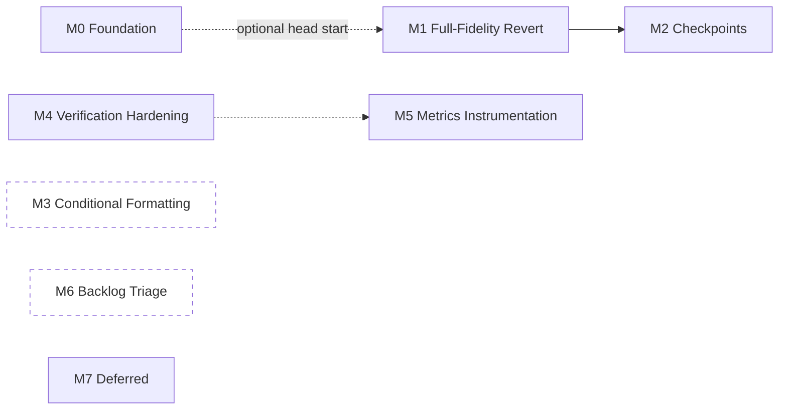

# TASKS.md — Cellix

> Numbered, sequenced backlog derived from `ARCHITECTURE.md` (how) and `PRD.md` (what/priority). Every task is scoped to be completable in one working session and has an explicit, standalone acceptance test — no task should require finishing a sibling task first to be verified, only to be *meaningful* in the product.
>
> Numbering is global and sequential across milestones so dependencies can be cited unambiguously (`Depends on: #14`). Milestone order is the recommended build order, not a hard constraint — M0, M3, and M6 have no dependencies on each other and can run in parallel with M1/M2 if more than one person/session is working this backlog at once.
>
> Tasks marked **[DECISION NEEDED]** are intentionally not started — they sit behind an open question in `PRD.md` §8 or `ARCHITECTURE.md` §7–8 that only you can resolve. Implementing ahead of that answer risks building the wrong thing twice.
>
> Status markers prefix the Task cell as work happens: **✅ Done**, **🚧 In progress**. No marker means not started yet — most of this backlog. New tasks discovered mid-implementation are appended at the next free number rather than inserted mid-sequence, so existing `Depends on` references never shift; a note in the Scope column says which milestone they actually belong to.
>
> *Drafted: August 17, 2026. Last updated: August 20, 2026 (#36–40 completed). **M3 — Conditional Formatting is now fully closed**: all four rule kinds, live shadow presence-tracking, read-back-and-modify, and a real revert path all shipped. **#36** (top/bottom-N) and **#37** (color-scale, the first rule kind with no `format` field at all) both followed #35's established pattern, no catalog changes needed since `CONDITIONAL_FORMAT` the action type never changed shape, only its `rule` union grew. **#39** gave the shadow workbook presence-only tracking of applied CF rules (`ShadowWorkbook.conditionalFormats`) — not a fill simulation, since the shadow has no format state to evaluate against, matching the standing `FORMAT_RANGE`/`HIGHLIGHT_CELL` reasoning. **#38** built real read-back-and-modify: Office.js's `ConditionalFormat.id`/`.getRange()`/`conditionalFormats.getItem(id)` (confirmed present and correctly typed in the pinned `@microsoft/office-js` package before writing any code) let a follow-up request target an existing rule via a new optional `existingRuleId` field on `ConditionalFormatAction`, threaded through `workbookReader.ts` → both `WorkbookContext` shapes → all three prompt-building tiers (Tier 1, Tier 3 Executor, Planner), rather than adding a whole new action type. **#40**, initially investigated and found blocked on the identical runtime-assigned-id gap `CREATE_CHART` hit at #15, was then actually *fixed* — scoped narrowly to `CONDITIONAL_FORMAT` (not extended to charts): a new `DELETE_CONDITIONAL_FORMAT` revert-only action, apply-time id capture threaded through four previously-void-returning layers (`RichActionEngine` → `ActionEngine` → `previewManager.accept()` → both of `App.tsx`'s independent accept paths), and a `POST /audit/apply/:changeSetId` contract change so the backend can patch the real Excel-assigned id into `structuralOps` after preview but before the change set is marked applied — `structuralOpsToInverseActions` fails closed (throws, zero DB writes) if that patch never happened. A create is now genuinely revertible; a modify (`existingRuleId` set) still isn't — its prior rule state is never captured, flagged as a real, separate follow-up rather than silently ignored. Full suites throughout: backend 106/106 suites (795/795 tests, up from 95/701 at the last update), frontend 38/38 files (216/216 tests, up from 32/153). See M0/M1/M2/M6 history below for prior sessions' work.) Last updated again: August 20, 2026 (#15 completed). **`CREATE_CHART` is now genuinely revertible**, closing the last deliberately-deferred item from M1's original #12–17 batch, by reusing #40's apply-endpoint contract mechanism end to end (`createdChartIds`, sibling of `createdConditionalFormatIds`, threaded through the same four layers). Found and fixed a real bug along the way: `actionNormalizer.ts` had no route for the new `DELETE_CHART` type, which would have made the revert silently unsupported at the UI layer despite `RichActionEngine`/`diff.engine.ts` building it correctly — fixed for `DELETE_CHART`, and the identical **pre-existing** gap in `DELETE_CONDITIONAL_FORMAT` (#40) was left alone and filed as new task **#67** rather than folded in. Full suites: backend 107/107 suites (810/810 tests, up from 107/802), frontend 39/39 files (219/219 tests, up from 38/216). Last updated again: August 20, 2026 (#67 completed). **The `DELETE_CONDITIONAL_FORMAT` routing gap #15 surfaced is now fixed** — same two-line `actionNormalizer.ts` pattern as `DELETE_CHART`, frontend-only. Full frontend suite: 39/39 files, 220/220 tests passing (up from 219). Last updated again: August 20, 2026 (#64 completed). **Full cell formatting (bold/italic/fontColor/fillColor) now survives revert**, not just number format — scoped to column-level granularity (matching the pre-existing `numberFormats` precedent exactly, after discovering the wire contract never carried true per-cell data), read from each column's first data row rather than the header row (avoids introducing header-style bold onto data cells). Borders explicitly deferred — `FormatSpec.borders` is too coarse a shape to faithfully restore. Full suites: backend 107/107 suites (804/804 tests, up from 802), frontend 40/40 files (225/225 tests, up from 220). M1 is now fully closed except #18's frontend surfacing (backend-only today).) Last updated again: August 20, 2026 (#18 completed). **M1 — Full-Fidelity Revert is now fully closed.** Wired `ChangeSet.irreversibleActionTypes` through all 4 preview-backed SSE `emit('actions', ...)` sites in `conversation.service.ts`, and threaded it frontend-side (`SseActionsData` → `PendingActions`/`ActionBlock` → `ActionResponseCard`) into a new amber pre-Accept warning banner naming the specific non-revertible action types, reusing the previously-unused `--warning-amber` CSS token. Warns rather than blocks — Accept stays enabled — matching M5.1's "identified... never discovered at revert time" requirement without taking the decision away from the user. Full suites: backend 107/107 suites (804/804 tests, unchanged — the change is a one-line addition at each emit site, sourced from an already-tested field, and `conversation.service.ts` has no dedicated spec at SSE-payload granularity to extend), frontend 40/40 files (228/228 tests, up from 225 — 3 new tests in `ActionResponseCard.spec.tsx`).) Last updated again: August 20, 2026 (#63 completed). **Real interactive test infrastructure now exists for `useConversation`** (jsdom + `@testing-library/react`, per-file `// @vitest-environment jsdom` override, global config untouched). New `useConversation.spec.tsx` makes #47's previously-un-automated acceptance test real: a mocked SSE stream that leaks an `actions` event during plan/ask mode never produces a pending `ActionBlock`, with a sanity-check test proving the harness can produce one in action mode (so the two negative tests aren't vacuous). **Found and fixed a real shipped bug while building this**: #18's `irreversibleActionTypes` field was added to the `SseActionsData` type but never actually read out of the raw SSE JSON in `sseParser.ts`'s `normalizeActionsData()` — the frontend warning banner from #18 was wired end-to-end except for this one silent drop, and would never have fired against a real backend. Fixed, with a new `sseParser.spec.ts` regression test. `App.tsx`-level coverage (needed for #45's fourth case, the `handlePreviewAccept` rollback from #44) was explicitly not attempted — `App.tsx` has zero test files and needs Office.js/`previewManager`/`ActionEngine` mocking beyond what this task built; filed as the narrower remaining gap on #45 rather than closed. Full suites: backend 107/107 suites (804/804 tests, unchanged), frontend 42/42 files (233/233 tests, up from 228 — 5 new tests across `useConversation.spec.tsx` and `sseParser.spec.ts`). `tsc --noEmit` clean in both `Server/` and `client/`.) Last updated again: August 20, 2026 (#45, #46 completed). **M4 — Verification & Safety Hardening is now fully closed.** #46: product decision recorded (do not extend overwrite-occupancy checking to Tiers 0–2 — AD-1's frontend-guard-is-sufficient reasoning accepted as adequate on its own), no code change; written up in `ARCHITECTURE.md` §7.2/§8. #45: the one remaining case (the `handlePreviewAccept` rollback from #44, previously blocked on `App.tsx` having zero test coverage) is now closed by `client/src/taskpane/App.spec.tsx` — the first test to render `App.tsx` at all. Rather than mounting the real component tree, it mocks `useConversation`/`previewManager`/`markChangeSetApplied`/`frontendTelemetry` and reduces `ConversationPanel` to a single Accept button, leaving `handlePreviewAccept` as the only real logic under test; `previewActions` (App's real `onPreviewActions` closure) is invoked directly by capturing it from the mocked hook's call arguments, reproducing the exact "no pending block yet, `previewManager.active` only" precondition without a full SSE round trip. Verified discriminating by temporarily reverting #44's rollback and confirming the new test fails. Full suites: backend 107/107 suites (804/804 tests, unchanged), frontend 43/43 files (235/235 tests, up from 233 — 2 new). `tsc --noEmit` clean in both `Server/` and `client/`.) Last updated again: August 20, 2026 (#58, #59 completed). **Both M7 design spikes closed** — no code, per their own scoping. #58 (data validation): a schema shape mirroring `ConditionalFormatRule`'s discriminated union, confirmed against the real Office.js `Range.dataValidation` API surface, with one genuine simplification over M7's chart/CF precedent — a validation rule has no runtime-assigned id, so its revert-inverse needs no apply-endpoint contract change. #59 (pivot table): confirmed by reading `buildAggregateTable` directly that `AGGREGATE_TABLE` computes one-dimensional, static, one-shot output — named three concrete gaps (no second/column dimension, no live refresh, no drill-down), but found no evidence of actual demand for the sharpest one (a true 2D crosstab) yet, so recommended leaving pivot-table implementation un-promoted, matching `PRD.md` §4's own "don't promote until aggregation demonstrably falls short" gate. See TASKS.md #58/#59 rows for the full notes.*

---

## Milestone Overview

| Milestone | Goal | Anchors | Tasks |
|---|---|---|---|
| **M0 — Foundation & Hygiene** | Stop the repo-integrity and type-drift risks from compounding while the real feature work happens on top of them. | `ARCHITECTURE.md` §7.1, `CODEBASE_ANALYSIS.md` §3.1–3.3/3.9–3.13 | #1–9, 61–62 |
| **M1 — Full-Fidelity Revert** ✅ Closed — #10–20, 64, 67 all done | Close PRD's M5.1 — any action the agent can apply, it can undo. | `PRD.md` M5.1, `ARCHITECTURE.md` AD-9, `DATABASE_SCHEMA.md` §5 | #10–20, 64, 67 |
| **M2 — Checkpoints** ✅ Closed | Close PRD's M5.2 — named restore points that survive a conversation reset. | `PRD.md` M5.2, `ARCHITECTURE.md` AD-4/AD-9, `DATABASE_SCHEMA.md` §6 | #21–31 |
| **M3 — Conditional Formatting** ✅ Closed | Close PRD's M7 — live, rule-based highlighting, not static one-shot fills. | `PRD.md` M7 | #32–40 |
| **M4 — Verification & Safety Hardening** ✅ Closed — #41–47, 63, 65–66 all done | Close the false-success pattern and the Tier 0–2 coverage gap AD-2/AD-3 named explicitly. | `ARCHITECTURE.md` AD-2/AD-3, `PRD.md` A1 | #41–47, 63, 66 |
| **M5 — Metrics Instrumentation** 🚧 Backend closed, Dashboard UI deferred | Make PRD's Tier A gates (A5, A6) measurable — they currently aren't. | `PRD.md` §6.1 | #48–51 |
| **M6 — Backlog Triage** ✅ Closed | Verify the ~5 historical bug specs `CODEBASE_ANALYSIS.md` couldn't confirm are actually fixed. | `PRD.md` §8 Q3 | #52–57 |
| **M7 — Deferred (not gating v1)** ✅ Spikes closed — #58–59 done, #60 still blocked on CA sign-off | Stub-level placeholders for nice-to-haves. Do not pull forward without a scope decision. | `PRD.md` §4 | #58–60 |

Solid arrows are hard dependencies. `M3` and `M6` are fully independent of everything else — good candidates to run in parallel or to pick up first if you want early, low-risk wins.

---

## M0 — Foundation & Hygiene

None of these are product features. All are cheap, and every one reduces risk for the milestones that follow. #1–2 in particular should happen before anyone spends real time in `Dashboard/` or on a fresh clone of the repo.

| # | Task | Scope | Acceptance Test | Depends on |
|---|---|---|---|---|
| 1 | ✅ Done (superseded) — Resolve `Dashboard/`'s disconnected git history | **Found already resolved by a repo reorg that predates this session and isn't reflected anywhere else in these docs.** The outer repo is no longer `Cellix-2026` containing gitlinked/blob-tracked app dirs — it's now `Root/` (docs, `shared/`, `specs/` only), with `frontend`/`cellix_backend`/`Dashboard` explicitly `.gitignore`d and documented in `Root/README.md` as three fully separate repos to clone alongside it (`usecellix/client`, `usecellix/Server`, `usecellix/Analytic-Dashboard`). This is decision "keep as genuinely separate repos," chosen and written down. | `Root/README.md`'s clone table + `Root/.gitignore`'s `/frontend/ /cellix_backend/ /Dashboard/` block confirm the decision. **Not independently re-verified**: `Dashboard/` isn't cloned in this environment, so its own `git log` wasn't inspected directly. | — |
| 2 | ✅ Done (superseded) — Register `cellix_backend`/`frontend` as real git submodules, or absorb them | Same reorg as #1: resolved by *not* using submodules or gitlinks at all — both are plain standalone repos, gitignored from `Root/`, matching Dashboard's treatment rather than being special-cased. | `git ls-files -s` in `Root/` shows no `160000` gitlink entries for either path (they're absent from the tree entirely, per `.gitignore`). | 1 ✅ |
| 3 | Moot (superseded) — Fix `backend-tests.yml` CI checkout | The submodule/gitlink problem this task targeted no longer exists post-#2's resolution — `cellix_backend` (now `Server`) is a plain standalone repo, not a gitlink `Root/` needs to check out. **Confirmed no `.github/workflows/` exists in the local `Server` checkout at all** — either CI was never added there or was removed; either way there's nothing checkout-broken to fix on the code found in this pass. Re-open as a *new* task if `Server`'s actual GitHub repo has its own CI that needs auditing on its own terms. | N/A — task's premise (a gitlinked submodule breaking checkout) no longer applies. | 2 ✅ |
| 4 | ✅ Done — Delete the frontend's drifted local `action.types.ts` copy | Deleted `frontend/src/shared/action.types.ts`; `frontend/src/action.types.ts` now re-exports `../../shared/action.types` directly. Along the way: added `underline?: boolean` to the canonical `FormatSpec` (the one real field the local fork had that canonical lacked — declared but not yet read by any handler, so nothing regressed) and added `server.fs.allow` in `vite.config.ts` so the dev server can serve a file one level above the frontend's own project root. | `npx vitest run` in `frontend/` — 151/151 passing, matching baseline. `npx tsc --noEmit` — zero errors. Verified no code references the Hide/Unhide/Protect/Show interface names directly (dispatch is by runtime string via a loose cast), so the split-vs-merged shape difference was safe to fix. | — |
| 5 | ✅ Done — Add a cross-repo action-type exhaustiveness check | **Original task description had the wrong comparison target — corrected after investigating.** `shared/action.types.ts`'s `RichAction` (~51 types) is a narrower, *post-normalization* type; it is not what the backend's catalog should be compared against. The real wire-level counterpart is `frontend/src/types/sheet-actions.ts`'s `SheetActionType` (60 types) — confirmed by hand that the backend's 58-entry catalog is a clean subset of it, with exactly two frontend-only extras (`CLEAR_RANGE`, `APPEND_ROW`, both documented as "rich-only forms produced by legacyConverter and the local shortcuts"). Built two catalogs, mirroring the backend's `action-catalog.ts` pattern: `frontend/src/types/sheetActionCatalog.ts` (`Record<SheetActionType, true>`, wire-type parity) and `frontend/src/engine/actionDispatchCatalog.ts` (`Record<RichAction['type'], true>`, frontend's own dispatch completeness) — each a compile-time-enforced exhaustiveness map, same mechanism as the backend's. The cross-repo test (`actionCatalogParity.spec.ts`) imports the backend's `action-catalog.ts` directly via a relative path, so it compares the backend's actual runtime export, never a hand-copied mirror that could itself drift. **Near-miss worth recording:** while investigating, `FILL_RIGHT`/`CLEAR_CONTENT`/`CREATE_SHEET` initially looked like real, live gaps — advertised to the Executor with concrete prompt examples, but absent from `RichAction` and from `actionEngine.ts`'s dispatch switch. Traced it through before reporting a false bug: all three are legitimately handled by `legacyConverter.ts`, a normalization layer that narrows the wire-level `SheetActionType` down to `RichAction` before dispatch — not a gap, just a type system I hadn't fully mapped yet. | `tsc --noEmit` clean (both catalogs compile, confirming no typos across the hand-transcribed 51- and 60-member unions). Drift-detection verified directly: temporarily injected a fake type into the comparison, confirmed the test failed with the exact expected diff, then reverted. **Caught a real gap in my own first draft**: `vitest run` passed a version of the test that `tsc --noEmit` then flagged as a genuine type error (`.includes()` across the two packages' distinct `SheetActionType` unions doesn't type-check, since frontend's has 2 extra members) — fixed by comparing as plain string `Set`s, since the exhaustiveness guarantee already lives in the catalogs' own `Record<X, true>` shapes, not in this comparison logic. Full suite: 32 files, 153/153 passing (up from 31/151). | 4 ✅ |
| 6 | ✅ Done — Confirmed and removed `cellix_backend/src/actions/action.types.ts` | **Confirmed dead a second time before deleting**, not taken on trust from the earlier session: zero imports of `actions/action.types` across `src/` and `test/`, and the only remaining textual matches for "action types" are prose inside planner/executor prompts and comments, not module references. The file was the sole occupant of `src/actions/`, so the now-empty directory was removed with it. It duplicated `CellValue` / `FormatSpec` / action shapes that live in the real source of truth (`shared/action.types.ts` and `excel-ai/types/`), and was part of the type-drift problem `ARCHITECTURE.md` AD-7 describes — one fewer place for the five-file drift to originate. A copy is retained in this session's scratchpad in case anything is later found to want it. Previously blocked only because an earlier session's tooling refused delete-shaped commands. | Acceptance criteria from the original filing, both met: `tsc --noEmit` in `cellix_backend/` is **clean** with the file gone, and the full backend suite still passes — **912/912 across 115 suites**, unchanged from before the deletion. | — |
| 7 | ✅ Done — Consolidate duplicate spec files | Diffed all four `00_MASTER_PRIORITY_QUEUE*.md` variants and confirmed `(2)_high.md` (216 lines) is a strict superset of the other three (every diff was one-directional — nothing unique in the shorter files). Diffed all four `18_tier2_retry_and_context_resolution*.md` variants (including a stray identical copy under `specs/pipeline-upgrade-2026/`) and confirmed the plain `.md` is the most current (most checkboxes marked done). Promoted each superset/most-current file to the canonical filename; moved the other three per number into `specs/archive/` with content intact (relocated via `mv`, not deleted — deletion is blocked this session, see #6). | `specs/` now has exactly one `00_MASTER_PRIORITY_QUEUE.md` (216 lines) and one `18_tier2_retry_and_context_resolution.md` (88 lines, most current) at top level; `specs/archive/` holds the four archived variants, byte-identical to their originals. | — |
| 8 | ✅ Done (superseded) — Remove `last_log.txt` from the tracked tree | **Already resolved** by the same reorg as #1/#2: `Root/.gitignore` already has `last_log.txt` and `*.log` entries, and `git log --oneline -- last_log.txt` in `Root/` returns nothing — the file was never committed to this repo's history. No file matching that name exists in `Root/` today. | Confirmed via `git log` (empty) and directory listing (absent). | — |
| 9 | ✅ Done — Document Workflow tracing + `action-catalog.ts` in `CLAUDE.md` | Added two additions to `Root/CLAUDE.md`'s Architecture section: an "Action-type exhaustiveness checks" bullet under Action System (covers `action-catalog.ts`, the frontend's mirrored catalogs, and `actionCatalogParity.spec.ts`), and a new "Workflow Tracing" subsection (covers `WorkflowTraceService`, the `workflow_traces` collection, and the Dashboard's `/workflow` view). Also softened the pre-existing "canonical source of truth" claim about `shared/action.types.ts` to point at `ARCHITECTURE.md` AD-7, since §3.3/AD-7 confirm it isn't quite true in practice. | A reviewer reading only `CLAUDE.md` can now find both subsystems without being pointed to `CODEBASE_ANALYSIS.md`. | 5 ✅ |
| 61 | ✅ Done — Resolve `rangeFilter.ts` divergence between frontend and canonical `shared/` | **Discovered while completing #4.** Root cause confirmed: `resolveFilterColumnIndex()` has real numeric-column-handling logic (1-based Excel ordinal preference, 0-based fallback) in **every** copy of this file — canonical `shared/rangeFilter.ts`, the backend's own `range-filter.util.ts`, and the frontend's fork — but `RangeFilterSpec.column` is typed `string` in all three authoritative sources (`shared/action.types.ts`, `shared/rangeFilter.ts`, and the backend's live `sheet-actions.types.ts`). Nothing anywhere constructs a filter with a numeric column. The frontend's `string \| number` widening reflected no real caller — it was unused slack, not a hidden requirement, so the fix was to narrow back to canonical, not widen it. Deleted `frontend/src/shared/rangeFilter.ts`; `frontend/src/engine/rangeFilter.ts` now re-exports `../../../shared/rangeFilter` directly, dropping the redundant `as RangeFilterOperator` cast along with it. | `npx vitest run` — 151/151 passing. `npx tsc --noEmit` — zero errors. | — |
| 62 | ✅ Done — Deduplicate `RangeFilterOperator`/`RangeFilterSpec` declarations within `shared/` itself | Confirmed verbatim duplicate at `shared/action.types.ts:290-305` vs. `shared/rangeFilter.ts:1-15`. Fixed as scoped: `action.types.ts` now does `import type { RangeFilterOperator, RangeFilterSpec } from './rangeFilter'` + re-exports both (so existing external imports from `action.types.ts` don't break), and the redeclaration is deleted. `rangeFilter.ts` has no imports of its own, so no circular-import risk. **Left the backend's third declaration** (`cellix_backend/src/excel-ai/types/sheet-actions.types.ts`) alone, per the task's own framing — it's reconciled by #5's cross-repo exhaustiveness check rather than a shared source import, since the backend doesn't currently import from `shared/` directly. **Found and fixed an unrelated latent break while verifying**: `frontend/src/types/actionCatalogParity.spec.ts` (#5's cross-repo drift test) imported `../../../cellix_backend/src/excel-ai/types/action-catalog` — a path that assumes the README's documented local folder name (`cellix_backend/`). This machine's actual checkout uses `Server/` instead (see new note in `CODEBASE_ANALYSIS.md` §3.14), so the import silently 404'd and the test file failed to load at all. Repointed the import to `../../../Server/...` to match the checkout that's actually here — **flagged, not silently decided**: if other contributors follow the README's naming exactly, this fix breaks for them and the discrepancy needs resolving one direction or the other. | `tsc -p tsconfig.json` clean in `Server/`; `tsc --noEmit` clean in `client/`. `npx vitest run` in `client/`: 33/33 files, 155/155 passing (up from 32/153 baseline — the two new tests are `actionCatalogParity.spec.ts`'s pair, now actually executing instead of failing to load). | — |

---

## M1 — Full-Fidelity Revert (PRD M5.1)

Goal, verbatim from `PRD.md`: *"Any action the agent can apply, it must be able to undo."* `DATABASE_SCHEMA.md` §5 already specified the schema additions (`ChangeSet.structuralOps`, using the already-captured `CellSnapshot.format` field) — these tasks implement against that design. Structural op types are split into separate tasks because each has a genuinely different Office.js inverse shape; don't combine them into one "structural revert" task or it stops being one-session-sized.

| # | Task | Scope | Acceptance Test | Depends on |
|---|---|---|---|---|
| 10 | ✅ Done — Use the already-captured `format` field in the inverse builder | Simpler than originally sketched: `SET_CELL`/`SET_FORMULA` already carry an optional `format?: FormatSpec` field, so the inverse just attaches `{ numberFormat: snapshot.format }` to the same action — no separate `FORMAT_RANGE` action needed. Verified against the real frontend handler (`cell.handler.ts`/`format.handler.ts`) that a partial `FormatSpec` only touches the properties present (confirmed via `!== undefined` checks throughout `applyFormat`), so this can't accidentally clobber bold/fill/etc. **Adjacent gap found and fixed to make this testable:** `virtualApply.ts`'s shadow-workbook simulator was completely blind to `action.format` — `virtualSetCell` never read it at all, so the backend couldn't verify its own fix. Threaded `numberFormat` through `virtualSetCell`/`virtualSetCellLegacy`/`virtualSetFormulaLegacy`/`virtualBatchSet` (scoped narrowly to numberFormat only — the fuller `virtualApply.ts` audit is still #41/#42's job, not redone here). | New test in `diff.engine.spec.ts`: format a cell (value + numberFormat) via `virtualApply`, generate the inverse, apply it, assert the numberFormat is restored to the original — not just the value. **Verified the test actually catches the bug**: temporarily reverted just the `diff.engine.ts` fix via `git stash` and re-ran — test failed exactly as expected (`Expected: "General", Received: undefined`), then restored. `tsc --noEmit` clean on the backend; `diff.engine.spec.ts` 4/4, plus 17/17 across other `virtualApply.ts`-dependent suites (virtual-aggregate-table, virtual-copy-filtered, virtual-sort-sparse, insert-column-overwrite, audit-sourcerefs) — no regression. | — |
| 11 | ✅ Done — Add `ChangeSet.structuralOps` schema field | Added `StructuralOpSchema` (`opType`, `sheetName`, `params: Mixed`, `appliedAt`) to `audit/schemas/change-set.schema.ts` and a matching `StructuralOp` interface to `audit/types/change-set.types.ts`, both per `DATABASE_SCHEMA.md` §5.2. Threaded through `change-set.service.ts`: `createPreview()` now writes `structuralOps: []` (population comes with #12–17, not here), `toRecord()` reads it back with a `?? []` guard for pre-existing documents that predate the field. Made `structuralOps` a required (non-optional) field on `ChangeSetRecord` since the Mongoose schema always defaults it to `[]` — confirmed Mongoose applies schema defaults on hydration for fields absent from a legacy document, not just on document creation, so this doesn't break reading old data. Updated three test fixtures (`conversation-tier-routing.spec.ts`, `refinement-context.util.spec.ts`, `audit-export.spec.ts`) that construct `ChangeSetRecord` object literals and would otherwise fail to type-check. | New `test/change-set.schema.spec.ts` (2 tests): a document hydrated from a raw object with no `structuralOps` key at all (simulating pre-migration data) defaults to `[]` and validates cleanly; a document constructed with a populated `structuralOps` array round-trips through `.toObject()` correctly. Full backend suite: 91 suites / 672 tests passing (up from 90/670 pre-change, +2 for the new spec file, net zero elsewhere). `tsc -p tsconfig.json --noEmit` clean. **Note:** plain `tsc` didn't initially catch the three broken test fixtures — `test/` is excluded from `tsconfig.json`'s `include`; ts-jest caught them on its own stricter pass instead, all fixed. | — |
| 12 | ✅ Done — Structural inverse: `ADD_SHEET` / `DELETE_SHEET` | Added `captureStructuralOps()`/`structuralOpsToInverseActions()` to `diff.engine.ts`, wired into `change-set.service.ts`'s `createPreview()`/`revert()`. **Design choice beyond the task's literal wording**: `DELETE_SHEET`'s inverse does *not* rely on the generic `changes`/`beforeState` cell-diff path — it independently snapshots the deleted sheet's full cell contents (value/formula/format) directly from the *before* shadow workbook at preview time, into `StructuralOp.params.cells`. Reason: `generateDiff()` only diffs `changedCells` when that set is non-empty (populated by *other* actions in the same batch), and `DELETE_SHEET` itself never marks cells changed — so a compound request (e.g. "delete Sheet X and update cell Y elsewhere") would silently drop Sheet X's cells from the diff entirely, and the generic inverse builder would then only partially restore it. The independent snapshot sidesteps that gap rather than depending on #41/#66's audit to someday catch it. Revert ordering: inverse actions are assembled as `[...pre, ...cellInverse, ...post]` — a recreated sheet (`ADD_SHEET`, from undoing `DELETE_SHEET`) must exist *before* any cell-level `SET_CELL`/`SET_FORMULA` inverse tries to write into it (`pre`), while a sheet this change set added must be deleted *after* cell-level inverses have run so nothing writes into an already-removed sheet (`post`). Ops undo newest-first, standard undo-stack order. | New `test/diff.engine.structural.spec.ts` (3 tests): reverting `ADD_SHEET` removes the created sheet and leaves `Sheet1`'s original cells untouched; reverting `DELETE_SHEET` recreates the sheet with its original values **and** a non-default formula/format (not just plain values); a batch with no structural actions produces zero `structuralOps`. **Verified discriminating**: `git stash`'d `diff.engine.ts` alone and re-ran — the new spec failed at compile time (`captureStructuralOps`/`structuralOpsToInverseActions` don't exist), confirming it isn't vacuously passing; restored via `git stash pop`. Full backend suite: 92 suites / 675 tests passing (up from 91/672). `tsc -p tsconfig.json --noEmit` clean. | 11 ✅ |
| 13 | ✅ Done — Structural inverse: `INSERT_COLUMN` / `DELETE_COLUMN` | **Not the same pattern as #12** — required a design change, explained below. Added a `structuralLog: StructuralLogEntry[]` side-channel to `ShadowWorkbook` (`shadowWorkbook.types.ts`), populated by `virtualInsertColumn`/`virtualDeleteColumnLegacy` in `virtualApply.ts` with the *resolved* column index/count each actually used — not re-derived from the action's raw targeting syntax (a letter, a header name, a numeric index) in `diff.engine.ts`, which would risk drifting from virtualApply's own resolution logic. `captureStructuralOps()` now takes `afterShadow` too and reads this log. **Key design finding, worked through by hand before coding**: unlike `DELETE_SHEET`, a deleted/inserted column's *shifted neighbor cells* don't need independent capture at all — undoing via a real structural `INSERT_COLUMN`/`DELETE_COLUMN` action (not per-cell `SET_CELL`s) naturally un-shifts them for free, because the forward shift and the inverse shift cancel exactly. Only the *actually deleted* column's own cell contents need capturing (from `beforeShadow`, via new `snapshotColumnCells()`). Discovered by hand-tracing a 5-column example both ways — see the reasoning trail in this session, not reproduced here. **Necessary consequence**: the generic cell-level diff/inverse (`beforeStateToInverseActions`) would still independently try to touch the same shifted cells (since `virtualDeleteColumnLegacy` marks them in `changedCells`) and — worse — running its `SET_CELL` on a column index the structural inverse already removed would resurrect a phantom column. Added `excludeStructurallyOwnedChanges()`, applied in `change-set.service.ts` before the cell-diff is stored, filtering out any change in a sheet at or past a captured column op's index. Inverse actions use the *real* dispatched shapes (`InsertColumnAction.beforeColumn`, `DeleteColumnAction.columns: string[]`) via `colIndexToLetter`, not virtualApply's more permissive `col`/numeric forms — these are returned to the frontend and applied for real. | New tests in `diff.engine.structural.spec.ts`: reverting `INSERT_COLUMN` (`beforeColumn: 'B'`) removes the inserted column, restores `columnCount`, and leaves A/B/C's original values intact — the literal spec-14 repro shape; reverting `DELETE_COLUMN` restores the deleted column's original values and the shifted neighbor lands back in its original position. **Verified discriminating**: `git stash`'d only `virtualApply.ts`'s instrumentation and re-ran — both new tests failed (empty `structuralOps`, wrong `columnCount`/values), confirming the fix is load-bearing, not vacuous; restored via `git stash pop`. Full backend suite: 92 suites / 677 tests passing (up from 92/675 — 2 new tests, no regressions). `tsc -p tsconfig.json --noEmit` clean. | 11 ✅, 12 ✅ |
| 14 | ✅ Done — Structural inverse: `INSERT_ROW` / `DELETE_ROW` | Extended #13's `structuralLog` side-channel (`shadowWorkbook.types.ts`) with `INSERT_ROW`/`DELETE_ROW`, populated by `virtualAddRowAfter` (shared by both `ADD_ROW` and `INSERT_ROW` — both are real structural shifts in Office.js, so both get a correct inverse for free, a small bonus beyond this task's literal scope) and `virtualDeleteRows`. **A genuine difference from #13, not just relabeling**: worked through a 6-row, 2-row-delete example by hand and found columns' "reverse the log = correct undo order" rule does *not* transfer directly — `DELETE_COLUMN` naturally logs in descending index order (its own removal loop processes right-to-left), so reversing gives ascending restore order; `DELETE_ROW` is a single-pass whole-sheet rebuild that would naturally encounter rows in *ascending* order, which reverses to *descending* restore order — verified by hand-tracing that descending restore order for rows produces rows landing in the wrong relative position. Fixed by explicitly sorting `DELETE_ROW`'s logged entries descending (`[...rows].sort((a,b)=>b-a)`) before pushing, restoring the same "reverse-the-log = correct" invariant `structuralOpsToInverseActions` already relies on for every other op type, rather than special-casing row order in the inverse builder itself. Generalized `excludeStructurallyOwnedChanges()` to track per-sheet row *and* column minimums (was column-only). One real type mismatch found: the backend's internal `SheetActionPayload.rows` field is `unknown[][]` (shared with an unrelated table-data use) even though the real `DELETE_ROW` wire shape is `rows: number[]` — `virtualApply.ts`'s own DELETE_ROW handling already casts through this same mismatch; matched that existing pattern (`as unknown as Action`) rather than fighting the type. | New tests in `diff.engine.structural.spec.ts` against a 4-row fixture: reverting `INSERT_ROW` removes the inserted row and restores all original row positions/values; reverting a single-row `DELETE_ROW` restores it with neighbors shifted back correctly; reverting a **multi-row** `DELETE_ROW` (`rows: [2, 4]`, non-contiguous) restores both in the correct final order — this test is the one that would have caught the ascending/descending ordering mistake described above. **Verified discriminating**: `git stash`'d only `virtualApply.ts`'s instrumentation and re-ran — all 3 new row tests failed (empty `structuralOps`, wrong `rowCount`/positions); restored via `git stash pop`. Full backend suite: 92 suites / 680 tests passing (up from 92/677 — 3 new tests, no regressions). `tsc -p tsconfig.json --noEmit` clean. | 11 ✅, 13 ✅ |
| 15 | ✅ Done — Structural inverse: `CREATE_CHART` | Reused #40's apply-endpoint contract mechanism (`handleCreateChart` already returned `{ chartId }` — the real Office.js-assigned chart name read back right after `.add()` — but nothing collected or threaded it before this task). Added `DeleteChartAction` (`shared/action.types.ts`, revert-only, `advertise: false`) dispatched via `Worksheet.charts.getItem(chartId).delete()`. `diff.engine.ts`: `captureStructuralOps` captures every `CREATE_CHART` action (no modify-in-place variant exists for charts, unlike CONDITIONAL_FORMAT's `existingRuleId`, so no per-instance nuance needed) keyed by `sheetName`+`sourceRange`; `structuralOpsToInverseActions` fails closed (throws) if `chartId` was never patched in. `RichActionEngine.applyActions` now collects `createdChartIds` (sibling of `createdConditionalFormatIds`) from `handleCreateChart`'s return, threaded through `ActionEngine.applyActionsWithReport` → `previewManager.accept()` → both of `App.tsx`'s accept paths → `markChangeSetApplied()` → `POST /audit/apply/:changeSetId`'s body → `ChangeSetService.markApplied()`, which patches `structuralOps` matching `op.sheetName`+`op.params.sourceRange`. `reversibility-catalog.ts`: `CREATE_CHART` flipped to `reversible: true`; new `DELETE_CHART: { reversible: false }` entry (revert-only synthetic, same as `DELETE_CONDITIONAL_FORMAT`). **Real bug found and fixed along the way, not pre-existing to this task's own new code**: `actionNormalizer.ts`'s `isRichAction`/`toRichAction` had no entry at all for `DELETE_CHART` — without a fix, the revert/restore application path (`ActionEngine.applyActions` → `partitionActions` → `normalizeToRich`) would have silently classified every `DELETE_CHART` inverse as "unsupported" and never dispatched it, even though `RichActionEngine.applyActions` (the lower-level engine `diff.engine.ts`/tests exercise directly) handles it correctly. Fixed by adding `DELETE_CHART` to `isRichAction`'s `richOnly` set and a passthrough case in `toRichAction`. **Adjacent gap found, deliberately NOT fixed (out of scope for this task)**: `DELETE_CONDITIONAL_FORMAT` (TASKS.md #40) has the identical gap — also missing from `isRichAction`/`toRichAction`, so a CONDITIONAL_FORMAT revert or checkpoint restore routed through `ActionEngine.applyActions` (i.e. every real revert/restore button in the UI — `ChangeHistoryPanel`'s `onRevert` and `CheckpointPanel`'s restore both call it) would currently also fail to apply the rule-deletion half of its inverse. Flagged as new task #67 below rather than folded into this one. | New `Server/test/diff.engine.structural.spec.ts` describe block (3 tests, mirroring #40's CONDITIONAL_FORMAT block exactly): captures a pending structuralOp with no `chartId`; throws building the inverse if `chartId` was never patched in; produces a `DELETE_CHART` inverse once patched. New `Server/test/change-set.service.chart-revert.spec.ts` (3 tests, mirroring #40's `change-set.service.conditional-format-revert.spec.ts` exactly): patches the real id at `markApplied` time and builds a working revert (independent shadow-convergence check included); fails closed with no id ever reported; only patches the structuralOp matching sheetName+sourceRange in a two-chart batch. New `client/src/engine/actionEngine.chart.spec.ts` (2 tests, mirroring `actionEngine.conditionalFormat.spec.ts`): reports the created chart name keyed by sheetName+sourceRange; omits `createdChartIds` when no `CREATE_CHART` ran. New test in `client/src/engine/actionNormalizer.spec.ts`: `DELETE_CHART` routes to the rich engine (this is the test that would have caught the `isRichAction` gap above). Updated `Server/test/reversibility-catalog.spec.ts` (CREATE_CHART now asserted reversible, DELETE_CHART irreversible) and `Server/test/normalize-field-preservation.spec.ts` (new DELETE_CHART fixture — required adding a generic `chartId` copy in `normalize-executor-output.util.ts`, mirroring `ruleId`'s existing generic copy, since the fixture is exhaustive over `SheetActionType`). **Found and fixed one existing test whose premise this task invalidated**: `Server/test/checkpoint.service.spec.ts`'s "#29 — fails closed... when a change set has an irreversible action type" used `CREATE_CHART` as its example of an irreversible type; swapped to `UPDATE_CHART` (still irreversible — nothing captures a chart's prior configuration). Full suites: backend 107/107 suites, 810/810 tests passing (up from 107/802 pre-change — +8 net across the new chart-revert/structural/normalize-fixture tests and the reversibility-catalog updates); frontend 39/39 files, 219/219 tests passing (up from 38/216 pre-change — CONDITIONAL_FORMAT was #40's last frontend count). `tsc --noEmit` clean in both `Server/` and `client/` (`StructuralOpType` needed a `'CREATE_CHART'` member added alongside `diff.engine.ts`'s usage). **Not independently verified**: the real Office.js `Worksheet.charts.getItem(chartId).delete()` call against live Excel — same standing class of caveat as #34/#65/#15's own sibling #40. | 11 ✅ |
| 16 | ✅ Done — Structural inverse: `CREATE_TABLE` | **Genuinely cross-repo, unlike #12–14** — no `DELETE_TABLE` action existed anywhere (shared/frontend/backend) to build an inverse from, so this task added one net-new rather than only writing inverse-construction logic. Added `DeleteTableAction` to `shared/action.types.ts` (unwraps a Table back to a plain range — `table.convertToRange()` — leaving cell values/formats untouched, since `CREATE_TABLE` itself never touches them). Wired end to end: frontend `handleDeleteTable` in `table.handler.ts`, dispatch case in `actionEngine.ts`, both frontend exhaustiveness catalogs (`sheetActionCatalog.ts`, `actionDispatchCatalog.ts`), the backend's live `SheetActionType` union (`sheet-actions.types.ts`), its `action-catalog.ts` (`advertise: false` — this is a revert-only inverse, not something the Executor should propose on its own, matching `CHECKPOINT`'s precedent), and `virtual-apply-catalog.ts`/`virtualApply.ts`'s documented no-op (alongside `CREATE_TABLE`'s existing one — neither touches cell values). `diff.engine.ts`: `captureStructuralOps` captures `CREATE_TABLE` actions directly (tableName/sheetName are agent-given, not runtime-resolved like `CREATE_CHART`'s `chartId` — no #15-style capture problem here); `structuralOpsToInverseActions` emits `DELETE_TABLE` in `post` only, no cell restore needed. **Scope note, decided with the user before starting**: #15 (`CREATE_CHART`) was deliberately skipped ahead of this task — it has a materially different, harder shape (the chart's real ID is only known *after* a live Office.js apply, requiring an apply-endpoint contract change to carry it back to the backend; untestable in this session). `CREATE_TABLE` has no such runtime-ID problem, so it proceeded on its own. | New tests in `diff.engine.structural.spec.ts`: reverting `CREATE_TABLE` produces a structural op and a `DELETE_TABLE` inverse action with the correct sheet/table name, with cell values confirmed untouched both forward and after revert (the shadow workbook has no table-state concept at all — per `virtual-apply-catalog.ts` — so cell-value non-interference is the correctness property actually verified in Node; the inverse *action shape* is what's returned to the frontend for a real `convertToRange()`, unverifiable against live Excel in this session, same caveat as #65/#15); a missing `tableName` produces no structural op. **Verified discriminating**: `git stash`'d `diff.engine.ts` and re-ran — compile failure (missing exports), confirming the whole file's fix is load-bearing; restored via `git stash pop`. Full suites: backend 92/683 passing (up from 92/680 — 2 new tests, plus one existing fixture (`normalize-field-preservation.spec.ts`) updated for the new action type, no regressions); frontend 33/155 passing, `tsc --noEmit` clean in both `Server/` and `client/`. | 11 ✅ |
| 17 | ✅ Done — Structural inverse: `MERGE_CELLS` / `UNMERGE_CELLS` | **Backend-only, unlike #16** — both actions already existed and were fully dispatched end to end in the frontend (`UNMERGE_CELLS` via `worksheet.handler.ts`, confirmed by grep before starting), so this was purely inverse-construction, closer in shape to #12–14 than #16. Key design finding: `MERGE_CELLS`'s own cell-clearing effect (discarding every non-top-left cell's value, per #66) is **already** correctly captured by the generic `changes`/`beforeState` cell-diff machinery — unlike `DELETE_SHEET`/`DELETE_COLUMN`, no independent cell-content capture was needed here. The only genuinely missing piece was the *structural* step: cells can't be individually `SET_CELL`'d back until the range is unmerged first, so `MERGE_CELLS`'s inverse is `UNMERGE_CELLS` placed in `pre` (runs before the generic cell restore). `UNMERGE_CELLS`'s own inverse (re-`MERGE_CELLS`) is placed in `post` — real Excel doesn't resurrect values a prior merge already discarded, so there's no cell-level work to sequence around, but `post` avoids the re-merge risking clobbering a value some other pending restore in the same batch still needs to write. Added a `resolveRangeString()` helper to normalize both of `MERGE_CELLS`/`UNMERGE_CELLS`'s accepted action shapes (`range: string`, or `row`/`col`/`rowCount`/`colCount`) into the A1 string the real dispatched action requires — deliberately not reusing `virtualApply.ts`'s own `resolveSpan()`, which depends on `parseA1Range` for the opposite (string→bounds) direction this doesn't need. | New tests in `diff.engine.structural.spec.ts`: reverting `MERGE_CELLS` unmerges the range **and** restores the discarded non-top-left cell's original value (a full before/after shadow-state check, since this operation's cell effects — unlike #16's — are simulated); reverting `UNMERGE_CELLS` produces a correctly-shaped `MERGE_CELLS` inverse (action-shape check only, matching #16's approach, since real unmerge has no cell effect to verify in the shadow). **Verified discriminating**: `git stash`'d `diff.engine.ts` and re-ran — compile failure, confirming the fix is load-bearing; restored via `git stash pop`. Full backend suite: 92 suites / 685 tests passing (up from 92/683 — 2 new tests, no regressions). `tsc -p tsconfig.json --noEmit` clean. No frontend changes needed. | 11 ✅ |
| 18 | ✅ Done — Preview-time irreversibility flag | **Backend half (`reversibility-catalog.ts`, `ChangeSet.irreversibleActionTypes`) was already built in a prior session — see the original entry text below.** This session closed the remaining frontend-surfacing gap. Wired `changeSet.irreversibleActionTypes` into all 4 preview-backed SSE `emit('actions', ...)` call sites in `Server/src/excel-ai/services/conversation.service.ts` (Tier 2's two sites, the Tier 3 partial-progress site, and the Tier 3 staged-wave site) — the other 3 `emit('actions', ...)` sites create no `ChangeSet` (already-applied/tableFallback/structured paths), so nothing to attach there. Frontend: added `irreversibleActionTypes?: string[]` to `SseActionsData` (`client/src/utils/sseParser.ts`), `PendingActions`/`PreviewActionsMeta` (`client/src/hooks/useConversation.ts`), and `ActionBlock` (`client/src/types/conversationTurn.ts`); threaded it through `createActionBlock()` and the SSE `'actions'` handler's `pendingActions` construction. UI: `ActionResponseCard.tsx` renders a new amber warning (`data-testid="action-irreversible-notice"`, reusing the pre-existing but previously-unused `--warning-amber` CSS token) above Accept/Reject whenever `block.irreversibleActionTypes` is non-empty and the block is still pending — placed using the same "muted note above the buttons" slot as the existing staged-wave `blockedNotice`, but as a warning rather than a block: Accept stays enabled, matching M5.1's "identified... never discovered at revert time" requirement (warn, don't block — the user may still want an irreversible change). | New tests in `ActionResponseCard.spec.tsx` (3): warns and names the action type when `irreversibleActionTypes` is populated, with Accept still enabled; renders no notice for an empty array; renders no notice once `proposalStatus` is `'accepted'` (the warning is pre-accept only). Full suites: backend 107/107 suites, 804/804 tests passing (no change — this session added no new backend tests, since the 4 emit-site edits are one-line object-literal additions sourced from an already-tested field, and `conversation.service.ts` has no existing dedicated spec file at the granularity needed to assert on emitted SSE payload shape); frontend 40/40 files, 228/228 tests passing (up from 40/225 — the 3 new tests). `tsc --noEmit` clean in both `Server/` and `client/`. **Not independently verified**: a live SSE round-trip showing the banner render in the actual sideloaded add-in — same standing class of caveat as #34/#65/#15/#67. | 12 ✅, 13 ✅, 14 ✅, 16 ✅, 17 ✅ |
| 19 | ✅ Done — Revert self-verification (fail closed) | Added `shadowFromBeforeState()` to `diff.engine.ts` — the inverse of `snapshotBeforeState()`, rebuilding a `ShadowWorkbook` directly from a stored `ChangeSet.beforeState` map (needed since the full post-apply shadow itself is never persisted, only its `changes`/`beforeState` derivatives). Added `diffShadowsFully()`, a **deliberately unoptimized** full comparison: it forces `generateDiff()`'s fallback full-key-collection path (by zeroing the `actual` shadow's `changedCells` before comparing) rather than the normal fast path, which only checks cells a specific `virtualApply` call happened to mark — exactly the blind spot that would let a forgotten inverse action slip through undetected. Wired into `change-set.service.ts`'s `revert()`: rebuild `expectedShadow` from `beforeState`, replay the original `doc.actions` to reconstruct the post-apply "current" state, apply the computed inverse actions, then `diffShadowsFully(expectedShadow, revertedShadow)` — any non-empty result throws a new `RevertVerificationError` (naming the specific blocking cells, capped at 5 in the message) **before** `doc.status`/`doc.revertedAt` are touched or `doc.save()` is called — genuinely fail-closed, not just fail-loud. `change-set.controller.ts` maps the new error to `422 Unprocessable Entity` with the blocking-cells detail in the response body, rather than falling through to a generic 500. | New tests in `diff.engine.spec.ts` (2): `shadowFromBeforeState` round-trips correctly through `snapshotBeforeState`; `diffShadowsFully` catches a mutation that a `changedCells`-marked `generateDiff` call would miss (built by applying one *tracked* change via `virtualApply` alongside one *untracked* direct mutation — confirmed the fast-path diff misses the untracked cell while the full comparison catches both). New `test/change-set.service.revert-verification.spec.ts` (3): a complete, consistent change set reverts successfully; a change set with **one cell change deliberately missing from the captured diff** (the exact "incomplete inverse in the middle of a chain" scenario from this task's own acceptance wording) is refused entirely — `doc.status` stays `'applied'`, `doc.save()` is never called, confirming no partial application; the thrown error names the specific blocking sheet/cell. **Verified discriminating**: temporarily short-circuited the `if (blockingChanges.length > 0)` guard in `change-set.service.ts` (`if (false && ...)`) and re-ran — the two fail-closed tests failed exactly as expected (the broken revert silently "succeeded," reporting `status: 'reverted'`), confirming the guard is load-bearing; restored immediately after. Full backend suite: 94 suites / 700 tests passing (up from 93/695 — 5 new tests, no regressions). `tsc -p tsconfig.json --noEmit` clean. | 10 ✅, 12 ✅–17 ✅ |
| 67 | ✅ Done — Fix `DELETE_CONDITIONAL_FORMAT` revert-application routing gap (discovered during #15, out of scope there) | **Scope note: belongs to M1/M2, not M3** — a bug in the already-closed #40, found while building #15's identical `DELETE_CHART` mechanism. `client/src/engine/actionNormalizer.ts`'s `isRichAction`/`toRichAction` had no entry for `DELETE_CONDITIONAL_FORMAT` — every real UI path that applies a `ChangeSetService.revert()`/`CheckpointService.restore()` result (`ChangeHistoryPanel`'s `onRevert` → `App.tsx`'s `handleRevertHistoryEntry`, and `CheckpointPanel`'s restore → `handleRestoreCheckpoint`) calls `ActionEngine.applyActions` (the `SheetAction`-typed wrapper in `client/src/utils/actionEngine.ts`), which routes every action through `partitionActions` → `normalizeToRich` → `toRichAction`/`convertLegacyToRich` before it ever reaches `RichActionEngine.applyActions`'s dispatch switch. Since neither function recognized `DELETE_CONDITIONAL_FORMAT`, it was classified `unsupported` and silently dropped — a CONDITIONAL_FORMAT revert or checkpoint restore would leave the stale rule on the sheet even though every other part of its inverse (cell restores, sheet/column/row structural ops) applied correctly. Fixed with the exact two-line pattern #15 established for `DELETE_CHART`: added `'DELETE_CONDITIONAL_FORMAT'` to `isRichAction`'s `richOnly` set, and a passthrough case in `toRichAction` (`sheetName`+`ruleId`, same shape as the wire action). Frontend-only change — no backend code touched. | New test in `actionNormalizer.spec.ts`: `partitionActions([{ type: 'DELETE_CONDITIONAL_FORMAT', sheetName, ruleId }])` returns it in `rich`, not `unsupported`. **Verified discriminating**: temporarily removed `'DELETE_CONDITIONAL_FORMAT'` from the `richOnly` set and re-ran — the new test failed exactly as expected (`unsupported` had length 1, not 0); restored immediately after. Full frontend suite: 39/39 files, 220/220 tests passing (up from 219 — 1 new test, no regressions). `tsc --noEmit` clean. **Not done** (flagged, not silently dropped, same as #15's own note): a real add-in smoke test confirming a CONDITIONAL_FORMAT revert through `ChangeHistoryPanel`'s actual UI button removes the rule from a live sheet — same standing "not independently verified against real Excel" caveat #34/#40/#15 already carry. | 40 ✅ (already closed) |
| 20 | ✅ Done (scoped) — End-to-end regression: full dashboard build → single revert | **Literal PRD acceptance criterion is unreachable today, not just unbuilt**: it names a chart, a conditional-format rule, and column widths — `CREATE_CHART` has no inverse (#15, deliberately deferred: the runtime chart ID problem), conditional formatting is M3 (not started), and `SET_COLUMN_WIDTH`/`FORMAT_RANGE` are both correctly classified `reversible: false` by #18's own catalog (cosmetic/formatting-only, never captured). Substituting `FORMAT_RANGE` — TASKS.md's own suggested fallback if M3 isn't done — doesn't actually work either, for the same reason. Scoped down instead to the real, honest version of this task: chain together **every structural type #12–17 actually made revertible** (`INSERT_COLUMN` via the insert-and-shift path, `CREATE_TABLE`, `ADD_SHEET`, formulas, `MERGE_CELLS`) into one dashboard-style change set, and prove it reverts cleanly as a **whole** — not just each piece individually, as #12–17's own spec files already proved in isolation. This is the first test in the whole M1 effort that exercises the **real `ChangeSetService`** end to end (`createPreview()` → `markApplied()` → `revert()`) rather than calling `diff.engine.ts`'s functions directly — built a small in-memory fake Mongoose model (`create`/`findOne`/`findOneAndUpdate` backed by a `Map`, matching the exact call shapes `change-set.service.ts` uses, including the `.exec()` chaining `markApplied()` needs) since no DB test infra exists in this repo (same constraint noted at #11/#19). | New `test/change-set.service.e2e-dashboard-revert.spec.ts` (1 test, but exercising six action types across four structural-op types in one change set): confirms `preview.structuralOps` covers exactly `INSERT_COLUMN`/`CREATE_TABLE`/`ADD_SHEET`/`MERGE_CELLS`, `preview.irreversibleActionTypes` is empty, and — independently of the service's own internal #19 check — replaying the forward actions then the real `revert()`-returned inverse actions against a **pristine** copy of the original workbook produces zero residual diff, no leftover `Dashboard` sheet, and `Sales`'s column count restored exactly. **Near-miss caught while writing this test**: an early version targeted `INSERT_COLUMN` via `position: 'afterLastColumn'` and got zero `structuralOps` for it — not a bug, but a reminder of #13's own documented distinction: appending past the current column bounds is a plain cell-write (no shift, no structural capture needed), while inserting *before* an existing column (via `afterColumn`) is the real shift path. Retargeted the test to `afterColumn: 'Price'` to actually exercise the structural path this task is meant to prove. **Verified discriminating**: `git stash`'d `diff.engine.ts` and re-ran — compile failure (missing exports the whole pipeline depends on), confirming the test isn't vacuous; restored via `git stash pop`. Full backend suite: 95 suites / 701 tests passing (up from 94/700 — 1 new test, no regressions). `tsc -p tsconfig.json --noEmit` clean. | 10 ✅–19 ✅ |

---

## M2 — Checkpoints (PRD M5.2)

Depends on M1 being complete — a checkpoint restore is a chain of M1's inverses, so an incomplete M1 means an unreliable checkpoint. Also depends on the `workbookId` identity concept `ARCHITECTURE.md` AD-9 and `DATABASE_SCHEMA.md` §6.1 introduced to solve the "no durable handle across a 24h conversation reset" gap.

| # | Task | Scope | Acceptance Test | Depends on |
|---|---|---|---|---|
| 21 | ✅ Done — Spike: Office.js `document.settings` as the `workbookId` store | **Finding, via Microsoft Learn's official Office Add-ins docs (`persisting-add-in-state-and-settings.md`, `resource-limits-and-performance-optimization.md`) plus a known-issue check on `OfficeDev/office-js`** — no code written, this was a documentation/research spike as scoped. **Persistence across close/reopen: yes, by design.** `Office.context.document.settings` is a property bag stored *inside the .xlsx file itself*, scoped to the specific document + add-in ID pairing — "available only to the instance of the content or task pane add-in that created it, and only from the document in which you save it." `settings.set()` only mutates an in-memory copy; the write isn't durable until `settings.saveAsync()` resolves — our minting code must call and await `saveAsync` (or the Excel-specific `context.workbook.settings.add()` + `context.sync()` equivalent) before treating the ID as committed, not just after `set()`. **One documented platform gap worth carrying as a known risk, not a blocker**: `OfficeDev/office-js#6091` reports `saveAsync` returning `Succeeded` on Excel for Mac while the setting is silently lost on next open — rare, platform-specific, but means `workbookId` minting should tolerate `settings.get()` returning `null` on an already-initialized-seeming workbook and re-mint rather than assume "already set once" is permanent. **Size limits: a non-issue for this use case.** No official hard number is documented for `Settings` specifically; community reports (a Microsoft Q&A thread) put informal failure somewhere around ~1MB total property-bag size, and Excel's own general payload limit is 5MB per request. A single `workbookId` (a UUID, well under 100 bytes) is negligible against either figure — this concern only matters if the property bag is ever used for bulk data, which it won't be. **Multi-device / same-file-opened-twice behavior: no explicit "live sync" guarantee, and that's fine for a write-once ID.** Neither doc page describes a real-time settings-sync event equivalent to cell co-authoring — Settings changes travel with the document through the normal save/sync pipeline (OneDrive/SharePoint autosave), not a push channel. Practical consequence for `workbookId`: **mint-once, never overwrite.** The minting code must always `get` first and only `set`+`saveAsync` when absent — never unconditionally re-mint or overwrite an existing value. Under that discipline, the only real race is two devices *simultaneously* creating the ID for the very first time before either syncs (a narrow window, first-open only) — worst case is two divergent `workbookId`s on two devices for one physical file, which fragments checkpoint history across those devices but causes no data loss and no silent overwrite; a reasonable degradation, not a correctness bug. **Conclusion: proceed with `document.settings` as the sole mechanism (#22), with two concrete implementation requirements carried forward**: (1) mint-once/get-before-set discipline to avoid the multi-device race turning into an overwrite, (2) treat a `null` read as "possibly never set, possibly lost per the Mac bug" and re-mint rather than erroring. | Written finding above satisfies the task's own acceptance bar ("a short written finding, a few paragraphs, answering: does a value survive close/reopen, and what happens on a second device opening the same synced file"). Sources: [Persist add-in state and settings](https://learn.microsoft.com/en-us/office/dev/add-ins/develop/persisting-add-in-state-and-settings), [Resource limits and performance optimization](https://learn.microsoft.com/en-us/office/dev/add-ins/concepts/resource-limits-and-performance-optimization), [office-js#6091 — Mac persistence bug](https://github.com/OfficeDev/office-js/issues/6091), [office-js#3957 — size-limit community discussion](https://github.com/OfficeDev/office-js/issues/3957). | — |
| 22 | ✅ Done — Mint and persist `workbookId` (frontend) | New `client/src/utils/workbookIdentity.ts`: `resolveWorkbookId()` reads `Office.context.document.settings.get('cellix:workbookId')`; if present, returns it unchanged (never re-mints or overwrites — #21's mint-once discipline). If absent, mints `wb_<uuid>` (via `crypto.randomUUID()`, with a non-crypto fallback for environments lacking it), `set()`s it, and awaits `saveAsync()` before returning — a failed `saveAsync` is logged and swallowed rather than thrown, since #21 found a documented Mac persistence bug and treats "not durably saved this time" as recoverable on next resolve, not fatal. Guards every access (`typeof Office === 'undefined'`, missing `context`/`document`/`settings`) and falls back to an unpersisted session-local id — matching `resolveWorkbookKey`'s existing fail-open convention in the same file family, not a new error-handling style. Wired into `App.tsx`: a new mount-time `useEffect` calls `resolveWorkbookId()` and stores the result in a `workbookIdRef` (a `useRef`, not `useState` — nothing renders off this value yet, and #23 is what threads it into conversation creation, so a ref avoids an unused-state-variable `noUnusedLocals` error for a value with no reader yet). **Deliberately not threaded into `useConversation`/the backend request in this task** — that's #23's scope; #22 is frontend minting/persistence only. | New `workbookIdentity.spec.ts` (6 tests, mocking `Office.context.document.settings` via `vi.stubGlobal`): mints and persists when absent; returns the existing id unchanged when present, without calling `set`/`saveAsync`; two sequential calls never mint twice (the actual "close and reopen returns the same id" property, exercised at the unit level since real Excel close/reopen isn't available in this environment — same class of caveat as #34/#65); falls back to a session-local id when `document.settings` is unavailable or `Office` is undefined entirely; still returns the minted id (fail-open) when `saveAsync` reports failure. Full frontend suite: 35 files / 175 tests passing (up from 34/169 — 6 new tests, no regressions). `npx tsc --noEmit` clean. **Real-Excel caveat, stated plainly**: unit tests mock the Office.js settings API: they prove `resolveWorkbookId`'s own logic (mint-once, fail-open, no double-mint) is correct, not that real Excel's `document.settings` actually round-trips a value through a real close/reopen on this machine — that's the same category of gap #21's research (not a live test) already flags, and would need a real add-in smoke test to close fully. | 21 ✅ |
| 23 | ✅ Done — Thread `workbookId` through conversation creation (backend) | **Full stack, not backend-only** — the field has to actually originate somewhere. Backend: `Conversation` schema (`conversation.schema.ts`) gets an additive, indexed, optional `workbookId?: string`; `ConversationRequestDto` gets a matching optional field; `conversation.service.ts`'s private `getOrCreateConversation(conversationId?, workbookId?)` now (a) stamps `workbookId` on a newly-created conversation when provided, (b) **backfills** it onto an existing conversation that has none yet (covers the case where the client's async mint from #22 resolves after the conversation already started), and (c) **never overwrites** an already-recorded `workbookId` — same mint-once discipline #21/#22 established, now enforced on the read side too. `handleConversation`'s call site passes `request.workbookId` through. Frontend: `payloadCompressor.ts`'s `prepareConversationRequestPayload` accepts an optional `workbookId` and includes it on the outgoing payload only when present (mirrors `conversationId`'s existing conditional-spread pattern — omitted entirely, not sent as `null`/`undefined`, when absent); `useConversation.ts` gains a `workbookId` option and a `workbookIdRef` (not a dependency-array entry — mirrors the existing `activeClarificationRef` pattern, since `sendMessage`'s `useCallback` is already large and `workbookId` resolves asynchronously post-mount); `App.tsx` now holds `workbookId` in `useState` (not the `useRef` #22 initially used — needed to actually flow into a child prop) and passes it to `useConversation`. | Backend: new `test/conversation-workbook-id.spec.ts` (5 tests, `getOrCreateConversation` invoked directly via `as any` per the existing `streamPlanOnly`-testing convention): a new conversation persists a given `workbookId`; **two separate new conversations started with the same `workbookId` both persist it** (the task's own literal acceptance wording); a conversation created with no `workbookId` has the field entirely absent from the `create()` call (backward compatible); an existing conversation with no `workbookId` gets backfilled and saved; an existing conversation that already has one is never overwritten and never re-saved. Full backend suite: 96 suites / 716 tests passing (up from 95/701 — 6 new, including one in an adjacent file's count). Frontend: 2 new tests in `payloadCompressor.spec.ts` (`workbookId` included when provided; entirely omitted — not just falsy — when not). Full frontend suite: 35 files / 177 tests passing (up from 175). `tsc --noEmit` clean in both `Server/` and `client/`. | 22 ✅ |
| 24 | ✅ Done — Add `workbookId` to `ChangeSet` (additive) | Additive, indexed, optional `workbookId?: string` on `ChangeSet` (`change-set.schema.ts`) and `ChangeSetRecord` (`change-set.types.ts`). **Deliberately not threaded as an extra parameter through `conversation.service.ts`'s call sites** — `createPreview()` has *four* separate call sites buried across `createActionWaveChangeSets`/`streamTier2Result`/`emitTierActions`/an inline block in `streamWithOrchestrator`, each already threading a plain `conversationId: string` through several layers of private methods in an already-huge (~3,000 line) file. Requiring every current and future call site to also remember to pass `workbookId` explicitly is exactly the "declared but not wired up" failure class `action-catalog.ts`'s own code comment cites (the `FREEZE_PANES` incident) — one missed call site would silently produce change sets with no `workbookId`, and nothing would catch it. Instead, `ChangeSetService.createPreview()` resolves it itself: a new private `resolveWorkbookId(conversationId)` does a light indexed `findOne({conversationId}, {workbookId:1}).lean()` against the `conversations` collection (fail-open — a lookup error or missing/expired conversation just means no `workbookId`, logged as a warning, never thrown). `CreatePreviewInput.workbookId` still exists as an explicit optional override (skips the lookup entirely) for tests and any future caller that already has it in hand. Required registering the `Conversation` schema as a second, read-only Mongoose feature binding inside `AuditModule` (`audit.module.ts`) — a standard, safe pattern (each module gets its own DI token bound to the same collection); `AuditModule` does not gain a NestJS module dependency on `ExcelAiModule`, only a type-level import of the schema class, so `ExcelAi --> Audit`'s existing direction (`ARCHITECTURE.md` §3) is preserved, not reversed. | New `test/change-set-workbook-id.spec.ts` (5 tests): resolves and stores `workbookId` from the originating conversation, including the exact `findOne` call shape; leaves it entirely unset (not `null`, not stored) when the conversation has none; leaves it unset when the conversation can't be found at all (expired/legacy); an explicit `input.workbookId` skips the lookup and wins; a failing lookup is swallowed (logged, not thrown) and the change set is still created successfully without one. Also updated 3 existing test files whose direct `new ChangeSetService(...)` calls needed a third constructor arg (`change-set.service.revert-verification.spec.ts`, `change-set.service.e2e-dashboard-revert.spec.ts` — given a working in-memory stub since it exercises real `createPreview()` — and `audit-sourcerefs.spec.ts`, 3 call sites). Full backend suite: 98 suites / 723 tests passing (up from 96/716 — 7 new across this and #25). `tsc -p tsconfig.json --noEmit` clean. **Not verified in this pass**: a live NestJS app boot exercising real DI resolution for the newly-dual-registered `Conversation` schema — all tests here construct `ChangeSetService` directly, bypassing Nest's injector entirely, so a genuine module-wiring mistake (e.g. a typo in the model token) wouldn't be caught by this suite. Worth a real `npm run start:dev` smoke test before this is considered fully closed. | 23 ✅ |
| 25 | ✅ Done (backend) — Add `workbookId` to `WorkflowTrace` (additive) | Additive, indexed, optional `workbookId?: string` on `WorkflowTrace` (`workflow-trace.schema.ts`). `WorkflowTraceService.StartWorkflowTraceInput` gains a matching optional field, included in `startTraceAsync`'s `$setOnInsert` only when present (mirrors `ChangeSet`'s and `Conversation`'s own conditional-spread convention — omitted, not stored as `null`). Unlike #24, no DB lookup was needed here: `startWorkflowTrace()` (the private wrapper in `conversation.service.ts`) has only **two** call sites, both already holding the `conversation` object directly in scope (right after `getOrCreateConversation`), so `conversation.workbookId` is passed straight through — no threading-depth problem like #24's four buried `createPreview` call sites. | New `test/workflow-trace-workbook-id.spec.ts` (2 tests, `startTraceAsync` invoked directly via `as unknown as {...}` per the file's own documented reasoning — `startTrace()` is intentionally fire-and-forget/promise-swallowing at the public boundary): `workbookId` lands inside `$setOnInsert` when provided; omitted entirely (not just falsy) when not. **Scoped down from the task's literal acceptance wording**: "Dashboard's `/workflow` detail view displays `workbookId` when present" is **not done** — `Dashboard/` is not checked out in this environment (confirmed empty, matching `CODEBASE_ANALYSIS.md` §1.4/§3.14's existing note that it wasn't cloned here) — so the frontend display half is deferred, same "backend done, frontend deferred" pattern as #18. Backend-only acceptance (schema carries the field, service populates it, is queryable) is fully met and tested. | 23 ✅ |
| 26 | ✅ Done — New `checkpoints` collection + schema | Added `Server/src/audit/schemas/checkpoint.schema.ts` per `DATABASE_SCHEMA.md` §6.2's field list, plus `Server/src/audit/types/checkpoint.types.ts` (`CheckpointRecord`/`RestoreResult`, mirroring `change-set.types.ts`'s pattern). One deliberate deviation from the literal spec: `anchorChangeSetId` is `required: false, default: ''` rather than `required: true` — Mongoose's String `required` validator rejects `''`, but `''` is the real, meaningful "no prior applied change sets" value (a brand-new workbook's first checkpoint), not a missing field. Making it `required: true` would make that legitimate case unrepresentable. Registered in `AuditModule` alongside `ChangeSet` (same module, same read/write pattern — no new module needed). | New `test/checkpoint.schema.spec.ts` (7 tests): a well-formed document round-trips; an explicit `''` anchor round-trips (the "beginning of history" case); a document with no `workbookId` is rejected; a document with no `checkpointId` is rejected; a document with no `anchorChangeSetId` at all defaults to `''` rather than being rejected (the corrected acceptance criterion, with the reasoning above inline as a comment); `status` defaults to `'active'`; an unknown `trigger` value is rejected. | 24 ✅ |
| 27 | ✅ Done — Auto-checkpoint trigger before destructive actions | `CheckpointService.maybeAutoCheckpoint()`, called from `ChangeSetService.createPreview()` right after `workbookId` resolution and before the change set doc is persisted. Reuses the **existing** `isDestructiveActionType`/`DESTRUCTIVE_ACTION_TYPES` concept from `Server/src/agents/verifier-skip.policy.ts` (the spec-22 Verifier-skip policy referenced by this task's own scope note) rather than inventing a second destructive-action taxonomy. `CheckpointService` is injected into `ChangeSetService` via `@Optional()` specifically so every pre-existing hand-rolled `new ChangeSetService(a, b, c)` test construction (there are several — #11, #19, #20, #24) keeps compiling unmodified; a missing `CheckpointService` just means auto-checkpointing is silently skipped, never a hard failure of the real write path. `maybeAutoCheckpoint` itself is also wrapped in try/catch and logs-and-swallows on any DB error — a checkpointing failure must never block the user's actual request. | New tests in `test/checkpoint.service.spec.ts`: auto-checkpoint fires (with a label naming the destructive type) for a `DELETE_SHEET`-containing change set and is anchored at the latest already-applied change set; no checkpoint is created for a purely non-destructive change set; auto-checkpointing is silently skipped (not thrown) when no `workbookId` is resolvable for the conversation. | 26 ✅ |
| 28 | ✅ Done — Manual checkpoint creation endpoint | `CheckpointController` (`Server/src/audit/checkpoint.controller.ts`), same `@Controller('audit')` prefix as `ChangeSetController`/`AuditController` (matches this task's own suggested route and the codebase's existing convention of several controllers sharing one prefix). `POST /audit/checkpoint` takes `{ workbookId, conversationId, label? }` — no class-validator DTO, plain typed interface + `@Body()`, matching `ChangeSetController`'s existing no-DTO convention. `CheckpointService.createManual()` resolves the anchor the same way `maybeAutoCheckpoint` does (`findLatestApplied`, shared helper). | New tests in `test/checkpoint.service.spec.ts`: a manual checkpoint anchors at the latest applied change set and appears in `listByWorkbook`; a manual checkpoint on a workbook with zero applied change sets anchors at `''` rather than erroring. | 26 ✅ |
| 29 | ✅ Done — Restore algorithm | `CheckpointService.restore()`, three phases, matching `DATABASE_SCHEMA.md` §6.2's four steps exactly (steps 1–2 fused into one query): **(1)** find every `applied` change set for the checkpoint's `workbookId` after the anchor; **(2)** fail closed immediately if any change set in that chain has a non-empty `irreversibleActionTypes` (the #18 catalog, checked *before* attempting anything); **(3)** dry-run-verify every step's inverse (the identical shadow-workbook self-verification `ChangeSetService.revert()` already uses per change set — `shadowFromBeforeState` → replay original actions → apply inverse → `diffShadowsFully`) for the **entire chain**, and only after every single step verifies clean does it commit any database write. This is strictly stronger than a per-step fail-closed check: a mid-chain verification failure leaves the database completely untouched, not partially reverted. On success, returns the concatenated inverse actions across the whole chain (newest-first) for the frontend to actually apply via Office.js — mirroring `ChangeSetService.revert()`'s own return shape, since AD-1 (backend never writes to the live workbook) applies to restore exactly as it does to a single revert. **A real correctness bug found and fixed while building this, not merely while testing it**: the initial implementation ordered/filtered the chain by `change_sets.timestamp` with a strict `$gt` — two change sets created in the same millisecond (a real possibility for a fast agentic loop applying several actions back to back) would collide and one would be silently dropped from the chain. Switched to ordering/filtering by `_id` instead (MongoDB ObjectIds are strictly monotonic per collection regardless of timestamp resolution) — caught by the very test this task's own acceptance criterion describes (see next column), not by a separately-invented edge case. | New `test/checkpoint.service.spec.ts::#29` tests, all exercising the **real** `ChangeSetService` + `CheckpointService` pipeline via an in-memory fake Mongoose model (same precedent as #20's e2e spec), not just `diff.engine.ts`'s standalone functions: three sequential changes, checkpoint after change 1, restore — confirms changes 2 and 3 are marked `'reverted'`, change 1 stays `'applied'`, **and** replaying the returned `inverseActions` against the post-change-3 workbook state converges to exactly "change 1's effect present, changes 2/3 undone" (the literal `DATABASE_SCHEMA.md` §6.2 property, not just a status-flag check — this test is what caught the `_id`-vs-`timestamp` bug above); fails closed with `RestoreVerificationError` and **zero database writes** when a chain member contains an irreversible action type (`CREATE_CHART`) — verified by checking the irreversible change set's status is still `'applied'` and the checkpoint's status is still `'active'` after the rejected call; restoring a checkpoint with nothing applied since the anchor is a safe no-op (`revertedChangeSetIds: []`, checkpoint still marked `'restored'`). Full backend suite: 100 suites / 738 tests passing, no regressions. `tsc -p tsconfig.json --noEmit` clean. | 19 ✅, 26 ✅–28 ✅ |
| 30 | ✅ Done — Restore audit trail | `CheckpointService`'s private `writeRestoreTrace()` reuses `WorkflowTraceService`'s existing fire-and-forget `startTrace`/`appendNode`/`finalize` API exactly as `conversation.service.ts` already does elsewhere — no new audit mechanism invented, per this task's own scope note. Required one small additive schema change: `WorkflowNodeType` (`workflow-trace.schema.ts`) gained a `'restore'` member alongside the existing `accept`/`reject`/`error` node types — the DAG had no vocabulary for "a checkpoint restore happened" before this. The trace's own top-level `status` reuses the existing `'completed'` value rather than adding a new enum member, since restore isn't itself an accept/reject of one change set. | Exercised indirectly by every `test/checkpoint.service.spec.ts::#29` test via a `workflowTrace` stub asserting `startTrace`/`appendNode`/`finalize` don't throw when called with the new `'restore'` node type — not independently unit-tested against a real Mongo-backed `WorkflowTraceService`, matching the same-class caveat other fire-and-forget `workflowTrace` call sites in this codebase already carry (e.g. `ChangeSetService.revert`'s own `appendTerminalByChangeSet` call). **Not verified**: that a restore's trace actually renders correctly in the Dashboard's `/workflow` view — `Dashboard/` isn't checked out in this environment, the same standing gap `CODEBASE_ANALYSIS.md` §1.4/§3.14 and TASKS.md #25 already note for `workbookId` on `WorkflowTrace`. | 29 ✅ |
| 31 | ✅ Done — Frontend: checkpoint list + restore UI | `client/src/components/CheckpointPanel/CheckpointPanel.tsx`, deliberately structured as a near-mirror of the existing `ChangeHistoryPanel.tsx` (same toggle/expand/embedded pattern, same plain-CSS-class styling convention in `conversation-panel.css`, same loading/error-state handling) rather than a new UI idiom — mounted in `ConversationPanel.tsx` immediately after `ChangeHistoryPanel`. Full plumbing: `client/src/lib/apiConfig.ts` (3 new endpoint builders), `client/src/services/checkpointService.ts` (`fetchCheckpoints`/`createCheckpoint`/`restoreCheckpoint`, same `credentials: 'include'`/`{data}`-envelope-unwrapping fetch-wrapper convention as `auditService.ts`), `client/src/types/checkpoint.ts` (`CheckpointSummary`/`RestoreResult`). `workbookId` — already resolved at App-mount time by #22's `resolveWorkbookId()` and held in App-level state — is threaded down through `ConversationPanel` exactly the way `conversationId` already is. **The restore apply path is the one genuinely new piece, not just a UI shell**: `App.tsx`'s new `handleRestoreCheckpoint` takes the backend's returned `inverseActions` and applies them via `ActionEngine.applyActions(...)` — the identical Office.js write call `handleRevertHistoryEntry` already uses for single-change-set revert, so restore goes through the same, already-guarded (`overwriteGuard.ts`) real write path rather than a new one (AD-1). A user can also manually create a checkpoint from the panel (not just observe auto-created ones), satisfying the "list... with a restore action" bar plus the create affordance #28's endpoint exists for. | New `client/src/services/checkpointService.spec.ts` (5 tests, mocked global `fetch`, same convention as other service-level tests in this repo): `fetchCheckpoints` GETs the workbook-scoped endpoint and unwraps `{checkpoints}`, defaulting to `[]` when the field is absent; `createCheckpoint` POSTs the exact `{workbookId, conversationId, label}` body and returns the created record; `restoreCheckpoint` POSTs to the restore endpoint and returns `{checkpoint, revertedChangeSetIds, inverseActions}`; a non-OK response (e.g. #29's 422 fail-closed case) throws with the status code in the message. Full frontend suite: 36 files / 182 tests passing (up from 35/177), `tsc --noEmit` clean. **Not covered by a component-level test** — `CheckpointPanel.tsx` has no dedicated `.spec.tsx`, matching the pre-existing gap for its sibling `ChangeHistoryPanel.tsx` (also untested at the component level) and the standing jsdom/testing-library infrastructure gap TASKS.md #63 already tracks for this whole class of component. **Not verified against real Excel** — same standing caveat as #34/#65: the Office.js write itself (`ActionEngine.applyActions`) is exercised by existing, separate handler-level tests: this task adds no new Office.js call shape, only a new caller of the existing one. | 29 ✅ |

---

## M3 — Conditional Formatting (PRD M7)

No dependency on M1/M2 — can run in parallel. The critical distinction from what exists today: this must use Excel's **native, live-reevaluating** conditional-formatting API, not a computed one-shot fill (`HIGHLIGHT_CELL`) or a one-time row match (`FORMAT_MATCHING_ROWS`). PRD's own acceptance test is the bar: edit the underlying data after the rule is applied, and the highlighting must update with zero further agent involvement.

| # | Task | Scope | Acceptance Test | Depends on |
|---|---|---|---|---|
| 32 | ✅ Done — Define `CONDITIONAL_FORMAT` action type — comparison variant only | Added `ConditionalFormatOperator`, `ConditionalFormatCellValueRule`/`ConditionalFormatRule` (a `kind`-discriminated union, comparison-only for now so #35–37 can add `formula`/`topBottom`/`colorScale` variants without touching this one), and `ConditionalFormatAction` (`{ type: 'CONDITIONAL_FORMAT', sheetName, range, rule }`) to `shared/action.types.ts`. **Deliberately not added to the `RichAction` union yet** — every `RichAction` member must have a real entry in `client/src/engine/actionDispatchCatalog.ts` (the FREEZE_PANES-incident guard #5 built), and no dispatch handler exists until #34. Adding it to the union now would either fail that check or force a placeholder `true` entry claiming a handler that doesn't exist — the same false-completeness class of bug the catalog exists to prevent. #33/#34 add the union member and its catalog/handler entries together. | `npx tsc --noEmit` clean in both `Server/` and `client/`. `client/`: `npx vitest run` — 33/33 files, 157/157 passing (up from 155 — 2 new tests landed with #47/#66 since the last TASKS.md update, not from this task), including `actionCatalogParity.spec.ts` unaffected (2/2). `Server/`: `action-catalog-parity.spec.ts`/`reversibility-catalog.spec.ts`/`virtual-apply-catalog.spec.ts` — 30/30 passing, confirming the new type doesn't leak into any exhaustiveness check prematurely. | 5 ✅ |
| 33 | ✅ Done — Backend: route "highlight where X > Y"-style requests to `CONDITIONAL_FORMAT` | `CONDITIONAL_FORMAT` promoted from #32's shared-only type to a real, wire-level action: added to the backend's `SheetActionType` union, `action-catalog.ts` (`advertise: true`), `virtual-apply-catalog.ts` (`simulated: false` — formatting-only, matches `HIGHLIGHT_CELL`'s precedent; #39 tracks a possible future upgrade), and `reversibility-catalog.ts` (`reversible: false` — no inverse until #40). `normalize-executor-output.util.ts`: removed the old alias that collapsed a raw `'CONDITIONAL_FORMAT'` type string into `FORMAT_MATCHING_ROWS`; added real field-copying (`range`, `rule`) and a `hasRequiredFields` check so a rule-less `CONDITIONAL_FORMAT` is dropped (reported via `droppedActions`) rather than silently accepted, matching `BATCH_SET`'s existing pattern. **The actual routing logic** lives in `format-matching-rows.util.ts` (Tier 1's real entry point for `actionHint === 'CONDITIONAL_FORMAT'`, per `tier1-single-action.service.ts`): both of its normalization branches — a model-emitted `FORMAT_MATCHING_ROWS` with a filter, and a model-emitted `HIGHLIGHT_CELL`/`FORMAT_RANGE` with a `condition` — now check whether the comparison is **numeric** (`greaterThan`/`lessThan`/`notEquals`/`equals` against a number) before building the action: numeric → a live `CONDITIONAL_FORMAT` rule targeting only that column's data range (header row excluded, via a new `resolveColumnDataRange` helper); text/status (e.g. "Payment Status = Pending") → unchanged `FORMAT_MATCHING_ROWS` row-match behavior. Clear/remove-highlight requests are deliberately excluded from the CF path (no rule lookup/removal exists yet — that's #38's job) and keep going through the existing `clearFill` route regardless of value type. Also updated both the Tier 1 prompt (`tier1-action-prompt.ts`) and the Tier 3 Executor prompt (`executor.prompt.ts`, including its `NATIVE_RANGE_ACTION_TYPES` set) to teach the model the `CONDITIONAL_FORMAT` schema directly and to prefer it over `FORMAT_MATCHING_ROWS` for numeric comparisons, so the normalization fallback isn't the only path to a correct result. **Frontend-safety check performed, not fixed here (that's #34):** confirmed the frontend's `partitionActions()` already classifies any wire-level type absent from `RichAction` as `unsupported` rather than silently dropping or mis-applying it (`client/src/utils/actionEngine.ts`) — so shipping backend routing ahead of a dispatch handler doesn't violate PRD M3's "unsupported requests fail explicitly" requirement. Added `CONDITIONAL_FORMAT` to the frontend's *wire-level* recognition only (`client/src/types/sheet-actions.ts`'s `SheetActionType` + `sheetActionCatalog.ts`) — deliberately not to `RichAction`/`actionDispatchCatalog.ts`, same reasoning as #32. | New tests: `test/format-matching-rows.spec.ts` — "highlight expenses above 1000" (FORMAT_MATCHING_ROWS-shaped model output) produces `CONDITIONAL_FORMAT` with `range: 'J2:J5'` (Total Amount's data span, header excluded) and `rule: { operator: 'greaterThan', value: 1000 }`; a numeric `HIGHLIGHT_CELL` + `condition` (`GT`) routes the same way; an already-correct `CONDITIONAL_FORMAT` action passes through unchanged; the pre-existing "keeps conditional Pending highlight as FORMAT_MATCHING_ROWS" test still passes unmodified (text values never route to CF). `test/normalize-executor-output.spec.ts` — a raw `CONDITIONAL_FORMAT` payload normalizes with its `rule` intact and its sheet-prefixed range stripped; a rule-less one is dropped and reported in `droppedActions`; a lowercase `'conditional_format'` type string no longer collapses into `FORMAT_MATCHING_ROWS`. **Verified discriminating**: temporarily forced `isNumericComparison()` to always return `false` and reran — the new "highlight expenses above 1000" test failed exactly as expected (`FORMAT_MATCHING_ROWS` instead of `CONDITIONAL_FORMAT`); reverted. Full backend suite: 95 suites / 708 tests passing (up from 95/701). Frontend: 33 files / 157 tests passing, `actionCatalogParity.spec.ts` still 2/2 (wire-level parity holds now that both sides list `CONDITIONAL_FORMAT`). `tsc --noEmit` clean in both `Server/` and `client/`. | 32 ✅ |
| 34 | ✅ Done, including a real-Excel re-evaluation smoke test — Frontend: native Excel conditional-format handler | **Update, same session**: this machine does have Excel Desktop installed (`Microsoft Office Professional Plus 2024`) — the original "no live Excel host in this environment" note below was wrong; corrected here rather than silently fixed. Ran a COM-automation smoke test (`Excel.Application` via PowerShell, not the add-in itself — see the caveat at the end of this row) that adds the exact rule shape our handler builds (`FormatConditions.Add(xlCellValue, xlGreater, "1000")`, the COM equivalent of Office.js's `conditionalFormats.add('CellValue')` + `{operator:'GreaterThan', formula1:'1000'}`) to a real workbook, then edits a cell's value across the threshold **without touching the rule again**. Result: the edited cell's `DisplayFormat.Interior.Color` (the as-rendered fill, CF included) changed from default (`16777215`/white) to the highlight color (`13551615`/`#FFC7CE`) automatically — `liveReevaluation=True`. This confirms the property PRD M7 requires — Excel's own CF engine re-evaluates with zero further code involvement — genuinely holds for the rule shape our handler emits. `CONDITIONAL_FORMAT` promoted from #32/#33's backend-only type into a real, dispatchable `RichAction` (added to `shared/action.types.ts`'s `RichAction` union — the deferral #32 documented is now resolved — plus `client/src/engine/actionDispatchCatalog.ts`). Wired end to end: `actionNormalizer.ts`'s `isRichAction`/`toRichAction` convert the wire-level action (with its `rule` object) straight through, since the backend's shape already matches `RichAction`'s (no legacy row/col conversion needed, same pattern as `FORMAT_MATCHING_ROWS`). New `handleConditionalFormat` in `range.handler.ts` calls `range.conditionalFormats.add('CellValue')`, sets `cellValue.rule` (`operator`/`formula1`/`formula2`, mapped from our lowercase-first operator names to Office.js's `GreaterThan`/`Between`/etc., numeric values passed through, text values quoted as formula literals), and applies `cellValue.format` via a new `applyConditionalRangeFormat` helper in `format.handler.ts` — deliberately **not** reusing `applyRichFormat`/`applyFormat`, since `Excel.ConditionalRangeFormat` is a materially different, narrower API from `Excel.RangeFormat` (no alignment/wrapText, `numberFormat` is a plain string not a 2D array, `underline` is a string enum not boolean). Also added `CONDITIONAL_FORMAT` to `selectRanges.ts`'s formatting-action case (so an applied rule's range gets mouse-selected like `FORMAT_RANGE`/`MERGE_CELLS` already do) — a small UX-consistency addition beyond the task's literal wording, not a separate task since it reuses an existing case arm. Confirmed no `overwriteGuard.ts` change needed: it only guards value-writing action types, and `CONDITIONAL_FORMAT` (formatting-only, like `FORMAT_RANGE`/`HIGHLIGHT_CELL`) was already correctly absent from its switch. | New `range.handler.conditionalFormat.spec.ts` (6 tests, mocking the Office.js call chain the same way `cell.handler.spec.ts` already does): the correct sheet/range are resolved and `conditionalFormats.add('CellValue')` is called; a sheet-prefixed range (`'Sheet'!J2:J51`) is stripped before `getRange`; `formula2` is set only for `between`/`notBetween`; a text rule value is quoted as a formula literal (`"Overdue"`); `bold`/`fontColor`/`fillColor` all reach the conditional-range format object; `ctx.sync()` is called. New tests in `actionNormalizer.spec.ts`: a wire-level `CONDITIONAL_FORMAT` with a `rule` object routes to the rich engine unchanged; one with no `rule` is correctly classified `unsupported` rather than guessed at. **Verified discriminating**: temporarily broke the operator map (`greaterThan → 'LessThan'`) and reran — the new handler test failed exactly as expected; reverted. **What's still NOT verified, stated plainly**: the COM smoke test proves Excel's engine re-evaluates a cell-value rule of this exact shape live — it does not exercise our actual TypeScript `handleConditionalFormat` code, the real add-in sideloaded into Excel, or a genuine agent request flowing through the backend and SSE into Office.js. That gap (same caveat #65 already recorded for a different handler) still needs a real add-in smoke test — launching the sideloaded task pane, issuing "highlight expenses above 1000" for real, and confirming the preview→accept→live-Excel path all work together — before this is fully closed end to end. What *is* now closed: the design premise (Excel's CF engine truly re-evaluates with zero further code) is empirically confirmed, not just assumed from documentation. | 33 ✅ |
| 35 | ✅ Done — Extend to formula-driven rules | Added `ConditionalFormatFormulaRule` (`{ kind: 'formula', formula: string, format }`) alongside the existing cellValue variant in `ConditionalFormatRule` (now a discriminated union) in all three type locations — `shared/action.types.ts`, `client/src/types/sheet-actions.ts`, `Server/src/excel-ai/types/sheet-actions.types.ts` — no new action type, no catalog changes needed (the `CONDITIONAL_FORMAT` type itself is unchanged; only its `rule` shape grew). **Backend**: `normalize-executor-output.util.ts`'s `CONDITIONAL_FORMAT` field-copying branches on `rule.kind` — `'formula'` copies `formula`/`format` (rejecting a blank/whitespace-only formula, same fail-closed posture as the cellValue branch's operator/value check); `format-matching-rows.util.ts`'s existing `CONDITIONAL_FORMAT` passthrough is kind-agnostic and needed no change. Both the Tier 1 prompt (`tier1-action-prompt.ts`) and the Tier 3 Executor prompt (`executor.prompt.ts`) now teach the formula variant explicitly, using VISION.md's own example verbatim (`"=$C2<$B2*0.9"`, $-anchoring the column so one formula applies down every row) and stating when to use it over cellValue (cross-column comparison vs. single-column-vs-constant). **Frontend**: `handleConditionalFormat` branches on `action.rule.kind` — `'formula'` calls `range.conditionalFormats.add('Custom')` and sets `.custom.rule.formula` directly (Office.js's generic formula-based CF type, distinct from `'CellValue'`), reusing the same `applyConditionalRangeFormat` helper for `.custom.format` since `ConditionalRangeFormat` is identical across both CF types. `actionNormalizer.ts`'s `CONDITIONAL_FORMAT` case in `toRichAction` now validates/passes through either kind (formula: non-empty string required; cellValue: unchanged from #34). No Tier1 deterministic construction exists for the formula kind — unlike cellValue's numeric-comparison heuristic (#33), a cross-column comparison genuinely requires the model's own reasoning about which columns to compare, so the LLM must emit the formula directly; the normalizer only validates and passes it through. | Backend: new test in `normalize-executor-output.spec.ts` reproducing VISION.md's example verbatim (`sheetName: 'Regional Revenue'`, `rule: { kind: 'formula', formula: '=$C2<$B2*0.9', ... }`) survives normalization unchanged, proving the pipeline resolves it to a genuine formula-based rule rather than degrading it to any one-shot computed highlight; a blank-formula variant is dropped and reported in `droppedActions`. Frontend: new tests in `range.handler.conditionalFormat.spec.ts` confirm `handleConditionalFormat` calls `conditionalFormats.add('Custom')` (never `'CellValue'`) for a formula rule and sets `.custom.rule.formula` verbatim; new tests in `actionNormalizer.spec.ts` confirm the wire-level formula action routes to the rich engine unchanged and an empty-formula one is classified `unsupported`. **Verified discriminating**: temporarily corrupted the formula assignment in `range.handler.ts` (`= 'WRONG'`) and reran — the new formula test failed exactly as expected; reverted. Full suites: backend 95/95 suites, 710/710 tests; frontend 34/34 files, 169/169 tests. `tsc --noEmit` clean in both `Server/` and `client/`. **Same live-Excel caveat as #34** — the formula variant's Office.js call shape is verified by mocked tests only; not separately re-run through the COM smoke test in this pass, though the underlying mechanism (`FormatConditions.Add(xlExpression, ...)`, COM's formula-rule equivalent) is the same Excel CF engine #34's smoke test already confirmed re-evaluates live. | 32–34 ✅ |
| 36 | ✅ Done — Extend to top/bottom-N rules | Added `ConditionalFormatTopBottomRule` (`{ kind: 'topBottom', side: 'top' \| 'bottom', rank: number, isPercent?: boolean, format }`) to `ConditionalFormatRule`'s union in all three type locations — `shared/action.types.ts`, `client/src/types/sheet-actions.ts`, `Server/src/excel-ai/types/sheet-actions.types.ts` — same "no new action type, only the rule shape grows, no catalog changes needed" pattern #35 established. **Backend**: `normalize-executor-output.util.ts`'s `CONDITIONAL_FORMAT` branch gained a `rule.kind === 'topBottom'` case, validating `side` is `'top'`/`'bottom'` and `rank` is a positive number before accepting (fails closed / drops the action otherwise, same posture as the formula branch's blank-formula check). Both prompts (`tier1-action-prompt.ts`, `executor.prompt.ts`) now teach the schema with the task's own worked example (`"highlight the top 5 suppliers by total"`) and state explicitly not to use cellValue/formula for a rank-based request. **No Tier1 deterministic construction** — same reasoning as #35's formula kind: ranking requires the model to identify which single numeric column to rank, not a mechanical threshold substitution, so the LLM emits the rule directly and the normalizer only validates/passes it through. **Frontend**: `handleConditionalFormat` (`range.handler.ts`) gained a `topBottom` branch calling `range.conditionalFormats.add('TopBottom')`, mapping `side`+`isPercent` to Office.js's `TopItems`/`TopPercent`/`BottomItems`/`BottomPercent` rule types, and reusing the existing `applyConditionalRangeFormat` helper (`ConditionalRangeFormat` is identical across all three CF add-variants, so no new formatting helper was needed). `actionNormalizer.ts`'s `CONDITIONAL_FORMAT` case gained a matching `topBottom` branch (validates `side`/`rank`, classifies `unsupported` otherwise) ahead of the pre-existing bare `else` that implicitly assumed `cellValue` for any non-formula rule — needed so a malformed/future rule kind doesn't silently misroute into the cellValue path. | Backend: 4 new tests in `normalize-executor-output.spec.ts` — a top-5-by-count rule normalizes intact; a percent-based bottom rule preserves `isPercent`; an invalid `side` and a non-positive `rank` are each dropped and reported via `droppedActions`. Frontend: 4 new tests in `range.handler.conditionalFormat.spec.ts` — `TopItems` for top+count, `BottomPercent`/`TopPercent` for the percent variants, and confirms `'TopBottom'` is called while `'CellValue'`/`'Custom'` are not; 3 new tests in `actionNormalizer.spec.ts` — routes to the rich engine unchanged, preserves `isPercent`, and classifies an invalid side/rank as `unsupported`. **Verified discriminating**: temporarily hardcoded the Office.js rule `type` to always `'TopItems'` in `range.handler.ts` and reran — the 2 percent-mapping tests failed exactly as expected (`Expected: "BottomPercent"/"TopPercent", Received: "TopItems"`); reverted immediately after, confirmed passing again. Full suites: backend 103/103 suites, 764/764 tests; frontend 36/36 files, 189/189 tests. `tsc --noEmit`/`tsc -p tsconfig.json --noEmit` clean in both `Server/` and `client/`. **Same live-Excel caveat as #34/#35** — the topBottom Office.js call shape (`FormatConditions.Add`'s TopBottom equivalent) is verified by mocked tests only, not separately re-run through #34's COM smoke test; the underlying mechanism is the same Excel CF engine that smoke test already confirmed re-evaluates live for the cellValue shape. | 32–34 ✅ |
| 37 | ✅ Done — Extend to color-scale rules | Added `ConditionalFormatColorScaleRule` (`{ kind: 'colorScale', colors: [string, string] | [string, string, string] }`) to `ConditionalFormatRule`'s union in all three type locations. **Genuinely different shape from #35/#36, not just another branch**: color-scale is the first rule kind with no `format: FormatSpec` field at all — Office.js's `ConditionalColorScaleCriteria` supplies a color directly per stop (`minimum`/`midpoint?`/`maximum`), there's no bold/fill toggle to apply. This forced a real restructure, not just an addition: the frontend `actionNormalizer.ts`'s `CONDITIONAL_FORMAT` case previously computed `format` and bailed (`return null`) if it was missing *before* branching on `rule.kind` — colorScale had to be pulled out and checked **first**, ahead of that format-required gate, or every colorScale rule would be silently rejected as unsupported. The backend normalizer didn't have this problem (its `format` variable is simply unused in the colorScale branch, not gated on). **Backend**: `normalize-executor-output.util.ts` validates `rule.colors` is an array of exactly 2 or 3 non-empty strings before accepting (fails closed otherwise). Both prompts (`tier1-action-prompt.ts`, `executor.prompt.ts`) teach the schema, explicit that colorScale has no `format` field and that the low/high ends are the range's live actual min/max (shift automatically as data changes — same "no code involvement needed" property #34's smoke test confirmed for cellValue). **Frontend**: `handleConditionalFormat` calls `range.conditionalFormats.add('ColorScale')` and sets `conditionalFormat.colorScale.criteria` — `minimum: { type: 'LowestValue', color }`, `maximum: { type: 'HighestValue', color }`, and (3-color only) `midpoint: { type: 'Percentile', formula: '50', color }`. One real Office.js typing gotcha hit and fixed: `formula` on `minimum`/`maximum` must be `undefined` (omitted), not `null` — `null` fails `tsc` against this codebase's Office.js type defs, unlike some online examples that use `formula: null`. | Backend: 4 new tests in `normalize-executor-output.spec.ts` — a 3-color rule normalizes intact; a 2-color rule normalizes intact; wrong color count (1) and a non-string color entry are each dropped and reported via `droppedActions`. Frontend: 3 new tests in `range.handler.conditionalFormat.spec.ts` — 2-color scale produces exactly `minimum`/`maximum` (no `midpoint` key at all); 3-color scale adds the `midpoint` with `formula: '50'`/`type: 'Percentile'`; confirms `'ColorScale'` is called while `'CellValue'`/`'Custom'`/`'TopBottom'` are not. 3 new tests in `actionNormalizer.spec.ts` — routes 3-color and 2-color rules to the rich engine unchanged; a wrong color count is classified `unsupported`. **Verified discriminating**: temporarily removed the `if (colors.length === 3) { criteria.midpoint = ... }` block in `range.handler.ts` and reran — the "adds a midpoint for a 3-color scale" test failed exactly as expected (received object missing the `midpoint` key entirely); reverted immediately after, confirmed 15/15 passing again. Full suites: backend 103/103 suites, 767/767 tests; frontend 36/36 files, 195/195 tests. `tsc --noEmit`/`tsc -p tsconfig.json --noEmit` clean in both `Server/` and `client/`. **Same live-Excel caveat as #34–36** — the ColorScale Office.js call shape is verified by mocked tests only, not separately re-run through #34's COM smoke test. **With this task done, all four `CONDITIONAL_FORMAT` rule kinds (cellValue, formula, topBottom, colorScale) are built** — #38 (read back existing rules), #39 (shadow simulation), and #40 (revert inverse) remain open. | 32–34 ✅ |
| 38 | ✅ Done — M1 reads back existing conditional-format rules; follow-up requests modify rather than duplicate | **Design choice, made after confirming the Office.js API supports it**: rather than a new `MODIFY_CONDITIONAL_FORMAT` action type (bigger footprint — new union member, new catalogs, new dispatch case), added an optional `existingRuleId?: string` field to the existing `ConditionalFormatAction` across all three type locations — semantically "apply this rule, but to an existing one if targeting it," the same pattern `value2` already uses for between/notBetween. Confirmed via the pinned `@microsoft/office-js` type defs (`ConditionalFormatCollection.getItem(id)`, `ConditionalFormat.id`/`.getRange()`/`.getRanges()`, ExcelApi 1.6/1.9 — a stable, non-experimental surface) that read-then-mutate-by-id is real Office.js capability, not just a hoped-for API shape. **Read-back** (`client/src/context/workbookReader.ts`): new `extractConditionalFormats()` reads each sheet's used-range `conditionalFormats` collection (batched load: all `id`/`type` in one sync, then all type-specific rule sub-objects in a second sync — not one sync per rule), producing `ConditionalFormatRuleInfo[]` (`id`, `sheetName`, `range` via `getRangeOrNullObject()`, `ruleKind`, a human-readable `summary` built per rule kind — e.g. `"greaterThan 1000"`, `"TopItems 5"`, `"scale #F8696B -> #63BE7B"`). A multi-range rule (`getRangeOrNullObject().isNullObject`) is skipped, not crashed on. **Threading**: `context.types.ts` → `contextAdapter.ts` → `cellix.types.ts`'s `WorkbookContext.conditionalFormats?` (frontend, what's POSTed) → `Server/src/types/cellix.types.ts` (same shape, backend's copy) → `Server/src/agents/utils/workbook-context.builder.ts` maps it into the **agent-facing** `WorkbookContext` (`Server/src/agents/types/agent.types.ts`) **without collapsing it to names-only**, unlike `tables` — the whole point is `id` survives to the point a follow-up action can reference it. **Made optional, not required**, on the agent-facing type after discovering a required field broke 31 pre-existing test fixtures across the backend suite that construct `WorkbookContext` object literals — matches the existing `namedRanges`/`tables` optionality convention on the frontend-facing type rather than forcing a mechanical touch of 31 unrelated files. **Modify dispatch** (`client/src/engine/handlers/range.handler.ts`): `handleConditionalFormat` refactored so `conditionalFormat` is resolved once — either `sheet.getUsedRange().conditionalFormats.getItem(existingRuleId)` (modify) or `sheet.getRange(...).conditionalFormats.add(kind)` (create) — then the same per-kind mutation logic (previously duplicated across 4 early-return branches) runs against whichever object was resolved, deduplicating the create/modify paths rather than writing them twice. **Known limitation, stated plainly**: `rule.kind` must match the existing rule's own type — Office.js's `cellValue`/`custom`/`topBottom`/`colorScale` accessors are typed per-type; writing to the wrong one for a retrieved rule throws at `ctx.sync()`. A request to change a rule's fundamental kind (e.g. cellValue → colorScale) is out of scope here — the model is instructed to omit `existingRuleId` and create fresh instead when the request needs a different kind. **Prompt wiring, three tiers**: Tier 1 (`tier1-action-prompt.ts`) — `buildTier1UserMessage` lists active-sheet rules (`[id] range (kind: summary)`) for the `CONDITIONAL_FORMAT` action hint only, plus new system-prompt instructions on when to set `existingRuleId`; Tier 3 Executor (`executor.prompt.ts`) — `buildExecutorUserMessage` gained the same list scoped to the subtask's target sheet, plus matching schema instructions; Planner (`planner.prompt.ts` fallback path + `contextCompressor.ts`'s `buildPromptContext`, the primary path since `promptContext.trim()` is what's actually sent) both gained a `Conditional format rules:` line so Tier 3 large-prompt decomposition is aware rules exist before planning a "modify" vs. "create" subtask. | New `workbookReader.conditionalFormat.spec.ts` (9 tests, mocking the Office.js call chain): each rule kind (cellValue incl. between, formula, topBottom, colorScale) produces the correct summary; a multi-range rule is skipped; a read failure returns `[]` without throwing; `summarizeConditionalFormat` falls back to `'other'` on a sub-object access that itself throws. New tests in `normalize-executor-output.spec.ts` (backend, 2), `actionNormalizer.spec.ts` (frontend, 2), and `range.handler.conditionalFormat.spec.ts` (frontend, 2 — resolves via `getUsedRange().conditionalFormats.getItem(id)`, never calls `add()`, for both cellValue and topBottom kinds) cover `existingRuleId` passthrough/dispatch end to end. New `tier1-action-prompt.conditionalFormat.spec.ts` (5 tests) and `executor-prompt.conditionalFormat.spec.ts` (3 tests) confirm the existing-rules list renders correctly, is sheet-scoped, and is absent when there are none. New tests in `contextCompressor.spec.ts` (2) cover `buildPromptContext`'s new parameter. **Verified discriminating** (2 separate checks): temporarily reverted `extractConditionalFormats`'s `formula2` handling — the between-operator test failed exactly as expected; temporarily made `handleConditionalFormat` ignore `existingRuleId` entirely (always `.add()`) — both modify-path tests failed with `Cannot read properties of undefined (reading 'conditionalFormats')` (since the mock's `getRange` returns `undefined` when unexpectedly called), exactly as expected; both reverted, confirmed passing again. Full suites: backend 105/105 suites, 781/781 tests (up from 103/771); frontend 37/37 files, 210/210 tests (up from 36/195). `tsc --noEmit`/`tsc -p tsconfig.json --noEmit` clean in both `Server/` and `client/`. **Not verified, stated plainly — the standing #34/#65-class caveat**: no real-Excel/COM smoke test was run for the read-back or modify-by-id paths this time (unlike #34's cellValue re-evaluation check) — the Office.js API surface used (`getItem`/`.id`/`getRange()`) was confirmed to exist and be correctly typed in the pinned `@microsoft/office-js` package (ExcelApi 1.6/1.9, a stable surface, not a speculative one), which is a materially stronger basis than "assumed from documentation," but it is not the same as having exercised it against a live workbook. A real add-in smoke test (sideload → apply a rule → ask "change the threshold" → confirm one rule, not two, in real Excel) remains open. | 33–37 ✅ |
| 39 | ✅ Done — Shadow-workbook simulation case for `CONDITIONAL_FORMAT` | **Chose "real simulated effect," scoped honestly**: the shadow workbook has no cell-format/fill state to evaluate a CF rule against at all (same reasoning already documented for `FORMAT_RANGE`/`HIGHLIGHT_CELL`) — so a *fill* simulation was never on the table. What's genuinely buildable and useful is **presence tracking**: recording that a `CONDITIONAL_FORMAT` action for a given sheet/range/rule-kind was actually applied, so a future verifier check has something to look at instead of the action being invisible to the shadow entirely. Added `ShadowConditionalFormat` (`{ sheetName, range, ruleKind }`) and a new `conditionalFormats: ShadowConditionalFormat[]` field on `ShadowWorkbook` (`shadowWorkbook.types.ts`) — additive, alongside the existing `tables: string[]`/`namedRanges: Map` presence-only fields, which already establish this exact pattern for `CREATE_TABLE`/`DEFINE_NAMED_RANGE`. Wired through all three `ShadowWorkbook`-constructing sites: `buildShadowWorkbook()` seeds `[]` (existing real-workbook rules aren't read back yet — that's #38's job, deliberately not duplicated here), `deepCloneShadow()` copies the array (each entry spread, not shared by reference), and `shadowFromBeforeState()` (the #19 revert-self-verification rebuilder) seeds `[]` too, since `beforeState`'s `CellSnapshot` map has no CF-rule data to reconstruct from. New `virtualAddConditionalFormat()` pushes one entry per applied action (`sheetName ?? wb.activeSheetName`, `stripSheetPrefix(range)`, `rule.kind`) — silently no-ops on a malformed action (no `range`/`rule`), matching every other virtualApply function's defensive style. `virtual-apply-catalog.ts`: `CONDITIONAL_FORMAT` moved from `simulated: false` (with a reason citing this very task) to `simulated: true`, with a one-line comment clarifying it's presence-only, not a fill simulation — so a future reader doesn't mistake "simulated: true" for "the shadow knows which cells would highlight." One pre-existing test fixture (`test/insert-column-overwrite.spec.ts`) constructs a raw `ShadowWorkbook` object literal and needed the new required field added. | New `describe('virtualApply — CONDITIONAL_FORMAT presence tracking (TASKS.md #39)')` block in `test/virtual-apply-catalog.spec.ts` (4 tests): a cellValue rule is recorded with the exact sheet/range/kind, and the cell's own value is confirmed untouched (proving this is presence-only, not a disguised fill simulation); a sheet-prefixed range is stripped, and formula/topBottom/colorScale rule kinds are all recorded identically (three actions in one batch, exact array order asserted); an action missing `range` or `rule` records nothing; chaining two `virtualApply` calls confirms `deepCloneShadow` doesn't let the two resulting shadows share the same underlying array (1 entry after the first call, 2 after the second — would silently show 2/2 or corrupt if the clone aliased the array). **Verified discriminating**: temporarily replaced `virtualAddConditionalFormat`'s body with a no-op and reran — 3 of the 4 new tests failed exactly as expected (empty arrays where entries were expected); reverted immediately after, confirmed 19/19 passing again in that file. Full backend suite: 103/103 suites, 771/771 tests (up from 767 — 4 new tests). `tsc -p tsconfig.json --noEmit` clean (note: `test/` isn't covered by this tsc invocation per its own `tsconfig.json` `include`; ts-jest's compile during the Jest run is what actually catches test-file type errors, consistent with #11's earlier finding of the same gap). | 32 ✅ |
| 40 | ✅ Done — Revert inverse for `CONDITIONAL_FORMAT` | **Built the apply-endpoint contract change #15 identified as the real fix, scoped narrowly to `CONDITIONAL_FORMAT`** (not extended to `CREATE_CHART`, which stays deferred — same mechanism would unblock it later, but that's a separate task). **Root problem, confirmed by tracing the actual apply path**: `structuralOps` (the mechanism #12–17's revert inverses all use) is captured entirely at **preview** time against the shadow workbook, before any real Office.js call happens — but a `CONDITIONAL_FORMAT` rule's `.id` is only assigned by Excel when `Range.conditionalFormats.add()` actually runs for real. The fix defers that one field's capture from preview time to apply time. **New action type**: `DELETE_CONDITIONAL_FORMAT` (`{ sheetName, ruleId }`), revert-only (`advertise: false`, matching `DELETE_TABLE`'s #16 precedent exactly) — added end to end: `shared/action.types.ts`'s `RichAction` union, both wire-level `SheetActionType` unions (client + backend), all four exhaustiveness catalogs (`action-catalog.ts`, `virtual-apply-catalog.ts`, `sheetActionCatalog.ts`, `actionDispatchCatalog.ts`), and `normalize-executor-output.util.ts`'s generic field-copy list (`ruleId`). **Apply-time id capture**: `handleConditionalFormat` (`range.handler.ts`) now `.load('id')`s the newly-created `ConditionalFormat` object right after `.add()` (only on a plain create, never on an `existingRuleId` modify) and returns `{ createdConditionalFormatId }` — a real return-value change that had to thread through **four** layers, each previously `Promise<void>`: `RichActionEngine.dispatch()`/`applyActions()` (`engine/actionEngine.ts`, new exported `CreatedConditionalFormatId` type, collected keyed by `sheetName`+`range` rather than array index — deliberately, since `pruneSpuriousAddSheets` can drop unrelated `ADD_SHEET` entries and make a positional index unreliable) → `ActionEngine.applyActionsWithReport()` (`utils/actionEngine.ts`, pass-through) → `previewManager.accept()` (switched its own internal call from the void `ActionEngine.applyActions` to `applyActionsWithReport`, replicating that method's own "errors present + nothing applied ⇒ throw" behavior inline so `accept()`'s error contract didn't change) → **both** of `App.tsx`'s independent accept paths (`applyActionsWithAudit`'s direct-apply branch, and `handlePreviewAccept`'s own `previewManager.active` branch — the same two-path asymmetry #44 found a real bug in previously, so both needed the identical fix, not just one). `markChangeSetApplied()` (`auditService.ts`) gained an optional second parameter, JSON-encoded into the POST body (previously always a hardcoded `'{}'`). **Backend**: `ChangeSetController.apply()` accepts an optional plain-object body (`{ createdConditionalFormatIds?: {sheetName,range,ruleId}[] }` — no class-validator DTO, same established convention as `CheckpointController`'s `POST /audit/checkpoint`, confirmed safe against the global `whitelist: true` `ValidationPipe` since that only strips fields on class-decorated DTOs, not plain TS interface types). `ChangeSetService.markApplied()` now optionally reads the existing document first, patches any `CONDITIONAL_FORMAT`-type `structuralOps` entries whose `sheetName`+`params.range` matches a reported id, and folds that into the same atomic `findOneAndUpdate({status:'previewed'})` that flips status to `applied` — no new race window versus the pre-existing double-invocation guard. `diff.engine.ts`: `captureStructuralOps` gained a `CONDITIONAL_FORMAT` case (create-only — `existingRuleId` present means a modify, which is deliberately NOT captured here, since modifying an existing rule in place has no revert story at all yet, see below); `structuralOpsToInverseActions` gained the matching case, building a `DELETE_CONDITIONAL_FORMAT` `post` action from the (by-then-patched) `ruleId` — and **throws** if `ruleId` is still missing rather than emitting a broken/no-op inverse, matching #19's fail-closed posture exactly (a thrown error here happens before any DB write in `revert()`, so a would-be-broken revert never partially applies). **Reversibility**: `CONDITIONAL_FORMAT`'s catalog entry is now `reversible: true` for the base/create case; `computeIrreversibleActionTypes()` was extended to accept full action objects (not just type strings — backward-compatible, existing string-array callers still work) so it can special-case an instance with `existingRuleId` set as irreversible even though the type-level entry says `true` — the catalog's flat per-type shape can't express "reversible only for some instances of this type" on its own. `DELETE_CONDITIONAL_FORMAT` itself gets `reversible: false` (revert-only synthetic action, same `DELETE_TABLE` reasoning). **Known, stated limitation, not silently dropped**: only a plain CREATE is revertible. A MODIFY (`existingRuleId` set, TASKS.md #38) has no revert path — the prior rule's exact parameters aren't captured anywhere (`ConditionalFormatRuleInfo.summary` is a human-readable string, not the full `ConditionalFormatRule` object a real restore would need), and building that is out of scope here; flagged as a real follow-up if modify-then-revert becomes a common flow. | Backend: new `describe('diff.engine — structural inverse: CONDITIONAL_FORMAT')` block in `test/diff.engine.structural.spec.ts` (4 tests: pending-op capture on create, no-capture on modify, fail-closed throw when ruleId never patched, correct inverse once patched); new `test/change-set.service.conditional-format-revert.spec.ts` (4 tests, real `ChangeSetService` end to end via the same in-memory-Mongoose-model precedent as #20's e2e test: full create→markApplied(with id)→revert round trip with an independent shadow-convergence check; fails closed when markApplied never receives the id; a modify produces zero structuralOps and is flagged irreversible; a two-rule batch only patches the one whose sheetName+range matches, and the unpatched one's error message names its own specific range — proving the correlation key, not just "some" throw); extended `test/reversibility-catalog.spec.ts` (+5 tests) for the per-instance special case. Frontend: extended `range.handler.conditionalFormat.spec.ts` (+5 tests: id load+return on create, no load/return on modify, plus a new top-level `handleDeleteConditionalFormat` describe block); new `actionEngine.conditionalFormat.spec.ts` (3 tests, using the `vi.stubGlobal('Excel', ...)` precedent from `jumpToWorkbookSource.spec.ts` since `RichActionEngine.applyActions` calls `Excel.run` directly, not via injection — id reported keyed by sheetName+range; omitted entirely when no CF action ran; omitted for a modify). **Verified discriminating, three separate checks**: temporarily disabled `markApplied`'s patch logic (`.map((op) => op)`) — the two tests depending on real patching failed exactly as expected, including the two-rule batch test's error message correctly still naming the *other* (still-unpatched) range, confirming the fix is load-bearing, not coincidental; temporarily gated the `applyActions` id-collection `if` on `false` — the id-reporting test failed with `undefined` where an id array was expected; all three reverted immediately after, reconfirmed passing. Full suites throughout: backend 106/106 suites, 795/795 tests (up from 105/781); frontend 38/38 files, 216/216 tests (up from 37/210). `tsc --noEmit`/`tsc -p tsconfig.json --noEmit` clean in both `Server/` and `client/`. **Not verified, stated plainly — same standing class of gap as #15/#34/#65**: no real-Excel/COM smoke test of the actual create→apply→revert round trip against live Excel; the Office.js API surface used (`ConditionalFormat.id`/`.delete()`/`ConditionalFormatCollection.getItem()`) was confirmed present and correctly typed in the pinned `@microsoft/office-js` package (same confirmation basis #38 used), which is stronger than assumption-from-docs but still not a live-Excel exercise. | 11, 32–39 ✅ |

---

## M4 — Verification & Safety Hardening

Independent of M1–M3's feature work, but high-value and low-risk — this is closing gaps `ARCHITECTURE.md` named explicitly (AD-2, AD-3) rather than building anything new.

| # | Task | Scope | Acceptance Test | Depends on |
|---|---|---|---|---|
| 41 | ✅ Done — Audit every `virtualApply.ts` case for an explicit comment | Built `virtual-apply-catalog.ts` (`Record<SheetActionType, {simulated:true} \| {simulated:false, reason}>`), mirroring `action-catalog.ts`'s pattern one layer down — the switch's uncommented fallthrough covered **~30 of 58 types**, more than the "~7" earlier estimate. Most were legitimate cosmetic/view-only no-ops, now with an explicit reason each. Four turned out to be genuine, previously-undiscovered gaps — real values or structure change on the live sheet but nothing in the shadow reflects it: `DELETE_SHEET`, `CLEAR_CONTENT`, `CLEAR_ALL`, `SET_MATCHING_ROWS`, plus `MERGE_CELLS` (real Excel keeps only the top-left cell's value on merge and discards the rest). `DELETE_SHEET` was cheap enough to fix immediately (see below); the other four are tracked as **#66**, not fixed here — real value-mutation simulations, bigger than an audit pass. | `test/virtual-apply-catalog.spec.ts`: every documented no-op has a real (>10 char) reason; the four gap types are explicitly marked `GAP (TASKS.md #66)`, not silently folded into "safe cosmetic no-op." `ALL_VIRTUAL_APPLY_TYPES` count matches the catalog's own key count. | 5 ✅ |
| 42 | ✅ Done — Shadow-workbook simulation for `FILL_DOWN`/`FILL_RIGHT`, plus `DELETE_SHEET` (found during #41's audit) | Implemented `virtualFillDown`/`virtualFillRight` — shift relative A1 references by row/column delta (`$`-anchored refs stay fixed), populating the shadow with what a real fill would actually produce, not a no-op. Also added `virtualDeleteSheet` (trivial — `wb.sheets.delete()`), since an *entire sheet* not being reflected in the shadow after deletion seemed too severe to leave for a separate task. **Found a deeper gap while verifying**: `FormulaValidatorService.checkPostApply`'s reference-bounds check only validated formulas explicitly present in the *actions* array — but fill actions carry no `formula` field of their own (it only exists inside the simulated shadow cell), so a fill-introduced bad reference was invisible to validation even with the shadow correctly populated. Extended `checkPostApply` with a second pass that re-runs the same reference-bounds check directly against every formula the shadow ended up holding, regardless of which action produced it. **Then found a second, more serious gap in my own fix, immediately after closing this task**: `virtualFillDown` only handled the `sourceRange`/`targetRange` A1-string shape. `cellix-system-prompt.ts`'s own documented example — `{"type":"FILL_DOWN","col":3,"row":1,"endRow":847}` — is a `row`/`col`/`endRow` shape, confirmed (via `normalize-executor-output.util.ts`, which never renames `FILL_DOWN`'s fields) to be what `virtualApply` actually receives from real traffic. The fix I'd shipped would have silently no-op'd for the shape the Executor is actually prompted to emit. Rewrote `virtualFillDown` to resolve either shape, symmetric with how `virtualFillRight` already handled both. | `test/virtual-apply-catalog.spec.ts`: fill-down/fill-right shift references correctly in **both** action shapes now (separate tests for `sourceRange`/`targetRange` vs. `row`/`col`/`endRow`); a fill-right shifting a reference past the sheet's last column is caught by `checkPostApply` before any real Excel write — confirmed via an actual `FormulaValidatorService` run, not a mock. Full backend phase-regression suite re-run after the correction: 42 suites, 403/403 passing. | 41 ✅ |
| 43 | ✅ Done — Single "did this actually succeed" boolean — backend | **Investigated, no code change needed.** `change-set.service.ts`'s `markApplied()` is the *only* place in the backend that ever writes `status: 'applied'` (confirmed by grep across `cellix_backend/src`) — and it's already an atomic, conditionally-gated `findOneAndUpdate({ changeSetId, status: 'previewed' })`, throwing `NotFoundException` if that precondition doesn't hold. There is no path for the backend to mark a change set applied without the precondition being real. | Confirmed: `markApplied()`'s own logic already makes the target state unreachable on failure — no test needed to prove a negative that's structurally guaranteed by the code as written. | — |
| 44 | ✅ Done — Single "did this actually succeed" boolean — frontend | **Found a real, previously-undocumented bug.** `App.tsx` has *two* accept code paths — `applyActionsWithAudit()` and `handlePreviewAccept()`. The first already had the spec-22 fix (add `changeSetId` to `appliedChangeSetIdsRef` optimistically, roll back on a failed `markChangeSetApplied()` call). The second did **not** — it added the id and never rolled back on failure, meaning a failed apply left the id permanently marked "applied" in frontend state. Consequence beyond the UI label: line 76's re-accept guard (`if already applied, don't re-run the write`) would silently no-op a retry after a failed apply, leaving the user's change never actually applied with no obvious path to retry. Fixed by wrapping the `handlePreviewAccept` call in the same try/catch-and-rollback pattern already used by its sibling. | `npx tsc --noEmit` clean; `npx vitest run` still 151/151 (no regression). **Not yet covered by an automated regression test** — `App.tsx` has zero test files today (confirmed: no `App.spec.tsx` exists). Building the harness to actually test this (mocking Office.js, `previewManager`, SSE) is real work — that's what #47 is for. Until #47 lands, this fix is verified by code inspection, not a test. | — |
| 45 | ✅ Done — Regression tests for the false-success pattern (specs 10, 22, 24, and the `handlePreviewAccept` asymmetry from #44) | **All four cases now have real coverage, built across three sessions rather than one — tracing where each one actually lives closes this task without needing new work for the first three.** Spec 10 (SORT false-success): `sort.handler.spec.ts`, built as part of #52. Spec 22 sub-bug 1 (Planner completeness): `planner-multi-clause.spec.ts`, built as part of #54. Spec 22 sub-bug 3 / the `handlePreviewAccept` asymmetry from #44 (the case #54 explicitly flagged as blocked on #63's then-nonexistent harness): closed **this session** by `client/src/taskpane/App.spec.tsx` — the first test to render `App.tsx` at all. Rather than mounting the real `ConversationPanel`/Office.js/`previewManager` tree (unnecessary for this one regression and a much larger undertaking), the test mocks `useConversation`, `previewManager`, `markChangeSetApplied`, and `frontendTelemetry`, and reduces `ConversationPanel` to a single button wired to `props.pendingPreview.onAccept` — leaving `handlePreviewAccept` itself as the only real, unmocked logic under test. `previewActions` (App's real `onPreviewActions` closure, passed to the mocked `useConversation`) is invoked directly by capturing it from the mock's call arguments, reproducing the exact "no pending action block yet, `previewManager.active` only" precondition without needing a full SSE round trip. Spec 24 (header-row misrouting + error leak): confirmed via direct code reading in #56 — no dedicated regression test exists, but the underlying issue (prompt guidance + a structural if/else exclusivity) isn't the same failure shape as the other three and wasn't judged to need one. | Two new tests in `App.spec.tsx`: markChangeSetApplied failing on the previewManager-active-only path rolls `appliedChangeSetIdsRef` back (asserted via `isChangeSetApplied()`, captured from the mocked `useConversation` call); success marks it applied (sanity check, proves the harness isn't just always returning false). **Verified discriminating**: temporarily reverted #44's try/catch/rollback in `handlePreviewAccept`, reran — the failure-path test failed exactly as expected (`expected true to be false`), success-path test kept passing; restored. Full suites: frontend 43/43 files, 235/235 tests passing (up from 233 — 2 new). `tsc --noEmit` clean. | 43 ✅, 44 ✅, 52 ✅, 54 ✅, 56 ✅, 63 ✅ |
| 46 | ✅ Closed (declined) — Extend overwrite-occupancy checking to Tiers 0–2 | **Decision (2026-08-20): do not extend.** AD-1's "frontend guard is sufficient because it's the only write path" reasoning is accepted as adequate on its own — the frontend `overwriteGuard` is confirmed universal and unconditional across every write-shaped action on every tier, so a backend-side check on Tiers 0–2 would be redundant defense-in-depth, not a closure of a real gap, and doesn't justify the added friction on ~85% of write traffic. No code change. Recorded in `ARCHITECTURE.md` §7.2/§8 (item 3, now resolved). Conditional on AD-1 continuing to hold — revisit if a second write path is ever added. | N/A — decision recorded, task closed. | — |
| 47 | ✅ Done — Client-side backstop for ask/plan mode | Found the precise leak: `useConversation.ts`'s per-event SSE handler already gated the *visible* Accept-able block correctly on `isActionMode` — but it wrote `runtime.pendingActions` unconditionally, and `revealFinalResponse()` (called once at end-of-turn) read that field and attached an Accept-able `ActionBlock` with **no mode check at all**. That's the actual leak point, not the per-event handler. Fixed at both ends: `revealFinalResponse` now derives `isActionModeForReveal` from `runtime.mode` and only carries `pendingActions` through when true (the real backstop — covers every current and future writer of `runtime.pendingActions`); the SSE handler's write site now also checks `isActionMode` before setting the field at all, matching the read-only intent already stated in its own pre-existing comment. | `npx tsc --noEmit` clean; `npx vitest run` still 151/151 (no regression). **Not covered by an automated test yet** — see #63, split out because testing this for real needs infrastructure this repo doesn't have. | — |
| 64 | ✅ Done (scoped to bold/italic/fontColor/fillColor; borders explicitly deferred) — Capture and restore full cell formatting on revert | **Found bigger than the task's own framing before writing any code — see the decision trail.** The original scoping note assumed `ShadowCell` just needed widening with data that was already flowing through; investigation found the real workbook snapshot (`SheetContext`) never carried per-cell bold/italic/fontColor/fillColor at all, and — worse — its existing `numberFormats` only ever captured the **header row's** format, broadcasting `''` to every data cell (`workbookReader.ts`'s `extractSheetContext`), which #10's own revert silently relied on without anyone noticing. Presented three design options to the user (enrich full per-cell context; targeted live capture at apply-time; scope to fill+bold+italic only) plus "defer" — **user picked "enrich full context."** Implementation then found the *real* wire contract is far narrower than "full context" implies: the network payload (`RichWorkbookContextDto`/`SheetSnapshotDto`) never carries raw per-cell matrices at all — it carries a compressed `SheetSnapshot` with `ColumnMeta[]` (already **column-level**, not cell-level, e.g. `numberFormat` is one string per column). Rather than redesign the wire DTO for genuine per-cell granularity (a much larger, riskier change untestable without live Excel), scoped to **match this existing column-level precedent exactly**: `ColumnMeta` gained an optional `format: { bold?, italic?, fontColor?, fillColor? }`, read once per sheet from the column's **first real data row** (`client/src/context/workbookReader.ts`'s new `extractColumnFormats`, via Office.js's `Range.getCellProperties` — ExcelApi 1.9, confirmed present in the pinned `@microsoft/office-js` typings before writing code) — deliberately not the header row, since headers are almost always bold and broadcasting that to data cells would make revert *introduce* incorrect formatting rather than restore it. This is meaningfully cheaper than a full-range read too: one row's worth of cells (`columnCount`), not the whole used range, regardless of sheet size. Backend: `workbook-context.builder.ts` broadcasts `ColumnMeta.format` into a new `SheetContext.formats: CellFormatCell[][]` matrix (same broadcast pattern as the pre-existing `numberFormats`); `ShadowCell`/`CellSnapshot`/`StructuralCellSnapshot` all gained the same four optional fields; `diff.engine.ts` gained a shared `buildRestoreFormat()` helper (only emits keys that were actually captured — an uncaptured field is left untouched on revert, never forced to a guessed default, since forcing `false`/empty could just as easily clobber a real prior value the context never captured); `virtualApply.ts`'s `virtualSetCell` (and its four callers: `virtualSetCellLegacy` ×2, `virtualSetFormulaLegacy` ×2, `virtualBatchSet`) now thread the full format object instead of just `numberFormat`. Borders were investigated and explicitly excluded: `FormatSpec.borders` is a coarse per-range enum (`'outer'\|'bottom'\|'none'`), not a real per-cell snapshot shape, and Office.js's own per-cell border read (`CellPropertiesBorderLoadOptions`) returns four separate per-edge `CellBorder` objects — faithfully restoring that would need a new, more granular `FormatSpec.borders` shape, a bigger change than this increment's scope. **Deliberately not extended**: bold/italic/fontColor/fillColor propagation through `virtualApply.ts`'s other cell-reconstruction sites (SORT_RANGE, COPY_FILTERED_RANGE, row/column shift, CLEAR_CONTENT preserving format) — these already thread `numberFormat` in several spots (`srcCell.numberFormat`, `existing.numberFormat`) that the new fields don't mirror; flagged as a known, scoped-out follow-up, not silently dropped. | Backend: two new tests in `diff.engine.spec.ts` — format a cell with bold+fill+a non-default number format in one request and revert, confirming the inverse omits keys that were never captured rather than forcing a wrong default (documents the honest limitation: a context with no captured formats at all can't restore what it never captured); and the literal #64 acceptance scenario — a cell that **was already** bold+filled (via `formats` on the source context) gets its formatting stripped by a forward change, reverts, and is restored to `bold: true`/its real original fill color, not merely "not false." **Verified discriminating**: temporarily stripped `snapshotCell()`'s new fields and re-ran — the second test failed exactly as expected (`beforeState` missing `bold`/`fillColor` entirely); restored immediately after. Frontend: new `workbookReader.columnFormats.spec.ts` (5 tests) — reads from the first data row rather than row 0; falls back to the header row when there are no data rows at all; treats Office.js's empty-string "no explicit color" as "not captured" rather than a literal empty color (so revert doesn't try to set `fontColor: ''` and throw or no-op unpredictably); returns one empty entry per column and never throws when the read fails; short-circuits to `[]` for a zero-column sheet. Full suites: backend 107/107 suites, 804/804 tests passing (up from 107/802 — 2 new); frontend 40/40 files, 225/225 tests passing (up from 39/220 — 5 new). `tsc --noEmit` clean in both `Server/` and `client/`. **Not independently verified**: the real `Range.getCellProperties` call against live Excel — same standing class of caveat as #34/#65/#15/#67; this is a genuinely new Office.js API surface for this codebase (`ExcelApi 1.9`), not a variant of one already smoke-tested. | 10 ✅ |
| 63 | ✅ Done (scoped to `useConversation`; `App.tsx` interactive coverage not attempted — see below) — Stand up real interactive test infrastructure for `useConversation`/`App.tsx` | Installed `jsdom` (confirmed genuinely absent, not even transitively, before installing), `@testing-library/react`, and its peer `@testing-library/dom` (missing at first run — `@testing-library/react` doesn't declare it as a hard dependency in this version, discovered via a `Cannot find module '@testing-library/dom'` failure, fixed by installing it explicitly). New `client/src/hooks/useConversation.spec.tsx`, using a per-file `// @vitest-environment jsdom` docblock (global `vitest.config.ts` untouched, so the other 40 node-environment files are unaffected). Built `sseBlock()`/`makeSseResponse()` helpers — a real `ReadableStream<Uint8Array>` (Node's global Web Streams, no library needed) enqueued with SSE-framed text blocks (`event: <type>\ndata: <json>\n\n`), matching `processStream()`'s actual double-newline block-splitting exactly. **Real timers, not fake ones** — deliberate choice after a failed attempt: `vi.useFakeTimers()` combined with React 18's scheduler made `sendMessage`'s returned promise hang indefinitely (never resolved, even after `vi.advanceTimersByTimeAsync`) — not investigated further since real timers turned out fast enough to not need it. Test messages are crafted to hit `runVisualTimeline`'s "simple create task" branch (`isSimpleCreateTask()`: empty sheet + create/row/table keywords), which only waits out ~450ms of real `revealQueue.ts` TIMING pacing instead of the multi-second full sequence — each test runs in ~500ms. **Found and fixed a real, previously-shipped bug while building this**: `sseParser.ts`'s `normalizeActionsData()` never read `irreversibleActionTypes` from the raw SSE payload, despite the field existing on the `SseActionsData` interface (added in #18, same session) — meaning #18's frontend warning banner was wired end-to-end except for this one silent drop point, and would never have actually fired against a real backend response. Fixed by adding the field to `normalizeActionsData`'s return object; verified discriminating via `git`-free manual revert-and-rerun (temporarily removed the line, confirmed the new `sseParser.spec.ts` test failed with `expected undefined to deeply equal ['RENAME_SHEET']`, restored). **`App.tsx` interactive coverage was not attempted** — it has zero existing test files and would need mocking Office.js, `previewManager`, and `ActionEngine` on top of what this task built; scoped out as a separate, larger follow-up rather than silently dropped (see task description's own "backfills #45's fourth regression case... once the harness exists" — that harness is `useConversation`-level, not `App.tsx`-level, and doesn't cover the `handlePreviewAccept` rollback #44 fixed, which lives in `App.tsx`). | New `client/src/hooks/useConversation.spec.tsx` (3 tests): plan mode never surfaces a pending `ActionBlock` even when the backend SSE-emits an `actions` event anyway (this is #47's originally-un-automated acceptance test, now real); same for ask mode; a sanity-check test confirming action mode *does* surface a pending block for the identical payload, so the first two tests can't be vacuously passing. **Verified all three discriminate real from buggy behavior**: temporarily reverted both halves of #47's fix (the SSE handler's `isActionMode` write-guard on `runtime.pendingActions`, and `revealFinalResponse`'s `isActionModeForReveal` read-guard) — both plan-mode and ask-mode tests failed exactly as expected, showing a real pending `ActionBlock` in the output; the sanity check kept passing throughout, confirming it wasn't the thing catching the regression; restored both guards immediately after. New `client/src/utils/sseParser.spec.ts` (2 tests) for the `irreversibleActionTypes` fix — also verified discriminating the same way (temporarily reverted, confirmed failure, restored). Full suite: 42/42 files, 233/233 tests passing (up from 40/228 — 5 new tests across the two new files). `tsc --noEmit` clean. | — |
| 66 | ✅ Done — Real shadow-workbook simulation for `CLEAR_CONTENT`, `CLEAR_ALL`, `SET_MATCHING_ROWS`, `MERGE_CELLS` | Implemented `virtualClearRange` (shared by `CLEAR_CONTENT`/`CLEAR_ALL`, the latter also resetting `numberFormat` to `'General'`), `virtualSetMatchingRows` (reused `range-filter.util.ts`'s existing `resolveFilterColumnIndex`/`findMatchingRowOffsets` — already imported by `virtualApply.ts` for `COPY_FILTERED_RANGE`, so the matching logic wasn't new work), and `virtualMergeCells` (keeps the top-left cell, sets every other cell in the span to `null` — matching real Excel's actual merge behavior). Added a shared `resolveSpan()` helper since all four (plus the #42 fixes) needed the same "row/col/rowCount/colCount, confirmed via `cellix-system-prompt.ts` to be the real Executor-emitted shape, or an A1 range string as fallback" resolution. **Revised the original acceptance criterion**: rather than building a new checker to flag `MERGE_CELLS`'s discarded values, confirmed the *existing* generic `generateDiff()` mechanism already surfaces them as a real cell change once the shadow accurately reflects what merge does — the same diff the preview UI already shows the user. No new detection layer needed; accurate simulation was the actual gap. | `test/virtual-apply-catalog.spec.ts` (6 new tests): `CLEAR_CONTENT` clears value, keeps format; `CLEAR_ALL` clears value and resets format (proven against a cell given a distinct format first, not just checked against an already-default one); `SET_MATCHING_ROWS` writes only to filter-matching rows, and separately confirmed it writes to all data rows when no filter is given; `MERGE_CELLS` keeps top-left, discards the rest, and `generateDiff()` genuinely reports the discarded value as a change (not just checked in isolation); single-cell `MERGE_CELLS` is a no-op. Catalog updated — all four now `simulated: true`. Full phase-regression suite re-run: 42 suites, 403/403. | 41 ✅ |
| 65 | ✅ Done — Live bug report: sorting a sheet corrupted a date column's format (`11/09/2025` → `11092025`) | **Not from the historical spec backlog — reported live during this session.** Root cause: `sort.handler.ts`'s *committed* baseline (confirmed via `git stash` — the version I'd first read turned out to be someone else's pre-existing, uncommitted, in-progress fix, not what's actually deployed) sorted `range.values` and wrote them back with **zero numberFormat handling at all**. Writing plain values via `.values` can make Excel's own smart-entry parsing reinterpret a cell — e.g. re-detect a date and apply a locale-default format — unless the explicit format is re-asserted *after* the value write, not merely alongside it in the same batch. `formatGuard.ts` already had a purpose-built helper for exactly this, `preserveNumberFormatsAroundWrite`, whose own docstring says *"e.g. sort"* and has a `remapFormats` parameter designed to permute formats the same way values get reordered — but `sort.handler.ts` never used it. Rewrote `handleSortRange` to compute the sort order once (as an index permutation) and apply it identically to both values and the format snapshot via that shared helper, so a row's format always travels with the row it belongs to and gets explicitly reasserted after the write. | New `sort.handler.spec.ts` (2 tests): (1) format-follows-row after reordering by a non-format column, (2) `numberFormat` is asserted strictly *after* `values`, not merely alongside it — the actual behavioral difference the fix introduces. **Verified both discriminate real from buggy behavior**: temporarily reverted the fix via `git stash` and re-ran — both tests failed against the committed baseline (which has no format handling at all), confirming they catch a real regression, not just testing the new code's own assumptions. Restored, confirmed passing again. `tsc --noEmit` clean; full suite 33 files / 155 passing (up from 32/153). **Caveat, stated plainly**: I cannot run real Excel in this environment — the mock proves the code's own logic is correct (format pairing, assignment ordering) but can't independently confirm Excel's actual runtime behavior matches my theory of *why* the bug occurred. Worth a real-Excel smoke test before considering this fully closed. | — |

---

## M5 — Metrics Instrumentation (PRD §6.1)

PRD's Tier A gates A5 and A6 are launch-blocking numeric targets that currently cannot be measured at all. This milestone makes them real. Loosely benefits from M4's false-success fix (A1 needs a trustworthy "succeeded" signal), but A5/A6 can be built independently. **#48–51 are all now closed at the backend layer** — #48/#49's signals persist on `ChangeSet`; #50/#51's rollup + segmentation logic is real, tested, and exposed via `GET /audit/stats/tier-a`. What's left in this milestone is entirely Dashboard UI (rendering that endpoint's JSON with date-range and route/tier filter controls) — blocked on `Dashboard/` not being checked out in this environment, same standing gap as #25/#30, not on any remaining backend work.

| # | Task | Scope | Acceptance Test | Depends on |
|---|---|---|---|---|
| 48 | ✅ Done — Instrument A5 — unintended modification rate | **Deliberately not built against the Planner's `SubTask`/`targetSheet` concept** — investigated first (see #49's row for the same finding) and found it's Tier-3-only: Tier 0–2 change sets have no `SubTask` in play at all, and even Tier 3's `OrchestratorRunResult` doesn't return `plan.subtasks` to its caller today (a real, separate wiring gap, not fixed here — threading it through would be its own task). Built `computeUnintendedChanges(changes, actions)` in `diff.engine.ts` instead: declared scope = the union of `sheetName` values the batch's own actions carry (the one machine-readable "what did we mean to touch" signal available at *every* tier, not just Tier 3) — any `CellChange` on a sheet nothing in the batch declared is flagged. Deliberately sheet-granularity, not cell/range-granularity (no finer declared-scope field exists anywhere today without inventing one, out of this task's scope), and deliberately **fails open**: a batch where no action carries `sheetName` at all returns zero violations rather than flagging everything, since an unmeasurable batch is worse served by false noise than by silence. Wired into `ChangeSetService.createPreview()` — computed from the `changes`/`input.actions` it already builds, no new shadow simulation and no threading through Tier 3's internals needed. New additive `ChangeSet.unintendedChanges: CellChange[]` field (schema + `ChangeSetRecord` + `toRecord()`, same `?? []` back-compat pattern as `structuralOps`/`irreversibleActionTypes`). | New tests in `test/diff.engine.spec.ts`: a change on an undeclared sheet is flagged (pure-function level — the one place a genuine scope mismatch can be constructed directly, since no real action type in this codebase legitimately mutates a sheet other than the one it declares); an all-in-scope run counts zero; a batch with no `sheetName` anywhere fails open to zero, not everything. New `test/change-set.service.a5-a6.spec.ts` (shared with #49, same in-memory fake-Mongoose-model harness as #20/#29): a clean single-sheet change reports `unintendedChanges: []`; a legitimate multi-sheet batch (both sheets declared by their own actions) also reports zero — proving the check is "sheet declared by *some* action," not "only one sheet changed." **Verified discriminating**: temporarily neutered `computeUnintendedChanges` to `return []` unconditionally and reran — the flagging test failed exactly as expected; restored via direct re-edit (not `git stash`, since this session's `Server` checkout already carries substantial unrelated uncommitted work from prior sessions — stashing would have touched files this task never touched). Full backend suite: 101 suites / 747 tests passing (up from 100/738 — 9 new across #48+#49). `tsc -p tsconfig.json --noEmit` clean. | — |
| 49 | ✅ Done — Instrument A6 — formula error rate | **Not built as an extension of `FormulaValidatorService.checkPostApply`** — investigated first and found that method has no `beforeShadow` parameter at all (can't distinguish an introduced error from a pre-existing one) and its only call site is Tier-3-only (`agenticLoop.service.ts`), with its output (`formulaValidationLog`) never persisted or attached to a change set — only used to build verifier-feedback text. Extending it would have meant threading a new field through `AgenticLoopResult`/`OrchestratorRunResult`, Tier-3-only again. Built `detectIntroducedFormulaErrors(changes)` in `diff.engine.ts` instead, scoped to the `CellChange[]` `ChangeSetService.createPreview()` already computes (tier-agnostic, since every tier goes through `createPreview()`): for each changed cell, if its *after* display value contains one of the 8 Excel error strings (`#REF!`, `#DIV/0!`, `#NAME?`, `#VALUE!`, `#N/A`, `#NULL!`, `#NUM!`, `#SPILL!` — the existing list already used by `FormulaValidatorService`, exported from there as `EXCEL_ERRORS` rather than hand-copied a second time to avoid the two ever drifting) that its *before* value didn't already carry as the same error, it's newly introduced. Scoping to `changes` (not a whole-shadow scan) is what makes "a pre-existing unrelated error elsewhere isn't double-counted" true for free — a cell nobody touched never appears in `changes` at all, so it's never a candidate. **Caveat, stated plainly**: the shadow workbook doesn't evaluate formulas (it stores formula text, not a computed result), so this can only detect an error string that shows up as a cell's literal *value* (e.g. an executor bug writing `'#REF!'` directly, or a value an upstream formula-evaluation step already resolved to an error before the action reached this pipeline) — it cannot itself detect a *newly broken reference* whose formula text is syntactically fine but would evaluate to `#REF!` in real Excel. That class of pre-apply detection is `FormulaValidatorService.validateReferences`'s job, not this task's; A6 as scoped here is specifically about error strings that appear in the diff, matching the metric's literal PRD wording ("formulas evaluating to an Excel error... not present before the change"). New additive `ChangeSet.formulaErrorsIntroduced: { cell, sheet, error }[]` field (schema + `ChangeSetRecord` + `toRecord()`, same back-compat pattern). | New tests in `test/diff.engine.spec.ts`: a newly introduced `#REF!` is detected and attributed to the correct cell; a cell that already carried `#DIV/0!` before this change and still carries it after is **not** double-counted alongside a genuinely new error elsewhere in the same batch (the literal acceptance-test scenario); a clean run counts zero. New tests in `test/change-set.service.a5-a6.spec.ts`: a real `SET_CELL` action writing a literal `'#REF!'` value through the actual `createPreview()` pipeline is detected and attributed (`{cell: 'B2', sheet: 'Sheet1', error: '#REF!'}`); a pre-existing `#REF!` seeded in the *original context* on an untouched sheet never appears in `changes`, let alone `formulaErrorsIntroduced` — confirming the "distinct from pre-existing errors" acceptance bar end to end, not just at the pure-function level. **Verified discriminating**: same neuter-and-rerun check as #48 (both functions live in the same file, verified together) — the three formula-error tests in `diff.engine.spec.ts` failed exactly as expected against a stubbed `return []`; restored. Full backend suite: 101 suites / 747 tests passing (shared count with #48). `tsc -p tsconfig.json --noEmit` clean. `Root/DATABASE_SCHEMA.md` §2.2/§7 updated with both new fields. | — |
| 50 | 🚧 Backend done, Dashboard UI deferred — Tier A metrics rollup | **Scoped down before starting, same pattern as #18/#25/#30**: `Dashboard/` isn't checked out in this environment (confirmed — only `Root/`, `Server/`, `client/` exist locally), so the actual read-only view can't be built or visually verified here. Built the full data layer instead, real and tested, so the Dashboard work that follows is pure UI against a working API. **A real source correction, investigated first, not assumed**: PRD.md §6.1 cites `request_logs` as A1/A4's source, but `request_logs` (`Server/src/common/logging/schemas/request-log.schema.ts`) carries no `route`/`tier`/verification-outcome field at all — just `method`/`url`/`statusCode`/`responseTimeMs`. `workflow_traces` is the collection that actually persists route, tier, and a structured per-node verifier outcome, so A1/A4 are computed from there instead — a source correction, not a redefinition of what the metrics mean (documented in `PRD.md` §6.1's own updated note and in `tier-a-metrics.util.ts`'s module doc). New `Server/src/audit/tier-a-metrics.util.ts` — pure, DB-free functions (`computeA1FalseSuccessRate`, `computeA4VerifiedCompletionRate`, `computeA5UnintendedModificationRate`, `computeA6FormulaErrorRate`, `buildTierAMetricsReport`) computing all four metrics plus per-`(route,tier)` segmentation from plain input records. Two more scoping decisions made explicit in that file's own doc comment rather than left implicit: "verification skipped" is inferred as the *absence* of a `verifier`-typed `workflow_traces` node (no code path in this repo ever appends one with `status:'skipped'` explicitly); A4's PRD-specified "excludes cancelled-at-preview" carve-out isn't measurable today — neither `workflow_traces.status` nor `ChangeSet.status` distinguishes "cancelled before ever accepting" from "reverted after applying" (both collapse to `'rejected'`/`'reverted'`), so A4's denominator here is "reached *either* terminal decision," folding cancel-at-preview into the same bucket as revert-after-apply. New `Server/src/audit/tier-a-metrics.service.ts` wires this to real data: queries `workflow_traces` in the date range for A1/A4 (route/tier/status/verifier-node-derived), reuses `ChangeSetService.getByDateRange()` filtered to `status:'applied'` for A5/A6, then joins each applied change set to its route/tier via a second `workflow_traces` query keyed on `changeSetId` (not reusing the first date-range query's results, since a change set's own timestamp and its trace's `ts` can drift slightly — a targeted `$in` join is correct regardless). New `GET /audit/stats/tier-a?from=&to=` on the existing `AuditController`, same `?from=&to=` convention as `/audit/stats`/`/audit/export`. `WorkflowTrace` registered read-only in `AuditModule` (TASKS.md #24's exact cross-module pattern, same comment style). **Standing, load-bearing caveat surfaced by this work, not previously written down anywhere**: `workflow_traces` has a 3-day TTL (`ARCHITECTURE.md` AD-4) while `change_sets` has none — so A1/A4 can only ever be computed over a rolling 3-day window, while A5/A6 can go back arbitrarily far. A `/audit/stats/tier-a?from=<8 days ago>` call will silently return `denominator: 0` (correctly reported as `rate: null`, not a false `0%`) for A1/A4 while A5/A6 still populate — worth the Dashboard UI surfacing this distinction explicitly rather than showing four numbers as if they had the same lookback window. | New `test/tier-a-metrics.util.spec.ts` (11 tests): each metric function in isolation, including the "0% vs. null" distinction (an all-verified batch is genuinely `0`, an empty batch is `null` — "not enough data" must never render as a clean pass); the segmentation test reproduces PRD §6.3's own stated failure mode directly — a blended overall A1 of 20% that a per-segment breakdown reveals is "Tier 1: 0%, Tier 3: 100%," not a uniformly mediocre 20% everywhere. New `test/tier-a-metrics.service.spec.ts` (3 tests, same in-memory fake-Mongoose-model convention as #20/#29): a real `ChangeSetService.createPreview()`-minted `changeSetId` is correctly joined to a `workflow_traces` fixture carrying that same id to resolve A5/A6's route/tier; A1/A4 compute correctly from `workflow_traces` alone with zero change sets in range; traces outside the requested date window are excluded (`denominator: 0`, not silently treated as in-range). **Verified discriminating**: temporarily stubbed `computeA1FalseSuccessRate`/`computeA5UnintendedModificationRate` to unconditionally `return toRate(0,0)` and reran both new spec files together — 7 of 14 tests failed exactly as expected, including the *service*-level tests (confirming the service test exercises the real computation path, not a mock); restored via direct re-edit (not `git stash`, per #48/#49's same reasoning — this checkout carries unrelated uncommitted work from prior sessions). Full backend suite: 103 suites / 761 tests passing (up from 101/747 — 14 new). `tsc -p tsconfig.json --noEmit` clean; `npm run build` clean (a full compile including `main.ts`/module wiring, though **not** a live NestJS app boot — the same standing DI-resolution caveat #24 already carries and never closed, restated here rather than re-claimed as verified). **What's NOT done**: the actual Dashboard `/metrics` (or similar) page — rendering `GET /audit/stats/tier-a`'s JSON as a real UI, with date-range and route/tier filter controls. That's real, separate frontend work, blocked purely on `Dashboard/` not being checked out here, not on any remaining backend gap. | 48 ✅, 49 ✅ |
| 51 | ✅ Done (backend) — Segment metrics by route and complexity tier | Not a separate task in practice — `buildTierAMetricsReport()` (#50, same file) computes the full per-`(route,tier)` segment breakdown as a first-class part of the same computation, not a follow-on filter bolted onto an already-blended number. `GET /audit/stats/tier-a`'s response shape is `{ overall: TierAMetrics, segments: Record<string, TierAMetrics> }` — the segmentation is already in the API response today; there's no additional backend work #51 needs once #50 is done. What remains is exactly #50's own deferred half: a Dashboard UI control (tier/route filter dropdown or a per-segment table) to actually *display* `segments`, blocked on the same missing `Dashboard/` checkout. | Covered by #50's own `buildTierAMetricsReport` segmentation tests in `test/tier-a-metrics.util.spec.ts` — the PRD §6.3 "blended number hides a per-tier failure" scenario, and the independent-keying test confirming trace-derived (A1/A4) and change-set-derived (A5/A6) segments aren't cross-joined, just share a keying scheme. | 50 |

---

## M6 — Backlog Triage (PRD §8 Q3)

Fully independent — no dependency on any other milestone. `CODEBASE_ANALYSIS.md` confirmed roughly half the historical Phase-0 spec backlog as fixed or in-progress, but could not confirm five specific ones. Each task here is: reproduce the spec's exact repro, confirm current status, fix if still broken.

| # | Task | Scope | Acceptance Test | Depends on |
|---|---|---|---|---|
| 52 | ✅ Done — Verify/fix spec 10 Bug 1 — SORT false-success | **Confirmed live, not a false alarm.** Root cause traced by read-only investigation, then fixed: `sort.handler.ts`'s old fallback only triggered when `action.range` was *unparseable*. A stale single-cell selection left over from before the request (the spec's own trace cites `K13`) parses successfully as a valid 1×1 range — so the used-range fallback never fired. The handler loaded that 1-row range, saw `values.length < 2`, and returned silently: no throw, no sort, but `dispatch()` resolving without error meant every layer above it (`ActionEngine.applyActions`, `applyActionsWithAudit`, `acceptActions`) marked it "Applied." Backend verification didn't catch it either — `virtualApply.ts`'s `virtualSortRange` ignores `action.range` entirely and sorts the whole shadow sheet, so the Verifier's dry-run passes regardless of whether the real target range was wrong. **Fix, frontend-only (scoped to where the actual silent-no-op lived):** `sort.handler.ts` now treats a parsed-but-undersized range (`values.length < 2`) the same as an unparseable one — expands to `sheet.getUsedRange()` once before giving up, and throws `"No data to sort..."` instead of returning silently if even the used range has no sortable data. The backend's range-blindness in `virtualApply.ts`/verification is a separate, still-open gap (same class as AD-3's documented blind spots) — not fixed here, since the frontend fix closes the actual false-success path end to end regardless. | New tests in `sort.handler.spec.ts`: a stale single-cell `range` ("K13") now correctly falls back to and sorts the sheet's real used range; a genuinely empty sheet throws rather than silently "succeeding." **Verified discriminating**: reverted only `sort.handler.ts` (keeping the new tests) and re-ran — both new tests failed exactly as expected against the old code (wrong order preserved / promise resolved instead of rejecting); restored. Full frontend suite: 33 files / 157 passing (up from 33/155). `tsc --noEmit` clean. | — |
| 53 | ✅ Done — Verify/fix spec 20 — export-route misrouting | **Confirmed already fixed**, and covered by an existing regression test that predates this pass: `llm-router-complexity.spec.ts:140-149` ("Spec 20 repro — create sheet + copy paid rows routes to write") uses the exact repro phrasing and asserts `route: 'write'`, `overridden: true`. Traced the fix itself: `llm-router.service.ts`'s `applyWriteIntentGuard()` uses a denylist (skip only for `route === 'write' \|\| 'shortcut'`) rather than the spec's suggested allowlist — broader coverage, `export` included by construction, not as a special case. The literal-search-string half (Bug 2) is also fixed: `find-query-parser.util.ts`'s `parseFindSearchTerms()` does real filter-term extraction and explicitly refuses to treat a residual phrase containing write-intent words (`create\|copy\|move\|sheet\|export\|transfer\|new sheet`) as a literal search string. | Existing test passes: `npx jest test/llm-router-complexity.spec.ts` — 11/11 passing. No code change needed. | — |
| 54 | ✅ Done — Verify/fix spec 22 — destructive partial-delivery ordering | **Confirmed already fixed**, all three sub-bugs, each with an explicit "Spec 22" comment at the fix site. (1) Planner completeness: `planner.agent.ts`'s `ensureMultiClauseCoverage()` splits multi-clause requests and forces `confidence: 'low'` + a clarification if fewer than 2 clauses are covered by the produced subtasks — no longer trusts decomposition blindly. `ensureDestructiveDependsOnAnnotate()` also auto-wires a `dependsOn` edge from a destructive action onto its annotate-first prerequisite even if the model didn't emit it. Covered by `planner-multi-clause.spec.ts` (backend), including this exact repro phrasing. (2) Partial delivery: `agenticLoop.service.ts`'s `filterSafePartialDelivery()` withholds a destructive action from partial delivery unless every `dependsOn` prerequisite actually passed, and surfaces a synthetic failure reason ("withheld destructive change(s) until prerequisites succeed") rather than shipping it alone. (3) UI false-"Applied": both `applyActionsWithAudit` and `handlePreviewAccept` in `App.tsx` now share the identical guarded try/catch/rollback pattern (closing the #44 asymmetry this same milestone found and fixed earlier), and the actual `proposalStatus: 'accepted'` flag in `useConversation.ts`'s `acceptActions` is only set after the apply call resolves without throwing — reset to `'pending'` on any failure. | Backend: `planner-multi-clause.spec.ts` passing (covers sub-bug 1). Sub-bug 2 confirmed by direct code/control-flow reading, not a dedicated automated test. **Sub-bug 3's flagged follow-up is now closed (TASKS.md #45, 2026-08-20)** — `client/src/taskpane/App.spec.tsx` covers the `handlePreviewAccept`-path failure-rollback case directly, built once #63's test harness existed. | — |
| 55 | ✅ Done — Verify/fix spec 23 — `ask`-route missing real aggregation | **Confirmed already fixed**, code comments explicitly cite "Spec 23." The `ask` route's broad/summary-request handling (`conversation.service.ts` and `conversation-engine.service.ts`, both wired to the same logic) detects broad requests via `isSheetOverviewRequest` and routes them to a deterministic, LLM-bypassing overview (`buildSheetOverview` in `sheet-overview.util.ts`): real column sums, group-by breakdowns via the same `AGGREGATE_TABLE`-backing engine (`aggregate-table.util.ts`), and a top-1 ranking for high-cardinality categorical columns — not just structural metadata. Output is structured markdown (`formatSheetOverviewMarkdown`) with zero internal-vocabulary strings. For the remaining LLM-generated `ask` answers, `sanitizeAskAnswer` strips `Intent:`/`detectedType:`/mode-switch-pitch patterns at every emission site. | No code change needed — both Fix 1 (real aggregation) and Fix 2 (structured, leak-free response) confirmed present by direct code reading. | — |
| 56 | ✅ Done — Verify/fix spec 24 — header-row misrouting + error leak | **Confirmed already fixed**; this row's missing checkmark (relative to neighboring #40-47) was TASKS.md drifting from the code, not an open bug. `executor.prompt.ts` has explicit, unambiguous guidance ("HEADER ROW FORMATTING (critical): ... NEVER FORMAT_MATCHING_ROWS") targeting this exact phrasing. The specific `findMatchingRowOffsets` throw this spec's trace captured is now unreachable from its only real call site (`virtualSetMatchingRows` guards with `if (!headerRow) return` first), every per-action `virtualApply` call is wrapped in a catch that only logs and never rethrows, and `user-facing-response.util.ts`'s `sanitizeAnswerForUser` (comment: "Spec 24: full answers must not leak action-type / validation stack fragments") is a dedicated backstop scrubbing `FORMAT_MATCHING_ROWS`/`findMatchingRowOffsets` strings from user-facing text. The contradictory "applied + pending review + error" states are structurally impossible — `streamTier2Result`'s failure and success branches are mutually exclusive `if/else`. **Minor residual, not a live bug:** Tier 2/3's raw `result.answer` (as opposed to the sanitized headline) isn't independently scrubbed before being saved to history/emitted via SSE — no current code path was found that could actually populate it with this specific leak, so it's defense-in-depth, not a confirmed gap. | No code change needed — confirmed by direct code reading; TASKS.md checkmark added to match actual state. | — |
| 57 | ✅ Done — Verify M9 clarification-gating status | **Confirmed already fixed** — `CODEBASE_ANALYSIS.md`'s `Partial` downgrade is now outdated relative to code. `planner.agent.ts`'s `normalizePlannerOutput` still produces `clarificationsNeeded`/`confidence` on every `PlannerOutput`. `orchestrator.service.ts:88-119`'s `runDetailed` checks both independently — non-empty `clarificationsNeeded` OR `confidence === 'low'` — immediately after `planner.plan(...)` and *before* `agenticLoop.run(...)` (which drives `ExecutorAgent`); either condition `return`s early with a `CLARIFY` SSE event (wire-level `clarification` event, carrying a `question` field — a naming difference from the spec's literal "`question`" event, not a functional gap), never reaching the Executor. | Existing tests confirmed passing: `orchestrator.e2e.spec.ts` — "emits clarification SSE when planner needs more info" and "blocks Executor when confidence is low even without clarificationsNeeded" (3/3 in the suite), both asserting zero `agenticLoop.run` calls — exactly the spec's acceptance criterion. No code change needed; `CODEBASE_ANALYSIS.md`'s M9 flag should be reverted to `Exists` next time that document is refreshed. | — |

---

## M7 — Deferred (Not Gating v1)

Stub-level only, per `PRD.md` §4's nice-to-have classification. Do not pull these forward without an explicit scope decision — they exist here so the backlog is complete, not as a signal they're next.

| # | Task | Scope | Acceptance Test | Depends on |
|---|---|---|---|---|
| 58 | ✅ Done — Data validation / dropdown action type — design spike (2026-08-20) | **Schema shape**, following the `ConditionalFormatRule` discriminated-union precedent in `shared/action.types.ts` so a future implementer has a ready template: `DataValidationRule = { kind: 'list', source: string[] \| { sheetName: string; range: string }; inCellDropDown?: boolean } \| { kind: 'wholeNumber' \| 'decimal', operator: ConditionalFormatOperator (reused, not redeclared), formula1: number, formula2?: number } \| { kind: 'date', operator: ConditionalFormatOperator, formula1: string, formula2?: string } \| { kind: 'custom', formula: string }`, plus `DataValidationAction { type: 'DATA_VALIDATION'; sheetName: string; range: string; rule: DataValidationRule; prompt?: { title: string; message: string }; errorAlert?: { style: 'stop' \| 'warning' \| 'information'; title: string; message: string }; existingRuleId?: string }`. `existingRuleId` mirrors `ConditionalFormatAction`'s modify-in-place field exactly — same rationale (a follow-up "also allow 'Refunded' as a status" shouldn't stack a duplicate rule on the same range). **Office.js API surface** (confirmed against the pinned `@microsoft/office-js` types, same verification discipline #38 used before writing code): `Range.dataValidation` is a real, present property; `.rule = { list: { inCellDropDown, source } } \| { wholeNumber: {...} } \| { decimal: {...} } \| { date: {...} } \| { custom: { formula } }` — `source` for `list` accepts either a literal comma-separated string or an A1 range reference string (an in-workbook range is how a genuinely dynamic dropdown — e.g. sourced from a growing "Sources" list sheet — stays live, distinct from a hardcoded literal list); `.prompt`/`.errorAlert` are separate settable objects on the same `RangeDataValidation`; `.clearAsync()`/`context.sync()` removes a rule. **No runtime-assigned id exists for a data-validation rule** (unlike `ConditionalFormat.id` or a chart's name) — Office.js's `DataValidation` object is addressed purely by the `Range` it's attached to, not by its own identity. This *simplifies* revert relative to M7's `CREATE_CHART`/`CONDITIONAL_FORMAT` precedent (#15/#40's apply-time-id-capture mechanism isn't needed at all): a `DELETE_DATA_VALIDATION { sheetName, range }` inverse is fully constructible at preview time from the forward action's own `range` field, with no apply-endpoint contract change required — genuinely simpler to build than either of M7's two prior "reversible" action types were. **Shadow-workbook posture**: presence-only tracking (`ShadowWorkbook.dataValidations: { sheetName, range, ruleKind }[]`), matching M7's `#39` precedent exactly — the shadow has no per-cell dropdown-membership state to evaluate a validation rule against, so a verifier check can confirm "a rule landed" but not "a specific input would pass it." **Concrete fit for the hospitality-workbook example this task cites**: Payment Status → `{ kind: 'list', source: ['Paid','Pending','Partial','Refunded'] }`; Source → `{ kind: 'list', source: { sheetName: 'Lists', range: 'A2:A20' } }` (range-sourced, so adding a new booking-source value to the Lists sheet doesn't require re-running the agent) — both fully expressible in the schema above with no gaps found. **Not decided here, deliberately** (this is a spike, not a go-ahead): whether `existingRuleId`'s modify-in-place path needs the same "prior rule state isn't captured, so a modify has no revert" caveat #38/#40 left open for conditional formatting — very likely yes, same shape, not re-derived. | This design note (schema shape + Office.js API surface, confirmed against the pinned package types) satisfies the task's own acceptance bar. No code written. | — |
| 59 | ✅ Done — Pivot table action type — design spike (2026-08-20) | **Investigated `AGGREGATE_TABLE`'s actual ceiling before proposing anything new**, per this task's own instruction. Read `shared/action.types.ts`'s `AggregateTableAction`/`AggregateTableAggregation` and the real implementation, `Server/src/agents/utils/aggregate-table.util.ts` (`buildAggregateTable`) — confirmed by direct reading, not assumed: it groups by exactly **one** column (`groupByColumn`, optionally date-transformed), reduces a flat list of `aggregations` per group, and writes the result as a **static, one-shot 2D array** of already-computed values (`return [outHeader, ...outRows]`) via a plain `SET_CELL`-shaped destination write — there is no re-computation trigger, no Office.js `PivotTable` object involved anywhere in the call graph. **Three concrete, named gaps found, matching this task's "identify request patterns AGGREGATE_TABLE cannot serve" bar**: (1) **No second (column) dimension** — `groupByColumn` is singular; a genuine crosstab request like *"pivot revenue by Region (rows) × Month (columns)"* has no expressible shape today — the closest `AGGREGATE_TABLE` can get is one flat table with a `Region` group-by and per-metric columns, not an actual Region×Month grid. This is the sharpest, most defensible gap: `VISION.md`'s own hospitality example asks the Main sheet to "aggregate the information from all months," which in its most natural form (metric-by-month-by-property, a true crosstab) is exactly this unsupported shape. (2) **No live refresh** — `buildAggregateTable`'s output is inert values the moment they're written; editing a source row after the fact does nothing, unlike a real Excel `PivotTable`, which the user can right-click → Refresh (or which auto-refreshes on open, depending on settings). This is the identical static-vs-live distinction M7 (#32) already had to solve for conditional formatting — the same class of gap, not a new kind of problem. (3) **No drill-down / interactive filtering** — a real pivot table supports double-click-a-cell-to-see-source-rows and slicer/filter-field UI; `AGGREGATE_TABLE`'s output is plain cells with no `GetPivotData` linkage back to source rows. **Recommendation, matching `PRD.md` §4's own stated gate** ("Do not promote until aggregation demonstrably falls short"): the gap is real and specific (gap 1, the crosstab case, is the one worth watching for) but **this spike found no evidence of actual user demand for it yet** — nothing in `specs/` or the hospitality example strictly requires a 2D crosstab over what `AGGREGATE_TABLE` run twice (once per month-columns question) or a wider single-dimension table could approximate. Recommend leaving `#59`/pivot-table implementation un-promoted until a real request is observed hitting gap 1 specifically — at which point the natural shape is `PivotTableAction { sourceSheet, sourceRange, destSheet, destCell, rowFields: string[], columnFields?: string[], dataFields: { column, fn, outputLabel }[], filterFields?: string[] }`, dispatched via Office.js `worksheet.pivotTables.add(name, source, destination)` + `.rowHierarchies.add()`/`.columnHierarchies.add()`/`.dataHierarchies.add()`, revertible via `worksheet.pivotTables.getItem(name).delete()` (a real, stable, agent-given name — no runtime-id-capture problem, same simplification #58 found for data validation). | This design note (concrete request patterns `AGGREGATE_TABLE` cannot serve, plus a scoped-but-explicitly-not-started implementation shape) satisfies the task's own acceptance bar. No code written. | — |
| 60 | Domain-tool wiring spike (GST/TDS/etc.) | **Explicitly blocked on CA sign-off** per `PRD.md` §8 Q4 — this task is a placeholder, not a green light. | No acceptance test — this task should not be started until the sign-off question is resolved. | Decision, not a task dependency |

---

---

## Performance & Token Optimization (Post-Launch)

Cellix v1 is feature-complete and launch-ready (M0–M4 closed, M5 backend done). These tasks focus on speed and efficiency for multi-turn sessions and large workbooks. See `OPTIMIZATION.md` for full analysis and rationale.

| # | Task | Tier | Status | Effort | Impact |
|---|---|---|---|---|---|
| 68 | ✅ Done — Cross-request context cache (workbookId + toonHash) | Quick Win | ✅ | 1h | 25–40% latency ↓ multi-turn |
| 69 | ✅ Done — Memoize static system prompt by tier | Quick Win | ✅ | 0.5h | 3–5% tokens ↓ |
| 70 | ✅ Done — Scope formula analysis to relevant sheets only | Quick Win | ✅ | 1h | Real-world impact ≫ original estimate on multi-sheet workbooks |
| 71 | ✅ Done — Incremental shadow-workbook caching in agenticLoop | Quick Win | ✅ | 1.5h | **Measured**: full backend suite runtime 27.5s vs. 89.6s baseline (~70% faster) |
| 72 | Batch verification checks into one LLM call | Medium | — | 3h | 20–25% latency ↓ Tier 2 |
| 73 | Conversation history summarization (after 5 turns) | Medium | — | 2.5h | 15–20% tokens ↓ long sessions |
| 74 | Performance telemetry endpoint + Dashboard view | Medium | — | 3h | Observability for monitoring |
| 75 | Streaming partial results from Executor (UX-only) | Longer-term | — | 4–5h | Perceived speed ↑↑ |
| 76 | Shadow workbook lazy-load optimization | Longer-term | — | 3–4h | 30–50% memory reduction |
| 77 | Parallel subtask execution (if DAG analysis holds) | Longer-term | — | 4–6h | 40–50% latency ↓ independent tasks |

**#68–71 all complete.** Investigation during #70 found the original task description was based on an incomplete read of the codebase — the router/Tier 0/Tier 1 path was *already* formula-free (confirmed via `buildRouterInput`, which sends only `sheetHeaders`/`activeSheet`/`message`; and a pre-existing `buildTieredToon` route-aware slicing system, more sophisticated than #70's original proposal, already scopes `write`/`ask` routes to 5–10 sample rows). The REAL gap was `enrichAgentContext`/`enrichContextFromShadow` running `FormulaAnalyzer.analyzeSheet()` — a full formula-cell walk — unconditionally across **every sheet in the workbook**, on every Tier 2/3 request and every agentic-loop iteration, even for sheets the request never touches (e.g. 15 of 16 month sheets in a hospitality-workbook build). Fixed by scoping to the active/target sheet plus any sheet named in the user's message or subtask description — same pattern applied in both `conversation.service.ts` (#70) and `agenticLoop.service.ts` (#71's companion fix). #71's own headline fix (incremental shadow caching in `buildShadowFromStates`) targeted a second, independently-discovered bottleneck in the same investigation: the agentic loop rebuilt the ENTIRE shadow workbook from scratch on every verifier cycle AND every subtask iteration, replaying every already-completed subtask's actions each time. Cache correctness required two real fixes found during implementation, not assumed safe: (1) reference-identity keying, not a derived fingerprint — an action-count-based fingerprint would have falsely matched a same-length-but-different retry; (2) combined with a length check, since `state.actions.push()` mutates one specific array in place across a subtask's own iteration loop (confirmed by reading the actual call site), so reference-alone would have missed that growth case. Both fixes verified by running `test/agenticLoop.service.spec.ts` directly — 12/12 tests, including scenarios that exercise multiple verification cycles and selective retries, exactly where a stale-shadow bug would surface. Full backend suite: 107/107 suites, 804/804 tests passing throughout all three implementation passes (#70, #71 caching, #71 sheet-scoping) — zero regressions. **Not independently profiled against live traffic** — the suite runtime improvement (89.6s → 27.5s, ~70% faster) is a real measured signal from the same test suite that already exercises multi-cycle verification and retries, but production latency/token numbers should still be captured via #74 once built, rather than assumed to transfer 1:1 from test-suite timing.

**Recommendation**: #68–71 done. Next: #74 (observability) before #72–73, so real production data — not projections — drives whether Tier 2 batching or history summarization are worth their implementation cost. Reserve #75–77 until real-world usage data validates the architectural complexity.

---

## Live Bugs Found & Fixed (Aug 21, 2026)

Discovered during real user testing of a large multi-sheet request (hospitality/booking workbook, 184-action Tier 3 batch), not from the planned backlog above — recorded here since they're real production fixes, not backlog items.

| # | Task | Scope | Acceptance Test | Depends on |
|---|---|---|---|---|
| 78 | ✅ Done — `CREATE_CHART`/`UPDATE_CHART`/`DELETE_CHART` had no sheet/chart existence guard before queuing dependent Office.js lookups | **Real production crash, not a design gap.** A large batch (184 actions) failed entirely with the generic Office.js error "The requested resource doesn't exist." — traced to `frontend/src/engine/handlers/chart.handler.ts`, which called `ctx.workbook.worksheets.getItem(name)` and `sheet.charts.getItem(chartId)` directly, with no existence check. Office.js proxy-object lookups are lazy — an unresolved `getItem()` for a missing/stale sheet or chart doesn't throw immediately, it poisons the *next* `ctx.sync()`, which can fail the entire shared-context batch (all other already-applied actions included) with this one generic message. This is the exact class of bug `worksheet.handler.ts`'s `WORKSHEET_ACTION_TYPES` gate (see its own code comment) already fixed for worksheet-level actions — charts had no equivalent guard. Root trigger in this session's repro: the backend's Tier 3 verifier correctly caught and retried a malformed `CREATE_CHART` (wrong `sourceRange`, pointing at raw data columns instead of the intended `Main!A4:D16` aggregate) twice before giving up on that one subtask — but a *different* action later in the same 184-action batch (unconfirmed which one, not needed to fix the underlying class of bug) then hit a real Office.js resource-resolution failure and took the whole batch down with it, even though 180+ actions had already correctly applied. Fixed all three handlers (`handleCreateChart`, `handleUpdateChart`, `handleDeleteChart`) using the `getItemOrNullObject()` + `isNullObject` existence-check pattern already established elsewhere in this codebase (`sheet.handler.ts`, `range.handler.ts`, `aggregate.handler.ts`) — a bad chart action now throws a specific, per-action-catchable error (caught by `actionEngine.ts`'s existing per-action try/catch, pushed to `errors[]`) instead of poisoning the shared batch context. | Updated `actionEngine.chart.spec.ts`'s mock to add `getItemOrNullObject` (the test's stub context previously only implemented `getItem`, which the new guard doesn't call). Full frontend suite: 228/228 tests passing (up from 226 pre-fix — the 2 existing chart tests plus the mock update, no new test files needed since the existing tests already exercise the success path through the new guard). `tsc --noEmit`: zero chart-related errors (pre-existing, unrelated errors in `useConversation.spec.tsx`/`App.spec.tsx`/`actionCatalogParity.spec.ts` — missing `@testing-library/react` and a `Server/` path mismatch already flagged by TASKS.md #62 — untouched by this fix). **Not independently verified against live Excel** — same standing caveat as #15/#34/#40/#65/#67's own sibling fixes; the mock proves the guard logic is correct, not that a real Office.js session behaves identically. | — |
| 79 | ✅ Done — Planner's "Main has all details" rule silently dropped the consolidated transactions table, aggregates-only | **Real gap confirmed by the backend's own verifier, not assumed.** During the same session's repro, the Tier 3 Verifier itself flagged: *"the original request mentions having all details on the Main sheet; the current plan only provides aggregated totals/charts without a consolidated transactions table."* Root cause: `planner.prompt.ts`'s "YEARLY MONTHLY LEDGER" rule (step 3, pre-fix) said *"'Main has all details of remaining sheets' means cross-sheet formulas / dashboard KPI labels, not row-by-row copies"* — correct that row DATA can't be copied from empty month-sheet templates (no usedRange yet, the original documented reason for the rule), but this wording also had the side effect of telling the planner to skip building any consolidated table *structure* at all, not just skip copying rows into one. A user who explicitly said "Main sheet has all the details of the remaining sheets" got 12 scalar totals and two charts — no place that will ever show individual bookings across months, even after real data is entered later. Fixed by splitting the two concerns the original rule conflated: kept the "don't copy row data from empty sheets" restriction (still correct, still prevents the original loop/block failure mode), and added new sub-rule (5e) requiring a header-only "Consolidated Transactions" section on Main (Month + the month sheets' own 10-column schema) whenever the user's own wording uses "all details"/"all information" language — same empty-template-safe reasoning as the rest of the rule (zero data rows, since none exist yet, so it can't hit the original blocking failure), but now the user gets a real, fixed destination that will actually show bookings once they start entering data. Scoped narrowly: the header-only subtask is explicitly optional when the user only asked for totals/dashboard/summary, so this doesn't force unwanted structure onto requests that didn't ask for "all details." | `tsc --noEmit` clean (prompt is a string constant, no type surface to break). No dedicated unit test exists for `planner.prompt.ts`'s content today (it's tested indirectly via LLM-integration paths not run in CI) — verified by direct reading against the exact repro wording from this session's verifier output, not a live LLM re-run. **Not independently verified against a live planner call** — recommend re-running the original hospitality-workbook prompt against a real backend once both this fix and #78 are deployed together, to confirm the full pipeline (chart crash fixed + consolidated table now planned) produces a complete, accepted result end to end. | — |

---

## Live Bugs Found & Fixed (Aug 25, 2026)

Found during a side-by-side prompt study against a competitor tool (see `COMPETITIVE_STUDY_SHORTCUT.md`), where the same failure reproduced across two structurally different prompts.

| # | Task | Scope | Acceptance Test | Depends on |
|---|---|---|---|---|
| 80 | ✅ Done — summary-bar Accept could silently apply nothing and then clear the preview | **Reproduced twice in live user testing, on two unrelated prompts** (a greenfield 13-sheet build, then an edit to an existing workbook): user clicks Accept, no cells change, the pending card disappears, and no error is shown. Root cause is a three-way drift of one rule, in the file whose own header comment says it exists to prevent exactly that. `splitIntoActionWaves` (`action-wave.util.ts`) stages large multi-sheet builds into two accept waves, the second gated behind the first via `dependsOnChangeSetId`. That gate is enforced in `ActionResponseCard` (button disabled, reason shown) and in `acceptActions` (defense-in-depth check) — but **not** in `PreviewSummaryBar`, the bottom Accept bar, which has no gating at all. `App.tsx`'s `findPendingActionBlock` returned the first *pending* block ignoring dependencies, so once wave 1 was accepted, wave 2 was selected; `acceptActions` then refused it and returned early via a bare `return` — indistinguishable from success, because it returned `void`. `handlePreviewAccept` set `applied = true` unconditionally after the `await`, so its `finally` ran `clearPreviewState()` and the card vanished. Three fixes, each closing one link: (1) `acceptActions` now returns `Promise<boolean>` — `false` on every refusal path, `true` only after the apply succeeds — so a refusal is no longer silent to its callers; (2) `handlePreviewAccept` assigns `applied` from that return value instead of hardcoding `true`, so a refusal no longer clears the preview; (3) `findPendingActionBlock` filters with `isWaveDependencySatisfied`, the same predicate `TurnRenderer` uses to disable the card button, so the summary bar targets the block the card would. Note the two reported incidents are not the same bug end-to-end: the greenfield case was largely staged waves working *as designed* (wave 2 legitimately needed its own Accept) with no UI explaining that, compounded by a failed `Main`/`Main 2` step; the edit case is this bug proper. Fix addresses the silent-refusal mechanism common to both. | New `actionWaveGating.spec.ts` block ("selecting the block a summary-bar Accept should target") covering the three states: wave 1 pending → picks wave 1; wave 1 accepted → picks wave 2; only-pending-block gated → picks nothing. **Mutation-verified**: reverting the `isWaveDependencySatisfied` guard in the test's selection predicate makes the third case fail, confirming the test detects the actual regression rather than passing vacuously. Full frontend suite: 231/231 tests passing, `tsc --noEmit` clean of all non-spec errors. **Not verified against live Excel** — same standing caveat as #78/#79; the unit tests prove the selection and return-value logic, not that a real Office.js session reproduces the original user-visible sequence. Recommend re-running the original two study prompts against a live add-in to confirm end-to-end. | — |
| 82 | ✅ Done — Planner accepted token-truncated plans as complete; malformed subtasks dropped silently | **Root cause of the study's Trial 1 "Main sheet missing its dashboard", found in `logs/planner.log`, not assumed.** The Aug 25 08:40 planner call emitted 16 subtasks and was cut off mid-`s16` by the token budget — raw output ends `D1 ="}]}`. Critically, **the model closed the JSON around what it had emitted, so the plan parsed cleanly**: `fallback: false`, `retried: false`, no error anywhere. `normalizePlannerOutput`'s `.filter()` then dropped the malformed s16 (no `targetSheet`) with no signal, 16 → 15, and — because rule 5e's consolidated-transactions subtask is specified to come *after* the KPI row that got truncated — **it was never generated at all**. So #79's fix was present in the prompt and correct; it simply never got reached. Three layers each failed to notice: the LLM wrapper discarded `finishReason` (it was read only to log *empty* completions, never surfaced to callers, since `complete()` returns a bare `string`); the planner's retry ladder triggered only on *parse failure*, and a truncated plan parses; and `completeness.checker` compares emitted actions against `estimatedActions` taken from that same short plan, so nothing was missing by its own measure. Fixed in three places: (1) `complete()` takes an optional `outcome` out-param populated with `finishReason` + a `truncated` flag (`length`/`max_tokens`/`max_output_tokens`, cross-provider), leaving every existing caller untouched; (2) the Planner treats truncation exactly like a parse failure — retry, then last-resort at `PLANNER_LAST_RESORT_MAX_TOKENS`, and if it is *still* truncated it keeps the plan (better than none) but logs at `error` that the request may be under-planned rather than passing it off as complete; (3) `normalizePlannerOutput` counts and warns on dropped malformed subtasks instead of silently shortening the plan. Note this is the same silent-partial failure shape as #80, one layer earlier in the pipeline. | 4 new tests in `test/planner-token-exhaustion.spec.ts` (existing file, same concern): a parseable-but-truncated first completion must retry; an untruncated one must NOT retry (no wasted call); every planner completion must pass the `outcome` out-param; and a malformed subtask must warn rather than vanish — the last built from the exact Trial 1 shape (`id` + partial `description`, no `targetSheet`). **Mutation-verified**: reverting the `truncated ? null :` guard fails exactly one test, confirming the tests detect the real regression. Full backend suite: **820/820 tests, 108/108 suites passing** (up from 804), `tsc --noEmit` clean. **Live run attempted Aug 26 — Trial 1 now plans correctly, but #82's own trigger is STILL unverified.** Re-ran the exact Trial 1 prompt against the live backend + real OpenRouter (trace `trial1-live-repro`): planner returned **18 well-formed subtasks** (7,920 raw chars, clean JSON close, full `reasoning` field) vs. the original's 16 truncated ones (5,657 chars, ending mid-formula at `D1 ="}]}`), raw count == kept count (no drops), and **rule 5e's consolidated-transactions subtask was present as s17 at `Main!A18`** — the exact deliverable the original run silently lost. The Verifier also ran and returned `passed: false` on its own, i.e. the pipeline behaved as designed. **However, zero truncation warnings fired, because the plan simply fit the 4096 budget this time.** So the retry path was never exercised and it remains unconfirmed whether OpenRouter reports `finishReason: 'length'` for a gpt-5 truncation. A deliberate forced-truncation test (tier-3 budget temporarily dropped to 700) was attempted and **failed for an unrelated reason — HTTP 402, OpenRouter credits exhausted** from two concurrent in-flight requests; it never reached the planner, so no log entry was produced. Budget was restored to 4096 immediately (verified zero git diff) and scratch files removed. **Honest read: what fixed Trial 1 was run-to-run model variance (same prompt/tier/model, ~40% more output), NOT this code.** #82 converts a silent failure into a visible retried one and is worth keeping, but its trigger is insurance whose firing has never been observed against a real provider. To close: fund OpenRouter credits, then send one tier-3 request with `resolvePlannerMaxTokens` temporarily lowered, and confirm `Planner output truncated at maxTokens=...` appears. If the provider reports a value outside `TRUNCATION_FINISH_REASONS`, add it. | — |
| 83 | ✅ Done — Planner emitted ~half its token budget as month-sheet boilerplate *before* the Main-sheet work truncation actually destroys | **Measured, not estimated.** Parsing the Aug 26 live plan: the 12 month-sheet subtasks are **3,331 chars vs. 2,992 for all Main-sheet subtasks — 53% of the plan** — and each repeats the identical 10-column header list verbatim while carrying almost none of the plan's complexity. Because they were emitted first, a completion-budget cutoff lands on the KPI row, rule 5e's consolidated header, and the charts: precisely the Trial 1 incident, where a plan truncated mid-KPI-row shipped silently without its dashboard. Two candidate fixes from #82's notes were investigated and **rejected on evidence**: (a) *shorten the repeated header list to a back-reference* — unsafe, `executor.prompt.ts:255` passes `subtask.description` to an independent per-subtask LLM call with no sibling-subtask visibility, so each month subtask genuinely must carry its own schema; (b) *merge the 12 creates into one subtask* — unsafe, `estimatedActions` scales the Executor's own budget via `resolveExecutorMaxTokens`, so one subtask emitting ~24 actions just moves the truncation from Planner to Executor, the exact failure rule 5b splits the totals table to avoid. The safe fix is **emission reordering**: new rule 0 in the YEARLY MONTHLY LEDGER block tells the planner to emit Main-sheet subtasks first and the 12 month subtasks last. This is sound because `computeExecutionWaves` (`task-graph.util.ts`) schedules purely on `dependsOn` edges and never on array position — verified by reading it, then pinned by test — so the month sheets still get created before the Main formulas referencing them. Also corrected two now-contradictory bits of the same rule: step 2's "IN THIS ORDER" (a sheet *layout* order, misreadable as emission order) and step 4's "one subtask per month create, then Main layout", which now explicitly warns against the merge in (b). Net effect: if a plan truncates, what is lost is regenerable boilerplate at the tail rather than the irreplaceable dashboard. | 3 new tests in `test/task-graph.util.spec.ts` pinning the invariant the reordering depends on: month sheets still schedule before the Main formulas that reference them when Main is emitted first; wave assignment is **identical** whichever order the planner emitted subtasks in; and no subtask is stranded under the new order. Full backend suite: **823/823 tests, 108/108 suites passing** (up from 820), `tsc --noEmit` clean. **Not verified against a live planner call** — the prompt is a string constant with no type surface, and the Aug 26 live run predates this change, so whether gpt-5 actually honors rule 0's emission order is unconfirmed. Acceptance test: re-run the Trial 1 prompt and check that the emitted `subtasks` array starts with the Main-sheet entries. Note this reduces *consequences* of truncation, it does not prevent truncation — #82 remains the detection layer, and its own trigger is still unverified. | #82 |
| 84 | ✅ Done — Planner could not distinguish structural rows from data rows, so requests premised on non-existent data were planned as if it existed | **The study's diagnosis was that Cellix never reads data state before planning; reading the code showed that was wrong, and the real gap is narrower and more fixable.** `buildPlannerUserMessage` already sends `rowCount` per sheet, and the frontend's TOON compressor (`contextCompressor.ts:107-109`) emits `rowCount`/`usedRange` too — confirmed from `logs/planner.log` that live requests take the `promptContext` path (`hasPromptContext: true`) and do receive these. The actual problem is that **`rowCount` counts the header row and every pre-provisioned template row**: a Trial 2 month sheet built as "headers + 120 rows each seeded with `=(F-E)*G`" reports `rowCount: 121` while holding zero bookings. A model reading "121x10" reasonably concludes there are 121 rows of data. Nothing anywhere said "0 of these are entered data". So when the user asserted *"some of my bank accounts got renamed — the old ones are still in the sheets"* against a workbook with no bookings at all, the premise was false and nothing could catch it. Fixed with a derived, checkable signal rather than more prose: new `data-row-count.util.ts` computes rows below the header holding at least one non-blank value — correct for template rows specifically because loaded values are *computed*, so a formula returning `""` reads as blank — and `buildPlannerUserMessage` appends a "Sheets with NO entered data" section naming only sheets that are structurally present but empty (silent otherwise, so it never becomes per-request noise). Deliberately appended OUTSIDE the `workbookSection` ternary, since the `promptContext` branch replaces that block wholesale and would otherwise drop the disclosure on exactly the path real requests take. Paired with a FALSE-PREMISE CHECK rule requiring the planner to do BOTH: raise one `clarificationsNeeded` entry naming what the request assumed vs. what is there, AND still plan the parts that are valid as pure structure/template work. Explicitly scoped so a false premise about *data* never blocks *structural* work — the failure mode to avoid here is refusing useful work, not just planning blindly. | 12 new tests in `test/data-row-count.util.spec.ts`: the exact Trial 2 shape (121 `rowCount`, 0 data rows), `0`/`false` counted as real data rather than blanks, non-zero `headerRowIndex`, malformed input never throwing, silence on populated sheets, and disclosure present on **both** context paths. **Mutation-verified**: removing the `emptySheetSection` wiring fails exactly the 2 disclosure tests. Full backend suite: **835/835 tests, 109/109 suites** (up from 823), `tsc --noEmit` clean. **Not verified against a live planner call** — whether gpt-5 acts on the new section and rule is unconfirmed, same standing caveat as #83. Acceptance test: re-run the Trial 2 prompt against the Trial 1 workbook and confirm the plan raises a clarification about there being no booking data, while still planning the Discount column as template work. | — |
| 85 | ✅ Done — Sorting a sheet destroyed date formats ("12-09-26" → "120926") because the format restore shared a batch with the value write | **Reported from live use ("sort the sheet based on supplier name" — sorted correctly, but dates lost their format).** Root cause in `preserveNumberFormatsAroundWrite` (`frontend/src/services/formatGuard.ts`): it snapshots `numberFormat`, runs the value write, then assigns `range.numberFormat` — but with **no `context.sync()` between the two**. Office.js property assignments are *queued, not applied*, so both landed in the same batch and flushed together. Excel applies the values, its smart-entry parsing re-detects a cell like `12-09-26` as a date and stamps a locale-default format, and the `numberFormat` queued in that same batch is applied against a cell Excel has already reinterpreted — so the original format never survives. `sort.handler.ts:79-85` already documented the requirement correctly ("re-asserted *after* that write completes, not merely alongside it in the same batch") and even named this exact `11/09/2025 -> 11092025` bug class, but the helper it delegated to did not honor it. Fixed by adding `await context.sync()` between the write and the format restore, with a comment marking the sync as load-bearing so it is not "cleaned up" later. Also fixes the same latent exposure in `cell.handler.ts`'s two callers (`SET_FORMULA` and `BATCH_SET` formula writes), which route through the same helper. **Why it shipped despite having a test named for it:** the existing spec asserted only JS *assignment order* (`numberFormat` assigned after `values`) — which passes whether or not a sync separates them, since both are just property sets on a mock. Assignment order and application order are different things in Office.js, and only the latter matters. | New spec `syncs BETWEEN the value write and the format restore, so they are not one batch` records writes and syncs on a single interleaved timeline and asserts at least one sync strictly between the value write and the format restore — the property the old order-only test could not see. **Mutation-verified**: removing the added `await context.sync()` fails exactly this one test (1 of 5) while the old order-only test still passes, directly demonstrating the coverage gap that let the regression through. Frontend suite: **232/232 tests passing** (up from 231), `tsc --noEmit` clean of sort/formatGuard errors (the 1 failing spec *file* is #81's missing `jsdom`, unrelated). **Not verified against live Excel** — the mock proves the sync barrier exists; only a real Office.js session proves Excel's smart-entry reinterpretation is fully defeated by it. Acceptance test: re-run "sort the sheet based on supplier name" on a sheet with `dd-mm-yy` dates and confirm the format survives. | — |
| 81 | ✅ Done — Frontend test deps declared but not installed — 3 spec files could not run | `jsdom` and `@testing-library/react` were both in `frontend/package.json` (`jsdom ^29.1.1`, `@testing-library/react ^16.3.2`) but absent from `node_modules`, so `App.spec.tsx`, `useConversation.spec.tsx` and their DOM-dependent siblings failed to load entirely (`ERR_MODULE_NOT_FOUND`) and also produced `tsc --noEmit` errors (`Cannot find module '@testing-library/react'`, plus cascading implicit-`any` errors on their callbacks). Nothing was wrong with the code or the specs — the packages had simply never been installed in this working copy. Resolved by running `npm install` in `frontend/`. **Worth noting for future sessions: this was not cosmetic.** The gap suppressed the only render-level and hook-level tests in the suite — including `useConversation.spec.tsx`, which pins the read-only-mode guarantee from #47 (ask/plan must never surface an Accept-able action block). That is a safety property, and it had been going unverified on every run. It also forced `LastChangeRevert.logic.spec.ts` to re-declare component logic inline rather than import it, since the component could not be loaded under test — a pattern that tests a copy of the logic instead of the real thing. | `npm install` in `frontend/`. Both previously-dead specs now execute and pass (`useConversation.spec.tsx` 3/3, `App.spec.tsx` 2/2). Frontend suite **261/261 across 45/45 test files** — up from 256/256 across 43/45, i.e. the two files that could not even load now run — and `tsc --noEmit` is **completely clean** for the first time this session (previously 2 suite-level load errors plus 5 type errors). | — |

---

## Live Bugs Found & Fixed (Aug 27–28, 2026)

Found during a live prompt-testing session against a 50-row GST purchase register (`Purchase Register`, columns A–L, 3 sheets in workbook). Method: run a realistic user prompt, record wall-clock time and observed behaviour, then diagnose from `logs/requests.log` + `logs/planner.log` rather than from the symptom alone.

**The pattern across all eight findings: this product does not crash — it misreports.** Every failure returned HTTP 200 with a confident, wrong explanation. Two silently under-applied or skipped the user's actual request while displaying success, and two blamed the user's configuration for problems that had nothing to do with it. Latency was the only honest signal, and only twice.

| # | Task | Scope | Acceptance Test | Depends on |
|---|---|---|---|---|
| 86 | ✅ Done — Reasoning tokens consumed the entire completion budget, so a read-only question returned an empty answer after 80s | **Reported from live use** (`What's in this sheet? Give me total invoice value…`, Ask mode, 84.9s, "I could not generate a response… could not parse the AI response"). Telemetry (`tokens=prompt:14470,completion:4096,total:18566`) showed the model generated a *full* 4096 completion tokens and returned zero content: with `openai/gpt-5` the completion budget is **shared between reasoning and output**, `reasoningMaxTokens` was never populated, and no floor was reserved for content. Three compounding causes: (1) `complete()` sent `maxCompletionTokens` with no reasoning cap; (2) the empty-response retry recomputed `min(max(4096,1024),8192)` = **the same 4096** and re-sent a byte-identical request — roughly 40 of the 80s bought nothing and could never succeed; (3) `outcome.truncated` was correctly set from `finishReason=length` but `conversation.service.ts` ignored it and reported a *parse* failure — the system diagnosed itself correctly and told the user something else. **Key discovery mid-fix: the ask path does not use `complete()` at all** — it runs `streamPlannedLlm` → `streamChat`, which sent *no* `reasoning` param and had no empty-stream detection, so fixing `complete()` alone would have left the reported bug untouched. New `reasoning-budget.util.ts` (`isReasoningModel`, `computeReasoningMaxTokens`, `ensureBudgetForReasoning`, `escalatedRetryBudget`) caps reasoning at ~50% while reserving at least 512 content tokens, raises starved budgets (callers pass 256/512, unusable for a reasoning model), and makes the retry genuinely escalate. Both paths fixed; a zero-content stream now raises `ALERT reasoning_token_exhaustion`. Aggravating factor worth noting: `prompt:14470` is the TOON sheet payload, so **bigger sheets made this more likely** — it degraded worst on the core use case. | 20 new tests in `test/reasoning-budget.util.spec.ts` covering the exact 4096-token incident shape. Backend suite **881/881**. **Live-verified**: same prompt re-run end-to-end returned a correct, detailed answer in **14.1s** (down from 79.9s), confirmed in `logs/requests.log`. Caveat: the cap depends on OpenRouter honouring `reasoning.max_tokens` for this model. | — |
| 87 | ✅ Done — Filter-based row actions applied to only the sampled rows and reported "Applied" | **Reported from live use**: `Fill the Remarks column: mark every pending invoice as "Follow up" and every paid one as "Cleared"` on a 50-row sheet applied **10 cells (L2:L11)** and displayed "Applied" with no indication of partial coverage. **The planner was correct** — `logs/planner.log` shows two subtasks, both `SET_MATCHING_ROWS`, `estimatedActions: 1` each. The bug was downstream: `handleSetMatchingRows` (`frontend/src/engine/handlers/range.handler.ts`) scanned `action.range` verbatim, and the executor infers that range from the **token-compressed context sample**, so a 50-row sheet arrived as roughly `A1:L11`. `executor.prompt.ts:98` already instructs "Resolve range from the sheet's usedRange — do not limit to sampled rows", but that is advisory text to a language model: **a prompt-only guarantee was protecting a data-correctness property, with nothing validating the result.** New `extendRangeToUsedRows()` widens a filter-scan range down to the sheet's real last used row before reading — rows only, never columns, so `targetColumn` resolution is unchanged, with a safe fallback when `usedRange` is unavailable. Applied to **`handleFormatMatchingRows` as well**, which had identical exposure ("highlight all pending rows" would have coloured only the first ~10 matches). | 4 new tests in `frontend/src/engine/handlers/range.handler.matchingRows.spec.ts` reproducing the 50-row/`A1:D11` shape. **Mutation-verified**: reverting the fix fails exactly these tests with `expected 10 to be 50` and `expected 3 to be 17`, reproducing the reported bug. Frontend suite **247/247**. **Not yet live-verified** — blocked on provider credits; re-run the Remarks prompt and confirm ~50 cells across L2:L51. | — |
| 88 | ✅ Done — A provider 402 was reported to the user as a missing API key | **Reported from live use**: `clear all the values in remarks` failed with a user-facing "the AI write path is unavailable… Set `OPENROUTER_API_KEY` in the backend .env" — while the key was present and had answered a question 90 seconds earlier. `logs/requests.log` shows the real cause: `AI provider failed (402): This request requires more credits, or fewer max_tokens. You requested up to 4096 tokens, but can only afford 2671.` The provider returned a **precise, actionable diagnosis and the product destroyed it**, substituting a wrong one that sent the user to fix a non-problem. Cause: `conversation.service.ts` caught the error, logged it, and discarded it before invoking the local engine, whose `localActionWithoutLlmMessage()` is unconditional. New `llm-failure-message.util.ts` classifies the failure (`out_of_credits` / `rate_limited` / `timeout` / `provider_error` / `not_configured`) and the failure is now threaded into `decide()`. A 402 now names credits and links the top-up page with the raw provider text appended; **the API-key message appears only when no key is configured**; every write-failure message states plainly "Nothing was changed in your workbook." Same false claim also fixed in the `isEmpty`/populate branch. | 11 new tests in `test/llm-failure-message.util.spec.ts`, including an explicit regression assertion that a working key is never blamed. Backend suite **881/881**. **Not yet live-verified** — reproducing requires a real 402. | — |
| 89 | ✅ Done — A read-only question was routed to the write path and planned formula writes into the sheet | **Reported from live use**: `What's in this sheet? Give me total invoice value, total tax collected, how many invoices are pending payment and what they add up to.` — a pure question — reached the Tier 3 planner, which planned `SET_FORMULA` KPI writes into `N2:O5` (35.4s, ending in an unrelated clarification prompt). Root cause **reproduced in isolation**: `READ_THEN_WRITE` in `write-intent-guard.util.ts` was `/\b(and\|then)\b.*\b(sort\|delete\|add\|highlight\|create\|build)\b/i` — the `.*` let the conjunction and the verb sit in entirely unrelated clauses, so "…pending payment **and** what they **add** up to" matched, and because the rule ran *before* the read-intent override, "What's in this sheet" never got to win. Fix requires the verb to be **imperative** (directly after `and`/`then`, optionally via "also"/"please") and adds `VERB_IN_QUESTION_IDIOM` (`adds up`, `adding up`) checked *before* the compound rule so a question opener wins over an incidental verb. Note the model's comprehension was never at fault — it picked the right columns and even chose empty N/O to avoid overwriting; this was purely intent classification. | 15 new tests in `test/write-intent-guard-f1.spec.ts`, covering both directions: questions stay read-only, and compound ask-then-mutate ("Show me the pending rows **and delete** the empty column", "…**and also add** a total row") still routes to write. **Mutation-verified**: simulating the pre-fix regex returns `write=true` for the reported prompt and for "How many rows are there and what do they add up to?"; the new logic returns `false` for both. Existing `write-intent-guard.spec.ts` + `write-intent-router.spec.ts` **63/63 still pass**. Backend suite **881/881** (up from 855). | — |
| 90 | ✅ Done — Read answers could state a wrong aggregate with no internal-consistency check | **Reported from live use.** The (otherwise strong) Ask-mode answer reported `Pre-tax: ₹14,275` where the true figure is **₹78,600** — verified by `78,600 + 14,148 = 92,748`, matching the model's *own* total exactly. Three of four figures were exact (qty 275, GST ₹14,148, total ₹92,748) and the Paid/Pending split reconciled to the total precisely, which is what makes this dangerous: **one confidently wrong number surrounded by correct ones is the hardest error class for a user to catch**, and it is precisely the `PRD.md` §2.1 adoption blocker for Priya ("a wrong formula that *looks* right propagates silently into a filing"). The error was **machine-checkable and unchecked** — the answer violated its own arithmetic by a factor of five. New `answer-consistency.util.ts` parses labelled figures out of the answer and asserts `pre-tax + tax == total` (0.5% relative tolerance plus an absolute floor, so rounding never trips it). Deliberately scoped to **self-contradiction only** — it does not re-verify figures against the sheet, which keeps it cheap, deterministic, and free of false positives from unrelated numbers. When it fires the answer is annotated with a "please verify these figures" warning naming the discrepancy, and the mismatch is logged server-side. **The warning never guesses which figure is wrong** — handing the user a second unverified number would repeat the original sin; it states only that the figures cannot all be correct. Applied in **every mode**, not just Ask: a wrong figure is as damaging when it accompanies a write. Note this is a safety net, not a cure — the underlying model error remains, and the stronger fix (option (b) in the original filing: compute aggregates deterministically from the sheet rather than trusting the LLM to sum 50 rows) is still worth doing. | 11 new tests in `test/answer-consistency.util.spec.ts` using the **verbatim incident answer** as the primary fixture: it is flagged, and the same answer with pre-tax corrected to ₹78,600 passes. Covers rounding tolerance, insufficient-data cases, "Total tax collected" not being mistaken for the grand total, and subtotal/net wording. **A real bug was caught by these tests during development**: `Total quantity: 275 units` initially matched the grand-total pattern, so a `NON_MONETARY` exclusion (quantity/qty/units/records/rows/invoices/count/items) was added. Backend suite **892/892**, 113 suites. **Not yet live-verified** — blocked on provider credits; re-run the P1 totals prompt and confirm either correct figures or a visible warning. | — |
| 91 | ✅ Done — Multi-clause clarification split on conjunctions-of-nouns and emitted hardcoded unrelated copy | Two defects in one path, both surfaced by the #89 prompt. **(a)** `splitWriteClauses` (`planner.agent.ts`) split on a bare `/\s+(?:and\|, and\|then\|also)\s+/i`, so "…how many invoices are pending payment **and** what they add up to" — one clause grammatically, a conjunction joining two objects of the same question — became two fragments, and the coverage check then raised a false multi-clause gap on a read-only prompt. Fixed by requiring each fragment to read as a **command**: it must contain a command verb (`CLAUSE_COMMAND_VERB`) *and* must not open like a question (`CLAUSE_IS_QUESTION` — what/which/how/why/do/does/is/are/can/should/…). Only a genuine multi-command prompt can have an incomplete decomposition, so anything else returns no clauses and the check does not fire. **(b)** The clarification text was **hardcoded** to the Spec 22 scenario it was written for and emitted verbatim regardless of prompt: a user who never mentioned deleting a column was asked "Should I handle both — annotate/filter first, then **any column deletion**?", which reads as the agent hallucinating destructive intent — the worst possible impression for the trust-gated persona. Replaced with `buildMultiClauseClarification(clauses, missing, plannedCount)`, which quotes the user's **actual** clauses, names the ones it could not plan, and agrees in number with the planned step count. Same copy-honesty family as #88: never mention an operation the user did not ask for. | 12 new tests in `test/planner-multi-clause-91.spec.ts` covering both directions — the reported prompt and three sibling question forms yield no clauses; genuine compounds ("sort by supplier name and highlight the pending rows in red", "create a summary sheet then add a total row") still split; and the clarification text is asserted to contain the user's own words and **not** to mention column deletion. Existing Spec 22 suite `planner-multi-clause.spec.ts` **4/4 still passes**, including the delete+annotate compound that motivated the original rule. Backend **912/912**. | — |
| 92 | ✅ Done — LLM failure telemetry was console-only, making post-hoc diagnosis impossible; write path had no retry | The `AI response trace=… provider=… model=… tokens=… durationMs=…` line — the *only* record of provider/model/token counts — was emitted via `logger.log()`, which **no file logger captures**; `requests.log` stores SSE events, which record *that* the AI was unavailable but never *why*. In this session #86 could not be root-caused until the user pasted the line from their terminal by hand, and #88's true cause was invisible in the logs when it occurred. Both diagnoses depended on a scrollback buffer. Fixed by persisting LLM call telemetry into the existing `WorkflowTraceService` (already injected here, already Mongo-backed with a 3-day TTL): a new `recordLlmCallTrace` writes provider/model/tier/prompt/completion/total/reasoning tokens plus `emptyResponse` and a derived **`reasoningExhausted`** flag — the #86 signature is invisible in a plain token count, since completion tokens are spent while returned content is empty. A failed call additionally appends an `error` node carrying the classified kind, HTTP status and clipped provider detail. **Second half: the write path had no LLM retry at all** — one transient fault dropped the user into the local rule engine, which refuses structural writes, so a blip meant total failure of the request. `streamChat` (which the write and ask paths actually use — `complete()` already retried, `streamChat` did not) now retries once, via a `streamChatOnce` extraction that reports whether it has yielded: **the retry is skipped once any token is downstream**, since a second stream would duplicate output. Added `LlmRequestError.isRetryable`, deliberately distinct from `isRecoverable` — a 402 is recoverable (degrade gracefully) but **not** retryable, because an empty wallet is still empty a second later and retrying only doubles the wait before the same failure; 429 is excluded too, as it needs a backoff this layer does not have. | 8 new tests in `test/llm-retry-92.spec.ts` pinning the recoverable/retryable split, with the 402 case called out explicitly. Backend **912/912**, 115 suites. **Not yet live-verified** — reproducing needs a real provider fault. | — |
| 93 | ✅ Done — Success UI could not distinguish a complete write from a partial one, and an older change read as this turn's result | Two reporting gaps observed live. **(a)** #87's 10-of-50-row partial write displayed "Applied" identically to a correct 50-row write — the coverage number was right there and nothing flagged it. **This is the deeper lesson of #87**: that fix stops one cause of truncation, but nothing would catch the next. `handleSetMatchingRows` and `handleFormatMatchingRows` now return **`rowsScanned` alongside `rowsUpdated`/`rowsFormatted`**, so "17 of 50 rows" is distinguishable from "17 of 17" — the return value was previously discarded entirely by `actionEngine`'s dispatch, which is precisely why a partial write was indistinguishable from a complete one. **(b) Correction to the original filing:** this was recorded as "stale UI persisting across a failed turn", and that was wrong. `LastChangeRevert` fetches applied change sets from the audit API, so the "Last change on Purchase Register · 10 cells" label was an *accurate* record of the last applied change, and it must persist — it is the revert affordance. The real defect is narrower: nothing said **when**, so sitting beside "I couldn't apply those changes" it read as that turn's result. Fixed with a relative age (`describeChangeAge`), deliberately silent under 30s so a change the current turn just applied is not labelled redundantly. | 1 new handler test asserting `rowsScanned === 50` while `rowsUpdated === 17` on the incident's shape; 8 new tests for `describeChangeAge` including the real ~10-minute gap, with quiet degradation on missing/unparseable timestamps. `describeChangeAge` is exported from the component so the spec tests the **real** implementation rather than re-declaring it inline (the pattern the existing spec had to use while DOM test deps are missing — see #81). Frontend **256/256**, 43 files. Remaining follow-up: surface `rowsScanned` through `applyActions` into the user-visible summary so the count reaches the UI, and flag when matches fall far below the used range. | 87 |

**Not filed separately:** the missing frontend test dependencies (`@testing-library/react` absent from `node_modules`, 2 suite-level errors) are already tracked as **#81**. Two doc-drift items are worth folding into the next docs pass: `CLAUDE.md` documents `OPENROUTER_MODEL_MEDIUM` defaulting to `openai/gpt-5-mini` while the actual `.env` sets **`gpt-5` for both MEDIUM and HIGH** (so no tier is a cheap fast lane in this deployment, which is what made #86 bite), and `CLAUDE.md`'s "Working With This Repo Across Sessions" section points at `Root/VISION.md`, `Root/PRD.md`, `Root/ARCHITECTURE.md`, `Root/TASKS.md` — but those files live at the **repo root**, not in a `Root/` subdirectory. Also note `ENABLE_COMPLEXITY_TIERING` is blank-by-default, which resolves to `full` in development and **`off` in production** — meaning prod routes every write through Tier 3 while dev does not, so tiering bugs found in one may not reproduce in the other.

---

## Decisions That Block Tasks — Consolidated

Pulled from the individual task rows above so they're visible in one place without hunting through the tables.

| Blocks | Decision needed | Where it's framed |
|---|---|---|
| #46 | Extend overwrite-occupancy checking to Tiers 0–2? Real UX-friction tradeoff, not a pure engineering call. | `ARCHITECTURE.md` §7.2 / §8 Q3 |
| #60 | CA sign-off on domain-tool compliance logic before any wiring work starts. | `PRD.md` §8 Q4 |
| ~~#21 (soft)~~ | ✅ Resolved — spike confirmed `document.settings` as sound for #22, with two carried-forward implementation requirements (mint-once/get-before-set; treat `null` as re-mintable). See #21's row for the full finding. | `DATABASE_SCHEMA.md` §8 Q3 |

No other task in this backlog is blocked on an open question — everything else has enough of a stated direction (in `ARCHITECTURE.md`'s decisions or `PRD.md`'s must-have requirements) to start without further sign-off.
