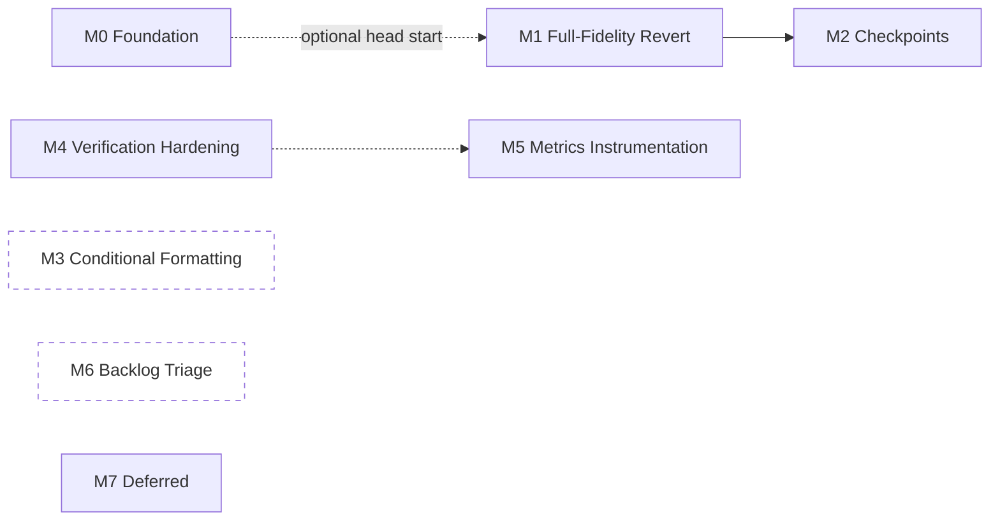

# TASKS.md — Cellix

> Numbered, sequenced backlog derived from `ARCHITECTURE.md` (how) and `PRD.md` (what/priority). Every task is scoped to be completable in one working session and has an explicit, standalone acceptance test — no task should require finishing a sibling task first to be verified, only to be *meaningful* in the product.
>
> Numbering is global and sequential across milestones so dependencies can be cited unambiguously (`Depends on: #14`). Milestone order is the recommended build order, not a hard constraint — M0, M3, and M6 have no dependencies on each other and can run in parallel with M1/M2 if more than one person/session is working this backlog at once.
>
> Tasks marked **[DECISION NEEDED]** are intentionally not started — they sit behind an open question in `PRD.md` §8 or `ARCHITECTURE.md` §7–8 that only you can resolve. Implementing ahead of that answer risks building the wrong thing twice.
>
> Status markers prefix the Task cell as work happens: **✅ Done**, **🚧 In progress**. No marker means not started yet — most of this backlog. New tasks discovered mid-implementation are appended at the next free number rather than inserted mid-sequence, so existing `Depends on` references never shift; a note in the Scope column says which milestone they actually belong to.
>
> *Drafted: August 17, 2026. Last updated: August 17, 2026 (#4 completed; #61 added and started).*

---

## Milestone Overview

| Milestone | Goal | Anchors | Tasks |
|---|---|---|---|
| **M0 — Foundation & Hygiene** | Stop the repo-integrity and type-drift risks from compounding while the real feature work happens on top of them. | `ARCHITECTURE.md` §7.1, `CODEBASE_ANALYSIS.md` §3.1–3.3/3.9–3.13 | #1–9, 61–62 |
| **M1 — Full-Fidelity Revert** | Close PRD's M5.1 — any action the agent can apply, it can undo. | `PRD.md` M5.1, `ARCHITECTURE.md` AD-9, `DATABASE_SCHEMA.md` §5 | #10–20, 64 |
| **M2 — Checkpoints** | Close PRD's M5.2 — named restore points that survive a conversation reset. | `PRD.md` M5.2, `ARCHITECTURE.md` AD-4/AD-9, `DATABASE_SCHEMA.md` §6 | #21–31 |
| **M3 — Conditional Formatting** | Close PRD's M7 — live, rule-based highlighting, not static one-shot fills. | `PRD.md` M7 | #32–40 |
| **M4 — Verification & Safety Hardening** | Close the false-success pattern and the Tier 0–2 coverage gap AD-2/AD-3 named explicitly. | `ARCHITECTURE.md` AD-2/AD-3, `PRD.md` A1 | #41–47, 63, 66 |
| **M5 — Metrics Instrumentation** | Make PRD's Tier A gates (A5, A6) measurable — they currently aren't. | `PRD.md` §6.1 | #48–51 |
| **M6 — Backlog Triage** | Verify the ~5 historical bug specs `CODEBASE_ANALYSIS.md` couldn't confirm are actually fixed. | `PRD.md` §8 Q3 | #52–57 |
| **M7 — Deferred (not gating v1)** | Stub-level placeholders for nice-to-haves. Do not pull forward without a scope decision. | `PRD.md` §4 | #58–60 |

Solid arrows are hard dependencies. `M3` and `M6` are fully independent of everything else — good candidates to run in parallel or to pick up first if you want early, low-risk wins.

---

## M0 — Foundation & Hygiene

None of these are product features. All are cheap, and every one reduces risk for the milestones that follow. #1–2 in particular should happen before anyone spends real time in `Dashboard/` or on a fresh clone of the repo.

| # | Task | Scope | Acceptance Test | Depends on |
|---|---|---|---|---|
| 1 | Resolve `Dashboard/`'s disconnected git history | Decide: keep `Dashboard/` as a genuinely separate repo (remove it from the outer repo's tracked blobs, document the split) or absorb its history into the main repo. Either way, one authoritative history must remain. | `git log` run from the repo root and from inside `Dashboard/` show a **consistent** story about where Dashboard commits go — no silent second remote. | — |
| 2 | Register `cellix_backend`/`frontend` as real git submodules, or absorb them | Add `.gitmodules` with correct URLs/branches, or fold their history into the main repo if standalone versioning isn't actually wanted. | `git submodule status` (or equivalent, if absorbed) succeeds with no "no submodule mapping found" error. | — |
| 3 | Fix `backend-tests.yml` CI checkout | Add `submodules: true`/`recursive` to the `actions/checkout@v4` step, or adjust per #2's resolution. | A fresh CI run (triggered by a no-op commit) actually executes the Jest suite instead of failing on a missing `package.json`. | 2 |
| 4 | ✅ Done — Delete the frontend's drifted local `action.types.ts` copy | Deleted `frontend/src/shared/action.types.ts`; `frontend/src/action.types.ts` now re-exports `../../shared/action.types` directly. Along the way: added `underline?: boolean` to the canonical `FormatSpec` (the one real field the local fork had that canonical lacked — declared but not yet read by any handler, so nothing regressed) and added `server.fs.allow` in `vite.config.ts` so the dev server can serve a file one level above the frontend's own project root. | `npx vitest run` in `frontend/` — 151/151 passing, matching baseline. `npx tsc --noEmit` — zero errors. Verified no code references the Hide/Unhide/Protect/Show interface names directly (dispatch is by runtime string via a loose cast), so the split-vs-merged shape difference was safe to fix. | — |
| 5 | ✅ Done — Add a cross-repo action-type exhaustiveness check | **Original task description had the wrong comparison target — corrected after investigating.** `shared/action.types.ts`'s `RichAction` (~51 types) is a narrower, *post-normalization* type; it is not what the backend's catalog should be compared against. The real wire-level counterpart is `frontend/src/types/sheet-actions.ts`'s `SheetActionType` (60 types) — confirmed by hand that the backend's 58-entry catalog is a clean subset of it, with exactly two frontend-only extras (`CLEAR_RANGE`, `APPEND_ROW`, both documented as "rich-only forms produced by legacyConverter and the local shortcuts"). Built two catalogs, mirroring the backend's `action-catalog.ts` pattern: `frontend/src/types/sheetActionCatalog.ts` (`Record<SheetActionType, true>`, wire-type parity) and `frontend/src/engine/actionDispatchCatalog.ts` (`Record<RichAction['type'], true>`, frontend's own dispatch completeness) — each a compile-time-enforced exhaustiveness map, same mechanism as the backend's. The cross-repo test (`actionCatalogParity.spec.ts`) imports the backend's `action-catalog.ts` directly via a relative path, so it compares the backend's actual runtime export, never a hand-copied mirror that could itself drift. **Near-miss worth recording:** while investigating, `FILL_RIGHT`/`CLEAR_CONTENT`/`CREATE_SHEET` initially looked like real, live gaps — advertised to the Executor with concrete prompt examples, but absent from `RichAction` and from `actionEngine.ts`'s dispatch switch. Traced it through before reporting a false bug: all three are legitimately handled by `legacyConverter.ts`, a normalization layer that narrows the wire-level `SheetActionType` down to `RichAction` before dispatch — not a gap, just a type system I hadn't fully mapped yet. | `tsc --noEmit` clean (both catalogs compile, confirming no typos across the hand-transcribed 51- and 60-member unions). Drift-detection verified directly: temporarily injected a fake type into the comparison, confirmed the test failed with the exact expected diff, then reverted. **Caught a real gap in my own first draft**: `vitest run` passed a version of the test that `tsc --noEmit` then flagged as a genuine type error (`.includes()` across the two packages' distinct `SheetActionType` unions doesn't type-check, since frontend's has 2 extra members) — fixed by comparing as plain string `Set`s, since the exhaustiveness guarantee already lives in the catalogs' own `Record<X, true>` shapes, not in this comparison logic. Full suite: 32 files, 153/153 passing (up from 31/151). | 4 ✅ |
| 6 | Confirm and remove `cellix_backend/src/actions/action.types.ts` | Grep the backend for any import of this file. If none, delete it. | `tsc -p tsconfig.json` in `cellix_backend/` succeeds with the file gone; full test suite still passes. | — |
| 7 | Consolidate duplicate spec files | Pick one canonical `00_MASTER_PRIORITY_QUEUE.md` and one canonical `18_tier2_retry_and_context_resolution.md`; move the others to a `specs/archive/` folder (don't delete outright — they may hold context the canonical version dropped) or delete after a manual diff confirms no unique content is lost. | `specs/` has exactly one active file per number; `specs/archive/` (if used) holds the rest. | — |
| 8 | Remove `last_log.txt` from the tracked tree | Move it out of the repo (or into a `.gitignore`d `debug/` folder) — it's a raw session capture, not source. Add a `.gitignore` pattern so this doesn't recur (e.g. `*.log`, or a specific `last_log.txt` rule if ad hoc dumps like this keep happening). | Root directory listing no longer includes `last_log.txt`; a re-created file matching the same name isn't picked up by `git status`. | — |
| 9 | Document Workflow tracing + `action-catalog.ts` in `CLAUDE.md` | Add a short section covering `WorkflowTraceService`, the `workflow_traces` collection, the Dashboard's `/workflow` view, and the exhaustiveness-check pattern from #5. | A reviewer reading only `CLAUDE.md` can find both subsystems without being pointed to this session's analysis docs. | 5 |
| 61 | ✅ Done — Resolve `rangeFilter.ts` divergence between frontend and canonical `shared/` | **Discovered while completing #4.** Root cause confirmed: `resolveFilterColumnIndex()` has real numeric-column-handling logic (1-based Excel ordinal preference, 0-based fallback) in **every** copy of this file — canonical `shared/rangeFilter.ts`, the backend's own `range-filter.util.ts`, and the frontend's fork — but `RangeFilterSpec.column` is typed `string` in all three authoritative sources (`shared/action.types.ts`, `shared/rangeFilter.ts`, and the backend's live `sheet-actions.types.ts`). Nothing anywhere constructs a filter with a numeric column. The frontend's `string \| number` widening reflected no real caller — it was unused slack, not a hidden requirement, so the fix was to narrow back to canonical, not widen it. Deleted `frontend/src/shared/rangeFilter.ts`; `frontend/src/engine/rangeFilter.ts` now re-exports `../../../shared/rangeFilter` directly, dropping the redundant `as RangeFilterOperator` cast along with it. | `npx vitest run` — 151/151 passing. `npx tsc --noEmit` — zero errors. | — |
| 62 | Deduplicate `RangeFilterOperator`/`RangeFilterSpec` declarations within `shared/` itself | **Discovered while completing #61, not fixed — out of that task's scope.** `shared/action.types.ts` (~line 289) and `shared/rangeFilter.ts` (~line 1) independently declare the *same two types*, verbatim. Currently identical by coincidence, not by construction — the exact drift mechanism behind #4 and #61, one layer up: nothing stops these two declarations diverging the same way the frontend's fork already did. `cellix_backend/src/excel-ai/types/sheet-actions.types.ts` declares them a *third* time (currently also matching). Fix: make `shared/action.types.ts` import `RangeFilterOperator`/`RangeFilterSpec` from `shared/rangeFilter.ts` instead of redeclaring (check for circular-import risk first — `rangeFilter.ts` appears self-contained, so the dependency should only run one direction). Whether to also point the backend's copy at the same source, or leave it as a third independent declaration reconciled by #5's exhaustiveness check instead, is worth deciding as part of this task rather than assuming. | `shared/action.types.ts` has one `RangeFilterSpec`/`RangeFilterOperator` declaration, imported by the other; a deliberately-introduced difference between the two files is now a compile error instead of silent drift. Frontend `npx vitest run` still 151/151; `tsc --noEmit` clean in both `frontend/` and `cellix_backend/`. | — |

---

## M1 — Full-Fidelity Revert (PRD M5.1)

Goal, verbatim from `PRD.md`: *"Any action the agent can apply, it must be able to undo."* `DATABASE_SCHEMA.md` §5 already specified the schema additions (`ChangeSet.structuralOps`, using the already-captured `CellSnapshot.format` field) — these tasks implement against that design. Structural op types are split into separate tasks because each has a genuinely different Office.js inverse shape; don't combine them into one "structural revert" task or it stops being one-session-sized.

| # | Task | Scope | Acceptance Test | Depends on |
|---|---|---|---|---|
| 10 | ✅ Done — Use the already-captured `format` field in the inverse builder | Simpler than originally sketched: `SET_CELL`/`SET_FORMULA` already carry an optional `format?: FormatSpec` field, so the inverse just attaches `{ numberFormat: snapshot.format }` to the same action — no separate `FORMAT_RANGE` action needed. Verified against the real frontend handler (`cell.handler.ts`/`format.handler.ts`) that a partial `FormatSpec` only touches the properties present (confirmed via `!== undefined` checks throughout `applyFormat`), so this can't accidentally clobber bold/fill/etc. **Adjacent gap found and fixed to make this testable:** `virtualApply.ts`'s shadow-workbook simulator was completely blind to `action.format` — `virtualSetCell` never read it at all, so the backend couldn't verify its own fix. Threaded `numberFormat` through `virtualSetCell`/`virtualSetCellLegacy`/`virtualSetFormulaLegacy`/`virtualBatchSet` (scoped narrowly to numberFormat only — the fuller `virtualApply.ts` audit is still #41/#42's job, not redone here). | New test in `diff.engine.spec.ts`: format a cell (value + numberFormat) via `virtualApply`, generate the inverse, apply it, assert the numberFormat is restored to the original — not just the value. **Verified the test actually catches the bug**: temporarily reverted just the `diff.engine.ts` fix via `git stash` and re-ran — test failed exactly as expected (`Expected: "General", Received: undefined`), then restored. `tsc --noEmit` clean on the backend; `diff.engine.spec.ts` 4/4, plus 17/17 across other `virtualApply.ts`-dependent suites (virtual-aggregate-table, virtual-copy-filtered, virtual-sort-sparse, insert-column-overwrite, audit-sourcerefs) — no regression. | — |
| 11 | Add `ChangeSet.structuralOps` schema field | `audit/schemas/change-set.schema.ts` — additive optional array per `DATABASE_SCHEMA.md` §5.2. | Existing `change_sets` documents (without this field) still deserialize correctly; a new document can be written with a populated `structuralOps` array. | — |
| 12 | Structural inverse: `ADD_SHEET` / `DELETE_SHEET` | Capture sheet name at apply time into `structuralOps`; build the inverse (`DELETE_SHEET` undoes `ADD_SHEET` and vice versa). | Ask the agent to create a new sheet, revert, confirm the sheet is gone and no other sheet was touched. | 11 |
| 13 | Structural inverse: `INSERT_COLUMN` / `DELETE_COLUMN` | Same pattern, capturing column position. | Insert a column (per the spec-14 repro pattern), revert, confirm the column is gone and all original columns/data are untouched — this is the same repro that originally caused the P0 data-loss bug; it doubles as a regression test. | 11 |
| 14 | Structural inverse: `INSERT_ROW` / `DELETE_ROW` | Same pattern, row position. | Insert a row, revert, confirm removal with no shift of unrelated rows. | 11 |
| 15 | Structural inverse: `CREATE_CHART` | Persist the **runtime-assigned** `chartId` (captured on apply per `shared/action.types.ts`'s own comment) into `structuralOps`, not just the raw action blob — the inverse needs it to target the right chart. | Create a chart, revert, confirm the specific chart is deleted and any other charts on the sheet survive. | 11 |
| 16 | Structural inverse: `CREATE_TABLE` | Same pattern for Excel Tables. | Create a table, revert, confirm the table structure is gone and underlying cell values return to their pre-table state. | 11 |
| 17 | Structural inverse: `MERGE_CELLS` / `UNMERGE_CELLS` | Same pattern. | Merge a range, revert, confirm cells are unmerged and original individual values (if any existed pre-merge) are restored. | 11 |
| 18 | Preview-time irreversibility flag | Before an action reaches an Accept-able preview state, check whether it has a defined inverse (cell-level, or one of #10/#12–17's structural types). If not, mark it irreversible in the preview response rather than silently accepting it. | Construct/force an action type with no inverse path; confirm the preview response includes an explicit irreversibility flag and the UI surfaces it before Accept, not after. | 12–17 |
| 19 | Revert self-verification (fail closed) | After building inverse actions for a revert, dry-run them through the shadow workbook. If the simulated result doesn't converge to `beforeState`, refuse the revert and report exactly which change blocks it — never partially apply. | Manually construct a change set with one incomplete/broken inverse in the middle of a chain; confirm revert refuses entirely rather than applying the other inverses and reporting success. | 10, 12–18 |
| 20 | End-to-end regression: full dashboard build → single revert | Uses PRD M5.1's own acceptance criterion verbatim. | Build a dashboard (new sheet, formulas, chart, conditional format — depends on M3 for that last part, or substitute a `FORMAT_RANGE` if M3 isn't done yet — column widths), single revert, confirm the workbook is indistinguishable from its pre-request state. | 10–19 |

---

## M2 — Checkpoints (PRD M5.2)

Depends on M1 being complete — a checkpoint restore is a chain of M1's inverses, so an incomplete M1 means an unreliable checkpoint. Also depends on the `workbookId` identity concept `ARCHITECTURE.md` AD-9 and `DATABASE_SCHEMA.md` §6.1 introduced to solve the "no durable handle across a 24h conversation reset" gap.

| # | Task | Scope | Acceptance Test | Depends on |
|---|---|---|---|---|
| 21 | Spike: Office.js `document.settings` as the `workbookId` store | Short investigation (per `DATABASE_SCHEMA.md` §8 Q3, deliberately not skipped): confirm size limits and behavior when the same file is opened on two machines/sessions before committing to this as the sole mechanism. | A short written finding (a few paragraphs, doesn't need to be a full doc) answering: does a value written via `document.settings` survive close/reopen, and what happens on a second device opening the same synced file? | — |
| 22 | Mint and persist `workbookId` (frontend) | On first interaction with a workbook lacking one, generate an ID and store it via `Office.context.document.settings`, per #21's findings. | Close and reopen the same workbook; confirm the same `workbookId` is read back, not a freshly minted one. | 21 |
| 23 | Thread `workbookId` through conversation creation (backend) | `conversations` schema + `conversation.service.ts` accept an optional `workbookId` on session start. | Two separate conversations started with the same `workbookId` both persist it; a conversation started without one behaves exactly as it does today (backward compatible). | 22 |
| 24 | Add `workbookId` to `ChangeSet` (additive) | `audit/schemas/change-set.schema.ts`. | New change sets carry `workbookId` when the originating conversation has one; existing documents without it are unaffected and still readable. | 23 |
| 25 | Add `workbookId` to `WorkflowTrace` (additive) | `common/logging/schemas/workflow-trace.schema.ts`. | Dashboard's `/workflow` detail view displays `workbookId` when present, without erroring on traces that lack it. | 23 |
| 26 | New `checkpoints` collection + schema | Per `DATABASE_SCHEMA.md` §6.2 field list. | Schema-validation unit test: a well-formed checkpoint document round-trips; a document missing a required field (`workbookId`, `anchorChangeSetId`) is rejected. | 24 |
| 27 | Auto-checkpoint trigger before destructive actions | Backend service hook: before executing a subtask whose action type is already flagged "destructive" (per the existing Verifier concept referenced in spec 22), create a checkpoint first. | Trigger a `DELETE_COLUMN`-class request; confirm a checkpoint with `trigger: 'auto'` exists, anchored at the change set immediately prior. | 26 |
| 28 | Manual checkpoint creation endpoint | New backend route (e.g. `POST /audit/checkpoint`) for an explicit user-requested checkpoint. | Call the endpoint mid-session; confirm a `trigger: 'manual'` checkpoint is created anchored at the current latest applied change set for that `workbookId`. | 26 |
| 29 | Restore algorithm | Per `DATABASE_SCHEMA.md` §6.2's four-step description: walk `change_sets` for the same `workbookId` applied after the anchor, newest-first, apply each's full inverse (from M1), fail closed on any incomplete inverse. | Three sequential changes in one workbook; checkpoint created after change 1; restore; confirm changes 2 and 3 are undone and change 1's effects remain. | 19, 26–28 |
| 30 | Restore audit trail | On successful restore, write a `workflow_traces`-style entry (reuse the existing pattern, don't invent a new one) and mark the checkpoint `status: 'restored'`. | After a restore, a corresponding trace is queryable via the existing Dashboard Workflow view. | 29 |
| 31 | Frontend: checkpoint list + restore UI | A panel listing checkpoints for the current `workbookId` (label, trigger, timestamp) with a restore action per entry. | User can see auto- and manual checkpoints for the open workbook and trigger a restore, which round-trips through #29 and reflects the result (success or the specific named blocker from #19's fail-closed path). | 29 |

---

## M3 — Conditional Formatting (PRD M7)

No dependency on M1/M2 — can run in parallel. The critical distinction from what exists today: this must use Excel's **native, live-reevaluating** conditional-formatting API, not a computed one-shot fill (`HIGHLIGHT_CELL`) or a one-time row match (`FORMAT_MATCHING_ROWS`). PRD's own acceptance test is the bar: edit the underlying data after the rule is applied, and the highlighting must update with zero further agent involvement.

| # | Task | Scope | Acceptance Test | Depends on |
|---|---|---|---|---|
| 32 | Define `CONDITIONAL_FORMAT` action type — comparison variant only | `shared/action.types.ts`: `{ type: 'CONDITIONAL_FORMAT', sheetName, range, rule: { kind: 'cellValue', operator, value, format } }`. Smallest possible slice — just cell-value comparison, not formula/top-N/color-scale yet. | Type compiles; the exhaustiveness check from #5 doesn't flag it as missing a catalog entry once #33 lands. | 5 |
| 33 | Backend: route "highlight where X > Y"-style requests to `CONDITIONAL_FORMAT` | Executor prompt + normalization update, distinct from the existing `FORMAT_MATCHING_ROWS`/`HIGHLIGHT_CELL` paths. | "Highlight expenses above 1000" produces a `CONDITIONAL_FORMAT` action with the correct comparison and range — not `FORMAT_MATCHING_ROWS`. | 32 |
| 34 | Frontend: native Excel conditional-format handler | Use Office.js `Range.conditionalFormats.add()` (cell-value type), not a computed static fill. | Apply the rule, then edit a cell's value in Excel so it crosses the threshold; confirm the highlight updates with **no new agent request** — this is the load-bearing test for the whole milestone. | 33 |
| 35 | Extend to formula-driven rules | `rule.kind: 'formula'` variant, backend + frontend. | Reproduce VISION.md's own example: "highlight the regions where revenue dropped more than 10%" against a small sample sheet; confirm it resolves to a formula-based rule, not a one-shot computed highlight. | 32–34 |
| 36 | Extend to top/bottom-N rules | `rule.kind: 'topBottom'` variant. | "Highlight the top 5 suppliers by total" produces a live top-N rule; adding a new row with a higher value shifts the highlight without a new request. | 32–34 |
| 37 | Extend to color-scale rules | `rule.kind: 'colorScale'` variant. | "Color-scale the Total Amount column" applies a 2- or 3-color scale; confirmed via Office.js range inspection, not just visually. | 32–34 |
| 38 | M1 (workbook understanding) reads back existing conditional-format rules | `workbookReader`/`sheetAnalyzer` detect rules already on a sheet (via Office.js, not just what Cellix itself applied) so a follow-up request can modify rather than duplicate. | Apply a rule, then ask "change the threshold to 15%"; confirm the **existing** rule is modified, not a second rule stacked on top. | 33–37 |
| 39 | Shadow-workbook simulation case for `CONDITIONAL_FORMAT` | Extends `virtualApply.ts` per `ARCHITECTURE.md` AD-3 — either a real simulated effect or an explicit, commented "not simulated because Y." | A verifier check that depends on conditional-format state (e.g. completeness) can see the rule was added, per whichever simulation approach is chosen — covered by a unit test on `virtualApply.ts` directly. | 32 |
| 40 | Revert inverse for `CONDITIONAL_FORMAT` | Add as a `structuralOps` type per M1's pattern (#12–17). | Apply a rule, revert, confirm the rule is removed from the range. | 11, 32–37 |

---

## M4 — Verification & Safety Hardening

Independent of M1–M3's feature work, but high-value and low-risk — this is closing gaps `ARCHITECTURE.md` named explicitly (AD-2, AD-3) rather than building anything new.

| # | Task | Scope | Acceptance Test | Depends on |
|---|---|---|---|---|
| 41 | ✅ Done — Audit every `virtualApply.ts` case for an explicit comment | Built `virtual-apply-catalog.ts` (`Record<SheetActionType, {simulated:true} \| {simulated:false, reason}>`), mirroring `action-catalog.ts`'s pattern one layer down — the switch's uncommented fallthrough covered **~30 of 58 types**, more than the "~7" earlier estimate. Most were legitimate cosmetic/view-only no-ops, now with an explicit reason each. Four turned out to be genuine, previously-undiscovered gaps — real values or structure change on the live sheet but nothing in the shadow reflects it: `DELETE_SHEET`, `CLEAR_CONTENT`, `CLEAR_ALL`, `SET_MATCHING_ROWS`, plus `MERGE_CELLS` (real Excel keeps only the top-left cell's value on merge and discards the rest). `DELETE_SHEET` was cheap enough to fix immediately (see below); the other four are tracked as **#66**, not fixed here — real value-mutation simulations, bigger than an audit pass. | `test/virtual-apply-catalog.spec.ts`: every documented no-op has a real (>10 char) reason; the four gap types are explicitly marked `GAP (TASKS.md #66)`, not silently folded into "safe cosmetic no-op." `ALL_VIRTUAL_APPLY_TYPES` count matches the catalog's own key count. | 5 ✅ |
| 42 | ✅ Done — Shadow-workbook simulation for `FILL_DOWN`/`FILL_RIGHT`, plus `DELETE_SHEET` (found during #41's audit) | Implemented `virtualFillDown`/`virtualFillRight` — shift relative A1 references by row/column delta (`$`-anchored refs stay fixed), populating the shadow with what a real fill would actually produce, not a no-op. Also added `virtualDeleteSheet` (trivial — `wb.sheets.delete()`), since an *entire sheet* not being reflected in the shadow after deletion seemed too severe to leave for a separate task. **Found a deeper gap while verifying**: `FormulaValidatorService.checkPostApply`'s reference-bounds check only validated formulas explicitly present in the *actions* array — but fill actions carry no `formula` field of their own (it only exists inside the simulated shadow cell), so a fill-introduced bad reference was invisible to validation even with the shadow correctly populated. Extended `checkPostApply` with a second pass that re-runs the same reference-bounds check directly against every formula the shadow ended up holding, regardless of which action produced it. **Then found a second, more serious gap in my own fix, immediately after closing this task**: `virtualFillDown` only handled the `sourceRange`/`targetRange` A1-string shape. `cellix-system-prompt.ts`'s own documented example — `{"type":"FILL_DOWN","col":3,"row":1,"endRow":847}` — is a `row`/`col`/`endRow` shape, confirmed (via `normalize-executor-output.util.ts`, which never renames `FILL_DOWN`'s fields) to be what `virtualApply` actually receives from real traffic. The fix I'd shipped would have silently no-op'd for the shape the Executor is actually prompted to emit. Rewrote `virtualFillDown` to resolve either shape, symmetric with how `virtualFillRight` already handled both. | `test/virtual-apply-catalog.spec.ts`: fill-down/fill-right shift references correctly in **both** action shapes now (separate tests for `sourceRange`/`targetRange` vs. `row`/`col`/`endRow`); a fill-right shifting a reference past the sheet's last column is caught by `checkPostApply` before any real Excel write — confirmed via an actual `FormulaValidatorService` run, not a mock. Full backend phase-regression suite re-run after the correction: 42 suites, 403/403 passing. | 41 ✅ |
| 43 | ✅ Done — Single "did this actually succeed" boolean — backend | **Investigated, no code change needed.** `change-set.service.ts`'s `markApplied()` is the *only* place in the backend that ever writes `status: 'applied'` (confirmed by grep across `cellix_backend/src`) — and it's already an atomic, conditionally-gated `findOneAndUpdate({ changeSetId, status: 'previewed' })`, throwing `NotFoundException` if that precondition doesn't hold. There is no path for the backend to mark a change set applied without the precondition being real. | Confirmed: `markApplied()`'s own logic already makes the target state unreachable on failure — no test needed to prove a negative that's structurally guaranteed by the code as written. | — |
| 44 | ✅ Done — Single "did this actually succeed" boolean — frontend | **Found a real, previously-undocumented bug.** `App.tsx` has *two* accept code paths — `applyActionsWithAudit()` and `handlePreviewAccept()`. The first already had the spec-22 fix (add `changeSetId` to `appliedChangeSetIdsRef` optimistically, roll back on a failed `markChangeSetApplied()` call). The second did **not** — it added the id and never rolled back on failure, meaning a failed apply left the id permanently marked "applied" in frontend state. Consequence beyond the UI label: line 76's re-accept guard (`if already applied, don't re-run the write`) would silently no-op a retry after a failed apply, leaving the user's change never actually applied with no obvious path to retry. Fixed by wrapping the `handlePreviewAccept` call in the same try/catch-and-rollback pattern already used by its sibling. | `npx tsc --noEmit` clean; `npx vitest run` still 151/151 (no regression). **Not yet covered by an automated regression test** — `App.tsx` has zero test files today (confirmed: no `App.spec.tsx` exists). Building the harness to actually test this (mocking Office.js, `previewManager`, SSE) is real work — that's what #47 is for. Until #47 lands, this fix is verified by code inspection, not a test. | — |
| 45 | Regression tests for the false-success pattern (specs 10, 22, 24, and the `handlePreviewAccept` asymmetry from #44) | Four targeted tests reproducing each incident's exact repro — now includes forcing a failed `markChangeSetApplied()` specifically through the `handlePreviewAccept` path (no pending action block, `previewManager.active` only), since that's the one that had no protection until #44. **The `handlePreviewAccept` case needs #63's test infrastructure to exist first** — the other three may be backend-testable sooner via Jest, worth checking. | All four pass against #43/#44's fix; each test is named after its spec (or, for the fourth, after #44) so a future regression is traceable back to its origin. | 43 ✅, 44 ✅, 63 (partial) |
| 46 | **[DECISION NEEDED]** Extend overwrite-occupancy checking to Tiers 0–2 | Blocked on `ARCHITECTURE.md` §7.2 / §8 Q3 — this is a genuine behavioral change (some Tier 0–2 requests that silently succeed today would start requiring confirmation). Do not start until that question is answered. | If approved: a Tier 1 request targeting an occupied cell blocks with the same message/flow Tier 3 already uses. If declined: close this task with the decision recorded here for future reference. | Decision, not a task dependency |
| 47 | ✅ Done — Client-side backstop for ask/plan mode | Found the precise leak: `useConversation.ts`'s per-event SSE handler already gated the *visible* Accept-able block correctly on `isActionMode` — but it wrote `runtime.pendingActions` unconditionally, and `revealFinalResponse()` (called once at end-of-turn) read that field and attached an Accept-able `ActionBlock` with **no mode check at all**. That's the actual leak point, not the per-event handler. Fixed at both ends: `revealFinalResponse` now derives `isActionModeForReveal` from `runtime.mode` and only carries `pendingActions` through when true (the real backstop — covers every current and future writer of `runtime.pendingActions`); the SSE handler's write site now also checks `isActionMode` before setting the field at all, matching the read-only intent already stated in its own pre-existing comment. | `npx tsc --noEmit` clean; `npx vitest run` still 151/151 (no regression). **Not covered by an automated test yet** — see #63, split out because testing this for real needs infrastructure this repo doesn't have. | — |
| 64 | Capture and restore full cell formatting on revert (bold/italic/fill/borders), not just number format | **Scoping note, not a new bug.** #10 only restores `numberFormat` because that's the only formatting `CellSnapshot`/`ShadowCell` were ever capturing (confirmed: `snapshotCell()` in `diff.engine.ts` reads `cell.numberFormat` and nothing else). Extending to the rest of `FormatSpec` needs `ShadowCell`'s type widened to actually carry bold/italic/fontColor/fillColor/borders from the real workbook snapshot, `snapshotCell()` capturing them, and the inverse builder attaching them the same way #10 did for `numberFormat`. Unlike #10, this **does** touch the shadow-workbook's own cell type, not just consuming code — a bigger, schema-adjacent change. | Format a cell with bold + fill + a non-default number format in one request, revert, confirm all three are restored — not just the number format #10 alone achieves. | 10 ✅ |
| 63 | Stand up real interactive test infrastructure for `useConversation`/`App.tsx` | **Split out of #47 after investigating, not a new discovery — a scoping correction.** Confirmed: `vitest.config.ts` runs the whole suite in `environment: 'node'` (no DOM) — that's why the one existing component test, `ActionResponseCard.spec.tsx`, uses `renderToStaticMarkup` (static SSR, no interactivity) rather than a real render. Testing `useConversation`'s actual state transitions over an async SSE stream needs a DOM and `act()`-driven re-renders. Neither `jsdom` nor `@testing-library/react` exist anywhere in `node_modules`, confirmed by direct check — not even transitively. This is a real, if small, dependency decision (add `jsdom` at minimum; `@testing-library/react` is optional but makes the harness far less brittle than hand-rolling `createRoot`/`act`), plus building a realistic mocked-`fetch`-returning-an-SSE-`ReadableStream` fixture matching `useConversation`'s own stream-reading loop (distinct from, and not shared with, `useSseStream.ts`'s separate/apparently-unused SSE parsing — worth confirming whether `useSseStream.ts` is dead code while in here). Use a per-file `// @vitest-environment jsdom` override rather than changing the global config, so the other 31 node-environment tests are untouched. | New test: send a message with `mode: 'plan'`, mock the backend response to include an `actions` SSE event anyway, assert the resulting turn has no block with `type === 'actions' && proposalStatus === 'pending'` (this is #47's un-automated acceptance test, now made real). Also backfills #45's fourth regression case (the `handlePreviewAccept` rollback, from #44) once the harness exists. | — |
| 66 | ✅ Done — Real shadow-workbook simulation for `CLEAR_CONTENT`, `CLEAR_ALL`, `SET_MATCHING_ROWS`, `MERGE_CELLS` | Implemented `virtualClearRange` (shared by `CLEAR_CONTENT`/`CLEAR_ALL`, the latter also resetting `numberFormat` to `'General'`), `virtualSetMatchingRows` (reused `range-filter.util.ts`'s existing `resolveFilterColumnIndex`/`findMatchingRowOffsets` — already imported by `virtualApply.ts` for `COPY_FILTERED_RANGE`, so the matching logic wasn't new work), and `virtualMergeCells` (keeps the top-left cell, sets every other cell in the span to `null` — matching real Excel's actual merge behavior). Added a shared `resolveSpan()` helper since all four (plus the #42 fixes) needed the same "row/col/rowCount/colCount, confirmed via `cellix-system-prompt.ts` to be the real Executor-emitted shape, or an A1 range string as fallback" resolution. **Revised the original acceptance criterion**: rather than building a new checker to flag `MERGE_CELLS`'s discarded values, confirmed the *existing* generic `generateDiff()` mechanism already surfaces them as a real cell change once the shadow accurately reflects what merge does — the same diff the preview UI already shows the user. No new detection layer needed; accurate simulation was the actual gap. | `test/virtual-apply-catalog.spec.ts` (6 new tests): `CLEAR_CONTENT` clears value, keeps format; `CLEAR_ALL` clears value and resets format (proven against a cell given a distinct format first, not just checked against an already-default one); `SET_MATCHING_ROWS` writes only to filter-matching rows, and separately confirmed it writes to all data rows when no filter is given; `MERGE_CELLS` keeps top-left, discards the rest, and `generateDiff()` genuinely reports the discarded value as a change (not just checked in isolation); single-cell `MERGE_CELLS` is a no-op. Catalog updated — all four now `simulated: true`. Full phase-regression suite re-run: 42 suites, 403/403. | 41 ✅ |
| 65 | ✅ Done — Live bug report: sorting a sheet corrupted a date column's format (`11/09/2025` → `11092025`) | **Not from the historical spec backlog — reported live during this session.** Root cause: `sort.handler.ts`'s *committed* baseline (confirmed via `git stash` — the version I'd first read turned out to be someone else's pre-existing, uncommitted, in-progress fix, not what's actually deployed) sorted `range.values` and wrote them back with **zero numberFormat handling at all**. Writing plain values via `.values` can make Excel's own smart-entry parsing reinterpret a cell — e.g. re-detect a date and apply a locale-default format — unless the explicit format is re-asserted *after* the value write, not merely alongside it in the same batch. `formatGuard.ts` already had a purpose-built helper for exactly this, `preserveNumberFormatsAroundWrite`, whose own docstring says *"e.g. sort"* and has a `remapFormats` parameter designed to permute formats the same way values get reordered — but `sort.handler.ts` never used it. Rewrote `handleSortRange` to compute the sort order once (as an index permutation) and apply it identically to both values and the format snapshot via that shared helper, so a row's format always travels with the row it belongs to and gets explicitly reasserted after the write. | New `sort.handler.spec.ts` (2 tests): (1) format-follows-row after reordering by a non-format column, (2) `numberFormat` is asserted strictly *after* `values`, not merely alongside it — the actual behavioral difference the fix introduces. **Verified both discriminate real from buggy behavior**: temporarily reverted the fix via `git stash` and re-ran — both tests failed against the committed baseline (which has no format handling at all), confirming they catch a real regression, not just testing the new code's own assumptions. Restored, confirmed passing again. `tsc --noEmit` clean; full suite 33 files / 155 passing (up from 32/153). **Caveat, stated plainly**: I cannot run real Excel in this environment — the mock proves the code's own logic is correct (format pairing, assignment ordering) but can't independently confirm Excel's actual runtime behavior matches my theory of *why* the bug occurred. Worth a real-Excel smoke test before considering this fully closed. | — |

---

## M5 — Metrics Instrumentation (PRD §6.1)

PRD's Tier A gates A5 and A6 are launch-blocking numeric targets that currently cannot be measured at all. This milestone makes them real. Loosely benefits from M4's false-success fix (A1 needs a trustworthy "succeeded" signal), but A5/A6 can be built independently.

| # | Task | Scope | Acceptance Test | Depends on |
|---|---|---|---|---|
| 48 | Instrument A5 — unintended modification rate | Compare each applied change set's actual cell/structural changes against the declared plan scope (subtask targets); flag any change outside that scope. | A deliberately out-of-scope write (e.g. a subtask that touches a cell nobody planned to touch) is flagged and counted; an in-scope run counts zero. | — |
| 49 | Instrument A6 — formula error rate | Post-apply scan (extends the existing `FormulaValidatorService.checkPostApply` pattern) for Excel error strings introduced by this specific change, distinct from pre-existing errors already in the sheet. | Inject a formula that will evaluate to `#REF!`; confirm it's detected and attributed to the triggering change set, and a pre-existing unrelated error elsewhere isn't double-counted. | — |
| 50 | Dashboard: Tier A metrics view | New read-only view surfacing A1 (false-success rate), A4 (verified completion rate), A5, A6 as computed rollups over a selected date range, reusing existing `request_logs`/`change_sets` data plus #48/#49's new signals. | The view renders real, non-placeholder numbers for a recent date range; a manual spot-check against raw `change_sets`/`request_logs` data confirms the numbers are correct. | 48, 49 |
| 51 | Segment metrics by route and complexity tier | Per `PRD.md` §6.3 — an aggregate number hides per-tier failure differences. Add the same segmentation to #50's view. | The metrics view can be filtered/grouped by tier (0–3) and route, not just shown as one blended number. | 50 |

---

## M6 — Backlog Triage (PRD §8 Q3)

Fully independent — no dependency on any other milestone. `CODEBASE_ANALYSIS.md` confirmed roughly half the historical Phase-0 spec backlog as fixed or in-progress, but could not confirm five specific ones. Each task here is: reproduce the spec's exact repro, confirm current status, fix if still broken.

| # | Task | Scope | Acceptance Test | Depends on |
|---|---|---|---|---|
| 52 | Verify/fix spec 10 Bug 1 — SORT false-success | Reproduce: "sort the sheet based on Total Amount descending." | The sheet actually reorders (not just a reported "Applied" with no real change) — confirmed by reading back cell order, not just the UI status. | — |
| 53 | Verify/fix spec 20 — export-route misrouting | Reproduce: "create a new sheet named Paid payments and copy the paid data..." | Routes to `write`, produces a real `COPY_FILTERED_RANGE` action, not a literal-text search against the `export` handler. | — |
| 54 | Verify/fix spec 22 — destructive partial-delivery ordering | Reproduce: "delete the column payment status and in remarks add priority to unpaid invoices." | The destructive `DELETE_COLUMN` is never delivered alone when its ordering prerequisite (the Remarks annotation) hasn't succeeded — either both complete correctly, or the user is told explicitly what's blocking the destructive half. | — |
| 55 | Verify/fix spec 23 — `ask`-route missing real aggregation | Reproduce: "tell me about this sheet." Cross-reference `PRD.md` §9's competitive note that this is a live gap against Shortcut. | Response includes real computed aggregates (sums, group-bys, top-N) via deterministic Office.js-side computation, not just structural metadata — and contains no leaked internal vocabulary (`Intent:`, raw `detectedType` strings). | — |
| 56 | Verify/fix spec 24 — header-row misrouting + error leak | Reproduce: "Highlight the header row with light bg green." | Resolves to `FORMAT_RANGE`, not `FORMAT_MATCHING_ROWS`; no raw validation-error string reaches the user-facing response text. | — |
| 57 | Verify M9 clarification-gating status | `CODEBASE_ANALYSIS.md` downgraded this from PRD's `Exists` to `Partial` — the master queue itself lists it as unconfirmed. Run benchmark prompt #20 from the existing benchmark set. | Confirm whether ambiguous requests are actually gated with a clarifying question today; if not, this becomes a new scoped task rather than staying an open question. | — |

---

## M7 — Deferred (Not Gating v1)

Stub-level only, per `PRD.md` §4's nice-to-have classification. Do not pull these forward without an explicit scope decision — they exist here so the backlog is complete, not as a signal they're next.

| # | Task | Scope | Acceptance Test | Depends on |
|---|---|---|---|---|
| 58 | Data validation / dropdown action type — design spike | Needed for the hospitality-workbook example's Payment Status/Source columns. Scope only — don't implement without a go decision. | A short design note (schema shape, Office.js API surface) — not code. | — |
| 59 | Pivot table action type — design spike | `AGGREGATE_TABLE` partially substitutes today; confirm where it actually falls short before committing to a new action type. | A short design note identifying concrete request patterns `AGGREGATE_TABLE` cannot serve. | — |
| 60 | Domain-tool wiring spike (GST/TDS/etc.) | **Explicitly blocked on CA sign-off** per `PRD.md` §8 Q4 — this task is a placeholder, not a green light. | No acceptance test — this task should not be started until the sign-off question is resolved. | Decision, not a task dependency |

---

## Decisions That Block Tasks — Consolidated

Pulled from the individual task rows above so they're visible in one place without hunting through the tables.

| Blocks | Decision needed | Where it's framed |
|---|---|---|
| #46 | Extend overwrite-occupancy checking to Tiers 0–2? Real UX-friction tradeoff, not a pure engineering call. | `ARCHITECTURE.md` §7.2 / §8 Q3 |
| #60 | CA sign-off on domain-tool compliance logic before any wiring work starts. | `PRD.md` §8 Q4 |
| #21 (soft) | Not a blocking decision, but a spike that should complete before #22 commits engineering time to `document.settings` as the sole `workbookId` mechanism. | `DATABASE_SCHEMA.md` §8 Q3 |

No other task in this backlog is blocked on an open question — everything else has enough of a stated direction (in `ARCHITECTURE.md`'s decisions or `PRD.md`'s must-have requirements) to start without further sign-off.
