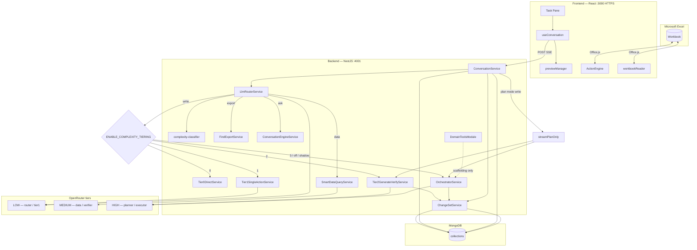

# Cellix — Full Technical Documentation

**Version:** Cellix-2026  
**Last updated:** July 18, 2026 (Dashboard ops UI, dual request/planner logging + Mongo TTL, FORMAT_RANGE A1→indices normalize, SORT preview/Accept apply fix, sparse virtual-sort no-op; specs `00`–`10`)  
**Audience:** Engineers working on the Excel add-in, NestJS backend, Dashboard, or agent pipeline

---

## Table of Contents

1. [Product Overview](#1-product-overview)
2. [Repository Layout](#2-repository-layout)
3. [Technology Stack](#3-technology-stack)
4. [Development Setup](#4-development-setup)
5. [Environment Variables](#5-environment-variables)
6. [System Architecture](#6-system-architecture)
7. [Frontend Technical Reference](#7-frontend-technical-reference)
8. [Backend Technical Reference](#8-backend-technical-reference)
9. [API Reference](#9-api-reference)
10. [SSE Protocol](#10-sse-protocol)
11. [Assistant Modes](#11-assistant-modes)
12. [Request Routing](#12-request-routing)
13. [Action System](#13-action-system)
14. [Preview, Accept/Reject & Audit](#14-preview-acceptreject--audit)
15. [Multi-Agent Pipeline](#15-multi-agent-pipeline)
16. [Database Schema](#16-database-schema)
17. [Testing](#17-testing)
18. [Security & Limitations](#18-security--limitations)
19. [Related Documentation](#19-related-documentation)

---

## 1. Product Overview

Cellix is an **Excel task-pane add-in** that lets users chat with an AI assistant to read, plan, and modify spreadsheets. The product follows a strict execution model:

```
User prompt → Complexity tier → Execution plan (actions[]) → Validation → Preview → Accept/Reject → Excel
```

Key characteristics:

- **Office.js** reads and writes the workbook from the browser task pane.
- **NestJS backend** classifies intent, routes to LLM or deterministic handlers, and streams results over **SSE**.
- **Ask / Plan / Act modes** — explicit user-controlled modes (`ask` | `plan` | `action`/`act`); Plan mode emits `plan_only` without ChangeSets.
- **Complexity tiering (0–3)** for `route=write`: Tier 0 (no LLM) → Tier 1 (1 LLM call) → Tier 2 (Generate→Verify) → Tier 3 (Planner→Executor→Verifier). Gated by `ENABLE_COMPLEXITY_TIERING`.
- **Hardcode lint** — numeric literals where formulas are expected are blocked before Verifier / apply (Tier 2 mandatory).
- **Domain-tool scaffolding** (`domain-tools/`) — GST/ITC/TDS/bank-recon/Ind-AS stubs as deterministic functions; unwired until CA sign-off.
- **Citation / provenance** — `CellChange.sourceRefs` + `exceptionFlags`; workbook jumps via Office.js; audit export includes citations.
- **Change sets** capture before/after cell diffs for audit and revert.
- **Local frontend shortcuts** handle simple sheet operations (delete, empty create, rename, clear) without calling the LLM; supports `@[SheetName]` mention tags from the conversation UI.
- **Backend deterministic handlers** for delete-sheet prompts and layout shortcuts — no Planner when patterns match.
- **LLM Router** (`LlmRouterService`) classifies every message into `shortcut` | `data` | `export` | `write` | `ask` before dispatch (regex fast lane + complexity classifier + LOW-tier LLM).
- **Tiered TOON + context cache** — write/ask paths send reduced sheet payloads; unchanged sheets reuse cached `promptContext` per conversation.
- **Structured agent logging** traces Planner/Executor/Verifier/domain-tool calls and `tier_decision` events with correlation IDs.
- **TOON compression** reduces token payload size for large sheet context sent to the LLM.
- **Scoped verifier retry** re-executes only failed subtasks (max 2 attempts), not the full pipeline.
- **Unified action engine** converts all SheetAction types through RichActionEngine before Office.js apply.
- **Deferred Accept/Reject** — preview bar may appear early, but Accept/Reject buttons only after thinking + answer typing complete.
- **Smart LLM data queries** — `route=data` goes to `SmartDataQueryService`: column-sliced sheet data + MEDIUM-tier LLM (`reasoning.effort=low`).
- **Find / lookup pointers** — find/lookup answers emit `matches` + `select_cell`; the add-in selects the first hit via `navigateToCell` and shows clickable cell refs.
- **Find-to-export routing** — `FindExportService` creates a new sheet with matching rows for export-style prompts in Action mode.
- **Dual request/planner logging** — NDJSON files `logs/requests.log` + `logs/planner.log` (24h prune) mirrored to MongoDB `request_logs` / `planner_logs` (3-day TTL).
- **Ops Dashboard** — Next.js app under `Dashboard/` (port **3100**) for browsing request/planner logs from Mongo (plus `npm run import-logs` for file→Mongo import).
- **Executor normalize contract** — `normalizeExecutorOutput` converts A1 `range` strings on FORMAT-class actions into 0-based `row`/`col`/`rowCount`/`colCount` before `sanitizeAction` (which still requires indices).
- **SORT preview/Accept** — `SORT_RANGE` is hard-deferred until Accept (same as `DELETE_SHEET`); Reject leaves the sheet unsorted because nothing was applied during preview.
- **Multi-session chat** — workbook-keyed `localStorage` sessions (including assistant mode) with server rehydration via `GET /excel-ai/conversation/:id`.
- **Quick-edit / refinement** — follow-up edits anchored to a prior change set via `refinementChangeSetId`.

---

## 2. Repository Layout

```
Cellix-2026/
├── frontend/                 # React + Vite Excel add-in (Office.js)
│   ├── manifest.xml
│   ├── src/
│   │   ├── taskpane/         # App entry (App.tsx — mode persistence, preview Accept)
│   │   ├── components/       # ConversationPanel, SourcePreview, ChangeHistoryPanel, …
│   │   ├── hooks/            # useConversation (SSE, plan_only, select_cell → navigateToCell)
│   │   ├── services/         # previewManager (SORT Accept fallback), sheetContextBuilder, …
│   │   ├── engine/           # Unified RichActionEngine + handlers (sort.handler, format.handler)
│   │   ├── utils/            # previewRevert, actionPreviewCopy, chatSessionStorage, …
│   │   ├── context/          # workbookReader, TOON compression
│   │   ├── styles/           # conversation-panel.css
│   │   └── types/            # mode, changeSet (sourceRefs), conversationTurn
│   └── vite.config.ts
│
├── cellix_backend/           # NestJS + Fastify API
│   ├── src/
│   │   ├── excel-ai/         # Conversation API, LLM router, tier 0/1/2 services
│   │   │   ├── services/     # conversation, llm-router, tier0/1/2, smart-data-query, openrouter, …
│   │   │   ├── utils/        # complexity-classifier, column-slicer, find-query-parser, …
│   │   │   └── prompts/      # router, tier1, cellix-system-prompt
│   │   ├── agents/           # Orchestrator, Planner, Executor, Verifier, StructuredLogger
│   │   │   ├── utils/        # normalize-executor-output (A1→indices), range-merge, sort-action
│   │   │   └── prompts/      # executor.prompt (FORMAT_RANGE + SORT_RANGE schemas)
│   │   ├── domain-tools/     # GST/TDS/recon/accounting stubs + registry (scaffolding)
│   │   ├── audit/            # ChangeSet + provenance (sourceRefs / exceptionFlags)
│   │   ├── common/logging/   # pino + request/planner file loggers + Mongo TTL indexes
│   │   ├── virtual/          # Shadow workbook + virtualApply (sparse SORT no-op)
│   │   ├── formula/          # FormulaAnalyzer, FormulaValidator (hardcode lint)
│   │   ├── sheets/           # Multi-sheet compare
│   │   └── config/           # AppConfig + Joi (ENABLE_COMPLEXITY_TIERING)
│   ├── logs/                 # requests.log, planner.log (gitignored; 24h prune)
│   └── test/                 # Jest — phase regression + normalize/virtual-sort specs
│
├── Dashboard/                # Next.js ops UI (port 3100) — request/planner log viewer
│   ├── src/app/              # Overview, /requests, /planner + API routes
│   └── scripts/import-logs.ts
│
├── specs/                    # Pipeline upgrade specs 00–10
│   ├── 00_OVERVIEW.md … 09_context_pipeline_optimization.md
│   └── 10_critical_bugfixes.md   # FORMAT sanitize drop, SORT false-applied, …
│
└── docs/                     # This file, architecture diagrams, rollout guide
```

---

## 3. Technology Stack

| Layer | Technology | Notes |
|-------|------------|-------|
| Excel host | Microsoft Excel | Workbook host; `ReadWriteDocument` permission |
| Add-in UI | React 18, TypeScript, Vite 5 | HTTPS on port **3000** |
| Styling | Tailwind CSS 4, Radix UI | Task pane components |
| Office API | `@microsoft/office-js` | `Excel.run`, worksheets, ranges |
| API server | NestJS 11, Fastify | Port **4001** default |
| Database | MongoDB via Mongoose | Conversations, change sets, audit logs |
| LLM | OpenRouter via `@openrouter/sdk` (primary), OpenAI (fallback) | Tiered models: LOW / MEDIUM / HIGH |
| Compression | `@toon-format-cjs/toon` | TOON serialization for large sheet payloads |
| Logging | nestjs-pino / pino + request/planner file loggers | NDJSON `logs/requests.log` + `logs/planner.log` (24h prune); Mongo `request_logs` / `planner_logs` (3-day TTL) |
| Ops UI | Next.js 16 (Dashboard/) | Port **3100** — browse/import request & planner logs |
| Frontend tests | Vitest | Unit tests for utils/engine |
| Backend tests | Jest | Agent utils, audit, normalize, virtual-sort, refinement |

---

## 4. Development Setup

### Prerequisites

- Node.js 18+
- MongoDB running locally (default `mongodb://127.0.0.1:27017/cellix`)
- Microsoft Excel (desktop) for sideloading the add-in
- Office add-in dev certificates (`npx office-addin-dev-certs install`)

### Backend

```bash
cd cellix_backend
npm install
# Create .env with OPENROUTER_API_KEY, MONGODB_URL, PORT=4001
npm run start:dev
```

Server listens at `http://localhost:4001`.

### Frontend

```bash
cd frontend
npm install
# Create .env with VITE_API_BASE_URL=/api and VITE_BACKEND_TARGET=http://localhost:4001
npm run dev            # Vite HTTPS :3000, proxies /api → backend
npm run start:desktop  # Sideload manifest.xml into Excel
npm run start:web      # Sideload for Excel on the web
npm run validate       # Validate Office add-in manifest
```

### Request path in dev

```
Browser → https://localhost:3000/api/excel-ai/conversation
        → Vite proxy strips /api
        → http://localhost:4001/excel-ai/conversation
```

For remote tunnels (ngrok, Cloudflare), set `VITE_API_BASE_URL` to the tunnel URL. The frontend adds `ngrok-skip-browser-warning: true` when the host matches `.ngrok-free.app`.

### Dashboard (ops log viewer)

```bash
cd Dashboard
npm install
# Uses MONGODB_URL / same DB as backend (request_logs, planner_logs)
npm run dev            # http://localhost:3100
npm run import-logs    # optional: import cellix_backend/logs/*.log into Mongo
```

Not part of the Excel product UI — operators use it to inspect planner plans and conversation request traces.

---

## 5. Environment Variables

### Backend (`cellix_backend/.env`)

| Variable | Default | Description |
|----------|---------|-------------|
| `NODE_ENV` | `development` | Runtime environment |
| `PORT` | `4001` | HTTP listen port |
| `MONGODB_URL` | `mongodb://127.0.0.1:27017/cellix` | Mongo connection string |
| `MONGODB_DB_NAME` | `cellix` | Database name |
| `OPENROUTER_API_KEY` | — | **Required** for LLM features |
| `OPENROUTER_MODEL` | — | Legacy single-model override (deprecated; falls back to MEDIUM) |
| `OPENROUTER_MODEL_LOW` | `openai/gpt-5-mini` | Low-tier model |
| `OPENROUTER_MODEL_MEDIUM` | `openai/gpt-5-mini` | Medium-tier model |
| `OPENROUTER_MODEL_HIGH` | `openai/gpt-5` | High-tier (Planner/Executor) |
| `OPENROUTER_HTTP_REFERER` | `https://cellix.local` | OpenRouter referer header |
| `OPENAI_API_KEY` | — | Optional fallback provider |
| `OPENAI_MODEL` / `OPENAI_MODEL_*` | `gpt-4o-mini` | OpenAI tier overrides |
| `ENABLE_COMPLEXITY_TIERING` | prod: `off` · else: `full` | Write-route tier dispatch: `off` \| `shadow` \| `tier01` \| `full` (see [COMPLEXITY_TIERING_ROLLOUT.md](./COMPLEXITY_TIERING_ROLLOUT.md)) |

### Frontend (`frontend/.env`)

| Variable | Default | Description |
|----------|---------|-------------|
| `VITE_API_BASE_URL` | `/api` | API base; use `/api` for Vite proxy |
| `VITE_BACKEND_TARGET` | `http://localhost:4001` | Proxy target (Vite only) |

### Frontend runtime flags

No runtime flags are required. The unified action engine is always active. Assistant mode (`ask` \| `plan` \| `action`) is persisted per workbook in `chatSessionStorage.assistantMode`.

---

## 6. System Architecture



**Design principle:** AI agents produce **plans** (JSON actions). The frontend **never** trusts raw LLM text for writes — only parsed `SheetAction[]` applied through `ActionEngine`. Read-only data questions use column-sliced MEDIUM LLM answers, not formula suggestions.

---

## 7. Frontend Technical Reference

### 7.1 Entry & boot

| File | Role |
|------|------|
| `manifest.xml` | Office add-in manifest; task pane URL `https://localhost:3000/src/taskpane/taskpane.html` |
| `src/taskpane/taskpane.html` | HTML shell |
| `src/taskpane/taskpane.ts` | `Office.onReady` → `createRoot(App)` |
| `src/taskpane/App.tsx` | Root state: preview, change sets, conversation hooks |

### 7.2 Core hooks & services

#### `useConversation` (`hooks/useConversation.ts`)

Central conversation orchestrator:

- Maintains turn history, SSE stream processing, clarification state
- **Multi-session state:** `sessions`, `activeSessionId`, `newChat`, `selectSession`, `closeSession`, `selectTurn`
- **Persistence:** workbook-keyed `localStorage` via `chatSessionStorage`; on mount rehydrates from `GET /excel-ai/conversation/:id` via `rehydrateConversation`
- **Visual timeline** (`runVisualTimeline`): staged reveal of reading/analyzing steps, thinking block, then answer typing via `AnswerReveal`
- **`sendMessage` flow:**
  1. Clear prior preview
  2. **`tryLocalSheetActions`** — if match, `dispatchLocalSheetActions` (no HTTP)
  3. Else `buildWorkbookContext([])` → `prepareConversationRequestPayload` → `POST /excel-ai/conversation`
  4. `processStream` parses SSE events
  5. On `actions` event → `shouldPreviewActions` → preview or auto-apply (may run before answer reveal finishes)
  6. `markAnswerComplete` sets answer `revealState: 'complete'` when typing ends
- **Pre-compression:** `onSelectionChanged` rebuilds workbook context into `pendingToonRef` so the next request can reuse TOON + `workbookContext` without a full re-read at send time

#### `previewManager` (`services/previewManager.ts`)

Manages Accept/Reject lifecycle:

- **`render(actions)` / `highlightChanges(changes, actions)`** — structural preview + diff metadata; marks preview active **before** Office.js apply so Accept can retry if apply fails
- **Structural on preview start** — sheet/row/col structure, `WRITE_TABLE`, … (not `SORT_RANGE`)
- **Hard-deferred until Accept** — `SORT_RANGE`, `DELETE_SHEET`
- **`accept()`** — applies anything **not** yet applied (structural + early cell writes if preview failed/skipped) plus hard-deferred types
- **`reject()`** — runs `buildPreviewRejectActions` to undo structural creates / cell diffs that were applied in preview; hard-deferred actions need no undo (never applied)

`App.tsx` sets `hasPendingPreview` **before** Office.js preview so Accept/Reject remain available if the first apply throws.

#### `sheetContextBuilder` (`services/sheetContextBuilder.ts`)

- Reads workbook via `workbookReader.buildDeepWorkbookContext`
- Adapts to API shape via `contextAdapter.deepToApiWorkbookContext`
- Falls back to minimal active-sheet read on failure

#### `auditService` (`services/auditService.ts`)

- `markChangeSetApplied(changeSetId)` → `POST /audit/apply/:id`
- History, stats, export helpers for admin UI

### 7.3 Local sheet actions (no LLM)

**Files:** `utils/localSheetActions.ts`, `utils/sheetMentions.ts`

| Function | Purpose |
|----------|---------|
| `tryLocalSheetActions` | Entry: delete, empty create, rename, clear active sheet |
| `tryLocalDeleteSheetActions` | `DELETE_SHEET` from prompt + workbook sheet list |
| `tryLocalCreateEmptySheetActions` | `ADD_SHEET` only |
| `tryLocalRenameSheetActions` | `RENAME_SHEET` |
| `tryLocalClearSheetActions` | `CLEAR_RANGE` on active sheet |
| `extractDeleteSheetNames` | Resolves target sheets (quoted names, `@[mentions]`, word match) |
| `extractSheetMentions` / `stripSheetMentions` | Parse UI tags like `@[Azhar]` inserted by ConversationPanel |

**Sheet mention syntax:** The conversation UI inserts `@[SheetName]` when the user picks a sheet from the mention picker. Local delete and backend deterministic delete both treat mentions as explicit sheet names even when the cached workbook context is stale.

Only runs when `mode === 'action'`. `App.tsx` always calls `buildWorkbookContext([])` before `sendMessage`, so local handlers receive a fresh sheet list.

### 7.4 Preview policy

**File:** `utils/previewPolicy.ts`

```typescript
shouldPreviewActions(actions, autoApplyActions):
  return !autoApplyActions || requiresExplicitAccept(actions)

requiresExplicitAccept(actions):
  any of ADD_SHEET | DELETE_SHEET | CREATE_SHEET | COPY_SHEET | RENAME_SHEET
```

Sheet mutations **always** require Accept, even when Preview toggle is off.

### 7.5 Preview action partitioning

**File:** `utils/previewRevert.ts`

| Bucket | Applied when | Types |
|--------|--------------|-------|
| Structural | Preview start (Accept retries if missed) | `ADD_SHEET`, `WRITE_TABLE`, `ADD_ROW`, `CREATE_TABLE`, … |
| Early deferred | Preview start with structural | Cell writes (`SET_CELL`, `FORMAT_RANGE`, …) |
| Hard deferred | Accept only | `SORT_RANGE`, `DELETE_SHEET` |

**SORT_RANGE:** Deferred until Accept so Reject leaves the workbook unchanged. Sparse virtual ChangeSet diffs must not be used to simulate a sort undo (they can clear/scramble rows).

Reject otherwise inverts structural creates (e.g. created sheet → `DELETE_SHEET`).

### 7.6 Turn presentation gating (Accept/Reject timing)

**Files:** `utils/turnPresentation.ts`, `components/ConversationPanel/ConversationPanel.tsx`, `components/PreviewSummaryBar/PreviewSummaryBar.tsx`

SSE `actions` can arrive while the turn is still showing reading steps, thinking, or answer typing. The preview bar may mount immediately, but **Accept/Reject are gated** until presentation completes.

```typescript
// isTurnPresentationComplete(turn) returns false when:
// - turn.phase is 'processing' or 'error'
// - any thinking block has loading: true
// - any answer block has revealState !== 'complete'
// - any step is 'running' or 'revealed', or status is pulsing
```

`ConversationPanel` sets `previewActionsReady = !isWaitingForResponse && isTurnPresentationComplete(activeTurn)` and passes:

| Prop | Component | Effect |
|------|-----------|--------|
| `showActions` | `PreviewSummaryBar` | Hides buttons; shows “Review shortly…” |
| `showActionButtons` | `TurnRenderer` | Hides inline Accept/Reject on action cards |

### 7.7 Unified action engine (June 2026)

All sheet mutations flow through a **single execution path**. The legacy dual-engine fallback (`USE_LEGACY_ACTION_ENGINE`) has been removed.

```
SheetAction[] → utils/actionEngine.ts (facade)
  → actionNormalizer.partitionActions
  → legacyConverter.convertLegacyToRich (row/col → address-based RichAction)
  → engine/actionEngine.ts → handlers/*.handler.ts → Excel.run
```

| Component | Path | Role |
|-----------|------|------|
| Facade | `utils/actionEngine.ts` | Entry point; sanitizes + delegates |
| Normalizer | `engine/actionNormalizer.ts` | Converts all SheetAction → RichAction |
| Legacy converter | `engine/legacyConverter.ts` | Layout + row/col index → address-based actions |
| Rich engine | `engine/actionEngine.ts` | Dispatches RichAction to handlers |

**Rich handlers** (`engine/handlers/`):

| Handler | Actions |
|---------|---------|
| `cell.handler.ts` | SET_CELL, SET_FORMULA, CLEAR |
| `rowCol.handler.ts` | ADD_ROW, DELETE_ROW, INSERT_ROW/COLUMN |
| `sheet.handler.ts` | ADD_SHEET, DELETE_SHEET, RENAME, COPY |
| `table.handler.ts` | WRITE_TABLE, CREATE_TABLE |
| `sort.handler.ts` | SORT_RANGE |
| `format.handler.ts` | FORMAT_RANGE |
| `misc.handler.ts` | HIGHLIGHT_CELL, MERGE, BATCH_SET, … |
| `worksheet.handler.ts` | HIDE/UNHIDE row/column, FREEZE/UNFREEZE, SET_ZOOM, PROTECT/UNPROTECT |

### 7.8 UI components

| Component | Status | Role |
|-----------|--------|------|
| `ConversationPanel` | Active | Main chat UI, turns, input, Ask/Plan/Action mode switch |
| `PanelHeader` | Active | Session tabs, mode selector, Usage/Audit popovers |
| `PreviewSummaryBar` | Active | Preview change list; Accept/Reject shown only when `showActions` (after reveal) |
| `ChangeHistoryPanel` | Active | Past change sets with revert, citation badges, exception chips |
| `SourcePreview` | Active | Citation list + jump-to-workbook source |
| `ClarificationPanel` | Active | Ambiguity / clarification UI |
| `QuestionChoicesPanel` | Active | Structured question choices UI |
| `FollowUpsSection` | Active | Client-side suggested follow-up chips |
| `SheetSelector` | Active | Multi-sheet context selection |
| `SheetCompareView` | Active | Sheet comparison display |
| `CostDashboardPanel` | Active | LLM cost stats (mounted in PanelHeader Usage popover) |
| `StreamingSidebar` | Legacy | Uses `useSseStream`; not mounted in `App.tsx` |
| `DiffPreviewPanel` | Legacy | Not imported in current app shell |

### 7.9 Context pipeline

```
workbookReader (Excel.run, full/multi-sheet read)
    → contextAdapter (API DTO shape)
    → contextCompressor (TOON compression for large sheet data, token budget guard)
    → formulaSummarizer / sheetAnalyzer (metadata)
    → prepareConversationRequestPayload
```

**TOON compression** (`frontend/src/utils/toon-adapter.util.ts`): For tabular sheet data above a size threshold, the compressor serializes rows using Token-Oriented Object Notation (TOON) instead of raw JSON, reducing token count sent to the LLM. Small payloads fall back to JSON automatically.

**Compression skips** (`payloadCompressor.ts`): TOON compression is bypassed for find-lookup queries (full rows needed), ask mode, and quick-edit/refinement requests so the backend receives complete grid data.

Compression metadata (`sheetCompression`) tells the backend when rows were truncated and on-demand fetch is available.

### 7.10 API client

**File:** `lib/apiConfig.ts`

| Helper | Endpoint |
|--------|----------|
| `getConversationEndpoint()` | `{base}/excel-ai/conversation` |
| `getConversationByIdEndpoint(id)` | `{base}/excel-ai/conversation/{id}` |
| `getToolResultEndpoint()` | `{base}/excel-ai/conversation/tool-result` |
| `getCompareEndpoint()` | `{base}/sheets/compare` |
| `getAuditApplyEndpoint(id)` | `{base}/audit/apply/{id}` |
| `getAuditRevertEndpoint(id)` | `{base}/audit/revert/{id}` |
| `getAuditHistoryEndpoint(id)` | `{base}/audit/history/{id}` |
| `getAuditStatsEndpoint(from?, to?)` | `{base}/audit/stats` |
| `getAuditExportEndpoint(format, from?, to?)` | `{base}/audit/export` |

**Legacy:** `getStreamEndpoint()` → `/excel-ai/process` — no backend route; main path uses `getConversationEndpoint()`.

### 7.11 Chat sessions & persistence

| File | Role |
|------|------|
| `types/chatSession.ts` | `ChatSession` model (id, title, turns, conversationId) |
| `utils/chatSessionStorage.ts` | Workbook-keyed `localStorage` read/write |
| `utils/sessionContinuity.ts` | Append user turns to active session |
| `utils/rehydrateConversation.ts` | Merge MongoDB messages into UI turns after reload |

**Flow:**

1. On mount, `useConversation` loads sessions from `localStorage` keyed by workbook name (`resolveWorkbookKey`).
2. If the active session has a `conversationId`, `GET /excel-ai/conversation/:id` rehydrates server-side message history.
3. `PanelHeader` exposes session tabs: new chat, switch session, close session.
4. Each `POST /excel-ai/conversation` continues the session's `conversationId` when present.

### 7.12 Supporting frontend utilities

| Module | Purpose |
|--------|---------|
| `utils/payloadCompressor.ts` | Assembles request body; maps `context.previousMessages` → `conversationHistory` |
| `utils/actionGuard.ts` | Sanitizes dangerous actions before apply |
| `utils/clarification.util.ts` | Single pending clarification policy |
| `utils/statusMessage.ts`, `thoughtSummary.ts`, `revealQueue.ts` | Visual timeline / staged reveal |
| `utils/suggestedFollowUps.ts` | Client-side follow-up chip generation |
| `services/rangeFetchService.ts` | On-demand range fetch; `navigateToCell` for match clicks |
| `services/formatGuard.ts` | Format safety during apply |

## 8. Backend Technical Reference

### 8.1 Application bootstrap

**File:** `src/main.ts`

- Fastify adapter
- Global `ValidationPipe` (whitelist, transform)
- `HttpExceptionFilter`
- `ResponseEnvelopeInterceptor` — wraps JSON as `{ success, traceId, data }`
- CORS enabled
- SSE routes use `@SkipEnvelope()` — raw stream, no wrapper

### 8.2 Module graph

```
AppModule
├── AppConfigModule       # .env / Joi (incl. ENABLE_COMPLEXITY_TIERING)
├── DatabaseModule        # Mongoose connection
├── LoggingModule         # Pino
├── HealthModule
├── AuditModule           # ChangeSetService (+ provenance), AuditService, diff.engine
├── DomainToolsModule     # domainToolRegistry stubs (GST/TDS/recon/accounting)
├── ExcelAiModule         # Conversation API, tier 0/1/2, SmartDataQuery, find/export
│   ├── AgentsModule      # Orchestrator, agents, checkers, tool-bridge, StructuredLogger
│   ├── LlmModule         # OpenRouterService, ModelRouter
│   └── FormulaModule     # FormulaAnalyzer, FormulaValidator (hardcode lint)
└── SheetsModule          # MultiSheetService

# Note: virtual/ (shadow workbook) is a code folder used by AgentsModule,
# not a Nest AppModule import.
```

### 8.3 ConversationService (`excel-ai/services/conversation.service.ts`)

Main request handler for `POST /excel-ai/conversation`:

1. Validate DTO, load/create conversation in MongoDB
2. Normalize mode via `normalizeAssistantMode` (`act` → `action`; default `action`)
3. **`applyRefinementContext`** — when `refinementChangeSetId` is set, merge prior change set (quick-edit)
4. Analyze sheet data (`SheetAnalyzerService`)
5. Init SSE response
6. **Deterministic table create** (Action mode only)
7. **`LlmRouterService.route()`** — includes `classifyComplexity()` regex lane before LOW LLM
8. **`applyRoutedPromptContext()`** — tiered TOON + context cache
9. **Dispatch by `RouterDecision.route` + mode:**
   - `shortcut` + Action mode → `handleRouterShortcut`
   - `data` → `handleSmartDataQuery`
   - `export` → FindExport (blocked in ask/plan)
   - `write` + **Plan mode** → `streamPlanOnly` (tier-aware; emits `plan_only`; **no ChangeSet**)
   - `write` + Action mode → `handleWriteRoute` (tier 0→1→2→3 under feature flag)
   - `ask` / other read-only → ambiguity check + `streamWithOpenAi`
10. Fallback if no LLM → `ConversationEngineService.decide`

#### Write-route tier dispatch (`handleWriteRoute`)

| Classified tier | Handler | LLM calls (typical) |
|-----------------|---------|---------------------|
| 0 | `Tier0DirectService` (explicit targets only) | 0 |
| 1 | `Tier1SingleActionService` | 1 (LOW) |
| 2 | `Tier2GenerateVerifyService` (Executor → hardcode lint → Verifier; **no Planner**) | 2 |
| 3 | `streamWithOrchestrator` (unchanged internals) | 3+ |

Feature flag `ENABLE_COMPLEXITY_TIERING` (`off` / `shadow` / `tier01` / `full`) can force execution to Tier 3 while still logging `classifiedTier` (shadow mode). See [COMPLEXITY_TIERING_ROLLOUT.md](./COMPLEXITY_TIERING_ROLLOUT.md).

Every write request emits one `tier_decision` structured log (`tier`, `classifiedTier`, `tieringMode`, `shadowed`, `matchedBy`, `actionHint`, `llmCallCount`, `durationMs`).

**Tier 2 / Tier 3 ChangeSet path** attaches workbook `sourceRefs` (formula precedents) via `ChangeSetService.createPreview({ provenance })`. Domain-tool writes must supply non-empty `sourceRefs` (`fromDomainTool: true`).

#### 8.3.1 LLM Router

**Files:** `excel-ai/services/llm-router.service.ts`, `excel-ai/utils/complexity-classifier.util.ts`, `excel-ai/prompts/router-system-prompt.ts`, `excel-ai/types/router.types.ts`

| Priority | Mechanism | Example |
|----------|-----------|---------|
| 1 | Regex fast lane (0 ms) | `freeze top row`, `unfreeze`, `zoom to 150%`, `protect sheet` |
| 2 | Data keyword fast lane | `find`, `sum`, `count`, `average`, `total`, `how many`, … |
| 3 | Mode short-circuit | `mode !== 'action'` → route `ask` (data keywords still win first) |
| 4 | **Complexity classifier** | Regex tier 0–3 + actionHint on write candidates |
| 5 | LOW-tier LLM call | Everything else → JSON `{ route, confidence, reasoning, assumption?, complexity?, actionHint? }` |

**Router paths:** `shortcut` | `data` | `export` | `write` | `ask`  
**Write complexity:** `0` \| `1` \| `2` \| `3` with `matchedBy: 'regex' | 'llm-fallback'`

#### 8.3.2 Context cache

**File:** `excel-ai/services/context-cache.service.ts`

In-memory cache keyed by `conversationId` + hash of frontend TOON payload. TTL 10 minutes. Avoids re-encoding tiered context when the user sends follow-ups without changing the sheet.

#### 8.3.3 Tiered TOON

**File:** `excel-ai/utils/tiered-toon.util.ts`

| Route | Payload sent to LLM |
|-------|---------------------|
| `shortcut` | Empty (no LLM) |
| `data` | Full TOON still built for prompt context; **answer path** uses column-sliced rows via `SmartDataQueryService` (not the full grid) |
| `export` | Full TOON (row matching needs complete grid) |
| `write` | Headers + 5 sample rows + metadata |
| `ask` | Headers + 10 sample rows + metadata |

Uses `@toon-format-cjs/toon` via `require()` (CJS package).

#### 8.3.4 Backend deterministic delete sheet

**File:** `excel-ai/utils/local-sheet-actions.util.ts`

Before the orchestrator runs on `route=write`, `tryLocalDeleteSheetActions()` matches delete/remove/drop sheet prompts (including `@[SheetName]` mentions) and returns `DELETE_SHEET` actions immediately — same semantics as frontend local delete.

#### 8.3.5 Sheet analyzer & Tally headers

**File:** `excel-ai/services/sheet-analyzer.service.ts`

| Feature | Behavior |
|---------|----------|
| `headerRowIndex` | Scans first 8 rows for a header-like row (≥60% text cells) |
| `knownHeaders` option | Merges headers from workbook snapshot when row 1 is a title row |
| `resolveColumnIndexFromMessage` | Delegates to tax-aware matching (CGST/SGST/IGST/TDS); skips prompt noise words like "total", "value" |
| `sumColumn` / `columnStats` | Sum from `headerRowIndex + 1`, not always row 2 |
| Column letter parsing | Header name match **before** Excel column letters; max 3 letters (avoids treating `CGST` as column letters) |

Tally debit/credit suffixes (`1,868.41 Dr`) parsed via `parseIndianNumber()` in `indian-format.util.ts`.

### 8.4 ConversationEngineService

Local fallback and streaming read path:

- `decide()` — rule-based responses when LLM unavailable
- `planLlmCall()` / `streamPlannedLlm()` — model routing, token limits
- `parseStructuredResponse()` — extract JSON actions from LLM output
- Table fallback when parse fails (except new-sheet-with-data)

### 8.5 Intent classification

**File:** `excel-ai/services/intent-classifier.service.ts`

Regex + heuristic classifier producing intents: `ACTION`, `EXPLAIN`, `FIX`, `DATA_QUESTION`, `FORMULA_HELP`. Still used by `ConversationEngineService` for local fallback / streaming plans. **Not** used by the live `route=data` path in `ConversationService` (that path goes straight to `SmartDataQueryService`).

### 8.5.1 Smart data query, find-export, and legacy DataQuery

| Service / util | File | Role |
|----------------|------|------|
| `SmartDataQueryService` | `excel-ai/services/smart-data-query.service.ts` | **Primary `route=data` handler** — column-slice + MEDIUM LLM answer |
| `column-slicer.util` | `excel-ai/utils/column-slicer.util.ts` | Extract query-relevant columns (+ Date/Voucher anchors) |
| `data-query-system-prompt` | `excel-ai/prompts/data-query-system-prompt.ts` | Prompt: compute values, strip Dr/Cr, Indian ₹, never suggest `=SUM()` |
| `DataQueryService` | `excel-ai/services/data-query.service.ts` | Matching helpers for **export** + ConversationEngine local fallback |
| `FindExportService` | `excel-ai/services/find-export.service.ts` | Export matching rows to new sheet (`CREATE_SHEET` + `WRITE_TABLE`) |

**When `LlmRouterService` returns `route=data`:**

1. `handleSmartDataQuery()` resolves active sheet data (on-demand `tool_request` fetch if truncated)
2. `sliceRelevantColumns(message, workbookContext, sheetData)` — keywords from the message; tax terms (CGST/SGST/…); noise words stripped; fallback = all columns
3. `buildDataQueryUserMessage()` formats a pipe-delimited table (row cap ~800)
4. OpenRouter **MEDIUM** tier with `responseFormat: 'text'`
5. SSE: `thinking` → answer via `emitLocalDecision` (no Planner/Executor)

**Example Smart Data Query flow:**

```
"What is the total CGST in this sheet?"
  → LlmRouter: route=data (keyword "total")
  → handleSmartDataQuery
  → sliceRelevantColumns → CGST (+ Date / Voucher No anchors)
  → MEDIUM LLM reads sliced table, strips "Dr", sums
  → SSE answer: "Total CGST is ₹2,57,583.55 (314 rows, Dr suffix stripped)"
```

**Export route** still uses `DataQueryService.extractSearchTerms` / `collectMatches` plus `FindExportService.buildPlan`.

**Parser utilities** (`find-query-parser.util.ts`) remain for export / legacy matching:

| Function | Purpose |
|----------|---------|
| `resolveLocalFindRoute(message)` | Legacy: `none` \| `read_only` \| `export_rows` |
| `parseFindSearchTerms(message)` | Extract numeric/text search terms for find |
| `isDataAggregationMessage(message)` | Guard: total/sum + tax column keywords → not a find query |

### 8.5.2 Indian locale & CA defaults

**Files:** `excel-ai/prompt/cellix-system-prompt.ts`, `excel-ai/utils/indian-format.util.ts`

System prompts and data-query parsing default to Indian conventions: ₹ formatting, dd-mm-yyyy dates, GST invoice context.

### 8.6 Tool bridge

**Files:** `agents/tool-bridge.service.ts`, `frontend/services/toolRequestHandler.ts`

When the backend needs additional range data mid-orchestration:

1. SSE `tool_request` with `{ requestId, sheet, range, tool }`
2. Frontend reads range via Office.js
3. Frontend POSTs `tool-result` with values
4. Orchestrator resumes

### 8.7 OpenRouter agent completion

**Files:** `excel-ai/services/openrouter.service.ts`, `excel-ai/utils/extract-chat-content.util.ts`

Used by `PlannerAgent`, `ExecutorAgent`, and `VerifierAgent` via `OpenRouterService.complete()` (backed by `@openrouter/sdk`).

| Setting | Value | Why |
|---------|-------|-----|
| `responseFormat` | `{ type: 'json_object' }` | Structured agent output |
| `maxCompletionTokens` | `max(requested, 4096)` | Reasoning models need budget for think + JSON |
| `reasoning.effort` | `'low'` (default) | Reduces empty responses on GPT-5-class models |
| Empty-content retry | `effort: 'none'`, 8192 tokens | Second attempt if first returns no content |
| Content extraction | `extractChatContent()` | Handles string or array message parts |

Logs `finishReason`, `completionTokens`, and `reasoningTokens` when content is empty.

**Env tip:** If planner still returns empty responses, set `OPENROUTER_MODEL_HIGH=openai/gpt-4o` in `cellix_backend/.env`.

### 8.8 Backend shortcut router

**File:** `excel-ai/utils/shortcut-router.util.ts`

Deterministic natural-language routing for layout commands — bypasses Planner and Orchestrator entirely.

| Command pattern | Action type |
|-----------------|-------------|
| `freeze top row` / `freeze first column` | `FREEZE_PANES` |
| `unfreeze` | `UNFREEZE_PANES` |
| `hide row 12` / `hide rows 10 through 20` | `HIDE_ROW` |
| `unhide row 5` / `show row 5` | `UNHIDE_ROW` |
| `hide column D` / `hide columns B through D` | `HIDE_COLUMN` |
| `unhide column D` / `show column D` | `UNHIDE_COLUMN` |
| `zoom to 150%` | `SET_ZOOM` |
| `protect this sheet` | `PROTECT_SHEET` |
| `unprotect this sheet` | `UNPROTECT_SHEET` |

Registry structure: each shortcut exposes `{ id, description, handler }`. Returns `SheetActionPayload[]` or `null`.

Also available in local fallback via `ConversationEngineService.decide()`.

### 8.9 Structured agent logging

**Files:** `agents/logging/structured-logger.ts`, `agents/types/log.types.ts`

Every Planner, Executor, and Verifier LLM call produces an audit trail:

```typescript
interface AgentLogEvent {
  correlationId: string;   // traceId from request, propagated end-to-end
  agent: 'planner' | 'executor' | 'verifier' | 'workbook';
  model: string;
  durationMs: number;
  success: boolean;
  tokenUsage?: number;
  rawResponse?: string;    // logged before parse; never discarded
  parsedResponse?: unknown;
  error?: string;
}
```

| Event | Level | When |
|-------|-------|------|
| `agent_raw_response` | debug | Before JSON parse |
| `agent_parse_failure` | warn | Parse error with raw snippet |
| `agent_call` | log | After each agent call (success or failure) |
| `agent_slow_call` | warn | When `durationMs > 15000` |

**Redaction:** API keys, bearer tokens, and password-like values are stripped before persistence.

**Correlation ID flow:** `traceId` (HTTP header) → `ConversationService` → `OrchestratorService` → `PlannerAgent` / `AgenticLoopService` → `ExecutorAgent` / `VerifierAgent`.

### 8.9b Dual request / planner logging (files + Mongo)

| Sink | Location | Retention |
|------|----------|-----------|
| HTTP request NDJSON | `cellix_backend/logs/requests.log` via `RequestFileLoggerService` | **24h** file prune |
| Planner LLM NDJSON | `cellix_backend/logs/planner.log` via `PlannerFileLoggerService` | **24h** file prune |
| Mongo `request_logs` | `common/logging/schemas/request-log.schema.ts` | **`LOG_TTL_SECONDS` = 3 days** |
| Mongo `planner_logs` | `common/logging/schemas/planner-log.schema.ts` | 3-day TTL |

`LogTtlIndexService` ensures TTL indexes on `ts`. Oversized SSE responses are summarized in the file log (`event` names only when truncated). The **Dashboard** app reads the Mongo collections for ops review.

### 8.10 Formula enrichment

**Files:** `formula/formula.analyzer.ts`, `formula-validator.service.ts`, `pattern.detector.ts`, `dependency.graph.ts`, `enrich-context.util.ts`

Analyzes formulas per sheet before agent runs; `FormulaValidatorService` validates executor output with scoped retry in the agentic loop. Injected into `promptContext` for better planning.

### 8.11 Virtual workbook module

**Files:** `virtual/shadowWorkbook.ts`, `virtual/virtualApply.ts`

In-memory clone of workbook context. `virtualApply` simulates actions before real Excel apply, enabling verification and change set diffing (`audit/diff.engine.ts`).

| Action | Shadow behavior |
|--------|-----------------|
| `FORMAT_RANGE` | No-op (formats not modeled) — indices still required at sanitize |
| `SORT_RANGE` | Sorts dense matrices; **no-op when rows are null-padded/sparse** (compressed context) so ChangeSet diffs stay empty/clean; live Excel owns the reorder |

### 8.12 Agent checkers (non-LLM)

**Files:** `agents/checkers/completeness.checker.ts`, `agents/checkers/formatting.checker.ts`

Deterministic post-executor checks run inside `AgenticLoopService` alongside formula validation.

---

## 9. API Reference

Base URL: `http://localhost:4001` (dev) or proxied via `https://localhost:3000/api`.

Unless `@SkipEnvelope()`, JSON responses are wrapped:

```json
{
  "success": true,
  "traceId": "abc-123",
  "data": { ... }
}
```

### 9.1 Conversation

#### `POST /excel-ai/conversation`

**Envelope:** SSE stream (`@SkipEnvelope`)  
**Content-Type:** `text/event-stream`

**Request body** (`ConversationRequestDto`):

| Field | Type | Required | Description |
|-------|------|----------|-------------|
| `message` | string | Yes | User prompt (max 5000 chars) |
| `sheetData` | `unknown[][]` | Yes | Active sheet grid snapshot |
| `conversationId` | string | No | Continue existing conversation |
| `mode` | `ask` \| `action` \| `plan` | No | Assistant mode (default: action on client) |
| `previewEnabled` | boolean | No | Client preview toggle state |
| `workbookContext` | object | No | Rich or legacy workbook metadata |
| `promptContext` | string | No | Compressed context string for LLM |
| `context.previousMessages` | array | No | Recent chat history (also sent as `conversationHistory`) |
| `conversationHistory` | array | No | Alias mapped from `context.previousMessages` by frontend |
| `sheetCompression` | object | No | Truncation metadata |
| `refinementChangeSetId` | string | No | Quick-edit prior change set |

**Validation limits** (`validateRequest`):

| Limit | Value |
|-------|-------|
| Message length | 5,000 chars (DTO) |
| Declared rows (metadata-first) | 10,000 max |
| Full grid rows | 1,000 max |
| Columns | 50 max (relaxed for quick-edit) |
| `context.previousMessages` | 100 max |

**Response:** SSE events (see [§10](#10-sse-protocol))

---

#### `GET /excel-ai/conversation/:conversationId`

**Envelope:** Skipped (`@SkipEnvelope`)  
**Content-Type:** `application/json`

**Response (200):**

| Field | Type | Description |
|-------|------|-------------|
| `conversationId` | string | Thread ID |
| `messages` | array | Persisted entries (`id`, `role`, `content`, `type`, `metadata`) |
| `status` | string | `active` \| `completed` \| `error` |
| `sheetSnapshot` | object | Last snapshot (`rowCount`, `columnCount`, `headers`) |
| `updatedAt` | string | Last update timestamp |

**Errors:** `404 CONVERSATION_NOT_FOUND`, `410 CONVERSATION_EXPIRED`

Used by frontend session rehydration on task-pane reload.

---

#### `POST /excel-ai/conversation/tool-result`

**Request body** (`ToolResultDto`):

| Field | Type | Description |
|-------|------|-------------|
| `conversationId` | string | Active conversation |
| `requestId` | string | Matches `tool_request` event |
| `tool` | string | Tool name (e.g. `get_range_data`) |
| `values` | `unknown[][]` | Fetched cell values |
| `error` | string | Optional error message |

**Response:** `{ accepted: boolean }`

---

### 9.2 Sheets

#### `POST /sheets/compare`

**Envelope:** Skipped (raw JSON)

**Request:**

```json
{
  "sheetA": "Invoices",
  "sheetB": "Archive",
  "context": { "activeSheet": "...", "sheets": [...] }
}
```

**Response:** Comparison result from `MultiSheetService.compareSheets`.

---

### 9.3 Health

#### `GET /health`

**Response:**

```json
{ "status": "ok", "message": "Cellix backend is running" }
```

---

### 9.4 Audit & change sets

Controller prefix: `/audit`

| Method | Path | Description |
|--------|------|-------------|
| `POST` | `/audit/apply/:changeSetId` | Mark change set as applied |
| `POST` | `/audit/revert/:changeSetId` | Revert; returns inverse actions |
| `GET` | `/audit/history/:conversationId` | List change sets for conversation |
| `GET` | `/audit/change-set/:changeSetId` | Get single change set |
| `GET` | `/audit/logs` | Paginated LLM call logs (`limit`, `offset`, `tier`, `from`, `to`) |
| `GET` | `/audit/stats` | Aggregated cost/token stats |
| `GET` | `/audit/export` | Export audit data (`format=json\|csv`, `from`, `to`) |

---

## 10. SSE Protocol

### Wire format

```
event: status
data: {"message":"Creating your table…","conversationId":"conv_..."}

event: actions
data: {"actions":[...],"explanation":"...","changeSetId":"...","changes":[...]}

event: conversation_end
data: {"summary":"Review changes and accept or reject.","conversationId":"..."}
```

Each event's `data` is JSON. Most events include `conversationId`.

**Master envelope:** `sseParser.ts` also accepts nested `{ type, payload }` inside `data` (maps `thinking` → `status`, etc.) for compatibility.

### Event types

| Event | Direction | Purpose |
|-------|-----------|---------|
| `status` | Server → Client | Progress / thinking status text |
| `thinking` | Server → Client | Model routing message (mapped to status in UI) |
| `chunk` | Server → Client | Streaming text token (read path) |
| `answer` | Server → Client | Final natural language answer; **may embed `matches`** for find results |
| `question` | Server → Client | Clarifying question + options |
| `clarification` | Server → Client | Ambiguity clarification |
| `actions` | Server → Client | `SheetAction[]` + explanation + optional change set (Act mode writes) |
| `plan` | Server → Client | Legacy plan payload (orchestrator plan-only helper) |
| `plan_only` | Server → Client | **Plan mode** read-only steps / proposed actions — never queues Accept/Reject |
| `matches` | Parser only | Backend embeds matches inside `answer`; standalone event not emitted |
| `select_cell` | Reserved | Parser supports it; backend does not emit; client ignores |
| `tool_request` | Server → Client | Request on-demand range fetch |
| `error` | Server → Client | Error message |
| `conversation_end` | Server → Client | Turn complete |
| `done` | Server → Client | Awaiting clarification / terminal |

**Internal agent events** (`agents/sse.emitter.ts`): `THINKING`, `CLARIFY`, `CHECKPOINT`, `VERIFY_PASS`, `VERIFY_FAIL` — mapped to client-facing SSE before send.

**Client parser:** `frontend/src/utils/sseParser.ts`  
**Server writer:** `cellix_backend/src/excel-ai/utils/sse.util.ts`

---

## 11. Assistant Modes

Defined in `frontend/src/types/mode.ts` and `ConversationRequestDto.mode` (`ask` \| `action` \| `act` \| `plan`).  
Normalized with `normalizeAssistantMode()` — `act` aliases `action`; omitted defaults to `action`.

| Mode | Writes? | Behavior |
|------|---------|----------|
| **ask** | No | Read-only: SmartDataQuery / `streamWithOpenAi`; mode guard strips write actions |
| **plan** | No | Classification + generate/plan only. Tier 0/1 → prose description; Tier 2 → `generateOnly()`; Tier 3 → `orchestrator.planOnly()`. Emits **`plan_only`** (no ChangeSet, no apply). UI: "Run as Action" re-submits in Action mode |
| **action** / **act** | Yes (with preview) | Full write pipeline including tiered handlers + Accept/Reject |

Mode selection persists **per workbook** in `chatSessionStorage.assistantMode` (not a global key).

Frontend enforces read-only in ask/plan even if backend accidentally emits actions. Action-card copy is shortened via `actionPreviewCopy.ts` (no cell-by-cell dumps).

---

## 12. Request Routing

### 12.1 Frontend decision tree

```
sendMessage(message, mode)
  │
  ├─ readWorkbookContext([])  → fresh sheet list + promptContext
  │
  ├─ mode !== 'action' → always POST backend
  │
  └─ tryLocalSheetActions(message, workbookContext)
       ├─ delete sheet (+ @[mention] tags)  → local DELETE_SHEET plan
       ├─ empty/plain create sheet          → local ADD_SHEET plan
       ├─ rename / clear active sheet       → local plan
       └─ null (data/copy/sort/fill)        → POST backend
```

### 12.2 Backend decision tree

```
handleConversation
  │
  ├─ normalize mode (act → action; default action)
  ├─ table on current sheet (Action mode) → deterministic WRITE_TABLE
  │
  ├─ LlmRouterService.route(message)
  │    │  Priority: instant regex → data keywords → mode≠action→ask
  │    │         → complexity classifier → LOW LLM
  │    │
  │    ├─ shortcut → routeShortcutAction (Action mode)
  │    ├─ data → handleSmartDataQuery
  │    ├─ export → handleFindExportQuery (Action mode only)
  │    │
  │    ├─ write + Plan mode → streamPlanOnly → SSE plan_only
  │    │
  │    ├─ write + Action mode → handleWriteRoute
  │    │    ├─ tryLocalDeleteSheetActions → DELETE_SHEET
  │    │    ├─ resolveExecutableTier(flag)
  │    │    ├─ tier 0 → Tier0DirectService
  │    │    ├─ tier 1 → Tier1SingleActionService
  │    │    ├─ tier 2 → Tier2GenerateVerifyService → ChangeSet + sourceRefs
  │    │    └─ tier 3 → streamWithOrchestrator (Planner→Executor→Verifier)
  │    │
  │    └─ ask → ambiguity check + streamWithOpenAi
  │
  └─ LLM unavailable → ConversationEngineService.decide()
```

**Non-write routes** (`shortcut` \| `data` \| `export` \| `ask`) are **unchanged** by the complexity tiering flag.

---

## 13. Action System

### 13.1 Unified execution engine (June 2026)

All actions flow through a **single execution path**. The legacy dual-engine fallback has been removed.

```
SheetAction[] (from backend or local)
  → actionNormalizer.partitionActions → rich[] | unsupported[]
  → legacyConverter.convertLegacyToRich (row/col → address-based RichAction)
  → RichActionEngine.applyActions(rich)
  → engine/handlers/*.handler.ts (Office.js Excel.run)
```

| Component | Path | Role |
|-----------|------|------|
| Facade | `utils/actionEngine.ts` | Entry point; sanitizes + delegates to rich engine |
| Normalizer | `engine/actionNormalizer.ts` | Converts all SheetAction → RichAction |
| Legacy converter | `engine/legacyConverter.ts` | Row/col index → address-based rich actions |
| Rich engine | `engine/actionEngine.ts` | Dispatches RichAction to handlers |
| Worksheet handler | `engine/handlers/worksheet.handler.ts` | Layout ops: hide/unhide, freeze, zoom, protect |

Unsupported action types surface as explicit errors — no silent skip.

### 13.2 Type sources

| Location | Format |
|----------|--------|
| `cellix_backend/src/actions/action.types.ts` | Partial rich, address-based types (backend) |
| `frontend/src/types/sheet-actions.ts` | Legacy row/col index format (canonical client input; converted before apply) |
| `cellix_backend/src/excel-ai/types/sheet-actions.types.ts` | Backend payload mirror + intent enums |
| `frontend/src/action.types.ts` | Re-exports backend/shared types (ensure `shared/` path exists or import is updated) |

### 13.3 Rich action types (backend actions module)

`ADD_ROW`, `APPEND_ROW`, `INSERT_ROW`, `SET_CELL`, `SET_FORMULA`, `FORMAT_RANGE`, `FILL_DOWN`, `AUTO_FILL`, `BATCH_SET`, `DELETE_ROW`, `INSERT_COLUMN`, `DELETE_COLUMN`, `ADD_SHEET`, `DELETE_SHEET`, `RENAME_SHEET`, `COPY_SHEET`, `CREATE_TABLE`, `DEFINE_NAMED_RANGE`, `AUTOFIT_COLUMNS`, `WRITE_TABLE`, `HIGHLIGHT_CELL`, `MERGE_CELLS`, `CLEAR_RANGE`, `SORT_RANGE`, `CLARIFY`, `CHECKPOINT`

**Note:** `CREATE_SHEET` is used by `FindExportService` and preview policy; `legacyConverter` maps it to rich `ADD_SHEET`.

### 13.4 Layout action types (converted via legacyConverter)

`HIDE_ROW`, `UNHIDE_ROW`, `SHOW_ROW`, `HIDE_COLUMN`, `UNHIDE_COLUMN`, `SHOW_COLUMN`, `FREEZE_PANES`, `UNFREEZE_PANES`, `SET_ZOOM`, `PROTECT_SHEET`, `UNPROTECT_SHEET`, `SET_ROW_HEIGHT`, `SET_COLUMN_WIDTH`, `UNMERGE_CELLS`, `HIDE_SHEET`, `SHOW_SHEET`, `SET_SHEET_COLOR`, `ADD_COMMENT`, `DELETE_COMMENT`, `CLEAR_CELL`, `CLEAR_CONTENT`, `CLEAR_FORMAT`, `CLEAR_ALL`, `FILL_RIGHT`

### 13.5 Rich handlers (`engine/handlers/`)

| Handler | Actions |
|---------|---------|
| `cell.handler.ts` | SET_CELL, SET_FORMULA, BATCH_SET, FILL_DOWN |
| `rowCol.handler.ts` | ADD_ROW, DELETE_ROW, INSERT/DELETE_COLUMN |
| `sheet.handler.ts` | ADD_SHEET, DELETE_SHEET, RENAME, COPY |
| `table.handler.ts` | WRITE_TABLE, CREATE_TABLE, AUTOFIT_COLUMNS |
| `sort.handler.ts` | SORT_RANGE |
| `format.handler.ts` | FORMAT_RANGE |
| `misc.handler.ts` | HIGHLIGHT_CELL, MERGE, CLEAR_RANGE, AUTO_FILL, … |
| `worksheet.handler.ts` | HIDE/UNHIDE row/column, FREEZE/UNFREEZE, SET_ZOOM, PROTECT/UNPROTECT, comments |

---

## 14. Preview, Accept/Reject & Audit

### 14.1 Preview flow

1. Actions arrive (local, shortcut, or SSE)
2. `shouldPreviewActions` decides preview vs auto-apply
3. `previewManager`:
   - Applies **structural + early deferred** actions immediately (not `SORT_RANGE` / `DELETE_SHEET`)
   - Shows **PreviewSummaryBar** / action-card Accept/Reject after reveal
4. **Visual presentation completes** (steps, thinking, answer typing) → `isTurnPresentationComplete` → Accept/Reject appear
5. User **Accept** → applies any actions not yet landed (structural retry + hard-deferred `SORT_RANGE` / `DELETE_SHEET`) → `markChangeSetApplied`
6. User **Reject** → `buildPreviewRejectActions` undoes structural creates / early cell writes; hard-deferred actions were never applied so the sheet stays as-is
7. **ChangeHistoryPanel** below the conversation shows past change sets with revert support, **citation badges**, and **exception markers** (opens `SourcePreview`)

**Copy rule:** “Applied” in the UI means `proposalStatus === 'accepted'` after Accept succeeded — not merely that the backend emitted `actions` / ChangeSet preview.

### 14.2 Change set lifecycle

```
createPreview (backend, status=previewed, optional provenance)
    → user Accept → markApplied (status=applied)
    → user Revert API → revert (status=reverted, inverse actions returned)
```

**Schema:** `cellix_backend/src/audit/schemas/change-set.schema.ts`

Each change set stores:

- `beforeState` — cell snapshots keyed by address
- `changes[]` — `{ cell, sheet, before, after, formula, isHardcoded, sourceRefs?, exceptionFlags? }`
- `actions[]` — full action list
- `status` — `previewed` | `applied` | `reverted`
- `provenanceConfidence?` — optional aggregate from domain tools

**Citations:** Tier 2/3 formula writes attach `sourceRefs` with `documentType: 'workbook'` and `rowOrLine` like `Sheet2!C4:C40`. Clicking a citation badge calls `jumpToWorkbookSource()` (Office.js `range.select()`). Domain-tool writes must include non-empty `sourceRefs` before `createPreview`. Audit CSV export includes `sourceRefs` / `exceptionFlags` summaries.

### 14.3 Apply locks

`App.tsx` uses `applyInProgressRef` and `appliedChangeSetIdsRef` to prevent double-apply and duplicate sheet creation on rapid Accept clicks.

### 14.4 Quick-edit / refinement

When the user edits a prior change set:

1. `App.tsx` sets `quickEditMode` and `refinementChangeSetId`
2. Frontend sends `refinementChangeSetId` in the conversation request; compression is skipped
3. Backend `applyRefinementContext()` merges prior change set; `refinement-context.util.ts` builds synthetic sheet context
4. Row/column validation limits are relaxed for metadata-first payloads

---

## 15. Multi-Agent Pipeline

### When Tier 3 runs

Tier 3 is the full Planner → AgenticLoop path. It runs when:

- Classifier returns tier 3 (compound / multi-step), or
- Feature flag forces Tier 3 (`off` / `shadow` / escalated from `tier01`), or
- Lower-tier handlers fail / downgrade (e.g. Tier 0 implicit target)

Tier 0–2 handlers live under `excel-ai/services/tier*-*.service.ts` and do **not** call `PlannerAgent`.

### Agents (Tier 3)

| Agent | File | LLM tier | Output |
|-------|------|----------|--------|
| Planner | `planner.agent.ts` | HIGH | `PlannerOutput` with subtasks |
| Executor | `executor.agent.ts` | HIGH | `SheetAction[]` per subtask |
| Verifier | `verifier.agent.ts` | MEDIUM | pass/fail + revised actions |

### Executor normalize → sanitize contract

After Executor JSON parse, actions pass through:

1. **`normalizeExecutorOutput`** (`agents/utils/normalize-executor-output.util.ts`)
   - Canonicalizes types (`SORT` → `SORT_RANGE`), forces `subtaskId` to the active subtask
   - For index-required types (`FORMAT_RANGE`, `MERGE_CELLS`, `UNMERGE_CELLS`, `CLEAR_*`, `ADD_COMMENT`, `DELETE_COMMENT`): if `row`/`col` are missing but an A1 `range` is present, expand via `parseA1Range` / `stripSheetPrefix` into 0-based `row`/`col`/`rowCount`/`colCount`
   - Already-valid indices left unchanged; genuinely malformed actions left for sanitize
2. **Virtual verify** (`virtual/virtualApply.ts`) — `FORMAT_RANGE` is a shadow no-op; `SORT_RANGE` sorts dense data only (sparse/null-padded compressed sheets → **no-op** so ChangeSet diffs stay clean)
3. **`sanitizeAction`** (`conversation-engine.service.ts`) — `FORMAT_RANGE` etc. **require integer `row`/`col`**; `SORT_RANGE` requires `sheetName` + `range` + `key`. Do **not** loosen sanitize — normalize must produce the contract.

`executor.prompt.ts` documents both `SORT_RANGE` (A1 `range` + `key`) and `FORMAT_RANGE` (index + `format`) schemas so the model prefers the canonical shapes.

Regression: `test/normalize-executor-output.spec.ts`, `test/virtual-sort-sparse.spec.ts`. See also [`specs/10_critical_bugfixes.md`](../specs/10_critical_bugfixes.md).

### Tier 2 Generate→Verify

**File:** `excel-ai/services/tier2-generate-verify.service.ts`

```
ExecutorAgent (single synthetic subtask)
  → FormulaValidator.checkNoHardcodedLiterals  (blocks before Verifier)
  → FormulaValidator.validatePreApply
  → VerifierAgent  (mandatory — shouldSkipVerifier must never be used)
  → sourceRefs from formula precedents
```

`generateOnly()` is the Plan-mode half (Executor only, no Verifier / ChangeSet).

### Loop (Tier 3)

**File:** `agenticLoop.service.ts`

```
for each subtask (dependency-ordered waves):
  deterministic shortcut? → compound-action.util
  else → ExecutorAgent (LLM, correlationId propagated)
  normalizeExecutorOutput → virtualApply(shadowWorkbook, actions)
  CompletenessChecker + FormattingChecker + FormulaValidatorService
  formula pre/post validation with scoped retry

VerifierAgent(allActions) OR deterministic checks (+ optional shouldSkipVerifier on Tier 3 only)
on failure → retry ONLY failed subtasks (scoped, max 2 attempts per step)
```

**Hardcode lint:** Domain arithmetic and Tier 2 formula paths must write **formulas**, never numeric literals as `SET_CELL` values. Enforced by `FormulaValidatorService.checkNoHardcodedLiterals`.

### Domain tools (scaffolding)

**Module:** `cellix_backend/src/domain-tools/`

Registry tools: `gst_match`, `itc_compute`, `tds_26as_match`, `bank_recon`, `ind_as_gen`, `trial_balance_check`, `cost_allocation`.  
Stubs throw `Not implemented` until CA-reviewed logic ships. **Not wired into ExecutorAgent** yet. Use `invokeDomainToolLogged()` for audit trail when wiring.

### Shadow workbook

**Module:** `cellix_backend/src/virtual/` (`shadowWorkbook.ts`, `virtualApply.ts`)

In-memory clone of workbook context. `virtualApply` simulates actions before real Excel apply, enabling verification and change set diffing via `audit/diff.engine.ts`.

### Model routing

**File:** `excel-ai/llm/model-router.ts`

Scores prompt complexity, selects LOW/MEDIUM/HIGH tier model, tracks estimated cost. Logged to `audit_logs`.

---

## 16. Database Schema

### `conversations`

| Field | Type | Notes |
|-------|------|-------|
| `conversationId` | string | Unique index |
| `messages` | array | Each entry: `id`, `role`, `content`, `type` (`question` \| `answer` \| `command` \| `clarification`), `metadata` (`actions`, `changeSetId`, `questionOptions`, `pendingIntent`, `ambiguityScore`) |
| `sheetSnapshot` | object | `rowCount`, `columnCount`, `headers` |
| `status` | enum | active, completed, error |
| `expiresAt` | date | TTL index (24h default) |

### `change_sets`

| Field | Type | Notes |
|-------|------|-------|
| `changeSetId` | UUID string | Unique |
| `conversationId` | string | Indexed |
| `traceId` | string | Request trace |
| `prompt` | string | Original user message |
| `beforeState` | object | Cell snapshots |
| `changes` | array | Cell-level diffs: `cell`, `sheet`, `before`, `after`, `formula`, `isHardcoded`, optional `sourceRefs[]`, `exceptionFlags[]` |
| `actions` | array | Action list |
| `status` | enum | previewed, applied, reverted |

### `audit_logs`

LLM telemetry: model, tier, tokens, cost, latency, success, intent.

### `audit_entries`

Process-level audit records (requestId, processName, action, confidence).

### `request_logs` / `planner_logs`

Ops telemetry for the Dashboard (3-day TTL on `ts`):

| Collection | Typical fields |
|------------|----------------|
| `request_logs` | `ts`, `method`, `url`, `statusCode`, `responseTimeMs`, `message`, `response` (SSE summary) |
| `planner_logs` | `ts`, `correlationId`, `model`, `durationMs`, `success`, `input`, `output` |

---

## 17. Testing

### Frontend (Vitest)

```bash
cd frontend
npm test
```

Key test files:

- `utils/localSheetActions.spec.ts` — local routing, `@[mention]` delete
- `utils/actionPreviewCopy.spec.ts` — short action preview copy
- `utils/jumpToWorkbookSource.spec.ts` — Office.js citation jump
- `components/SourcePreview/SourcePreview.spec.tsx` — citation / exception UI markup
- `utils/previewPolicy.spec.ts` — preview gating
- `utils/previewRevert.spec.ts` — reject inverses (incl. SORT skips cell-diff undo)
- `utils/turnPresentation.spec.ts` — Accept/Reject readiness after reveal
- Backend: `test/normalize-executor-output.spec.ts` — FORMAT_RANGE A1→indices
- Backend: `test/virtual-sort-sparse.spec.ts` — sparse shadow SORT no-op
- `utils/chatSessionStorage.spec.ts` — sessions + `assistantMode` persistence
- `engine/actionNormalizer.spec.ts` — unified rich conversion
- `engine/legacyConverter.spec.ts` — layout action conversion

### Backend (Jest)

```bash
cd cellix_backend
npm test
npm run test:phase-regression   # Spec 01–08 suite
```

Key test files (pipeline upgrade):

- `test/complexity-classifier.spec.ts` + `fixtures/catalog-classification.json`
- `test/complexity-tiering-flag.spec.ts` — feature flag modes
- `test/tier0-direct.service.spec.ts`, `test/tier1-single-action.service.spec.ts`
- `test/tier2-generate-verify.service.spec.ts` — no Planner; hardcode lint; `generateOnly`
- `test/conversation-tier-routing.spec.ts`, `test/conversation.e2e.spec.ts`
- `test/mode-guard.util.spec.ts`, `test/mode-plan-only.spec.ts`, `test/mode-selector.e2e.spec.ts`
- `test/audit-sourcerefs.spec.ts`, `test/audit-export.spec.ts` — citations in export
- `src/domain-tools/**/*.spec.ts` — stub signatures + no-LLM guard
- `test/orchestrator.e2e.spec.ts` — Tier 3 regression guard
- `test/formula-validator.service.spec.ts` — hardcode lint (incl. domain-tool literals)
- `test/structured-logger.spec.ts`, `test/agenticLoop.service.spec.ts`, …

CI: `.github/workflows/backend-tests.yml` runs the phase-regression suite then full `npm test`.

---

## 18. Security & Limitations

### Security

| Topic | Status |
|-------|--------|
| Authentication | **Not implemented** — no JWT, no API keys on requests |
| Authorization | None — all endpoints open in dev |
| CORS | Enabled globally |
| Input validation | class-validator on DTOs |
| Secrets | `OPENROUTER_API_KEY` must stay in backend `.env` only |

### Known limitations

| Area | Detail |
|------|--------|
| Auth / multi-tenant | Not built — no JWT or API keys on requests |
| Domain tools | Scaffolding only — stubs throw; not wired to Executor; do not treat as compliance-correct |
| Complexity flag | Production should start `off` → `shadow` → `tier01` → `full` (see rollout doc) |
| Data vs compound routing | `LlmRouterService` still runs data-keyword fast lane **before** complexity; compound “find … then highlight” can still take `route=data` (see `specs/10` Bug 3) |
| Verifier parse fallback | Verifier defaults to pass on JSON parse failure (logged, not silent) — Tier 3 path |
| Backend build | `src/**/*.spec.ts` excluded from app `tsconfig.json` (Jest-only); run `npm test` separately |
| Reasoning models | GPT-5 on OpenRouter may return empty content if token budget too low; mitigated in `OpenRouterService.complete()` |
| Shortcut AI parity | ~90%+ for locally-routable workbook actions; complex multi-step ops still use LLM |
| Legacy `/excel-ai/process` | `getStreamEndpoint()` in frontend points to removed route; use `POST /excel-ai/conversation` |
| Legacy components | `StreamingSidebar`, `DiffPreviewPanel`, `useSseStream` exist but are not mounted in current UI |
| SORT Reject | Reject after a live sort does not restore prior row order (no reliable inverse from sparse diffs) |

---

## 19. Related Documentation

| Document | Description |
|----------|-------------|
| [`specs/00_OVERVIEW.md`](../specs/00_OVERVIEW.md) … [`09_context_pipeline_optimization.md`](../specs/09_context_pipeline_optimization.md) | Pipeline upgrade specs (tiering, modes, domain tools, citations, context) |
| [`specs/10_critical_bugfixes.md`](../specs/10_critical_bugfixes.md) | P0/P1 production bugs — FORMAT sanitize drop, SORT false-applied, column slicer, compound routing |
| [`COMPLEXITY_TIERING_ROLLOUT.md`](./COMPLEXITY_TIERING_ROLLOUT.md) | Feature-flag modes, shadow-mode review checklist, domain-tools CA gate |
| [`cellix-architecture-diagrams.html`](./cellix-architecture-diagrams.html) | Interactive Mermaid diagrams (updated July 2026) |
| [`Dashboard/README.md`](../Dashboard/README.md) | Ops Dashboard setup (request/planner log viewer) |
| [`frontend/FRONTEND_BACKEND_CONTRACT.md`](../frontend/FRONTEND_BACKEND_CONTRACT.md) | Frontend/backend API contract (note: may reference legacy `/excel-ai/process`) |
| [`cellix_backend/docs/cellix_technical_guide.md`](../cellix_backend/docs/cellix_technical_guide.md) | Legacy guide — **superseded** by this document |
| [`cellix_backend/docs/cellix_backend.md`](../cellix_backend/docs/cellix_backend.md) | Legacy Nest bootstrap notes — **superseded** by this document |
| [`frontend/EXCEL_SETUP.md`](../frontend/EXCEL_SETUP.md) | Excel sideloading setup |
| [`cellix_backend/src/domain-tools/CODE_REVIEW_CHECKLIST.md`](../cellix_backend/src/domain-tools/CODE_REVIEW_CHECKLIST.md) | Domain-tool PR checklist (no LLM in call graph) |

---

## Appendix A — Typical write request sequence

```
User (Action mode): "calculate GST at 18% for column D"
  → LlmRouter: route=write, complexity=2, actionHint=FORMULA_GEN
  → ENABLE_COMPLEXITY_TIERING=full → Tier2GenerateVerifyService
  → Executor → hardcode lint → Verifier
  → ChangeSet.createPreview (sourceRefs from formula precedents)
  → SSE answer + actions + changeSetId
  → Frontend preview → Accept → Excel
```

Compound / Tier 3:

```
User: "sort by column B and then create a chart"
  → complexity=3 → streamWithOrchestrator
  → Planner → AgenticLoop → ChangeSet + sourceRefs
  → SSE actions → preview → Accept
```

Plan mode:

```
User (Plan mode): same compound prompt
  → streamPlanOnly → orchestrator.planOnly
  → SSE plan_only (no ChangeSet)
  → UI "Run as Action" → re-submit in Action mode
```

## Appendix B — Typical local delete sequence

```
1. User sends "Delete the sheet Azhar @[Azhar]" (action mode)
2. extractSheetMentions → ["Azhar"]; tryLocalDeleteSheetActions → DELETE_SHEET
3. dispatchLocalSheetActions → previewManager (DELETE_SHEET deferred)
4. User Accept → ActionEngine deletes sheet
5. No backend LLM call

If local match fails (e.g. quick-edit with empty context):
  → POST backend → LlmRouter route=write → tryLocalDeleteSheetActions (backend) → same actions
```

## Appendix B2 — Typical CGST total query sequence

```
1. User sends "What is the total CGST in this sheet?" (ask or action mode)
2. POST /excel-ai/conversation
3. LlmRouter → route=data (keyword "total"; works in ask mode — data fast lane runs before mode short-circuit)
4. handleSmartDataQuery
   → resolveActiveSheetData (on-demand fetch if compressed)
   → sliceRelevantColumns → CGST (+ Date / Voucher anchors)
   → OpenRouter MEDIUM, responseFormat text
5. SSE: thinking → answer "Total CGST is ₹… (Dr suffix stripped)"
6. No Planner/Executor/Verifier LLM calls
```

## Appendix C — Typical shortcut command sequence

```
1. User sends "freeze top row" (action mode)
2. POST /excel-ai/conversation
3. LlmRouter → route=shortcut (regex fast lane)
4. routeShortcutAction → FREEZE_PANES action
5. No Planner/Executor/Verifier LLM calls
6. SSE: answer + actions (instant path)
7. ActionEngine → worksheet.handler → worksheet.freezePanes.freezeRows(1)
```

## Appendix D — Agent logging trace example

```
traceId=abc-123 (HTTP header)
  → PlannerAgent: agent_call { success:true, durationMs:820, subtasks:3 }
  → ExecutorAgent s1: agent_raw_response → agent_call { success:true, actions:2 }
  → ExecutorAgent s2: agent_call { success:true, actions:1 }
  → VerifierAgent: agent_call { success:true, passed:true }
  → (if slow) agent_slow_call { durationMs:16200 }
  → (if parse fail) agent_parse_failure { rawResponse:"...", parseError:"..." }
```

## Appendix E — Preview Accept/Reject gating sequence

```
1. SSE actions event → onPreviewActions → PreviewSummaryBar mounts (showActions=false)
2. User sees change count + "Review shortly…"
3. runVisualTimeline: reading step → thinking → analyzing → composing
4. revealFinalResponse → AnswerReveal starts typing
5. markAnswerComplete → isTurnPresentationComplete(true)
6. PreviewSummaryBar showActions=true → Accept + Reject visible
```

## Appendix F — Typical find-export sequence

```
1. User sends "Find 1868 and copy rows to a new sheet" (action mode)
2. tryLocalSheetActions → null (export intent → backend)
3. POST /excel-ai/conversation
4. LlmRouter → route=export
5. handleFindExportQuery → FindExportService → CREATE_SHEET + WRITE_TABLE actions
6. No Planner/Executor/Verifier LLM calls
7. SSE: answer + actions
8. Preview flow → Accept → sheets created with matching rows
```

## Appendix G — Session rehydration sequence

```
1. User reloads Excel task pane
2. chatSessionStorage loads sessions for workbook key
3. Active session has conversationId from prior turn
4. GET /excel-ai/conversation/:id → messages[], status
5. rehydrateConversation merges server messages into UI turns
6. User continues chat with preserved history
```

## Appendix H — FORMAT_RANGE A1 normalize (Bug 4)

```
1. User: "header should be in bg red" → Planner → Executor emits
   { type: FORMAT_RANGE, range: "A1:L1", format: { fillColor: "#FF0000" } }
2. normalizeExecutorOutput → expandRangeStringToIndices →
   { row: 0, col: 0, rowCount: 1, colCount: 12, format: … }
3. sanitizeAction requires integer row/col → keeps action
4. SSE actions → preview → Accept → format.handler / Office.js
```

Without step 2, sanitize drops the action → empty array → false “could not produce valid actions” after verifier passed.

## Appendix I — SORT_RANGE preview / Accept (Bug 1)

```
1. User: "sort the sheet based on tax amount descending"
2. Backend emits SORT_RANGE { range: "A1:L51", key: 8, ascending: false }
3. virtualSortRange: no-op if shadow is sparse → ChangeSet changes[] often empty/small
4. Frontend previewManager: SORT_RANGE is hard-deferred — sheet NOT mutated during preview
5. Accept: apply SORT_RANGE via Office.js (only mutation point)
6. Reject: no-op on workbook (sort never applied)
```

---

*End of document.*
